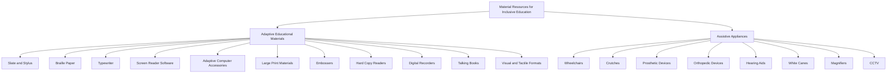

# Definition
Before proceeding, ensure you understand [[Resources_for_Inclusion]] as material resources are a specific type of support within this broader concept. **Material Resources for Inclusive Education** encompass the adaptive educational materials, devices, and assistive appliances that provide physical and sensory access to learning environments and activities for students with disabilities. It's like having specialized tools in a workshop: you need different hammers, wrenches, or saws to build various projects, just as students with diverse needs require specific materials and devices to access education.

# The Mental Model
Imagine a builder trying to construct a house with only one type of tool, regardless of the task. They'd struggle, or the house wouldn't be accessible. Material resources are like a builder's varied toolkit: a ramp for wheelchair access (assistive appliance), Braille paper for a visually impaired student (adaptive material), or a digital recorder for a student with writing difficulties (assistive device). Each tool serves a specific purpose, collectively building an inclusive educational environment.


```text
// Scenario 1: Breakdown of Material Resources for Inclusive Education.
// Output:
// A[Material Resources for Inclusive Education] is the main category.
// It branches into B[Adaptive Educational Materials] and C[Assistive Appliances].
// B[Adaptive Educational Materials] further branches into D[Slate and Stylus], E[Braille Paper], F[Typewriter], G[Screen Reader Software], H[Adaptive Computer Accessories], I[Large Print Materials], J[Embossers], K[Hard Copy Readers], L[Digital Recorders], M[Talking Books], and N[Visual and Tactile Formats].
// C[Assistive Appliances] further branches into O[Wheelchairs], P[Crutches], Q[Prosthetic Devices], R[Orthopedic Devices], S[Hearing Aids], T[White Canes], U[Magnifiers], and V[CCTV].
```
*Note: This `graph TD` illustrates the comprehensive range of material resources, categorized into adaptive educational materials and assistive appliances, essential for fostering inclusive education.*

# Context & Framework
### The Family Tree
Material resources for inclusive education represent a "family tree" of tools and technologies designed to bridge the gap between a student's impairment and their ability to access the curriculum. This includes adaptive educational materials that transform information into accessible formats (e.g., Braille, large print) and assistive appliances that provide physical support or compensate for sensory deficits (e.g., wheelchairs, hearing aids). This structured array of resources ensures that students with diverse needs can interact with their learning environment effectively, promoting independence and full participation.

# The Mastery Deep Dive
### The Family Tree
The "family tree" of material resources for inclusive education is extensive, addressing a wide array of sensory, physical, and cognitive access needs. Adaptive_Educational_Materials_And_Devices directly modify or present learning content in alternative formats; examples include Slate_And_Stylus and Braille_Paper for tactile writing, Screen_Reader_Software and Adaptive_Computer_Accessories for digital content, Large_Print_Materials and Embossers for visual enhancements, and Talking_Books for auditory learning. Complementing these are Assistive_Appliances, which provide physical or functional support, such as Wheelchairs and Crutches for mobility, Hearing_Aids for auditory enhancement, White_Canes for navigation, and Magnifiers for visual aids. This comprehensive suite of material resources empowers students with disabilities to engage with academic content and the school environment independently.

### The Cheat Code: How to Remember This
Think of "A.A.A." for "Adaptive, Assistive, Access." Adaptive materials *adapt* the content (like large print). Assistive appliances *assist* the body (like a wheelchair). Both enable *access* to education. Another way is to remember the sensory modalities they support: Visual (magnifiers, large print), Auditory (hearing aids, talking books), Tactile (Braille, slate and stylus), and Mobility (wheelchairs, crutches).

# Constraints & Limitations
### The "Duh!" Moment (Intuitive Proof)
A critical limitation is the assumption that one-size-fits-all materials are sufficient. Standard textbooks, for instance, are intuitively inadequate for a student who is blind or has severe dyslexia. This "duh!" moment underscores the fundamental need for adapted educational materials, demonstrating that a universal approach without specialized resources will inevitably exclude certain learners. This illustrates the intrinsic requirement to adapt methods and materials to students' learning styles and characteristics using multisensory and other specialized approaches.

# Significance & Application
Material resources are the tangible backbone of an accessible learning environment. Academically, this area of study falls within special education technology and universal design for learning, emphasizing the importance of diverse formats and tools. In practice, these resources enable students with disabilities to read, write, communicate, and navigate their school environment independently. From Braille textbooks to screen readers, and from wheelchairs to hearing aids, these materials are indispensable for ensuring equitable participation and academic success, directly impacting a student's ability to engage with curriculum and interact with peers.

# The Worked Example
Consider a student with a visual impairment in a mainstream classroom.

```mermaid
graph TD
    Teacher[Teacher] --> Student[Visually Impaired Student]
    Student -- Needs Access to --> Curriculum[Curriculum Content]

    SubGraph "Material Resources Applied"
        C1[Large Print Textbooks] --> Student
        C2[Screen Reader Software] --> Student
        C3[Adaptive Computer Accessories] --> Student
        C4[Digital Recorder] --> Student
        C5[Magnifier] --> Student
    End

    Curriculum -- Delivered via --> C1
    Curriculum -- Accessed via --> C2
    Curriculum -- Interacted via --> C3
    Curriculum -- Captured via --> C4
    Curriculum -- Enhanced via --> C5
```
```text
// Scenario 1: Material resource support for a visually impaired student.
// Output:
// The Teacher interacts with the Visually Impaired Student.
// The Student needs access to Curriculum Content.
// Various Material Resources are applied to help the student access the curriculum:
// - Large Print Textbooks
// - Screen Reader Software
// - Adaptive Computer Accessories
// - Digital Recorder
// - Magnifier
// These resources help deliver, access, interact with, capture, and enhance the curriculum content for the student.
```
*Note: This `graph TD` illustrates how various material resources are specifically deployed to ensure a visually impaired student can access and engage with curriculum content in an inclusive classroom.*

# The Proving Ground
*Test your mastery. Cover the solutions below to test yourself first.*

### Level 1: The Sanity Check (Verification)
**The Neighbor Check:** List three examples of material resources that are categorized as "adaptive educational materials."
> **Solution:** Slate and stylus, Braille paper, screen reader software, adaptive computer accessories, large print materials, embossers, hard copy readers, digital recorders, Talking Books, materials prepared in visual and tactile formats (any three are sufficient).

### Level 2: The Crucible (Mastery & Edge Cases)
**The Impostor:** A school's budget committee proposes to cut spending on "specialized equipment" like wheelchairs and hearing aids, arguing that "these are personal items that families should provide, not the school's responsibility." Explain why this argument is a 'false friend' to inclusive education and how the provision of such assistive appliances by the school is crucial for fostering an inclusive environment.
> **Solution:** This argument is a 'false friend' because it misinterprets the school's role in providing an accessible and inclusive learning environment. While some assistive appliances might be personal, the school's provision of items like **wheelchairs (for on-site use or emergencies)** and **hearing aids (or related amplification systems)** is often crucial for ensuring students can fully access and participate in all school-based services and activities. Excluding these due to perceived "personal item" status creates significant barriers to education, violating principles of accessibility and equity. These are essential tools for mitigating the impact of activity limitations, directly enabling students to use their potential and capacity by adapting methods and materials to their learning styles and characteristics.

# Key Takeaways
*   Material resources for inclusive education encompass adaptive educational materials and assistive appliances that provide physical and sensory access to learning environments.
*   These resources, such as Braille textbooks, screen reader software, wheelchairs, and hearing aids, are indispensable for enabling students with disabilities to participate independently in academic and school activities.
*   The thoughtful provision and adaptation of material resources are critical for overcoming barriers related to diverse learning styles and characteristics, fostering an equitable and accessible educational experience.

# Knowledge Graph Connections
| Concept                                       | Connection / Relationship                                                                   |
| :
-------------------------------------------- | :
------------------------------------------------------------------------------------------ |
| [[Resources_for_Inclusion]]                   | Material resources are a primary category of the broader concept of resources for inclusion. |
| [[Human_Resources_for_Inclusive_Education]]   | Human resources often utilize material resources to provide specialized support (e.g., Braille specialist using Braille paper). |
| [[Planning_for_Inclusive_Services]]           | Strategic planning is necessary to identify, procure, and deploy appropriate material resources for inclusion. |
---