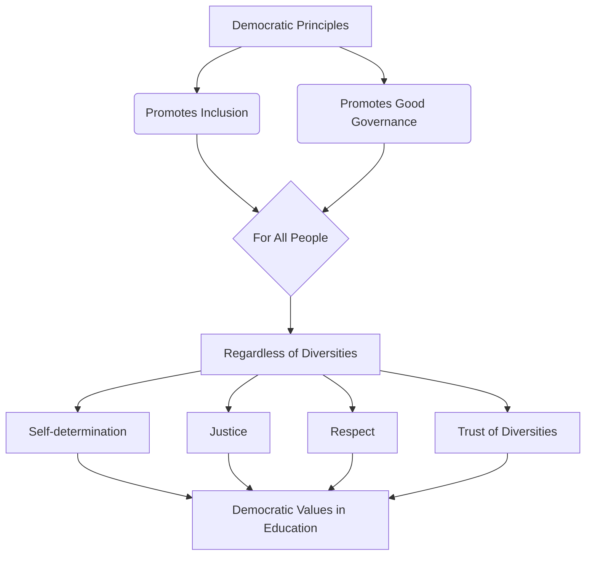
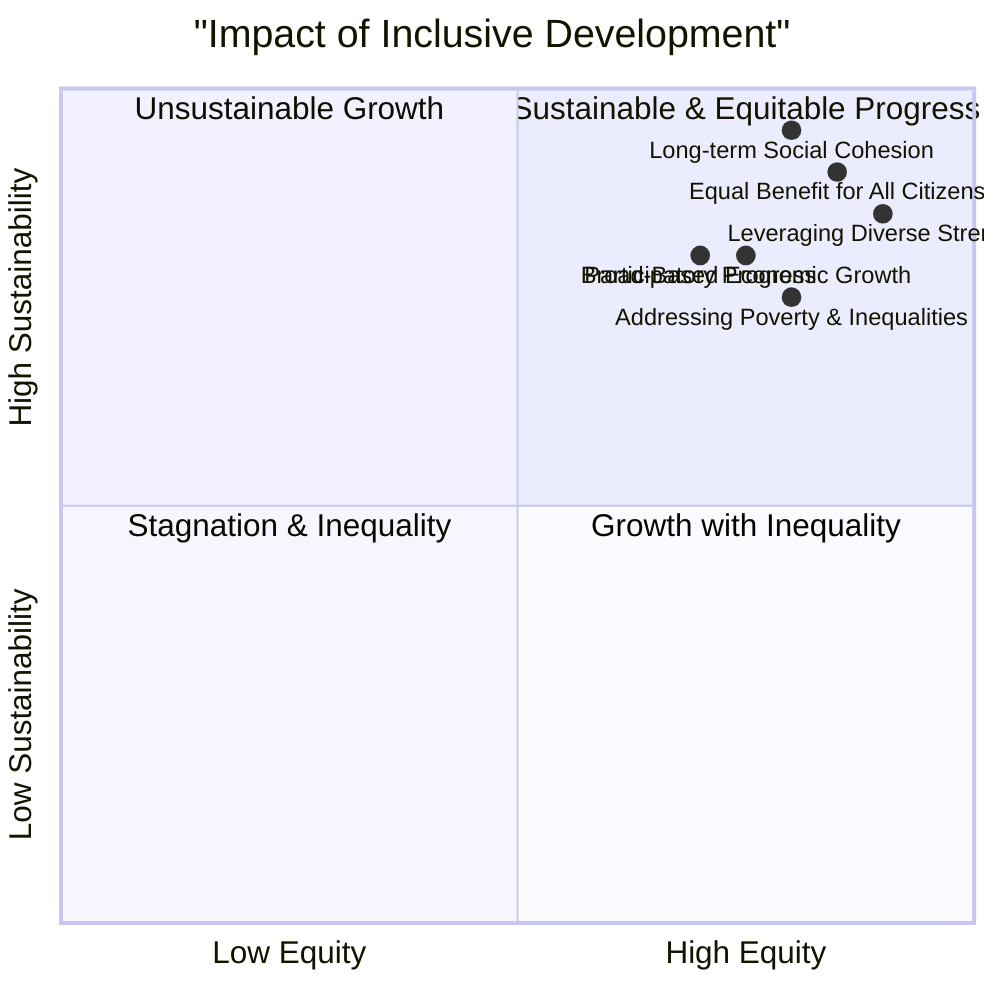
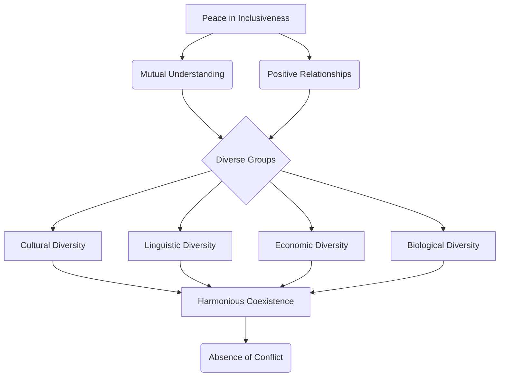
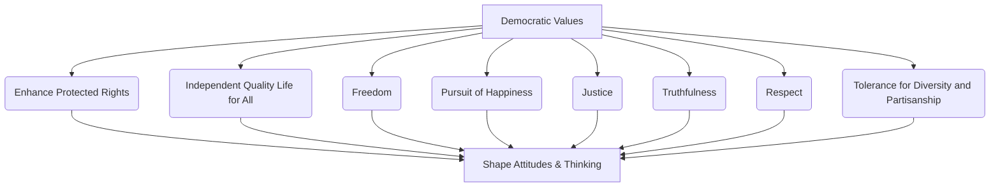
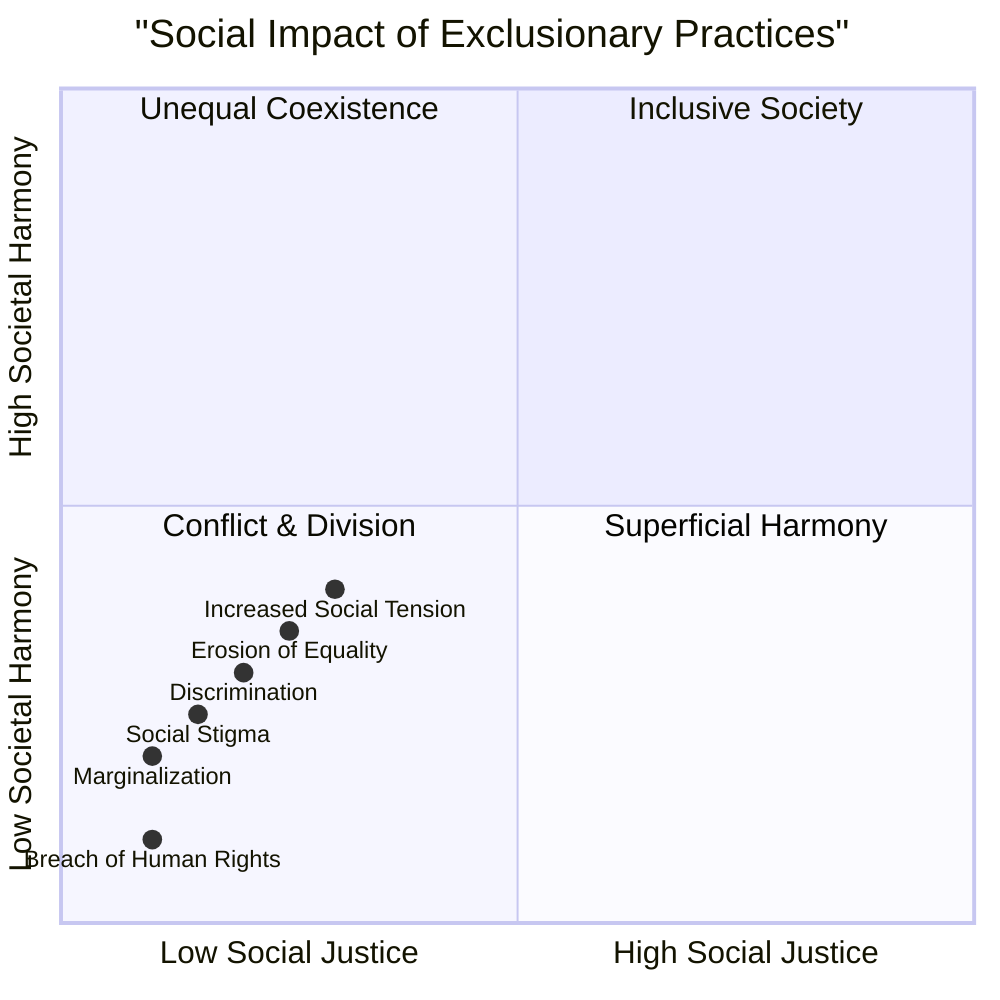
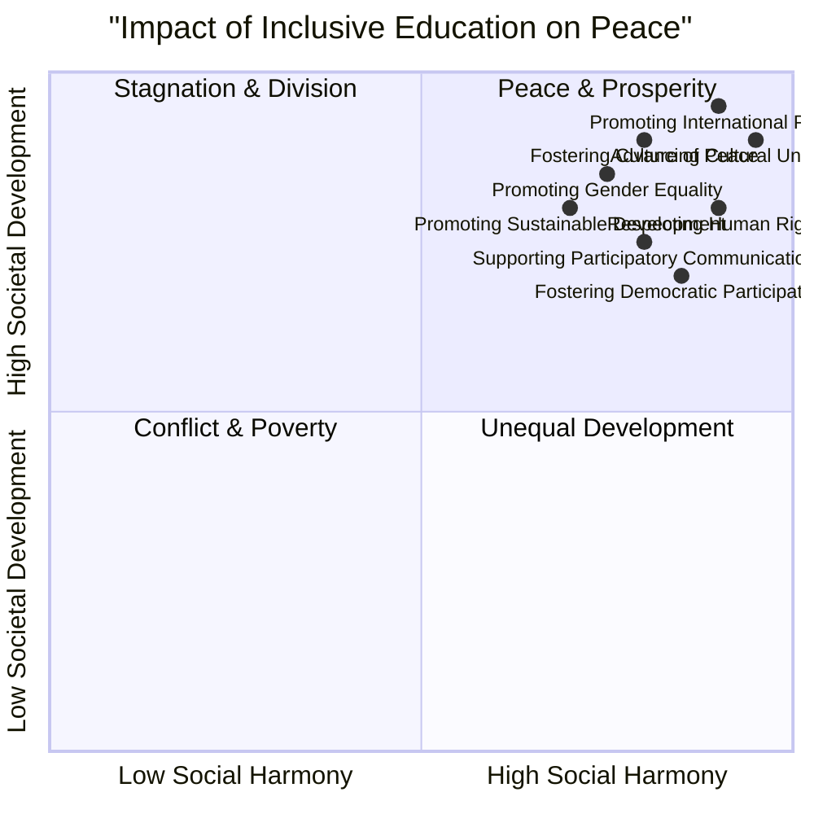
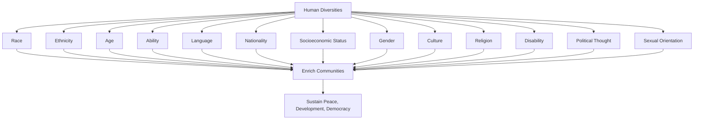
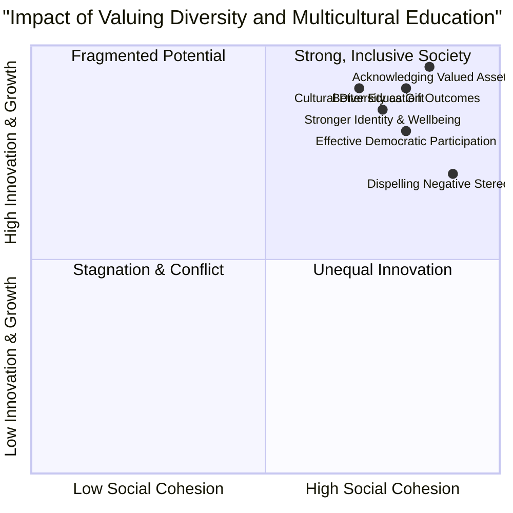

# 5 Inclusion For Peace Democracy And Development

Comprehensive resource for 5 Inclusion For Peace Democracy And Development.


---

## 5 Inclusion For Peace Democracy And Development Hub


## Overview
This unit delves into the critical interconnectedness of inclusion with peace, democracy, and development. It defines peace from an inclusiveness perspective, exploring how mutual understanding and positive relationships between diverse groups contribute to a harmonious society. The unit also examines the various sources of conflict that arise from the absence of inclusiveness, highlighting the detrimental impact of exclusionary practices. Furthermore, it articulates the democratic principles that underpin inclusive practices, emphasizing the role of education in fostering these values. Finally, the importance of respecting diverse needs, cultures, and values for achieving sustainable development and unity within a diverse society is explored.

## Learning Objectives
*   Define peace, democracy, and development from the perspective of inclusiveness.
*   Identify the crucial role of inclusive education in promoting a culture of peace, sustainable development, and gender equality.
*   Analyze the characteristics, behaviors, and attitudes that can lead to conflict in the absence of inclusiveness.
*   Explain the mechanisms for establishing sustainable peace and resolving conflicts non-violently.
*   Articulate the democratic principles that guide inclusive practices and the importance of instilling democratic values through education.
*   Discuss the significance of respecting diverse needs, cultures, and values for building a stronger sense of identity and well-being.
*   Distinguish between race and ethnicity as elements of diversity and understand their influence on human relationships.

## Unit Applications & Real-World Relevance
The principles discussed in this unit are directly applicable to fostering harmonious communities, developing effective social policies, and promoting sustainable progress at local, national, and international levels. Understanding the role of inclusive education is vital for educators, policymakers, and community leaders aiming to build equitable societies. The identification of conflict sources and resolution mechanisms provides practical tools for individuals and groups to navigate disagreements constructively. The emphasis on valuing diversity is essential for businesses, organizations, and governments seeking to create inclusive environments that leverage diverse strengths for innovation and growth.

## Active Learning Prompts
*   Consider a recent local or global conflict. How might a lack of inclusiveness have contributed to its escalation? What inclusive strategies could have been employed to prevent or resolve it?
*   Reflect on your own community or workplace. Identify one instance where diversity is highly valued and one area where there might be room for improvement in fostering inclusion. How would you propose addressing the latter?
*   Imagine you are designing a curriculum for primary school children on "Democracy and Peace." What are three key inclusive education principles you would integrate, and how would you implement them?

## Unit Challenges & Common Misconceptions
A common challenge in achieving inclusiveness is overcoming ingrained prejudices and stereotypes. Many individuals may intellectually agree with the concept of diversity but struggle with unconscious biases in practice. Another misconception is viewing inclusiveness as merely tolerance, rather than an active celebration and empowerment of differences. The idea that conflict is solely a result of external factors, rather than often originating from individual characteristics like selfishness or envy, is also a frequent misunderstanding. Addressing these challenges requires sustained effort in education, critical self-reflection, and systemic changes that promote equity and justice.

## Connections
  - [[Peace_in_Inclusiveness]]
    - [[Role_of_Inclusive_Education_in_Peace]]
    - [[Mechanisms_for_Sustainable_Peace]]
      - [[Prerequisites_for_Building_Peace]]
      - [[Conflict_Resolution_Mechanisms]]
  - [[Sources_of_Conflict_Absence_of_Inclusiveness]]
    - [[Exclusionary_Practices_and_Conflict]]
  - [[Democratic_Principles_for_Inclusive_Practices]]
    - [[Democratic_Values]]
    - [[Importance_of_Democratic_Inclusive_Education]]
  - [[Respecting_Diverse_Needs_in_Inclusive_Education]]
    - [[Types_of_Diversities]]
    - [[Valuing_Diversity_and_Multicultural_Education]]
      - [[Achieving_Unity_in_Diversity]]
      - [[Race_and_Ethnicity_Distinction]]
    - [[Inclusive_Development]]

## Next Steps for Deeper Understanding
To deepen your understanding, explore the Universal Declaration of Human Rights and its implications for inclusive societies. Research specific case studies of successful conflict resolution initiatives that employed inclusive strategies. Investigate how different countries implement multicultural education in their school systems. Consider engaging with local community organizations that promote diversity and inclusion to gain practical insights into real-world applications.

## Possible Questions
[[CC0113_5_Inclusion_for_Peace_Democracy_and_Development_Possible_Questions]]

---

---

## Democratic Principles For Inclusive Practices


## Definition
Before proceeding, ensure you master Concept_Of_Inclusion and [[Peace_in_Inclusiveness]] because democratic principles for inclusive practices are the foundational philosophy guiding how societies integrate diversity to achieve peace.
Democratic principles for inclusive practices represent the philosophical underpinnings that advocate for the promotion of inclusion and good governance, ensuring the well-being and representation of all people, irrespective of their diversities. These principles extend the concept of "rule of the people" to encompass every human being, bringing values like self-determination, justice, respect, and trust into educational and societal frameworks. A simpler way to think about it is like a constitution for fairness: these principles lay down the fundamental rules that ensure everyone has a voice, is treated equally, and contributes to the collective good.

## The Mental Model
Imagine a large, interconnected web where every single strand represents an individual, and every node where strands connect represents a community or institution. "Democratic Principles for Inclusive Practices" are like the foundational laws of physics governing this web: they ensure every strand has equal tension, no strand can dominate or break another, and the entire web (society) can flex and adapt while maintaining its integrity and supporting all its parts.


```text
// Scenario 1: Breakdown of democratic principles for inclusive practices
// Output:
// A visual representation of the graph diagram:
// "Democratic Principles" lead to "Promotes Inclusion" and "Promotes Good Governance".
// Both "Promotes Inclusion" and "Promotes Good Governance" are "For All People".
// "For All People" means "Regardless of Diversities".
// "Regardless of Diversities" contributes to "Self-determination", "Justice", "Respect", and "Trust of Diversities".
// All these lead to "Democratic Values in Education".
```
*Note: This `graph TD` illustrates the hierarchical breakdown of democratic principles, showing how they promote inclusion and good governance for all people, irrespective of diversities, and instill core values in education.*

## Context & Framework
#### The Rule of All, By All, For All
Democracy, when viewed through the lens of inclusive practices, is far more than a system of government; it is a philosophy that fundamentally shapes societal interaction. It moves beyond the traditional "rule of the majority" to genuinely embrace "the rule of the people, by the people, for the people," where "people" explicitly means all human beings, regardless of their diverse backgrounds. This framework posits that for democracy to truly flourish, it must actively promote inclusion and good governance, ensuring that the interests and contributions of every individual are valued. Education, in this context, becomes a crucial vehicle for instilling these democratic values, preparing citizens for active and equitable participation.

## The Mastery Deep Dive
#### Hierarchical Breakdown: Pillars of Inclusive Democracy
The democratic principles for inclusive practices are built upon a series of interconnected pillars that ensure true representation and equity.

*   **Core Philosophy:**
    *   **Promotes Inclusion:** This is the active process of ensuring all individuals, regardless of their differences, are part of societal structures and decision-making.
    *   **Promotes Good Governance:** This involves transparent, accountable, and participatory leadership that acts in the best interest of all citizens.
*   **Universal Scope:**
    *   **"For the People" means "All Human Being, Regardless of Diversities":** This expands the traditional democratic ideal to explicitly include cultural, linguistic, socioeconomic, and other forms of diversity, ensuring no group is systematically overlooked or marginalized.
*   **Instilled Values (especially through Education):**
    *   **Self-determination:** The right and ability of individuals and groups to make choices about their own lives and futures.
    *   **Justice:** The fair and equitable treatment of all individuals under the law and within societal structures.
    *   **Respect:** Valuing the dignity, autonomy, and contributions of others, even when opinions differ.
    *   **Trust of Diversities:** Building confidence and reliance on the different perspectives and strengths that diverse groups bring to a society.

These pillars are not independent but mutually reinforcing, creating a democratic system that is both robust and truly representative. Schools play a pivotal role in this process by actively helping students to realize and embody these foundational democratic values.

## Constraints & Limitations
#### The "Majority Rule" Trap
A significant trap in the application of democratic principles for inclusive practices is a narrow interpretation of "majority rule." While majority decision-making is a cornerstone of democracy, if it is not tempered by robust inclusive principles, it can lead to the marginalization and oppression of minority groups. This "majority rule" trap occurs when the needs, rights, and voices of minorities are overridden without due consideration, negotiation, or protection, under the guise of democratic process. For example, a decision made by a majority that negatively impacts a specific cultural minority without their meaningful input or safeguards is not truly inclusive, even if procedurally democratic. Such an approach undermines the very values of justice, respect, and trust of diversities that are essential for long-term societal peace and stability.

## Significance & Application
These principles are fundamental for developing equitable governance systems, fostering social cohesion, and ensuring that educational institutions prepare citizens for active, inclusive participation in society. They are applicable in policy-making, community development, and curriculum design.

## The Worked Example
This section details how a school implements democratic principles for inclusive practices.

Consider a secondary school aiming to foster a truly inclusive environment among its diverse student body.

**The Application:**
1.  **Promoting Inclusion and Good Governance:**
    *   **Student Council Reform:** Restructure the student council to ensure proportional representation from all major cultural, linguistic, and ability groups within the school. This ensures "promotes inclusion" and "good governance."
    *   **Open Forums:** Hold regular "town hall" style meetings where all students can voice concerns and contribute to school policy discussions.
2.  **Instilling Democratic Values in Education:**
    *   **Curriculum Integration:** Incorporate lessons on "self-determination," "justice," "respect," and "trust of diversities" into civics and social studies classes. Use case studies of historical and contemporary examples of these values in practice.
    *   **Peer Mediation Program:** Implement a peer mediation program where students are trained in conflict resolution skills, encouraging them to "respect for the differences" and "seek common ground" (linking to [[Conflict_Resolution_Mechanisms]]).
    *   **Fair Discipline Policies:** Develop transparent and consistently applied disciplinary policies that are perceived as fair by all students, reinforcing "justice" and building "trust."
3.  **Celebrating Diversity:**
    *   Organize "Diversity Weeks" where students from different backgrounds share their cultures, languages, and traditions, explicitly encouraging "acknowledging the validity of different cultural expressions and contributions" (linking to [[Achieving_Unity_in_Diversity]]).

By actively integrating these democratic principles, the school transforms from a mere learning institution into a microcosm of an inclusive society, preparing students to be active and responsible citizens.

## The Proving Ground
*Test your mastery. Cover the solutions below to test yourself first.*

#### Level 1: The Sanity Check (Verification)
**The Fact Check:** What is the core philosophy of democracy as it relates to promoting inclusion and good governance?
> **Solution:** Democracy is the philosophy that promotes inclusion and good governance to the best interest of people.

#### Level 2: The Crucible (Mastery & Edge Cases)
**The Sort:** Categorize a list of organizational policies as either reflecting democratic principles for inclusive practices or deviating from them: (a) Decisions made exclusively by senior management; (b) Employee committees with diverse representation contributing to policy; (c) Policies that explicitly protect minority group rights; (d) Favoring certain departments over others for resource allocation; (e) Regular, anonymous feedback mechanisms for all staff.
> **Solution:**
*   **Reflecting Democratic Principles for Inclusive Practices:** (b) Employee committees with diverse representation contributing to policy; (c) Policies that explicitly protect minority group rights; (e) Regular, anonymous feedback mechanisms for all staff.
*   **Deviating from Democratic Principles for Inclusive Practices:** (a) Decisions made exclusively by senior management; (d) Favoring certain departments over others for resource allocation.

#### Level 3: Mastery (The Crucible)
**The Impostor:** A newly formed community group claims to be democratic, stating their policies are "for the majority." Explain why this statement alone might not align with the democratic principles for inclusive practices as defined in the unit.
> **Solution:** While "for the majority" is a common democratic concept, this statement alone might not align with democratic principles for inclusive practices because, as defined in the unit, "people" in the "rule of the people, by the people, for the people" explicitly means "all human being, regardless of the diversities." A sole focus on the majority can lead to the "majority rule" trap, where the needs, rights, and voices of minority groups are overlooked or suppressed, undermining values such as justice, respect, and trust of diversities that are fundamental to truly inclusive democratic practice.

## Key Takeaways
*   Democratic principles for inclusive practices extend "rule of the people" to all human beings, promoting inclusion and good governance regardless of diversities.
*   They instill values like self-determination, justice, respect, and trust, particularly through education.
*   A narrow focus on "majority rule" without safeguarding minority rights can undermine true inclusive democratic practice.

## Knowledge Graph Connections
| Concept                                          | Connection / Relationship                                                                                                           |
| :
----------------------------------------------- | :
---------------------------------------------------------------------------------------------------------------------------------- |
| [[Peace_in_Inclusiveness]]                       | These principles create the societal conditions necessary for peace through mutual understanding and positive relationships.        |
| [[Democratic_Values]]                            | These principles are the overarching philosophy that promotes and reinforces specific democratic values.                            |
| [[Importance_of_Democratic_Inclusive_Education]] | Democratic inclusive education is crucial for instilling these principles and their associated values in individuals.              |
| [[Respecting_Diverse_Needs_in_Inclusive_Education]] | Inclusive education, guided by these principles, practices respect for diverse needs, potentials, and learning styles.               |
| [[Sources_of_Conflict_Absence_of_Inclusiveness]] | By promoting inclusion and good governance, these principles directly counteract the individual sources and manifestations of conflict. |
---

---

## Inclusive Development


## Definition
Before proceeding, ensure you master Concept_Of_Inclusion and [[Democratic_Principles_for_Inclusive_Practices]] because inclusive development is the practical application of inclusive principles within a democratic framework to achieve progress for all.
Inclusive development refers to a comprehensive approach to economic, social, and political progress that is designed to be all-encompassing and participatory, actively promoting equal benefit for all citizens from the heritage of prosperity earned by society, regardless of their diversities. It is necessary for sustainable progress because it ensures no one is left behind, leveraging the strengths of [[Types_of_Diversities]] to achieve equitable outcomes and shared prosperity. A simpler way to think about it is like building a communal home: inclusive development ensures that every member of the family contributes to its construction and equally benefits from its shelter, resources, and growth, regardless of their individual roles or needs.

## The Mental Model
Imagine a large, intricate irrigation system for an entire agricultural region. "Inclusive Development" is like designing this system so that water (representing resources, opportunities, and benefits) reaches every single farm and every single crop, from the largest estates to the smallest family plots, ensuring equitable distribution and enabling all parts of the region to flourish sustainably. If any area is cut off, the entire system eventually suffers.


```text
// Scenario 1: Comprehensive impact of inclusive development
// Output:
// A visual representation of the quadrant chart showing multiple data points clustered in the "Sustainable & Equitable Progress" quadrant (top-right).
// Each data point (e.g., "Equal Benefit for All Citizens", "Participatory Progress") will be positioned based on its X and Y coordinates, indicating its strong positive contribution to both equity and sustainability.
// The overall visual indicates that inclusive development significantly enhances both equity and sustainability, leading to sustainable and equitable progress.
```
*Note: This `quadrantChart` qualitatively visualizes the positive impact of inclusive development across two axes: equity and sustainability, demonstrating its role in achieving sustainable and equitable progress.*

## Context & Framework
#### Prosperity for All, By All
Inclusive development represents a paradigm shift from traditional growth models that often prioritize aggregate economic indicators while overlooking widening disparities. This framework firmly positions development as a process that must be "all inclusive and participatory," ensuring that the benefits of progress—the "heritage of prosperity"—are equitably shared among all citizens. It recognizes that sustainable economic, social, and political progress is unattainable if significant segments of the population are marginalized or excluded. This approach is not simply about charity; it's a strategic imperative that leverages the full potential of a diverse populace, fostering social cohesion and preventing the [[Sources_of_Conflict_Absence_of_Inclusiveness]] that can derail progress. It is inherently linked to [[Democratic_Principles_for_Inclusive_Practices]] and the active promotion of [[Valuing_Diversity_and_Multicultural_Education]].

## The Mastery Deep Dive
#### Qualitative Analysis: Impact of Inclusive Development
The impact of inclusive development on societal progress is profound and multi-dimensional:

*   **Equal Benefit for All Citizens:** This is the cornerstone of inclusive development, ensuring that economic growth, social services, and political opportunities are accessible and beneficial to every individual, regardless of their background or identity. It actively works to close gaps in wealth, health, and education.
*   **Participatory Progress:** Inclusive development emphasizes that all citizens, especially those from marginalized groups, must have a voice and a role in shaping development agendas and processes. This ensures that development initiatives are relevant, responsive, and truly reflective of diverse needs, fostering ownership and sustainability.
*   **Leveraging Diverse Strengths:** By actively including all [[Types_of_Diversities]], inclusive development harnesses a broader range of skills, perspectives, and innovative ideas. This leads to more robust and creative solutions to complex societal challenges, boosting overall productivity and resilience.
*   **Addressing Poverty and Social Inequalities:** A core objective is to systematically reduce poverty and dismantle social inequalities that exclude certain groups from opportunities. This includes targeted interventions in education, healthcare, employment, and infrastructure to ensure equitable access.
*   **Long-term Social Cohesion:** By ensuring equitable benefits and participation, inclusive development builds trust, reduces grievances, and strengthens the social fabric. This leads to more stable and cohesive societies, less prone to internal conflict and more resilient to external shocks.
*   **Sustainable Economic, Social, and Political Progress:** Ultimately, by including everyone, development becomes more sustainable. Economic growth is broad-based, social progress is deep-rooted, and political stability is enhanced through universal participation and perceived fairness. This is crucial for achieving long-term [[Peace_in_Inclusiveness]].

This qualitative impact highlights why inclusive development is not an optional add-on but an essential, transformative approach to societal progress.

## Constraints & Limitations
#### The "Top-Down" Trap
A significant trap in implementing inclusive development is the "top-down" trap, where development initiatives are conceived and mandated by central authorities without genuine, participatory input from the diverse communities they aim to serve. While central planning can offer efficiency, if it lacks authentic consultation and local ownership, it often fails to address the actual needs, priorities, or cultural contexts of marginalized groups. This "top-down" approach can inadvertently perpetuate exclusion by imposing solutions that are irrelevant or even detrimental to certain populations, undermining the very essence of "participatory progress" and "equal benefit for all citizens." Such initiatives, despite good intentions, can lead to resentment, resistance, and ultimately, unsustainable outcomes, as they fail to leverage the "diverse strengths" of the entire populace.

## Significance & Application
Inclusive development is crucial for creating just, equitable, and sustainable societies. It guides national development strategies, international aid programs, and local community projects, ensuring that economic growth and social progress benefit all segments of the population.

## The Worked Example
This section details how a national government implements an inclusive development strategy for its rural communities.

Consider a national government launching a comprehensive rural development program aimed at improving living standards and economic opportunities in diverse, often marginalized, rural communities.

**The Application:**
1.  **Participatory Needs Assessment:**
    *   Instead of making decisions centrally, the government dispatches multi-disciplinary teams to conduct extensive consultations and workshops in each rural community. These teams engage with farmers, women's groups, ethnic minority representatives, and local leaders to identify their specific needs and priorities, ensuring "participatory progress."
    *   This includes understanding the unique [[Types_of_Diversities]] present in each community to tailor interventions.
2.  **Tailored Economic Opportunities:**
    *   Based on local input, the program funds diverse economic initiatives. In one region, this might be agricultural cooperatives with training in sustainable farming; in another, it could be supporting artisan crafts for export, or investing in rural tourism. This ensures "equal benefit for all citizens" by leveraging local strengths.
    *   Training programs are provided in local languages and adapted to varying literacy levels, directly linking to [[Respecting_Diverse_Needs_in_Inclusive_Education]].
3.  **Equitable Infrastructure Development:**
    *   Investments in infrastructure (e.g., roads, clean water, schools, healthcare facilities) are prioritized based on indices of poverty and marginalization, ensuring that previously underserved areas receive focused attention, thereby "addressing poverty and social inequalities."
    *   Access to these services is made universal, with cultural and linguistic considerations taken into account (e.g., culturally sensitive healthcare services).
4.  **Strengthening Local Governance:**
    *   The program includes components to strengthen local governance structures, empowering community councils and ensuring transparent allocation of resources, aligning with "good governance" (a [[Democratic_Principles_for_Inclusive_Practices]]).

Through these integrated and participatory approaches, the national government implements inclusive development, ensuring that progress reaches and benefits all its citizens, leading to more sustainable and equitable outcomes across the nation.

## The Proving Ground
*Test your mastery. Cover the solutions below to test yourself first.*

#### Level 1: The Sanity Check (Verification)
**The Fact Check:** Why is inclusive development considered necessary for sustainable progress?
> **Solution:** Because it should be all inclusive and participatory that promotes equal benefit for all citizens from the heritage of prosperity earned by the society.

#### Level 2: Competence (Application)
**The Trade-off:** A development project is proposed for a rural community. Option A maximizes economic output (e.g., large-scale monoculture farming) but primarily benefits a select few landowners. Option B aims for equitable distribution of benefits (e.g., smallholder cooperatives, diversified local markets) but with slower, more localized economic growth. Justify which option aligns with the principles of inclusive development.
> **Solution:** Option B, which aims for equitable distribution of benefits through smallholder cooperatives and diversified local markets, aligns better with the principles of inclusive development. While Option A might show higher aggregate economic output, it exacerbates inequality and marginalization, failing to provide "equal benefit for all citizens." Inclusive development, as defined in the unit, emphasizes being "all inclusive and participatory," ensuring broad-based prosperity. Option B, despite potentially slower initial growth, fosters long-term social cohesion, leverages diverse strengths, and addresses poverty and social inequalities, making it a truly sustainable and inclusive approach to development.

#### Level 3: Mastery (The Crucible)
**The Lose-Lose Scenario:** A country must rapidly industrialize (Option X) to compete globally, which might initially exacerbate existing inequalities and displace marginalized communities. Alternatively, a slower, more equitable development path (Option Y) risks falling behind economically and delaying improvements in living standards. How can a nation choose the 'least bad' development strategy that still aims for inclusive development, given such high stakes?
> **Solution:** In this "lose-lose" scenario, the nation should choose a modified version of the slower, more equitable development path (Option Y), but with strategic, targeted investments to mitigate economic lag. While rapid industrialization (Option X) might offer short-term global competitiveness, the "Qualitative Analysis: Impact of Inclusive Development" clearly shows that development that exacerbates inequalities is "Unsustainable Growth" and ultimately leads to "Stagnation & Inequality" in the long run. The 'least bad' path for inclusive development would be to prioritize broad-based benefits and participation, even if it's slower, while simultaneously seeking international partnerships, technological transfers, or specific niche market development that allows for competitive gains without sacrificing equity. This approach would involve strong social safety nets, robust educational investments (linking to [[Importance_of_Democratic_Inclusive_Education]]), and empowerment of marginalized communities to ensure their participation and benefit, preventing the "top-down" trap and ensuring development is genuinely "all inclusive and participatory."

## Key Takeaways
*   Inclusive development is a comprehensive, participatory approach to progress that promotes equal benefit for all citizens, regardless of diversities.
*   It is necessary for sustainable progress by addressing poverty, inequality, and leveraging diverse strengths.
*   The "top-down" trap, where initiatives lack local input, can undermine participatory progress and lead to unsustainable outcomes.

## Knowledge Graph Connections
| Concept                                          | Connection / Relationship                                                                                                           |
| :
----------------------------------------------- | :
---------------------------------------------------------------------------------------------------------------------------------- |
| [[Types_of_Diversities]]                         | Inclusive development ensures that benefits are equitably distributed across all these diverse categories of people.                 |
| [[Democratic_Principles_for_Inclusive_Practices]] | This concept is a practical application of democratic principles, emphasizing participation and good governance for all.            |
| [[Valuing_Diversity_and_Multicultural_Education]] | Inclusive development is strengthened by actively valuing diversity and promoting multicultural understanding.                      |
| [[Achieving_Unity_in_Diversity]]                 | By ensuring equitable benefits and participation, inclusive development significantly contributes to achieving unity in diversity. |
| [[Peace_in_Inclusiveness]]                       | Inclusive development contributes to long-term peace by fostering social cohesion and reducing grievances arising from inequality. |
---

---

## Peace In Inclusiveness


## Definition
Before proceeding, ensure you master Understanding_Disability_And_Vulnerability and Concept_Of_Inclusion because peace in inclusiveness builds upon the foundation of recognizing and valuing all individuals.
Peace, within the perspective of inclusiveness, is defined as the active creation of mutual understanding and positive relationships among individuals and diverse groups. These groups encompass a wide array of cultural, linguistic, economic, and biological differences, emphasizing harmonious coexistence without conflict. A simpler way to think about it is like a diverse orchestra: each musician (individual/group) plays their part, understanding and respecting the others, to create a beautiful, unified sound (peace).

## The Mental Model
Imagine a vibrant community garden. Each type of plant, from the tallest sunflower to the smallest herb, represents a different individual or group with unique characteristics. "Peace in Inclusiveness" is like ensuring all these plants can grow side by side, receiving the sunlight and water they need, respecting each other's space, and collectively contributing to the beauty and bounty of the garden.


```text
// Scenario 1: Basic Definition of Peace in Inclusiveness
// Output:
// A visual representation of the graph diagram:
// "Peace in Inclusiveness" leads to "Mutual Understanding" and "Positive Relationships".
// Both "Mutual Understanding" and "Positive Relationships" contribute to "Diverse Groups".
// "Diverse Groups" include "Cultural Diversity", "Linguistic Diversity", "Economic Diversity", and "Biological Diversity".
// All forms of diversity lead to "Harmonious Coexistence".
// "Harmonious Coexistence" results in "Absence of Conflict".
```
*Note: This `graph TD` illustrates the hierarchical breakdown of the core elements that constitute peace from an inclusiveness perspective, starting from the central concept and branching out to its foundational components.*

## Context & Framework
#### Defining Peace Beyond Absence of War
Traditionally, peace is often understood as merely the absence of war or overt conflict. However, from the perspective of inclusiveness, peace is an active and dynamic state that requires continuous effort. It's about cultivating deep respect, justice, tolerance, and cooperation among all persons, ensuring human beings are free from negative forces like fear, hatred, tension, and violence. This broader definition moves beyond simply not fighting, to actively building interpersonal harmony and societal friendship across all forms of diversity.

## The Mastery Deep Dive
#### The Family Tree: Elements of Peace
Peace, within the inclusive framework, is not a monolithic concept but a composite of several interconnected elements, forming a 'family tree' of principles. At its root is the recognition of human interconnectedness, meaning no individual exists in isolation. Branching from this are mutual understanding and positive relationships, which are cultivated by deep respect for others, a commitment to justice, and a practice of tolerance and cooperation. This intricate structure ensures that harmony extends beyond mere coexistence to a genuine appreciation of reciprocal respect among all diverse groups—culturally, linguistically, economically, and biologically.

## Constraints & Limitations
#### The Cognitive Trap: Surface-Level Peace
A significant trap in understanding peace from an inclusiveness perspective is mistaking superficial tranquility for genuine harmony. A society might appear peaceful on the surface, with no overt conflicts, but still harbor deep-seated prejudices, discrimination, or systemic inequalities. This is a form of "surface-level peace" that lacks the crucial elements of mutual understanding, deep respect, justice, and active cooperation across diverse groups. Such a state is fragile and susceptible to conflict, as it fails to address the underlying causes of division and exclusion.

## Significance & Application
Peace, as defined by inclusiveness, is fundamental for societal well-being and progress. It ensures that diverse populations can coexist and thrive, contributing their unique strengths to collective development. This concept is vital in education, policymaking, and community building, promoting justice and preventing social unrest.

## The Worked Example
This section will detail the application of inclusive peace in a community setting.

Consider a community where various ethnic groups coexist but largely keep to themselves, with minimal intergroup interaction. While there's no overt conflict, there isn't deep mutual understanding or strong positive relationships.

**The Application:**
1.  **Identify the Gap:** The community lacks active mutual understanding and positive intergroup relationships.
2.  **Inclusive Education Intervention:** Implement formal and informal inclusive education programs.
    *   **Formal:** Introduce school curricula that teach cultural diversity, promote empathy, and include historical narratives from all ethnic groups. This fosters [[Role_of_Inclusive_Education_in_Peace]].
    *   **Informal:** Organize community-wide cultural festivals, intergroup dialogues, and joint development projects.
3.  **Promote Competencies:** Focus on developing competencies like "respect for different points of view" and "skills to resolve conflict in non-violent ways" (as detailed in [[Mechanisms_for_Sustainable_Peace]]).
4.  **Monitor & Evaluate:** Observe increased intergroup interaction, shared activities, and a reduction in stereotypes. The goal is to move beyond mere coexistence to genuine societal friendship and active mutual understanding, where individuals are free from fear and tension.

This example illustrates how actively building mutual understanding and positive relationships through inclusive education shifts a community from passive coexistence to active, inclusive peace.

## The Proving Ground
*Test your mastery. Cover the solutions below to test yourself first.*

#### Level 1: The Sanity Check (Verification)
**The Fact Check:** For the purpose of this course, what are the two primary components that define peace from the perspective of inclusiveness?
> **Solution:** Mutual understanding and positive relationships between individuals and groups.

#### Level 2: The Crucible (Mastery & Edge Cases)
**The Impostor:** A neighborhood boasts a low crime rate and residents rarely interact, each living quietly in their own homes without disturbance. While no conflicts are reported, why might this scenario *not* fully embody peace from an inclusiveness perspective according to the course's definition?
> **Solution:** This scenario might not fully embody peace in inclusiveness because, while there is an absence of overt conflict, it lacks the active components of "mutual understanding" and "positive relationships between individuals and groups." The residents are merely coexisting without active engagement or deep respect for one another's diversities. The unit emphasizes developed interpersonal peace through justice, tolerance, and cooperation, which are not demonstrated by passive non-interaction.

## Key Takeaways
*   Peace in inclusiveness is an active state characterized by mutual understanding and positive relationships among diverse groups, moving beyond the mere absence of conflict.
*   This form of peace requires deep respect, justice, tolerance, and cooperation, liberating individuals from negative forces like fear and hatred.
*   It is crucial for fostering harmonious coexistence and ensuring all members of society, regardless of their differences, can thrive and contribute.

## Knowledge Graph Connections
| Concept                                          | Connection / Relationship                                                                                                           |
| :
----------------------------------------------- | :
---------------------------------------------------------------------------------------------------------------------------------- |
| [[Role_of_Inclusive_Education_in_Peace]]         | Inclusive education is crucial for fostering the values and attitudes inherent in a culture of peace.                               |
| [[Mechanisms_for_Sustainable_Peace]]             | The foundation of sustainable peace involves the expansion of formal and informal inclusive education.                              |
| [[Sources_of_Conflict_Absence_of_Inclusiveness]] | Conflict arises from the absence of inclusiveness, highlighting the antithesis of peace in diverse groups.                          |
| [[Democratic_Principles_for_Inclusive_Practices]] | Democracy promotes inclusion and good governance, aligning with the principles of peace.                                            |
| [[Valuing_Diversity_and_Multicultural_Education]] | Valuing diversities is essential for sustaining peace, development, and democracy.                                                  |
---

---

## Respecting Diverse Needs In Inclusive Education


## Definition
Before proceeding, ensure you master Concept_Of_Inclusion and [[Democratic_Principles_for_Inclusive_Practices]] because respecting diverse needs in inclusive education is a practical application of these core ideas.
Respecting diverse needs in inclusive education refers to the fundamental practice of recognizing, valuing, and accommodating the unique requirements, potentials, learning styles, and working styles of all individuals within an educational setting. This practice is rooted in democratic principles, asserting that diversity enriches communities and that every learner is capable of fulfilling their potential when individual requirements are taken into account. A simpler way to think about it is like a master chef catering to various dietary restrictions: they understand that not everyone can eat the same thing, so they skillfully adapt their recipes to ensure everyone is nourished and enjoys the meal.

## The Mental Model
Imagine a forest where every plant needs a different amount of light, water, and soil type to thrive. "Respecting Diverse Needs in Inclusive Education" is like a thoughtful gardener who understands each plant's specific requirements. Instead of giving all plants the same amount of water and placing them all in direct sunlight, the gardener adapts—providing shade for some, more water for others, and special soil for unique species. This individualized care ensures every plant (learner) can grow to its fullest potential.

## Context & Framework
#### The Imperative of Personalized Learning for All
Inclusive education, at its core, is a commitment to the principle that every learner matters and has the right to reach their full potential. This necessitates a profound shift from a "one-size-fits-all" approach to one that actively engages with and respects the diverse needs, potentials, learning styles, and working styles present in any classroom. This framework asserts that diversity is not a challenge to be overcome but a strength that enriches the entire educational community. By valuing and celebrating individual achievements according to each person's unique potential, inclusive education fosters an environment where all learners feel supported, respected, and capable of contributing their best.

## The Mastery Deep Dive
#### Hierarchical Breakdown: Principles of Inclusive Education
Inclusive education is practiced based on several core principles derived from democratic ideals, ensuring that all learners are genuinely valued and supported:

*   **Foundation of Diversity:**
    *   **Diversity enriches and strengthens all communities:** This principle acknowledges that a variety of perspectives, experiences, and backgrounds brings innovation, resilience, and a broader understanding to society. It moves beyond mere tolerance to active appreciation.
*   **Individualized Recognition:**
    *   **All persons with disabilities are different in their needs, potentials, learning, and working styles:** This specific focus recognizes that disability is a spectrum, and each individual's journey and requirements are unique. It rejects monolithic views and calls for personalized understanding.
    *   **Their achievements according to their potentials are equally valued, respected, and celebrated by society:** This emphasizes an outcome-focused approach where success is measured relative to individual capabilities, not against a uniform standard. It promotes self-worth and validates diverse forms of achievement.
*   **Universal Capability:**
    *   **All learners are capable to fulfill their potential by taking into account individual requirements and needs:** This is an aspirational and empowering principle. It posits that with appropriate support, accommodations, and tailored instruction, every learner possesses the inherent ability to grow and achieve, debunking deficit-based models of education.

These principles collectively create an educational ecosystem that is responsive, equitable, and nurturing, serving as a model for broader societal inclusion.

## Constraints & Limitations
#### The "Equality-as-Sameness" Trap
A significant trap in respecting diverse needs in inclusive education is the "equality-as-sameness" trap. This occurs when educators or systems mistakenly believe that treating all students "equally" means treating them identically, providing the same resources, and holding them to the same exact standards, without consideration for their unique needs. For example, providing identical worksheets to a visually impaired student and a sighted student, or expecting the same pace from a student with a learning disability as from a neurotypical student, demonstrates equality but lacks equity. This approach inadvertently creates barriers for those with diverse needs, leading to their exclusion and hindering their ability to fulfill their potential. True respect for diverse needs demands differentiating instruction and providing tailored support, not a uniform application of rules.

## Significance & Application
This concept is fundamental for creating equitable and effective educational systems. It guides pedagogical approaches, curriculum development, and resource allocation to ensure that every student, regardless of their background or ability, has the opportunity to succeed and contribute.

## The Worked Example
This section illustrates how a classroom implements the principle of respecting diverse needs in inclusive education.

Consider a diverse elementary school classroom with students who have varying learning styles, some with mild learning disabilities, and some who are English language learners.

**The Application:**
1.  **Recognizing Diverse Needs:**
    *   The teacher observes that some students learn best visually, others through hands-on activities, and some need more time to process information. There are also students struggling with English comprehension.
2.  **Implementing Inclusive Practices:**
    *   **Multi-Modal Instruction:** When teaching a new concept (e.g., fractions), the teacher uses a variety of methods:
        *   **Visual:** Displays large, colorful fraction charts and uses a projector.
        *   **Kinesthetic:** Provides manipulatives (fraction bars, playdough) for students to physically divide and combine.
        *   **Auditory:** Explains the concept verbally, provides audio recordings of instructions.
    *   **Differentiated Assignments:** While all students work on fractions, the teacher offers different levels of complexity for homework, or allows some students to complete fewer problems with deeper explanations, matching "their achievements according to their potentials."
    *   **Language Support:** For English language learners, the teacher provides translated key terms, uses simplified language in instructions, and pairs them with bilingual peers, taking into account "individual requirements and needs."
    *   **Flexible Seating:** Offers various seating options (e.g., standing desks, wobble stools, quiet corners) to accommodate different working styles.

This approach ensures that every student, irrespective of their specific needs or learning style, is given the opportunity to engage with the material, understand it, and achieve success, thereby exemplifying respecting diverse needs in inclusive education.

## The Proving Ground
*Test your mastery. Cover the solutions below to test yourself first.*

#### Level 1: The Sanity Check (Verification)
**The Fact Check:** What is one core principle upon which inclusive education is practiced, related to diversity?
> **Solution:** Diversity enriches and strengthens all communities; all persons with disabilities different in their needs, potentials, learning and working styles; their achievements according to their potentials are equally valued, respected and celebrated by society; all learners are capable to fulfill their potential by taking into account individual requirements and needs. (Any one is acceptable).

#### Level 2: The Crucible (Mastery & Edge Cases)
**The Sort:** Given several classroom scenarios, identify which demonstrate a respect for diverse needs, potentials, and learning styles: (a) All students receive the same textbook and assignment; (b) Teachers offer project-based learning alongside traditional exams; (c) Flexible seating options are provided for students; (d) Remedial classes are segregated by ability; (e) Students are encouraged to use various tools (e.g., speech-to-text) for assignments.
> **Solution:**
*   **Demonstrate Respect for Diverse Needs:** (b) Teachers offer project-based learning alongside traditional exams; (c) Flexible seating options are provided for students; (e) Students are encouraged to use various tools (e.g., speech-to-text) for assignments.
*   **Do Not Demonstrate Respect for Diverse Needs:** (a) All students receive the same textbook and assignment; (d) Remedial classes are segregated by ability.

#### Level 3: Mastery (The Crucible)
**The Impostor:** A school proudly states that all its students receive the exact same curriculum and teaching methods to ensure "equality." Explain why this approach, despite good intentions, might *not* truly respect diverse needs in inclusive education.
> **Solution:** This approach, despite good intentions, might not truly respect diverse needs in inclusive education because it falls into the "equality-as-sameness" trap. While it promotes "equality" by treating everyone the same, it neglects "equity," which is essential for inclusivity. As the unit highlights, "all persons with disabilities are different in their needs, potentials, learning and working styles," and "all learners are capable to fulfill their potential by taking into account individual requirements and needs." A uniform curriculum and teaching method fail to acknowledge these inherent differences, thereby creating barriers for students with varied needs and ultimately hindering their ability to achieve their full potential, rather than celebrating it.

## Key Takeaways
*   Respecting diverse needs in inclusive education means valuing unique requirements, potentials, and learning styles of all individuals.
*   It is rooted in democratic principles, asserting that diversity enriches communities and that every learner can fulfill their potential with tailored support.
*   The "equality-as-sameness" trap, where identical treatment is mistaken for inclusion, actually creates barriers for those with diverse needs.

## Knowledge Graph Connections
| Concept                                          | Connection / Relationship                                                                                                           |
| :
----------------------------------------------- | :
---------------------------------------------------------------------------------------------------------------------------------- |
| [[Democratic_Principles_for_Inclusive_Practices]] | This practice is a direct application of the democratic principles that promote inclusion and good governance for all.              |
| [[Types_of_Diversities]]                         | Understanding and respecting these diverse needs requires a clear grasp of the various types of human diversities.                   |
| [[Importance_of_Democratic_Inclusive_Education]] | This concept is a core component of democratic inclusive education's ability to ensure better learning opportunities for all.         |
| [[Valuing_Diversity_and_Multicultural_Education]] | Valuing diversity is the overarching principle that directly informs and enables the respect for diverse needs in education.        |
| [[Achieving_Unity_in_Diversity]]                 | By respecting diverse needs, education contributes to the broader goal of achieving unity by celebrating unique contributions.       |
---

---

## Sources Of Conflict Absence Of Inclusiveness


## Definition
Before proceeding, ensure you master [[Peace_in_Inclusiveness]] and Concept_Of_Inclusion because understanding the sources of conflict in the absence of inclusiveness is crucial for appreciating the value of these foundational concepts.
Sources of conflict in the absence of inclusiveness refer to the individual characteristics, behaviors, and attitudes that arise when diversity is not respected or valued, leading to social stratification, tension, and ultimately, discord at various societal levels. These sources, rooted in personal failings like selfishness and prejudice, manifest as exclusionary practices that undermine social justice and equality. A simpler way to think about it is like a hidden infection: without the "immune system" of inclusiveness, these internal negative traits fester and spread, causing widespread societal illness (conflict).

## The Mental Model
Imagine a diverse group of children trying to build a complex Lego castle together. If one child is driven by "Selfishness" and only wants their pieces to be visible, or another acts with "Prejudice" and refuses to let a third child contribute because of how they look, the castle will never be built, or it will collapse into "Conflict." The "Absence of Inclusiveness" means these negative individual traits dictate the interaction, leading to breakdown.

```mermaid
graph TD
    A[Absence of Inclusiveness] --> B(Individual Characteristics/Behaviors)
    B --> C[Selfishness (living only for oneself)]
    B --> D[Lust]
    B --> E[Envy]
    B --> F[Exploitation (taking advantage over others)]
    B --> G[Prejudice (partiality)]
    B --> H[Self-indulgence]
    B --> I[Vengeance (retaliation)]
    B --> J[Arrogance (self-importance)]
    B --> K(Malpractices/Exclusionary Practices)
    K --> L[Discrimination]
    K --> M[Marginalization]
    K --> N[Social Stigma]
    K --> O(Conflict at all levels of social strata)
```
```text
// Scenario 1: Breakdown of conflict sources
// Output:
// A visual representation of the graph diagram:
// "Absence of Inclusiveness" leads to "Individual Characteristics/Behaviors".
// These behaviors include "Selfishness", "Lust", "Envy", "Exploitation", "Prejudice", "Self-indulgence", "Vengeance", and "Arrogance".
// All these individual characteristics/behaviors lead to "Malpractices/Exclusionary Practices".
// "Malpractices/Exclusionary Practices" manifest as "Discrimination", "Marginalization", and "Social Stigma".
// Ultimately, these lead to "Conflict at all levels of social strata".
```
*Note: This `graph TD` illustrates the hierarchical breakdown of how individual negative characteristics, stemming from an absence of inclusiveness, lead to exclusionary practices and ultimately result in conflict within society.*

## Context & Framework
#### The Individual Roots of Societal Conflict
While conflicts are often attributed to macro-level economic, social, or political reasons, a critical framework for understanding their genesis lies at the individual level. The absence of inclusiveness fosters a fertile ground for specific individual characteristics, behaviors, and attitudes to emerge and thrive, which in turn act as direct sources of conflict across all levels of society. This perspective shifts focus from purely external factors to the internal human elements that, when unchecked by inclusive values, can propagate division and discord. It underscores the belief that addressing conflict effectively requires understanding and mitigating these personal predispositions.

## The Mastery Deep Dive
#### Hierarchical Breakdown: Individual Sources of Conflict
The absence of inclusiveness allows for the proliferation of individual characteristics and behaviors that are direct precursors to conflict. These can be categorized in a hierarchical manner:

*   **Core Negative Traits:**
    *   **Selfishness:** Living only for oneself, without consideration for others' needs or well-being.
    *   **Lust:** Excessive desire, often leading to disregard for boundaries or rights.
    *   **Envy:** Resentment aroused by another's possessions, qualities, or success, leading to destructive competitive behavior.
    *   **Arrogance (self-importance):** An inflated sense of self-worth that devalues others, leading to disrespect and dismissiveness.
*   **Behavioral Manifestations (Consequences of Core Traits):**
    *   **Exploitation:** Taking advantage of others for personal gain, a direct outcome of selfishness and lust.
    *   **Prejudice (partiality):** Preconceived, often negative, opinions or attitudes towards certain groups, leading to unfair treatment and discrimination. This is often fueled by envy or arrogance.
    *   **Self-indulgence:** Excessive gratification of one's own desires, often at the expense of others or societal norms.
    *   **Vengeance (retaliation):** The desire for revenge, a destructive response to perceived wrongs, perpetuating cycles of conflict.

These individual sources of conflict are the "malpractices" that pave the way for exclusionary behaviors such as discrimination, marginalization, and social stigma, ultimately manifesting as widespread societal conflict. Peace, therefore, serves as the essential remedy, counteracting these detrimental individual traits.

## Constraints & Limitations
#### The "External Blame" Trap
A significant trap in identifying the sources of conflict is to exclusively blame external factors (e.g., economic disparities, political differences) while overlooking the profound impact of individual characteristics. This "external blame" trap prevents effective intervention because it fails to address the root causes of conflict that originate within individuals, such as selfishness, prejudice, or envy. For example, simply reallocating resources (an external fix) might not resolve conflict if underlying individual greed (selfishness) or resentment (envy) persists, as these traits will find new avenues to create discord. True resolution requires acknowledging and addressing both external triggers and these deeply ingrained individual predispositions.

## Significance & Application
Understanding these individual sources of conflict is crucial for designing effective interventions in peace-building, education, and social policy. It informs strategies to cultivate empathy, promote ethical behavior, and address the root causes of discrimination and social unrest.

## The Worked Example
This section will illustrate how "prejudice" (an individual characteristic) manifests as an exclusionary practice, leading to conflict.

Consider a community where new immigrants arrive (diverse groups). Some long-standing residents hold "prejudice" (partiality) against the newcomers, based on cultural differences and unsubstantiated fears.

**The Application:**
1.  **Individual Source of Conflict:** **Prejudice** (partiality) among some original residents. This is an individual attitude stemming from an absence of inclusiveness.
2.  **Manifestation as Exclusionary Practice:** This prejudice leads to **discrimination** (e.g., denying newcomers access to local community events, unfair hiring practices in local businesses). It also results in **marginalization** (newcomers feeling isolated and excluded from social circles) and **social stigma** (negative labels attached to the immigrant group).
3.  **Resulting Conflict:** As a direct consequence of discrimination, marginalization, and social stigma, conflicts begin to emerge.
    *   **Interpersonal:** Arguments between individuals from the original community and newcomers.
    *   **Societal:** Protests by the marginalized group against discriminatory practices, leading to social unrest and division within the community.

This example clearly demonstrates the pathway from an individual characteristic (prejudice), fostered by an absence of inclusiveness, to exclusionary practices (discrimination, marginalization, stigma), and ultimately to overt conflict at various levels of social strata. Recognizing these individual roots is key to applying remedies like peace and inclusive education.

## The Proving Ground
*Test your mastery. Cover the solutions below to test yourself first.*

#### Level 1: The Sanity Check (Verification)
**The Fact Check:** According to the unit, where is it believed that conflict primarily begins?
> **Solution:** Within the individual.

#### Level 2: The Crucible (Mastery & Edge Cases)
**The Sort:** Given a list of individual behaviors: (a) Sharing resources, (b) Envy, (c) Promoting dialogue, (d) Self-indulgence, (e) Cooperation, (f) Prejudice. Categorize these into two groups: those that foster peace in the absence of inclusiveness, and those that act as sources of conflict in the absence of inclusiveness.
> **Solution:**
*   **Foster Peace (in absence of inclusiveness - this is a trick, these *foster peace* generally, they are *not* sources of conflict from absence of inclusiveness):** Sharing resources, Promoting dialogue, Cooperation.
*   **Sources of Conflict (in absence of inclusiveness):** Envy, Self-indulgence, Prejudice.

#### Level 3: Mastery (The Crucible)
**The Impostor:** Describe a situation where an individual exhibits a characteristic that *appears* harmless, but in the absence of inclusiveness, could become a significant source of conflict. Explain why.
> **Solution:** A person exhibits "self-indulgence" by consistently prioritizing their own comfort and desires above all else, often unintentionally overlooking the needs or contributions of others. While seemingly harmless in isolation, in the *absence of inclusiveness* within a diverse group working on a shared project, this self-indulgence could lead to conflict. It might cause them to shirk responsibilities, ignore collaborative processes, or inadvertently marginalize colleagues whose working styles differ, ultimately creating resentment, perceived exploitation, and breakdown of positive relationships among the team. This is a source of conflict because it directly undermines the mutual understanding and positive relationships central to inclusive peace.

## Key Takeaways
*   Conflicts often originate from individual characteristics like selfishness, lust, envy, exploitation, prejudice, self-indulgence, vengeance, and arrogance.
*   The absence of inclusiveness allows these negative individual traits to manifest as exclusionary practices such as discrimination, marginalization, and social stigma.
*   Recognizing these individual sources is crucial for effective peace-building, emphasizing that peace is the remedy for these social injustices.

## Knowledge Graph Connections
| Concept                                          | Connection / Relationship                                                                                                           |
| :
----------------------------------------------- | :
---------------------------------------------------------------------------------------------------------------------------------- |
| [[Peace_in_Inclusiveness]]                       | These individual sources highlight the destructive opposite of the mutual understanding and positive relationships that define peace. |
| [[Exclusionary_Practices_and_Conflict]]          | These individual characteristics directly lead to exclusionary practices, which are a major manifestation of conflict.              |
| [[Democratic_Principles_for_Inclusive_Practices]] | The absence of these principles can exacerbate individual negative traits, fostering conflict rather than resolution.             |
| [[Valuing_Diversity_and_Multicultural_Education]] | Valuing diversity directly counteracts these individual sources of conflict by promoting respect and understanding.               |
| [[Role_of_Inclusive_Education_in_Peace]]         | Inclusive education is crucial for instilling values that mitigate these individual sources of conflict.                            |
---

---

## Achieving Unity In Diversity


## Definition
Before proceeding, ensure you master [[Valuing_Diversity_and_Multicultural_Education]] and [[Types_of_Diversities]] because achieving unity in diversity is the aspirational outcome of actively valuing and understanding the various forms of human difference.
Achieving unity in diversity refers to the complex and crucial process of fostering cohesion and common purpose within a society that respects, acknowledges, accepts, encourages, empowers, and celebrates its rich array of cultures, rather than merely tolerating differences. It involves building a stronger sense of identity and well-being for all by actively supporting diverse strengths and perspectives. A simpler way to think about it is like a robust mosaic: each unique piece (culture, individual) retains its distinct beauty and form, but when carefully fitted together, they create a single, harmonious, and powerful image (unified society).

## The Mental Model
Imagine a powerful river formed by many different tributaries, each flowing from a unique source and carrying distinct minerals and sediment. "Achieving Unity in Diversity" is like these tributaries converging into one mighty river. Each tributary (diverse culture) retains its unique characteristics, contributing its distinct flow to the overall strength, depth, and journey of the main river (unified society), making it far more powerful and resilient than any single stream alone.

## Context & Framework
#### Beyond Tolerance: Towards Active Celebration
The pursuit of "unity in diversity" is a pinnacle aspiration for any inclusive society, moving significantly beyond simple tolerance of differences. This framework emphasizes that genuine unity does not demand assimilation or the erasure of cultural distinctiveness; rather, it thrives on the active recognition, acceptance, and celebration of the abundant diversity of cultures. It's a process that builds a stronger collective identity by ensuring individuals and groups feel empowered and supported, fostering their well-being, and leveraging their diverse strengths. This approach is paramount for societies to navigate cultural differences constructively, dispel biases, and ultimately prevent conflict, transforming diversity from a potential challenge into an undeniable asset for development.

## The Mastery Deep Dive
#### The "Hard Choice" Matrix: Strategies for Fostering Unity
Achieving unity in diversity requires strategic decisions and a proactive approach, often involving a balance of different efforts. This can be viewed through a "Hard Choice" Matrix, evaluating strategies to build unity.

| Strategy                                    | Pros                                                                                                                                                                                                                                                                                              | Cons                                                                                                                                                                                                                                                                                                 | Winner (in specific scenarios)                                                                                                                                                                                                                                                                                                                                                                                                                           |
| :
------------------------------------------ | :
------------------------------------------------------------------------------------------------------------------------------------------------------------------------------------------------------------------------------------------------------------------------------------------------ | :
------------------------------------------------------------------------------------------------------------------------------------------------------------------------------------------------------------------------------------------------------------------------------------------- | :
------------------------------------------------------------------------------------------------------------------------------------------------------------------------------------------------------------------------------------------------------------------------------------------------------------------------------------------------------------------------------------------------------------------------------------------ |
| **Option A: Assimilation** (All adopt dominant culture) | Appears to create immediate social cohesion by reducing visible differences. <br> Can simplify governance and communication.                                                                                                                                                                 | Eradicates unique cultural identities. <br> Leads to loss of diverse perspectives and contributions. <br> Fosters resentment and marginalization for non-dominant groups. <br> Violates principles of [[Respecting_Diverse_Needs_in_Inclusive_Education]].                               | **Rarely:** Only in extreme, immediate crisis situations requiring urgent, temporary, uniform action (e.g., natural disaster response where clear, single-language instructions are critical for survival), but *never* as a long-term societal strategy for true unity in diversity. |
| **Option B: Active Celebration & Empowerment** (Encourage contribution of diverse groups) | Builds a stronger sense of identity and well-being for all individuals. <br> Fosters better education and career outcomes. <br> Dispels negative stereotypes and biases. <br> Leverages diverse strengths for innovation and development (as per [[Valuing_Diversity_and_Multicultural_Education]]). <br> Transforms diversity into a "blessing gift." | Requires significant investment in multicultural education and inclusive policies. <br> May present initial challenges in communication and coordination due to varied norms. <br> Needs continuous effort to manage potential cultural misunderstandings and power dynamics.                                | **Always (for long-term sustainable peace & development):** In any scenario aiming for robust, resilient, and equitable societal unity, this approach actively cultivates social cohesion, fosters innovation, and ensures justice for all.                                                                                                                                                                                                |

**Specific Issues Highly Important for Achieving Unity in Diversity (Option B):**
*   **Recognition of the abundant diversity of cultures:** Actively identifying and acknowledging the presence of various cultural groups.
*   **Respect for the differences:** Moving beyond tolerance to genuine appreciation for distinct beliefs, practices, and perspectives.
*   **Acknowledging the validity of different cultural expressions and contributions:** Validating that varied cultural forms and inputs are equally legitimate and valuable.
*   **Accepting what other cultures offer:** Openness to learning from and integrating beneficial aspects from diverse cultural practices.
*   **Encouraging the contribution of diverse groups:** Creating platforms and opportunities for all groups to actively participate and share their unique insights.
*   **Empowering people to strengthen themselves and others:** Providing tools and support for individuals to achieve their potential, critically assessing their own biases.
*   **Celebrating rather than just tolerating the differences:** A proactive and joyous embrace of cultural variations, rather than passive acceptance.

The choice of active celebration and empowerment, despite its initial complexities, is the only path to a truly robust and sustainable unity in diversity.

## Constraints & Limitations
#### The "Cultural Segregation" Trap
A significant trap in achieving unity in diversity is the "cultural segregation" trap, where an emphasis on celebrating differences inadvertently leads to groups remaining isolated and interacting only within their own cultural silos. While appreciating individual cultures is vital, if there isn't intentional effort to build bridges, foster cross-cultural dialogue, and promote shared experiences, distinct groups may coexist without truly integrating into a cohesive whole. This superficial unity lacks the "mutual understanding" and "positive relationships" necessary for genuine peace and can make the society vulnerable to division when faced with external pressures. True unity requires intentional efforts to connect diverse groups while respecting their distinct identities.

## Significance & Application
Achieving unity in diversity is a core objective for multicultural societies, impacting social stability, economic growth, and collective well-being. It guides educational policies, community development, and national identity-building to foster cohesion and mutual respect.

## The Worked Example
This section details how a city government implements strategies to achieve unity in diversity.

Consider a large, metropolitan city with a rapidly growing immigrant population, creating a highly diverse cultural landscape. The city aims to achieve unity in diversity.

**The Application:**
1.  **Recognition and Respect:**
    *   **"Our City, Many Voices" Campaign:** Launch a public campaign that explicitly recognizes and celebrates the "abundant diversity of cultures" within the city, using visual art, storytelling, and local media to highlight the contributions of various ethnic and cultural groups. This directly fosters "recognition" and "respect for the differences."
    *   **Multicultural Advisory Boards:** Establish advisory boards composed of representatives from different cultural communities to ensure their perspectives are heard in city planning and policy-making, "acknowledging the validity of different cultural expressions and contributions."
2.  **Encouragement and Empowerment:**
    *   **Community Integration Funds:** Create a grant program for community organizations that promote cross-cultural initiatives, intergroup dialogues, and mentorship programs for new immigrants, "encouraging the contribution of diverse groups."
    *   **Civic Leadership Training:** Offer leadership training programs specifically for individuals from underrepresented cultural backgrounds, "empowering people to strengthen themselves and others" to participate in civic life.
3.  **Celebrating Differences:**
    *   **Annual Diversity Festival:** Host a large, city-wide festival that showcases the music, food, art, and traditions of all cultural groups, explicitly "celebrating rather than just tolerating the differences."
    *   **Inclusive Public Spaces:** Design and maintain public parks and community centers to be culturally inclusive, with features that cater to diverse recreational and social needs.

By systematically implementing these strategies, the city fosters a robust sense of unity that thrives on its cultural diversity, creating a more resilient, innovative, and harmonious urban environment.

## The Proving Ground
*Test your mastery. Cover the solutions below to test yourself first.*

#### Level 1: The Sanity Check (Verification)
**The Fact Check:** List two issues that are highly important for achieving unity in diversity within diverse cultures.
> **Solution:** Recognition of the abundant diversity of cultures; respect for the differences; acknowledging the validity of different cultural expressions and contributions; accepting what other cultures offer; encouraging the contribution of diverse groups; empowering people to strengthen themselves and others; celebrating rather than just tolerating the differences. (Any two are acceptable).

#### Level 2: The Crucible (Mastery & Edge Cases)
**The Trade-off:** A government is implementing a national integration policy. Option A focuses on assimilation, requiring all cultures to adopt a dominant national norm. Option B promotes celebrating differences and encouraging contributions from diverse groups. Justify which option is more likely to achieve unity in diversity.
> **Solution:** Option B, which promotes celebrating differences and encouraging contributions from diverse groups, is more likely to achieve unity in diversity. Option A, assimilation, would lead to the eradication of unique cultural identities and foster resentment, ultimately undermining true unity. As the "Hard Choice Matrix" clearly indicates, active celebration and empowerment builds a stronger sense of identity, dispels stereotypes, and leverages diverse strengths for innovation, thereby creating a robust and resilient societal unity, rather than a superficial one built on conformity.

#### Level 3: Mastery (The Crucible)
**The Lose-Lose Scenario:** A new policy aims to achieve unity by strictly limiting public expression of distinct cultural identities (Option X), believing it prevents division. Another proposal encourages individual cultural expression (Option Y) but risks perceived fragmentation. How can a society navigate this, choosing the 'least bad' path to unity in diversity when both options present significant challenges?
> **Solution:** To navigate this "lose-lose" scenario and choose the 'least bad' path, a society should lean towards encouraging individual cultural expression (Option Y), but with intentional, robust initiatives for cross-cultural dialogue and shared civic participation. Limiting public expression (Option X) would lead to assimilation, eroding identity and fostering deep resentment, which inevitably fuels conflict in the long run. While Option Y carries the *risk* of perceived fragmentation, this can be mitigated by actively creating platforms for "mutual understanding" and "positive relationships" (from [[Peace_in_Inclusiveness]]), such as inter-cultural festivals, shared community projects, and educational programs that explicitly highlight the benefits of diversity for collective strength. The "Hard Choice Matrix" on achieving unity in diversity clearly shows that active celebration and empowerment, despite its complexities, is the only path to a sustainable and resilient unity, while assimilation (Option X) is almost always detrimental for true unity.

## Key Takeaways
*   Achieving unity in diversity means fostering cohesion by actively respecting, acknowledging, accepting, encouraging, empowering, and celebrating diverse cultures.
*   It goes beyond mere tolerance, leveraging diverse strengths for a stronger sense of identity and societal well-being.
*   Strategies like active celebration and empowerment, though complex, are superior to assimilation for building robust and sustainable unity.

## Knowledge Graph Connections
| Concept                                          | Connection / Relationship                                                                                                           |
| :
----------------------------------------------- | :
---------------------------------------------------------------------------------------------------------------------------------- |
| [[Valuing_Diversity_and_Multicultural_Education]] | This is the aspirational outcome of actively valuing diversity and implementing multicultural education.                          |
| [[Types_of_Diversities]]                         | Understanding the various types of diversity is foundational to effectively achieving unity across diverse groups.                   |
| [[Respecting_Diverse_Needs_in_Inclusive_Education]] | By respecting diverse needs, education contributes to the broader goal of achieving unity by celebrating unique contributions.       |
| [[Peace_in_Inclusiveness]]                       | True unity in diversity directly contributes to the mutual understanding and positive relationships characteristic of inclusive peace. |
| [[Democratic_Principles_for_Inclusive_Practices]] | The pursuit of unity in diversity aligns with democratic principles that promote inclusion and good governance for all people.        |
---

---

## Democratic Values


## Definition
Before proceeding, ensure you master [[Democratic_Principles_for_Inclusive_Practices]] and [[Peace_in_Inclusiveness]] because democratic values are the inherent moral compass derived from these principles, essential for fostering peace.
Democratic values are the fundamental moral and ethical principles that are actively promoted and upheld within a democratic society to ensure the well-being, rights, and participation of all its members. These values include enhanced protected rights, independent quality of life, freedom, pursuit of happiness, justice, truthfulness, respect, and tolerance for diversity. They serve as the guiding ideals that shape attitudes and ways of thinking, particularly instilled through inclusive education. A simpler way to think about it is like the operating system of a fair society: these values are the core code that ensures all functions (interactions, decisions, policies) run justly and equitably for everyone.

## The Mental Model
Imagine a sturdy, magnificent tree with deep roots and many branches. The "Democratic Principles for Inclusive Practices" are the strong roots anchoring the tree. The "Democratic Values" are the vital sap flowing through every part of the tree, nourishing its growth, ensuring every leaf (individual) is healthy, vibrant, and contributing to the overall strength and beauty of the tree (society). These values ensure fairness, growth, and resilience.


```text
// Scenario 1: Breakdown of democratic values
// Output:
// A visual representation of the graph diagram:
// "Democratic Values" lead to "Enhance Protected Rights", "Independent Quality Life for All", "Freedom", "Pursuit of Happiness", "Justice", "Truthfulness", "Respect", and "Tolerance for Diversity and Partisanship".
// All these values collectively "Shape Attitudes & Thinking".
```
*Note: This `graph TD` illustrates the hierarchical breakdown of various democratic values, showing how each contributes to shaping attitudes and thinking within an inclusive society.*

## Context & Framework
#### The Moral Compass of an Inclusive Society
Democratic values form the crucial moral compass that guides the functioning of an inclusive society. They are not merely abstract ideals but concrete principles that influence individual behaviors, public policies, and the overall social fabric. By prioritizing concepts like justice, freedom, and respect for diversity, these values create an environment where every citizen can thrive and participate fully. Education, particularly inclusive education, plays a vital role in internalizing these values, making them a natural attitude and way of thinking for individuals. This framework recognizes that for democracy to be truly inclusive and sustainable, it must be deeply embedded in the shared values of its people, transcending political structures alone.

## The Mastery Deep Dive
#### Hierarchical Breakdown: Core Democratic Values
Democratic values are a constellation of ethical principles, each contributing to the foundation of an inclusive society:

*   **Foundational Rights & Well-being:**
    *   **Enhance Protected Rights:** Ensuring fundamental human rights are not only acknowledged but actively safeguarded for all.
    *   **Independent Quality Life for All:** Striving for a society where every individual has the opportunity to achieve a dignified and fulfilling existence.
    *   **Freedom:** The power or right to act, speak, or think as one wants without hindrance or restraint, within the bounds of respecting others' freedoms.
    *   **Pursuit of Happiness:** The right to strive for personal well-being and contentment, recognized as a fundamental human aspiration.
*   **Ethical Conduct & Interpersonal Harmony:**
    *   **Justice:** Fairness in the way people are treated, ensuring equity and impartiality in laws and social systems.
    *   **Truthfulness:** Honesty and integrity in communication and actions, fostering trust within society.
    *   **Respect:** Deep appreciation for the worth, dignity, and unique contributions of every individual, especially those who are different.
    *   **Tolerance for Diversity and Partisanship:** The ability to accept and even value differences in opinion, belief, culture, and political affiliation, without resorting to discrimination or hostility.

These values collectively promote a way of thinking that is essential for mutual understanding, positive relationships, and conflict prevention, directly supporting the broader goal of peace in inclusiveness.

## Constraints & Limitations
#### The "Lip Service" Trap
A common trap with democratic values is the "lip service" trap, where these values are verbally affirmed but not genuinely practiced or upheld. For example, a political leader might publicly speak about "justice" and "respect for diversity," but their policies or actions privately contradict these statements, leading to actual discrimination or inequality. This disparity between proclaimed values and lived reality erodes public trust, breeds cynicism, and undermines the very foundation of an inclusive democratic society. When values are merely rhetorical and not integrated into daily attitudes and behaviors, they become hollow, failing to shape the human mind as intended by inclusive education, and ultimately contributing to conflict rather than preventing it.

## Significance & Application
Democratic values are critical for shaping individual attitudes, influencing public policy, and fostering a culture of cooperation and fairness. They are central to inclusive education, aiming to cultivate active, responsible citizens committed to justice and diversity.

## The Worked Example
This section details how a community initiative promotes democratic values, specifically "respect" and "tolerance for diversity."

Consider a local council launching an initiative to reduce tensions between different cultural groups in a diverse neighborhood.

**The Application:**
1.  **Promoting "Respect":**
    *   **Intercultural Dialogue Sessions:** Organize facilitated dialogue sessions where members from different cultural groups can share their traditions, stories, and daily experiences. The facilitators emphasize active listening and mutual understanding, directly fostering "respect" by valuing each person's unique background.
    *   **"Meet Your Neighbor" Events:** Host social gatherings that encourage informal interactions between diverse residents, breaking down stereotypes and building personal connections based on "respect."
2.  **Promoting "Tolerance for Diversity and Partisanship":**
    *   **Public Awareness Campaign:** Launch a campaign with posters and digital content that visually celebrate the neighborhood's cultural and linguistic diversity, explicitly promoting "tolerance for diversity."
    *   **Civic Education Workshops:** Offer workshops on local governance that explain how diverse political views (partisanship) can contribute to a stronger community through respectful debate, fostering "tolerance for partisanship."
3.  **Integrating with Education (linking to [[Importance_of_Democratic_Inclusive_Education]]):**
    *   Collaborate with local schools to integrate these values into their curriculum through projects that highlight cultural exchange and respectful debate.

Through these initiatives, the community actively promotes democratic values, shaping attitudes, fostering mutual understanding, and strengthening the social fabric against division.

## The Proving Ground
*Test your mastery. Cover the solutions below to test yourself first.*

#### Level 1: The Sanity Check (Verification)
**The Fact Check:** List three values that democratic principles promote.
> **Solution:** Enhance protected rights; independent quality life for all; freedom; pursuit of happiness; justice; truthfulness; respect; tolerance for diversity and partisanship. (Any three are acceptable).

#### Level 2: The Crucible (Mastery & Edge Cases)
**The Sort:** Given a list of educational initiatives, identify which ones are most likely to instill democratic values in students: (a) Rote memorization of historical dates; (b) Debates on controversial social issues; (c) Community service projects; (d) Standardized tests focused on individual performance; (e) Peer-led discussions on ethical dilemmas.
> **Solution:**
*   **Most Likely to Instill Democratic Values:** (b) Debates on controversial social issues (promotes respect, tolerance, truthfulness); (c) Community service projects (promotes justice, respect, independent quality life for all); (e) Peer-led discussions on ethical dilemmas (promotes justice, respect, truthfulness, freedom of thought).
*   **Less Likely to Instill Democratic Values:** (a) Rote memorization of historical dates (focuses on recall, not values); (d) Standardized tests focused on individual performance (can undermine cooperation, focus on individual over collective).

#### Level 3: Mastery (The Crucible)
**The Impostor:** A school implements a program focused on "order and discipline" to improve student behavior. While beneficial, explain why this program alone might not fully embody the democratic values crucial for inclusive education, and what might be missing.
> **Solution:** While "order and discipline" can be beneficial for a learning environment, this program alone might not fully embody democratic values because it primarily focuses on conformity and control, potentially overlooking critical elements such as "freedom," "self-determination," "respect for differences," and "tolerance for diversity and partisanship." Democratic values in inclusive education aim to develop independent thinkers who understand their rights and responsibilities, engage respectfully with diverse viewpoints, and participate actively in shaping their community. A program solely on order might inadvertently suppress individual expression or critical thinking if not balanced with opportunities for dialogue, justice, and respect for varied perspectives, as emphasized in the "Hierarchical Breakdown: Core Democratic Values" section.

## Key Takeaways
*   Democratic values are the moral principles of a fair society, including protected rights, quality of life, freedom, justice, respect, and tolerance for diversity.
*   They shape attitudes and ways of thinking, particularly instilled through inclusive education to foster active participation.
*   Merely paying "lip service" to these values without genuine practice can erode trust and undermine inclusive democratic foundations.

## Knowledge Graph Connections
| Concept                                          | Connection / Relationship                                                                                                           |
| :
----------------------------------------------- | :
---------------------------------------------------------------------------------------------------------------------------------- |
| [[Democratic_Principles_for_Inclusive_Practices]] | These values are the specific ethical and moral tenets promoted by the overarching democratic principles for inclusive practices.   |
| [[Importance_of_Democratic_Inclusive_Education]] | Democratic inclusive education is the primary means by which these values are instilled and nurtured in individuals.               |
| [[Peace_in_Inclusiveness]]                       | Upholding these values directly contributes to the mutual understanding and positive relationships characteristic of inclusive peace. |
| [[Respecting_Diverse_Needs_in_Inclusive_Education]] | Respect and tolerance for diversity are explicit democratic values that underpin the respect for diverse needs in education.        |
| [[Sources_of_Conflict_Absence_of_Inclusiveness]] | Promoting these values directly counteracts individual characteristics (e.g., prejudice, arrogance) that lead to conflict.          |
---

---

## Exclusionary Practices And Conflict


## Definition
Before proceeding, ensure you master [[Sources_of_Conflict_Absence_of_Inclusiveness]] and [[Peace_in_Inclusiveness]] because exclusionary practices and their link to conflict are direct outcomes of unchecked negative individual characteristics and antithetical to a peaceful society.
Exclusionary practices are actions, policies, or behaviors that actively marginalize, discriminate against, or stigmatize individuals or groups, thereby preventing their full participation and equal access to societal resources, opportunities, and recognition. These practices are direct manifestations of underlying individual characteristics (like prejudice) and directly lead to conflict by eroding social justice and equality. A simpler way to think about it is like building a wall around a group: exclusionary practices are the bricks and mortar that separate people, leading to resentment and eventually, a breakdown of peace.

## The Mental Model
Imagine a playground where some children actively prevent others from joining their game, perhaps due to differences in appearance or skill. These actions are "Exclusionary Practices." The children who are left out feel hurt, angry, and resentful, leading to arguments, fights, and a general breakdown of fun and cooperation—that's the "Conflict." The lack of an inclusive environment allows these acts to fester and escalate.


```text
// Scenario 1: Impact of various exclusionary practices on society
// Output:
// A visual representation of the quadrant chart showing multiple data points clustered in the "Conflict & Division" quadrant (bottom-left).
// Each data point (e.g., "Discrimination", "Marginalization", "Social Stigma") will be positioned based on its X and Y coordinates, indicating its strong negative contribution to both social justice and societal harmony.
// The overall visual indicates that exclusionary practices severely undermine both social justice and societal harmony, leading to conflict.
```
*Note: This `quadrantChart` qualitatively visualizes how different exclusionary practices lead to low social justice and low societal harmony, placing them firmly in the "Conflict & Division" quadrant.*

## Context & Framework
#### The Destructive Cycle of Exclusion
Exclusionary practices are not merely unfortunate side effects of societal differences; they are direct, active drivers of conflict. They manifest in various forms—discrimination, marginalization, and social stigma—and are inherently linked to the individual characteristics (e.g., prejudice, exploitation) that thrive in the absence of inclusiveness. These practices directly undermine social justice and equality, which are fundamental pillars of peace. When individuals or groups are systematically excluded, their rights are violated, their voices silenced, and their opportunities curtailed, creating deep-seated resentment and grievances. This systemic erosion of fairness inevitably leads to tension, unrest, and overt conflict, making the fight against exclusionary practices a central tenet of peace-building.

## The Mastery Deep Dive
#### Qualitative Analysis: Social Impact of Exclusion
The social impact of exclusionary practices is profound and directly correlated with the escalation of conflict. This can be analyzed qualitatively across several critical dimensions:

*   **Discrimination:** This involves the unjust or prejudicial treatment of different categories of people or things, especially on the grounds of race, age, or sex. When discrimination is widespread, it systematically denies opportunities (e.g., education, employment, housing) and resources, creating a class of disadvantaged individuals. This disparity fuels resentment and a sense of injustice.
*   **Marginalization:** This is the process whereby individuals or groups are pushed to the fringes of society, often stripped of their power and voice. Marginalized communities experience systemic disadvantage, lacking representation and influence in decision-making processes. Their needs are unmet, and their suffering often unseen, leading to feelings of alienation and hopelessness that can easily ignite into protests or resistance.
*   **Social Stigma:** This refers to the disapproval of, or discrimination against, an individual based on perceivable social characteristics that serve to distinguish them from other members of a society. Stigma strips individuals of dignity and belonging, leading to psychological distress and social isolation. When entire groups are stigmatized, it creates a "us vs. them" mentality, dehumanizes the 'other,' and justifies discriminatory actions, thereby making conflict more likely and harder to resolve.

Collectively, these practices erode the social fabric, breed mistrust, and dismantle the conditions necessary for peaceful coexistence. They directly violate human rights and create an environment ripe for unrest, underscoring why peace is the ultimate remedy for such injustices.

## Constraints & Limitations
#### The "Invisible Wall" Trap
A subtle but potent trap in dealing with exclusionary practices is the "invisible wall" trap. This occurs when exclusion is not overt or legally codified, but manifests through subtle biases, microaggressions, or systemic barriers that are difficult to pinpoint and challenge. For example, a workplace might claim to be inclusive, yet a minority group consistently finds itself excluded from informal networking opportunities or mentorship, leading to slower career progression. This "invisible wall" is insidious because it creates marginalization and social stigma without obvious, attributable acts of discrimination. It makes identifying the source of conflict challenging and can lead to a sense of "gaslighting" for those affected, fostering deep resentment and conflict that is hard to articulate or address, as no one is overtly "to blame."

## Significance & Application
Understanding exclusionary practices is crucial for recognizing the active drivers of conflict and designing effective interventions for peace-building. This knowledge informs social policy, educational programs, and community initiatives aimed at fostering justice, equality, and genuine inclusion.

## The Worked Example
This section details how social stigma (an exclusionary practice) leads to conflict within a community.

Consider a community where individuals with certain types of mental health conditions face **social stigma**, being unfairly stereotyped as unreliable or dangerous.

**The Application:**
1.  **Exclusionary Practice:** **Social stigma** against individuals with mental health conditions. This leads to them being viewed negatively and unfairly by other community members.
2.  **Manifestation:** This stigma results in **discrimination** (e.g., landlords refusing to rent apartments, employers hesitating to hire, social services being less responsive). It also causes **marginalization** (individuals with mental health conditions are isolated from community activities, their voices ignored).
3.  **Resulting Conflict:** The cumulative effect of discrimination, marginalization, and stigma leads to:
    *   **Interpersonal Conflict:** Arguments and confrontations arising from prejudiced interactions.
    *   **Internal Conflict:** Individuals with mental health conditions experiencing increased stress, anxiety, and a sense of injustice.
    *   **Societal Conflict:** Advocacy groups forming to protest discriminatory policies, leading to public debates, legal challenges, and community division over mental health support services.

This example demonstrates how an exclusionary practice like social stigma, rooted in individual biases, systematically undermines social justice and equality, inevitably leading to various forms of conflict within the community. Peace, in this context, requires actively dismantling such stigma and promoting genuine inclusion.

## The Proving Ground
*Test your mastery. Cover the solutions below to test yourself first.*

#### Level 1: The Sanity Check (Verification)
**The Fact Check:** Name two ways exclusionary practices may be manifested in communities.
> **Solution:** Discrimination, marginalization, and social stigma. (Any two are acceptable).

#### Level 2: The Crucible (Mastery & Edge Cases)
**The Trade-off:** A community leader must choose between implementing a quick, top-down policy to address an immediate conflict (Option A, e.g., deploying police to separate protestors) or investing in long-term inclusive education programs to prevent future exclusionary practices (Option B, e.g., funding workshops on diversity and empathy). Justify which option is more sustainable for addressing the root causes of conflict stemming from exclusionary practices.
> **Solution:** Option B, investing in long-term inclusive education programs, is more sustainable. While Option A might temporarily quell an immediate conflict, it fails to address the underlying "sources of conflict" (like prejudice and selfishness) that manifest as exclusionary practices. Inclusive education (Option B) targets these root causes by fostering understanding, empathy, and respect for diversity, thereby preventing discrimination, marginalization, and social stigma from recurring in the long run. The unit emphasizes that peace is the remedy for these social injustices, and education is the primary vehicle for that remedy.

#### Level 3: Mastery (The Crucible)
**The Lose-Lose Scenario:** A highly effective, but exclusionary, community program is bringing economic benefits to a majority, but actively marginalizing a minority group through its criteria. If forced to choose, what is the 'least bad' immediate action to take to minimize harm and mitigate future conflict, considering the link between exclusionary practices and conflict?
> **Solution:** The 'least bad' immediate action, despite the loss of some short-term economic benefits for the majority, would be to immediately suspend or fundamentally redesign the exclusionary criteria of the program to ensure equitable access and benefits for the minority group. While this might cause initial disruption or even a decrease in the program's overall "effectiveness" as measured by pure economic output for the majority, it is crucial to prevent the escalation of deep-seated resentment, social stigma, and marginalization. Continuing the exclusionary program would inevitably lead to greater social tension and conflict, as clearly articulated in the "Qualitative Analysis: Social Impact of Exclusion" section, ultimately undermining the very stability and development the program was ostensibly meant to foster. This sacrifice, though difficult, is essential to prevent a far greater societal cost in the form of widespread conflict and breakdown of social justice.

## Key Takeaways
*   Exclusionary practices manifest as discrimination, marginalization, and social stigma, actively undermining social justice and equality.
*   These practices are direct outcomes of negative individual characteristics (e.g., prejudice) and are primary drivers of conflict within diverse communities.
*   Addressing exclusionary practices is fundamental for peace-building, as they erode social fabric and create environments ripe for unrest.

## Knowledge Graph Connections
| Concept                                          | Connection / Relationship                                                                                                           |
| :
----------------------------------------------- | :
---------------------------------------------------------------------------------------------------------------------------------- |
| [[Sources_of_Conflict_Absence_of_Inclusiveness]] | Exclusionary practices are the direct behavioral and systemic manifestations of individual sources of conflict.                     |
| [[Peace_in_Inclusiveness]]                       | These practices are antithetical to peace, as they destroy mutual understanding and positive relationships.                         |
| [[Democratic_Principles_for_Inclusive_Practices]] | Exclusionary practices directly contradict the democratic values of justice, equality, and self-determination for all.            |
| [[Valuing_Diversity_and_Multicultural_Education]] | Actively valuing diversity and promoting multicultural education are direct countermeasures to exclusionary practices.              |
| [[Role_of_Inclusive_Education_in_Peace]]         | Inclusive education is crucial for fostering values and skills that prevent and combat exclusionary practices.                      |
---

---

## Importance Of Democratic Inclusive Education


## Definition
Before proceeding, ensure you master [[Democratic_Principles_for_Inclusive_Practices]] and [[Democratic_Values]] because the importance of democratic inclusive education is directly derived from its ability to instantiate these principles and values.
The importance of democratic inclusive education lies in its crucial role as a transformative tool that cultivates democratic attitudes and ways of thinking, instills values of cooperation, fairness, and justice, and prepares all children to become part of their community and society, regardless of their diversities. It ensures that individuals develop a sense of belonging, gain better opportunities for learning, and become active participants in building an inclusive society, thereby preventing the exercise of exclusion. A simpler way to think about it is like a societal immune system: democratic inclusive education strengthens the collective ability of a society to resist the disease of exclusion and promote the health of peace and democracy for all.

## The Mental Model
Imagine a complex blueprint for a just and harmonious city. "Democratic Inclusive Education" is like the master construction crew, meticulously following that blueprint. It doesn't just build the structures (knowledge) but also trains every citizen (child) on how to live harmoniously within them, use the public spaces (society) fairly, and continuously improve the city, ensuring no one is left behind or outside its walls.

## Context & Framework
#### Education as the Crucible of Democracy
The well-being and stability of a democratic society are profoundly dependent on the quality and nature of its education system. Democratic inclusive education, when properly implemented, acts as a crucible, forging the attitudes, values, and skills essential for sustained democracy and social cohesion. It moves beyond traditional academic instruction to actively instill the core values of cooperation, fairness, and justice, making democracy a natural way of thinking rather than an abstract concept. This framework emphasizes that exclusion, if left unchecked within educational settings, will inevitably permeate society, making inclusive education a preventative measure against broader societal fragmentation and conflict. It's a fundamental investment in the future of a truly inclusive society.

## The Mastery Deep Dive
#### Analysis: Benefits and Trade-offs of Democratic Inclusive Education
Democratic inclusive education is pivotal for fostering a just society, presenting numerous benefits while also requiring careful consideration of trade-offs.

| Aspect                          | Benefits                                                                                                                                                                                                                                                                                                    | Trade-offs / Considerations                                                                                                                                                                                                                                                                                                                            |
| :
------------------------------ | :
---------------------------------------------------------------------------------------------------------------------------------------------------------------------------------------------------------------------------------------------------------------------------------------------------------- | :
----------------------------------------------------------------------------------------------------------------------------------------------------------------------------------------------------------------------------------------------------------------------------------------------------------------------------------------------------- |
| **Community & Belonging**       | All children are able to be part of their community and develop a sense of belonging. <br> Better prepared for life as children and adults.                                                                                                                                                                  | Requires significant resources for teacher training and adaptive learning environments. <br> May initially challenge existing social hierarchies or traditional pedagogical approaches.                                                                                                                                                                     |
| **Learning Opportunities**      | Provides better opportunities for learning for all. <br> Prevents exclusion from being exercised in schools and society.                                                                                                                                                                                        | Standardized testing models may need reform to accurately assess diverse learning outcomes. <br> Can be perceived as "slowing down" academically advanced students if not implemented with enrichment strategies.                                                                                                                                        |
| **Societal Development**        | Instills values of cooperation, fairness, and justice. <br> Promotes democratic attitudes and ways of thinking. <br> Democracy is one of the principles of inclusiveness for building an inclusive society that begins in schools.                                                                          | Requires fundamental shifts in societal mindsets regarding diversity and ability. <br> May encounter resistance from those who benefit from existing exclusionary systems. <br> Success is long-term and may not show immediate, tangible economic returns.                                                                                                |
| **Prevention of Exclusion**     | Acts as a preventative measure against the exercise of exclusion, both in schools and in society, by building a foundational understanding of [[Democratic_Values]] and [[Respecting_Diverse_Needs_in_Inclusive_Education]].                                                                               | Requires continuous vigilance to prevent subtle biases and micro-aggressions from undermining inclusive environments. <br> Challenges the perception that differences are weaknesses, demanding a re-evaluation of how "success" is defined.                                                                                                                |
| **Overall Societal Impact**     | Contributes to a peaceful, democratic, and prosperous society by fostering mutual understanding, positive relationships, and respect for [[Types_of_Diversities]]. Directly supports the goals of [[Inclusive_Development]] and helps overcome [[Sources_of_Conflict_Absence_of_Inclusiveness]]. | Requires political will and sustained public investment across generations. <br> May be viewed as a "soft" skill focus, potentially overshadowing "hard" technical skills, if its comprehensive benefits for society are not clearly articulated and valued. <br> Implementation can be complex in highly diverse or resource-scarce contexts. |

The consistent and successful implementation of democratic inclusive education requires acknowledging these considerations while relentlessly pursuing its profound benefits for all.

## Constraints & Limitations
#### The "Equality vs. Equity" Trap
A critical trap in understanding the importance of democratic inclusive education is confusing "equality" with "equity." The "equality" trap leads to the misconception that treating everyone the *same* will automatically lead to inclusivity and democratic outcomes. However, true democratic inclusive education focuses on *equity*, which means providing each individual with what they need to succeed, acknowledging that different individuals have different starting points and needs. For example, giving every student the same textbook (equality) might not be inclusive if some students have learning disabilities or language barriers that require different formats or support. If education rigidly enforces equality without considering individual requirements (as per [[Respecting_Diverse_Needs_in_Inclusive_Education]]), it inadvertently perpetuates exclusion and undermines the very goal of building an inclusive society that ensures "better opportunities for learning" for all.

## Significance & Application
This concept underscores education's pivotal role in shaping societal values, fostering democratic participation, and preventing exclusion. It guides policy-making in curriculum development, resource allocation, and teacher training to build genuinely inclusive and equitable societies.

## The Worked Example
This section details how a school exemplifies the importance of democratic inclusive education through specific practices.

Consider a school that has fully embraced the principles of democratic inclusive education.

**The Application:**
1.  **Cultivating Democratic Attitudes & Values:**
    *   **Student-Led Governance:** The school has a robust student council, elected democratically, with real power to influence school policies (e.g., cafeteria choices, club funding). This directly instills "democracy as a natural attitude" and promotes "self-determination" (a [[Democratic_Values]]).
    *   **Value-Based Curriculum:** Teachers integrate discussions on cooperation, fairness, and justice across all subjects, not just civics. For instance, in a science class, students discuss the ethical implications of scientific discoveries.
2.  **Ensuring Belonging and Better Learning Opportunities:**
    *   **Differentiated Instruction:** Teachers regularly employ diverse teaching methods and materials, providing individualized support based on students' unique learning styles and needs (aligning with [[Respecting_Diverse_Needs_in_Inclusive_Education]]). This ensures "better opportunities for learning" for all.
    *   **Buddy System for New Students:** New students, especially those from diverse backgrounds, are paired with established students to help them integrate socially and academically, fostering a "sense of belonging."
3.  **Preventing Exclusion and Building Inclusive Society:**
    *   **Anti-Bullying & Bias Training:** Regular workshops for both students and staff address unconscious biases, micro-aggressions, and strategies to prevent and respond to bullying. This actively prevents "exclusion is prone to be exercised."
    *   **Community Engagement Projects:** Students regularly participate in community service projects that involve diverse groups, developing skills of "cooperation, fairness, and justice" in real-world settings.

This school demonstrates that democratic inclusive education is not just an ideal but a set of actionable practices that fundamentally transform a learning environment into a dynamic force for societal peace and democracy.

## The Proving Ground
*Test your mastery. Cover the solutions below to test yourself first.*

#### Level 1: The Sanity Check (Verification)
**The Fact Check:** State two reasons why inclusive education is considered very important when practiced well.
> **Solution:** All children are able to be part of their community and develop a sense of belonging and become better prepared for life; it provides better opportunities for learning; inclusive education instills the values of cooperation, fairness and justice into the hearts of our students; democracy is one of the principles of inclusiveness in the process of building inclusive society that begun in schools. (Any two are acceptable).

#### Level 2: The Crucible (Mastery & Edge Cases)
**The Trade-off:** A national education budget must allocate funds between an existing traditional education system (Option A) that prioritizes standardized testing and basic literacy/numeracy, and expanding democratic inclusive education programs (Option B) that emphasize diverse learning styles, social-emotional learning, and civic engagement. Justify the strategic decision based on the importance of democratic inclusive education for building an inclusive society.
> **Solution:** Expanding democratic inclusive education programs (Option B) is the more strategic decision for building an inclusive society. While Option A provides foundational skills, democratic inclusive education (Option B) is crucial because it ensures all children develop a sense of belonging, provides better opportunities for learning tailored to diverse needs, and instills values of cooperation, fairness, and justice. As outlined in the "Analysis: Benefits and Trade-offs" table, it acts as a preventative measure against exclusion, making democracy a "natural attitude" and thus directly supporting the long-term goal of an inclusive society, which is where true peace and development reside.

#### Level 3: Mastery (The Crucible)
**The Lose-Lose Scenario:** A school faces a dilemma: enforcing strict academic competition (Option X) which boosts high achievers but may alienate others, versus promoting collaborative, inclusive learning (Option Y) which might slightly reduce individual top scores but benefits all students equally. Which choice, despite its drawbacks, best supports the long-term goals of democratic inclusive education, and why?
> **Solution:** Promoting collaborative, inclusive learning (Option Y) best supports the long-term goals of democratic inclusive education, despite potentially reducing some individual top scores. While Option X might yield impressive results for a select few, it inherently fosters exclusion, undermines cooperation, and can neglect the diverse needs and potentials of all students. Democratic inclusive education, as highlighted in "The Importance of Democratic Inclusive Education," is fundamentally about ensuring "all children are able to be part of their community and develop a sense of belonging" and instilling "values of cooperation, fairness and justice." Prioritizing Option Y means accepting a minor trade-off in individual peak performance for the profound long-term benefit of cultivating an inclusive society where all learners are prepared for life, prevent exclusion, and contribute equitably, aligning directly with the core mission of democratic inclusive education.

## Key Takeaways
*   Democratic inclusive education is crucial for instilling democratic values, fostering cooperation, fairness, and justice, and shaping democratic attitudes.
*   It ensures all children develop a sense of belonging, receive better learning opportunities, and become active participants in an inclusive society.
*   Conflating "equality" with "equity" is a trap; true inclusive education provides tailored support to meet diverse individual needs.

## Knowledge Graph Connections
| Concept                                          | Connection / Relationship                                                                                                           |
| :
----------------------------------------------- | :
---------------------------------------------------------------------------------------------------------------------------------- |
| [[Democratic_Principles_for_Inclusive_Practices]] | This concept highlights the practical application and societal impact of the overarching democratic principles.                     |
| [[Democratic_Values]]                            | Democratic inclusive education is the primary means by which these fundamental democratic values are instilled and made active.       |
| [[Respecting_Diverse_Needs_in_Inclusive_Education]] | This education system inherently respects diverse needs and styles to provide equitable learning opportunities.                     |
| [[Peace_in_Inclusiveness]]                       | By preventing exclusion and fostering democratic attitudes, it directly contributes to building sustainable peace.                  |
| [[Sources_of_Conflict_Absence_of_Inclusiveness]] | It acts as a preventative measure against conflict by cultivating values that counteract individual negative traits.               |
---

---

## Mechanisms For Sustainable Peace


## Definition
Before proceeding, ensure you master [[Peace_in_Inclusiveness]] and [[Role_of_Inclusive_Education_in_Peace]] because mechanisms for sustainable peace build upon the understanding of peace as a proactive state and the foundational role of education.
Mechanisms for sustainable peace are the intentional strategies and competencies developed through formal and informal inclusive education, aimed at fostering an inclusive society that can maintain harmony and resolve conflicts non-violently over the long term. These mechanisms equip individuals and groups with the tools to navigate diversity, prevent biases, and actively shape a just and peaceful world. A simpler way to think about it is like building a sturdy bridge: these mechanisms are the engineering principles and construction steps that ensure the bridge (peace) can withstand any stresses and connect all communities safely.

## The Mental Model
Imagine a complex global navigation system. "Mechanisms for Sustainable Peace" are like the set of advanced software algorithms and continuous updates that allow this system to guide diverse ships (societies/groups) through potentially turbulent waters (conflicts) to safely reach their destinations (peace and development). It includes collision avoidance systems, clear communication protocols, and continuous learning from past voyages.

## Context & Framework
#### The Educational Imperative for Lasting Peace
The foundation of sustainable peace is inextricably linked to the continuous expansion of inclusive education, both within formal institutions and informal community settings. This educational imperative focuses on cultivating a range of competencies in individuals, from youth to adults, that are essential for building and maintaining an inclusive society. Without a deliberate effort to instill these skills, societies risk being perpetually vulnerable to conflicts arising from misunderstanding, prejudice, and an inability to navigate diversity effectively. Thus, inclusive education is not merely a social program but a strategic investment in long-term societal stability and prosperity.

## The Mastery Deep Dive
#### The Pilot's Checklist: Competencies for Peace
Achieving sustainable peace requires a proactive approach focused on developing key competencies in individuals. This can be viewed as a "Pilot's Checklist" for navigating complex social landscapes:

*   **- [x] Skills of sifting the truth from propaganda or bias:** This involves critical thinking to discern factual information from misleading narratives prevalent in every culture, preventing manipulation and fostering informed decision-making.
*   **- [x] Respect for the wise use of resources and appreciation for more than just materialistic aspects of quality of life:** This competence promotes environmental stewardship, equitable resource distribution, and a holistic view of well-being, moving beyond consumerism to sustainable living.
*   **- [x] Respect for different points of view and the ability to see the world through the eyes of others:** Empathy and perspective-taking are crucial for bridging divides, understanding diverse motivations, and preventing conflicts that arise from narrow viewpoints.
*   **- [x] Skills to resolve conflict in non-violent ways:** This involves mastering techniques for negotiation, mediation, and de-escalation, enabling individuals to address disagreements constructively without resorting to aggression or violence, as detailed in [[Conflict_Resolution_Mechanisms]].
*   **- [x] The desire and ability to participate in shaping society, in their own community, their nation, and the world:** Active citizenship, civic engagement, and a sense of collective responsibility are vital for democratic processes, ensuring diverse voices are heard and contributing to equitable governance.

These competencies, cultivated through inclusive education, form the bedrock upon which a truly inclusive and peaceful society can be built and sustained.

## Constraints & Limitations
#### The "Passive Learner" Trap
A significant trap in relying on inclusive education for sustainable peace is the "passive learner" phenomenon. If education is delivered in a didactic, one-way manner without active engagement, critical thinking, or practical application, students may intellectually understand the concepts of peace and inclusiveness but lack the *desire and ability to participate in shaping society* or the *skills to resolve conflict in non-violent ways*. This creates a gap between knowledge and action, where individuals can parrot definitions but fail to embody the competencies needed for real-world peace-building. Sustainable peace requires active, participatory learning that transforms understanding into applied skills and intrinsic motivation.

## Significance & Application
These mechanisms are crucial for building robust, peaceful societies capable of navigating diversity and preventing conflict. They are applicable in educational curricula, community programs, and national policies to foster active citizenship, critical thinking, and non-violent conflict resolution.

## The Worked Example
This section details how a community develops conflict resolution skills as a mechanism for sustainable peace.

Consider a community where inter-ethnic tensions are high due to historical misunderstandings. The goal is to develop "skills to resolve conflict in non-violent ways" among its adult population.

**The Application:**
1.  **Needs Assessment:** Identify specific types of conflicts and typical responses within the community.
2.  **Formal Inclusive Education (Adult Workshops):**
    *   **Module 1: Active Listening:** Conduct workshops on active listening, emphasizing "Let the other person have his/her say; Listen and ask questions" (from [[Conflict_Resolution_Mechanisms]]). Use role-playing scenarios where participants practice genuinely hearing opposing viewpoints.
    *   **Module 2: Identifying Common Ground:** Facilitate exercises where participants identify shared interests or values despite their differences, teaching them to "seek common ground" (from [[Conflict_Resolution_Mechanisms]]).
    *   **Module 3: Non-Violent Communication:** Introduce principles of non-violent communication, focusing on expressing concerns without blame, aligning with "State the problem as you see it and list your concerns."
3.  **Informal Inclusive Education (Community Dialogue Sessions):**
    *   Organize regular, facilitated dialogue sessions where community members can discuss contentious issues in a structured, respectful environment, applying the learned skills.
    *   Emphasize "Stick to one conflict at a time (to the issue at hand)" to prevent discussions from becoming overwhelming.
4.  **Mentorship Program:** Train community elders or respected figures as mediators to guide difficult conversations and model non-violent resolution.

By systematically developing these competencies through both formal and informal channels, the community builds robust mechanisms for sustainable peace, enabling its members to resolve conflicts constructively and maintain harmony.

## The Proving Ground
*Test your mastery. Cover the solutions below to test yourself first.*

#### Level 1: The Sanity Check (Verification)
**The Tool Check:** Name three core competencies that inclusive education aims to develop in individuals to foster sustainable peace.
> **Solution:** Skills of sifting the truth from propaganda or bias; respect for the wise use of resources; respect for different points of view; skills to resolve conflict in non-violent ways; the desire and ability to participate in shaping society. (Any three are acceptable).

#### Level 2: The Crucible (Mastery & Edge Cases)
**The Routine Run:** Outline five sequential steps a community might take, based on the mechanisms for sustainable peace, to move from a state of low trust to one of mutual understanding.
> **Solution:**
1.  **Implement Inclusive Education Programs:** Start with formal and informal programs that foster critical thinking and respect for diverse perspectives (e.g., through school curricula and community workshops).
2.  **Promote Respect for Different Viewpoints:** Actively facilitate dialogues where individuals are encouraged to see issues through the eyes of others, addressing biases and stereotypes.
3.  **Develop Non-Violent Conflict Resolution Skills:** Teach practical techniques like active listening, seeking common ground, and constructive communication to address disagreements.
4.  **Encourage Participatory Engagement:** Create platforms for diverse community members to actively participate in local decision-making and civic initiatives.
5.  **Foster Appreciation for Holistic Well-being:** Emphasize shared values like wise resource use and non-materialistic aspects of quality of life to build common ground beyond material interests.

#### Level 3: Mastery (The Crucible)
**The Disaster Drill:** A community has implemented several mechanisms for sustainable peace, but one critical competency, "respect for different points of view," is severely lacking, leading to frequent misunderstandings and escalating arguments. What immediate recovery step should be prioritized to prevent a breakdown in the peace-building process, drawing on the unit's discussion of competencies?
> **Solution:** The immediate recovery step should be to implement targeted and intensive facilitated dialogue sessions and empathy-building workshops. These sessions, led by trained mediators, should explicitly focus on practical exercises in perspective-taking and active listening, designed to help individuals genuinely *see the world through the eyes of others* and understand underlying motivations, rather than just hearing surface-level arguments. This directly addresses the lacking "respect for different points of view" competency by providing a structured environment for its development and application, as emphasized in "The Pilot's Checklist: Competencies for Peace" section.

## Key Takeaways
*   Sustainable peace is built through intentional mechanisms, primarily the expansion of formal and informal inclusive education.
*   Key competencies for peace include critical thinking, respect for diverse viewpoints, non-violent conflict resolution, and active civic participation.
*   Overcoming the "passive learner" trap requires engaging, participatory education that translates theoretical understanding into practical skills for peace-building.

## Knowledge Graph Connections
| Concept                                          | Connection / Relationship                                                                                                           |
| :
----------------------------------------------- | :
---------------------------------------------------------------------------------------------------------------------------------- |
| [[Peace_in_Inclusiveness]]                       | These mechanisms are the foundational strategies for achieving and maintaining peace from an inclusive perspective.                 |
| [[Role_of_Inclusive_Education_in_Peace]]         | Inclusive education is the primary vehicle for developing the competencies and strategies that constitute these mechanisms.         |
| [[Prerequisites_for_Building_Peace]]             | These mechanisms are designed to implement the prerequisites necessary for building peace.                                          |
| [[Conflict_Resolution_Mechanisms]]               | Non-violent conflict resolution is a core competency and a key mechanism for sustainable peace.                                     |
| [[Sources_of_Conflict_Absence_of_Inclusiveness]] | By fostering these competencies, societies can address and overcome the sources of conflict that arise from a lack of inclusiveness. |
---

---

## Role Of Inclusive Education In Peace


## Definition
Before proceeding, ensure you master [[Peace_in_Inclusiveness]] and Concept_Of_Inclusion because the role of inclusive education in peace is rooted in these foundational concepts.
The role of inclusive education in peace is its function as a foundational mechanism for cultivating a peaceful, democratic, and prosperous society by developing mutual understanding, positive relationships, and respect for diversity. It acts as a primary vehicle for instilling values, attitudes, and behaviors that prevent conflict and promote social cohesion. A simpler way to think about it is like planting seeds of harmony: inclusive education carefully cultivates these seeds in individuals, helping them grow into contributing members of a peaceful society.

## The Mental Model
Imagine a large, interconnected ecosystem, like a forest. Each tree and creature has a unique role, and the health of the entire forest depends on their peaceful coexistence and mutual support. Inclusive education acts as the "forest guardian," tending to each individual (tree/creature) from a young age, ensuring they learn to respect, understand, and cooperate with all other parts of the ecosystem, thereby maintaining the forest's overall peace and prosperity.


```text
// Scenario 1: Comprehensive impact of inclusive education
// Output:
// A visual representation of the quadrant chart showing multiple data points clustered in the "Peace & Prosperity" quadrant (top-right).
// Each data point (e.g., "Fostering Culture of Peace", "Promoting Sustainable Development") will be positioned based on its X and Y coordinates, indicating its contribution to social harmony and societal development.
// The overall visual indicates that inclusive education's various roles contribute strongly to both high social harmony and high societal development.
```
*Note: This `quadrantChart` qualitatively visualizes the positive impact of inclusive education across two axes: social harmony and societal development, demonstrating its broad influence on peace and prosperity.*

## Context & Framework
#### The Educational Engine for Societal Harmony
Inclusive education extends far beyond classroom accessibility; it is a powerful engine for building a peaceful society. By bringing together diverse learners and fostering an environment of mutual respect and understanding, it directly counters the roots of conflict like prejudice and discrimination. Its framework integrates the teaching of values inherent in a culture of peace, such as conflict prevention, non-violence, and consensus-building, thereby equipping individuals with the social and emotional competencies necessary for harmonious coexistence. Without this intentional educational effort, societies risk perpetuating cycles of exclusion and division.

## The Mastery Deep Dive
#### Qualitative Analysis: Inclusive Education's Impact
The impact of inclusive education on peace can be analyzed through several qualitative dimensions. Firstly, it fosters a **culture of peace** by explicitly promoting values, attitudes, and behaviors like dialogue, conflict resolution, and active non-violence. Secondly, it contributes to **sustainable economic and social development** by addressing root causes of conflict such as poverty and social inequalities, thereby reducing grievances. Thirdly, it actively promotes **respect for human rights** at all levels, establishing a foundation of justice that is crucial for peace. Furthermore, inclusive education drives **gender equality** in decision-making, broadens **cultural understanding** through dialogue, supports **democratic participation** and citizenship, and facilitates the **free flow of information**—all vital elements for preventing conflict and promoting international peace and security. Each of these contributions acts as a peace-multiplier, collectively leading to more stable and equitable societies.

## Constraints & Limitations
#### The "Tokenism" Trap
A significant trap in inclusive education's role in peace is "tokenism," where inclusive practices are superficial rather than deeply integrated. For example, simply having diverse students in a classroom without actively fostering mutual understanding, addressing biases, or adapting pedagogical methods to cater to varied needs will not automatically lead to peace. If inclusive education is perceived as a mere checklist item or an add-on, it fails to instil the profound values of respect and dialogue. This superficial approach can even exacerbate divisions if differences are highlighted without the necessary tools for bridging them, undermining the very goal of promoting peace.

## Significance & Application
Inclusive education is paramount for cultivating peaceful and democratic societies. It provides the essential values and skills for conflict resolution, promotes social cohesion, and directly contributes to sustainable development by addressing inequalities. Its application spans from early childhood education to adult learning, impacting civic engagement and international relations.

## The Worked Example
This section details how inclusive education fosters specific competencies for peace.

Consider a primary school implementing an inclusive education program aimed at fostering a culture of peace.

**The Application:**
1.  **Fostering Conflict Prevention and Resolution:**
    *   **Classroom Integration:** Teachers use role-playing scenarios to demonstrate non-violent conflict resolution techniques (e.g., "agree on a mutually acceptable time and place to discuss the conflict," "listen and ask questions" from [[Conflict_Resolution_Mechanisms]]).
    *   **Curriculum:** Lessons explicitly teach about different cultures, promoting "respect for different points of view and the ability to see the world through the eyes of others" (a competency from [[Mechanisms_for_Sustainable_Peace]]).
2.  **Promoting Sustainable Economic Development:**
    *   **Project-Based Learning:** Students collaborate on projects addressing local community issues, understanding how "eradication of poverty and social inequalities" contributes to peace.
3.  **Promoting Respect for Human Rights:**
    *   **Civics Education:** Curriculum integrates discussion on the Universal Declaration of Human Rights, ensuring students understand their own rights and responsibilities, and those of others.
4.  **Promoting Gender Equality:**
    *   **Inclusive Activities:** Ensure all classroom activities and leadership roles are open to all genders, challenging stereotypes and promoting "gender equality in economic, social and political decision-making."

Through these integrated approaches, inclusive education actively shapes students' values and behaviors, laying a solid foundation for a peaceful and just society.

## The Proving Ground
*Test your mastery. Cover the solutions below to test yourself first.*

#### Level 1: The Sanity Check (Verification)
**The Fact Check:** List three key areas where inclusive education is considered crucial for fostering peace.
> **Solution:** Fostering education that promotes values for a culture of peace, promoting sustainable economic and social development, and promoting respect for human rights.

#### Level 2: The Crucible (Mastery & Edge Cases)
**The Trade-off:** A new educational policy is being debated: Option A focuses solely on academic achievement metrics (e.g., standardized test scores), while Option B integrates comprehensive inclusive practices promoting peace values (e.g., conflict resolution, cultural understanding). Justify which option aligns better with fostering peace, democracy, and development based on the unit's discussion of inclusive education's role.
> **Solution:** Option B, integrating comprehensive inclusive practices, aligns better. While academic achievement is valuable, Option A's sole focus ignores the broader foundational role of inclusive education in actively cultivating peace, sustainable development, and democratic participation by addressing social inequalities, fostering cultural understanding, and instilling non-violent conflict resolution skills, as outlined in the "Qualitative Analysis: Inclusive Education's Impact" section. Without these foundational elements, purely academic gains may not translate into a peaceful or truly developed society.

## Key Takeaways
*   Inclusive education is a foundational mechanism for building a peaceful, democratic, and prosperous society by fostering mutual understanding and respect for diversity.
*   It actively promotes a culture of peace, sustainable development, human rights, and gender equality, addressing root causes of conflict and inequality.
*   The impact of inclusive education goes beyond academic achievement, cultivating the social and emotional competencies vital for harmonious coexistence and societal progress.

## Knowledge Graph Connections
| Concept                                          | Connection / Relationship                                                                                 |
| :
----------------------------------------------- | :
-------------------------------------------------------------------------------------------------------- |
| [[Peace_in_Inclusiveness]]                       | Inclusive education is a foundational mechanism for creating and sustaining peace in diverse societies.   |
| [[Mechanisms_for_Sustainable_Peace]]             | Inclusive education contributes directly to the competencies required for sustainable peace.              |
| [[Democratic_Principles_for_Inclusive_Practices]] | Inclusive education instills the values of cooperation, fairness, and justice essential for democracy.    |
| [[Valuing_Diversity_and_Multicultural_Education]] | Inclusive education respects diversity while teaching youth to be effective members of a democratic society. |
---

---

## Types Of Diversities


## Definition
Before proceeding, ensure you master [[Respecting_Diverse_Needs_in_Inclusive_Education]] and [[Democratic_Principles_for_Inclusive_Practices]] because understanding the various types of diversities is foundational to effectively implementing inclusive practices.
Types of diversities refer to the multifaceted categories of human differences that enrich communities and must be respected and accepted to sustain peace, development, and democracy. These categories encompass both visible and invisible attributes, including race, ethnicity, age, ability, language, nationality, socioeconomic status, gender, culture, religion, disability, political thought, and sexual orientation. Recognizing and valuing these distinctions is crucial for fostering a stronger sense of identity and well-being, and for dispelling negative stereotypes. A simpler way to think about it is like the ingredients in a vibrant, complex dish: each ingredient (type of diversity) adds a unique flavor and texture, and the richness of the final meal comes from thoughtfully combining and respecting all of them.

## The Mental Model
Imagine a vast, intricate tapestry woven from countless threads of different colors, textures, and materials. Each thread represents a "Type of Diversity." The strength, beauty, and resilience of the entire tapestry depend on every single thread being valued, respected, and integrated into the whole. If any thread is pulled out or ignored, the tapestry becomes weaker and less vibrant, highlighting the importance of every diversity type.


```text
// Scenario 1: Comprehensive list of human diversities and their impact
// Output:
// A visual representation of the graph diagram:
// "Human Diversities" branch out to individual types like "Race", "Ethnicity", "Age", "Ability", "Language", "Nationality", "Socioeconomic Status", "Gender", "Culture", "Religion", "Disability", "Political Thought", and "Sexual Orientation".
// All these types of diversity collectively "Enrich Communities".
// "Enrich Communities" leads to "Sustain Peace, Development, Democracy".
```
*Note: This `graph TD` illustrates a comprehensive hierarchical classification of various human diversities, showing how their collective presence enriches communities and sustains peace, development, and democracy.*

## Context & Framework
#### The Rich Mosaic of Humanity
Humanity is characterized by an astonishing array of differences, and recognizing these "types of diversities" is the bedrock of inclusive thought and practice. This framework moves beyond a simplistic view of difference to enumerate the various dimensions along which individuals and groups vary, emphasizing that each dimension contributes uniquely to the richness and strength of communities. From the visible aspects like race and gender to the less visible elements such as political thought and socioeconomic status, every form of diversity must be respected and accepted. This comprehensive understanding is not just an academic exercise but a practical necessity for creating societies that are genuinely peaceful, democratic, and prosperous, as it directly influences social justice and individual well-being.

## The Mastery Deep Dive
#### Hierarchical Breakdown: Comprehensive List of Diversities
Understanding the comprehensive list of diversities is crucial for inclusive practice, encompassing a wide range of human attributes:

*   **Identity & Background:**
    *   **Race:** Biological features (e.g., black and white, as in the source, but generally understood as social constructs related to ancestral origin and physical traits) - *Note: Standard industry definition differs slightly, but for this course, use biological features as defined in the source material.*
    *   **Ethnicity:** Social construct related to shared cultural heritage, nationality, language, or religion (e.g., Germans and Spaniards).
    *   **Nationality:** The status of belonging to a particular nation.
    *   **Language:** The system of communication used by a particular community or country.
    *   **Culture:** The shared language, beliefs, values, norms, behaviors, and material objects passed down through generations.
    *   **Religion:** A particular system of faith and worship.
    *   **Political Thought:** Individual or group beliefs and ideologies concerning governance and public policy.
*   **Demographics & Abilities:**
    *   **Age:** The length of time that a person has lived or a thing has existed.
    *   **Gender:** The state of being male or female (typically used with reference to social and cultural differences rather than biological ones).
    *   **Ability:** Capacity or power to do something, often referring to physical or cognitive functioning, including disabilities.
    *   **Disability:** A physical or mental condition that limits a person's movements, senses, or activities.
*   **Socioeconomic Factors:**
    *   **Socioeconomic Status:** An individual's or group's position within a hierarchical social structure, often determined by wealth, occupation, education, and income.
    *   **Sexual Orientation:** A person's sexual identity in relation to the gender to which they are attracted; the fact of being heterosexual, homosexual, or bisexual.

Recognizing these diverse elements is foundational to [[Valuing_Diversity_and_Multicultural_Education]] and subsequently for [[Achieving_Unity_in_Diversity]].

## Constraints & Limitations
#### The "Token Diversity" Trap
A significant trap in recognizing types of diversities is falling into "token diversity," where only easily visible or palatable forms of diversity are acknowledged while more complex or controversial ones are ignored or downplayed. For example, an organization might celebrate racial diversity but fail to address disparities based on socioeconomic status or political thought, or might invite individuals with disabilities but not provide true accessibility. This "token diversity" trap creates a superficial sense of inclusion without genuinely valuing the full spectrum of human differences, leading to continued marginalization for those whose specific diversities are overlooked. It undermines the very goal of "sustaining peace, development, and democracy" that relies on respecting *all* diversities.

## Significance & Application
A comprehensive understanding of diversity types is essential for developing genuinely inclusive policies, educational curricula, and social programs. It enables communities to address systemic inequalities, combat prejudice, and foster environments where all individuals feel valued and can contribute their unique strengths.

## The Worked Example
This section details how a community project ensures it addresses a wide range of diversities.

Consider a local community development project aiming to create a new public park, ensuring it is inclusive for all residents.

**The Application:**
1.  **Comprehensive Needs Assessment:** Instead of just surveying a few visible groups, the project conducts a broad needs assessment, specifically reaching out to different:
    *   **Age groups:** (e.g., children, teenagers, elderly) to understand play equipment, seating needs, and walking paths.
    *   **Ability levels:** (e.g., individuals with physical disabilities, sensory impairments) to ensure accessible ramps, sensory gardens, and clear signage (linking to [[Respecting_Diverse_Needs_in_Inclusive_Education]]).
    *   **Language groups:** Offers surveys and consultation meetings in multiple languages to gather input from non-English speaking residents.
    *   **Socioeconomic backgrounds:** Designs areas that are free to use, considers transportation access, and avoids features that would exclude lower-income families.
    *   **Cultural groups:** Consults on design elements to avoid inadvertently excluding certain cultural practices or preferences (e.g., spaces for quiet contemplation vs. boisterous activity).
2.  **Diverse Design Team:** The project team itself is made up of individuals reflecting different genders, ethnicities, and ages, bringing diverse perspectives to the design process.
3.  **Accessible Features:**
    *   Installs universally designed playground equipment.
    *   Provides clear, multi-lingual signage.
    *   Ensures restrooms are gender-neutral and accessible.

By actively considering and integrating insights from these various "types of diversities," the project ensures the new park truly serves as an inclusive public space that enriches the entire community, demonstrating how comprehensive diversity recognition sustains development.

## The Proving Ground
*Test your mastery. Cover the solutions below to test yourself first.*

#### Level 1: The Sanity Check (Verification)
**The Fact Check:** Name three examples of human diversities identified in the unit.
> **Solution:** Race, ethnicity, age, ability, language, nationality, socioeconomic status, gender, culture, religion, disability, political thought, sexual orientation. (Any three are acceptable).

#### Level 2: Competence (Application)
**The Sort:** Classify a list of individual characteristics into either "recognized diversity elements" or "non-diversity elements" as per the unit: (a) Hair color, (b) Language spoken, (c) Favorite food, (d) Socioeconomic status, (e) Handedness (left or right), (f) Political thought.
> **Solution:**
*   **Recognized Diversity Elements:** (b) Language spoken; (d) Socioeconomic status; (f) Political thought.
*   **Non-Diversity Elements (as per unit's listed types):** (a) Hair color; (c) Favorite food; (e) Handedness.

#### Level 3: Mastery (The Crucible)
**The Impostor:** A company advertises its "diverse workforce" by showcasing employees from different departments (e.g., marketing, engineering, HR) and with varying job titles. Explain why this might not fully represent the *types of diversities* emphasized in the unit, and what critical elements might be overlooked.
> **Solution:** While showcasing different departments and job titles represents professional diversity, it might not fully represent the *types of diversities* emphasized in the unit because it overlooks critical categories like race, ethnicity, age, ability, gender, socioeconomic status, religion, political thought, or sexual orientation. The unit's definition of diversity encompasses multifaceted human differences (e.g., "race (black and white) refers to biological features, whereas ethnicity (Germans and Spaniards) is social construct"), which are distinct from job roles or departments. This falls into the "token diversity" trap, creating a superficial sense of inclusion by focusing on easily visible organizational differences while potentially ignoring deeper, more personal, and sometimes more marginalized forms of diversity that are crucial for sustaining true peace, development, and democracy.

## Key Takeaways
*   Diversities are multifaceted human differences, including race, ethnicity, age, ability, language, gender, culture, religion, socioeconomic status, political thought, and sexual orientation.
*   Recognizing and valuing all these types of diversity is crucial for strengthening communities and sustaining peace, development, and democracy.
*   The "token diversity" trap occurs when only easily visible forms of diversity are acknowledged, leading to superficial inclusion and continued marginalization.

## Knowledge Graph Connections
| Concept                                          | Connection / Relationship                                                                                                           |
| :
----------------------------------------------- | :
---------------------------------------------------------------------------------------------------------------------------------- |
| [[Respecting_Diverse_Needs_in_Inclusive_Education]] | Understanding these diverse types is foundational for effectively respecting and accommodating unique needs in educational settings. |
| [[Valuing_Diversity_and_Multicultural_Education]] | A comprehensive understanding of these types is essential for authentically valuing diversity and implementing multicultural education. |
| [[Race_and_Ethnicity_Distinction]]               | Race and ethnicity are two distinct yet often conflated types of diversity, requiring clear understanding.                         |
| [[Achieving_Unity_in_Diversity]]                 | Recognizing these various types is the first step towards the complex goal of achieving unity across diverse groups.               |
| [[Inclusive_Development]]                        | Inclusive development aims to benefit all citizens, specifically addressing the needs of individuals across these diverse categories. |
---

---

## Valuing Diversity And Multicultural Education


## Definition
Before proceeding, ensure you master [[Respecting_Diverse_Needs_in_Inclusive_Education]] and [[Types_of_Diversities]] because valuing diversity and multicultural education are critical actions that stem from recognizing and respecting varied human attributes.
Valuing diversity and multicultural education refer to the active recognition, appreciation, and leveraging of human differences as assets that strengthen communities, foster a stronger sense of identity and well-being, and lead to better educational and career outcomes. Multicultural education, as a key component, actively teaches respect for diversity while preparing all children and youth to become effective and participating members of a democratic society. A simpler way to think about it is like a robust ecosystem: just as a biodiverse ecosystem is healthier and more resilient, a society that actively values its human diversity through multicultural education is stronger, more innovative, and better equipped for sustainable peace and development.

## The Mental Model
Imagine a complex musical symphony. "Valuing Diversity" is like understanding that each instrument (representing a different culture, ability, or background) brings a unique and essential sound to the piece. "Multicultural Education" is the rigorous training that teaches every musician (student) not only how to play their own instrument perfectly but also how to listen to, harmonize with, and appreciate the contributions of all other instruments, creating a rich, unified, and powerful performance (society).


```text
// Scenario 1: Comprehensive impact of valuing diversity and multicultural education
// Output:
// A visual representation of the quadrant chart showing multiple data points clustered in the "Strong, Inclusive Society" quadrant (top-right).
// Each data point (e.g., "Stronger Identity & Wellbeing", "Better Education Outcomes") will be positioned based on its X and Y coordinates, indicating its strong positive contribution to both social cohesion and innovation/growth.
// The overall visual indicates that valuing diversity and multicultural education significantly enhances both social cohesion and innovation/growth, leading to a strong, inclusive society.
```
*Note: This `quadrantChart` qualitatively visualizes the positive impact of valuing diversity and multicultural education on social cohesion and innovation, demonstrating its role in building a strong, inclusive society.*

## Context & Framework
#### The Engine of Societal Enrichment
Valuing diversity is not merely a moral imperative but a pragmatic necessity for robust societal development. This framework asserts that recognizing differences as a valued asset fundamentally strengthens communities, fostering a deeper sense of identity and well-being among all members. Multicultural education serves as the direct operational arm of this value, actively teaching children and youth to respect diversity and equipping them with the skills to become effective participants in a democratic society. It counters the notion that cultural diversity is a source of conflict, instead reframing it as a "blessing gift" for development. This intentional educational approach is critical for dispelling negative stereotypes and personal biases, thereby laying the groundwork for [[Achieving_Unity_in_Diversity]].

## The Mastery Deep Dive
#### Qualitative Analysis: Impact of Valuing Diversity
The impact of valuing diversity, amplified by multicultural education, can be qualitatively analyzed across several key areas:

*   **Stronger Identity and Wellbeing:** When diverse strengths, abilities, interests, and perspectives are understood and supported, individuals build a stronger sense of self and overall wellbeing. This affirmation reduces feelings of marginalization and fosters psychological safety.
*   **Better Education and Career Outcomes:** Inclusive environments, where diversity is valued, lead to improved educational experiences and opportunities. Students from varied backgrounds benefit from diverse teaching methods and feel more engaged, which translates into better academic and, subsequently, career achievements.
*   **Dispelling Negative Stereotypes and Personal Biases:** Active engagement with and appreciation of different cultures and perspectives directly challenges and breaks down preconceived notions. Multicultural education explicitly addresses biases, promoting a more accurate and empathetic understanding of 'the other.'
*   **Acknowledging Differences as a Valued Asset:** This core shift in mindset recognizes that differences are not deficits but sources of innovation, varied problem-solving approaches, and broader societal wisdom. It moves beyond tolerance to an active celebration of what each unique perspective brings.
*   **Effective and Participating Members of a Democratic Society:** Multicultural education teaches children and youth how to interact respectfully across differences, engage in constructive dialogue, and contribute actively to decision-making processes. This is vital for [[Democratic_Principles_for_Inclusive_Practices]], ensuring that all voices are heard and valued.
*   **Cultural Diversity as a "Blessing Gift" for Development:** Instead of being a source of conflict, cultural diversity becomes a powerful driver for innovation, creativity, and robust problem-solving, contributing directly to sustainable economic, social, and political progress.

This multifaceted impact highlights why valuing diversity is a cornerstone of a healthy, dynamic, and peaceful society.

## Constraints & Limitations
#### The "Cultural Tourism" Trap
A significant trap in valuing diversity and multicultural education is the "cultural tourism" trap. This occurs when multicultural education is reduced to superficial celebrations of different cultures (e.g., occasional ethnic food days, single events showcasing traditional dances) without genuinely integrating diverse perspectives, histories, and voices into the core curriculum and daily school life. This approach, while well-intentioned, fails to challenge systemic biases, address power imbalances, or empower marginalized voices within the educational structure. It can inadvertently reinforce stereotypes by exoticizing cultures rather than fostering deep understanding and critical engagement, thereby failing to equip students to become "effective and participating members of a democratic society" who actively "respect diversity." True multicultural education requires profound, sustained pedagogical and institutional transformation.

## Significance & Application
This concept is fundamental for fostering social cohesion, promoting equitable outcomes in education and employment, and building resilience against prejudice. It guides educational policy, curriculum design, and community initiatives aimed at celebrating differences and leveraging diversity for collective progress.

## The Worked Example
This section details how a university implements multicultural education to value diversity.

Consider a university aiming to create a truly inclusive academic environment that values its diverse student body.

**The Application:**
1.  **Curriculum Integration:**
    *   **Mandatory Diversity Course:** Introduce a mandatory foundational course that explores different [[Types_of_Diversities]], their historical contexts, and their impact on society.
    *   **Interdisciplinary Studies:** Encourage and fund interdisciplinary programs that integrate diverse cultural perspectives into various fields (e.g., "Global Perspectives in Engineering," "Multicultural Literature").
2.  **Dispelling Stereotypes and Biases:**
    *   **Bias Training for Faculty:** Implement regular workshops for faculty and staff on unconscious bias and inclusive teaching practices to "help dispel negative stereotypes and personal biases."
    *   **Student-Led Dialogue:** Support student organizations in hosting facilitated dialogues on sensitive topics related to race, gender, and religion, creating safe spaces for open discussion and understanding.
3.  **Acknowledging Differences as an Asset:**
    *   **Diverse Representation:** Ensure diverse representation in university leadership, faculty, and administrative staff, reflecting the student body.
    *   **Culturally Responsive Pedagogy:** Train professors to adapt their teaching methods and examples to resonate with students from various cultural backgrounds, ensuring that "their diverse strengths, abilities, interests and perspectives are understood and supported."
    *   **Celebrating Achievements:** Host events and create platforms that specifically celebrate the academic, cultural, and personal achievements of students from all backgrounds, reinforcing that "these differences are a valued asset."

By implementing these strategies, the university moves beyond mere tolerance to actively valuing diversity through multicultural education, fostering an environment where all students can achieve a stronger sense of identity and well-being, and contribute fully to the academic community.

## The Proving Ground
*Test your mastery. Cover the solutions below to test yourself first.*

#### Level 1: The Sanity Check (Verification)
**The Fact Check:** State one key reason why it is important to value diversity.
> **Solution:** People build a stronger sense of identity and wellbeing; have better education and career outcomes; helps dispel negative stereotypes and personal biases; recognizes differences between people and acknowledges that these differences are a valued asset. (Any one is acceptable).

#### Level 2: The Crucible (Mastery & Edge Cases)
**The Trade-off:** A university is deciding between a curriculum that primarily focuses on Western history and literature (Option A) or one that integrates multicultural perspectives from various global cultures (Option B). Justify the choice that best aligns with valuing diversity and multicultural education.
> **Solution:** The curriculum that integrates multicultural perspectives from various global cultures (Option B) best aligns with valuing diversity and multicultural education. Option A, while providing depth in one area, would fail to recognize that "diversity enriches and strengthens all communities" and would not "help dispel negative stereotypes and personal biases about different groups." Multicultural education explicitly teaches respect for diversity while preparing students to be effective members of a democratic society. Option B, by its very nature, broadens perspectives, fosters understanding across cultures, and leverages diverse strengths for better educational outcomes, fulfilling the core mission of valuing diversity.

#### Level 3: Mastery (The Crucible)
**The Lose-Lose Scenario:** A community's traditional cultural practices conflict with emerging modern values, creating tension. How can multicultural education intervene to help navigate this "lose-lose" situation, fostering understanding and respect without diminishing either tradition or progress?
> **Solution:** Multicultural education can intervene in this "lose-lose" scenario by acting as a bridge, fostering understanding and respect without diminishing either tradition or progress. Instead of forcing a choice, it would facilitate dialogue and critical analysis. Specifically, it would educate members on the historical significance and intrinsic value of the traditional practices while also exploring the rationale and benefits of modern values (e.g., through lessons on cultural evolution, comparative studies of societal norms). By teaching "respect for different points of view and the ability to see the world through the eyes of others" (from [[Mechanisms_for_Sustainable_Peace]]) and explicitly acknowledging the "validity of different cultural expressions and contributions," multicultural education empowers the community to find points of synthesis or mutually respectful coexistence, allowing for both the preservation of heritage and adaptation to progress, as articulated in "Qualitative Analysis: Impact of Valuing Diversity."

## Key Takeaways
*   Valuing diversity means recognizing and leveraging human differences as assets that strengthen communities and improve outcomes.
*   Multicultural education is a key component, teaching respect for diversity and preparing effective, participating members of a democratic society.
*   It fosters identity, dispels stereotypes, and acknowledges diversity as a "blessing gift" for development.

## Knowledge Graph Connections
| Concept                                          | Connection / Relationship                                                                                                           |
| :
----------------------------------------------- | :
---------------------------------------------------------------------------------------------------------------------------------- |
| [[Respecting_Diverse_Needs_in_Inclusive_Education]] | This concept is the practical implementation of valuing diversity within the educational context.                                   |
| [[Types_of_Diversities]]                         | Understanding the various types of diversity is foundational to effectively valuing diversity through multicultural education.      |
| [[Achieving_Unity_in_Diversity]]                 | Valuing diversity and multicultural education are critical steps toward the broader goal of achieving unity within diverse cultures. |
| [[Race_and_Ethnicity_Distinction]]               | Multicultural education plays a key role in understanding and valuing distinctions like race and ethnicity.                         |
| [[Democratic_Principles_for_Inclusive_Practices]] | This concept is a direct application of democratic principles that promote inclusion and good governance.                           |
---

---

## Conflict Resolution Mechanisms


## Definition
Before proceeding, ensure you master [[Mechanisms_for_Sustainable_Peace]] and [[Prerequisites_for_Building_Peace]] because conflict resolution mechanisms are specific tools applied within the broader framework of sustainable peace and its foundational prerequisites.
Conflict resolution mechanisms are the structured processes and approaches used by individuals and groups to address disagreements, manage tensions, and find mutually acceptable solutions in a non-violent manner. These mechanisms are vital for maintaining harmonious relationships and preventing minor disputes from escalating into larger conflicts, thereby contributing to sustainable peace. A simpler way to think about it is like a well-equipped toolbox: conflict resolution mechanisms are the specific wrenches, screwdrivers, and hammers used to fix a broken machine (a conflict), allowing it to run smoothly again.

## The Mental Model
Imagine two entangled threads, representing a conflict. "Conflict Resolution Mechanisms" are like a skilled weaver carefully untangling those threads, identifying where they cross and pull, and gently separating them until they run parallel again, restoring order and connection without breaking any strands.

## Context & Framework
#### Navigating Disagreement for Lasting Harmony
Conflicts are an inherent part of human interaction, especially within diverse societies. However, the presence of conflict does not inherently negate peace; rather, the *way* conflicts are addressed determines whether they lead to destruction or growth. Conflict resolution mechanisms provide a structured and intentional framework for navigating these disagreements constructively. They transform potentially destructive interactions into opportunities for deeper understanding, stronger relationships, and ultimately, more resilient peace. This framework emphasizes that resolving conflicts is an active skill, requiring specific competencies and approaches, and is a crucial component of the broader effort to build sustainable peace.

## The Mastery Deep Dive
#### The Pilot's Checklist: Conflict Resolution Guide
Effective conflict resolution is a skill-based process that follows a clear sequence of steps, akin to a pilot's checklist for navigating challenging situations:

*   **- [x] Agree on a mutually acceptable time and place to discuss the conflict:** Setting a neutral, pre-agreed environment is crucial. This defuses immediate tension and ensures both parties are prepared and willing to engage constructively, preventing impulsive reactions.
*   **- [x] State the problem as you see it and list your concerns:** Clear articulation of one's perspective and grievances is fundamental. This avoids assumptions, allows the other party to understand the issue from your viewpoint, and ensures all relevant concerns are on the table.
*   **- [x] Let the other person have his/her say:** Active listening and genuine receptiveness to the other party's perspective are paramount. Interrupting or dismissing their viewpoint escalates tension and prevents mutual understanding, undermining the entire process.
*   **- [x] Listen and ask questions:** Beyond simply hearing, deep listening involves seeking clarification and understanding. Asking open-ended questions demonstrates empathy and a genuine desire to comprehend the other's position, uncovering underlying needs and interests.
*   **- [x] Stick to one conflict at a time (to the issue at hand):** Conflicts can easily become complex and overwhelming if past grievances or unrelated issues are introduced. Focusing on the immediate problem prevents tangents and allows for concentrated effort towards a specific resolution.
*   **- [x] Seek common ground:** Identifying shared interests, values, or goals, even small ones, builds rapport and provides a foundation for mutually beneficial solutions. This shifts the dynamic from adversarial to collaborative.
*   **- [x] Seek for win-win approaches:** The ultimate goal is not for one party to "win" and the other to "lose," but to find solutions where the needs and interests of both parties are, as much as possible, met. This collaborative mindset fosters long-term positive relationships and prevents resentment.

These steps, when followed systematically, transform conflict from a destructive force into an opportunity for growth and stronger connections.

## Constraints & Limitations
#### The "Blame Game" Trap
A significant trap in utilizing conflict resolution mechanisms effectively is falling into the "blame game." If individuals approach the process with a sole focus on attributing fault rather than understanding perspectives and finding solutions, the mechanisms become ineffective. For instance, if during the step "State the problem as you see it," one party blames the other instead of expressing their own concerns, it immediately triggers defensiveness. This prevents "Let the other person have his/her say" and "Listen and ask questions" from being truly productive, thereby hindering the ability to "seek common ground" and ultimately achieve "win-win approaches." The blame game converts a resolution opportunity into an adversarial battle, undermining the very essence of these mechanisms.

## Significance & Application
Conflict resolution mechanisms are essential for fostering healthy interpersonal relationships, effective team dynamics in organizations, and peaceful coexistence in communities and at the international level. They provide practical tools for individuals and groups to navigate disagreements constructively.

## The Worked Example
This section details the step-by-step application of conflict resolution mechanisms in a neighborhood dispute.

Consider a dispute between two neighbors, Alex and Ben, over a shared fence that Ben accidentally damaged while doing yard work. Alex is upset, and Ben is defensive.

**The Application:**
1.  **Agree on a mutually acceptable time and place:** Alex suggests meeting for coffee on Saturday morning at a neutral local cafe. Ben agrees. (Both parties willing to engage.)
2.  **State the problem as you see it and list your concerns:** Alex begins by saying, "Ben, I'm concerned about the damage to the fence. I rely on that fence for privacy, and I'm worried about the cost of repair." (Focus on concern, not blame.)
3.  **Let the other person have his/her say:** Ben responds, "Alex, I understand your concern. I'm really sorry about the fence; it was an accident. I was trying to trim the bushes and misjudged. I'm also worried about the cost, as things are a bit tight financially right now." (Acknowledgement, apology, and expressing his own concern.)
4.  **Listen and ask questions:** Alex asks, "Thanks for explaining, Ben. So, you're saying it was an accident, and you're also concerned about the repair cost. Have you looked into how much it might be, or if it can be easily fixed?" (Active listening, seeking clarification.)
5.  **Stick to one conflict at a time:** Both avoid bringing up previous minor neighborhood grievances, focusing solely on the fence.
6.  **Seek common ground:** Alex says, "Well, we both want the fence fixed, and we both want to keep costs down." Ben agrees. (Shared goal identified.)
7.  **Seek for win-win approaches:** They discuss options:
    *   Ben offers to do the labor if Alex covers the material cost.
    *   Alex suggests they get a few quotes for repair and split the material cost evenly.
    *   They agree to get three quotes and choose the most cost-effective solution, with Ben providing labor for the repairs.

This systematic application of conflict resolution mechanisms moves them from a potentially escalating dispute to a mutually agreeable solution, strengthening their neighborly relationship.

## The Proving Ground
*Test your mastery. Cover the solutions below to test yourself first.*

#### Level 1: The Sanity Check (Verification)
**The Tool Check:** List three essential mechanisms for effective conflict resolution.
> **Solution:** Agree on a mutually acceptable time and place; state the problem as you see it and list concerns; let the other person have his/her say; listen and ask questions; stick to one conflict at a time; seek common ground; seek for win-win approaches. (Any three are acceptable).

#### Level 2: The Crucible (Mastery & Edge Cases)
**The Routine Run:** Describe a step-by-step approach a mediator might use to resolve a disagreement between two community groups over access to a shared resource, applying the unit's conflict resolution mechanisms.
> **Solution:**
1.  **Preparation and Setting the Stage:** The mediator would first work with both groups to "agree on a mutually acceptable time and place" that feels neutral and safe for discussion, ensuring all key representatives are present.
2.  **Unpacking Perspectives:** Each group would then be guided to "state the problem as you see it and list your concerns," with a strict emphasis on using "I" statements to express needs rather than assigning blame. This would be followed by allowing "the other person to have his/her say," and the mediator actively encouraging "listening and asking questions" to clarify each other's viewpoints.
3.  **Focused Problem-Solving:** The mediator would ensure discussions "stick to one conflict at a time," preventing the introduction of unrelated grievances. They would then facilitate a process to "seek common ground" by identifying shared interests related to the resource (e.g., sustainable use, fair distribution).
4.  **Generating Solutions:** Finally, the mediator would lead the groups in brainstorming and evaluating options that "seek for win-win approaches," ensuring solutions are mutually beneficial and consider the long-term relationship between the groups.

#### Level 3: Mastery (The Crucible)
**The Disaster Drill:** A conflict resolution process is underway, but one party consistently refuses to "seek common ground," instead repeatedly reiterating their demands without engaging with the other side's needs. What is the immediate recovery strategy a facilitator should employ to re-engage this party and move towards a win-win approach, drawing on the unit's mechanisms?
> **Solution:** The immediate recovery strategy should be to temporarily pause the direct negotiation on demands and pivot to an intensive session focused on "listening and asking questions" and "letting the other person have his/her say," with the resistant party. The facilitator should explicitly guide the resistant party to articulate *why* they are unable to concede or see common ground, focusing on their underlying needs, fears, or values. Simultaneously, the facilitator should ensure the other party's concerns are re-stated clearly and neutrally, then explicitly ask the resistant party to paraphrase them, ensuring they genuinely understand before re-engaging in common ground seeking. This strategy directly addresses the breakdown by re-establishing the foundational understanding and empathy required before a win-win approach can even be considered.

## Key Takeaways
*   Conflict resolution mechanisms provide structured, non-violent processes for addressing disagreements and managing tensions.
*   Key steps include agreeing on a setting, stating problems clearly, active listening, seeking common ground, and aiming for win-win solutions.
*   Avoiding the "blame game" and focusing on understanding perspectives are crucial for the successful application of these mechanisms.

## Knowledge Graph Connections
| Concept                                          | Connection / Relationship                                                                                                           |
| :
----------------------------------------------- | :
---------------------------------------------------------------------------------------------------------------------------------- |
| [[Mechanisms_for_Sustainable_Peace]]             | Conflict resolution is a core competency and a key mechanism for fostering and maintaining sustainable peace.                       |
| [[Prerequisites_for_Building_Peace]]             | Effective conflict resolution is enabled by prerequisites like fostering inclusion and ensuring access to justice.                    |
| [[Peace_in_Inclusiveness]]                       | Successfully applying these mechanisms helps to achieve and sustain peace by building positive relationships and mutual understanding. |
| [[Sources_of_Conflict_Absence_of_Inclusiveness]] | These mechanisms provide tools to mitigate and transform the negative impacts of conflict sources.                                  |
| [[Democratic_Principles_for_Inclusive_Practices]] | Dialogue and consensus-building, central to democracy, are inherent in effective conflict resolution mechanisms.                      |
---

---

## Prerequisites For Building Peace


## Definition
Before proceeding, ensure you master [[Mechanisms_for_Sustainable_Peace]] and [[Peace_in_Inclusiveness]] because the prerequisites for building peace are fundamental conditions that enable these mechanisms to function effectively.
Prerequisites for building peace are the essential foundational conditions and considerations that must be actively pursued and strengthened to create and sustain a peaceful society, moving beyond merely resolving immediate conflicts. These include fostering inclusion, ensuring justice, upholding human rights, and strengthening social resilience. A simpler way to think about it is like preparing the soil for a thriving garden: these prerequisites are the vital nutrients, proper drainage, and ideal sunlight that ensure the peace-building efforts (the seeds) can take root and flourish.

## The Mental Model
Imagine constructing a massive, intricate building. The "Prerequisites for Building Peace" are like the bedrock foundation, the steel reinforcements, and the initial architectural blueprints. Without these fundamental elements—stable, strong, and well-planned—any efforts to build walls, add elaborate decor, or even maintain the building (peace) would be futile and prone to collapse.

## Context & Framework
#### Laying the Groundwork for Enduring Harmony
Building enduring peace is not an isolated act but a continuous process rooted in several critical prerequisites and considerations. These foundational elements establish the necessary environment for peace to flourish, ensuring that efforts to resolve conflicts are not just temporary fixes but contribute to a deeper, more resilient societal harmony. This framework emphasizes that peace is not merely the absence of war, but a positive state actively nurtured by structural and systemic conditions that support human dignity, justice, and social cohesion. Neglecting these prerequisites can undermine even the most well-intentioned peace initiatives.

## The Mastery Deep Dive
#### The Pilot's Checklist: Foundational Prerequisites
Building peace, particularly sustainable peace, requires a systematic approach, much like a pilot's pre-flight checklist. These are the non-negotiable conditions:

*   **- [x] Fostering inclusion, ensuring access to justice, strengthening the social fabric, and delivering good governance:** This multifaceted prerequisite emphasizes that peace thrives where all individuals feel valued, have equal access to legal recourse, are bound by strong community ties, and are governed transparently and accountably. Good governance acts as the overarching framework, ensuring equitable distribution of resources and opportunities.
*   **- [x] Reaffirm a commitment to human rights, the foundation for human dignity and just societies:** Human rights are the absolute minimum standards for dignified living. A societal commitment to these rights protects individuals from oppression and ensures that justice is pursued, thereby preventing grievances that lead to conflict. Without this, societies lack a moral compass for fairness.
*   **- [x] Foster social resilience by strengthening inclusion and addressing inequality:** Resilience is a society's ability to bounce back from adversity. By actively strengthening inclusion (ensuring all groups are part of the societal fabric) and systematically reducing inequality (economic, social, political), societies become more robust and less susceptible to the fragmenting forces of crisis or external shocks.
*   **- [x] Think locally and act globally:** This principle encourages individuals and communities to address local issues with a global perspective, recognizing that local peace often has ripple effects internationally, and global challenges require local engagement. It fosters a sense of shared responsibility for peace beyond immediate borders.
*   **- [x] Protect and support civil society in fostering sustainable peace:** Civil society organizations (non-governmental organizations, community groups, advocacy networks) often play a crucial role in mediating conflicts, promoting human rights, and building community cohesion. Supporting these independent actors is vital for diverse participation and grassroots peace-building efforts.

These prerequisites are interdependent; neglecting one can weaken the entire peace-building endeavor.

## Constraints & Limitations
#### The "Quick Fix" Trap
A significant trap in approaching the prerequisites for building peace is the "quick fix" mentality. There's a temptation to address surface-level conflicts without investing in the deeper, more challenging work of fostering inclusion, strengthening justice systems, or tackling inequality. For example, simply brokering a ceasefire (a quick fix) without simultaneously working to *reaffirm a commitment to human rights* or *foster social resilience* will likely lead to renewed conflict once immediate pressures subside. True peace-building is a long-term endeavor that requires consistent, deliberate effort across all these foundational areas, and shortcuts will inevitably undermine its sustainability.

## Significance & Application
These prerequisites are indispensable for any genuine and lasting peace-building initiative. They guide policymakers, educators, and community leaders in creating environments conducive to harmony, justice, and collective well-being, both locally and globally.

## The Worked Example
This section details how a community implements the prerequisites for building peace.

Consider a post-conflict community grappling with lingering distrust and unequal access to resources. The goal is to establish lasting peace.

**The Application:**
1.  **Fostering Inclusion and Access to Justice:**
    *   **Community Forums:** Establish regular, inclusive community forums where all residents, regardless of background, can voice grievances and participate in local decision-making. This directly promotes "fostering inclusion" and "strengthening the social fabric."
    *   **Legal Aid Clinics:** Set up free legal aid clinics to ensure "access to justice" for marginalized groups who previously faced barriers. This also addresses historical inequalities.
2.  **Reaffirming Human Rights:**
    *   **Public Awareness Campaigns:** Launch public education campaigns about universal human rights, translating them into local contexts to ensure understanding and commitment. This aligns with "reaffirm a commitment to human rights."
    *   **Training for Local Authorities:** Provide training for police and local government officials on human rights-based approaches to governance.
3.  **Fostering Social Resilience:**
    *   **Economic Opportunity Programs:** Implement job training and micro-loan programs specifically targeting previously excluded groups to "address inequality" and strengthen community economic resilience.
    *   **Intergroup Dialogue:** Organize sustained dialogue sessions between previously conflicting groups to build trust and foster shared understanding, thereby strengthening social fabric.
4.  **Supporting Civil Society:**
    *   **Grants for Local NGOs:** Provide funding and capacity-building support to local non-governmental organizations involved in peace-building, youth empowerment, and social justice, aligning with "protect and support civil society."

By systematically addressing these prerequisites, the community moves from a fragile post-conflict state to building a robust foundation for sustainable peace.

## The Proving Ground
*Test your mastery. Cover the solutions below to test yourself first.*

#### Level 1: The Sanity Check (Verification)
**The Tool Check:** Identify two fundamental prerequisites for building peace in any society.
> **Solution:** Fostering inclusion; ensuring access to justice; strengthening the social fabric; delivering good governance; reaffirming a commitment to human rights; fostering social resilience by strengthening inclusion and addressing inequality; thinking locally and acting globally; protecting and supporting civil society. (Any two are acceptable).

#### Level 2: The Crucible (Mastery & Edge Cases)
**The Routine Run:** Construct a three-step action plan for a local non-profit organization aiming to foster peace, incorporating at least two prerequisites discussed in the unit.
> **Solution:**
1.  **Step 1: Establish Community Inclusion Forums:** The non-profit could initiate regular, accessible community forums to foster inclusion and provide a platform for diverse voices to contribute to local governance decisions, thereby "fostering inclusion" and "delivering good governance."
2.  **Step 2: Human Rights Education and Advocacy:** Launch educational workshops on human rights for all community members, coupled with legal aid support for those whose rights are violated, thus "reaffirming a commitment to human rights" and "ensuring access to justice."
3.  **Step 3: Youth Empowerment for Social Resilience:** Develop programs that empower youth from marginalized groups, providing skills training and leadership opportunities to "foster social resilience by strengthening inclusion and addressing inequality."

#### Level 3: Mastery (The Crucible)
**The Disaster Drill:** During a peace-building initiative, there is a sudden, significant increase in economic inequality within the target community, threatening to derail all progress. Based on the prerequisites for building peace, what is the immediate and most critical step that must be taken to prevent the initiative from failing?
> **Solution:** The immediate and most critical step is to urgently "foster social resilience by strengthening inclusion and addressing inequality" through targeted economic interventions. This means redirecting resources to implement programs that directly alleviate the increased inequality, such as emergency aid, job creation initiatives for the most affected, or fair resource distribution mechanisms. Ignoring this immediate rise in inequality would undermine the entire foundation of peace by creating new grievances and re-igniting existing tensions, as highlighted in "The Pilot's Checklist: Foundational Prerequisites" section.

## Key Takeaways
*   Building sustainable peace requires foundational prerequisites like fostering inclusion, ensuring justice, upholding human rights, and strengthening social resilience.
*   These prerequisites emphasize that peace is an active state nurtured by structural and systemic conditions, not merely the absence of conflict.
*   A "quick fix" mentality that neglects these deeper, systemic issues can undermine the long-term sustainability of peace-building efforts.

## Knowledge Graph Connections
| Concept                                          | Connection / Relationship                                                                                                           |
| :
----------------------------------------------- | :
---------------------------------------------------------------------------------------------------------------------------------- |
| [[Mechanisms_for_Sustainable_Peace]]             | These prerequisites are the foundational conditions upon which the mechanisms for sustainable peace are built and implemented.        |
| [[Peace_in_Inclusiveness]]                       | Fostering these prerequisites directly contributes to achieving peace from an inclusiveness perspective.                            |
| [[Democratic_Principles_for_Inclusive_Practices]] | Ensuring good governance and human rights, as prerequisites, are deeply intertwined with democratic principles.                      |
| [[Sources_of_Conflict_Absence_of_Inclusiveness]] | Addressing the lack of these prerequisites helps to mitigate the sources of conflict that arise from a lack of inclusiveness.         |
| [[Inclusive_Development]]                        | Strengthening inclusion and addressing inequality, critical prerequisites, are also core tenets of inclusive development.             |
---

---

## Race And Ethnicity Distinction


## Definition
Before proceeding, ensure you master [[Valuing_Diversity_and_Multicultural_Education]] and [[Types_of_Diversities]] because clearly distinguishing race and ethnicity is fundamental to accurately valuing human differences within inclusive practices.
Race and ethnicity refer to two distinct yet often conflated elements of diversity that significantly influence attitudes and human relationships. **Race** refers to biological features (e.g., black and white), while **ethnicity** is a social construct based on shared cultural heritage, nationality, language, or religion (e.g., Germans and Spaniards). Understanding this distinction is crucial for dispelling stereotypes, addressing prejudice, and accurately fostering inclusion. A simpler way to think about it is like two different ways of categorizing books in a library: "Race" is like categorizing by the color of the book covers (a visible, superficial trait), while "Ethnicity" is like categorizing by the author's cultural background or the genre of the story (a deeper, social, and cultural connection).

## The Mental Model
Imagine two filters you use to understand people. One filter is labeled "Race" and focuses on visible, inherited physical traits like skin color. The other filter, "Ethnicity," focuses on shared cultural heritage, traditions, and language. To truly understand an individual, you need to use both filters, recognizing that while a person might fit a "racial" category, their "ethnicity" tells a richer story about their cultural identity, history, and community. Confusing the filters leads to misinterpretations and prejudice.

## Context & Framework
#### Unpacking the Nuances of Human Identity
Among the myriad "types of diversities," race and ethnicity stand out as particularly influential elements shaping individual and collective identity, attitudes, and human relationships. This framework emphasizes the critical importance of distinguishing between these two concepts, as their conflation often fuels misunderstanding, prejudice, and discriminatory practices. By clearly defining race as primarily biological (as per the source) and ethnicity as a social construct encompassing cultural heritage, this distinction provides a more nuanced lens through which to approach diversity, allowing for more precise interventions in promoting inclusion, multicultural education, and achieving genuine [[Achieving_Unity_in_Diversity]]. Without this clarity, efforts to address racial or ethnic discrimination risk being misdirected or ineffective.

## The Mastery Deep Dive
#### The "Kill Sheet" Comparison Table: Race vs. Ethnicity
To effectively distinguish between race and ethnicity, a detailed comparison is essential, highlighting their core differences and the crucial "gotcha" distinctions.

| Feature / Aspect             | Race (as defined in source)                                                                                                                                                                                                                                                                                                                                                      | Ethnicity                                                                                                                                                                                                                                                                                                                                           | **The "Gotcha" Difference**                                                                                                                                                                                                                                                                                                                                                                                                                                                                                                                                                                                                                                                                                                                                                                                                                                                                                                                                             |
| :
--------------------------- | :
----------------------------------------------------------------------------------------------------------------------------------------------------------------------------------------------------------------------------------------------------------------------------------------------------------------------------------------------------------------------------- | :
-------------------------------------------------------------------------------------------------------------------------------------------------------------------------------------------------------------------------------------------------------------------------------------------------------------------------------------------------- | :
------------------------------------------------------------------------------------------------------------------------------------------------------------------------------------------------------------------------------------------------------------------------------------------------------------------------------------------------------------------------------------------------------------------------------------------------------------------------------------------------------------------------------------------------------------------------------------------------------------------------------------------------------------------------------------------------------------------------------------------------------------------------------------------------------------------------------------------------------------------------------------------------------------------------------------------------------------ |
| **Primary Basis**            | Biological features (e.g., skin color, hair texture, facial features - "black and white"). *Note: Standard industry definition often considers race a social construct, but for this course, use biological features as defined in the source material.*                                                                                                                           | Shared cultural heritage, nationality, ancestry, language, religion, traditions (e.g., "Germans and Spaniards").                                                                                                                                                                                                                                           | **Inheritance vs. Association:** Race is primarily *inherited* biologically (as per course definition), while ethnicity is *associated* with a group through shared cultural ties. You can't change your race (biologically), but you can adopt aspects of an ethnicity or identify with multiple.                                                                                                                                                                                                                                                                                                                                                                                                                                                                                                                                                                                                                                                                                         |
| **Determinants**             | Phenotypical traits (outward physical appearance).                                                                                                                                                                                                                                                                                                                                 | Cultural practices, beliefs, history, shared experiences.                                                                                                                                                                                                                                                                                           | **Visible vs. Learned:** Race is often immediately visible, whereas ethnicity is largely learned and expressed through cultural practices.                                                                                                                                                                                                                                                                                                                                                                                                                                                                                                                                                                                                                                                                                                                                                                                                                                                                                          |
| **Self-Identification**      | Historically imposed by external factors, though individuals may self-identify.                                                                                                                                                                                                                                                                                                      | Generally self-identified; a strong sense of belonging to a group.                                                                                                                                                                                                                                                                                  | **External vs. Internal:** Racial categories have often been historically imposed by dominant groups, while ethnic identity is more about internal group affirmation and shared heritage.                                                                                                                                                                                                                                                                                                                                                                                                                                                                                                                                                                                                                                                                                                                                                                                                                  |
| **Examples (as per source)** | "Black and white."                                                                                                                                                                                                                                                                                                                                                                 | "Germans and Spaniards."                                                                                                                                                                                                                                                                                                                            | **Level of Detail:** Race provides broad categories based on appearance; ethnicity offers specific cultural groups with unique traditions, often within a broader racial category. For instance, both "German" and "Spaniard" are ethnic identities, but individuals from these groups can belong to various racial categories.                                                                                                                                                                                                                                                                                                                                                                                                                                                                                                                                                                                                                                                |
| **Impact on Society**        | Often the basis for discrimination, prejudice, and systemic inequality.                                                                                                                                                                                                                                                                                                              | Can be a source of cultural pride, community cohesion, but also xenophobia or inter-ethnic conflict.                                                                                                                                                                                                                                                | **Power Dynamics:** Race has historically been a more powerful tool for hierarchical social stratification and oppression (e.g., chattel slavery, Jim Crow laws). While ethnicity can also lead to conflict (e.g., genocide), its basis is cultural identity rather than purely physical categorization for power.                                                                                                                                                                                                                                                                                                                                                                                                                                                                                                                                                                                                                                                                            |
| **Variations in Ethiopia**   | Ethiopia, despite popular belief, is not a single ethnic group, but consists of over 83 different ethnic groups speaking more than 83 different languages and 200 dialects. This highlights the rich ethnic diversity within what might superficially be categorized by race.                                                                                                          | Ethiopia consists of people of different ethnic origin, with a vast array of distinct cultural traditions, languages, and histories, making it a highly ethnically diverse nation.                                                                                                                                                                   | **Complex Interplay:** In contexts like Ethiopia, racial categorizations (if applied externally) would mask the profound, intricate ethnic diversity that truly defines the population. Understanding the ethnic groups provides a far more accurate and respectful picture of the nation's human tapestry than broad racial labels.                                                                                                                                                                                                                                                                                                                                                                                                                                                                                                                                                                                                                           |

Understanding these distinctions is vital for countering [[Sources_of_Conflict_Absence_of_Inclusiveness]] and promoting [[Valuing_Diversity_and_Multicultural_Education]].

## Constraints & Limitations
#### The "Colorblind" Trap
A significant trap in approaching race and ethnicity is the "colorblind" trap, which is the belief that ignoring racial and ethnic differences will eliminate prejudice and discrimination. This well-intentioned but flawed approach often leads to a failure to acknowledge the unique experiences, challenges, and systemic inequalities faced by different racial and ethnic groups. For example, claiming to be "colorblind" means overlooking the impact of historical racial discrimination or the specific cultural needs of an ethnic minority. This trap prevents genuine inclusion because it denies the very identities that need to be valued and respected, inadvertently perpetuating marginalization and hindering effective multicultural education. True progress requires seeing and understanding differences, not pretending they don't exist.

## Significance & Application
This distinction is critical for developing targeted social policies, crafting inclusive educational curricula, and fostering meaningful cross-cultural dialogue. It helps to accurately identify and address the roots of racial prejudice and ethnic discrimination, promoting justice and equity in diverse societies.

## The Worked Example
This section details how distinguishing race from ethnicity impacts an educational program.

Consider a university developing an "inclusive history curriculum."

**The Application:**
1.  **Initial Misconception (Conflation):** The initial curriculum proposal focuses broadly on "contributions of different races" (e.g., "African contributions to science"). While positive, it might conflate racial and ethnic identities, risking generalizations.
2.  **Applying the Distinction:**
    *   **Refining "Race":** The curriculum designers ensure that when discussing "race" as biological features (as per the course's definition), they acknowledge the historical and social impact of these categorizations.
    *   **Deepening "Ethnicity":** They then shift to emphasize "ethnicity" by including specific historical narratives, cultural contributions, and perspectives from *distinct ethnic groups* within broader racial categories. For example, instead of just "African contributions," it now includes specific units on the scientific achievements of the Yoruba people of West Africa, or the Gonderian architects of Ethiopia, acknowledging their unique "shared cultural heritage" and "nationality" (linking to [[Types_of_Diversities]]).
    *   **Ethiopian Context:** Leveraging the insight that "Ethiopia is consisting of people of different ethnic origin" and "over 83 different ethnic groups," the curriculum includes modules on the specific histories, languages, and traditions of groups like the Oromo, Amhara, Tigray, and Somali within Ethiopia, highlighting how their unique ethnic identities contribute to the nation's rich tapestry.
3.  **Outcome:** This refined approach, by clearly distinguishing race from ethnicity, allows for a much richer, more accurate, and genuinely inclusive history curriculum that respects the specific cultural identities and contributions of diverse groups, preventing overgeneralization and addressing the nuances that promote [[Valuing_Diversity_and_Multicultural_Education]].

## The Proving Ground
*Test your mastery. Cover the solutions below to test yourself first.*

#### Level 1: The Sanity Check (Verification)
**The Fact Check:** What is the primary characteristic that differentiates race from ethnicity?
> **Solution:** Race refers to biological features, whereas ethnicity is a social construct.

#### Level 2: Competence (Application)
**The Sort:** Given a list of descriptors, categorize each as primarily relating to "race" or "ethnicity": (a) Skin color, (b) Nationality (e.g., Ethiopian), (c) Shared traditional cuisine, (d) Genetic ancestral origin (related to physical appearance), (e) Speaking Amharic as a first language, (f) Observing Orthodox Tewahedo Christian holidays.
> **Solution:**
*   **Primarily Relating to Race (as defined in source):** (a) Skin color; (d) Genetic ancestral origin (related to physical appearance).
*   **Primarily Relating to Ethnicity:** (b) Nationality (e.g., Ethiopian); (c) Shared traditional cuisine; (e) Speaking Amharic as a first language; (f) Observing Orthodox Tewahedo Christian holidays.

#### Level 3: Mastery (The Crucible)
**The Impostor:** A person identifies as a "race" based solely on their geographic origin from a specific continent (e.g., "I'm African"). Explain why this self-identification, while meaningful to them, might not align with the unit's strict distinction between race as biological features and ethnicity as a social construct, and what crucial nuance is missed.
> **Solution:** This self-identification, while personally meaningful, might not align with the unit's strict distinction because it conflates geographic origin with race as a *biological feature* and overlooks the vast *ethnic diversity* within that continent. As the unit states, "Race... refers to biological features (e.g., black and white)," whereas "ethnicity... is social construct... (e.g., Germans and Spaniards)." Identifying as "African" based on geographic origin is broader and hides the fact that, as the unit highlights, a country like "Ethiopia is consisting of people of different ethnic origin... over 83 different ethnic groups speaking more than 83 different languages." The crucial nuance missed is the rich array of distinct ethnic identities, cultural heritages, languages, and traditions that exist within any large geographical area, which are distinct from broad racial categorizations. This self-identification, while valid for personal connection, risks falling into a generalization that obscures the deep cultural specificities that define ethnicity.

## Key Takeaways
*   Race is defined by biological features (e.g., skin color), while ethnicity is a social construct based on shared cultural heritage.
*   Understanding this distinction is crucial for addressing prejudice, dispelling stereotypes, and promoting genuine inclusion.
*   Conflating race and ethnicity (the "colorblind" trap) can lead to overlooking unique experiences and systemic inequalities, hindering effective multicultural education.

## Knowledge Graph Connections
| Concept                                          | Connection / Relationship                                                                                                           |
| :
----------------------------------------------- | :
---------------------------------------------------------------------------------------------------------------------------------- |
| [[Valuing_Diversity_and_Multicultural_Education]] | This distinction is foundational for effectively valuing diversity and implementing multicultural education without conflation.     |
| [[Types_of_Diversities]]                         | Race and ethnicity are two distinct yet intertwined types within the broader spectrum of human diversities.                         |
| [[Achieving_Unity_in_Diversity]]                 | A clear understanding of this distinction helps in fostering unity by respecting both biological differences and cultural identities. |
| [[Sources_of_Conflict_Absence_of_Inclusiveness]] | Misunderstanding this distinction can be a source of prejudice and discrimination, contributing to conflict.                      |
| [[Respecting_Diverse_Needs_in_Inclusive_Education]] | Respecting diverse needs in education requires acknowledging the specific nuances of both racial and ethnic identities.            |
---

---

## CC0113 5 Inclusion For Peace Democracy And Development Possible Questions


## Part I: The Conceptual Mastery Ladder
*Progress through these levels for every atomic concept. Do not move to the next concept until you can answer Level 3.*

### [[Peace_in_Inclusiveness]]
#### Level 1: Understanding (The Basics)
1.  **The Fact Check:** How is peace specifically defined within the context of inclusiveness for this course?
#### Level 2: Competence (Application)
2.  **The Sort:** Given a list of interpersonal interactions, categorize which ones demonstrate the course's definition of peace and which do not.
#### Level 3: Mastery (The Crucible)
3.  **The Impostor:** Describe a scenario where groups appear to be coexisting peacefully, but upon closer inspection, it would not meet the course's criteria for peace from an inclusiveness perspective. Explain why.

### [[Role_of_Inclusive_Education_in_Peace]]
#### Level 1: Understanding (The Basics)
4.  **The Fact Check:** List three key areas where inclusive education is considered crucial for fostering peace.
#### Level 2: Competence (Application)
5.  **The Trade-off:** A new educational policy is being debated: Option A focuses solely on academic achievement metrics, while Option B integrates comprehensive inclusive practices promoting peace values. Justify which option aligns better with fostering peace, democracy, and development.
#### Level 3: Mastery (The Crucible)
6.  **The Lose-Lose Scenario:** In a resource-constrained community, stakeholders must choose between funding a basic literacy program (Option X) or an advanced peace education program that integrates inclusive practices (Option Y). Assuming both are desperately needed, justify which choice represents the 'least bad' option in the short term for advancing peace through education, referencing the trade-offs involved.

### [[Mechanisms_for_Sustainable_Peace]]
#### Level 1: Understanding (The Basics)
7.  **The Tool Check:** Name three core competencies that inclusive education aims to develop in individuals to foster sustainable peace.
#### Level 2: Competence (Application)
8.  **The Routine Run:** Outline the five sequential steps a community might take, based on the mechanisms for sustainable peace, to move from a state of low trust to one of mutual understanding.
#### Level 3: Mastery (The Crucible)
9.  **The Disaster Drill:** A community has implemented several mechanisms for sustainable peace, but one critical competency, "respect for different points of view," is severely lacking. What immediate recovery step should be prioritized to prevent a breakdown in the peace-building process?

### [[Prerequisites_for_Building_Peace]]
#### Level 1: Understanding (The Basics)
10. **The Tool Check:** Identify two fundamental prerequisites for building peace in any society.
#### Level 2: Competence (Application)
11. **The Routine Run:** Construct a three-step action plan for a local non-profit organization aiming to foster peace, incorporating at least two prerequisites discussed in the unit.
#### Level 3: Mastery (The Crucible)
12. **The Disaster Drill:** During a peace-building initiative, there is a sudden, significant increase in inequality. Based on the prerequisites for building peace, what is the immediate and most critical step that must be taken to prevent the initiative from failing?

### [[Conflict_Resolution_Mechanisms]]
#### Level 1: Understanding (The Basics)
13. **The Tool Check:** List three essential mechanisms for effective conflict resolution.
#### Level 2: Competence (Application)
14. **The Routine Run:** Describe a step-by-step approach a mediator might use to resolve a disagreement between two community groups, applying the unit's conflict resolution mechanisms.
#### Level 3: Mastery (The Crucible)
15. **The Disaster Drill:** A conflict resolution process is underway, but one party consistently refuses to "seek common ground." What is the immediate recovery strategy a facilitator should employ to re-engage this party and move towards a win-win approach?

### [[Sources_of_Conflict_Absence_of_Inclusiveness]]
#### Level 1: Understanding (The Basics)
16. **The Fact Check:** According to the unit, where is it believed that conflict primarily begins?
#### Level 2: Competence (Application)
17. **The Sort:** Given a list of individual behaviors (e.g., sharing, envy, cooperation, self-indulgence), categorize them into those that foster peace and those that act as sources of conflict in the absence of inclusiveness.
#### Level 3: Mastery (The Crucible)
18. **The Impostor:** Describe a situation where an individual exhibits a characteristic that *appears* harmless, but in the absence of inclusiveness, could become a significant source of conflict. Explain why.

### [[Exclusionary_Practices_and_Conflict]]
#### Level 1: Understanding (The Basics)
19. **The Fact Check:** Name two ways exclusionary practices may be manifested in communities.
#### Level 2: Competence (Application)
20. **The Trade-off:** A community leader must choose between implementing a quick, top-down policy to address an immediate conflict (Option A) or investing in long-term inclusive education programs to prevent future exclusionary practices (Option B). Justify which option is more sustainable for addressing the root causes of conflict.
#### Level 3: Mastery (The Crucible)
21. **The Lose-Lose Scenario:** A highly effective, but exclusionary, community program is bringing economic benefits to a majority, but marginalizing a minority group. If forced to choose, what is the 'least bad' immediate action to take to minimize harm, considering the link between exclusionary practices and conflict?

### [[Democratic_Principles_for_Inclusive_Practices]]
#### Level 1: Understanding (The Basics)
22. **The Fact Check:** What is the core philosophy of democracy as it relates to promoting inclusion and good governance?
#### Level 2: Competence (Application)
23. **The Sort:** Categorize a list of organizational policies as either reflecting democratic principles for inclusive practices or deviating from them.
#### Level 3: Mastery (The Crucible)
24.  **The Impostor:** A newly formed community group claims to be democratic, stating their policies are "for the majority." Explain why this statement alone might not align with the democratic principles for inclusive practices as defined in the unit.

### [[Democratic_Values]]
#### Level 1: Understanding (The Basics)
25. **The Fact Check:** List three values that democratic principles promote.
#### Level 2: Competence (Application)
26. **The Sort:** Given a list of educational initiatives, identify which ones are most likely to instill democratic values in students.
#### Level 3: Mastery (The Crucible)
27. **The Impostor:** A school implements a program focused on "order and discipline" to improve student behavior. While beneficial, explain why this program alone might not fully embody the democratic values crucial for inclusive education, and what might be missing.

### [[Importance_of_Democratic_Inclusive_Education]]
#### Level 1: Understanding (The Basics)
28. **The Fact Check:** State two reasons why inclusive education is considered very important when practiced well.
#### Level 2: Competence (Application)
29. **The Trade-off:** A national education budget must allocate funds between an existing traditional education system (Option A) and expanding democratic inclusive education programs (Option B). Justify the strategic decision based on the importance of democratic inclusive education.
#### Level 3: Mastery (The Crucible)
30. **The Lose-Lose Scenario:** A school faces a dilemma: enforcing strict academic competition (Option X) which boosts high achievers, versus promoting collaborative, inclusive learning (Option Y) which might slightly reduce individual top scores but benefits all. Which choice, despite its drawbacks, best supports the long-term goals of democratic inclusive education, and why?

### [[Respecting_Diverse_Needs_in_Inclusive_Education]]
#### Level 1: Understanding (The Basics)
31. **The Fact Check:** What is one core principle upon which inclusive education is practiced, related to diversity?
#### Level 2: Competence (Application)
32. **The Sort:** Given several classroom scenarios, identify which demonstrate a respect for diverse needs, potentials, and learning styles.
#### Level 3: Mastery (The Crucible)
33. **The Impostor:** A school proudly states that all its students receive the exact same curriculum and teaching methods to ensure "equality." Explain why this approach, despite good intentions, might *not* truly respect diverse needs in inclusive education.

### [[Types_of_Diversities]]
#### Level 1: Understanding (The Basics)
34. **The Fact Check:** Name three examples of human diversities identified in the unit.
#### Level 2: Competence (Application)
35. **The Sort:** Classify a list of individual characteristics (e.g., hair color, language spoken, favorite food, socioeconomic status) into either "recognized diversity elements" or "non-diversity elements" as per the unit.
#### Level 3: Mastery (The Crucible)
36. **The Impostor:** A company advertises its "diverse workforce" by showcasing employees from different departments. Explain why this might not fully represent the *types of diversities* emphasized in the unit, and what critical elements might be overlooked.

### [[Valuing_Diversity_and_Multicultural_Education]]
#### Level 1: Understanding (The Basics)
37. **The Fact Check:** State one key reason why it is important to value diversity.
#### Level 2: Competence (Application)
38. **The Trade-off:** A university is deciding between a curriculum that primarily focuses on Western history and literature (Option A) or one that integrates multicultural perspectives from various global cultures (Option B). Justify the choice that best aligns with valuing diversity and multicultural education.
#### Level 3: Mastery (The Crucible)
39. **The Lose-Lose Scenario:** A community's traditional cultural practices conflict with emerging modern values, creating tension. How can multicultural education intervene to help navigate this "lose-lose" situation, fostering understanding and respect without diminishing either tradition or progress?

### [[Achieving_Unity_in_Diversity]]
#### Level 1: Understanding (The Basics)
40. **The Fact Check:** List two issues that are highly important for achieving unity in diversity within diverse cultures.
#### Level 2: Competence (Application)
41. **The Trade-off:** A government is implementing a national integration policy. Option A focuses on assimilation, requiring all cultures to adopt a dominant norm. Option B promotes celebrating differences and encouraging contributions from diverse groups. Justify which option is more likely to achieve unity in diversity.
#### Level 3: Mastery (The Crucible)
42. **The Lose-Lose Scenario:** A new policy aims to achieve unity by strictly limiting public expression of distinct cultural identities (Option X), believing it prevents division. Another proposal encourages individual cultural expression (Option Y) but risks perceived fragmentation. How can a society navigate this, choosing the 'least bad' path to unity in diversity when both options present significant challenges?

### [[Race_and_Ethnicity_Distinction]]
#### Level 1: Understanding (The Basics)
43. **The Fact Check:** What is the primary characteristic that differentiates race from ethnicity?
#### Level 2: Competence (Application)
44. **The Sort:** Given a list of descriptors (e.g., skin color, nationality, shared traditions, genetic ancestry), categorize each as primarily relating to "race" or "ethnicity."
#### Level 3: Mastery (The Crucible)
45. **The Impostor:** A person identifies as a "race" based solely on their geographic origin from a specific continent. Explain why this self-identification, while meaningful to them, might not align with the unit's strict distinction between race as biological features and ethnicity as a social construct.

### [[Inclusive_Development]]
#### Level 1: Understanding (The Basics)
46. **The Fact Check:** Why is inclusive development considered necessary for sustainable progress?
#### Level 2: Competence (Application)
47. **The Trade-off:** A development project is proposed for a rural community. Option A maximizes economic output but benefits only a select few. Option B aims for equitable distribution of benefits but with slower economic growth. Justify which option aligns with the principles of inclusive development.
#### Level 3: Mastery (The Crucible)
48. **The Lose-Lose Scenario:** A country must rapidly industrialize (Option X) to compete globally, which might initially exacerbate existing inequalities. Alternatively, a slower, more equitable development path (Option Y) risks falling behind economically. How can a nation choose the 'least bad' development strategy that still aims for inclusive development, given such high stakes?

## Part II: Unit Synthesis (The Final Boss)
*These questions require combining multiple concepts from the unit to solve a complex problem.*

#### Integrated Scenario: Building a Harmonious and Progressive City
**The Setup:** You are a consultant tasked with advising a newly established city on how to develop into a peaceful, democratic, and inclusive society. The city is designed to attract diverse populations from various cultural, linguistic, and socioeconomic backgrounds. However, initial surveys show underlying biases and potential for conflict due to historical grievances among some incoming groups.

**The Constraints:**
*   You have a limited initial budget for social programs.
*   New laws cannot discriminate in any way, even if intended to redress past imbalances.
*   Implementation must be visible and impactful within the first five years to build trust.

**The Challenge:**
(a) Design a foundational inclusive education framework for the city's schools that directly addresses potential `Sources_of_Conflict_Absence_of_Inclusiveness` and promotes `Democratic_Values`.
(b) Propose a multi-pronged strategy that leverages `Mechanisms_for_Sustainable_Peace` and principles of `Inclusive_Development` to overcome existing biases and foster `Achieving_Unity_in_Diversity`, ensuring practical applications and real-world relevance.
(c) Predict a potential "friction point" or "disaster drill" scenario that could arise within your proposed framework or strategy, and outline the immediate `Conflict_Resolution_Mechanisms` you would employ.