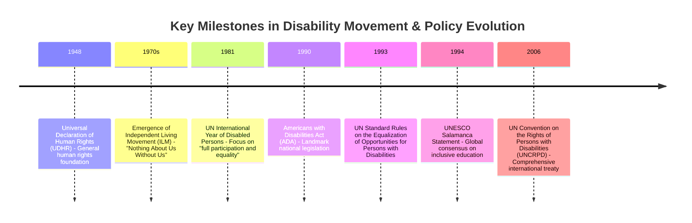
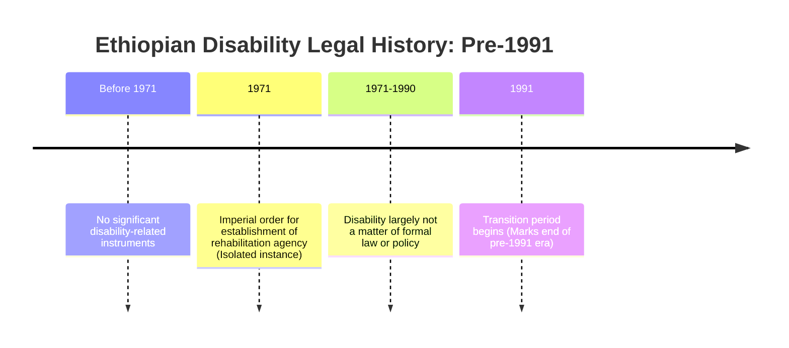
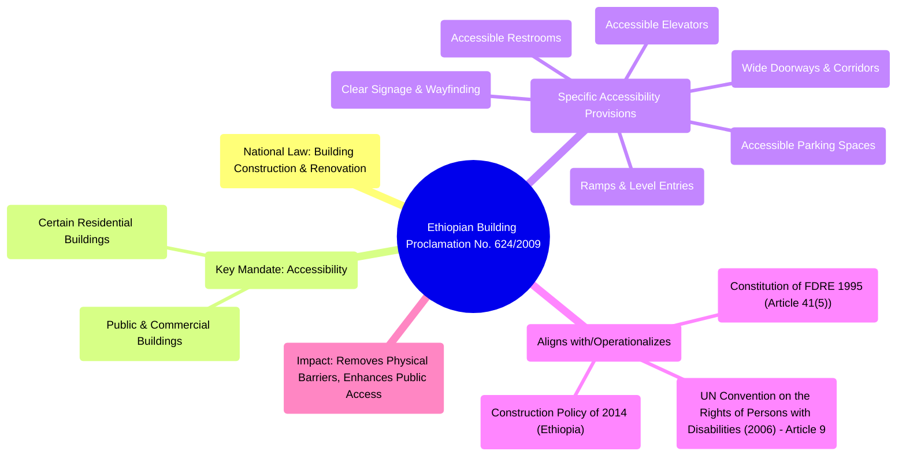
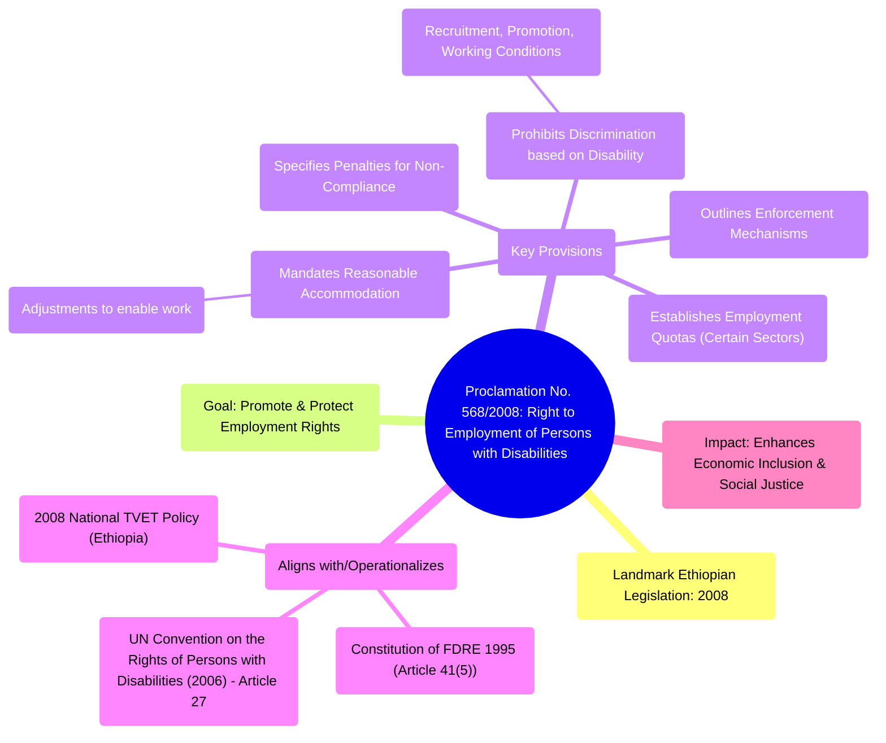

# 6 Relevant Policy And Legal Frameworks

Comprehensive resource for 6 Relevant Policy And Legal Frameworks.


---

## 6 Relevant Policy And Legal Frameworks Hub


## Overview
This unit explores the critical role of policy and legal frameworks in advancing inclusiveness, particularly for persons with disabilities. It delves into the historical context of discrimination, the emergence of the disability movement, and the subsequent development of both international and domestic legal instruments designed to protect human rights and promote equal citizenship. Understanding these frameworks is essential for ensuring effective implementation and practical application of inclusive principles in various societal spheres.

## Learning Objectives
*   Identify the components of policy and legal frameworks related to inclusiveness.
*   Discuss the historical context and evolution of the disability movement and its impact on policy development.
*   Analyze key international legal instruments and declarations that promote the rights of persons with disabilities.
*   Examine domestic policy and legal frameworks in Ethiopia that address inclusiveness for persons with disabilities.
*   Evaluate the significance of strong commitment and proactive action in implementing disability-mainstreamed policies.

## Unit Applications & Real-World Relevance
The study of policy and legal frameworks for inclusiveness has profound real-world relevance. These frameworks provide the foundation for advocating for the rights of persons with disabilities, guiding governmental actions, and shaping societal attitudes. They ensure that individuals with disabilities have access to education, employment, housing, transportation, and public services, fostering their full participation in society. Understanding these policies empowers advocates, policymakers, and citizens to challenge discrimination, promote accessibility, and build truly inclusive communities.

## Active Learning Prompts
*   How do international legal frameworks influence the development of domestic policies on disability rights in various countries?
*   Identify a specific instance of discrimination against persons with disabilities that you have observed or read about, and discuss which policy or legal framework it violates.
*   Consider the evolution of disability policy in Ethiopia. What were the key turning points, and what challenges remain in its implementation?

## Unit Challenges & Common Misconceptions
A significant challenge in the realm of inclusiveness policies is the gap between legal provisions and practical implementation. While many frameworks exist, strong commitment and proactive action from governments are crucial for their effectiveness. A common misconception is that "disability-specific" policies are sufficient; often, a "disability-mainstreamed" approach, integrating disability considerations across all policies, is more impactful. Additionally, the subtle forms of discrimination, such as attitudinal and environmental barriers, can be harder to identify and address than overt exclusions.

## Connections
  - [[Discrimination_Against_Persons_With_Disabilities]]
    - [[Disability_Movement_and_Policy_Evolution]]
      - [[International_Legal_Frameworks_for_Inclusiveness]]
        - [[Universal_Declaration_of_Human_Rights_of_1948]]
        - [[Convention_on_the_Rights_of_the_Child_of_1989]]
        - [[World_Declaration_on_Education_for_All_Jomtien_1990]]
        - [[UN_Sustainable_Development_Goal_of_2016]]
        - [[Standard_Rules_on_the_Equalization_of_Opportunities_for_Persons_with_Disability_of_1993]]
        - [[UNESCO_Salamanca_Statement_and_Framework_for_Action_of_1994]]
        - [[UN_Convention_on_the_Right_of_Persons_With_Disabilities_of_2006]]
      - [[Domestic_Policy_and_Legal_Frameworks_for_Inclusiveness_in_Ethiopia]]
        - [[Ethiopia_S_Disability_Legal_History_Pre_1991]]
        - [[Constitution_of_the_Federal_Democratic_Republic_of_Ethiopia_1995]]
        - [[1994_Education_And_Training_Policy_Ethiopia]]
        - [[Education_Sector_Development_Program_ESDP_II_III_IV_V]]
        - [[2008_National_TVET_Policy_Ethiopia]]
        - [[Proclamation_No_568_2008_Right_to_Employment_of_Persons_with_Disabilities]]
        - [[Ethiopian_Building_Proclamation_No_624_2009]]
        - [[Revised_Special_Needs_Inclusive_Education_Program_Strategy_of_2012]]
        - [[National_Plan_of_Action_of_Persons_with_Disabilities_2012_2021]]
        - [[Construction_Policy_of_2014_Ethiopia]]
        - [[Social_Protection_Policy_of_2014_Ethiopia]]
        - [[Civil_Servant_Proclamation_No_1064_2017_Ethiopia]]
        - [[Revised_Higher_Institutions_Proclamation_No_1152_2019_Ethiopia]]
        - [[Labor_Proclamation_No_1156_2019_Ethiopia]]

## Next Steps for Deeper Understanding
To further deepen your understanding, research the specific articles and implementing guidelines of the UN Convention on the Rights of Persons with Disabilities (UNCRPD). Explore case studies of countries that have successfully implemented disability-mainstreamed policies, as well as those facing significant challenges. Additionally, investigate the role of Disabled Persons' Organizations (DPOs) in advocating for policy changes and ensuring accountability in their home countries.

## Possible Questions
[[CC0113_6_Relevant_Policy_and_Legal_Frameworks_Possible_Questions]]

---

---

## Discrimination Against Persons With Disabilities


## Definition
Before proceeding, ensure you master Concept_Of_Inclusion and Understanding_Disability_And_Vulnerability because discrimination fundamentally violates inclusive principles and impacts vulnerable populations.
Discrimination against persons with disabilities refers to any distinction, exclusion, or restriction on the basis of disability which has the purpose or effect of impairing or nullifying the recognition, enjoyment, or exercise, on an equal basis with others, of all human rights and fundamental freedoms in the political, economic, social, cultural, civil, or any other field. In simpler terms, it's treating people unfairly because they have a disability, limiting their chances to be part of society.

## The Mental Model
Imagine a group of friends wanting to play a game, but one friend is told they can't play because they use a wheelchair, even though the game can be adapted. The "discrimination" is the unfair rule or attitude that keeps that friend from participating. It's not about their ability to play the game, but about the unnecessary barrier placed in their way.

## Context & Framework
#### The Problem: Why Did We Invent This?
Historically, persons with disabilities have faced systemic exclusion and denial of their human rights across various societal domains. This marginalization was often rooted in societal attitudes, lack of understanding, and the absence of appropriate legal and policy frameworks to protect their rights. The concept of discrimination against persons with disabilities was formally recognized and addressed as societies began to understand disability as a human rights issue rather than solely a medical or charitable concern.

## The Mastery Deep Dive
#### Spot the Impostor (Don't be Fooled)
Discrimination can manifest in various ways, some obvious and some subtle. It's crucial to distinguish between direct discrimination (an overt act of exclusion based on disability) and indirect discrimination (a seemingly neutral rule or policy that disproportionately disadvantages persons with disabilities). For example, a "no pets" policy might indirectly discriminate against a person who relies on a service animal, even if the policy isn't explicitly targeting individuals with disabilities. Understanding these nuances is essential for effective advocacy and policy implementation.

#### The "Kill Sheet"
| Type of Barrier          | Description                                                                                                                              | The "Gotcha" Difference                                                                                                                                                                 |
| :
----------------------- | :
--------------------------------------------------------------------------------------------------------------------------------------- | :
-------------------------------------------------------------------------------------------------------------------------------------------------------------------------------------- |
| **Attitudinal Barriers** | Prejudices, stereotypes, and negative perceptions towards persons with disabilities.                                                    | These are internal, often unconscious, biases that lead to discrimination (e.g., believing a person with a disability is less capable).                                                  |
| **Environmental Barriers** | Physical obstacles in the built environment or lack of accessible infrastructure.                                                        | These are external, physical limitations that prevent access (e.g., buildings without ramps, lack of accessible restrooms).                                                               |
| **Institutional Barriers** | Discriminatory laws, policies, practices, or organizational structures that disadvantage persons with disabilities.                     | These are systemic, embedded in rules and procedures, often unintentional, but result in exclusion (e.g., inaccessible application forms, lack of reasonable accommodation policies). |

## Constraints & Limitations
#### The "Grandma Test"
While overt forms of discrimination are increasingly challenged, subtle forms often persist because they are less visible or are normalized within societal structures. Attitudinal barriers, for example, can be deeply ingrained and resistant to change, even when legal frameworks are in place. These subtle biases can manifest as microaggressions, condescending behavior, or exclusion from social opportunities, making them difficult to challenge through legal means alone. Overcoming these requires sustained cultural and educational efforts.

## Significance & Application
Understanding discrimination against persons with disabilities is fundamental to promoting social justice and human rights. It provides the rationale for developing and implementing inclusive policies and legal frameworks at both international and domestic levels. In real-world applications, this knowledge informs advocacy efforts by Disabled Persons' Organizations (DPOs), guides urban planning to ensure accessibility, shapes educational reforms for inclusive learning environments, and drives corporate diversity and inclusion initiatives. Recognizing and addressing discrimination is the first step towards building a truly equitable society.

## The Worked Example
**Scenario:** A local bank has a policy requiring all customers to sign documents using a touch-screen tablet. A customer with a severe motor impairment finds it impossible to use the tablet.

**Analysis:**
1.  **Identify the Barrier:** This is an **institutional barrier** (a bank policy) and an **environmental barrier** (the design of the touch-screen system).
2.  **Form of Discrimination:** This is an example of **indirect discrimination**. The policy is seemingly neutral (applies to all customers) but disproportionately disadvantages customers with certain motor impairments, effectively excluding them from banking services on an equal basis.
3.  **Impact:** The customer is denied access to a public service, infringing upon their economic and social rights.

**Resolution (Ideal):** The bank, adhering to inclusive principles, should offer alternative signing methods (e.g., physical signature, voice-activated confirmation) or provide an accessible alternative device, demonstrating reasonable accommodation.

## The Proving Ground
*Test your mastery. Cover the solutions below to test yourself first.*

#### Level 1: The Sanity Check (Verification)
**The Question:** Define 'attitudinal barriers' and provide one example not mentioned in the text.
> **Solution:** Attitudinal barriers are prejudices, stereotypes, and negative perceptions towards persons with disabilities. An example could be a common belief that people with intellectual disabilities are unable to make independent decisions, leading to their exclusion from community planning.

#### Level 2: The Crucible (Mastery & Edge Cases)
**The Scenario:** A new restaurant has opened, and its entrance has two steps. The owner insists that adding a ramp would disrupt the building's aesthetic and believes it's sufficient that they offer a take-out service for customers who cannot enter.
**The Question:** Identify two distinct types of barriers present in this scenario. Explain why the owner's argument about the take-out service does not adequately address the issue of discrimination, linking it to the concept of equal participation.
> **Solution:** Two types of barriers are present: **Environmental barrier** (the steps at the entrance) and **Attitudinal barrier** (the owner's dismissal of accessibility concerns based on aesthetics and the belief that take-out is an acceptable substitute for equal access). The owner's argument is discriminatory because offering take-out does not provide **equal participation**. It shifts the burden to the customer with a disability and denies them the full experience of dining in the restaurant, which is available to others. This fails to ensure access to public services on an equal basis, as mandated by human rights principles.

## Key Takeaways
*   Discrimination against persons with disabilities involves any action or policy that unfairly limits their rights and participation in society.
*   Discrimination manifests through various barriers: attitudinal (prejudice), environmental (physical obstacles), and institutional (systemic rules).
*   Understanding these forms is crucial for developing effective legal frameworks and fostering a truly inclusive environment where all individuals can participate equally.

## Knowledge Graph Connections
| Concept                                       | Connection / Relationship                                                                                              |
| :
-------------------------------------------- | :
--------------------------------------------------------------------------------------------------------------------- |
| Concept_Of_Inclusion                      | Discrimination is the antithesis of inclusion, seeking to exclude rather than integrate individuals.                    |
| Understanding_Disability_And_Vulnerability | Persons with disabilities are often rendered vulnerable through discriminatory practices.                               |
| [[Disability_Movement_and_Policy_Evolution]]  | The disability movement arose in response to pervasive discrimination, advocating for rights.                         |
| [[International_Legal_Frameworks_for_Inclusiveness]] | International frameworks aim to combat discrimination and promote equality for persons with disabilities.              |
---

---

## Disability Movement And Policy Evolution


## Definition
Before proceeding, ensure you master [[Discrimination_Against_Persons_With_Disabilities]] and Relevant_Policy_And_Legal_Frameworks because the disability movement emerged as a direct response to discrimination and catalyzed the development of relevant policy and legal frameworks.
The disability movement refers to a global collective effort by persons with disabilities and their allies to challenge discrimination, advocate for human rights, and achieve full inclusion in society. This movement has been instrumental in shifting the perception of disability from a medical or charitable issue to a human rights issue, leading to significant evolution in policy and legal frameworks worldwide.

## The Mental Model
Imagine a group of people, each facing a unique challenge, realizing they share a common goal: to be seen, heard, and have their rights respected. They organize, raise their voices, and demand change, much like civil rights movements for other marginalized groups. Their collective efforts push governments and societies to create new rules and laws that protect and include them, slowly changing the landscape from one of exclusion to one of greater equity.

## Context & Framework
#### The Problem: Why Did We Invent This?
The disability movement arose out of centuries of systemic discrimination, exclusion, and denial of basic human rights for persons with disabilities. Before the movement gained momentum, individuals with disabilities were often institutionalized, segregated, or treated as objects of charity, with little to no recognition of their autonomy or their rights to participate fully in society. This pervasive injustice served as the catalyst, driving disabled persons' organizations (DPOs) to mobilize and demand fundamental shifts in societal attitudes, policies, and laws.

## The Mastery Deep Dive
#### The Problem: Why Did We Invent This?
Prior to the significant surge of the disability movement, the dominant paradigm viewed disability as a personal tragedy or a medical condition requiring 'cure' or 'care' in segregated settings. This led to policies centered on institutionalization and isolation, rather than integration and empowerment. The dire consequences included limited educational opportunities, unemployment, lack of accessible infrastructure, and widespread denial of political and social participation. The disability movement emerged precisely to dismantle these outdated views and structures, advocating for a rights-based approach that recognized persons with disabilities as active members of society.

#### Version 1.0 vs. Today
The early "Version 1.0" of policies often involved segregated services and institutions, reflecting a medical model of disability. The focus was on "fixing" the individual or providing separate, specialized facilities. Today's approach, influenced by the disability movement, has evolved dramatically. It emphasizes **disability-mainstreamed policy and legal frameworks**, which means integrating disability considerations across all policy areas (e.g., general education, public transport, employment) rather than creating separate systems. This shift reflects a move towards a social model of disability, recognizing that barriers are often societal, not inherent in the individual.

#### The "Same Story, Different Setting"
The struggle for disability rights shares common threads with other civil rights movements. Just as movements for racial or gender equality fought against systemic discrimination and demanded legal recognition of equal rights, the disability movement has campaigned for the recognition of persons with disabilities as equal citizens. The pattern of challenging existing power structures, advocating for legislative change, and demanding societal accommodation to ensure equal access and opportunity is a recurring narrative across various human rights struggles.


```text
// Scenario 1: Tracing the evolution of global disability policy
// Output:
// A timeline showing key dates and events:
// - 1948: Universal Declaration of Human Rights (UDHR) - General human rights foundation
// - 1970s: Emergence of Independent Living Movement (ILM) - "Nothing About Us Without Us"
// - 1981: UN International Year of Disabled Persons - Focus on "full participation and equality"
// - 1990: Americans with Disabilities Act (ADA) - Landmark national legislation
// - 1993: UN Standard Rules on the Equalization of Opportunities for Persons with Disabilities
// - 1994: UNESCO Salamanca Statement - Global consensus on inclusive education
// - 2006: UN Convention on the Rights of Persons with Disabilities (UNCRPD) - Comprehensive international treaty
```
*Note: This `timeline` illustrates the progressive development of key instruments and movements that shaped global disability policy.*

## Constraints & Limitations
#### The Reality Check: Theory vs. Real Life
Despite significant advancements in policy and legal frameworks, the practical implementation of these mandates remains a considerable challenge. Theoretical legal rights often encounter real-world obstacles such as insufficient funding, lack of political will, inadequate infrastructure, and persistent societal attitudinal barriers. For instance, a law mandating accessible public transport might be in place, but if the budget for modifying buses or training staff is lacking, the theoretical right does not translate into practical accessibility for individuals. This gap between 'de jure' (by law) and 'de facto' (in practice) equality is a critical limitation.

## Significance & Application
The disability movement has fundamentally transformed how disability is understood and addressed globally. Its primary application lies in the continuous advocacy for, and development of, comprehensive policy and legal frameworks that uphold the human rights of persons with disabilities. This includes promoting `International_Legal_Frameworks_for_Inclusiveness` like the UNCRPD and influencing `Domestic_Policy_and_Legal_Frameworks_for_Inclusiveness_in_Ethiopia`. The movement’s impact is evident in the shift from institutionalization to independent living, from segregation to inclusion, and from charity to rights-based approaches across education, employment, and public life.

## The Worked Example
**Scenario:** Early 20th century, a child with a physical disability is denied enrollment in a local public school and is instead sent to a specialized institution far from home.

**Analysis through the lens of policy evolution:**
1.  **"Version 1.0" Policy:** This reflects an older paradigm where policies prioritized segregation and specialized care, often in institutions, rather than integrating individuals into mainstream society. The underlying belief was that the child's disability prevented them from benefiting from mainstream education or that their presence would hinder others.
2.  **Disability Movement Impact:** The disability movement, particularly post-mid-20th century, challenged such practices. It argued for the right to inclusive education, where children with disabilities attend local schools alongside their peers, with necessary accommodations and support. This led to policies like the UNESCO Salamanca Statement and later the UNCRPD, advocating for inclusive education systems.
3.  **Modern Policy Application:** In a modern context, informed by the movement's successes, denying enrollment in a local school and mandating institutionalization would be a clear violation of educational rights as enshrined in numerous international and domestic legal frameworks. The expectation would be for the local school to provide reasonable accommodations and support for the child's participation.

## The Proving Ground
*Test your mastery. Cover the solutions below to test yourself first.*

#### Level 1: Understanding (The Basics)
**The Fact Check:** When did the disability movement gain significant momentum, pushing for disability-mainstreamed policies?
> **Solution:** The disability movement gained significant momentum as of the second half of the 20th century.

#### Level 2: Competence (Application)
**The Trade-off:** Contrast the "specific/special needs" approach, often seen in earlier policies, with the "disability-mainstreamed" approach. Which is generally more effective in promoting true inclusiveness, and why?
> **Solution:** The "specific/special needs" approach tends to create separate services or policies solely for persons with disabilities, potentially leading to segregation. The "disability-mainstreamed" approach, however, integrates disability considerations into all general policies and services. The latter is generally more effective because it ensures that all systems are inherently inclusive, rather than requiring persons with disabilities to adapt to exclusionary systems or rely on separate, often under-resourced, services. It champions equality by design.

#### Level 3: Mastery (The Crucible)
**The Lose-Lose Scenario:** A developing country, eager to comply with international disability rights, implements a national policy mandating full accessibility for all public buildings within five years. However, local municipalities lack the technical expertise and financial resources to modify existing structures or ensure new ones are built accessibly. This results in many public services closing rather than complying. What fundamental aspect of effective policy implementation, highlighted by the disability movement's advocacy, was overlooked here, leading to this 'lose-lose' situation?
> **Solution:** The fundamental aspect overlooked was the need for **strong commitment and proactive action** from governments, encompassing not just legislation but also the provision of **resources and capacity-building**. While the policy aims for compliance, the lack of support for local municipalities in terms of technical expertise and financial resources demonstrates an insufficient commitment to practical implementation. The disability movement emphasizes that legal frameworks alone are not enough; governments must actively facilitate the means for adherence to avoid creating unintended negative consequences like the closure of essential public services.

## Key Takeaways
*   The disability movement dramatically shifted the perception of disability from a medical issue to a human rights issue.
*   It led to the development of disability-mainstreamed policy and legal frameworks, moving away from segregated services.
*   Effective implementation requires strong commitment and proactive governmental action beyond mere legislation.

## Knowledge Graph Connections
| Concept                                                          | Connection / Relationship                                                                                                 |
| :
--------------------------------------------------------------- | :
-------------------------------------------------------------------------------------------------------------------------- |
| [[Discrimination_Against_Persons_With_Disabilities]]             | The disability movement emerged directly in response to widespread discrimination.                                        |
| [[International_Legal_Frameworks_for_Inclusiveness]]             | The movement propelled the creation and adoption of crucial international disability instruments.                           |
| [[Domestic_Policy_and_Legal_Frameworks_for_Inclusiveness_in_Ethiopia]] | The movement influenced national governments, including Ethiopia, to enact domestic disability policies.                  |
| Promoting_Inclusive_Culture                                  | The movement's advocacy fostered a broader understanding and promotion of inclusive culture.                               |
---

---

## Domestic Policy And Legal Frameworks For Inclusiveness In Ethiopia


## Definition
Before proceeding, ensure you master [[Disability_Movement_and_Policy_Evolution]] and [[International_Legal_Frameworks_for_Inclusiveness]] because domestic policy and legal frameworks are the national implementation of principles championed by the disability movement and informed by international legal instruments to foster inclusiveness within a specific country.
Domestic policy and legal frameworks for inclusiveness in Ethiopia refer to the national laws, proclamations, policies, strategies, and programs developed and implemented by the Ethiopian government to protect the rights of persons with disabilities, promote their full participation, and ensure equality within the country. These frameworks are often influenced by international conventions and declarations, adapting global principles to the specific context and needs of Ethiopia.

## The Mental Model
Imagine a country like Ethiopia receiving a global blueprint for fairness (international laws) and then creating its own detailed "rulebook" for how everyone should be treated within its borders, especially people with disabilities. This "Ethiopian rulebook" includes specific laws about education, jobs, buildings, and even the country's main constitution, all designed to make sure no one is left out. It's about translating big global ideas into practical, local action.

## Context & Framework
#### How the Parts Talk to Each Other
Domestic legal and policy frameworks in Ethiopia interact by creating a layered system of rights and obligations. The `Constitution_of_the_Federal_Democratic_Republic_of_Ethiopia_1995` serves as the supreme law, enshrining fundamental rights, including those relevant to persons with disabilities. Subsequent proclamations (laws), policies, and programs (like the `1994_Education_and_Training_Policy_(Ethiopia)`) provide more specific details and implementation mechanisms for these constitutional rights across various sectors (e.g., education, employment, social protection). This hierarchical structure ensures that all sectoral policies align with the broader constitutional and international commitments to inclusiveness.

## The Mastery Deep Dive
#### The Family Tree
Domestic policy and legal frameworks in Ethiopia can be categorized by their level of authority and their specific focus. At the top is the Constitution, providing overarching human rights guarantees. Below this are proclamations, which are legally binding laws passed by parliament, addressing specific areas such as employment or building accessibility. Complementing these are policies and strategies, which guide the implementation of laws and set national priorities (e.g., in education or social protection). This multi-tiered structure ensures comprehensive coverage of disability rights.

```mermaid
graph TD
    A[Ethiopian Legal & Policy Frameworks] --> B[Constitutional Basis]
    A --> C[Disability-Specific Proclamations]
    A --> D[Sectoral Policies & Strategies]

    B --> B1[Constitution of the Federal Democratic Republic of Ethiopia (1995)]

    C --> C1[Proclamation No. 568/2008 (Employment)]
    C --> C2[Ethiopian Building Proclamation No. 624/2009]
    C --> C3[Civil Servant Proclamation No. 1064/2017]
    C --> C4[Revised Higher Institutions Proclamation No. 1152/2019]
    C --> C5[Labor Proclamation No. 1156/2019]

    D --> D1[1994 Education and Training Policy]
    D --> D2[Education Sector Development Program (ESDP) II, III, IV, V]
    D --> D3[2008 National TVET Policy]
    D --> D4[Revised Special Needs/Inclusive Education Program Strategy (2012)]
    D --> D5[National Plan of Action of Persons with Disabilities (2012-2021)]
    D --> D6[Construction Policy of 2014]
    D --> D7[Social Protection Policy of 2014]
```
```text
// Scenario 1: Categorizing Ethiopian disability frameworks
// Output:
// (A visual representation of the graph diagram showing "Ethiopian Legal & Policy Frameworks" branching into "Constitutional Basis", "Disability-Specific Proclamations", and "Sectoral Policies & Strategies".)
// Constitutional Basis includes:
// - Constitution of the Federal Democratic Republic of Ethiopia (1995)
// Disability-Specific Proclamations include:
// - Proclamation No. 568/2008 (Employment)
// - Ethiopian Building Proclamation No. 624/2009
// - Civil Servant Proclamation No. 1064/2017
// - Revised Higher Institutions Proclamation No. 1152/2019
// - Labor Proclamation No. 1156/2019
// Sectoral Policies & Strategies include:
// - 1994 Education and Training Policy
// - Education Sector Development Program (ESDP) II, III, IV, V
// - 2008 National TVET Policy
// - Revised Special Needs/Inclusive Education Program Strategy (2012)
// - National Plan of Action of Persons with Disabilities (2012-2021)
// - Construction Policy of 2014
// - Social Protection Policy of 2014
```
*Note: This `graph TD` illustrates the categorization and hierarchical nature of Ethiopian domestic legal and policy frameworks relevant to inclusiveness.*

## Constraints & Limitations
#### The Reality Check: Theory vs. Real Life
Despite a comprehensive legal and policy framework, Ethiopia, like many developing countries, faces significant challenges in the effective implementation of its inclusiveness mandates. These limitations include: (1) **Resource Constraints:** Insufficient financial and human resources (e.g., trained personnel, accessible infrastructure) can hinder the translation of policy into practice. (2) **Awareness Gaps:** Lack of awareness among the general public, service providers, and even some duty-bearers about the rights of persons with disabilities and the existing legal frameworks. (3) **Attitudinal Barriers:** Persistent societal stigma and discriminatory attitudes can undermine policy efforts. (4) **Enforcement Challenges:** Weak enforcement mechanisms can lead to non-compliance, particularly in areas like building accessibility and employment quotas. These factors highlight the gap between legal provisions and lived reality.

## Significance & Application
Ethiopia's domestic policy and legal frameworks are vital for localizing `International_Legal_Frameworks_for_Inclusiveness` and directly impacting the lives of persons with disabilities within the country. Their significance and application are clear: (1) **Legal Protection:** They provide the legal basis for protecting the rights of persons with disabilities, enabling legal recourse in cases of discrimination. (2) **Sectoral Guidance:** They guide specific sectors (e.g., education, labor, construction) in developing inclusive practices and allocating resources. (3) **National Planning:** They form the foundation for national plans and strategies aimed at promoting social, economic, and political inclusion. These frameworks, such as the `Proclamation_No_568_2008_Right_to_Employment_of_Persons_with_Disabilities` or the `Ethiopian_Building_Proclamation_No_624_2009`, are crucial for driving systemic change and ensuring that the principles of inclusiveness are integrated into the fabric of Ethiopian society.

## The Worked Example
**Scenario:** A visually impaired individual in Addis Ababa applies for a job in a government office. Despite meeting all qualifications, they are rejected because the office's software system is not screen-reader compatible, and the hiring panel fears this would make them "inefficient."

**Analysis through Ethiopian domestic frameworks:**
1.  **Relevant Proclamations:** This scenario directly implicates the `Proclamation_No_568_2008_Right_to_Employment_of_Persons_with_Disabilities` and the `Civil_Servant_Proclamation_No_1064_2017_(Ethiopia)`. Both emphasize the right to employment and non-discrimination for persons with disabilities.
2.  **Barrier Identification:** The inaccessible software system represents an **institutional barrier** (lack of reasonable accommodation) and an **environmental barrier** (inaccessible technology). The hiring panel's "inefficiency" fear is an **attitudinal barrier**.
3.  **Violation of Rights:** The rejection constitutes discrimination based on disability, violating the individual's right to employment and equal opportunity as guaranteed by Ethiopian law. The government office, being a public institution, has an obligation to provide reasonable accommodation (e.g., accessible software, assistive technology) to enable the individual to perform their duties.

## The Proving Ground
*Test your mastery. Cover the solutions below to test yourself first.*

#### Level 1: Understanding (The Basics)
**The Neighbor Check:** Name two specific proclamations or policies in Ethiopia that address the rights or inclusion of persons with disabilities.
> **Solution:** Two specific proclamations or policies are the `Proclamation_No_568_2008_Right_to_Employment_of_Persons_with_Disabilities` and the `1994_Education_and_Training_Policy_(Ethiopia)`.

#### Level 2: Competence (Application)
**The Sort:** Categorize the `Constitution_of_the_Federal_Democratic_Republic_of_Ethiopia_1995` and the `Ethiopian_Building_Proclamation_No_624_2009` based on their role within Ethiopia's domestic legal framework for inclusiveness. Explain the difference.
> **Solution:** The `Constitution_of_the_Federal_Democratic_Republic_of_Ethiopia_1995` serves as the **constitutional basis**, providing overarching human rights guarantees. The `Ethiopian_Building_Proclamation_No_624_2009` is a **disability-specific proclamation**, which is a legally binding law providing specific details and implementation mechanisms for accessibility in buildings, building upon the constitutional principles.

#### Level 3: Mastery (The Crucible)
**The Impostor:** A newly constructed government building in Ethiopia, while having ramps at its main entrance, has all its internal signage in small, non-contrasting fonts and lacks tactile indicators for visually impaired individuals. The construction company argues that since they provided ramps, they have met the "spirit of accessibility" as per national building guidelines. Why is this claim an 'impostor' in truly achieving accessibility as envisioned by Ethiopia's legal frameworks?
> **Solution:** This claim is an 'impostor' because true accessibility, as envisioned by Ethiopia's legal frameworks like the `Ethiopian_Building_Proclamation_No_624_2009`, goes beyond mere physical entry. Providing only ramps while neglecting internal signage and tactile indicators for visually impaired individuals demonstrates a superficial understanding of universal design. Real accessibility requires a holistic approach that considers the diverse needs of all users (e.g., visual, cognitive, motor impairments) and ensures that all aspects of the environment are usable. Neglecting elements like accessible signage and tactile indicators creates new `Environmental_Barriers`, undermining the very purpose of an inclusive building and failing to meet the comprehensive requirements of national building guidelines.

## Key Takeaways
*   Ethiopia has developed a layered system of domestic legal and policy frameworks for inclusiveness, influenced by international instruments.
*   These frameworks range from constitutional guarantees to specific proclamations and sectoral policies.
*   Implementation faces challenges due to resource constraints, awareness gaps, attitudinal barriers, and enforcement issues.

## Knowledge Graph Connections
| Concept                                                          | Connection / Relationship                                                                                                 |
| :
--------------------------------------------------------------- | :
-------------------------------------------------------------------------------------------------------------------------- |
| [[Disability_Movement_and_Policy_Evolution]]                     | Ethiopian frameworks are a national response to the principles championed by the disability movement.                     |
| [[International_Legal_Frameworks_for_Inclusiveness]]             | Ethiopia's domestic laws and policies are often influenced by and align with international conventions and declarations.    |
| [[Constitution_of_the_Federal_Democratic_Republic_of_Ethiopia_1995]] | This is the foundational legal document in Ethiopia that enshrines rights relevant to persons with disabilities.          |
| [[Ethiopian_Building_Proclamation_No_624_2009]]                  | This proclamation is a specific domestic legal instrument addressing building accessibility in Ethiopia.                    |
| [[Proclamation_No_568_2008_Right_to_Employment_of_Persons_with_Disabilities]] | This proclamation specifically protects the right to employment for persons with disabilities in Ethiopia.                |
---

---

## International Legal Frameworks For Inclusiveness


## Definition
Before proceeding, ensure you master [[Disability_Movement_and_Policy_Evolution]] and Promoting_Inclusive_Culture because international legal frameworks are a direct outcome of the disability movement's advocacy and serve as foundational tools for promoting an inclusive culture globally.
International legal frameworks for inclusiveness refer to a body of treaties, conventions, declarations, and standard rules developed at a global level to protect and promote the human rights of all individuals, with specific attention to ensuring the full and equal participation of persons with disabilities in society. These instruments serve as guiding principles and legal obligations for signatory states to enact domestic legislation and policies that foster inclusive environments.

## The Mental Model
Imagine a global blueprint or a universal rulebook for how countries should treat all their citizens fairly, especially those who have historically been left out. These "international rules" are agreed upon by many nations, creating a common understanding and a commitment to build societies where everyone belongs and has their rights protected, regardless of disability. It's like a worldwide promise to make sure everyone gets a fair chance.

## Context & Framework
#### How the Parts Talk to Each Other
International legal frameworks operate through a system of mutual commitment and peer pressure among nations. When a country signs and ratifies a treaty or convention (like the UNCRPD), it legally binds itself to implement the provisions of that instrument within its domestic legal system. This often involves legislative changes, policy reforms, and the establishment of monitoring mechanisms. These frameworks set universal standards, encouraging countries to learn from each other and to continuously improve their national approaches to inclusiveness.

## The Mastery Deep Dive
#### The Family Tree
International legal frameworks can be broadly categorized into general human rights instruments and disability-specific instruments. The former lay the foundational principles of equality and non-discrimination for all, which implicitly apply to persons with disabilities. The latter explicitly address the unique challenges faced by persons with disabilities, providing detailed guidance for ensuring their rights. This hierarchical structure ensures that disability rights are firmly rooted in universal human rights while also receiving specialized attention.

```mermaid
graph TD
    A[International Legal Frameworks] --> B[General Human Rights Instruments]
    A --> C[Disability-Specific Instruments]

    B --> B1[Universal Declaration of Human Rights (1948)]
    B --> B2[Convention on the Rights of the Child (1989)]
    B --> B3[World Declaration on Education for All, Jomtien (1990)]
    B --> B4[UN Sustainable Development Goal (2016)]

    C --> C1[Standard Rules on the Equalization of Opportunities for Persons with Disability (1993)]
    C --> C2[UNESCO Salamanca Statement and Framework for Action (1994)]
    C --> C3[UN Convention on the Right of Persons with Disabilities (2006)]
```
```text
// Scenario 1: Categorizing international legal frameworks
// Output:
// (A visual representation of the graph diagram showing "International Legal Frameworks" branching into "General Human Rights Instruments" and "Disability-Specific Instruments".)
// General Human Rights Instruments include:
// - Universal Declaration of Human Rights (1948)
// - Convention on the Rights of the Child (1989)
// - World Declaration on Education for All, Jomtien (1990)
// - UN Sustainable Development Goal (2016)
// Disability-Specific Instruments include:
// - Standard Rules on the Equalization of Opportunities for Persons with Disability (1993)
// - UNESCO Salamanca Statement and Framework for Action (1994)
// - UN Convention on the Right of Persons with Disabilities (2006)
```
*Note: This `graph TD` illustrates the categorization of international legal frameworks into general human rights instruments and disability-specific instruments, showing their hierarchical relationship.*

## Constraints & Limitations
#### The Reality Check: Theory vs. Real Life
While international legal frameworks provide robust guidelines and obligations, their effectiveness is often constrained by the political will and capacity of individual states. Challenges include: (1) **Lack of Ratification:** Some countries may not ratify key treaties, thus not being legally bound by their provisions. (2) **Implementation Gaps:** Even with ratification, translation into effective domestic law and practice can be slow due to resource limitations, inadequate enforcement mechanisms, or persistent societal resistance. (3) **Reporting Burdens:** Developing countries may struggle with the technical and financial demands of reporting on their compliance to international bodies. These factors mean that the theoretical protection offered by international law may not always translate into tangible improvements for persons with disabilities on the ground.

## Significance & Application
International legal frameworks are critical in establishing universal norms and standards for inclusiveness, exerting a powerful influence on national policies and legislation. They provide a common language and a shared commitment for countries to advance the rights of persons with disabilities. In practice, these frameworks: (1) **Legitimize Advocacy:** Empower Disabled Persons' Organizations (DPOs) and civil society to advocate for rights at national levels. (2) **Guide Policymaking:** Serve as blueprints for governments drafting disability-inclusive laws and strategies. (3) **Promote Accountability:** Establish mechanisms for monitoring state compliance and holding governments accountable for their commitments. Their application extends to education, employment, accessibility, and participation in public life, ensuring a harmonized global effort towards inclusion.

## The Worked Example
**Scenario:** A country, "Nation X," has ratified the `UN_Convention_on_the_Right_of_Persons_With_Disabilities_of_2006`. However, its national education system still largely operates with segregated schools for children with disabilities.

**Analysis through international frameworks:**
1.  **Framework Identification:** The UNCRPD is a key `International_Legal_Frameworks_for_Inclusiveness` that Nation X has committed to.
2.  **Principle Violation:** The UNCRPD, particularly Article 24 on Education, explicitly promotes inclusive education systems, where children with disabilities are educated within the general education system alongside their peers, with appropriate support. The existence of a largely segregated system in Nation X directly violates this core principle.
3.  **Required Action:** Nation X is obligated to progressively realize inclusive education. This would involve reforming its education laws, allocating resources for teacher training in inclusive pedagogies, providing individualized support, and adapting school environments to be accessible. The international framework provides the legal leverage for advocates within Nation X to demand these changes and hold their government accountable.

## The Proving Ground
*Test your mastery. Cover the solutions below to test yourself first.*

#### Level 1: Understanding (The Basics)
**The Neighbor Check:** Identify the primary difference between a "general human rights instrument" and a "disability-specific instrument" within the international legal framework.
> **Solution:** A general human rights instrument lays down universal rights applicable to all individuals (including persons with disabilities, implicitly), while a disability-specific instrument explicitly addresses the unique rights and challenges faced by persons with disabilities, providing detailed guidance for their inclusion.

#### Level 2: Competence (Application)
**The Sort:** Place the `Universal_Declaration_of_Human_Rights_of_1948` and the `Standard_Rules_on_the_Equalization_of_Opportunities_for_Persons_with_Disability_of_1993` into their respective categories within the international legal framework, explaining your reasoning.
> **Solution:** The `Universal_Declaration_of_Human_Rights_of_1948` is a **general human rights instrument** because it proclaims fundamental human rights for all individuals, serving as a foundation for all subsequent human rights law. The `Standard_Rules_on_the_Equalization_of_Opportunities_for_Persons_with_Disability_of_1993` is a **disability-specific instrument** because it focuses explicitly on promoting equal opportunities for persons with disabilities, providing practical guidelines for governments and societies to address their unique needs.

#### Level 3: Mastery (The Crucible)
**The Impostor:** A non-governmental organization (NGO) argues that because a country has signed the `Universal_Declaration_of_Human_Rights_of_1948`, it has fully met all its international obligations regarding persons with disabilities. Why might this statement be considered an 'impostor' claim when considering the full scope of international legal frameworks for inclusiveness?
> **Solution:** While the `Universal_Declaration_of_Human_Rights_of_1948` provides a crucial foundational statement of universal human rights, relying solely on it to claim full international compliance regarding persons with disabilities is an 'impostor' claim. The UDHR is a general instrument; it does not contain the specific, detailed provisions and actionable guidelines necessary to address the nuanced challenges and rights of persons with disabilities. Later disability-specific instruments, such as the `UN_Convention_on_the_Right_of_Persons_With_Disabilities_of_2006`, were developed precisely because the general instruments, while foundational, were insufficient to ensure the full and equal enjoyment of human rights by persons with disabilities without more explicit and tailored legal obligations.

## Key Takeaways
*   International legal frameworks consist of general human rights and disability-specific instruments, forming a hierarchical structure.
*   These frameworks guide countries in developing domestic policies to protect and promote the rights of persons with disabilities.
*   Challenges include ratification gaps, implementation difficulties, and reporting burdens, highlighting the gap between theory and practice.

## Knowledge Graph Connections
| Concept                                                          | Connection / Relationship                                                                                                 |
| :
--------------------------------------------------------------- | :
-------------------------------------------------------------------------------------------------------------------------- |
| [[Disability_Movement_and_Policy_Evolution]]                     | International frameworks are a key outcome and tool of the disability movement's advocacy.                                  |
| [[Universal_Declaration_of_Human_Rights_of_1948]]                | This foundational document establishes the universal principles for human rights, implicitly including persons with disabilities. |
| [[UN_Convention_on_the_Right_of_Persons_With_Disabilities_of_2006]] | This is a comprehensive, legally binding treaty specifically dedicated to the rights of persons with disabilities.          |
| [[Domestic_Policy_and_Legal_Frameworks_for_Inclusiveness_in_Ethiopia]] | International frameworks often serve as benchmarks and obligations for domestic policy development.                        |
---

---

## 1994 Education And Training Policy Ethiopia


## Definition
Before proceeding, ensure you master [[Domestic_Policy_and_Legal_Frameworks_for_Inclusiveness_in_Ethiopia]] and [[UNESCO_Salamanca_Statement_and_Framework_for_Action_of_1994]] because the 1994 Ethiopian Education and Training Policy is a pivotal domestic framework that significantly aligns with the principles of inclusive education championed by international instruments, laying the groundwork for inclusive educational practices within the country.
The 1994 Education and Training Policy of Ethiopia is a comprehensive national framework that reformed the Ethiopian education system. It emphasized universal access to education, quality improvement, relevance to national development, and efficiency. Crucially for inclusiveness, it recognized the right of all citizens to education, including those with special needs. This policy laid the foundation for developing strategies and programs aimed at integrating children with disabilities into mainstream education and providing appropriate support, marking a significant shift from previous exclusionary practices.

## The Mental Model
Imagine a country deciding to rebuild its entire school system, not just for some kids, but for *every single child*. Ethiopia's 1994 Education Policy was like that: a big plan to make sure everyone gets an education, no matter their background. A key part of this plan was saying, "Yes, that means children with special needs too!" It was the first major step to opening school doors wider and figuring out how to teach all children together, rather than separately.

## Context & Framework
#### How the Parts Talk to Each Other
The 1994 Education and Training Policy operates within the overarching legal framework established by the `Constitution_of_the_Federal_Democratic_Republic_of_Ethiopia_1995`, which ensures the right to education. This policy translates the constitutional mandate into specific educational goals and strategies. Furthermore, it reflects the global shift towards inclusive education, influenced by international instruments like the `World_Declaration_on_Education_for_All_Jomtien_1990` and the `UNESCO_Salamanca_Statement_and_Framework_for_Action_of_1994`. It provides the guiding principles for subsequent education-sector development programs (`Education_Sector_Development_Program_(ESDP)_II_III_IV_V`) and specific strategies for `Inclusive_Education_Principles` within Ethiopia.

## The Mastery Deep Dive
#### Where Does it Live? (The Map)
The 1994 Education and Training Policy has several core tenets that are relevant to inclusiveness. These include: its emphasis on equitable access for all, its focus on providing relevant education, and its commitment to addressing the needs of diverse learners. Although the policy might not have detailed every aspect of inclusive education for persons with disabilities, it created the necessary policy space and political will to move towards an inclusive system, recognizing that no child should be left behind due to their individual circumstances.

```mermaid
mindmap
  root((1994 Education and Training Policy (Ethiopia)))
    - ("Comprehensive National Education Reform")
    - ("Key Policy Directions")
      -- ("Universal Access to Education")
      -- ("Quality Improvement")
      -- ("Relevance to National Development")
      -- ("Efficiency in Education")
    - ("Specific Relevance to Inclusiveness")
      -- ("Recognized Right to Education for All Citizens")
      -- ("Implicitly Included Persons with Special Needs")
      -- ("Laid Foundation for Inclusive Education Strategies")
      -- ("Shift from Exclusionary Practices")
    - ("Influenced by/Aligns with")
      -- ("Constitution of FDRE 1995")
      -- ("World Declaration on Education for All, Jomtien (1990)")
      -- ("UNESCO Salamanca Statement (1994)")
    - ("Impact & Subsequent Frameworks")
      -- ("Guided ESDP Programs")
      -- ("Enabled Special Needs/Inclusive Education Program Strategies")
```
```text
// Scenario 1: Understanding the core tenets of the 1994 Education Policy
// Output:
// (A visual representation of the mindmap showing "1994 Education and Training Policy (Ethiopia)" as the root.)
// Key branches include: "Comprehensive National Education Reform", "Key Policy Directions" (Universal Access, Quality Improvement, Relevance, Efficiency), "Specific Relevance to Inclusiveness" (with sub-points), "Influenced by/Aligns with" (Constitution, Jomtien, Salamanca), and "Impact & Subsequent Frameworks" (Guided ESDP, Enabled Strategies).
```
*Note: This `mindmap` illustrates the foundational nature of the 1994 Education and Training Policy in shaping inclusive education in Ethiopia.*

## Constraints & Limitations
#### The Reality Check: Theory vs. Real Life
While the 1994 Education and Training Policy was groundbreaking, its implementation for inclusive education faced significant limitations: (1) **Lack of Detailed Implementation Strategy:** The policy provided a broad vision but lacked specific guidelines for how to practically implement inclusive education, especially for children with diverse disabilities. (2) **Resource Constraints:** Inadequate allocation of funds, lack of accessible infrastructure, and insufficient supply of trained special needs educators hindered widespread implementation. (3) **Teacher Capacity:** Many mainstream teachers lacked the training and skills to effectively teach children with special educational needs in an inclusive setting. (4) **Attitudinal Barriers:** Persistent societal attitudes and biases towards disability often impeded the full acceptance and integration of children with disabilities in regular schools. These factors highlight the gap between policy intent and practical realization.

## Significance & Application
The 1994 Education and Training Policy holds profound significance for inclusiveness in Ethiopia as it: (1) **Established a National Vision:** It articulated a national vision for education that inherently included all citizens, including those with special needs, marking a departure from previous exclusionary approaches. (2) **Provided Policy Direction:** It laid the foundational policy direction for subsequent initiatives, such as the `Revised_Special_Needs_Inclusive_Education_Program_Strategy_of_2012`, aimed at advancing inclusive education. (3) **Fostered Alignment:** Its alignment with international declarations like Jomtien and Salamanca demonstrated Ethiopia's commitment to global education standards, encouraging further engagement with the international community. The policy is therefore a critical component in Ethiopia's journey towards a more inclusive education system, providing the necessary political and legal endorsement.

## The Worked Example
**Scenario:** A regional education bureau in Ethiopia, after the adoption of the 1994 Education and Training Policy, begins to convert segregated special schools into resource centers for mainstream schools, and enrolls children with mild disabilities into regular classrooms.

**Analysis through the 1994 Education and Training Policy lens:**
1.  **Policy Alignment:** This action directly aligns with the spirit of the 1994 Education and Training Policy, which recognized the right of all citizens to education and laid the groundwork for integrating children with special needs into mainstream education.
2.  **Shift in Practice:** The conversion of special schools and the integration of children with mild disabilities represent a practical shift from older, exclusionary practices towards more inclusive approaches, as envisioned by the policy. It shows an attempt to move towards "Education for All" by adapting existing structures.
3.  **Future Development:** This initial step, while positive, would later be further guided and expanded by more detailed strategies and programs such as the `Revised_Special_Needs_Inclusive_Education_Program_Strategy_of_2012`, which would provide more comprehensive guidance on how to ensure effective inclusive education across all levels.

## The Proving Ground
*Test your mastery. Cover the solutions below to test yourself first.*

#### Level 1: Understanding (The Basics)
**The Fact Check:** What was a key principle of the 1994 Education and Training Policy of Ethiopia regarding access to education for all citizens?
> **Solution:** A key principle was universal access to education for all citizens, including those with special needs.

#### Level 2: Competence (Application)
**The Sort:** Explain how the 1994 Ethiopian Education and Training Policy represented a shift from previous educational practices concerning children with disabilities.
> **Solution:** The 1994 Ethiopian Education and Training Policy represented a significant shift by recognizing the right of all citizens to education, implicitly including those with special needs. This laid the foundation for developing strategies to integrate children with disabilities into mainstream education, moving away from previous exclusionary or segregated practices that often left these children out of formal schooling.

#### Level 3: Mastery (The Crucible)
**The Impostor:** A school inspector, citing the 1994 Education and Training Policy, argues that all mainstream teachers are now solely responsible for educating children with severe and complex disabilities in their regular classrooms without any additional support. Why is this interpretation an 'impostor' for true inclusive education under the policy?
> **Solution:** This interpretation is an 'impostor' because while the 1994 Education and Training Policy laid the foundation for integrating children with special needs, it did not implicitly or explicitly mandate that mainstream teachers handle *all* disabilities, especially severe and complex ones, *without any additional support*. The policy's spirit of `universal access` and `quality improvement` implies that **appropriate support and resources** (e.g., specialized training, assistive technology, support personnel) are necessary for effective inclusion. To expect teachers to manage complex needs without such support is unrealistic and detrimental to both the teacher and the student, creating an inaccessible learning environment rather than a truly inclusive one.

## Key Takeaways
*   The 1994 Ethiopian Education and Training Policy established a national vision for education that included all citizens, especially those with special needs.
*   It laid the policy groundwork for integrating children with disabilities into mainstream education.
*   Implementation faced limitations such as lack of detailed strategies, resource constraints, and insufficient teacher capacity.

## Knowledge Graph Connections
| Concept                                                          | Connection / Relationship                                                                                                 |
| :
--------------------------------------------------------------- | :
-------------------------------------------------------------------------------------------------------------------------- |
| [[Domestic_Policy_and_Legal_Frameworks_for_Inclusiveness_in_Ethiopia]] | This policy is a pivotal domestic framework for inclusiveness within Ethiopia's education sector.                         |
| [[Constitution_of_the_Federal_Democratic_Republic_of_Ethiopia_1995]] | The policy operates within and builds upon the constitutional mandate for the right to education.                           |
| [[UNESCO_Salamanca_Statement_and_Framework_for_Action_of_1994]]  | The policy's principles align with and are influenced by the global call for inclusive education from the Salamanca Statement. |
| [[Education_Sector_Development_Program_(ESDP)_II_III_IV_V]]      | The 1994 policy provided the guiding principles for subsequent ESDP programs in Ethiopia.                                 |
| Inclusive_Education_Principles                               | The policy laid the foundation for the development of inclusive education principles in Ethiopia.                           |
---

---

## 2008 National TVET Policy Ethiopia


## Definition
Before proceeding, ensure you master [[Domestic_Policy_and_Legal_Frameworks_for_Inclusiveness_in_Ethiopia]] and [[Proclamation_No_568_2008_Right_to_Employment_of_Persons_with_Disabilities]] because the 2008 National TVET Policy is a crucial domestic framework that aligns with employment rights by aiming to provide relevant skills and training, including for persons with disabilities, to enhance their employability.
The 2008 National Technical and Vocational Education and Training (TVET) Policy of Ethiopia is a national framework designed to provide demand-driven, quality-assured, and accessible technical and vocational education and training. Its primary goal is to produce a skilled and competent workforce that can contribute to Ethiopia's economic development. For inclusiveness, this policy is significant as it implicitly and explicitly promotes access to TVET for various groups, including persons with disabilities, recognizing their right to acquire skills that lead to sustainable employment and enhanced livelihoods.

## The Mental Model
Imagine a country building a highway to help its people get good jobs and grow the economy. This highway is called "TVET" (Technical and Vocational Education and Training). Ethiopia's 2008 TVET Policy is like the detailed plan for building that highway, making sure it reaches everyone, even people with disabilities, so they can learn valuable skills and drive towards better careers. It's about saying, "We need skilled workers, and everyone capable should have the chance to become one."

## Context & Framework
#### How the Parts Talk to Each Other
The 2008 National TVET Policy operates within the broader legal and policy landscape of Ethiopia. It aligns with the `Constitution_of_the_Federal_Democratic_Republic_of_Ethiopia_1995`'s commitment to social justice and the right to work, and specifically complements the `Proclamation_No_568_2008_Right_to_Employment_of_Persons_with_Disabilities` by providing the training pathway necessary to make that right a reality. The policy guides the curriculum development, infrastructure, and delivery methods of TVET institutions across the country, encouraging them to adapt to the diverse learning needs of all trainees, including persons with disabilities, thereby contributing to their economic inclusion and empowerment.

## The Mastery Deep Dive
#### Where Does it Live? (The Map)
The 2008 National TVET Policy implicitly and explicitly addresses inclusiveness through its core objectives. Key principles include: fostering a demand-driven system, ensuring quality and relevance of training, and promoting equitable access. For persons with disabilities, this means developing TVET programs that are responsive to labor market needs while also adapting training methodologies and environments to be accessible. The policy promotes skill development as a pathway to employment, thereby directly contributing to the economic empowerment and social integration of persons with disabilities.

```mermaid
mindmap
  root((2008 National TVET Policy (Ethiopia)))
    - ("National Framework for TVET")
    - ("Goal: Skilled & Competent Workforce")
    - ("Key Policy Directions")
      -- ("Demand-Driven Training")
      -- ("Quality Assurance")
      -- ("Accessibility for All")
    - ("Relevance to Inclusiveness")
      -- ("Promotes Access to TVET for Persons with Disabilities")
      -- ("Recognizes Right to Acquire Skills")
      -- ("Enhances Employability & Livelihoods")
      -- ("Contributes to Economic Empowerment")
    - ("Aligns with/Supports")
      -- ("Constitution of FDRE 1995")
      -- ("Proclamation No. 568/2008 (Right to Employment)")
      -- ("National Plan of Action of Persons with Disabilities (2012-2021)")
    - ("Impact: Guides TVET Curriculum Development")
      -- ("Shapes TVET Infrastructure")
      -- ("Influences TVET Delivery Methods")
```
```text
// Scenario 1: Core tenets and inclusive aspects of the TVET Policy
// Output:
// (A visual representation of the mindmap showing "2008 National TVET Policy (Ethiopia)" as the root.)
// Key branches include: "National Framework for TVET", "Goal: Skilled & Competent Workforce", "Key Policy Directions" (Demand-Driven, Quality Assurance, Accessibility for All), "Relevance to Inclusiveness" (with sub-points), "Aligns with/Supports" (Constitution, Proclamation 568/2008, National Plan of Action), and "Impact: Guides TVET Curriculum, Shapes Infrastructure, Influences Delivery Methods).
```
*Note: This `mindmap` illustrates the focus of the 2008 National TVET Policy on developing a skilled workforce and its specific relevance to the inclusion of persons with disabilities.*

## Constraints & Limitations
#### The Reality Check: Theory vs. Real Life
Despite its inclusive intent, the 2008 National TVET Policy faces several limitations in fully integrating persons with disabilities: (1) **Accessibility Gaps:** Many TVET institutions may lack accessible infrastructure (e.g., workshops, classrooms) and appropriate assistive technologies. (2) **Instructor Capacity:** TVET instructors may not have specialized training in inclusive pedagogy or adapting curricula for diverse learning needs, including those of persons with disabilities. (3) **Limited Program Offerings:** The range of TVET programs accessible to and appropriate for persons with various types of disabilities might be limited. (4) **Linkage to Employment:** While aiming for employability, effective linkages between TVET graduates with disabilities and actual employment opportunities remain a challenge. These factors highlight the need for targeted interventions and resource allocation to bridge the gap between policy and practice.

## Significance & Application
The 2008 National TVET Policy is highly significant for inclusiveness in Ethiopia because it directly addresses the critical pathway from education to employment for persons with disabilities. Its applications are vital for: (1) **Skill Development:** It promotes the acquisition of vocational skills that are essential for economic independence and meaningful participation in the labor market. (2) **Economic Empowerment:** By providing access to quality TVET, it directly contributes to the economic empowerment of persons with disabilities, aligning with `Resource_Management_for_Inclusion`. (3) **Policy Coherence:** It ensures coherence between education, labor, and social protection policies, creating a more integrated approach to disability inclusion. The policy thus plays a crucial role in enabling persons with disabilities to secure decent work and contribute to national development, fulfilling the constitutional right to employment.

## The Worked Example
**Scenario:** A TVET college in a region of Ethiopia, guided by the 2008 National TVET Policy, decides to launch a new vocational training program in IT skills. They specifically aim to enroll students with hearing impairments.

**Analysis through the TVET Policy lens:**
1.  **Policy Alignment:** This initiative directly aligns with the 2008 National TVET Policy's goal of providing demand-driven and accessible training, implicitly including persons with disabilities. It supports the policy's aim to produce a skilled workforce and enhance employability.
2.  **Required Adaptations:** To effectively enroll students with hearing impairments, the TVET college would need to make specific adaptations, such as: (a) ensuring instructors are trained in sign language or have access to interpreters, (b) using visual aids extensively in teaching, (c) providing accessible learning materials, and (d) ensuring the training environment is conducive to visual communication.
3.  **Linkage to Employment:** The success of the program would also depend on establishing strong linkages with employers willing to hire individuals with hearing impairments in the IT sector, thereby realizing the policy's ultimate goal of enhanced employability, which is supported by `Proclamation_No_568_2008_Right_to_Employment_of_Persons_with_Disabilities`.

## The Proving Ground
*Test your mastery. Cover the solutions below to test yourself first.*

#### Level 1: Understanding (The Basics)
**The Fact Check:** What is the main objective of the 2008 National TVET Policy of Ethiopia regarding its workforce?
> **Solution:** The main objective is to produce a skilled and competent workforce that can contribute to Ethiopia's economic development.

#### Level 2: Competence (Application)
**The Sort:** Explain how the 2008 National TVET Policy supports the right to employment for persons with disabilities in Ethiopia.
> **Solution:** The 2008 National TVET Policy supports the right to employment for persons with disabilities by promoting their access to demand-driven, quality-assured technical and vocational education and training. By enabling persons with disabilities to acquire relevant skills and competencies, the policy enhances their employability, making them more competitive in the labor market and contributing to their economic inclusion, thereby complementing legal frameworks like `Proclamation_No_568_2008_Right_to_Employment_of_Persons_with_Disabilities`.

#### Level 3: Mastery (The Crucible)
**The Impostor:** A TVET institution, to demonstrate its compliance with the 2008 National TVET Policy, proudly enrolls a significant number of students with various disabilities. However, they provide no additional support services, accessible materials, or trained instructors, expecting students to "adapt or fail." Why is this approach an 'impostor' for true inclusiveness under the TVET Policy?
> **Solution:** This approach is an 'impostor' because while enrollment numbers might appear inclusive, true inclusiveness under the 2008 National TVET Policy goes beyond mere access. The policy's goal of producing a "skilled and competent workforce" and promoting "quality-assured" training implies that the training must be *effective* for all students. Expecting students with disabilities to "adapt or fail" without any additional support (e.g., accessible materials, trained instructors, assistive technology) creates `Institutional_Barriers` and `Environmental_Barriers`, leading to `Discrimination_Against_Persons_With_Disabilities` and ultimately undermining their ability to acquire skills and become competent. This fails to meet the policy's underlying commitment to equitable and quality training, thereby falling short of genuine inclusiveness.

## Key Takeaways
*   The 2008 National TVET Policy aims to create a skilled workforce, promoting accessible TVET for persons with disabilities.
*   It supports economic empowerment and employment rights by providing training pathways.
*   Limitations include accessibility gaps, instructor capacity, limited program offerings, and challenges in linking graduates to employment.

## Knowledge Graph Connections
| Concept                                                          | Connection / Relationship                                                                                                 |
| :
--------------------------------------------------------------- | :
-------------------------------------------------------------------------------------------------------------------------- |
| [[Domestic_Policy_and_Legal_Frameworks_for_Inclusiveness_in_Ethiopia]] | This policy is a key domestic framework for enhancing vocational skills and employment opportunities in Ethiopia.       |
| [[Proclamation_No_568_2008_Right_to_Employment_of_Persons_with_Disabilities]] | The TVET policy provides the practical training necessary to realize the employment rights outlined in this proclamation. |
| [[National_Plan_of_Action_of_Persons_with_Disabilities_2012_2021]] | The policy contributes to the objectives of the National Plan of Action by promoting skill development.                   |
| Resource_Management_For_Inclusion                            | Effective implementation of the TVET policy requires strategic resource management for inclusive training.                  |
| Promoting_Inclusive_Culture                                  | The policy promotes an inclusive culture by recognizing the right of persons with disabilities to skill acquisition.      |
---

---

## Civil Servant Proclamation No 1064 2017 Ethiopia


## Definition
Before proceeding, ensure you master [[Domestic_Policy_and_Legal_Frameworks_for_Inclusiveness_in_Ethiopia]] and [[Proclamation_No_568_2008_Right_to_Employment_of_Persons_with_Disabilities]] because the Civil Servant Proclamation No. 1064/2017 reinforces and expands upon employment rights in the public sector, specifically for persons with disabilities, aligning with broader employment protection mandates.
The Civil Servant Proclamation No. 1064/2017 of Ethiopia is a national law that regulates the management and administration of the civil service. It sets out principles for recruitment, promotion, remuneration, and disciplinary actions for public sector employees. For inclusiveness, this proclamation is significant as it incorporates principles of non-discrimination and equal opportunity, specifically ensuring that persons with disabilities have equitable access to public sector employment and are provided with reasonable accommodation. It further institutionalizes the protection of employment rights for persons with disabilities within the government's workforce, building upon previous legislation like Proclamation No. 568/2008.

## The Mental Model
Imagine the "rulebook" for everyone who works for the government in Ethiopia. This "Civil Servant Law" (Proclamation 1064/2017) makes sure that when the government hires people, promotes them, or sets their salaries, it's fair for everyone. A key part of this law says, "And that absolutely includes people with disabilities!" It ensures they get the same chances for government jobs and that any necessary adjustments are made so they can do their best work.

## Context & Framework
#### How the Parts Talk to Each Other
The Civil Servant Proclamation No. 1064/2017 operates within the framework of Ethiopia's `Domestic_Policy_and_Legal_Frameworks_for_Inclusiveness_in_Ethiopia`. It directly supports the `Constitution_of_the_Federal_Democratic_Republic_of_Ethiopia_1995`'s Article 41(5) on employment rights and builds upon the foundational `Proclamation_No_568_2008_Right_to_Employment_of_Persons_with_Disabilities` by applying these principles specifically to the civil service. This creates a coherent legal environment where the government itself leads by example in promoting inclusive employment practices. The proclamation guides human resource management within public institutions, ensuring that non-discrimination and reasonable accommodation are integrated into all civil service processes.

## The Mastery Deep Dive
#### Where Does it Live? (The Map)
The Civil Servant Proclamation No. 1064/2017 covers a wide range of civil service management aspects. Its provisions relevant to inclusiveness for persons with disabilities are integrated throughout its sections on employment practices. Key areas include: mandating non-discrimination in recruitment and selection processes, ensuring equal opportunities for promotion, requiring reasonable accommodation in the workplace, and protecting civil servants with disabilities from unfair dismissal. The proclamation aims to foster a public sector workforce that is diverse and inclusive, reflecting the broader societal commitment to equality and social justice.

```mermaid
mindmap
  root((Civil Servant Proclamation No. 1064/2017 (Ethiopia)))
    - ("National Law: Civil Service Management & Administration")
    - ("Regulates Public Sector Employment")
    - ("Key Provisions for Inclusiveness")
      -- ("Non-Discrimination in Recruitment & Selection")
      -- ("Equal Opportunity for Promotion")
      -- ("Mandatory Reasonable Accommodation")
      -- ("Protection Against Unfair Dismissal")
      -- ("Support for Civil Servants with Disabilities")
    - ("Aligns with/Builds upon")
      -- ("Constitution of FDRE 1995 (Article 41(5))")
      -- ("Proclamation No. 568/2008 (Right to Employment of Persons with Disabilities)")
      -- ("UN Convention on the Rights of Persons with Disabilities (2006) - Article 27")
      -- ("Labor Proclamation No. 1156/2019 (Ethiopia)")
    - ("Impact: Promotes Inclusive Employment in Public Sector")
```
```text
// Scenario 1: Core components and inclusive aspects of the Civil Servant Proclamation
// Output:
// (A visual representation of the mindmap showing "Civil Servant Proclamation No. 1064/2017 (Ethiopia)" as the root.)
// Key branches include: "National Law: Civil Service Management & Administration", "Regulates Public Sector Employment", "Key Provisions for Inclusiveness" (Non-Discrimination, Equal Opportunity, Reasonable Accommodation, Protection from Unfair Dismissal, Support), "Aligns with/Builds upon" (Constitution, Proclamation 568/2008, UNCRPD, Labor Proclamation), and "Impact: Promotes Inclusive Employment in Public Sector).
```
*Note: This `mindmap` illustrates how the Civil Servant Proclamation No. 1064/2017 integrates inclusive principles into Ethiopia's public sector employment.*

## Constraints & Limitations
#### The Reality Check: Theory vs. Real Life
Despite its provisions, the Civil Servant Proclamation No. 1064/2017 faces limitations in ensuring full inclusion for persons with disabilities in the civil service: (1) **Awareness and Capacity:** Many civil service managers and HR personnel may lack adequate awareness or training on the specific requirements for reasonable accommodation and non-discriminatory practices. (2) **Budgetary Constraints:** Providing all necessary reasonable accommodations (e.g., accessible technology, structural modifications) across numerous government offices can be challenging due to budget limitations. (3) **Attitudinal Barriers:** Persistent `Discrimination_Against_Persons_With_Disabilities` and stereotypes among colleagues and superiors can still hinder career progression and integration, even with legal protection. (4) **Monitoring and Enforcement:** Effective monitoring of compliance and robust enforcement mechanisms are crucial but can be inconsistent, leading to gaps between policy and practice. These factors highlight the ongoing need for capacity building and sustained commitment.

## Significance & Application
The Civil Servant Proclamation No. 1064/2017 is highly significant for inclusiveness in Ethiopia as it ensures that the government itself, as a major employer, adheres to best practices in inclusive employment. Its applications are crucial for: (1) **Leading by Example:** It positions the civil service as a model for other sectors by institutionalizing non-discrimination and reasonable accommodation for persons with disabilities. (2) **Securing Public Sector Employment:** It provides a legal framework to guarantee employment opportunities and fair treatment for persons with disabilities within government institutions. (3) **Policy Coherence:** It contributes to a coherent national framework for disability inclusion, complementing broader employment rights legislation and aligning with Ethiopia's international human rights commitments. The proclamation is thus a vital instrument for fostering an inclusive and diverse public sector workforce in Ethiopia.

## The Worked Example
**Scenario:** A government ministry in Ethiopia is hiring new administrative staff. A visually impaired applicant, fully qualified, applies. The ministry's HR department, citing the Civil Servant Proclamation, ensures the application process is accessible (e.g., provides a screen-reader compatible form) and plans to provide an adaptive computer workstation if the applicant is hired.

**Analysis through the Civil Servant Proclamation lens:**
1.  **Proclamation Alignment:** The HR department's actions directly align with the Civil Servant Proclamation No. 1064/2017, particularly its mandates for non-discrimination in recruitment and reasonable accommodation for persons with disabilities.
2.  **Proactive Accommodation:** By proactively ensuring an accessible application process and planning for a reasonable accommodation (adaptive workstation), the ministry demonstrates compliance with its legal obligations, moving beyond passive non-discrimination to active inclusion.
3.  **Inclusive Practice:** This example illustrates how the proclamation drives concrete inclusive practices within the civil service, ensuring that qualified persons with disabilities can fairly compete for and effectively perform public sector roles, thereby enhancing `Promoting_Inclusive_Culture`.

## The Proving Ground
*Test your mastery. Cover the solutions below to test yourself first.*

#### Level 1: Understanding (The Basics)
**The Fact Check:** What is the primary focus of the Civil Servant Proclamation No. 1064/2017 in Ethiopia?
> **Solution:** The primary focus is to regulate the management and administration of the civil service, setting principles for recruitment, promotion, remuneration, and disciplinary actions for public sector employees.

#### Level 2: Competence (Application)
**The Sort:** Explain how the Civil Servant Proclamation No. 1064/2017 builds upon the `Proclamation_No_568_2008_Right_to_Employment_of_Persons_with_Disabilities`.
> **Solution:** The Civil Servant Proclamation No. 1064/2017 builds upon `Proclamation_No_568_2008_Right_to_Employment_of_Persons_with_Disabilities` by taking the general principles of employment rights and non-discrimination for persons with disabilities and applying them specifically and in detail to the **public sector** (civil service). While Proclamation 568/2008 covers broader employment rights, the Civil Servant Proclamation ensures these rights are systematically integrated into government human resource management, making the government a leading example of inclusive employment.

#### Level 3: Mastery (The Crucible)
**The Impostor:** A civil service department, citing the Civil Servant Proclamation, claims it has an "inclusive hiring policy" because it does not explicitly exclude applicants with disabilities. However, its job descriptions consistently include requirements for "perfect vision" and "heavy lifting" for administrative roles, without offering any alternative methods or considering reasonable accommodation. Why is this claim an 'impostor' for true compliance?
> **Solution:** This claim is an 'impostor' because while the policy may not explicitly exclude, the job descriptions' rigid requirements for "perfect vision" and "heavy lifting" for *administrative roles* (which are often not genuinely essential job functions) act as **implicit `Discrimination_Against_Persons_With_Disabilities`** and fail to adhere to the proclamation's mandate for **reasonable accommodation**. True compliance requires actively reviewing job requirements to ensure they are essential and, crucially, exploring and offering alternatives or accommodations to enable qualified persons with disabilities to perform the job. Simply not explicitly excluding, while maintaining discriminatory implicit barriers, undermines the proclamation's intent to create genuinely equal opportunities in the civil service.

## Key Takeaways
*   The Civil Servant Proclamation No. 1064/2017 regulates civil service management, ensuring inclusive employment practices.
*   It builds on previous employment rights legislation, applying non-discrimination and reasonable accommodation to the public sector.
*   Implementation faces challenges with awareness, budgetary constraints, attitudinal barriers, and monitoring.

## Knowledge Graph Connections
| Concept                                                          | Connection / Relationship                                                                                                 |
| :
--------------------------------------------------------------- | :
-------------------------------------------------------------------------------------------------------------------------- |
| [[Domestic_Policy_and_Legal_Frameworks_for_Inclusiveness_in_Ethiopia]] | This proclamation is a specific legal instrument for inclusive employment within Ethiopia's civil service.                |
| [[Proclamation_No_568_2008_Right_to_Employment_of_Persons_with_Disabilities]] | It reinforces and applies the principles of this earlier proclamation specifically to public sector employment.          |
| [[Constitution_of_the_Federal_Democratic_Republic_of_Ethiopia_1995]] | It operationalizes Article 41(5) of the Constitution regarding the right to employment within the civil service.            |
| [[Labor_Proclamation_No_1156_2019_(Ethiopia)]]]                   | This later labor proclamation covers broader employment rights and may interact with the civil servant proclamation.    |
| [[Discrimination_Against_Persons_With_Disabilities]]             | The proclamation directly aims to combat discrimination against persons with disabilities in civil service employment.    |
---

---

## Constitution Of The Federal Democratic Republic Of Ethiopia 1995


## Definition
Before proceeding, ensure you master [[Domestic_Policy_and_Legal_Frameworks_for_Inclusiveness_in_Ethiopia]] and [[International_Legal_Frameworks_for_Inclusiveness]] because the 1995 Ethiopian Constitution is the supreme law of the land, providing the foundational legal basis for all domestic frameworks and affirming alignment with international human rights standards relevant to inclusiveness.
The Constitution of the Federal Democratic Republic of Ethiopia (FDRE), adopted in 1995, is the supreme law of Ethiopia. It establishes the federal system of government, outlines the fundamental rights and freedoms of citizens, and sets the framework for all national legislation and policies. Crucially, it incorporates provisions for human rights and social justice that implicitly and, in some cases, explicitly, protect the rights of persons with disabilities, aligning Ethiopia with international conventions and declarations. Article 41(5) is particularly noteworthy, recognizing the right of persons with disabilities to be supported to enhance their opportunities for employment and to promote their access to public facilities.

## The Mental Model
Imagine the "rulebook of all rulebooks" for a country. Ethiopia's 1995 Constitution is that document. It lays down the most important rules about how the country is run and what basic freedoms and rights *everyone* has. Even without listing every specific type of person, it sets a broad principle of fairness. What's special is that it also has a specific section (like Article 41(5)) that directly says, "Hey, people with disabilities need extra help to get jobs and use public spaces," making sure they are not forgotten.

## Context & Framework
#### How the Parts Talk to Each Other
The FDRE Constitution of 1995 serves as the bedrock of Ethiopia's legal system. All other domestic laws, proclamations, and policies (`Domestic_Policy_and_Legal_Frameworks_for_Inclusiveness_in_Ethiopia`) must conform to its provisions. This means that any policy related to inclusiveness, such as those concerning education or employment for persons with disabilities, must be consistent with the fundamental rights and principles enshrined in the Constitution. Moreover, the Constitution’s commitment to international human rights instruments ensures that Ethiopia’s domestic efforts align with global standards, providing a strong legal foundation for subsequent disability-specific legislation.

## The Mastery Deep Dive
#### Where Does it Live? (The Map)
The Ethiopian Constitution of 1995 contains several articles that are directly or indirectly relevant to the rights of persons with disabilities. Beyond general human rights clauses (e.g., equality, non-discrimination), specific articles provide explicit protection. Article 41(5) is a key provision that explicitly addresses the state's responsibility to support persons with disabilities in enhancing their employment opportunities and ensuring their access to public facilities. Other articles related to social justice and the rights of vulnerable groups also contribute to a comprehensive framework for inclusiveness.

```mermaid
mindmap
  root((Constitution of the Federal Democratic Republic of Ethiopia (1995)))
    - ("Supreme Law of Ethiopia")
    - ("Establishes Federal System")
    - ("Outlines Fundamental Rights & Freedoms")
    - ("Alignment with International Human Rights")
    - ("Key Article for Persons with Disabilities")
      -- Article 41(5)(("Right to Support for Employment & Public Access"))
        --- ("Enhance Opportunities for Employment")
        --- ("Promote Access to Public Facilities")
    - ("Other Relevant Rights (Implicitly for PWDs)")
      -- Article 25(("Equality Before the Law"))
      -- Article 26(("Right to Dignity"))
      -- Article 36(("Rights of Children (Inclusive)"))
      -- Article 38(("Right to Vote & Be Elected"))
    - ("Impact & Foundation")
      -- ("Legal Basis for Domestic Frameworks")
      -- ("Guides Proclamations & Policies")
      -- ("Ensures Alignment with Global Standards")
```
```text
// Scenario 1: Core provisions of the Ethiopian Constitution related to disability
// Output:
// (A visual representation of the mindmap showing "Constitution of the Federal Democratic Republic of Ethiopia (1995)" as the root.)
// Key branches include: "Supreme Law of Ethiopia", "Establishes Federal System", "Outlines Fundamental Rights & Freedoms", "Alignment with International Human Rights", "Key Article for Persons with Disabilities" (Article 41(5) and its sub-points), "Other Relevant Rights (Implicitly for PWDs)" (Article 25, 26, 36, 38), and "Impact & Foundation" (Legal Basis for Domestic Frameworks, Guides Proclamations & Policies, Ensures Alignment with Global Standards).
```
*Note: This `mindmap` illustrates the foundational role of the 1995 Ethiopian Constitution in safeguarding the rights of persons with disabilities.*

## Constraints & Limitations
#### The Reality Check: Theory vs. Real Life
While the Constitution provides a robust legal foundation, its general nature means it does not detail the specific implementation mechanisms for the rights of persons with disabilities. Limitations include: (1) **Need for Subsidiary Legislation:** Constitutional provisions require detailed proclamations and policies (e.g., `Proclamation_No_568_2008_Right_to_Employment_of_Persons_with_Disabilities`, `Ethiopian_Building_Proclamation_No_624_2009`) to be fully actionable. (2) **Enforcement Challenges:** Translating constitutional rights into practical realities often faces barriers such as inadequate resource allocation, lack of awareness, and persistent attitudinal barriers. (3) **Judicial Interpretation:** The effectiveness of constitutional provisions can depend on judicial interpretation and enforcement, which may vary. These factors highlight that while crucial, the Constitution is the starting point, not the endpoint, of inclusive policy development.

## Significance & Application
The 1995 Ethiopian Constitution is of paramount significance for inclusiveness as it legally entrenches the rights of persons with disabilities at the highest level of national law. Its applications are foundational: (1) **Supreme Legal Authority:** It provides the ultimate legal authority for all subsequent disability-inclusive legislation and policies, ensuring their constitutional validity. (2) **Rights Guarantee:** It guarantees fundamental rights, including those specifically for persons with disabilities (e.g., Article 41(5) on employment and public access), empowering individuals and civil society to demand these rights. (3) **Alignment with International Norms:** Its commitment to international human rights ensures that domestic efforts are consistent with global best practices, bolstering Ethiopia's standing on disability rights. The Constitution thus serves as a powerful instrument for shaping a rights-based and inclusive society in Ethiopia.

## The Worked Example
**Scenario:** A local Ethiopian NGO is advocating for a new law that would mandate accessible digital government services for persons with disabilities. They cite both international conventions and national legal frameworks.

**Analysis through the Ethiopian Constitution lens:**
1.  **Constitutional Basis:** The NGO's advocacy is strongly supported by the `Constitution_of_the_Federal_Democratic_Republic_of_Ethiopia_1995`, particularly Article 41(5), which mandates support to enhance opportunities for employment and promote access to public facilities for persons with disabilities. Accessible digital services directly fall under "access to public facilities" and can enhance employment opportunities.
2.  **Harmonization with International Law:** The Constitution's alignment with international human rights (`International_Legal_Frameworks_for_Inclusiveness`) further strengthens the NGO's case, as digital accessibility is increasingly recognized as a human right in global standards.
3.  **Legislative Mandate:** The Constitution provides the legal mandate for the Ethiopian parliament to enact such a new law (proclamation), translating the broad constitutional principle into a specific, actionable legal framework for digital inclusiveness.

## The Proving Ground
*Test your mastery. Cover the solutions below to test yourself first.*

#### Level 1: Understanding (The Basics)
**The Fact Check:** Which article of the `Constitution_of_the_Federal_Democratic_Republic_of_Ethiopia_1995` specifically addresses the right of persons with disabilities to be supported for employment and public access?
> **Solution:** Article 41(5) of the Constitution of the Federal Democratic Republic of Ethiopia of 1995.

#### Level 2: Competence (Application)
**The Sort:** Explain how the 1995 Ethiopian Constitution serves as the "supreme law" for disability-related policies within the country.
> **Solution:** The 1995 Ethiopian Constitution serves as the "supreme law" for disability-related policies because all other domestic laws, proclamations, and policies must conform to its provisions. It establishes the fundamental rights and freedoms, including explicit provisions for persons with disabilities (e.g., Article 41(5)), thereby providing the ultimate legal authority and framework within which all subsequent disability-inclusive legislation and programs must operate.

#### Level 3: Mastery (The Crucible)
**The Impostor:** A newly appointed government minister, seeking to streamline legislation, suggests that since the Ethiopian Constitution already guarantees basic human rights, all subsequent disability-specific proclamations (like those on employment or building accessibility) are redundant and can be repealed. Why is this suggestion an 'impostor' for effective inclusiveness?
> **Solution:** This suggestion is an 'impostor' for effective inclusiveness because while the Constitution provides foundational rights, its general nature means it lacks the **specificity and detailed implementation mechanisms** necessary for truly effective disability inclusion. Disability-specific proclamations (e.g., `Proclamation_No_568_2008_Right_to_Employment_of_Persons_with_Disabilities`, `Ethiopian_Building_Proclamation_No_624_2009`) translate those broad constitutional principles into actionable legal requirements, mandating reasonable accommodations, accessibility standards, and enforcement mechanisms. Repealing them would strip away the practical legal tools needed to combat specific forms of `Discrimination_Against_Persons_With_Disabilities`, leaving constitutional guarantees as aspirational ideals rather than enforceable rights, thereby creating a significant gap between law and practice.

## Key Takeaways
*   The 1995 Ethiopian Constitution is the supreme law, providing the foundational legal basis for all domestic inclusiveness frameworks.
*   Article 41(5) explicitly guarantees support for employment and public access for persons with disabilities.
*   The Constitution's general nature necessitates subsidiary legislation (proclamations, policies) for detailed implementation.

## Knowledge Graph Connections
| Concept                                                          | Connection / Relationship                                                                                                 |
| :
--------------------------------------------------------------- | :
-------------------------------------------------------------------------------------------------------------------------- |
| [[Domestic_Policy_and_Legal_Frameworks_for_Inclusiveness_in_Ethiopia]] | The Constitution is the foundational legal document for all other domestic frameworks in Ethiopia.                          |
| [[International_Legal_Frameworks_for_Inclusiveness]]             | The Constitution aligns Ethiopia's domestic laws with international human rights standards.                                 |
| [[Ethiopia's_Disability_Legal_History_Pre_1991]]                 | The Constitution represents a significant departure from the limited legal frameworks of the pre-1991 era.                |
| [[Proclamation_No_568_2008_Right_to_Employment_of_Persons_with_Disabilities]] | This proclamation implements the constitutional right to employment for persons with disabilities.                        |
| [[Ethiopian_Building_Proclamation_No_624_2009]]                  | This proclamation translates the constitutional right to public access into specific building accessibility standards.    |
---

---

## Construction Policy Of 2014 Ethiopia


## Definition
Before proceeding, ensure you master [[Domestic_Policy_and_Legal_Frameworks_for_Inclusiveness_in_Ethiopia]] and [[Ethiopian_Building_Proclamation_No_624_2009]] because the 2014 Construction Policy sets the overarching strategic direction for the construction sector, including the implementation of accessibility standards mandated by the Building Proclamation.
The Construction Policy of 2014 in Ethiopia is a national strategic document that guides the development, regulation, and management of the construction sector. Its objectives include promoting quality, efficiency, and sustainability in construction projects. While broad in its scope, this policy is significant for inclusiveness as it provides the overarching framework for ensuring that construction activities, including the design and execution of buildings and infrastructure, adhere to national and international standards for accessibility. It thereby supports the implementation of specific accessibility mandates, such as those found in the `Ethiopian_Building_Proclamation_No_624_2009`, to create an inclusive built environment.

## The Mental Model
Imagine a country deciding on the big rules for how *everything* gets built, from houses to roads to bridges. Ethiopia's 2014 Construction Policy is like that "master plan" for building. While it talks about many things like making strong buildings, it also implicitly says, "And remember, everything we build must be usable by everyone." So, it's the big picture that reminds all builders to follow the smaller, more detailed rules about making places accessible for people with disabilities.

## Context & Framework
#### How the Parts Talk to Each Other
The 2014 Construction Policy provides the strategic direction for the entire construction sector in Ethiopia. It operates under the `Constitution_of_the_Federal_Democratic_Republic_of_Ethiopia_1995`'s commitment to social justice and the right to public access. Critically, it provides the policy umbrella for specific legislation like the `Ethiopian_Building_Proclamation_No_624_2009`, which outlines the detailed technical standards for accessible construction. This policy also aligns with Ethiopia's commitment to `International_Legal_Frameworks_for_Inclusiveness`, particularly Article 9 (Accessibility) of the `UN_Convention_on_the_Right_of_Persons_With_Disabilities_of_2006`. By setting sector-wide objectives, the policy ensures that all construction activities contribute to creating an inclusive and accessible built environment, reducing `Environmental_Barriers`.

## The Mastery Deep Dive
#### Where Does it Live? (The Map)
The 2014 Construction Policy implicitly and explicitly addresses inclusiveness through its focus on quality, standards, and societal benefit. Key policy objectives often include: promoting sustainable construction, fostering a competitive and efficient construction industry, and ensuring adherence to national and international standards. For inclusiveness, this means that construction projects, whether buildings, roads, or public spaces, are expected to integrate accessibility features as a fundamental aspect of quality and societal responsibility. The policy encourages a shift towards universal design principles, ensuring that the built environment is usable by all citizens, including persons with disabilities.

```mermaid
mindmap
  root((Construction Policy of 2014 (Ethiopia)))
    - ("National Strategic Document for Construction Sector")
    - ("Goal: Quality, Efficiency, Sustainability in Construction")
    - ("Key Policy Objectives (Examples)")
      -- ("Promote Sustainable Construction")
      -- ("Foster Competitive Industry")
      -- ("Ensure Adherence to Standards")
    - ("Relevance to Inclusiveness")
      -- ("Provides Overarching Framework for Accessibility Standards")
      -- ("Supports Implementation of Building Proclamation No. 624/2009")
      -- ("Encourages Universal Design Principles")
      -- ("Contributes to Inclusive Built Environment")
    - ("Aligns with/Supports")
      -- ("Constitution of FDRE 1995")
      -- ("Ethiopian Building Proclamation No. 624/2009")
      -- ("UN Convention on the Rights of Persons with Disabilities (2006) - Article 9")
    - ("Impact: Guides Design & Execution of Accessible Infrastructure")
```
```text
// Scenario 1: Core tenets and inclusive aspects of the Construction Policy
// Output:
// (A visual representation of the mindmap showing "Construction Policy of 2014 (Ethiopia)" as the root.)
// Key branches include: "National Strategic Document for Construction Sector", "Goal: Quality, Efficiency, Sustainability", "Key Policy Objectives" (Sustainable, Competitive, Adherence to Standards), "Relevance to Inclusiveness" (Overarching Framework, Supports Building Proclamation, Encourages Universal Design, Contributes to Inclusive Environment), "Aligns with/Supports" (Constitution, Building Proclamation, UNCRPD), and "Impact: Guides Design & Execution of Accessible Infrastructure).
```
*Note: This `mindmap` illustrates the broad strategic role of the 2014 Construction Policy in promoting an inclusive built environment in Ethiopia.*

## Constraints & Limitations
#### The Reality Check: Theory vs. Real Life
Despite its strategic intent, the 2014 Construction Policy faces limitations in ensuring comprehensive accessibility: (1) **Lack of Specificity:** As an overarching policy, it lacks the detailed technical specifications and enforcement mechanisms for accessibility, relying on subsidiary legislation like the `Ethiopian_Building_Proclamation_No_624_2009` for granular implementation. (2) **Awareness and Capacity:** A general lack of awareness about universal design principles among all construction stakeholders (designers, contractors, clients) can hinder proactive integration of accessibility. (3) **Cost Perception:** The misconception that accessible design significantly increases costs can lead to resistance, despite evidence that integrated design is cost-effective. (4) **Monitoring Gaps:** Inconsistent monitoring and enforcement of accessibility standards across various construction projects, particularly in rapidly developing areas, remains a challenge. These factors highlight the gap between policy intent and widespread, high-quality accessible construction.

## Significance & Application
The 2014 Construction Policy is significant for inclusiveness as it embeds the commitment to quality and standards within the entire construction sector, inherently including the principle of accessibility. Its applications are broad: (1) **Strategic Guidance:** It provides strategic guidance for ensuring that all construction projects, from buildings to roads, are designed and executed with accessibility in mind, contributing to `Accessibility_and_Universal_Design`. (2) **Policy Coherence:** It ensures coherence between construction sector development and broader national goals of social justice and inclusion, aligning with the `National_Plan_of_Action_of_Persons_with_Disabilities_2012_2021`. (3) **Driving Compliance:** By promoting adherence to standards, it supports the effective implementation of specific accessibility mandates found in other legal instruments, directly impacting the removal of `Environmental_Barriers` that impede persons with disabilities. The policy thus plays a crucial role in shaping a physically inclusive future for Ethiopia.

## The Worked Example
**Scenario:** A large-scale urban development project in Ethiopia, launched after 2014, includes plans for new public housing, commercial centers, and pedestrian walkways. The project brief emphasizes "quality construction and adherence to national standards."

**Analysis through the Construction Policy of 2014 lens:**
1.  **Policy Alignment:** The project's emphasis on "quality construction and adherence to national standards" implies that it must align with the 2014 Construction Policy. This policy provides the overarching framework for ensuring that such development contributes to an inclusive built environment.
2.  **Implicit Accessibility Mandate:** Given the existence of the `Ethiopian_Building_Proclamation_No_624_2009` (which mandates accessibility) and the Constitution's commitment to public access, the 2014 Construction Policy would implicitly require this urban development project to integrate comprehensive accessibility features in its design and execution. This would include accessible housing units, commercial spaces, and pedestrian infrastructure (e.g., tactile paving, curb cuts).
3.  **Cross-Sectoral Impact:** This scenario demonstrates how an overarching policy like the Construction Policy can drive inclusive outcomes across multiple components of a large-scale project, ensuring that the built environment facilitates, rather than hinders, the participation of persons with disabilities.

## The Proving Ground
*Test your mastery. Cover the solutions below to test yourself first.*

#### Level 1: Understanding (The Basics)
**The Fact Check:** What is the primary role of the Construction Policy of 2014 in Ethiopia's construction sector?
> **Solution:** The primary role is to provide a national strategic document that guides the development, regulation, and management of the construction sector, promoting quality, efficiency, and sustainability.

#### Level 2: Competence (Application)
**The Sort:** Explain how the 2014 Construction Policy supports the implementation of the `Ethiopian_Building_Proclamation_No_624_2009` regarding accessibility.
> **Solution:** The 2014 Construction Policy supports the implementation of the `Ethiopian_Building_Proclamation_No_624_2009` by providing the overarching strategic framework for the construction sector. It sets general objectives for quality, efficiency, and adherence to standards, within which the specific accessibility mandates of the Building Proclamation are expected to be integrated and enforced, thereby guiding the entire sector towards inclusive design and construction practices.

#### Level 3: Mastery (The Crucible)
**The Impostor:** A large infrastructure project in Ethiopia, approved under the 2014 Construction Policy, builds a new highway with service stations every 50km. While the highway itself is smooth, all service station restrooms are inaccessible. The project manager argues the highway serves "everyone," thus fulfilling the policy's spirit. Why is this an 'impostor' for true inclusiveness under the policy?
> **Solution:** This is an 'impostor' claim because while a highway serves "everyone," the inaccessibility of crucial ancillary facilities like restrooms at service stations creates a significant `Environmental_Barrier` and effectively excludes persons with disabilities from fully utilizing the service. The 2014 Construction Policy, by promoting "quality, efficiency, and sustainability" and supporting standards like those in the `Ethiopian_Building_Proclamation_No_624_2009`, implies a holistic approach to accessibility. True inclusiveness means ensuring *all* components of an infrastructure project, including supporting facilities, are usable by all citizens, not just the main thoroughfare. Neglecting essential services turns an otherwise inclusive infrastructure into a source of `Discrimination_Against_Persons_With_Disabilities`, undermining the policy's intent.

## Key Takeaways
*   The 2014 Construction Policy guides Ethiopia's construction sector, supporting accessibility standards.
*   It provides an overarching framework for implementing mandates like the Building Proclamation.
*   Implementation faces challenges with specificity, awareness, cost perception, and monitoring gaps.

## Knowledge Graph Connections
| Concept                                                          | Connection / Relationship                                                                                                 |
| :
--------------------------------------------------------------- | :
-------------------------------------------------------------------------------------------------------------------------- |
| [[Domestic_Policy_and_Legal_Frameworks_for_Inclusiveness_in_Ethiopia]] | This policy provides strategic direction for the construction sector's contribution to inclusiveness in Ethiopia.         |
| [[Ethiopian_Building_Proclamation_No_624_2009]]                  | The policy supports the implementation of the specific accessibility standards mandated by this proclamation.             |
| Accessibility_And_Universal_Design                           | The policy promotes adherence to standards that facilitate accessibility and universal design in infrastructure.            |
| [[National_Plan_of_Action_of_Persons_with_Disabilities_2012_2021]] | The policy's goals align with the accessibility objectives outlined in the broader National Plan of Action.                |
| Environmental_Barriers                                       | The policy implicitly supports efforts to reduce environmental barriers through inclusive construction practices.         |
---

---

## Convention On The Rights Of The Child Of 1989


## Definition
Before proceeding, ensure you master [[International_Legal_Frameworks_for_Inclusiveness]] and [[Universal_Declaration_of_Human_Rights_of_1948]] because the Convention on the Rights of the Child (CRC) is a specific international legal framework building upon general human rights principles to address the unique vulnerabilities and rights of children, including those with disabilities.
The Convention on the Rights of the Child (CRC) of 1989 is a human rights treaty that sets out the civil, political, economic, social, health, and cultural rights of children. It is the most widely ratified human rights treaty in history. While it addresses the rights of all children, Article 23 specifically focuses on children with disabilities, affirming their right to enjoy a full and decent life in conditions which ensure dignity, promote self-reliance, and facilitate the child's active participation in the community.

## The Mental Model
Imagine a worldwide promise to protect every child, everywhere, ensuring they get to grow up healthy, learn, play, and be safe. This "promise document" has special rules for children with disabilities, making sure they get extra support to live full lives and participate just like other kids. It's like a special safeguard built into the universal promise for the most vulnerable children.

## Context & Framework
#### How the Parts Talk to Each Other
The CRC builds upon the foundational principles of the `Universal_Declaration_of_Human_Rights_of_1948` by specifically applying human rights to children. It operates by obliging signatory states to take all appropriate legislative, administrative, and other measures for the implementation of the rights recognized in the Convention. For children with disabilities, this means developing and implementing policies that ensure their access to education, healthcare, social services, and protection from abuse and neglect. The CRC's comprehensive approach influences national child protection laws and inclusive education policies globally.

## The Mastery Deep Dive
#### Where Does it Live? (The Map)
The CRC is a comprehensive document with numerous articles relevant to the well-being of all children. For children with disabilities, several articles are particularly important, reinforcing their right to non-discrimination and special care. Article 2 ensures non-discrimination for all children, regardless of disability. Article 23 is entirely dedicated to children with disabilities, outlining their right to special care, education, and services designed to achieve their fullest possible social integration and individual development. Other articles, such as Article 28 (right to education) and Article 24 (right to health), are also crucial in ensuring inclusive provision for children with disabilities.

```mermaid
mindmap
  root((Convention on the Rights of the Child (1989)))
    - ("Most Widely Ratified Human Rights Treaty")
    - ("Universal Rights of Children")
      -- ("Civil Rights")
      -- ("Political Rights")
      -- ("Economic Rights")
      -- ("Social Rights")
      -- ("Cultural Rights")
      -- ("Health Rights")
    - ("Key Article for Children with Disabilities")
      -- Article 23(("Children with Disabilities"))
        --- ("Right to a Full & Decent Life")
        --- ("Dignity & Self-Reliance")
        --- ("Active Community Participation")
        --- ("Special Care & Assistance")
    - ("Other Relevant Articles")
      -- Article 2(("Non-Discrimination"))
      -- Article 3(("Best Interests of the Child"))
      -- Article 6(("Right to Life, Survival, Development"))
      -- Article 24(("Right to Health & Health Services"))
      -- Article 28(("Right to Education"))
    - ("Impact & Influence")
      -- ("Guides National Child Policies")
      -- ("Promotes Inclusive Education")
      -- ("Supports Protection from Abuse")
```
```text
// Scenario 1: Key aspects of the CRC
// Output:
// (A visual representation of the mindmap showing "Convention on the Rights of the Child (1989)" as the root.)
// Key branches include: "Most Widely Ratified Human Rights Treaty", "Universal Rights of Children" (Civil, Political, Economic, Social, Cultural, Health), "Key Article for Children with Disabilities" (Article 23 and its sub-points), "Other Relevant Articles" (Article 2, 3, 6, 24, 28), and "Impact & Influence" (Guides National Child Policies, Promotes Inclusive Education, Supports Protection from Abuse).
```
*Note: This `mindmap` illustrates the comprehensive scope of the CRC, highlighting its specific focus on the rights of children with disabilities.*

## Constraints & Limitations
#### The Reality Check: Theory vs. Real Life
Despite its widespread ratification, the CRC faces challenges in ensuring its provisions for children with disabilities are fully realized. These include: (1) **Lack of Awareness:** Many communities, and even some government officials, may not be fully aware of the specific rights of children with disabilities under the CRC. (2) **Resource Constraints:** Developing countries often lack the resources to provide the necessary "special care and assistance" mandated by Article 23. (3) **Cultural Barriers:** Traditional beliefs or stigma surrounding disability can hinder the implementation of inclusive policies, leading to continued segregation or neglect. These limitations underscore that legal frameworks are only as effective as the political will and societal commitment behind them.

## Significance & Application
The CRC holds immense significance for advancing inclusiveness by explicitly recognizing and protecting the rights of children with disabilities. Its applications are broad: (1) **Advocacy Tool:** It provides a powerful legal and moral framework for parents, NGOs, and DPOs to advocate for the rights of children with disabilities, particularly in education, health, and protection. (2) **Policy Guidance:** Governments use the CRC to develop national policies and legislation concerning child welfare, inclusive education, and special care services. (3) **International Monitoring:** The Committee on the Rights of the Child monitors state parties' compliance, pushing for continuous improvements. By highlighting the unique needs of children with disabilities, the CRC has been instrumental in shifting towards more inclusive and child-centered approaches in policy and practice.

## The Worked Example
**Scenario:** A child with Down syndrome in a signatory country to the CRC is denied admission to a mainstream primary school because the school claims it "lacks the resources" to support the child.

**Analysis through the CRC lens:**
1.  **Relevant CRC Articles:** Article 2 (non-discrimination) and Article 28 (right to education) are directly violated. Crucially, Article 23 specifies the right of children with disabilities to "special care" and "education... designed to achieve the fullest possible social integration and individual development." Denying admission to a mainstream school based on "lack of resources" goes against the spirit and explicit provisions of Article 23, which requires states to assist such children.
2.  **State Obligation:** As a signatory, the country is obligated to ensure these rights. The school's claim of "lack of resources" points to a failure at the state level to adequately fund and capacitate its mainstream schools to be inclusive.
3.  **Required Action:** The state should provide the necessary resources, teacher training, and individualized support to enable the child's admission and participation in the mainstream school, as per its obligations under the CRC. This aligns with the principle that education should be aimed at the fullest possible social integration and individual development of children with disabilities.

## The Proving Ground
*Test your mastery. Cover the solutions below to test yourself first.*

#### Level 1: Understanding (The Basics)
**The Fact Check:** Which specific article of the `Convention_on_the_Rights_of_the_Child_of_1989` is dedicated to the rights of children with disabilities?
> **Solution:** Article 23 of the Convention on the Rights of the Child of 1989.

#### Level 2: Competence (Application)
**The Sort:** Explain how the CRC reinforces the principles of the `Universal_Declaration_of_Human_Rights_of_1948` specifically for children with disabilities.
> **Solution:** The CRC reinforces the principles of the UDHR by taking the universal human rights (like equality and non-discrimination) and applying them specifically to children, a particularly vulnerable group. For children with disabilities, Article 23 and other relevant articles provide explicit legal backing to ensure their right to a full and decent life, special care, education, and community participation, thus making the general UDHR principles actionable for this demographic.

#### Level 3: Mastery (The Crucible)
**The Impostor:** A national health ministry, citing Article 24 of the CRC (right to health), proposes a policy that provides specialized, segregated health facilities exclusively for children with disabilities. Why might this policy, despite appearing to provide health services, be considered an 'impostor' in truly upholding the CRC's vision for children with disabilities?
> **Solution:** This policy is an 'impostor' because while it provides health services, establishing **segregated facilities** fundamentally undermines the CRC's broader vision of social integration and the child's active participation in the community (Article 23). The CRC, especially when read in conjunction with the `UN_Convention_on_the_Right_of_Persons_With_Disabilities_of_2006`, advocates for inclusive services within mainstream settings with appropriate accommodations. Segregation, even in healthcare, can perpetuate stigma, limit opportunities for interaction, and implicitly suggest that children with disabilities are "different" in a way that necessitates separation, contrary to the spirit of comprehensive inclusion.

## Key Takeaways
*   The CRC is a crucial international treaty that explicitly protects the human rights of all children, including those with disabilities.
*   Article 23 specifically addresses the rights of children with disabilities to special care, education, and participation.
*   The CRC guides national policies in child welfare and inclusive education, but faces challenges in awareness and resource allocation.

## Knowledge Graph Connections
| Concept                                                          | Connection / Relationship                                                                                                 |
| :
--------------------------------------------------------------- | :
-------------------------------------------------------------------------------------------------------------------------- |
| [[International_Legal_Frameworks_for_Inclusiveness]]             | The CRC is a key general human rights instrument with specific relevance to children with disabilities within this framework. |
| [[Universal_Declaration_of_Human_Rights_of_1948]]                | The CRC builds upon the universal principles of human rights established by the UDHR.                                       |
| Promoting_Inclusive_Culture                                  | The CRC contributes to promoting an inclusive culture by safeguarding the rights of all children.                           |
| Identification_Of_Impact_Of_Disability_And_Differentiated_Services | The CRC emphasizes the need for appropriate services to address the impact of disability on children.                       |
---

---

## Education Sector Development Program ESDP II III IV V


## Definition
Before proceeding, ensure you master [[Domestic_Policy_and_Legal_Frameworks_for_Inclusiveness_in_Ethiopia]] and [[1994_Education_and_Training_Policy_(Ethiopia)]] because the Education Sector Development Programs (ESDPs) are the national implementation plans that operationalize Ethiopia's education policies, including the commitment to inclusive education.
The Education Sector Development Program (ESDP) refers to a series of multi-year strategic plans developed by the Ethiopian Ministry of Education to guide the growth and reform of the country's education sector. Spanning various phases (e.g., ESDP II, III, IV, and V), these programs translate the broad principles of the `1994_Education_and_Training_Policy_(Ethiopia)` into actionable objectives, targets, and interventions. Crucially, each phase has increasingly incorporated a focus on equity and access, thereby strengthening the provision of inclusive education for children with disabilities and other marginalized groups within the Ethiopian context.

## The Mental Model
Imagine a country having a big dream for its schools (like the 1994 Education Policy). The ESDPs are like a series of detailed "project plans" or "roadmaps" to make that dream come true, step by step, over many years. Each new plan (ESDP II, III, IV, etc.) builds on the last, adding more specific instructions and resources to make sure schools are getting better and better, and importantly, that *all* children, including those with disabilities, are finally included.

## Context & Framework
#### How the Parts Talk to Each Other
The ESDPs operate as the operational arm of Ethiopia's national education policy. They are directly informed by the `1994_Education_and_Training_Policy_(Ethiopia)` and align with the principles enshrined in the `Constitution_of_the_Federal_Democratic_Republic_of_Ethiopia_1995` and international commitments like the `UNESCO_Salamanca_Statement_and_Framework_for_Action_of_1994`. Each ESDP phase sets specific targets for expanding access, improving quality, and enhancing equity across all levels of education, with dedicated components for special needs and inclusive education. They guide resource allocation, curriculum development, teacher training, and infrastructure improvements, thereby translating policy intent into concrete educational interventions.

## The Mastery Deep Dive
#### Where Does it Live? (The Map)
The various phases of the ESDP represent a progressive evolution in Ethiopia's commitment to inclusive education. While initial phases might have focused more broadly on expanding basic access, subsequent ESDPs (III, IV, V) have increasingly prioritized equity, quality, and the specific needs of marginalized groups, including persons with disabilities. This evolving focus has led to more explicit strategies for: teacher professional development in inclusive pedagogy, provision of accessible learning materials, adaptation of school environments, and data collection on children with special needs, all aimed at fostering genuinely inclusive education systems.

```mermaid
mindmap
  root((Education Sector Development Program (ESDP) II, III, IV, V))
    - ("Series of Multi-Year Strategic Plans")
    - ("Guides Ethiopian Education Sector Growth & Reform")
    - ("Operationalizes 1994 Education and Training Policy")
    - ("Key Focus Areas Across Phases")
      -- ("Expanding Access (Universal)")
      -- ("Improving Quality")
      -- ("Enhancing Relevance")
      -- ("Strengthening Equity & Inclusion (Increasing Focus)")
        --- ("Special Needs Education (SNE) Components")
        --- ("Inclusive Education (IE) Interventions")
    - ("Influenced by/Aligns with")
      -- ("Constitution of FDRE 1995")
      -- ("UNESCO Salamanca Statement (1994)")
      -- ("UN Sustainable Development Goal (2016) - esp. SDG 4")
    - ("Impact & Implementation")
      -- ("Guides Resource Allocation")
      -- ("Informs Curriculum Development")
      -- ("Directs Teacher Training")
      -- ("Shapes Infrastructure Improvements")
```
```text
// Scenario 1: Key aspects and progression of ESDP phases
// Output:
// (A visual representation of the mindmap showing "Education Sector Development Program (ESDP) II, III, IV, V" as the root.)
// Key branches include: "Series of Multi-Year Strategic Plans", "Guides Ethiopian Education Sector Growth & Reform", "Operationalizes 1994 Education and Training Policy", "Key Focus Areas Across Phases" (Expanding Access, Improving Quality, Enhancing Relevance, Strengthening Equity & Inclusion with sub-points), "Influenced by/Aligns with" (Constitution, Salamanca, SDG), and "Impact & Implementation" (Guides Resource Allocation, Informs Curriculum Development, Directs Teacher Training, Shapes Infrastructure Improvements).
```
*Note: This `mindmap` illustrates the comprehensive and evolving nature of Ethiopia's ESDPs in driving educational development, including inclusive education.*

## Constraints & Limitations
#### The Reality Check: Theory vs. Real Life
Despite their strategic intent, the ESDPs have faced limitations in fully realizing inclusive education goals. These include: (1) **Funding Shortfalls:** Insufficient financial resources often constrain the scale and quality of inclusive education interventions. (2) **Capacity Gaps:** A shortage of trained special needs educators and inadequate capacity within mainstream schools to accommodate diverse learners remains a challenge. (3) **Implementation Fidelity:** The degree to which planned inclusive strategies are effectively implemented at the school level can vary significantly due to local context, leadership, and resources. (4) **Data Quality:** Challenges in collecting reliable, disaggregated data on children with disabilities can hinder accurate monitoring and evaluation of inclusive education efforts. These factors highlight the persistent gap between policy aspirations and practical outcomes.

## Significance & Application
The ESDPs are profoundly significant for inclusiveness in Ethiopia as they serve as the primary vehicle for operationalizing national education policies and achieving targets related to equitable access and quality education for all. Their applications are direct: (1) **Programmatic Framework:** They provide a detailed programmatic framework for implementing inclusive education initiatives across the country, guiding everything from curriculum reform to teacher training and infrastructure development. (2) **Resource Mobilization:** They facilitate the mobilization of both domestic and international resources for the education sector, with increasing earmarks for inclusive education. (3) **Monitoring & Evaluation:** They establish clear indicators for monitoring progress towards national education goals, including those for children with disabilities, aligning with `UN_Sustainable_Development_Goal_of_2016` (SDG 4). The ESDPs are thus central to Ethiopia's ongoing efforts to build a truly inclusive education system.

## The Worked Example
**Scenario:** A specific phase of an ESDP (e.g., ESDP IV) includes a target to "increase the enrollment rate of children with disabilities in mainstream primary schools by 15%."

**Analysis through the ESDP lens:**
1.  **Policy Operationalization:** This target demonstrates how ESDPs operationalize the broader principles of the `1994_Education_and_Training_Policy_(Ethiopia)` by setting a concrete, measurable objective for inclusive education.
2.  **Strategic Intervention:** To achieve this target, ESDP IV would likely outline specific interventions such as: (a) training mainstream teachers in inclusive pedagogy, (b) providing assistive devices to schools, (c) conducting awareness campaigns to reduce stigma, and (d) adapting school infrastructure for accessibility.
3.  **Monitoring & Accountability:** The target also implies a commitment to collecting disaggregated data to track the enrollment rates of children with disabilities, thereby enabling monitoring of progress and holding the education sector accountable for its inclusive education commitments, in line with `Promoting_Inclusive_Culture`.

## The Proving Ground
*Test your mastery. Cover the solutions below to test yourself first.*

#### Level 1: Understanding (The Basics)
**The Fact Check:** What is the primary purpose of Ethiopia's Education Sector Development Programs (ESDPs)?
> **Solution:** The primary purpose of Ethiopia's ESDPs is to serve as multi-year strategic plans that guide the growth and reform of the country's education sector, translating national education policies into actionable objectives.

#### Level 2: Competence (Application)
**The Sort:** Explain how the ESDPs build upon and operationalize the `1994_Education_and_Training_Policy_(Ethiopia)` regarding inclusive education.
> **Solution:** The ESDPs build upon the `1994_Education_and_Training_Policy_(Ethiopia)` by translating its broad principles, including the right to education for all citizens with special needs, into specific, actionable objectives and interventions for inclusive education. Each ESDP phase sets targets for improving access, quality, and equity, guiding resource allocation, curriculum development, and teacher training to implement inclusive practices at a national level.

#### Level 3: Mastery (The Crucible)
**The Impostor:** A school administrator, citing the ESDPs' focus on increased enrollment, argues that merely admitting children with disabilities into mainstream classrooms without providing additional resources or teacher training fulfills the ESDPs' inclusive education goals. Why is this approach an 'impostor' for genuine inclusive education under the ESDPs?
> **Solution:** This approach is an 'impostor' because while ESDPs do emphasize increased enrollment, genuine inclusive education, as envisioned by these programs, goes far beyond mere admission. It requires **systemic adaptation** to ensure quality and equitable learning for children with disabilities. Simply admitting them without providing additional resources, teacher training in inclusive pedagogy, accessible learning materials, or infrastructure modifications creates `Environmental_Barriers` and `Institutional_Barriers`, leading to `Discrimination_Against_Persons_With_Disabilities` and likely poor educational outcomes. This approach fails to address the underlying challenges that ESDPs aim to overcome, thereby undermining the true intent of inclusive education.

## Key Takeaways
*   ESDPs are Ethiopia's multi-year plans operationalizing national education policy, including inclusive education.
*   They translate broad principles into actionable objectives, targets, and interventions across education phases.
*   Implementation faces challenges such as funding, capacity gaps, implementation fidelity, and data quality issues.

## Knowledge Graph Connections
| Concept                                                          | Connection / Relationship                                                                                                 |
| :
--------------------------------------------------------------- | :
-------------------------------------------------------------------------------------------------------------------------- |
| [[Domestic_Policy_and_Legal_Frameworks_for_Inclusiveness_in_Ethiopia]] | ESDPs are key programmatic frameworks within Ethiopia's domestic policy landscape for education.                          |
| [[1994_Education_and_Training_Policy_(Ethiopia)]]                | ESDPs operationalize the broad principles and vision set forth by the 1994 Education and Training Policy.                   |
| [[UNESCO_Salamanca_Statement_and_Framework_for_Action_of_1994]]  | ESDPs align with and implement the principles of inclusive education advocated by the Salamanca Statement.                  |
| [[UN_Sustainable_Development_Goal_of_2016]]                      | ESDPs contribute to achieving SDG 4 (Quality Education) by focusing on inclusive and equitable education.                   |
| [[Revised_Special_Needs_Inclusive_Education_Program_Strategy_of_2012]] | ESDPs provide the overarching framework for specific strategies like the Revised Special Needs/Inclusive Education Program Strategy. |
---

---

## Ethiopia S Disability Legal History Pre 1991


## Definition
Before proceeding, ensure you master [[Domestic_Policy_and_Legal_Frameworks_for_Inclusiveness_in_Ethiopia]] and [[Disability_Movement_and_Policy_Evolution]] because understanding Ethiopia's pre-1991 disability legal history provides a crucial historical context against which the development of modern domestic frameworks and the impact of the disability movement can be fully appreciated.
Ethiopia's disability legal history pre-1991 is characterized by a notable absence of comprehensive disability-related instruments. Prior to this period, there was little specific legislation or policy addressing the rights of persons with disabilities beyond a 1971 imperial order that provided for the establishment of a rehabilitation agency. This suggests that disability was largely not a matter of formal law and policy, reflecting a period where awareness and a rights-based approach to disability were still nascent in the country.

## The Mental Model
Imagine looking at old blueprints for a building. Before 1991, if you looked at Ethiopia's "legal blueprints" for society, you'd find hardly any sections specifically designed for people with disabilities. It's like they weren't explicitly on the drawing board when the rules were being made. There might have been a tiny note about a "rehab center," but no grand design for inclusion. This tells us that, for a long time, the country wasn't formally thinking about disability through laws or policies.

## Context & Framework
#### The Problem: Why Did We Invent This?
The lack of significant disability-related legal and policy documents in Ethiopia before 1991 reflects a broader historical context where disability was often viewed through medical or charitable lenses, rather than as a human rights issue. This period predates the full international momentum of the `Disability_Movement_and_Policy_Evolution`, which began to gain global traction in the latter half of the 20th century. Consequently, persons with disabilities in Ethiopia, like in many parts of the world, likely faced widespread `Discrimination_Against_Persons_With_Disabilities` and exclusion without formal legal protection or policy guidance for their inclusion. The limited legal framework meant individuals had little recourse against discrimination and few provisions ensuring their rights.

## The Mastery Deep Dive
#### The Problem: Why Did We Invent This?
Prior to 1991, the institutional and societal approach to disability in Ethiopia largely mirrored global trends before the widespread adoption of a human rights model. Disability was often perceived as a personal misfortune, leading to fragmented responses rooted in charity or rehabilitation, rather than comprehensive legal frameworks ensuring rights and participation. The single identified legal instrument, the 1971 imperial order for a rehabilitation agency, points to a focus on medical or vocational solutions for individuals, rather than systemic changes to address societal barriers. This historical context of minimal legal recognition underscores the profound shift that would occur in subsequent decades.

#### Version 1.0 vs. Today
The "Version 1.0" of Ethiopia's approach to disability, specifically before 1991, was characterized by the absence of substantial legal and policy frameworks. Disability was largely an unspoken or informally addressed issue within the legal sphere. Today's approach, post-1991 and particularly after the adoption of the `Constitution_of_the_Federal_Democratic_Republic_of_Ethiopia_1995` and ratification of `International_Legal_Frameworks_for_Inclusiveness`, is vastly different. It features a robust and evolving set of `Domestic_Policy_and_Legal_Frameworks_for_Inclusiveness_in_Ethiopia` that explicitly recognize the rights of persons with disabilities across multiple sectors (e.g., education, employment, accessibility), reflecting a fundamental shift towards a rights-based and inclusive paradigm.


```text
// Scenario 1: Tracing early Ethiopian disability policy
// Output:
// (A visual representation of the timeline showing the distinct periods in Ethiopia's disability legal history before 1991.)
// - Before 1971: No significant disability-related instruments
// - 1971: Imperial order for establishment of rehabilitation agency (Isolated instance)
// - 1971-1990: Disability largely not a matter of formal law or policy
// - 1991: Transition period begins (Marks end of pre-1991 era)
```
*Note: This `timeline` illustrates the limited formal legal and policy engagement with disability in Ethiopia prior to 1991.*

## Constraints & Limitations
#### The Reality Check: Theory vs. Real Life
The primary constraint of this historical period (pre-1991) was the **absence of a legal and policy framework** itself. This meant: (1) **Lack of Rights Enforcement:** Persons with disabilities had no formal legal recourse to challenge discrimination or demand rights. (2) **Limited State Responsibility:** The state's formal responsibility for ensuring the inclusion and rights of persons with disabilities was minimal, relying more on informal community support or charitable initiatives. (3) **Perpetuation of Stigma:** Without legal recognition and policy guidance, societal attitudes often remained stagnant, perpetuating stigma and exclusion. These limitations highlight the critical role that a strong legal and policy framework plays in driving social change and protecting human rights.

## Significance & Application
Understanding Ethiopia's disability legal history pre-1991 is significant for several reasons: (1) **Contextualization:** It provides a baseline for appreciating the dramatic advancements made in `Domestic_Policy_and_Legal_Frameworks_for_Inclusiveness_in_Ethiopia` post-1991. (2) **Highlighting Evolution:** It underscores the evolution from a period of minimal legal recognition to one of increasing policy engagement and rights protection, driven by global and national advocacy. (3) **Informing Future Actions:** By recognizing the historical vacuum, it reinforces the ongoing need for robust implementation and continuous improvement of current disability-inclusive policies. This historical perspective is crucial for understanding the journey towards a more inclusive Ethiopia.

## The Worked Example
**Scenario:** An elderly Ethiopian citizen recalls that in their youth (before 1991), a blind child in their village received education only through informal tutoring by a community elder, as there were no formal provisions for blind students in the local school system.

**Analysis through the lens of Ethiopia's pre-1991 legal history:**
1.  **Contextualization:** This scenario aligns with the characteristic of Ethiopia's pre-1991 disability legal history, which lacked comprehensive frameworks for inclusive education. Formal education systems were largely inaccessible to children with disabilities.
2.  **Absence of Policy:** The reliance on informal tutoring highlights the absence of formal state policy or legal mandates for inclusive education for children with visual impairments during that period. The limited `1971 imperial order` focused on rehabilitation, not systemic educational inclusion.
3.  **Implication:** This demonstrates that before 1991, the right to education for children with disabilities was often left to informal community efforts rather than being guaranteed and facilitated by state-led legal and policy frameworks. This situation starkly contrasts with later `1994_Education_and_Training_Policy_(Ethiopia)` which promoted more inclusive approaches.

## The Proving Ground
*Test your mastery. Cover the solutions below to test yourself first.*

#### Level 1: Understanding (The Basics)
**The Fact Check:** What was the extent of disability-related legal and policy documents in Ethiopia before 1991, as mentioned in the unit?
> **Solution:** Before 1991, there was a notable absence of comprehensive disability-related instruments, with only a 1971 imperial order for a rehabilitation agency being identified.

#### Level 2: Competence (Application)
**The Trade-off:** Explain how the period pre-1991 in Ethiopia, characterized by a lack of formal disability law, impacted the rights of persons with disabilities.
> **Solution:** The lack of formal disability law pre-1991 meant that persons with disabilities had limited or no legal recourse to challenge discrimination or demand their rights. The state's formal responsibility for ensuring their inclusion was minimal, leading to widespread `Discrimination_Against_Persons_With_Disabilities` and exclusion without specific legal protection or policy guidance, relying instead on informal support or charitable initiatives.

#### Level 3: Mastery (The Crucible)
**The Lose-Lose Scenario:** Imagine a local Ethiopian administrator in the late 1980s faced with a parent demanding formal education for their child with a physical disability. Given the pre-1991 legal landscape, why might this administrator have been in a "lose-lose" situation regarding providing a legally mandated, inclusive educational solution?
> **Solution:** The administrator would have been in a "lose-lose" situation because, under Ethiopia's pre-1991 legal landscape, there was a **fundamental absence of comprehensive disability-related legal and policy frameworks** that mandated inclusive education. The administrator would likely have no specific laws or policies to reference that required mainstream schools to enroll or accommodate children with physical disabilities. While they might have desired to help, they would lack the legal mandate, budget, and resources that later policies (`1994_Education_and_Training_Policy_(Ethiopia)`) would provide, making it impossible to offer a legally mandated, inclusive solution, thus failing both the child's right and their own administrative capacity.

## Key Takeaways
*   Ethiopia's pre-1991 disability legal history was marked by a significant absence of comprehensive disability-related legal and policy instruments.
*   The period saw limited formal state responsibility, often relying on informal or charitable approaches to disability.
*   This historical context highlights the profound shift towards a rights-based approach in later domestic frameworks.

## Knowledge Graph Connections
| Concept                                                          | Connection / Relationship                                                                                                 |
| :
--------------------------------------------------------------- | :
-------------------------------------------------------------------------------------------------------------------------- |
| [[Domestic_Policy_and_Legal_Frameworks_for_Inclusiveness_in_Ethiopia]] | This historical period serves as the baseline for understanding the evolution of modern Ethiopian frameworks.               |
| [[Disability_Movement_and_Policy_Evolution]]                     | The limited pre-1991 legal framework reflects a time before the full impact of the disability movement in Ethiopia.       |
| [[Discrimination_Against_Persons_With_Disabilities]]             | The absence of legal frameworks during this period likely contributed to pervasive discrimination.                          |
| [[Constitution_of_the_Federal_Democratic_Republic_of_Ethiopia_1995]] | The 1995 Constitution marked a significant departure from this earlier period by enshrining human rights.                 |
---

---

## Ethiopian Building Proclamation No 624 2009


## Definition
Before proceeding, ensure you master [[Domestic_Policy_and_Legal_Frameworks_for_Inclusiveness_in_Ethiopia]] and Accessibility_And_Universal_Design because the Ethiopian Building Proclamation No. 624/2009 is a crucial domestic framework that mandates accessibility standards, aligning with universal design principles to ensure physical inclusiveness.
The Ethiopian Building Proclamation No. 624/2009 is a national law that sets out regulations and standards for building construction and renovation in Ethiopia. A key aspect of this proclamation, pertinent to inclusiveness, is its mandate for accessibility. It requires that public and commercial buildings, as well as certain residential buildings, are designed and constructed to be accessible to persons with disabilities. This includes provisions for ramps, accessible restrooms, elevators, and other features that remove physical barriers, thereby ensuring the right of persons with disabilities to access public facilities and services on an equal basis with others.

## The Mental Model
Imagine a country deciding that all new buildings, and even some old ones, must be designed so *everyone* can use them easily, regardless of whether they use a wheelchair, have trouble seeing, or are elderly. This "Building Law" (Proclamation 624/2009) is like a set of detailed instructions for architects and builders, saying "You *must* include ramps, accessible toilets, and wide doors." It's about literally building a more inclusive society, making sure no one is blocked from entering or using public spaces.

## Context & Framework
#### How the Parts Talk to Each Other
The Ethiopian Building Proclamation No. 624/2009 operates under the authority of the `Constitution_of_the_Federal_Democratic_Republic_of_Ethiopia_1995`, which guarantees the right to access public facilities (Article 41(5)). This proclamation translates that constitutional principle into specific, legally binding construction standards for accessibility. It also aligns with Ethiopia's commitments under `International_Legal_Frameworks_for_Inclusiveness`, particularly Article 9 (Accessibility) of the `UN_Convention_on_the_Right_of_Persons_With_Disabilities_of_2006`. By mandating accessibility, the proclamation works in tandem with other `Domestic_Policy_and_Legal_Frameworks_for_Inclusiveness_in_Ethiopia` to create a physically inclusive environment, ensuring that buildings are not `Environmental_Barriers` but rather enablers of participation.

## The Mastery Deep Dive
#### Where Does it Live? (The Map)
The Ethiopian Building Proclamation No. 624/2009 is dedicated to regulating various aspects of building construction. Its provisions relevant to inclusiveness are primarily found in sections mandating accessible design. Key areas covered include: requirements for ramps and elevators in multi-story buildings, accessible routes of travel within buildings, accessible restrooms, and clear signage. The proclamation aims to ensure that persons with disabilities can independently navigate and utilize buildings, thereby promoting their full participation in public life.


```text
// Scenario 1: Core components and impact of the Building Proclamation
// Output:
// (A visual representation of the mindmap showing "Ethiopian Building Proclamation No. 624/2009" as the root.)
// Key branches include: "National Law: Building Construction & Renovation", "Key Mandate: Accessibility" (for Public, Commercial, Residential buildings), "Specific Accessibility Provisions" (Ramps, Elevators, Restrooms, Signage, Doorways, Parking), "Aligns with/Operationalizes" (Constitution, UNCRPD, Construction Policy), and "Impact: Removes Physical Barriers, Enhances Public Access".
```
*Note: This `mindmap` illustrates the comprehensive nature of the Ethiopian Building Proclamation No. 624/2009 in mandating accessibility for persons with disabilities.*

## Constraints & Limitations
#### The Reality Check: Theory vs. Real Life
Despite the clear mandate of Proclamation No. 624/2009, its implementation faces several limitations: (1) **Enforcement Challenges:** Monitoring and enforcing compliance, particularly for older buildings undergoing renovation or in remote areas, can be inconsistent due to limited inspection capacity and resources. (2) **Awareness Gaps:** Many contractors, developers, and even local authorities may lack full awareness or technical expertise regarding detailed accessibility standards. (3) **Cost Perception:** The perceived additional cost of accessible design can sometimes lead to resistance or attempts to circumvent regulations. (4) **Retrofitting Difficulties:** Retrofitting existing old buildings to be fully accessible can be technically complex and expensive. These factors contribute to a gap between the legal mandate for accessibility and its widespread realization on the ground.

## Significance & Application
The Ethiopian Building Proclamation No. 624/2009 is immensely significant for inclusiveness as it directly addresses a fundamental aspect of `Accessibility_and_Universal_Design` – the built environment. Its applications are critical for: (1) **Physical Access:** It ensures that public and commercial spaces are physically accessible, enabling persons with disabilities to participate in economic, social, and cultural life. (2) **Barrier Removal:** It legally mandates the removal of `Environmental_Barriers`, which are a major source of `Discrimination_Against_Persons_With_Disabilities`. (3) **Guiding Construction:** It provides clear legal standards for architects, engineers, and construction companies, guiding them towards inclusive design practices. The proclamation is thus a powerful tool for transforming Ethiopia's built environment into one that is truly inclusive and usable by all citizens, fulfilling the constitutional right to access public facilities.

## The Worked Example
**Scenario:** A newly constructed private clinic in a major Ethiopian city is found to have a main entrance with a steep staircase and no ramp or elevator.

**Analysis through the Building Proclamation lens:**
1.  **Violation of Proclamation:** The absence of a ramp or elevator at the main entrance of a newly constructed private clinic is a clear violation of the Ethiopian Building Proclamation No. 624/2009, which mandates accessibility for public and commercial buildings.
2.  **Barrier Created:** This design creates a significant `Environmental_Barrier` for persons with mobility impairments, effectively denying them access to essential healthcare services.
3.  **Required Action:** Under the proclamation, the building authority or relevant regulatory body can issue an order for the clinic to install a ramp or an accessible elevator, ensuring compliance. Failure to comply could result in penalties. This demonstrates the legal power of the proclamation to enforce accessibility standards.

## The Proving Ground
*Test your mastery. Cover the solutions below to test yourself first.*

#### Level 1: Understanding (The Basics)
**The Fact Check:** What is a key mandate of the Ethiopian Building Proclamation No. 624/2009 regarding public and commercial buildings?
> **Solution:** A key mandate is to ensure that public and commercial buildings are designed and constructed to be accessible to persons with disabilities.

#### Level 2: Competence (Application)
**The Sort:** Explain how the Ethiopian Building Proclamation No. 624/2009 operationalizes Article 41(5) of the `Constitution_of_the_Federal_Democratic_Republic_of_Ethiopia_1995` concerning access to public facilities.
> **Solution:** The Ethiopian Building Proclamation No. 624/2009 operationalizes Article 41(5) of the Ethiopian Constitution (which guarantees the right to access public facilities) by translating this broad constitutional principle into specific, legally binding construction standards for accessibility. It mandates features like ramps, accessible restrooms, and elevators in public and commercial buildings, thereby providing the detailed legal framework necessary for the practical realization and enforcement of the constitutional right to access public facilities for persons with disabilities.

#### Level 3: Mastery (The Crucible)
**The Impostor:** A real estate developer, citing the Building Proclamation, argues that their new high-rise residential building, which has accessible common areas but completely inaccessible individual apartment units (e.g., narrow doorways, no accessible bathrooms), fully complies with the proclamation's accessibility requirements. Why is this claim an 'impostor'?
> **Solution:** This claim is an 'impostor' because while the common areas might be accessible, the completely inaccessible individual apartment units fundamentally undermine the spirit of accessibility and inclusion envisioned by the Ethiopian Building Proclamation No. 624/2009. The proclamation aims to ensure persons with disabilities can access *and utilize* facilities on an equal basis. If their private living spaces within a residential building remain inaccessible, it creates a severe `Environmental_Barrier` and effectively excludes them from independent living, despite accessible common areas. True compliance would require the possibility for individual units to be adaptable or built with baseline accessibility features, ensuring genuine and holistic access.

## Key Takeaways
*   The Ethiopian Building Proclamation No. 624/2009 mandates accessibility standards for public and commercial buildings.
*   It aims to remove physical barriers and ensures the right to access public facilities for persons with disabilities.
*   Implementation faces challenges with enforcement, awareness, perceived costs, and retrofitting difficulties.

## Knowledge Graph Connections
| Concept                                                          | Connection / Relationship                                                                                                 |
| :
--------------------------------------------------------------- | :
-------------------------------------------------------------------------------------------------------------------------- |
| [[Domestic_Policy_and_Legal_Frameworks_for_Inclusiveness_in_Ethiopia]] | This proclamation is a specific legal instrument within Ethiopia's domestic framework for building accessibility.         |
| [[Constitution_of_the_Federal_Democratic_Republic_of_Ethiopia_1995]] | It operationalizes Article 41(5) of the Constitution regarding the right to public access.                                  |
| Accessibility_And_Universal_Design                           | The proclamation aligns with and implements principles of accessibility and universal design in the built environment.      |
| [[Construction_Policy_of_2014_(Ethiopia)]]                       | The Building Proclamation provides the specific legal framework for accessibility that the broader Construction Policy would encompass. |
| Environmental_Barriers                                       | The proclamation directly aims to eliminate environmental barriers in the built environment.                                |
---

---

## Labor Proclamation No 1156 2019 Ethiopia


## Definition
Before proceeding, ensure you master [[Domestic_Policy_and_Legal_Frameworks_for_Inclusiveness_in_Ethiopia]] and [[Proclamation_No_568_2008_Right_to_Employment_of_Persons_with_Disabilities]] because the Labor Proclamation No. 1156/2019 is a comprehensive domestic framework that consolidates and updates labor rights, including explicit provisions for persons with disabilities, building upon existing employment protection mandates.
The Labor Proclamation No. 1156/2019 of Ethiopia is a comprehensive national law that regulates labor relations in the private sector. It replaced previous labor laws, aiming to create a fair and productive working environment, protect workers' rights, and promote industrial peace. For inclusiveness, this proclamation is significant as it consolidates and strengthens provisions for non-discrimination in employment, including on the basis of disability. It mandates equal treatment, reasonable accommodation, and special protective measures for workers with disabilities, ensuring their rights and opportunities in the labor market are explicitly recognized and protected, building upon previous legislation like Proclamation No. 568/2008.

## The Mental Model
Imagine a thick "rulebook" that covers all the jobs and workplaces in a country, making sure everyone is treated fairly by their employers. Ethiopia's 2019 Labor Proclamation is that rulebook. It's an updated version that says, "Not only are workers protected, but people with disabilities get special attention, too!" It ensures they can't be discriminated against, that their workplaces are adjusted for their needs, and they get the same chances as everyone else to work safely and productively.

## Context & Framework
#### How the Parts Talk to Each Other
The Labor Proclamation No. 1156/2019 operates as the primary legal framework for private sector labor relations in Ethiopia. It is firmly rooted in the `Constitution_of_the_Federal_Democratic_Republic_of_Ethiopia_1995`'s Article 41(5) concerning employment rights and builds upon earlier disability-specific employment legislation such as `Proclamation_No_568_2008_Right_to_Employment_of_Persons_with_Disabilities`. This proclamation also reflects Ethiopia's commitments under `International_Legal_Frameworks_for_Inclusiveness`, particularly Article 27 (Work and Employment) of the `UN_Convention_on_the_Right_of_Persons_With_Disabilities_of_2006`. By consolidating and updating these provisions, it ensures a comprehensive and modern legal framework for inclusive employment within the private sector, working in tandem with `Domestic_Policy_and_Legal_Frameworks_for_Inclusiveness_in_Ethiopia` for the civil service.

## The Mastery Deep Dive
#### Where Does it Live? (The Map)
The Labor Proclamation No. 1156/2019 covers a broad spectrum of labor relations. Its provisions relevant to inclusiveness for persons with disabilities are integrated across various chapters, reflecting a mainstreamed approach. Key areas include: prohibitions against discrimination in hiring, promotion, and training; mandates for employers to provide reasonable accommodation; special protective measures related to working conditions (e.g., safety, reduced hours if medically necessary); and provisions for fair grievance procedures. The proclamation aims to create an equitable and safe working environment where persons with disabilities can exercise their right to work and contribute effectively to the economy.

```mermaid
mindmap
  root((Labor Proclamation No. 1156/2019 (Ethiopia)))
    - ("Comprehensive National Labor Law")
    - ("Regulates Private Sector Labor Relations")
    - ("Goal: Fair & Productive Working Environment")
    - ("Key Provisions for Inclusiveness")
      -- ("Prohibits Discrimination based on Disability (Consolidated)")
      -- ("Mandates Reasonable Accommodation (Strengthened)")
      -- ("Special Protective Measures (e.g., Safety, Working Hours)")
      -- ("Equal Treatment in Training, Promotion, Remuneration")
      -- ("Fair Grievance Procedures")
    - ("Aligns with/Builds upon")
      -- ("Constitution of FDRE 1995 (Article 41(5))")
      -- ("Proclamation No. 568/2008 (Right to Employment of Persons with Disabilities)")
      -- ("UN Convention on the Rights of Persons with Disabilities (2006) - Article 27")
      -- ("Civil Servant Proclamation No. 1064/2017 (Ethiopia)")
    - ("Impact: Strengthens Employment Rights for Persons with Disabilities in Private Sector")
```
```text
// Scenario 1: Core components and inclusive aspects of the Labor Proclamation
// Output:
// (A visual representation of the mindmap showing "Labor Proclamation No. 1156/2019 (Ethiopia)" as the root.)
// Key branches include: "Comprehensive National Labor Law", "Regulates Private Sector Labor Relations", "Goal: Fair & Productive Working Environment", "Key Provisions for Inclusiveness" (Prohibits Discrimination, Mandates Reasonable Accommodation, Special Protective Measures, Equal Treatment, Fair Grievance Procedures), "Aligns with/Builds upon" (Constitution, Proclamation 568/2008, UNCRPD, Civil Servant Proclamation), and "Impact: Strengthens Employment Rights for Persons with Disabilities in Private Sector).
```
*Note: This `mindmap` illustrates how the Labor Proclamation No. 1156/2019 strengthens inclusive employment in Ethiopia's private sector.*

## Constraints & Limitations
#### The Reality Check: Theory vs. Real Life
Despite its comprehensive nature, the Labor Proclamation No. 1156/2019 faces limitations in fully ensuring inclusive employment: (1) **Employer Awareness & Compliance:** Many private sector employers, particularly small and medium enterprises, may lack full awareness of their obligations regarding non-discrimination and reasonable accommodation for persons with disabilities. (2) **Enforcement Capacity:** The capacity of labor inspectorates and other enforcement bodies to effectively monitor and address non-compliance across the vast private sector can be limited. (3) **Attitudinal Barriers:** Deeply ingrained `Discrimination_Against_Persons_With_Disabilities` and stereotypes can persist among employers and co-workers, affecting hiring, retention, and career progression. (4) **Reporting and Data:** Challenges in systematic reporting and collecting disaggregated data on persons with disabilities in the private workforce can hinder effective monitoring and evaluation of the proclamation's impact. These factors highlight the persistent gap between legal provision and practical realization.

## Significance & Application
The Labor Proclamation No. 1156/2019 is profoundly significant for inclusiveness in Ethiopia as it provides a robust and updated legal framework for protecting and promoting the employment rights of persons with disabilities in the crucial private sector. Its applications are vital for: (1) **Comprehensive Protection:** It offers comprehensive legal protection against `Discrimination_Against_Persons_With_Disabilities` in all aspects of private sector employment, from recruitment to working conditions. (2) **Employer Accountability:** It places clear legal obligations on private employers to ensure equal treatment and provide `reasonable accommodation`, thereby fostering more inclusive workplaces. (3) **Economic Empowerment:** By facilitating access to decent work, it directly contributes to the economic empowerment and independent living of persons with disabilities, aligning with `Resource_Management_for_Inclusion`. The proclamation is thus a cornerstone of Ethiopia's efforts to build an inclusive labor market that recognizes and values the contributions of all its citizens.

## The Worked Example
**Scenario:** A private garment factory in Ethiopia is considering modernizing its production line. An employee with a hearing impairment requests a visual alert system to be installed for emergency alarms, as the current audible system is inaccessible. The factory management cites the Labor Proclamation.

**Analysis through the Labor Proclamation lens:**
1.  **Proclamation Alignment:** The employee's request falls directly under the Labor Proclamation No. 1156/2019's mandate for **reasonable accommodation** and **special protective measures** (e.g., safety). The proclamation obliges employers to make necessary adjustments to ensure the workplace is safe and accessible.
2.  **Employer Obligation:** The factory management is legally obliged under the proclamation to provide the visual alert system as a reasonable accommodation, ensuring the safety and equal participation of the employee with a hearing impairment. Failure to do so would constitute discrimination.
3.  **Inclusive Workplace:** This demonstrates how the proclamation drives the creation of a safer and more inclusive workplace by requiring employers to adapt the environment to meet the diverse needs of their employees, moving beyond mere tolerance to active inclusion. This exemplifies `Promoting_Inclusive_Culture`.

## The Proving Ground
*Test your mastery. Cover the solutions below to test yourself first.*

#### Level 1: Understanding (The Basics)
**The Fact Check:** What is the primary sector of labor relations regulated by the Labor Proclamation No. 1156/2019 in Ethiopia?
> **Solution:** The primary sector of labor relations regulated by the Labor Proclamation No. 1156/2019 is the private sector.

#### Level 2: Competence (Application)
**The Sort:** Explain how the Labor Proclamation No. 1156/2019 consolidates and strengthens employment rights for persons with disabilities compared to earlier legislation.
> **Solution:** The Labor Proclamation No. 1156/2019 consolidates and strengthens employment rights for persons with disabilities by replacing previous labor laws and explicitly integrating comprehensive provisions for non-discrimination, mandatory reasonable accommodation, and special protective measures into a single, updated framework. It builds upon earlier legislation like `Proclamation_No_568_2008_Right_to_Employment_of_Persons_with_Disabilities` by providing a more modern and robust legal basis for ensuring equal treatment and full participation of persons with disabilities in the private sector labor market.

#### Level 3: Mastery (The Crucible)
**The Impostor:** A private company, regulated by the Labor Proclamation, states it will only hire persons with disabilities for roles that *do not* require any interaction with able-bodied colleagues, arguing this prevents "discomfort" and simplifies workplace adjustments. Why is this an 'impostor' for true compliance and inclusiveness under the proclamation?
> **Solution:** This approach is an 'impostor' because while it might appear to offer employment, it fundamentally violates the Labor Proclamation No. 1156/2019's principles of **non-discrimination** and **equal treatment**, and its aim to promote **full participation**. Restricting persons with disabilities to isolated roles based on "discomfort" or perceived simplification creates `Institutional_Barriers` and `Attitudinal_Barriers`, perpetuating `Discrimination_Against_Persons_With_Disabilities` and denying them the right to work in an integrated environment. True compliance requires adapting the workplace to facilitate interaction and collaboration for *all* employees, rather than segregating individuals based on disability, which undermines the proclamation's intent to foster an inclusive and productive working environment.

## Key Takeaways
*   The Labor Proclamation No. 1156/2019 is Ethiopia's comprehensive law for private sector labor relations, including disability rights.
*   It strengthens non-discrimination, mandates reasonable accommodation, and provides special protective measures for workers with disabilities.
*   Implementation faces challenges with employer awareness, enforcement capacity, and persistent attitudinal barriers.

## Knowledge Graph Connections
| Concept                                                          | Connection / Relationship                                                                                                 |
| :
--------------------------------------------------------------- | :
-------------------------------------------------------------------------------------------------------------------------- |
| [[Domestic_Policy_and_Legal_Frameworks_for_Inclusiveness_in_Ethiopia]] | This proclamation is a key comprehensive legal instrument for labor relations within Ethiopia.                            |
| [[Proclamation_No_568_2008_Right_to_Employment_of_Persons_with_Disabilities]] | It builds upon and updates the employment rights for persons with disabilities outlined in this earlier proclamation.   |
| [[Constitution_of_the_Federal_Democratic_Republic_of_Ethiopia_1995]] | It operationalizes Article 41(5) of the Constitution regarding the right to employment within the private sector.           |
| [[Civil_Servant_Proclamation_No_1064_2017_(Ethiopia)]]]           | This proclamation covers similar employment rights but is specific to the civil service, complementing the Labor Proclamation. |
| [[Discrimination_Against_Persons_With_Disabilities]]             | The proclamation directly combats discrimination against persons with disabilities in the private labor market.           |
---

---

## National Plan Of Action Of Persons With Disabilities 2012 2021


## Definition
Before proceeding, ensure you master [[Domestic_Policy_and_Legal_Frameworks_for_Inclusiveness_in_Ethiopia]] and [[UN_Convention_on_the_Right_of_Persons_With_Disabilities_of_2006]] because this National Plan of Action (NPA) is a key domestic framework for implementing the principles of the UNCRPD and other international instruments to advance the rights of persons with disabilities in Ethiopia.
The National Plan of Action of Persons with Disabilities (NPA-PWD) for 2012-2021 in Ethiopia was a comprehensive, multi-sectoral strategic plan designed to guide national efforts towards the full inclusion and empowerment of persons with disabilities. It aimed to translate the principles of the `Constitution_of_the_Federal_Democratic_Republic_of_Ethiopia_1995` and international conventions, particularly the `UN_Convention_on_the_Right_of_Persons_With_Disabilities_of_2006`, into concrete programs and interventions across various sectors, including health, education, employment, accessibility, and social protection. The NPA-PWD represented a concerted effort to coordinate actions by government bodies, civil society, and other stakeholders to remove barriers and create an inclusive society.

## The Mental Model
Imagine a country like Ethiopia making a big "master plan" for almost a decade (2012-2021) to make sure people with disabilities are truly included in every part of life. This "National Plan of Action" is like a detailed guidebook telling different government departments, NGOs, and communities exactly what steps to take to make healthcare, schools, jobs, and buildings accessible and fair for everyone. It's about bringing together all the different pieces of the puzzle to build one inclusive picture.

## Context & Framework
#### How the Parts Talk to Each Other
The NPA-PWD operates as a high-level coordination and implementation framework within Ethiopia. It works by setting overarching goals and specific objectives for various sectors, requiring different government ministries (e.g., Education, Health, Labor) and regional administrations to integrate disability-inclusive actions into their respective plans and budgets. It aligns with the `Constitution_of_the_Federal_Democratic_Republic_of_Ethiopia_1995` and Ethiopia's commitments to `International_Legal_Frameworks_for_Inclusiveness`, ensuring a harmonized approach across `Domestic_Policy_and_Legal_Frameworks_for_Inclusiveness_in_Ethiopia`. The plan serves to guide and monitor the progress of various disability-related initiatives, such as the `Revised_Special_Needs_Inclusive_Education_Program_Strategy_of_2012` and the `Proclamation_No_568_2008_Right_to_Employment_of_Persons_with_Disabilities`.

## The Mastery Deep Dive
#### Where Does it Live? (The Map)
The National Plan of Action for Persons with Disabilities (2012-2021) was structured around several key strategic pillars, each addressing a critical aspect of inclusion. These often included: promoting accessible and inclusive education, enhancing health and rehabilitation services, facilitating economic empowerment and employment, ensuring physical accessibility and inclusive infrastructure, strengthening social protection, and promoting participation in political and cultural life. The plan aimed for a holistic and rights-based approach, recognizing the interconnectedness of these different sectors in achieving full inclusion.

```mermaid
mindmap
  root((National Plan of Action of Persons with Disabilities (2012-2021)))
    - ("Comprehensive Multi-Sectoral Strategic Plan")
    - ("Timeframe: 2012-2021")
    - ("Goal: Full Inclusion & Empowerment of Persons with Disabilities")
    - ("Key Strategic Pillars (Examples)")
      -- ("Accessible & Inclusive Education")
      -- ("Health & Rehabilitation Services")
      -- ("Economic Empowerment & Employment")
      -- ("Physical Accessibility & Inclusive Infrastructure")
      -- ("Social Protection & Poverty Reduction")
      -- ("Participation in Political & Cultural Life")
      -- ("Research, Data & Information Management")
    - ("Aligns with/Implements")
      -- ("Constitution of FDRE 1995")
      -- ("UN Convention on the Rights of Persons with Disabilities (2006)")
      -- ("Relevant National Proclamations & Policies")
    - ("Impact: Coordinated National Efforts, Barrier Removal")
```
```text
// Scenario 1: Core components and objectives of the NPA-PWD
// Output:
// (A visual representation of the mindmap showing "National Plan of Action of Persons with Disabilities (2012-2021)" as the root.)
// Key branches include: "Comprehensive Multi-Sectoral Strategic Plan", "Timeframe: 2012-2021", "Goal: Full Inclusion & Empowerment of Persons with Disabilities", "Key Strategic Pillars (Examples)" (Accessible Education, Health, Economic Empowerment, Accessibility, Social Protection, Participation, Data), "Aligns with/Implements" (Constitution, UNCRPD, National Proclamations), and "Impact: Coordinated National Efforts, Barrier Removal".
```
*Note: This `mindmap` illustrates the multi-sectoral and comprehensive nature of Ethiopia's National Plan of Action for Persons with Disabilities.*

## Constraints & Limitations
#### The Reality Check: Theory vs. Real Life
Despite its ambitious scope, the NPA-PWD (2012-2021) faced several limitations in achieving its full potential: (1) **Funding Shortfalls:** Inadequate allocation of financial resources, particularly at regional and local levels, often hampered the implementation of planned activities. (2) **Weak Coordination:** Effective coordination across the many government ministries and stakeholders involved proved challenging, leading to fragmented efforts. (3) **Capacity Gaps:** Limited technical capacity and awareness among implementers, especially at lower administrative levels, affected the quality and reach of interventions. (4) **Data Collection & Monitoring:** Challenges in collecting reliable, disaggregated data by disability made it difficult to accurately track progress, evaluate impact, and identify remaining disparities. These factors illustrate the persistent gap between strategic planning and on-the-ground reality.

## Significance & Application
The National Plan of Action of Persons with Disabilities (2012-2021) was highly significant for inclusiveness in Ethiopia as it: (1) **Provided a Coherent Framework:** It established a comprehensive and coordinated national framework for addressing disability inclusion across multiple sectors, ensuring a holistic approach. (2) **Guided Sectoral Plans:** It served as a guiding document for various government ministries to develop and implement disability-inclusive programs within their respective mandates, fostering `Collaborative_Partnership_Between_Stakeholders`. (3) **Increased Visibility:** By setting clear objectives and indicators, it raised the visibility of disability issues on the national development agenda and provided a basis for accountability. The NPA-PWD was thus a crucial instrument for driving systemic change and ensuring that the rights of persons with disabilities were systematically integrated into national development efforts, building upon instruments like the `Proclamation_No_568_2008_Right_to_Employment_of_Persons_with_Disabilities` and the `Revised_Special_Needs_Inclusive_Education_Program_Strategy_of_2012`.

## The Worked Example
**Scenario:** The NPA-PWD included a specific objective to "ensure that 80% of new public buildings are fully accessible to persons with disabilities by 2018."

**Analysis through the NPA-PWD lens:**
1.  **Strategic Objective:** This objective demonstrates how the NPA-PWD translated broad commitments (from the Constitution and UNCRPD) into a concrete, measurable target for physical accessibility, building upon the `Ethiopian_Building_Proclamation_No_624_2009`.
2.  **Multi-sectoral Coordination:** Achieving this objective would require coordination between the Ministry of Urban Development and Construction (responsible for building codes), local municipalities (for permits and inspections), and public institutions (for commissioning accessible buildings).
3.  **Monitoring & Evaluation:** The time-bound and quantifiable nature of the objective implies a need for a robust monitoring system to track compliance, identify non-accessible buildings, and measure progress towards the 80% target, informing future adjustments to policy and implementation strategies.

## The Proving Ground
*Test your mastery. Cover the solutions below to test yourself first.*

#### Level 1: Understanding (The Basics)
**The Fact Check:** What was the timeframe for Ethiopia's National Plan of Action of Persons with Disabilities (NPA-PWD)?
> **Solution:** The timeframe for the NPA-PWD was 2012-2021.

#### Level 2: Competence (Application)
**The Sort:** Explain how the National Plan of Action of Persons with Disabilities (2012-2021) aimed to integrate disability inclusion across various government sectors.
> **Solution:** The NPA-PWD aimed to integrate disability inclusion across various government sectors by establishing comprehensive, multi-sectoral strategic pillars with overarching goals and specific objectives. It required different ministries and regional administrations to integrate disability-inclusive actions into their respective plans and budgets, thereby coordinating national efforts in areas like health, education, employment, and accessibility, moving beyond isolated initiatives to a holistic approach.

#### Level 3: Mastery (The Crucible)
**The Impostor:** At the end of the NPA-PWD (2012-2021) period, a government report states that all planned activities were completed, thereby declaring the full inclusion of persons with disabilities in Ethiopia achieved. Why is this statement an 'impostor' for genuinely reflecting the reality of inclusion, even if activities were completed?
> **Solution:** This statement is an 'impostor' because even if all planned activities were technically "completed," the full inclusion of persons with disabilities cannot be declared solely based on activity completion. `Full_inclusion` is a continuous process that depends on the *impact* and *effectiveness* of those activities in changing lived realities, removing `Discrimination_Against_Persons_With_Disabilities`, and eliminating `Environmental_Barriers` and `Institutional_Barriers`. Limitations such as funding shortfalls, weak coordination, capacity gaps, and persistent attitudinal barriers (as discussed in the constraints of the NPA-PWD) mean that activity completion does not automatically equate to systemic change or genuine inclusion. Such a declaration would ignore the complex, ongoing challenges and the need for sustained effort beyond a plan's timeframe.

## Key Takeaways
*   The NPA-PWD (2012-2021) was a comprehensive, multi-sectoral strategic plan for disability inclusion in Ethiopia.
*   It aimed to translate constitutional principles and international conventions into concrete programs across various sectors.
*   Implementation faced challenges with funding, coordination, capacity gaps, and data collection.

## Knowledge Graph Connections
| Concept                                                          | Connection / Relationship                                                                                                 |
| :
--------------------------------------------------------------- | :
-------------------------------------------------------------------------------------------------------------------------- |
| [[Domestic_Policy_and_Legal_Frameworks_for_Inclusiveness_in_Ethiopia]] | The NPA-PWD is a key programmatic framework for guiding disability inclusion efforts in Ethiopia.                         |
| [[UN_Convention_on_the_Right_of_Persons_With_Disabilities_of_2006]] | The plan aimed to implement the principles and provisions of the UNCRPD at the national level.                            |
| [[Constitution_of_the_Federal_Democratic_Republic_of_Ethiopia_1995]] | The NPA-PWD translated constitutional principles regarding human rights into concrete programs.                           |
| [[Revised_Special_Needs_Inclusive_Education_Program_Strategy_of_2012]] | This education strategy would have been a key component and aligned with the broader objectives of the NPA-PWD.           |
| [[Proclamation_No_568_2008_Right_to_Employment_of_Persons_with_Disabilities]] | The NPA-PWD's employment pillar would have supported and built upon the objectives of this employment proclamation.     |
| Collaborative_Partnership_Between_Stakeholders               | The plan emphasized a multi-sectoral approach, necessitating collaborative partnerships between various stakeholders.     |
---

---

## Proclamation No 568 2008 Right To Employment Of Persons With Disabilities


## Definition
Before proceeding, ensure you master [[Domestic_Policy_and_Legal_Frameworks_for_Inclusiveness_in_Ethiopia]] and [[Constitution_of_the_Federal_Democratic_Republic_of_Ethiopia_1995]] because this proclamation specifically operationalizes the constitutional right to employment for persons with disabilities, ensuring their integration into the workforce.
Proclamation No. 568/2008, also known as the Right to Employment of Persons with Disabilities Proclamation, is a landmark piece of legislation in Ethiopia. It was enacted to promote and protect the employment rights of persons with disabilities, aiming to ensure their equal opportunity and full participation in the labor market. The Proclamation prohibits discrimination in employment based on disability, mandates reasonable accommodation, and sets specific quotas for the employment of persons with disabilities in certain sectors, thereby directly addressing economic inclusion and social justice.

## The Mental Model
Imagine a formal promise from the government, written in a powerful book of laws, that says: "People with disabilities have the right to get jobs, just like everyone else!" This "Employment Law" (Proclamation 568/2008) not only stops employers from being unfair but also tells them they have to make necessary changes (like providing special tools or flexible hours) so people with disabilities can do their jobs well. It's about opening doors to work and ensuring everyone can contribute their talents.

## Context & Framework
#### How the Parts Talk to Each Other
Proclamation No. 568/2008 operates directly under the authority of the `Constitution_of_the_Federal_Democratic_Republic_of_Ethiopia_1995`, specifically Article 41(5), which guarantees the right to support for employment for persons with disabilities. This proclamation translates the broad constitutional principle into concrete legal obligations for employers and provides a framework for enforcement. It also aligns with Ethiopia's international commitments under `International_Legal_Frameworks_for_Inclusiveness` such as the `UN_Convention_on_the_Right_of_Persons_With_Disabilities_of_2006` (Article 27 on Work and Employment). The proclamation thus works in conjunction with other `Domestic_Policy_and_Legal_Frameworks_for_Inclusiveness_in_Ethiopia`, like the `2008_National_TVET_Policy_(Ethiopia)`, to create an integrated approach to employment inclusion.

## The Mastery Deep Dive
#### Where Does it Live? (The Map)
Proclamation No. 568/2008 is a comprehensive legal instrument with several key provisions that directly address the employment rights of persons with disabilities. These include: prohibiting discrimination in all aspects of employment (recruitment, promotion, working conditions), mandating reasonable accommodation to ensure equal opportunity, and establishing employment quotas for public and private organizations meeting certain criteria. The proclamation also outlines enforcement mechanisms and penalties for non-compliance, providing a robust legal framework to safeguard the right to work for persons with disabilities.


```text
// Scenario 1: Core components and impact of Proclamation No. 568/2008
// Output:
// (A visual representation of the mindmap showing "Proclamation No. 568/2008: Right to Employment of Persons with Disabilities" as the root.)
// Key branches include: "Landmark Ethiopian Legislation: 2008", "Goal: Promote & Protect Employment Rights", "Key Provisions" (Prohibits Discrimination, Mandates Reasonable Accommodation, Establishes Employment Quotas, Outlines Enforcement, Specifies Penalties), "Aligns with/Operationalizes" (Constitution, UNCRPD, TVET Policy), and "Impact: Enhances Economic Inclusion & Social Justice".
```
*Note: This `mindmap` illustrates the comprehensive nature of Proclamation No. 568/2008 in securing employment rights for persons with disabilities in Ethiopia.*

## Constraints & Limitations
#### The Reality Check: Theory vs. Real Life
Despite its progressive nature, Proclamation No. 568/2008 faces limitations in achieving full implementation: (1) **Awareness Gaps:** Many employers and persons with disabilities themselves may not be fully aware of their rights and obligations under the proclamation. (2) **Enforcement Challenges:** Monitoring compliance, especially regarding reasonable accommodation and employment quotas in the private sector, can be challenging due to limited capacity and resources for oversight. (3) **Attitudinal Barriers:** Persistent `Discrimination_Against_Persons_With_Disabilities` and stereotypes among employers can hinder the hiring and retention of persons with disabilities, even with legal mandates. (4) **Skills Mismatch:** A mismatch between the skills of persons with disabilities and labor market demands can also pose a barrier, highlighting the need for effective TVET programs. These factors contribute to a gap between the legal right and its practical realization.

## Significance & Application
Proclamation No. 568/2008 is profoundly significant for inclusiveness in Ethiopia as it provides a robust legal framework to combat employment discrimination and promote economic empowerment for persons with disabilities. Its applications are direct: (1) **Legal Recourse:** It provides legal recourse for persons with disabilities who face discrimination in employment, enabling them to assert their rights. (2) **Employer Obligations:** It places clear legal obligations on employers to ensure non-discrimination, provide reasonable accommodation, and meet employment quotas where applicable. (3) **Policy Coherence:** It contributes to a coherent national framework for disability inclusion by directly linking employment rights to broader constitutional and international commitments, working alongside initiatives like the `National_Plan_of_Action_of_Persons_with_Disabilities_2012_2021`. The proclamation is thus a critical tool for fostering an inclusive labor market in Ethiopia.

## The Worked Example
**Scenario:** A qualified individual with a mild intellectual disability applies for a data entry position at a private company in Ethiopia. The company rejects the application, stating they "don't have roles for people like that."

**Analysis through Proclamation No. 568/2008 lens:**
1.  **Violation of Proclamation:** The company's rejection constitutes direct **discrimination based on disability**, which is explicitly prohibited by Proclamation No. 568/2008. The statement "don't have roles for people like that" is a clear discriminatory `attitudinal barrier`.
2.  **Employer Obligations:** The proclamation mandates that employers ensure equal opportunity and, where applicable, provide reasonable accommodation to enable persons with disabilities to perform job functions. The company failed to consider the individual's qualifications or explore potential accommodations.
3.  **Legal Recourse:** The individual has legal recourse under this proclamation to challenge the discriminatory rejection, potentially seeking reinstatement, compensation, or enforcement of the company's obligation to consider them fairly. This demonstrates the proclamation's power as a tool for justice.

## The Proving Ground
*Test your mastery. Cover the solutions below to test yourself first.*

#### Level 1: Understanding (The Basics)
**The Fact Check:** What are two key provisions of Proclamation No. 568/2008 regarding the employment of persons with disabilities?
> **Solution:** Two key provisions are the prohibition of discrimination in employment based on disability and the mandate for reasonable accommodation.

#### Level 2: Competence (Application)
**The Sort:** Explain how Proclamation No. 568/2008 operationalizes Article 41(5) of the `Constitution_of_the_Federal_Democratic_Republic_of_Ethiopia_1995`.
> **Solution:** Proclamation No. 568/2008 operationalizes Article 41(5) of the Ethiopian Constitution (which guarantees the right to support for employment) by translating this broad constitutional principle into concrete legal obligations. It specifies how discrimination is prohibited, what constitutes reasonable accommodation, and sets employment quotas, thereby providing the detailed legal framework necessary for the practical realization and enforcement of the constitutional right to employment for persons with disabilities.

#### Level 3: Mastery (The Crucible)
**The Impostor:** A large manufacturing company in Ethiopia, subject to Proclamation No. 568/2008, states that it has met its obligations by simply posting job vacancies on a dedicated disability employment portal, even though its recruitment process remains inaccessible for visually impaired applicants (e.g., all forms are image-based, no screen-reader compatibility). Why is this approach an 'impostor' for true compliance with the proclamation?
> **Solution:** This approach is an 'impostor' because while posting vacancies on a dedicated portal addresses initial outreach, it fails to meet the proclamation's mandate for **non-discrimination** and **reasonable accommodation** across *all aspects of employment*, including the recruitment process. If recruitment forms are image-based and inaccessible to screen-reader users, it creates a significant `Institutional_Barrier` and `Environmental_Barrier` that effectively excludes visually impaired applicants. True compliance requires the *entire* recruitment process to be accessible, ensuring that qualified individuals with disabilities can *actually apply* and compete fairly, not just be aware of vacancies. This demonstrates a superficial interpretation that undermines the proclamation's intent to remove all forms of `Discrimination_Against_Persons_With_Disabilities`.

## Key Takeaways
*   Proclamation No. 568/2008 protects employment rights for persons with disabilities in Ethiopia.
*   It prohibits discrimination, mandates reasonable accommodation, and sets employment quotas.
*   Implementation faces challenges with awareness, enforcement, attitudinal barriers, and skills mismatch.

## Knowledge Graph Connections
| Concept                                                          | Connection / Relationship                                                                                                 |
| :
--------------------------------------------------------------- | :
-------------------------------------------------------------------------------------------------------------------------- |
| [[Domestic_Policy_and_Legal_Frameworks_for_Inclusiveness_in_Ethiopia]] | This proclamation is a specific legal instrument within Ethiopia's domestic framework for employment rights.              |
| [[Constitution_of_the_Federal_Democratic_Republic_of_Ethiopia_1995]] | It operationalizes Article 41(5) of the Constitution regarding the right to employment.                                     |
| [[2008_National_TVET_Policy_(Ethiopia)]]                         | The TVET policy provides the practical training necessary to realize the employment rights outlined in this proclamation. |
| [[Labor_Proclamation_No_1156_2019_(Ethiopia)]]]                   | This later labor proclamation would likely build upon or integrate principles from Proclamation No. 568/2008.           |
| [[Discrimination_Against_Persons_With_Disabilities]]             | The proclamation directly combats discrimination in employment based on disability.                                         |
---

---

## Revised Higher Institutions Proclamation No 1152 2019 Ethiopia


## Definition
Before proceeding, ensure you master [[Domestic_Policy_and_Legal_Frameworks_for_Inclusiveness_in_Ethiopia]] and [[Revised_Special_Needs_Inclusive_Education_Program_Strategy_of_2012]] because this proclamation is a key domestic framework that specifically addresses inclusive education at the tertiary level, building upon and extending the principles of the national inclusive education strategy.
The Revised Higher Institutions Proclamation No. 1152/2019 of Ethiopia is a national law that governs the establishment, administration, and operation of higher education institutions (HEIs) in Ethiopia. It aims to ensure quality, relevance, and accessibility of higher education services. For inclusiveness, this proclamation is highly significant as it mandates HEIs to provide equitable access and appropriate support for students with disabilities, including reasonable accommodation, accessible facilities, and adapted learning materials. It institutionalizes the principles of inclusive education at the tertiary level, thereby creating opportunities for persons with disabilities to pursue higher education and contribute to national development.

## The Mental Model
Imagine the "rulebook" for all colleges and universities in Ethiopia. This "Higher Education Law" (Proclamation 1152/2019) sets the standards for teaching, research, and how students are treated. A very important part of this law says, "Our universities must be open and supportive for students with disabilities!" It means that campuses need to be accessible, lessons can be adapted, and students get the help they need to succeed in their studies, ensuring they have the chance to earn degrees and pursue their dreams.

## Context & Framework
#### How the Parts Talk to Each Other
The Revised Higher Institutions Proclamation No. 1152/2019 operates within Ethiopia's overarching `Domestic_Policy_and_Legal_Frameworks_for_Inclusiveness_in_Ethiopia`. It is informed by the `Constitution_of_the_Federal_Democratic_Republic_of_Ethiopia_1995`'s commitment to the right to education and aligns with international benchmarks like Article 24 (Education) of the `UN_Convention_on_the_Right_of_Persons_With_Disabilities_of_2006` and the principles of the `UNESCO_Salamanca_Statement_and_Framework_for_Action_of_1994`. This proclamation extends the principles of inclusive education from primary and secondary levels (as guided by the `Revised_Special_Needs_Inclusive_Education_Program_Strategy_of_2012`) to higher education, creating a seamless pathway for students with disabilities to pursue advanced studies and contribute meaningfully to society.

## The Mastery Deep Dive
#### Where Does it Live? (The Map)
The Revised Higher Institutions Proclamation No. 1152/2019 contains specific provisions that mandate inclusiveness in higher education. Key areas covered include: ensuring equitable access for students with disabilities, requiring reasonable accommodation in academic settings, promoting physical accessibility of campus facilities (e.g., classrooms, libraries, dormitories), and mandating the provision of accessible learning materials and support services (e.g., sign language interpreters, assistive technologies). The proclamation aims to create a supportive and barrier-free learning environment that enables students with disabilities to achieve their full academic potential.

```mermaid
mindmap
  root((Revised Higher Institutions Proclamation No. 1152/2019 (Ethiopia)))
    - ("National Law: Higher Education Institutions")
    - ("Regulates HEI Establishment, Administration, Operation")
    - ("Goal: Quality, Relevance, Accessibility of Higher Education")
    - ("Key Provisions for Inclusiveness")
      -- ("Equitable Access for Students with Disabilities")
      -- ("Mandatory Reasonable Accommodation (Academic)")
      -- ("Accessible Facilities (Campus, Classrooms, Libraries, Dorms)")
      -- ("Accessible Learning Materials & Support Services")
        --- ("Sign Language Interpreters")
        --- ("Assistive Technologies")
    - ("Aligns with/Builds upon")
      -- ("Constitution of FDRE 1995")
      -- ("UN Convention on the Rights of Persons with Disabilities (2006) - Article 24")
      -- ("UNESCO Salamanca Statement (1994)")
      -- ("Revised Special Needs/Inclusive Education Program Strategy (2012)")
    - ("Impact: Promotes Inclusive Higher Education, Enhances Opportunities")
```
```text
// Scenario 1: Core components and inclusive aspects of the Higher Institutions Proclamation
// Output:
// (A visual representation of the mindmap showing "Revised Higher Institutions Proclamation No. 1152/2019 (Ethiopia)" as the root.)
// Key branches include: "National Law: Higher Education Institutions", "Regulates HEI Establishment, Administration, Operation", "Goal: Quality, Relevance, Accessibility", "Key Provisions for Inclusiveness" (Equitable Access, Reasonable Accommodation, Accessible Facilities, Accessible Materials & Support Services with sub-points), "Aligns with/Builds upon" (Constitution, UNCRPD, Salamanca, Revised Strategy), and "Impact: Promotes Inclusive Higher Education, Enhances Opportunities).
```
*Note: This `mindmap` illustrates how the Revised Higher Institutions Proclamation No. 1152/2019 ensures inclusive higher education in Ethiopia.*

## Constraints & Limitations
#### The Reality Check: Theory vs. Real Life
Despite its progressive mandates, the Revised Higher Institutions Proclamation No. 1152/2019 faces limitations in achieving full inclusive higher education: (1) **Resource Constraints:** HEIs often struggle with inadequate funding to implement comprehensive accessibility measures, provide specialized support services, and acquire assistive technologies. (2) **Faculty Capacity:** Many university faculty members may lack awareness, training, or experience in inclusive pedagogical approaches and how to accommodate diverse learning needs. (3) **Attitudinal Barriers:** Persistent `Discrimination_Against_Persons_With_Disabilities` and stereotypes among staff and even students can create unwelcoming environments, even with legal mandates. (4) **Transition Gaps:** Challenges can exist in the transition of students with disabilities from secondary to higher education due to insufficient preparation or coordination. These factors contribute to a gap between policy intent and widespread, high-quality inclusive higher education.

## Significance & Application
The Revised Higher Institutions Proclamation No. 1152/2019 is profoundly significant for inclusiveness in Ethiopia as it ensures that higher education, a critical pathway to professional careers and leadership, is accessible to persons with disabilities. Its applications are crucial for: (1) **Expanding Opportunities:** It legally mandates the provision of inclusive higher education, thereby significantly expanding academic and career opportunities for persons with disabilities. (2) **Talent Development:** It enables the development of a diverse pool of highly skilled professionals and researchers, fostering national human capital development. (3) **Policy Coherence:** It integrates inclusive education principles across the entire education continuum, creating a coherent and progressive framework for `Inclusive_Education_Principles`. The proclamation is thus a vital instrument for empowering persons with disabilities to achieve their full potential and contribute meaningfully to society, aligned with `Promoting_Inclusive_Culture`.

## The Worked Example
**Scenario:** An Ethiopian university, mandated by Proclamation No. 1152/2019, establishes an Accessibility Support Center that provides sign language interpreters for deaf students, ensures all digital learning platforms are screen-reader compatible, and offers extended time for exams for students with learning disabilities.

**Analysis through the Higher Institutions Proclamation lens:**
1.  **Proclamation Alignment:** The university's actions directly align with the Revised Higher Institutions Proclamation No. 1152/2019, which mandates equitable access and appropriate support for students with disabilities, including reasonable accommodation, accessible facilities, and adapted learning materials.
2.  **Comprehensive Support:** By offering sign language interpreters, accessible digital platforms, and extended exam time, the university demonstrates a comprehensive approach to providing reasonable accommodation, addressing various types of disabilities (hearing, visual, learning).
3.  **Barrier Removal:** This initiative actively removes `Environmental_Barriers` (inaccessible digital platforms), `Institutional_Barriers` (inflexible exam procedures), and communication barriers, enabling students with disabilities to fully participate in academic life and achieve their educational goals, thereby strengthening `Resource_Management_for_Inclusion`.

## The Proving Ground
*Test your mastery. Cover the solutions below to test yourself first.*

#### Level 1: Understanding (The Basics)
**The Fact Check:** What is a key mandate of the Revised Higher Institutions Proclamation No. 1152/2019 regarding students with disabilities?
> **Solution:** A key mandate is to provide equitable access and appropriate support for students with disabilities, including reasonable accommodation, accessible facilities, and adapted learning materials.

#### Level 2: Competence (Application)
**The Sort:** Explain how the Revised Higher Institutions Proclamation No. 1152/2019 extends the principles of inclusive education from earlier policies to the tertiary level.
> **Solution:** The Revised Higher Institutions Proclamation No. 1152/2019 extends inclusive education principles by translating the general vision from policies like the `1994_Education_and_Training_Policy_(Ethiopia)` and strategies like the `Revised_Special_Needs_Inclusive_Education_Program_Strategy_of_2012` to the specific context of higher education. It mandates universities to provide equitable access, reasonable accommodation, and accessible environments for students with disabilities, ensuring a continuous and inclusive educational pathway from primary to tertiary levels.

#### Level 3: Mastery (The Crucible)
**The Impostor:** An Ethiopian university, citing the Higher Institutions Proclamation, claims it is inclusive because it allows students with disabilities to attend lectures. However, all lecture halls are on upper floors with no elevators, course materials are only provided in print, and professors refuse to use microphones. Why is this university's claim an 'impostor' for true compliance?
> **Solution:** This university's claim is an 'impostor' because merely "allowing" students with disabilities to attend lectures, without addressing fundamental accessibility issues, is a superficial interpretation of the Revised Higher Institutions Proclamation No. 1152/2019. The proclamation mandates **equitable access, accessible facilities, and adapted learning materials**. Inaccessible lecture halls (`Environmental_Barriers`), print-only materials, and the refusal to use microphones create significant `Discrimination_Against_Persons_With_Disabilities` and render genuine participation impossible for students with mobility, visual, or hearing impairments. This approach fails to provide the necessary `reasonable accommodation` and a barrier-free learning environment as explicitly required by the proclamation.

## Key Takeaways
*   Proclamation No. 1152/2019 governs higher education institutions, mandating inclusive access for students with disabilities.
*   It requires equitable access, reasonable accommodation, accessible facilities, and adapted learning materials.
*   Implementation faces challenges with resources, faculty capacity, attitudinal barriers, and transition gaps.

## Knowledge Graph Connections
| Concept                                                          | Connection / Relationship                                                                                                 |
| :
--------------------------------------------------------------- | :
-------------------------------------------------------------------------------------------------------------------------- |
| [[Domestic_Policy_and_Legal_Frameworks_for_Inclusiveness_in_Ethiopia]] | This proclamation is a specific legal instrument for inclusive higher education within Ethiopia.                          |
| [[Revised_Special_Needs_Inclusive_Education_Program_Strategy_of_2012]] | It builds upon and extends the principles of the national inclusive education strategy to the tertiary level.             |
| [[Constitution_of_the_Federal_Democratic_Republic_of_Ethiopia_1995]] | It operationalizes the constitutional right to education within the context of higher institutions.                       |
| [[UN_Convention_on_the_Right_of_Persons_With_Disabilities_of_2006]] | The proclamation aligns with Article 24 (Education) of the UNCRPD, ensuring inclusive higher education.                 |
| Inclusive_Education_Principles                               | It institutionalizes the practical application of inclusive education principles in Ethiopian higher education.           |
---

---

## Revised Special Needs Inclusive Education Program Strategy Of 2012


## Definition
Before proceeding, ensure you master [[Domestic_Policy_and_Legal_Frameworks_for_Inclusiveness_in_Ethiopia]] and [[1994_Education_and_Training_Policy_(Ethiopia)]] because this strategy is a specific domestic framework that operationalizes the principles of inclusive education outlined in the 1994 Education and Training Policy.
The Revised Special Needs/Inclusive Education Program Strategy of 2012 in Ethiopia is a comprehensive national strategy that provides detailed guidance for implementing inclusive education across all levels of the education system. Building upon the foundation laid by the `1994_Education_and_Training_Policy_(Ethiopia)` and aligning with international best practices like the `UNESCO_Salamanca_Statement_and_Framework_for_Action_of_1994`, this strategy outlines specific approaches for identifying children with special educational needs, providing appropriate support, training teachers, developing accessible curricula, and adapting school environments. Its primary goal is to ensure that all children, including those with disabilities, have equitable access to quality education within mainstream settings.

## The Mental Model
Imagine having a great idea for how schools should work for *all* children (like the 1994 Education Policy), but then you need a super detailed "how-to" manual to make it happen. The 2012 Inclusive Education Strategy is that manual. It tells teachers, school leaders, and policymakers *exactly* what steps to take to find kids with special needs, train teachers, make lessons accessible, and design schools so everyone can learn together. It's about turning a big idea into practical, everyday school life.

## Context & Framework
#### How the Parts Talk to Each Other
The 2012 Revised Special Needs/Inclusive Education Program Strategy operates as a key implementation framework within Ethiopia's education sector. It is directly informed by the `1994_Education_and_Training_Policy_(Ethiopia)` and works in conjunction with the broader `Education_Sector_Development_Program_(ESDP)_II_III_IV_V` phases to achieve national education goals. The strategy provides the specific operational details and methodologies for achieving inclusive education targets, aligning with the `Constitution_of_the_Federal_Democratic_Republic_of_Ethiopia_1995`'s commitment to the right to education and international benchmarks like the `UN_Convention_on_the_Right_of_Persons_With_Disabilities_of_2006` (Article 24 on Education). It thus translates higher-level policy into actionable programs at the school and regional levels.

## The Mastery Deep Dive
#### Where Does it Live? (The Map)
The 2012 Revised Special Needs/Inclusive Education Program Strategy is comprehensive, covering multiple dimensions of inclusive education. Its key focus areas include: early identification and intervention, teacher professional development in inclusive pedagogy, curriculum adaptation, provision of assistive technologies and accessible learning materials, and creation of accessible school environments. The strategy emphasizes a multi-sectoral approach and community involvement to ensure that children with disabilities receive holistic support throughout their educational journey, from early childhood to higher education.

```mermaid
mindmap
  root((Revised Special Needs/Inclusive Education Program Strategy (2012)))
    - ("Comprehensive National Education Strategy")
    - ("Goal: Equitable Access to Quality Inclusive Education")
    - ("Operationalizes 1994 Education Policy")
    - ("Key Focus Areas")
      -- ("Early Identification & Intervention")
      -- ("Teacher Professional Development (Inclusive Pedagogy)")
      -- ("Curriculum Adaptation")
      -- ("Accessible Learning Materials & Assistive Technologies")
      -- ("Accessible School Environments")
      -- ("Community Involvement & Awareness")
      -- ("Monitoring & Evaluation of IE Progress")
    - ("Aligns with/Builds upon")
      -- ("1994 Education and Training Policy (Ethiopia)")
      -- ("UNESCO Salamanca Statement (1994)")
      -- ("UN Convention on the Rights of Persons with Disabilities (2006) - Article 24")
      -- ("Education Sector Development Program (ESDP) Phases")
    - ("Impact: Guides Implementation of Inclusive Education")
```
```text
// Scenario 1: Core components and impact of the 2012 Inclusive Education Strategy
// Output:
// (A visual representation of the mindmap showing "Revised Special Needs/Inclusive Education Program Strategy (2012)" as the root.)
// Key branches include: "Comprehensive National Education Strategy", "Goal: Equitable Access to Quality Inclusive Education", "Operationalizes 1994 Education Policy", "Key Focus Areas" (Early Identification, Teacher Development, Curriculum Adaptation, Accessible Materials, Accessible Environments, Community Involvement, Monitoring), "Aligns with/Builds upon" (1994 Policy, Salamanca, UNCRPD, ESDP), and "Impact: Guides Implementation of Inclusive Education).
```
*Note: This `mindmap` illustrates the detailed, multi-faceted approach of the 2012 Revised Special Needs/Inclusive Education Program Strategy.*

## Constraints & Limitations
#### The Reality Check: Theory vs. Real Life
Despite its comprehensive nature, the 2012 Revised Special Needs/Inclusive Education Program Strategy faces limitations in its full implementation: (1) **Funding Gaps:** The ambitious goals require substantial financial investment, which often falls short, impacting resource provision and infrastructure development. (2) **Teacher Training Scale:** Training a sufficient number of teachers in inclusive pedagogy across the vast and diverse Ethiopian education system is a massive undertaking with ongoing challenges. (3) **Attitudinal Barriers:** Deeply ingrained `Discrimination_Against_Persons_With_Disabilities` and lack of awareness among some educators, parents, and communities can hinder acceptance and effective implementation of inclusive practices. (4) **Geographical Disparities:** Implementation can be uneven across regions, with remote and rural areas often lagging due to limited resources and expertise. These factors contribute to a persistent gap between strategic intent and practical outcomes.

## Significance & Application
The 2012 Revised Special Needs/Inclusive Education Program Strategy is highly significant for inclusiveness in Ethiopia as it provides the operational blueprint for transforming the education system into an inclusive one. Its applications are crucial for: (1) **Guidance for Practice:** It offers practical guidance for schools, education bureaus, and stakeholders on *how* to implement inclusive education effectively. (2) **Teacher Capacity Building:** It prioritizes teacher training, a critical component for ensuring educators have the skills to support diverse learners. (3) **Systemic Change:** It drives systemic changes across curriculum, assessment, and infrastructure, ensuring that the education system adapts to the child. The strategy is thus central to Ethiopia's commitment to `Inclusive_Education_Principles` and ensuring that `Education_for_All` truly means education for every child with `Special_Needs_Education_and_Differentiated_Instruction`.

## The Worked Example
**Scenario:** A regional education office in Ethiopia adopts a new program, based on the 2012 Strategy, to provide Braille textbooks and specialized training for teachers in a district that has a high number of visually impaired children.

**Analysis through the 2012 Strategy lens:**
1.  **Strategy Alignment:** This program directly aligns with the 2012 Revised Special Needs/Inclusive Education Program Strategy's focus areas, specifically "Accessible Learning Materials & Assistive Technologies" and "Teacher Professional Development (Inclusive Pedagogy)."
2.  **Addressing Specific Needs:** By providing Braille textbooks and teacher training, the program directly addresses the specific educational needs of visually impaired children, ensuring their access to learning materials and appropriate instructional support within mainstream schools.
3.  **Holistic Approach:** This initiative demonstrates a move towards a more holistic approach to inclusive education, recognizing that both material resources and teacher capacity are essential for effective inclusion, rather than simply enrolling children without adequate support. This contributes to `Promoting_Inclusive_Culture`.

## The Proving Ground
*Test your mastery. Cover the solutions below to test yourself first.*

#### Level 1: Understanding (The Basics)
**The Fact Check:** What is the primary goal of the Revised Special Needs/Inclusive Education Program Strategy of 2012 in Ethiopia?
> **Solution:** The primary goal is to ensure that all children, including those with disabilities, have equitable access to quality education within mainstream settings.

#### Level 2: Competence (Application)
**The Sort:** Explain how the 2012 Revised Special Needs/Inclusive Education Program Strategy builds upon the `UNESCO_Salamanca_Statement_and_Framework_for_Action_of_1994`.
> **Solution:** The 2012 Strategy builds upon the `UNESCO_Salamanca_Statement_and_Framework_for_Action_of_1994` by translating its foundational principles of inclusive education into specific, actionable guidance for implementation within the Ethiopian context. While Salamanca provided the global call for inclusive education, the Ethiopian strategy provides the detailed operational framework for achieving it locally, outlining approaches for teacher training, curriculum adaptation, and creating accessible environments.

#### Level 3: Mastery (The Crucible)
**The Impostor:** A school in Ethiopia, citing the 2012 Strategy, reorganizes its special education unit to provide intensive therapy and segregated instruction for children with severe autism, arguing that this specialized environment is what "inclusive education" means for complex needs. Why is this interpretation an 'impostor' for the core intent of the 2012 Strategy?
> **Solution:** This interpretation is an 'impostor' because while the 2012 Strategy acknowledges varied needs, its core intent, aligned with the `UNESCO_Salamanca_Statement_and_Framework_for_Action_of_1994` and `UN_Convention_on_the_Right_of_Persons_With_Disabilities_of_2006`, is to ensure children receive quality education **within mainstream settings**, with necessary support. Creating a *segregated unit* for children with severe autism, even for intensive therapy, goes against the principle of `social integration` and the strategy's emphasis on adapting mainstream environments. True inclusion implies providing individualized support and therapy *within* or in close coordination with regular schools, facilitating interaction with peers, and minimizing separation, rather than creating separate systems that can perpetuate `institutional barriers` and `Discrimination_Against_Persons_With_Disabilities`.

## Key Takeaways
*   The 2012 Strategy is Ethiopia's comprehensive plan for implementing inclusive education across all levels.
*   It outlines specific approaches for identification, support, teacher training, and curriculum/environment adaptation.
*   Implementation faces challenges with funding, teacher capacity, attitudinal barriers, and geographical disparities.

## Knowledge Graph Connections
| Concept                                                          | Connection / Relationship                                                                                                 |
| :
--------------------------------------------------------------- | :
-------------------------------------------------------------------------------------------------------------------------- |
| [[Domestic_Policy_and_Legal_Frameworks_for_Inclusiveness_in_Ethiopia]] | This strategy is a key programmatic framework for inclusive education within Ethiopia.                                    |
| [[1994_Education_and_Training_Policy_(Ethiopia)]]                | It operationalizes the principles of inclusive education outlined in the 1994 Education Policy.                           |
| [[UNESCO_Salamanca_Statement_and_Framework_for_Action_of_1994]]  | The strategy aligns with and implements the global principles for inclusive education from the Salamanca Statement.       |
| [[Education_Sector_Development_Program_(ESDP)_II_III_IV_V]]      | The strategy works in conjunction with ESDP phases to achieve national education goals.                                   |
| Inclusive_Education_Principles                               | The strategy details the practical application of inclusive education principles in the Ethiopian context.                |
| Special_Needs_Education_And_Differentiated_Instruction       | The strategy provides specific approaches for special needs education and differentiated instruction within mainstream settings. |
---

---

## Social Protection Policy Of 2014 Ethiopia


## Definition
Before proceeding, ensure you master [[Domestic_Policy_and_Legal_Frameworks_for_Inclusiveness_in_Ethiopia]] and [[National_Plan_of_Action_of_Persons_with_Disabilities_2012_2021]] because the 2014 Social Protection Policy is a key domestic framework that aims to safeguard vulnerable populations, including persons with disabilities, aligning with national plans for their inclusion.
The Social Protection Policy of 2014 in Ethiopia is a national policy framework designed to address poverty, vulnerability, and social exclusion across the country. Its primary objective is to build a comprehensive and coherent social protection system that provides safety nets, enhances livelihoods, and strengthens resilience for all citizens, particularly the most vulnerable. For inclusiveness, this policy is significant as it explicitly recognizes persons with disabilities as a vulnerable group requiring targeted social protection interventions, thereby contributing to their economic and social well-being and integration into society.

## The Mental Model
Imagine a country setting up a big "safety net" to catch anyone who falls on hard times, like those experiencing poverty or needing extra support. Ethiopia's 2014 Social Protection Policy is like that safety net: a broad plan to make sure no one is left to struggle alone. A really important part of this plan is making sure the net is specially designed to support people with disabilities, who often face extra challenges, giving them a boost and a fairer chance.

## Context & Framework
#### How the Parts Talk to Each Other
The 2014 Social Protection Policy operates within Ethiopia's broader `Domestic_Policy_and_Legal_Frameworks_for_Inclusiveness_in_Ethiopia`, aligning with the `Constitution_of_the_Federal_Democratic_Republic_of_Ethiopia_1995`'s commitment to social justice. It provides a strategic framework for various interventions, such as cash transfers, public works programs, and social services, all aimed at protecting vulnerable populations. The policy complements the `National_Plan_of_Action_of_Persons_with_Disabilities_2012_2021` by providing specific mechanisms for ensuring that persons with disabilities benefit from social safety nets and livelihood support programs, thereby translating national and international human rights commitments into tangible social protection measures.

## The Mastery Deep Dive
#### Where Does it Live? (The Map)
The 2014 Social Protection Policy is comprehensive, covering various components designed to reduce vulnerability and promote social inclusion. Key pillars often include: social safety nets (e.g., direct cash transfers, food security programs), livelihood promotion (e.g., vocational training, public works), social insurance (e.g., health insurance, pensions), and social care services. For persons with disabilities, the policy ensures their access to these programs, recognizing their heightened vulnerability to poverty and exclusion. It aims to integrate them into mainstream social protection schemes while also supporting disability-specific interventions where necessary, fostering resilience and promoting independent living.

```mermaid
mindmap
  root((Social Protection Policy of 2014 (Ethiopia)))
    - ("National Policy Framework")
    - ("Goal: Comprehensive Social Protection System")
      -- ("Address Poverty")
      -- ("Reduce Vulnerability")
      -- ("Combat Social Exclusion")
    - ("Key Components/Pillars")
      -- ("Social Safety Nets")
        --- ("Cash Transfers")
        --- ("Public Works Programs")
      -- ("Livelihood Promotion")
        --- ("Vocational Training")
        --- ("Asset Building")
      -- ("Social Insurance")
        --- ("Health Insurance")
        --- ("Pensions")
      -- ("Social Care Services")
    - ("Relevance to Inclusiveness")
      -- ("Explicitly Recognizes Persons with Disabilities as Vulnerable Group")
      -- ("Ensures Access to Social Protection Interventions")
      -- ("Contributes to Economic & Social Well-being")
      -- ("Promotes Integration & Independent Living")
    - ("Aligns with/Supports")
      -- ("Constitution of FDRE 1995")
      -- ("National Plan of Action of Persons with Disabilities (2012-2021)")
      -- ("UN Sustainable Development Goal (2016) - esp. SDG 1 & 10")
```
```text
// Scenario 1: Core components and inclusive aspects of the Social Protection Policy
// Output:
// (A visual representation of the mindmap showing "Social Protection Policy of 2014 (Ethiopia)" as the root.)
// Key branches include: "National Policy Framework", "Goal: Comprehensive Social Protection System" (Address Poverty, Reduce Vulnerability, Combat Social Exclusion), "Key Components/Pillars" (Social Safety Nets, Livelihood Promotion, Social Insurance, Social Care Services with sub-points), "Relevance to Inclusiveness" (Explicitly Recognizes PWDs, Ensures Access, Contributes to Well-being, Promotes Integration), and "Aligns with/Supports" (Constitution, NPA-PWD, SDG).
```
*Note: This `mindmap` illustrates the comprehensive nature of Ethiopia's 2014 Social Protection Policy and its specific relevance to persons with disabilities.*

## Constraints & Limitations
#### The Reality Check: Theory vs. Real Life
Despite its comprehensive approach, the 2014 Social Protection Policy faces limitations in fully reaching and effectively supporting persons with disabilities: (1) **Identification Challenges:** Accurately identifying and registering all persons with disabilities, especially in remote areas, can be difficult, leading to exclusion from programs. (2) **Accessibility of Services:** Social protection programs and facilities (e.g., payment points, administrative offices) may not be physically or communicatively accessible, creating barriers for persons with disabilities. (3) **Resource Constraints:** Insufficient funding can limit the scope, coverage, and adequacy of social protection benefits and services for the most vulnerable. (4) **Stigma and Awareness:** Persistent societal stigma and lack of awareness about the policy among local implementers and communities can hinder uptake and equitable provision. These factors highlight the challenges in translating policy intent into universal coverage and impact.

## Significance & Application
The 2014 Social Protection Policy is highly significant for inclusiveness in Ethiopia as it directly addresses poverty and vulnerability among persons with disabilities, ensuring they have access to essential support. Its applications are vital for: (1) **Poverty Reduction:** It provides mechanisms (e.g., safety nets) to mitigate the economic vulnerability often experienced by persons with disabilities and their families. (2) **Livelihood Enhancement:** By promoting livelihood programs, it supports economic empowerment and self-reliance, aligning with `Resource_Management_for_Inclusion`. (3) **Risk Mitigation:** It helps protect persons with disabilities from various shocks and stresses, contributing to their overall resilience. The policy thus plays a crucial role in building an equitable society where persons with disabilities are not left behind in development efforts, reinforcing the principles of the `UN_Sustainable_Development_Goal_of_2016` (SDG 1 & 10).

## The Worked Example
**Scenario:** A regional social affairs office, guided by the 2014 Social Protection Policy, establishes a public works program for community infrastructure development. They specifically allocate a quota for the participation of persons with disabilities, and ensure worksites are made accessible.

**Analysis through the Social Protection Policy lens:**
1.  **Policy Alignment:** This initiative directly aligns with the 2014 Social Protection Policy's pillar of "Livelihood Promotion" and its explicit recognition of persons with disabilities as a vulnerable group requiring targeted interventions.
2.  **Inclusive Implementation:** By allocating a quota and ensuring accessible worksites, the program translates the policy's intent into practical inclusive measures. It not only provides income but also promotes the active participation of persons with disabilities in community development, combating `Discrimination_Against_Persons_With_Disabilities`.
3.  **Holistic Impact:** This program contributes not only to the economic well-being of participants with disabilities but also to their social integration and dignity, demonstrating a holistic approach to social protection that goes beyond mere financial aid.

## The Proving Ground
*Test your mastery. Cover the solutions below to test yourself first.*

#### Level 1: Understanding (The Basics)
**The Fact Check:** What is the primary objective of the Social Protection Policy of 2014 in Ethiopia?
> **Solution:** The primary objective is to build a comprehensive social protection system that provides safety nets, enhances livelihoods, and strengthens resilience for all citizens, especially the most vulnerable.

#### Level 2: Competence (Application)
**The Sort:** Explain how the 2014 Social Protection Policy addresses the vulnerability of persons with disabilities in Ethiopia.
> **Solution:** The 2014 Social Protection Policy addresses the vulnerability of persons with disabilities by explicitly recognizing them as a vulnerable group and ensuring their access to various social protection interventions. This includes social safety nets (like cash transfers), livelihood promotion programs (like public works and vocational training), and social care services, all designed to mitigate poverty, enhance their economic and social well-being, and promote their integration into society.

#### Level 3: Mastery (The Crucible)
**The Impostor:** A local government official, responsible for implementing the Social Protection Policy, argues that providing only emergency food aid during crises fully meets the policy's obligations for persons with disabilities, as they are a vulnerable group. Why is this interpretation an 'impostor' for the true intent of the policy?
> **Solution:** This interpretation is an 'impostor' because while emergency food aid addresses immediate needs, the 2014 Social Protection Policy aims for a **comprehensive and coherent social protection system** that extends beyond crisis response. It includes pillars like **livelihood promotion**, **social insurance**, and **social care services**, all designed to build long-term resilience and empowerment. Focusing solely on emergency aid neglects the proactive measures needed to enhance livelihoods, prevent chronic vulnerability, and promote the full participation and independent living of persons with disabilities, thereby failing to meet the policy's broader objectives of reducing vulnerability and combating social exclusion.

## Key Takeaways
*   The 2014 Social Protection Policy aims to provide a comprehensive social protection system for all, including persons with disabilities.
*   It explicitly recognizes persons with disabilities as a vulnerable group, ensuring their access to safety nets and livelihood programs.
*   Implementation faces challenges with identification, accessibility of services, resource constraints, and stigma.

## Knowledge Graph Connections
| Concept                                                          | Connection / Relationship                                                                                                 |
| :
--------------------------------------------------------------- | :
-------------------------------------------------------------------------------------------------------------------------- |
| [[Domestic_Policy_and_Legal_Frameworks_for_Inclusiveness_in_Ethiopia]] | This policy is a key domestic framework for addressing social vulnerability and exclusion in Ethiopia.                    |
| [[National_Plan_of_Action_of_Persons_with_Disabilities_2012_2021]] | The policy provides specific mechanisms for implementing the social protection pillar of the NPA-PWD.                     |
| [[Constitution_of_the_Federal_Democratic_Republic_of_Ethiopia_1995]] | The policy aligns with the constitutional commitment to social justice and the rights of vulnerable groups.                 |
| Resource_Management_For_Inclusion                            | Effective implementation requires strategic resource management to ensure equitable distribution of social protection benefits. |
| Promoting_Inclusive_Culture                                  | The policy contributes to promoting an inclusive culture by safeguarding the well-being and integration of vulnerable groups. |
---

---

## Standard Rules On The Equalization Of Opportunities For Persons With Disability Of 1993


## Definition
Before proceeding, ensure you master [[International_Legal_Frameworks_for_Inclusiveness]] and [[Discrimination_Against_Persons_With_Disabilities]] because the Standard Rules on the Equalization of Opportunities for Persons with Disabilities serve as a crucial disability-specific international framework aimed at combating discrimination by promoting equal opportunities.
The Standard Rules on the Equalization of Opportunities for Persons with Disabilities, adopted by the United Nations General Assembly in 1993, is a comprehensive set of 22 rules that provide practical guidelines for states to ensure that persons with disabilities can exercise the same rights and obligations as others. These rules are not legally binding in the same way as a convention, but they represent a strong moral and political commitment by UN member states to take action to equalize opportunities for persons with disabilities across various sectors, including education, employment, and accessibility.

## The Mental Model
Imagine a detailed "How-To Guide" or a checklist that countries can use to make sure everyone with a disability gets the same chances in life as everyone else. It's not a strict law that police can enforce, but it's a very clear set of recommendations from the world community saying, "Here's what you need to do to make things fair." This guide covers everything from getting an education to finding a job and getting around town.

## Context & Framework
#### How the Parts Talk to Each Other
The Standard Rules operate as an international instrument by articulating a strong political commitment and offering practical guidance for policy-makers. While not a legally binding treaty, they have significant moral authority and have influenced the development of national legislation and policies worldwide. States are encouraged to use the Rules as a basis for designing their own disability policies, providing a benchmark for assessing progress. They act as a bridge between the broad principles of general human rights instruments and the detailed legal obligations of a convention, fostering a harmonized approach to disability rights.

## The Mastery Deep Dive
#### Where Does it Live? (The Map)
The Standard Rules are structured around 22 rules divided into four main parts: Preconditions for Equal Participation, Target Areas for Equal Participation, Implementation Measures, and Monitoring Mechanisms. For persons with disabilities, the "Target Areas" are particularly significant, as they address critical aspects of daily life. These rules ensure that policy efforts focus on concrete areas such as accessibility, education, employment, social security, and family life, providing a holistic framework for equalization of opportunities.

```mermaid
mindmap
  root((Standard Rules on the Equalization of Opportunities for Persons with Disability (1993)))
    - ("UN General Assembly Adoption: 1993")
    - ("Nature: Moral & Political Commitment (Non-Binding)")
    - ("Goal: Equalize Opportunities for Persons with Disabilities")
    - ("Key Components (22 Rules)")
      -- Part I(("Preconditions for Equal Participation"))
        --- Rule 1(("Awareness-Raising"))
        --- Rule 2(("Medical Care"))
        --- Rule 3(("Rehabilitation"))
        --- Rule 4(("Support Services"))
      -- Part II(("Target Areas for Equal Participation"))
        --- Rule 5(("Accessibility"))
        --- Rule 6(("Education"))
        --- Rule 7(("Employment"))
        --- Rule 8(("Income Maintenance & Social Security"))
        --- Rule 9(("Family Life & Personal Integrity"))
        --- Rule 10(("Culture"))
        --- Rule 11(("Recreation & Sports"))
        --- Rule 12(("Religion"))
      -- Part III(("Implementation Measures"))
      -- Part IV(("Monitoring Mechanisms"))
    - ("Impact & Influence")
      -- ("Influenced National Legislation")
      -- ("Provided Practical Guidelines")
      -- ("Precursor to UNCRPD")
```
```text
// Scenario 1: Overview of the Standard Rules
// Output:
// (A visual representation of the mindmap showing "Standard Rules on the Equalization of Opportunities for Persons with Disability (1993)" as the root.)
// Key branches include: "UN General Assembly Adoption: 1993", "Nature: Moral & Political Commitment (Non-Binding)", "Goal: Equalize Opportunities for Persons with Disabilities", "Key Components (22 Rules)" (broken down into Part I, Part II, Part III, Part IV with specific rules/examples), and "Impact & Influence" (Influenced National Legislation, Provided Practical Guidelines, Precursor to UNCRPD).
```
*Note: This `mindmap` illustrates the structure and key areas addressed by the Standard Rules, highlighting their non-binding yet influential nature.*

## Constraints & Limitations
#### The Reality Check: Theory vs. Real Life
The primary limitation of the Standard Rules is their **non-binding nature**. While they carry significant moral authority, states are not legally obligated to implement them in the same way they are with a ratified convention. This can lead to: (1) **Inconsistent Implementation:** Varying degrees of political will and resource availability across countries can result in uneven application of the rules. (2) **Lack of Enforcement Mechanisms:** Without a formal legal framework, there are no strong international enforcement mechanisms or courts to hold states accountable for non-compliance. These factors mean that while the Rules provide excellent guidance, their actual impact relies heavily on the voluntary commitment of individual nations.

## Significance & Application
The Standard Rules hold immense significance as the first internationally agreed-upon comprehensive instrument to address disability-specific issues. They are crucial because they: (1) **Set Norms:** They established global norms and principles for disability policy before the adoption of a binding convention. (2) **Guided Policy Development:** Many countries used the Rules as a practical blueprint for developing or refining their national disability legislation and programs, particularly in areas like `Accessibility_and_Universal_Design` and `Inclusive_Education_Principles`. (3) **Paved the Way for UNCRPD:** Their content and principles heavily influenced the development of the more robust and legally binding `UN_Convention_on_the_Right_of_Persons_With_Disabilities_of_2006`. The Rules continue to serve as a valuable framework for national action and a tool for advocacy.

## The Worked Example
**Scenario:** A country, "Nation Z," is developing its first national policy on disability. It considers adopting all 22 of the `Standard_Rules_on_the_Equalization_of_Opportunities_for_Persons_with_Disability_of_1993` as its guiding framework.

**Analysis through the Standard Rules lens:**
1.  **Framework Identification:** Nation Z is utilizing a comprehensive disability-specific international instrument to guide its domestic policy development.
2.  **Benefits of Using the Rules:** By adopting the Standard Rules, Nation Z benefits from internationally recognized best practices and a holistic approach to equalizing opportunities across various sectors (e.g., education, employment, accessibility). This provides a structured blueprint and a common understanding of what an inclusive society entails.
3.  **Consideration of Limitations:** While beneficial, Nation Z should also be aware of the non-binding nature of the Rules. To ensure stronger legal protection and accountability, it might consider later ratifying the `UN_Convention_on_the_Right_of_Persons_With_Disabilities_of_2006`, which provides legally binding obligations, while still using the Standard Rules for practical guidance on implementation.

## The Proving Ground
*Test your mastery. Cover the solutions below to test yourself first.*

#### Level 1: Understanding (The Basics)
**The Fact Check:** What is the nature of the `Standard_Rules_on_the_Equalization_of_Opportunities_for_Persons_with_Disability_of_1993` in terms of its legal bindingness?
> **Solution:** The Standard Rules are not legally binding like a convention, but they represent a strong moral and political commitment by UN member states.

#### Level 2: Competence (Application)
**The Sort:** Explain how the Standard Rules, despite not being legally binding, have influenced national policies for persons with disabilities.
> **Solution:** The Standard Rules, despite being non-binding, have influenced national policies by providing a comprehensive set of internationally recognized practical guidelines for states. They serve as a benchmark for developing domestic legislation and programs across various sectors (e.g., accessibility, education, employment), thereby shaping national approaches to disability inclusion.

#### Level 3: Mastery (The Crucible)
**The Impostor:** An international NGO argues that because a country has endorsed the `Standard_Rules_on_the_Equalization_of_Opportunities_for_Persons_with_Disability_of_1993`, it has fulfilled its complete international obligations towards persons with disabilities. Why is this statement an 'impostor' claim?
> **Solution:** This statement is an 'impostor' claim because while endorsing the Standard Rules demonstrates a political commitment and provides valuable guidance, it does not fulfill a country's *complete* international obligations. The Standard Rules are non-binding. True fulfillment of international obligations typically requires ratification and implementation of legally binding instruments, most notably the `UN_Convention_on_the_Right_of_Persons_With_Disabilities_of_2006`. Endorsement of the Rules is a significant step, but it is not a substitute for the explicit legal commitments and accountability mechanisms provided by a human rights treaty.

## Key Takeaways
*   The Standard Rules provide comprehensive, non-binding guidelines for equalizing opportunities for persons with disabilities.
*   They established global norms and significantly influenced national policy development.
*   Their content paved the way for the more robust and legally binding UN Convention on the Rights of Persons with Disabilities.

## Knowledge Graph Connections
| Concept                                                          | Connection / Relationship                                                                                                 |
| :
--------------------------------------------------------------- | :
-------------------------------------------------------------------------------------------------------------------------- |
| [[International_Legal_Frameworks_for_Inclusiveness]]             | The Standard Rules are a key disability-specific international instrument, offering practical guidance.                     |
| [[Discrimination_Against_Persons_With_Disabilities]]             | They provide a framework for states to combat discrimination by promoting equalization of opportunities.                    |
| [[UN_Convention_on_the_Right_of_Persons_With_Disabilities_of_2006]] | The Standard Rules served as a crucial precursor and heavily influenced the development of the UNCRPD.                    |
| Accessibility_And_Universal_Design                           | Rule 5 of the Standard Rules specifically addresses the importance of accessibility.                                        |
---

---

## UNESCO Salamanca Statement And Framework For Action Of 1994


## Definition
Before proceeding, ensure you master [[International_Legal_Frameworks_for_Inclusiveness]] and [[World_Declaration_on_Education_for_All_Jomtien_1990]] because the UNESCO Salamanca Statement and Framework for Action is a pivotal disability-specific international framework that specifically elaborated on the "Education for All" vision to advocate for inclusive education.
The UNESCO Salamanca Statement and Framework for Action, adopted in Salamanca, Spain, in 1994, is a foundational document for inclusive education worldwide. It emerged from the World Conference on Special Needs Education and called upon all governments to adopt the principle of inclusive education, enrolling all children in regular schools, unless there are compelling reasons for doing otherwise. This statement strongly affirmed that all children have a fundamental right to education and that education systems should be designed and educational programmes implemented to take into account the wide diversity of characteristics and needs of learners.

## The Mental Model
Imagine a powerful global meeting where educators from all over the world said, "Enough with separating kids with special needs!" They decided that the best way to educate *all* children, including those with disabilities, is to have them learn *together* in regular classrooms. This "Salamanca promise" isn't just about putting them in the same room; it's about making sure the classroom changes to fit *every* child's needs, creating a truly welcoming and effective learning space for everyone.

## Context & Framework
#### How the Parts Talk to Each Other
The Salamanca Statement and Framework for Action built upon the broad commitment of the `World_Declaration_on_Education_for_All_Jomtien_1990` by providing specific guidance for inclusive education. While not a legally binding treaty, its moral and political influence is immense, shaping education policies globally. It operates by encouraging governments to adopt its principles, reform legislation, allocate resources, and train educators to implement inclusive practices. The Statement's clear articulation of inclusive education as the norm has been instrumental in shifting educational paradigms from segregated special education systems towards integrated and inclusive mainstream schools.

## The Mastery Deep Dive
#### Where Does it Live? (The Map)
The Salamanca Statement is primarily focused on the core principle that all children, regardless of their physical, intellectual, social, emotional, linguistic, or other conditions, should attend regular schools. It outlines key areas for action to achieve this, including policy and legislation, school-level factors, teacher education, curriculum development, and community participation. Its emphasis on adapting schools to the child, rather than the child to the school, represents a fundamental paradigm shift that underpins modern inclusive education.

```mermaid
mindmap
  root((UNESCO Salamanca Statement and Framework for Action (1994)))
    - ("Outcome of World Conference on Special Needs Education")
    - ("Core Principle: Inclusive Education")
      -- ("All Children in Regular Schools (Unless Compelling Reasons)")
      -- ("Adapt Schools to the Child")
    - ("Key Areas for Action (Framework)")
      -- ("Policy & Legislation Reform")
      -- ("School Level Factors (e.g., Curriculum Adaptation)")
      -- ("Teacher Education & Training")
      -- ("Community Participation")
      -- ("Resource Allocation")
    - ("Relationship to Other Instruments")
      -- ("Built on Jomtien Declaration's 'Education for All'")
      -- ("Influenced UN Convention on the Rights of Persons with Disabilities")
    - ("Impact & Paradigm Shift")
      -- ("Global Guiding Document for Inclusive Education")
      -- ("Shift from Segregation to Inclusion")
```
```text
// Scenario 1: Key principles and impact of the Salamanca Statement
// Output:
// (A visual representation of the mindmap showing "UNESCO Salamanca Statement and Framework for Action (1994)" as the root.)
// Key branches include: "Outcome of World Conference on Special Needs Education", "Core Principle: Inclusive Education" (with sub-points), "Key Areas for Action (Framework)" (Policy & Legislation Reform, School Level Factors, Teacher Education & Training, Community Participation, Resource Allocation), "Relationship to Other Instruments" (Built on Jomtien Declaration, Influenced UNCRPD), and "Impact & Paradigm Shift" (Global Guiding Document, Shift from Segregation to Inclusion).
```
*Note: This `mindmap` illustrates the foundational principles and widespread influence of the Salamanca Statement on the global inclusive education agenda.*

## Constraints & Limitations
#### The Reality Check: Theory vs. Real Life
Despite its profound influence, the Salamanca Statement faces significant challenges in implementation. These include: (1) **Resource Gaps:** Many countries, particularly developing ones, lack the financial and human resources (e.g., trained teachers, accessible infrastructure) to fully implement inclusive education. (2) **Attitudinal Barriers:** Deep-seated prejudices and lack of awareness among educators, parents, and communities can hinder the acceptance of inclusive practices. (3) **Lack of Specificity:** While providing a strong philosophical basis, the Statement does not offer highly detailed, context-specific blueprints for implementation, leaving much to national interpretation and capacity. These limitations highlight the ongoing need for practical support and sustained political will.

## Significance & Application
The Salamanca Statement is a landmark document for global education, fundamentally shaping the understanding and practice of inclusive education. Its significance and application are vast: (1) **Definitive Framework:** It provided the first comprehensive international framework explicitly dedicated to inclusive education, moving beyond general calls for "Education for All." (2) **Advocacy Tool:** It serves as a powerful instrument for disability advocates, parents, and civil society organizations to demand inclusive educational reforms at national levels. (3) **Policy Blueprint:** Governments and educational institutions use it to guide policy development, teacher training, and curriculum reform aimed at creating more inclusive learning environments, directly influencing areas like `Inclusive_Education_Principles` and `Teacher_Professional_Development_for_Inclusion`. Its principles were later integrated into the `UN_Convention_on_the_Right_of_Persons_With_Disabilities_of_2006`, solidifying its place as a cornerstone of disability rights.

## The Worked Example
**Scenario:** A local school board, in a country signatory to the Salamanca Statement, decides to establish a separate "special school" for all children with learning difficulties, citing that these children require a specialized environment that mainstream schools cannot provide.

**Analysis through the Salamanca Statement lens:**
1.  **Salamanca Principle:** The Salamanca Statement's core principle advocates for "all children to be enrolled in regular schools, unless there are compelling reasons for doing otherwise." It emphasizes adapting mainstream schools to diverse needs.
2.  **Violation of Principle:** The decision to establish a separate special school for *all* children with learning difficulties directly contradicts this principle. While some children with profound and complex needs might require specialized provision (the "compelling reasons" clause), a blanket policy of segregation for all learning difficulties goes against the Statement's call for inclusive mainstream education.
3.  **Required Action:** To align with the Salamanca Statement, the school board should instead focus on strengthening mainstream schools to support children with learning difficulties within regular classrooms. This would involve training teachers in differentiated instruction, providing learning support specialists, and adapting curriculum and assessment methods.

## The Proving Ground
*Test your mastery. Cover the solutions below to test yourself first.*

#### Level 1: Understanding (The Basics)
**The Fact Check:** What was the core principle advocated by the `UNESCO_Salamanca_Statement_and_Framework_for_Action_of_1994` regarding education?
> **Solution:** The core principle was inclusive education, advocating for all children to be enrolled in regular schools unless there are compelling reasons for doing otherwise.

#### Level 2: Competence (Application)
**The Sort:** Explain how the Salamanca Statement built upon the `World_Declaration_on_Education_for_All_Jomtien_1990`.
> **Solution:** The Salamanca Statement built upon the broad commitment of the `World_Declaration_on_Education_for_All_Jomtien_1990` by providing specific guidance and a detailed framework for achieving "Education for All" through **inclusive education**. While Jomtien set the general goal of universal access, Salamanca articulated *how* to achieve this for marginalized groups, particularly children with special educational needs, by advocating for regular schools to adapt to diverse learners.

#### Level 3: Mastery (The Crucible)
**The Impostor:** A national education policy, while acknowledging the Salamanca Statement, proposes that inclusive education means ensuring that all children with disabilities have access to a *choice* between a fully equipped special school and a mainstream school with minimal support. Why is this 'choice' an 'impostor' for true Salamanca-aligned inclusive education?
> **Solution:** This 'choice' is an 'impostor' because the Salamanca Statement emphasizes that the **regular school** should be the primary setting for *all* children, and that it is the responsibility of the system to adapt to the child's needs. Offering a 'choice' between a well-equipped special school and a mainstream school with *minimal* support effectively creates a false choice that often pushes children with disabilities into segregated settings due to perceived lack of quality in mainstream options. True Salamanca-aligned inclusive education focuses on building capacity within mainstream schools to provide high-quality, individualized support, making segregation the exceptional, rather than a readily available, option.

## Key Takeaways
*   The Salamanca Statement is a foundational international framework for inclusive education, advocating for all children in regular schools.
*   It built upon the "Education for All" vision, providing specific guidance for implementing inclusive practices.
*   It significantly influenced global education policies and the later UN Convention on the Rights of Persons with Disabilities.

## Knowledge Graph Connections
| Concept                                                          | Connection / Relationship                                                                                                 |
| :
--------------------------------------------------------------- | :
-------------------------------------------------------------------------------------------------------------------------- |
| [[International_Legal_Frameworks_for_Inclusiveness]]             | The Salamanca Statement is a key disability-specific instrument focused on inclusive education within this framework.       |
| [[World_Declaration_on_Education_for_All_Jomtien_1990]]          | It elaborated on the Jomtien Declaration's vision by providing specific guidance for inclusive education.                 |
| [[UN_Convention_on_the_Right_of_Persons_With_Disabilities_of_2006]] | The principles of the Salamanca Statement were later integrated into the legally binding UNCRPD.                            |
| Inclusive_Education_Principles                               | The Statement established the core principles that underpin modern inclusive education.                                   |
---

---

## UN Convention On The Right Of Persons With Disabilities Of 2006


## Definition
Before proceeding, ensure you master [[International_Legal_Frameworks_for_Inclusiveness]] and [[Universal_Declaration_of_Human_Rights_of_1948]] because the UN Convention on the Rights of Persons with Disabilities (UNCRPD) is a comprehensive, legally binding international framework that explicitly details and enforces the human rights of persons with disabilities, building upon general human rights principles.
The UN Convention on the Rights of Persons with Disabilities (UNCRPD), adopted in 2006, is a landmark international human rights treaty designed to promote, protect, and ensure the full and equal enjoyment of all human rights and fundamental freedoms by all persons with disabilities, and to promote respect for their inherent dignity. It is the first comprehensive human rights treaty of the 21st century and represents a paradigm shift in how persons with disabilities are viewed – from objects of charity, medical treatment, and social protection to subjects with rights, capable of claiming those rights and making decisions for their lives.

## The Mental Model
Imagine the world's leaders signing a new, powerful "Bill of Rights" specifically for people with disabilities. This isn't just a suggestion; it's a legally binding promise. It says, "People with disabilities aren't just patients or recipients of help; they are full citizens with rights, and governments *must* ensure those rights." It's like building a strong, unbreakable legal fence around their dignity and freedom, covering every aspect of their lives from school to work to voting.

## Context & Framework
#### How the Parts Talk to Each Other
The UNCRPD operates through a legally binding mechanism. When a state signs and ratifies the Convention, it undertakes to adopt legislative, administrative, and other measures to implement the rights recognized in the Convention, and to repeal any laws, regulations, customs, or practices that constitute discrimination against persons with disabilities. It also establishes a Committee on the Rights of Persons with Disabilities to monitor implementation by State Parties. This makes the UNCRPD a powerful instrument for promoting disability rights, integrating them into national legal systems, and ensuring accountability, thereby influencing `Domestic_Policy_and_Legal_Frameworks_for_Inclusiveness_in_Ethiopia`.

## The Mastery Deep Dive
#### Where Does it Live? (The Map)
The UNCRPD is structured around numerous articles, each addressing a specific right or area of life, all underpinned by general principles like respect for inherent dignity, non-discrimination, full and effective participation, and accessibility. Key articles relevant to inclusiveness for persons with disabilities include: Article 5 (Equality and non-discrimination), Article 9 (Accessibility), Article 24 (Education), Article 27 (Work and employment), and Article 19 (Living independently and being included in the community). These articles provide concrete guidance for states to eliminate barriers and ensure full participation.

```mermaid
mindmap
  root((UN Convention on the Rights of Persons with Disabilities (2006)))
    - ("Landmark Human Rights Treaty: 21st Century")
    - ("Paradigm Shift: From Charity to Rights")
    - ("Legally Binding for State Parties")
    - ("General Principles")
      -- ("Respect for Inherent Dignity")
      -- ("Non-Discrimination")
      -- ("Full & Effective Participation")
      -- ("Accessibility")
    - ("Key Articles Relevant to Inclusiveness")
      -- Article 5(("Equality & Non-Discrimination"))
      -- Article 9(("Accessibility"))
      -- Article 12(("Equal Recognition Before the Law"))
      -- Article 19(("Living Independently & Community Inclusion"))
      -- Article 24(("Education (Inclusive)"))
      -- Article 27(("Work & Employment"))
      -- Article 30(("Participation in Cultural Life, Recreation, Leisure & Sport"))
    - ("Monitoring Mechanism")
      -- ("Committee on the Rights of Persons with Disabilities")
```
```text
// Scenario 1: Core components and impact of the UNCRPD
// Output:
// (A visual representation of the mindmap showing "UN Convention on the Rights of Persons with Disabilities (2006)" as the root.)
// Key branches include: "Landmark Human Rights Treaty: 21st Century", "Paradigm Shift: From Charity to Rights", "Legally Binding for State Parties", "General Principles" (with sub-points), "Key Articles Relevant to Inclusiveness" (with specific article numbers and titles), and "Monitoring Mechanism" (Committee on the Rights of Persons with Disabilities).
```
*Note: This `mindmap` illustrates the comprehensive scope of the UNCRPD, emphasizing its legally binding nature and paradigm shift in disability rights.*

## Constraints & Limitations
#### The Reality Check: Theory vs. Real Life
Despite its strength, the UNCRPD faces challenges in its implementation. These include: (1) **Lack of Awareness & Understanding:** Even after ratification, widespread understanding of the Convention's provisions among duty-bearers (e.g., government officials, service providers) and rights-holders (persons with disabilities) remains a barrier. (2) **Resource Gaps:** Many countries, particularly developing ones, struggle to allocate sufficient financial and human resources to implement the necessary legislative and programmatic changes. (3) **Attitudinal Barriers:** Deeply ingrained societal prejudices and stereotypes can impede the full realization of rights, even when legal frameworks are in place. (4) **Data Collection:** A lack of disaggregated data by disability often hampers effective monitoring and reporting of progress. These factors highlight that legal ratification is a critical first step, but sustained effort is required for full realization.

## Significance & Application
The UNCRPD is arguably the most significant international legal instrument for disability rights, marking a global consensus on the rights-based approach to disability. Its applications are broad and transformative: (1) **Legal Obligation:** It places legally binding obligations on State Parties to ensure the full enjoyment of human rights by persons with disabilities, compelling legislative and policy reform. (2) **Empowers Advocacy:** It provides a powerful tool for `Disability_Movement_and_Policy_Evolution` and advocacy groups to hold governments accountable and push for concrete changes. (3) **Mainstreams Disability:** Its comprehensive nature ensures disability is mainstreamed across various sectors, from education (Article 24, aligned with `UNESCO_Salamanca_Statement_and_Framework_for_Action_of_1994`) to employment (Article 27) and accessibility (Article 9). The UNCRPD serves as the ultimate international benchmark for assessing a country's commitment to inclusiveness.

## The Worked Example
**Scenario:** A country, "State P," has ratified the `UN_Convention_on_the_Right_of_Persons_With_Disabilities_of_2006`. Despite this, its public transportation system remains largely inaccessible to wheelchair users.

**Analysis through the UNCRPD lens:**
1.  **Relevant UNCRPD Article:** Article 9 of the UNCRPD, titled "Accessibility," explicitly obliges State Parties to take appropriate measures to ensure that persons with disabilities have access, on an equal basis with others, to transportation.
2.  **Violation of Obligation:** State P's inaccessible public transportation system is a direct violation of its legally binding obligations under Article 9 of the UNCRPD. Ratification means committing to progressive realization of these rights.
3.  **Required Action:** State P is legally required to implement measures to make its public transportation system accessible. This would involve a comprehensive plan for modifying existing infrastructure (buses, trains, stations) and ensuring all new infrastructure is built with `Accessibility_and_Universal_Design` in mind. Disability organizations in State P have strong legal grounds to advocate for these changes, including through international monitoring mechanisms established by the UNCRPD.

## The Proving Ground
*Test your mastery. Cover the solutions below to test yourself first.*

#### Level 1: Understanding (The Basics)
**The Fact Check:** When was the `UN_Convention_on_the_Right_of_Persons_With_Disabilities_of_2006` adopted, and what paradigm shift does it represent in viewing persons with disabilities?
> **Solution:** It was adopted in 2006, and it represents a paradigm shift from viewing persons with disabilities as objects of charity, medical treatment, and social protection to subjects with rights.

#### Level 2: Competence (Application)
**The Sort:** Explain how the UNCRPD, being a legally binding treaty, differs in its impact and implications compared to the `Standard_Rules_on_the_Equalization_of_Opportunities_for_Persons_with_Disability_of_1993`.
> **Solution:** The UNCRPD, as a legally binding treaty, creates explicit **legal obligations** for signatory states to implement its provisions, allowing for stronger accountability and enforcement mechanisms (e.g., through the Committee on the Rights of Persons with Disabilities). In contrast, the `Standard_Rules_on_the_Equalization_of_Opportunities_for_Persons_with_Disability_of_1993` are non-binding guidelines, representing a moral and political commitment, but lacking the same legal force and direct enforceability, making their impact more reliant on voluntary state action.

#### Level 3: Mastery (The Crucible)
**The Impostor:** A government official argues that because their country's national legislation already includes a general anti-discrimination law, there's no need for them to specifically ratify and implement the UNCRPD. Why is this argument an 'impostor' for genuinely upholding the rights of persons with disabilities?
> **Solution:** This argument is an 'impostor' because while a general anti-discrimination law is a positive step, it is insufficient to genuinely uphold the full scope of rights for persons with disabilities as envisioned by the UNCRPD. The UNCRPD goes beyond general non-discrimination by explicitly addressing the unique barriers and specific forms of discrimination faced by persons with disabilities (e.g., requiring reasonable accommodation, promoting accessibility, ensuring legal capacity). A general law might not mandate these specific measures. Ratifying the UNCRPD compels a country to adopt a comprehensive framework that specifically addresses these nuances, ensuring `full and equal enjoyment of all human rights and fundamental freedoms` by persons with disabilities, which a general law often fails to achieve.

## Key Takeaways
*   The UNCRPD is a legally binding international human rights treaty, marking a paradigm shift towards a rights-based approach to disability.
*   It places legal obligations on states to implement specific provisions across various sectors, ensuring full and equal participation.
*   Challenges include a lack of awareness, resource gaps, persistent attitudinal barriers, and data collection issues.

## Knowledge Graph Connections
| Concept                                                          | Connection / Relationship                                                                                                 |
| :
--------------------------------------------------------------- | :
-------------------------------------------------------------------------------------------------------------------------- |
| [[International_Legal_Frameworks_for_Inclusiveness]]             | The UNCRPD is the most comprehensive and legally binding disability-specific instrument within this framework.              |
| [[Universal_Declaration_of_Human_Rights_of_1948]]                | The UNCRPD builds upon and provides specific legal force to the universal principles outlined in the UDHR.                |
| [[UNESCO_Salamanca_Statement_and_Framework_for_Action_of_1994]]  | The principles of the Salamanca Statement, particularly on inclusive education, are integrated into the UNCRPD.             |
| [[Domestic_Policy_and_Legal_Frameworks_for_Inclusiveness_in_Ethiopia]] | The UNCRPD influences national policies, serving as a benchmark for countries like Ethiopia.                              |
| Accessibility_And_Universal_Design                           | Article 9 of the UNCRPD specifically mandates accessibility across all areas of life.                                     |
---

---

## UN Sustainable Development Goal Of 2016


## Definition
Before proceeding, ensure you master [[International_Legal_Frameworks_for_Inclusiveness]] and Global_Trends because the UN Sustainable Development Goals (SDGs) are a universal call to action that integrates inclusiveness for all, including persons with disabilities, into a broader global development agenda.
The UN Sustainable Development Goals (SDGs), adopted by all United Nations Member States in 2015 for implementation from 2016, are a collection of 17 interlinked global goals designed to be a "blueprint to achieve a better and more sustainable future for all." They address the global challenges we face, including those related to poverty, inequality, climate change, environmental degradation, peace, and justice. Crucially, the SDGs are explicitly inclusive, with a central pledge to "Leave No One Behind," which systematically integrates disability and promotes the full and equal participation of persons with disabilities across all development efforts.

## The Mental Model
Imagine a giant "To-Do List" for the entire planet, with 17 big goals like "No Poverty" and "Quality Education." What's really special about this list is its main rule: "Don't forget anyone!" This means that when we work on any of these goals, we have to make sure people with disabilities are always included and benefit, rather than being left on the sidelines. It's a global commitment to fairness in how we build a better future for everyone.

## Context & Framework
#### How the Parts Talk to Each Other
The SDGs operate through a comprehensive, integrated approach where progress on one goal often impacts others. Governments, civil society, the private sector, and individuals are expected to work collaboratively towards their achievement. For inclusiveness, especially regarding persons with disabilities, the "Leave No One Behind" pledge serves as an overarching principle that permeates all 17 goals. This means that when tackling poverty (SDG 1), ensuring good health (SDG 3), or promoting quality education (SDG 4), explicit efforts must be made to include persons with disabilities and disaggregate data by disability status to monitor their progress. This integrated approach ensures disability is not an afterthought but a central consideration in all development efforts.

## The Mastery Deep Dive
#### Where Does it Live? (The Map)
The "Leave No One Behind" principle of the SDGs means that disability is mainstreamed across multiple goals, rather than being confined to a single "disability goal." This cross-cutting approach ensures that the rights and needs of persons with disabilities are considered in a wide range of development areas. For instance, Goal 4 (Quality Education) has a specific target on inclusive and equitable quality education. Goal 8 (Decent Work and Economic Growth) addresses equal pay for equal work, implicitly including persons with disabilities. Goal 11 (Sustainable Cities and Communities) focuses on accessible public spaces and transport.

```mermaid
mindmap
  root((UN Sustainable Development Goal (2016)))
    - ("Global Blueprint for Sustainable Future")
    - ("Central Pledge: Leave No One Behind")
      -- ("Explicitly Inclusive of Persons with Disabilities")
    - ("Key Goals with Disability Relevance")
      -- SDG 1(("No Poverty"))
        --- ("Social protection systems")
      -- SDG 3(("Good Health and Well-being"))
        --- ("Universal health coverage")
      -- SDG 4(("Quality Education"))
        --- ("Inclusive & equitable quality education")
      -- SDG 8(("Decent Work & Economic Growth"))
        --- ("Equal pay for equal work")
      -- SDG 10(("Reduced Inequalities"))
        --- ("Empower & promote social, economic, political inclusion")
      -- SDG 11(("Sustainable Cities & Communities"))
        --- ("Accessible public spaces & transport")
      -- SDG 16(("Peace, Justice, Strong Institutions"))
        --- ("Inclusive decision-making")
    - ("Implementation & Monitoring")
      -- ("Data Disaggregation by Disability")
      -- ("Multi-stakeholder Partnerships")
```
```text
// Scenario 1: Mapping disability relevance across SDGs
// Output:
// (A visual representation of the mindmap showing "UN Sustainable Development Goal (2016)" as the root.)
// Key branches include: "Global Blueprint for Sustainable Future", "Central Pledge: Leave No One Behind" (Explicitly Inclusive of Persons with Disabilities), "Key Goals with Disability Relevance" (SDG 1, 3, 4, 8, 10, 11, 16 with their specific relevance), and "Implementation & Monitoring" (Data Disaggregation by Disability, Multi-stakeholder Partnerships).
```
*Note: This `mindmap` illustrates how the SDGs, with their "Leave No One Behind" principle, integrate disability across various global development goals.*

## Constraints & Limitations
#### The Reality Check: Theory vs. Real Life
Despite their strong inclusive intent, the SDGs face significant limitations in fully realizing the inclusion of persons with disabilities. These include: (1) **Data Gaps:** A persistent challenge is the lack of disaggregated data by disability, making it difficult to accurately monitor the progress and identify disparities for persons with disabilities across all goals. (2) **Funding Shortfalls:** Many developing countries lack the necessary financial resources to implement disability-inclusive programs and policies. (3) **Policy Translation:** Translating the broad, aspirational language of the SDGs into concrete, actionable national policies and programs for persons with disabilities can be complex and slow. These factors highlight the need for targeted interventions and robust monitoring mechanisms.

## Significance & Application
The SDGs represent a landmark achievement in integrating disability into the global development agenda. Their significance and application for inclusiveness are profound: (1) **Global Mandate:** They provide a universal mandate for all countries to include persons with disabilities in their national development plans, ensuring no one is left behind. (2) **Policy Coherence:** They encourage governments to adopt a holistic approach to disability, mainstreaming it across various sectors (health, education, employment, infrastructure) rather than treating it in isolation. (3) **Data-Driven Progress:** The emphasis on data disaggregation by disability (though challenging) is a crucial step towards evidence-based policymaking and accountability. The SDGs serve as a powerful advocacy tool, urging governments to align their national policies with the global commitment to an inclusive and sustainable future for all.

## The Worked Example
**Scenario:** A country is reporting on its progress towards `SDG_4_Quality_Education`, but its national statistics on school enrollment and completion do not differentiate between children with and without disabilities.

**Analysis through the SDG lens:**
1.  **SDG Principle:** SDG 4 explicitly calls for "inclusive and equitable quality education" and is guided by the "Leave No One Behind" principle.
2.  **Reporting Failure:** The failure to disaggregate data by disability status is a critical shortcoming. Without this specific data, the country cannot accurately assess whether children with disabilities are genuinely benefiting from educational initiatives or if they are being left behind. This directly contradicts the monitoring spirit of the SDGs.
3.  **Required Action:** To truly adhere to the SDGs' inclusive intent, the country must implement mechanisms to collect and report education data disaggregated by disability. This would enable policymakers to identify disparities, allocate resources effectively, and design targeted interventions to ensure that children with disabilities have equal access to quality education, aligning with the "Leave No One Behind" pledge.

## The Proving Ground
*Test your mastery. Cover the solutions below to test yourself first.*

#### Level 1: Understanding (The Basics)
**The Fact Check:** What is the central pledge of the UN Sustainable Development Goals that systematically integrates disability into development efforts?
> **Solution:** The central pledge is "Leave No One Behind."

#### Level 2: Competence (Application)
**The Sort:** Identify two distinct UN Sustainable Development Goals and briefly explain how each specifically relates to the inclusion of persons with disabilities, as mentioned in the unit.
> **Solution:**
    *   **SDG 4 (Quality Education):** It explicitly includes a target for inclusive and equitable quality education, ensuring persons with disabilities have access to learning.
    *   **SDG 11 (Sustainable Cities and Communities):** It focuses on making cities and human settlements inclusive, safe, resilient, and sustainable, which includes accessible public spaces and transport for persons with disabilities.

#### Level 3: Mastery (The Crucible)
**The Impostor:** A non-governmental organization announces it will focus solely on `SDG_1_No_Poverty` by implementing microfinance programs, arguing that economic empowerment will automatically solve other issues for persons with disabilities. Why might this narrow focus be an 'impostor' in achieving the holistic inclusion envisioned by the SDGs for persons with disabilities?
> **Solution:** This narrow focus, while addressing poverty, is an 'impostor' in achieving holistic inclusion because the SDGs are explicitly **interlinked and integrated**, guided by the "Leave No One Behind" principle across **all** goals. Economic empowerment alone will not automatically address systemic barriers such as lack of accessible transportation (SDG 11), discrimination in education (SDG 4), or exclusion from decision-making processes (SDG 16). A holistic approach for persons with disabilities requires simultaneously addressing multiple dimensions of their lives, recognizing that progress in one area (like poverty reduction) can be hindered if other rights (like access to healthcare or education) are not also explicitly secured and monitored.

## Key Takeaways
*   The SDGs are a universal call to action with a central pledge to "Leave No One Behind," explicitly integrating disability across all development goals.
*   Disability is mainstreamed across various goals (e.g., education, health, employment, accessibility).
*   Challenges include data gaps, funding shortfalls, and slow policy translation, requiring targeted interventions.

## Knowledge Graph Connections
| Concept                                                          | Connection / Relationship                                                                                                 |
| :
--------------------------------------------------------------- | :
-------------------------------------------------------------------------------------------------------------------------- |
| [[International_Legal_Frameworks_for_Inclusiveness]]             | The SDGs are a key international framework that sets a global agenda for inclusive development.                           |
| Global_Trends                                                | The SDGs represent a major global trend in sustainable development and human rights.                                        |
| Promoting_Inclusive_Culture                                  | The "Leave No One Behind" principle actively promotes an inclusive culture by integrating all groups into development.     |
| Identification_Of_Impact_Of_Disability_And_Differentiated_Services | The SDGs necessitate disaggregated data to identify specific impacts of disability and tailor services accordingly.        |
---

---

## Universal Declaration Of Human Rights Of 1948


## Definition
Before proceeding, ensure you master [[International_Legal_Frameworks_for_Inclusiveness]] and Concept_Of_Inclusion because the Universal Declaration of Human Rights (UDHR) is a foundational international legal framework that articulates the universal principles underpinning the concept of inclusion for all.
The Universal Declaration of Human Rights (UDHR) of 1948 is a milestone document in the history of human rights. Proclaimed by the United Nations General Assembly in Paris on 10 December 1948, it sets out, for the first time, fundamental human rights to be universally protected. Article 1 states, "All human beings are born free and equal in dignity and rights." Although it does not explicitly mention disability, its universal principles of equality, non-discrimination, and human dignity implicitly apply to persons with disabilities, forming a crucial foundation for subsequent disability-specific legal instruments.

## The Mental Model
Imagine a global "Bill of Rights" written right after a major world conflict, designed to ensure that such atrocities never happen again. This document outlines basic freedoms and dignities that *every single person* on Earth should have, just by being human. Even if it doesn't list every specific group, its core message is that *no one* should be left out or treated unfairly, which naturally includes people with disabilities.

## Context & Framework
#### How the Parts Talk to Each Other
The UDHR, though not a legally binding treaty in itself, has served as the moral and political foundation for numerous legally binding human rights conventions and national constitutions. Its principles are incorporated into international law through treaties such as the International Covenants on Human Rights. For persons with disabilities, the UDHR's articles on equality before the law, freedom from discrimination, and rights to education, employment, and social security implicitly apply, thereby compelling states to ensure these rights are extended without prejudice based on disability. It acts as a universal declaration of intent, influencing and legitimizing subsequent specific legal instruments.

## The Mastery Deep Dive
#### Where Does it Live? (The Map)
The UDHR's principles are broad and permeate all aspects of human life. For persons with disabilities, its core articles are particularly relevant, even if they don't explicitly mention disability. For instance, Article 2 declares universal rights without distinction of any kind, while Article 7 affirms equality before the law and equal protection against discrimination. These articles form the bedrock upon which disability-specific rights are built, ensuring that the struggle for inclusion is recognized as a fundamental human rights issue.

```mermaid
mindmap
  root((Universal Declaration of Human Rights (1948)))
    - ("Foundation for Human Rights")
    - ("Universal Principles")
      -- ("Equality")
      -- ("Non-Discrimination")
      -- ("Dignity")
      -- ("Liberty")
    - ("Key Articles Relevant to Disability")
      -- Article 1(("Born Free and Equal"))
      -- Article 2(("No Discrimination (Implicitly Disability)"))
      -- Article 7(("Equality Before the Law"))
      -- Article 23(("Right to Work"))
      -- Article 25(("Right to Social Security"))
      -- Article 26(("Right to Education"))
    - ("Influence")
      -- ("Inspired Subsequent Treaties")
      -- ("Moral Authority")
      -- ("Guides National Constitutions")
```
```text
// Scenario 1: Exploring the core concepts of the UDHR
// Output:
// (A visual representation of the mindmap showing "Universal Declaration of Human Rights (1948)" as the root.)
// Key branches include: "Foundation for Human Rights", "Universal Principles" (Equality, Non-Discrimination, Dignity, Liberty), "Key Articles Relevant to Disability" (Article 1, 2, 7, 23, 25, 26), and "Influence" (Inspired Subsequent Treaties, Moral Authority, Guides National Constitutions).
```
*Note: This `mindmap` illustrates the foundational role of the UDHR and its key articles that implicitly support the rights of persons with disabilities.*

## Constraints & Limitations
#### The Reality Check: Theory vs. Real Life
While the UDHR is foundational, its non-binding nature and lack of explicit provisions for disability mean it alone is insufficient to address the complex challenges faced by persons with disabilities. Without explicit mention, it required interpretation and the development of further, specific legal instruments to fully articulate and enforce disability rights. This limitation highlights the need for the subsequent `UN_Convention_on_the_Right_of_Persons_With_Disabilities_of_2006` and other disability-specific frameworks to move beyond general principles to actionable legal obligations.

## Significance & Application
The UDHR's significance for inclusiveness lies in its unwavering assertion of the inherent dignity and equal rights of all human beings. It provides the ethical and legal bedrock upon which all subsequent human rights instruments, including those specifically for persons with disabilities, are built. In application, it: (1) **Empowers Advocacy:** Provides a universal moral standard for advocates campaigning for the rights of persons with disabilities. (2) **Legitimizes Claims:** Allows for legal arguments based on general human rights principles, even in the absence of specific disability legislation. (3) **Influences Jurisprudence:** Shapes the interpretation of national laws and international treaties, ensuring a rights-based approach to disability. Its implicit protection underscores that disability rights are not special rights but an integral part of universal human rights.

## The Worked Example
**Scenario:** A country, "Republic Y," claims its national constitution, which is explicitly based on the principles of the UDHR, fully protects the rights of all citizens, including persons with disabilities, without needing specific disability legislation.

**Analysis through the UDHR lens:**
1.  **UDHR Principle:** The UDHR, particularly Article 1 ("All human beings are born free and equal in dignity and rights") and Article 2 (non-discrimination), establishes the principle of universal human rights that implicitly extend to persons with disabilities.
2.  **Limitation of Implicit Protection:** While the UDHR provides a strong moral and ethical foundation, its general nature means it lacks the specificity required to address the unique forms of discrimination and barriers faced by persons with disabilities. A constitution based *only* on UDHR principles, without explicit disability legislation, might not mandate reasonable accommodation, accessible infrastructure, or specific anti-discrimination measures that are crucial for persons with disabilities to genuinely exercise their rights.
3.  **Need for Specific Frameworks:** The disability movement and subsequent `International_Legal_Frameworks_for_Inclusiveness` (like the UNCRPD) arose precisely to fill this gap, providing clear, legally binding obligations for states to ensure *effective* equality for persons with disabilities, moving beyond implicit recognition to explicit protection and action.

## The Proving Ground
*Test your mastery. Cover the solutions below to test yourself first.*

#### Level 1: Understanding (The Basics)
**The Fact Check:** Which article of the `Universal_Declaration_of_Human_Rights_of_1948` states that "All human beings are born free and equal in dignity and rights"?
> **Solution:** Article 1 of the Universal Declaration of Human Rights of 1948.

#### Level 2: Competence (Application)
**The Sort:** Explain how the UDHR, despite not explicitly mentioning disability, still serves as a foundational instrument for disability rights.
> **Solution:** The UDHR serves as a foundational instrument for disability rights through its universal principles of equality, non-discrimination, and inherent human dignity applicable to all individuals. Articles like Article 2 (rights without distinction) and Article 7 (equality before the law) implicitly protect persons with disabilities, establishing a baseline for their rights even before disability-specific instruments emerged.

#### Level 3: Mastery (The Crucible)
**The Impostor:** A commentator argues that since the UDHR guarantees the right to education (Article 26), there's no real need for additional disability-specific education policies. Why is this perspective an 'impostor' that fundamentally misunderstands the practical requirements of inclusive education?
> **Solution:** This perspective is an 'impostor' because while Article 26 of the UDHR guarantees the right to education for all, it does not detail the specific measures required to make that right a reality for persons with disabilities. Simply guaranteeing the "right" is insufficient without policies addressing accessibility (physical and pedagogical), reasonable accommodation, assistive technologies, and specialized support. Without disability-specific education policies, the general right to education often remains inaccessible to children with disabilities, reinforcing segregation and failing to achieve true inclusion, which is precisely why frameworks like the `UNESCO_Salamanca_Statement_and_Framework_for_Action_of_1994` were developed.

## Key Takeaways
*   The UDHR is a foundational document establishing universal human rights principles applicable to all, including persons with disabilities.
*   Its implicit protection of disability rights laid the groundwork for subsequent explicit, legally binding instruments.
*   Despite its importance, the UDHR's general nature means it is insufficient on its own to address all specific challenges faced by persons with disabilities.

## Knowledge Graph Connections
| Concept                                                          | Connection / Relationship                                                                                                 |
| :
--------------------------------------------------------------- | :
-------------------------------------------------------------------------------------------------------------------------- |
| [[International_Legal_Frameworks_for_Inclusiveness]]             | The UDHR is a primary example of a general human rights instrument within this broader framework.                          |
| Concept_Of_Inclusion                                         | Its principles of equality and non-discrimination are fundamental to the concept of inclusion.                              |
| [[UN_Convention_on_the_Right_of_Persons_With_Disabilities_of_2006]] | The UNCRPD builds upon and provides specific legal force to the universal principles outlined in the UDHR for persons with disabilities. |
| [[Discrimination_Against_Persons_With_Disabilities]]             | The UDHR's anti-discrimination clause serves as a basis for combating discrimination based on disability.                  |
---

---

## World Declaration On Education For All Jomtien 1990


## Definition
Before proceeding, ensure you master [[International_Legal_Frameworks_for_Inclusiveness]] and Concept_Of_Inclusion because the World Declaration on Education for All (Jomtien) is a pivotal international framework that significantly advanced the global commitment to universal education and laid groundwork for inclusive educational practices.
The World Declaration on Education for All, adopted in Jomtien, Thailand, in 1990, is an international commitment to meet the basic learning needs of all people. It emphasized universal access to, and completion of, primary education for children, and significantly, it called for educational provisions to reach marginalized groups, including persons with disabilities. Although not explicitly a disability-specific document, its broad call for "Education for All" implicitly included a strong impetus for inclusive education practices, recognizing that education is a fundamental human right.

## The Mental Model
Imagine a worldwide promise made by leaders: "Every single person, no matter who they are or where they live, deserves to learn." This "Education for All" pledge was a huge step, especially for kids who were often left out, like those with disabilities. It said, "We can't just educate some; we have to figure out how to educate *everyone*." It didn't have all the answers for *how* to do it for every group, but it set the big goal.

## Context & Framework
#### How the Parts Talk to Each Other
The Jomtien Declaration functions as a powerful moral and political commitment, inspiring national governments and international organizations to prioritize basic education and integrate marginalized groups. While not a legally binding treaty, its influence is profound. It prompted significant investment and policy reform in education systems worldwide, encouraging countries to develop national plans of action to achieve "Education for All." For children with disabilities, this meant a growing recognition of their right to education and the need for educational systems to adapt to their diverse learning needs, paving the way for more specific inclusive education policies.

## The Mastery Deep Dive
#### Where Does it Live? (The Map)
The Jomtien Declaration's core message is embedded in its principle of universalizing access and promoting equity in education. Several key themes are particularly relevant to inclusiveness for persons with disabilities. These include the emphasis on reaching the unreached, ensuring that basic learning needs are met for all, and the recognition that education is a fundamental human right. Although it did not detail specific strategies for inclusive education, it set the overarching goal, implicitly challenging segregated systems and advocating for educational environments that could accommodate diverse learners.

```mermaid
mindmap
  root((World Declaration on Education for All, Jomtien (1990)))
    - ("Global Commitment to Basic Learning Needs")
    - ("Key Principles")
      -- ("Universal Access")
      -- ("Equity in Education")
      -- ("Reaching the Unreached")
      -- ("Education as a Human Right")
    - ("Target Groups for Education Provision")
      -- ("Children")
      -- ("Youth")
      -- ("Adults")
      -- ("Marginalized Groups (Implicitly Persons with Disabilities)")
    - ("Impact on Inclusiveness")
      -- ("Strong Impetus for Inclusive Education")
      -- ("Challenged Segregated Systems")
      -- ("Paved Way for Salamanca Statement")
      -- ("Influenced National Education Policies")
```
```text
// Scenario 1: Understanding the scope of the Jomtien Declaration
// Output:
// (A visual representation of the mindmap showing "World Declaration on Education for All, Jomtien (1990)" as the root.)
// Key branches include: "Global Commitment to Basic Learning Needs", "Key Principles" (Universal Access, Equity in Education, Reaching the Unreached, Education as a Human Right), "Target Groups for Education Provision" (Children, Youth, Adults, Marginalized Groups (Implicitly Persons with Disabilities)), and "Impact on Inclusiveness" (Strong Impetus for Inclusive Education, Challenged Segregated Systems, Paved Way for Salamanca Statement, Influenced National Education Policies).
```
*Note: This `mindmap` illustrates the broad scope of the Jomtien Declaration and its implicit yet strong contribution to the agenda of inclusive education.*

## Constraints & Limitations
#### The Reality Check: Theory vs. Real Life
A key limitation of the Jomtien Declaration, concerning inclusiveness for persons with disabilities, is its **lack of explicit, detailed strategies** for implementation. While it championed "Education for All," it left the 'how' largely to individual nations, which often struggled to translate the broad vision into concrete inclusive practices. Without specific mandates for teacher training, curriculum adaptation, or accessible infrastructure for learners with disabilities, many countries continued with segregated systems or failed to adequately support children with diverse needs in mainstream settings. This highlights the need for subsequent, more detailed frameworks like the `UNESCO_Salamanca_Statement_and_Framework_for_Action_of_1994`.

## Significance & Application
The Jomtien Declaration holds immense significance as it fundamentally shifted the global discourse on education towards a rights-based, universal approach. Its application for inclusiveness primarily lies in: (1) **Setting the Agenda:** It placed "Education for All" firmly on the international development agenda, creating a global consensus. (2) **Promoting Equity:** Its emphasis on reaching marginalized groups, including those with disabilities, provided a crucial ethical and political justification for inclusive education. (3) **Influencing Policy:** It spurred governments to re-evaluate and reform their national education policies to expand access and address inequities. The Jomtien Declaration, therefore, serves as a vital precursor to more explicit inclusive education frameworks, laying the conceptual groundwork for universal access.

## The Worked Example
**Scenario:** A country's education ministry, inspired by the Jomtien Declaration, launches a campaign to enroll all out-of-school children in primary education. However, the campaign does not specifically address how children with severe visual impairments will access learning materials or navigate school premises.

**Analysis through the Jomtien Declaration lens:**
1.  **Jomtien Principle:** The declaration's core principle of "Education for All" and "reaching the unreached" implies that children with disabilities should be included in this universal enrollment.
2.  **Implementation Gap:** While the campaign aligns with the spirit of universal enrollment, its failure to specifically address the needs of children with visual impairments highlights a critical implementation gap. The Jomtien Declaration, being broad, does not provide granular guidance on **how** to achieve this for specific marginalized groups.
3.  **Required Further Action:** To truly adhere to the declaration's inclusive intent, the ministry would need to develop disability-specific strategies, potentially drawing from later frameworks like the `UNESCO_Salamanca_Statement_and_Framework_for_Action_of_1994`. These would detail provisions for accessible learning materials (e.g., Braille, audio), trained support staff, and accessible school environments.

## The Proving Ground
*Test your mastery. Cover the solutions below to test yourself first.*

#### Level 1: Understanding (The Basics)
**The Fact Check:** What was the core message of the World Declaration on Education for All, adopted in Jomtien in 1990?
> **Solution:** The core message was a global commitment to meet the basic learning needs of all people, emphasizing universal access to and completion of primary education.

#### Level 2: Competence (Application)
**The Sort:** Explain how the Jomtien Declaration, despite not being disability-specific, provided an impetus for inclusive education.
> **Solution:** The Jomtien Declaration, with its broad call for "Education for All" and emphasis on reaching marginalized groups, implicitly provided a strong impetus for inclusive education. It established the overarching goal of universal access to basic learning for all individuals, which inherently challenged exclusionary practices and laid the conceptual groundwork for adapting education systems to accommodate diverse learners, including those with disabilities.

#### Level 3: Mastery (The Crucible)
**The Impostor:** A school principal argues that by providing separate special education classes for students with disabilities, their school is fulfilling the spirit of "Education for All" as envisioned by the Jomtien Declaration. Why is this interpretation an 'impostor' in the context of genuine inclusiveness?
> **Solution:** This interpretation is an 'impostor' because while separate special education classes may provide education, they contradict the spirit of genuine inclusiveness and the trajectory that the "Education for All" movement ultimately spurred. The Jomtien Declaration, by emphasizing universal access and equity, laid the groundwork for the understanding that all children should learn *together*. Subsequent frameworks, building on Jomtien, clarified that inclusive education means providing support within mainstream settings to ensure social integration, not segregation. Segregated classes, even with good intentions, can limit social interaction, perpetuate stigma, and do not fully align with the goal of education that prepares individuals for full participation in an inclusive society.

## Key Takeaways
*   The Jomtien Declaration established a global commitment to "Education for All," including marginalized groups.
*   It implicitly provided a strong impetus for inclusive education, challenging traditional segregated systems.
*   Its main limitation was a lack of explicit, detailed strategies for implementing inclusive practices for persons with disabilities.

## Knowledge Graph Connections
| Concept                                                          | Connection / Relationship                                                                                                 |
| :
--------------------------------------------------------------- | :
-------------------------------------------------------------------------------------------------------------------------- |
| [[International_Legal_Frameworks_for_Inclusiveness]]             | The Jomtien Declaration is a key general human rights instrument within this framework, with strong educational implications. |
| Concept_Of_Inclusion                                         | It significantly advanced the global commitment to inclusive education.                                                     |
| [[UNESCO_Salamanca_Statement_and_Framework_for_Action_of_1994]]  | The Jomtien Declaration served as a vital precursor, laying the conceptual groundwork for the Salamanca Statement's focus on inclusive education. |
| [[1994_Education_and_Training_Policy_(Ethiopia)]]                | The principles of "Education for All" influenced national education policies, including those in Ethiopia.                  |
---

---

## CC0113 6 Relevant Policy And Legal Frameworks Possible Questions


## Part I: The Conceptual Mastery Ladder
*Progress through these levels for every atomic concept. Do not move to the next concept until you can answer Level 3.*

### [[Discrimination_Against_Persons_With_Disabilities]]
#### Level 1: Understanding (The Basics)
1.  **The Fact Check:** List three distinct forms of discrimination commonly experienced by persons with disabilities, as outlined in the course material.
#### Level 2: Competence (Application)
2.  **The Sort:** Categorize the following scenarios as manifestations of attitudinal, environmental, or institutional barriers: (a) A building lacking a ramp, (b) A teacher assuming a student with a learning disability cannot participate in group activities, (c) A national law that excludes persons with certain disabilities from employment in specific sectors.
#### Level 3: Mastery (The Crucible)
3.  **The Impostor:** A company decides not to hire an individual who uses a wheelchair, citing that their office building has only stairs and no elevator, making it a safety hazard in case of emergency. The company argues this is not discrimination but a pragmatic safety measure. Is this truly non-discriminatory, or is it an example of a specific barrier? Explain your reasoning, referencing the types of barriers discussed.

### [[Disability_Movement_and_Policy_Evolution]]
#### Level 1: Understanding (The Basics)
4.  **The Fact Check:** What significant historical period saw the rise of the organized disability movement, leading to calls for policy changes?
#### Level 2: Competence (Application)
5.  **The Trade-off:** In the mid-20th century, some disability policies focused primarily on providing specialized institutions for persons with disabilities. Identify a key limitation of this approach compared to later "disability-mainstreamed" policies, and explain why the shift in approach was necessary.
#### Level 3: Mastery (The Crucible)
6.  **The Lose-Lose Scenario:** Imagine a newly independent nation in the late 20th century, with limited resources, facing the choice between (a) investing heavily in separate, specialized educational facilities for children with disabilities, or (b) mandating that all existing mainstream schools adapt to include children with disabilities, knowing that initial quality of integration might be low due to lack of training and resources. Justify which 'least bad' choice the nation might make, considering the long-term goals of the disability movement discussed in the unit.

### [[International_Legal_Frameworks_for_Inclusiveness]]
#### Level 1: Understanding (The Basics)
7.  **The Neighbor Check:** Name two general international human rights instruments and two disability-specific international instruments mentioned in the unit that relate to inclusiveness.
#### Level 2: Competence (Application)
8.  **The Sort:** Classify the `Universal Declaration of Human Rights` and the `UN Convention on the Rights of Persons with Disabilities` into the categories of 'general human rights instrument' and 'disability-specific instrument'. Explain the primary difference between these two categories.
#### Level 3: Mastery (The Crucible)
9.  **The Impostor:** A newly formed international organization proposes a "Global Children's Welfare Charter" that includes provisions for health, education, and protection, without explicitly mentioning "children with disabilities." While well-intentioned, is this an effective international disability framework? Explain why it might be considered a 'false friend' to a truly inclusive framework, referencing the unit's discussion on general vs. disability-specific instruments.

## Part II: Unit Synthesis (The Final Boss)
*These questions require combining multiple concepts from the unit to solve a complex problem.*

#### Integrated Scenario: Designing an Inclusive Urban Transport System
**The Setup:** You are a policy advisor for a major city aiming to redesign its public transportation system to be fully inclusive. The city's current system is old and inaccessible, reflecting the historical lack of disability-mainstreamed policies. You need to propose changes that align with both international standards and Ethiopia's domestic legal frameworks.
**The Constraints:** The city has a tight budget and must prioritize changes that provide the broadest impact while ensuring legal compliance. Political will is present, but implementation challenges (e.g., lack of skilled labor, resistance to change) are expected.
**The Challenge:**
(a) Identify at least two international legal frameworks and two Ethiopian domestic legal frameworks that would directly inform your recommendations for an inclusive transport system. For each, specify a key principle or provision that is relevant.
(b) Design a high-level plan for integrating these legal principles into the transport system, considering the types of discrimination and barriers discussed in the unit. Your plan should include initial steps for addressing both immediate accessibility needs and long-term attitudinal shifts.
(c) Predict a major implementation challenge that might arise despite strong legal backing, and propose a strategy to mitigate it, referencing the "strong commitment and proactive action" needed for effective implementation.