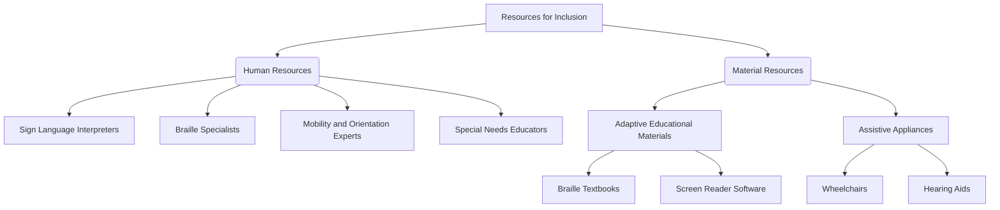
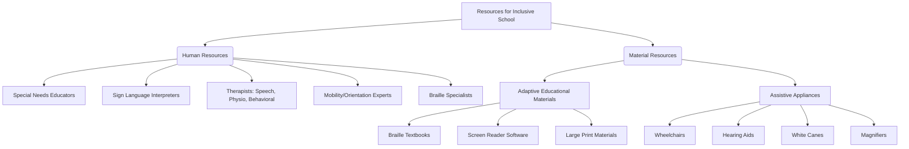
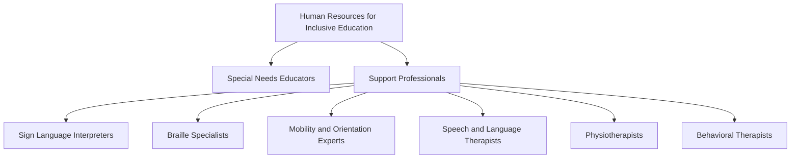
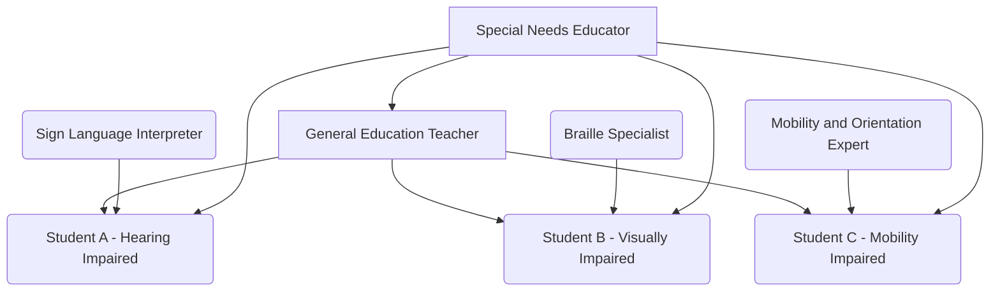
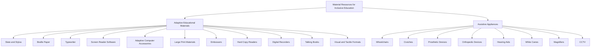
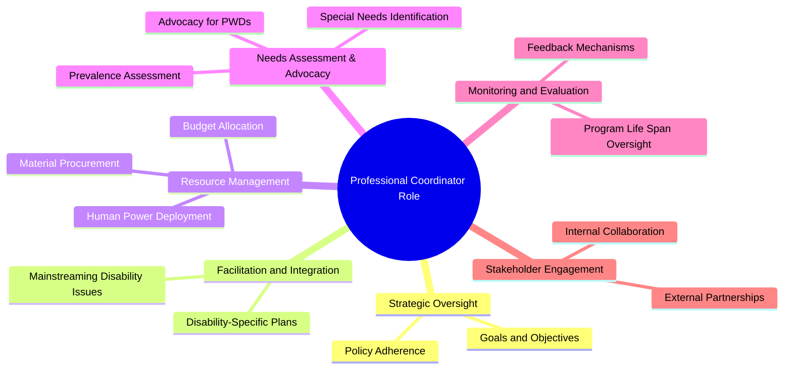

# 7 Resource Management For Inclusion

Comprehensive resource for 7 Resource Management For Inclusion.


---

## 7 Resource Management For Inclusion Hub


## Overview
This unit delves into the critical area of resource management for inclusion, emphasizing the importance of providing appropriate support for individuals with disabilities across various settings, particularly in educational environments. It explores both human and material resources essential for creating comfortable, secure, and accessible spaces where people with disabilities can thrive in independent and collaborative activities. Understanding these resources is crucial for mitigating the impact of activity limitations caused by impairments and enabling individuals to utilize their full potential. The unit also covers the strategic planning required to mainstream disability issues into broader institutional plans and to develop specific action plans tailored to the unique needs of persons with disabilities, highlighting the vital role of professional coordinators in this process.

## Learning Objectives
*   Identify the fundamental resources necessary for fostering an inclusive environment for people with disabilities.
*   Differentiate between various human and material resources vital for supporting inclusive education.
*   Explain the purpose and function of specialized educational settings like resource rooms and pull-out programs.
*   Articulate the key components and considerations involved in planning for inclusive services.
*   Distinguish between mainstreaming disability issues and developing disability-specific action plans.
*   Recognize the pivotal role of professional coordinators in effective inclusive planning and implementation.

## Unit Applications & Real-World Relevance
Resource management for inclusion is directly applicable across numerous sectors, from educational institutions and workplaces to social gatherings and recreational facilities. In real-world scenarios, effective resource allocation ensures that architectural barriers are removed, assistive technologies are available, and qualified personnel are present to support individuals with disabilities. This is particularly relevant in the design of public services, ensuring accessibility and equitable participation. For instance, in developing countries, understanding and advocating for these resources are paramount for implementing policies that promote the rights and inclusion of persons with disabilities, thereby fostering more equitable and just societies.

## Active Learning Prompts
*   Consider a public space you frequent. How well does it currently manage resources for inclusion? Identify at least three areas where resource provision could be improved, specifying both human and material resources.
*   If you were tasked with designing an inclusive school, what would be your top five priorities for resource allocation? Justify your choices based on their potential impact on student learning and well-being.
*   Reflect on a situation where a lack of appropriate resources might have excluded someone with a disability. How could better resource management have altered that outcome?

## Unit Challenges & Common Misconceptions
A common challenge in resource management for inclusion is the perception that it is an "opportunistic cost" rather than a fundamental investment. There's often a misconception that inclusion is solely about physical accessibility, overlooking the equally critical need for human resources and specialized pedagogical approaches. Another hurdle is the lack of comprehensive needs assessment for persons with disabilities, leading to misallocated or insufficient resources. Furthermore, the distinction between mainstreaming disability issues and creating targeted disability-specific action plans can be misunderstood, leading to either generic, ineffective solutions or isolated, non-integrated initiatives.

## Connections
  - [[Resources_for_Inclusion]]
    - [[Human_Resources_for_Inclusive_Education]]
    - [[Material_Resources_for_Inclusive_Education]]
    - [[Resource_Rooms_and_Pull_Out_Programs]]
  - [[Planning_for_Inclusive_Services]]
    - [[Mainstreaming_vs_Disability_Specific_Action_Plans]]
    - [[Role_of_Professional_Coordinators_in_Inclusive_Planning]]

## Next Steps for Deeper Understanding
To further deepen your understanding, explore case studies of successful inclusive programs in different countries or organizational settings. Research specific assistive technologies and their impact on individuals with various types of disabilities. Investigate policy frameworks related to disability rights and inclusion in your local context, paying attention to how they mandate resource allocation. Consider volunteering with organizations that support people with disabilities to gain firsthand experience with resource needs and challenges.

## Possible Questions
[[CC0113_7_Resource_Management_for_Inclusion_Possible_Questions]]

---

---

## Planning For Inclusive Services


## Definition
Before proceeding, understand that effective [[Resources_for_Inclusion]] requires strategic foresight. **Planning for Inclusive Services** involves the systematic process of anticipating, designing, and allocating resources to ensure that programs and services are accessible and equitable for individuals with disabilities. It's like building a city from scratch: you don't just put up buildings; you meticulously plan for roads, utilities, and public spaces to ensure everyone can move freely and access all facilities.

## The Mental Model
Imagine a large organization planning its annual budget. Instead of just allocating funds for general operations, 'Planning for Inclusive Services' is like adding a specific line item for "Accessibility Enhancements" or "Disability Support Services." This means consciously setting aside resources (money, materials, skilled staff) and integrating disability considerations into every phase of their programs, from initial concept to final evaluation. It's about proactive integration rather than reactive accommodation.

## Context & Framework
#### The "Pilot's Checklist" (Do Not Skip)
Planning for inclusive services demands a meticulous "pilot's checklist" approach, ensuring no critical step is missed. This involves comprehensively integrating disability issues across all stages of program development, from initial conceptualization to post-implementation monitoring. The checklist ensures that considerations such as budget allocation, material provision, and human resource deployment are systematically addressed, laying a robust foundation for genuinely inclusive outcomes. Skipping any item on this checklist can lead to significant accessibility gaps and service failures.

## The Mastery Deep Dive
#### The "Pilot's Checklist" (Do Not Skip)
Effective planning for inclusive services requires a non-negotiable "pilot's checklist" to ensure comprehensive integration of disability considerations. The first crucial step is the **assessment of the prevalence of PWDs and their special needs**. This is the absolute prerequisite, as you cannot plan effectively without knowing *who* you are serving and *what* their specific requirements are. Once needs are assessed, the checklist continues with the **allocation of ear-marked budget**, ensuring dedicated financial resources. This is followed by securing appropriate **materials** and identifying **skilled human power** to facilitate implementation. Throughout the program life span (planning, implementation, monitoring, and evaluation), the issue of disability must be **mainstreamed** at every stage. Finally, institutions are required to **assign a professional coordinator** to oversee and facilitate this entire process, acting as a dedicated guide on this complex flight.

#### The Warning Lights: Signs of Trouble
A major "warning light" in planning for inclusive services is the absence of a dedicated budget or explicit resource allocation. If an organization claims to be inclusive but has no "ear-marked budget" for disability-specific initiatives, it signals a lack of genuine commitment. Another critical warning light is the failure to conduct a **comprehensive needs assessment** of the prevalence and special needs of PWDs within the target population. Without this foundational step, any subsequent planning is based on assumptions, leading to ineffective or misdirected services. These are clear indicators that the planning process is off course and requires immediate correction.

## Constraints & Limitations
#### The "Duh!" Moment (Intuitive Proof)
A fundamental constraint is the attempt to plan for inclusive services without first understanding the specific needs of the population with disabilities. It is intuitively impossible to create effective solutions if you do not know the problems you are trying to solve. This "duh!" moment underscores that assessment of the prevalence of PWDs and their special needs is an **absolute prerequisite** for any meaningful planning. Without this foundational understanding, any allocated budget or resources risk being misdirected or insufficient.

## Significance & Application
Planning for inclusive services is the bedrock upon which equitable societies are built. Academically, it draws from fields like public administration, social policy, and disability studies, emphasizing systematic approaches to social justice. In practice, this planning ensures that public services (education, healthcare, infrastructure) are designed with accessibility in mind from the outset, rather than as an afterthought. It dictates budget allocations, resource procurement, and the deployment of [[Human_Resources_for_Inclusive_Education]] to meet specific needs, thereby transforming policies of inclusion into tangible, functional realities.

## The Worked Example
This concept is best illustrated by a pilot's checklist for initiating an inclusive program.

1.  **`- [x]` Step 1: Conduct a comprehensive assessment of the prevalence of PWDs and their specific needs within the target community.** (This is the absolute prerequisite for planning. Without knowing the scope and nature of disabilities, effective planning is impossible.)
2.  **`- [x]` Step 2: Mainstream the issue of disability into the general annual action plan of the institution.** (Integrate disability considerations into all existing programs, not just create separate ones.)
3.  **`- [x]` Step 3: Develop disability-specific action plans to meet the special needs of targeted persons with disabilities.** (Create specialized interventions where mainstreaming is insufficient.)
4.  **`- [x]` Step 4: Allocate an ear-marked budget and secure necessary materials specifically for disability-mainstreamed programs and services.** (Ensure dedicated financial and tangible resources are available.)
5.  **`- [x]` Step 5: Identify and assign skilled human power, including a professional coordinator, to facilitate and oversee the implementation.** (Ensure the right expertise is in place.)
6.  **`- [x]` Step 6: Integrate disability considerations at all stages of program lifecycle: planning, implementation, monitoring, and evaluation.** (Ensure continuous oversight and adaptation.)

*Note: This checklist provides a step-by-step guide for planning inclusive services, emphasizing crucial actions and their sequence. The checks `- [x]` indicate completed mandatory steps.*

## The Proving Ground
*Test your mastery. Cover the solutions below to test yourself first.*

#### Level 1: The Sanity Check (Verification)
**The Tool Check:** What is the critical prerequisite for effective planning for inclusive services?
> **Solution:** Assessment of the prevalence of Persons with Disabilities (PWDs) and their special needs.

#### Level 2: The Crucible (Mastery & Edge Cases)
**The Routine Run:** A municipal council is initiating a new public transport program and wants to ensure it is inclusive. Outline the three key stages of program implementation where the issue of disability should be explicitly considered, as per the planning principles for inclusive services.
> **Solution:** The issue of disability should be considered at the **planning**, **implementation**, and **monitoring and evaluation** steps of programs crafted by implementing institutions.

#### Level 3: Mastery (The Crucible)
**The Disaster Drill:** A newly established NGO announces a "fully inclusive" community development project but has not assigned any professional coordinator. Identify the immediate failure mode this omission creates, and explain how the absence of this role acts as a significant "warning light" for the project's long-term success in truly serving persons with disabilities, as derived from the deep dive.
> **Solution:** The immediate failure mode is a severe lack of systematic oversight and facilitation, leading to disjointed efforts and potential gaps in service delivery. The absence of a professional coordinator is a significant "warning light" because, as derived from the deep dive, this role is explicitly required to oversee and facilitate the entire complex process of inclusive planning and implementation. Without a dedicated coordinator, the crucial steps of assessing needs, allocating earmarked budgets, securing materials, identifying skilled human power, and ensuring disability issues are mainstreamed across all program stages are unlikely to be effectively managed or integrated, making the "fully inclusive" claim highly suspect and prone to failure in meeting the actual needs of persons with disabilities.

## Key Takeaways
*   Planning for inclusive services is a systematic process that integrates disability considerations into all stages of program development and resource allocation.
*   A comprehensive assessment of the prevalence and special needs of PWDs is an absolute prerequisite for effective inclusive planning.
*   Key elements of inclusive planning include mainstreaming disability issues into general action plans, developing disability-specific action plans, allocating earmarked budgets, and assigning professional coordinators.

## Knowledge Graph Connections
| Concept                                       | Connection / Relationship                                                                   |
| :
-------------------------------------------- | :
------------------------------------------------------------------------------------------ |
| [[Resources_for_Inclusion]]                   | Planning is essential for the effective allocation and management of resources for inclusion. |
| [[Mainstreaming_vs_Disability_Specific_Action_Plans]] | Planning for inclusive services involves both mainstreaming and disability-specific action plans. |
| [[Role_of_Professional_Coordinators_in_Inclusive_Planning]] | Professional coordinators play a vital role in facilitating and overseeing inclusive planning processes. |
---

---

## Resources For Inclusion


## Definition
Before proceeding, understand that **Resources for Inclusion** are the fundamental tools, personnel, and environmental adaptations essential for creating accessible and supportive environments. It's like building a strong, accessible house: you need the right bricks, tools, and skilled builders to make sure everyone can live comfortably and securely. Without these resources, individuals with disabilities face significant barriers, limiting their participation and potential.

## The Mental Model
Imagine trying to navigate a city if all the street signs were in a language you didn't understand, or if all the ramps were replaced with stairs. You'd feel lost, frustrated, and excluded. Resources for inclusion are like making sure there are signs in multiple languages, and ramps everywhere, so everyone can move freely and participate fully. It's about providing the necessary support so that an individual's impairment doesn't become a barrier to their activity or potential.


```text
// Scenario 1: Breakdown of resources
// Output:
// A[Resources for Inclusion] is the main concept.
// It branches into two main categories: B(Human Resources) and C(Material Resources).
// B(Human Resources) further branches into specific roles like D[Sign Language Interpreters], E[Braille Specialists], F[Mobility and Orientation Experts], and G[Special Needs Educators].
// C(Material Resources) branches into H[Adaptive Educational Materials] and I[Assistive Appliances].
// H[Adaptive Educational Materials] includes J[Braille Textbooks] and K[Screen Reader Software].
// I[Assistive Appliances] includes L[Wheelchairs] and M[Hearing Aids].
```
*Note: This `graph TD` illustrates the primary categories of resources necessary for fostering inclusion and provides examples within each category.*

## Context & Framework
#### The Family Tree
Resources for inclusion can be broadly categorized into human and material resources, forming a "family tree" where the overarching concept branches into these two vital categories. Human resources encompass the specialized professionals and support staff who provide direct assistance, while material resources include the adaptive tools, equipment, and accessible environments that facilitate participation. This categorization helps in systematically addressing the diverse needs of individuals with disabilities and ensuring a comprehensive approach to inclusion. Understanding this structure is critical for effective planning and allocation.

## The Mastery Deep Dive
#### The Family Tree
The "family tree" of resources for inclusion clearly delineates between the active, interactive support provided by individuals and the tangible, environmental support offered by objects and adaptations. Human resources, such as Special_Needs_Educators or Sign_Language_Interpreters, are dynamically responsive to individual needs, offering tailored instruction, communication facilitation, and therapeutic interventions. In contrast, material resources, ranging from Adaptive_Educational_Materials_And_Devices to Assistive_Appliances, provide the foundational accessibility and tools for independent functioning, often enabling access to information or physical spaces that would otherwise be inaccessible. Both are interdependent; for instance, a Braille specialist (human resource) leverages Braille textbooks (material resource).

#### The Cheat Code: How to Remember This
Think of it as the "H-M" rule: "H" for Human, "M" for Material. Human resources are the *people* who help, like a helpful "Human" friend. Material resources are the *things* that help, like a helpful "Material" tool. This simple mnemonic helps categorize the broad spectrum of resources needed to support people with disabilities. The "H-M" distinction is crucial for remembering the two primary pillars of inclusive resource management.

## Constraints & Limitations
#### The "Duh!" Moment (Intuitive Proof)
A critical limitation is the perception of "opportunistic cost." While providing resources for people with disabilities may incur initial expenses, neglecting these resources leads to greater long-term societal costs, including reduced productivity, increased dependency, and violations of human rights. Thus, investing in inclusive resources is not merely an expense but a strategic imperative that yields significant social and economic returns by enabling full participation and harnessing the potential of all individuals.

## Significance & Application
Resources for inclusion are fundamental to realizing the principles of equity and human rights. Academically, this understanding informs special education, disability studies, and public policy, highlighting the practical requirements for implementing inclusive legislation. In real-world applications, it guides the design of accessible infrastructure, the development of assistive technologies, and the provision of support services in diverse settings, ultimately fostering environments where people with disabilities can achieve their full potential and contribute meaningfully to society.

## The Worked Example
This concept is best understood by considering a concrete example of a resource breakdown in an inclusive school.


```text
// Scenario 1: Resource mapping for an inclusive school.
// Output:
// A[Resources for Inclusive School] is the main category.
// It branches into B(Human Resources) and C(Material Resources).
// B(Human Resources) details include B1[Special Needs Educators], B2[Sign Language Interpreters], B3[Therapists: Speech, Physio, Behavioral], B4[Mobility/Orientation Experts], and B5[Braille Specialists].
// C(Material Resources) details include C1[Adaptive Educational Materials] and C2[Assistive Appliances].
// C1[Adaptive Educational Materials] further breaks down into C1a[Braille Textbooks], C1b[Screen Reader Software], and C1c[Large Print Materials].
// C2[Assistive Appliances] further breaks down into C2a[Wheelchairs], C2b[Hearing Aids], C2c[White Canes], and C2d[Magnifiers].
```
*Note: This `graph TD` illustrates a comprehensive breakdown of human and material resources within an inclusive school setting. It visually represents the various types of support needed to ensure accessibility and tailored education.*

## The Proving Ground
*Test your mastery. Cover the solutions below to test yourself first.*

#### Level 1: The Sanity Check (Verification)
**The Neighbor Check:** List the two primary categories into which resources for inclusion are typically divided.
> **Solution:** The two primary categories are Human Resources and Material Resources.

#### Level 2: The Crucible (Mastery & Edge Cases)
**The Impostor:** A school administrator argues, "Investing in expensive assistive technology for only a few students is an 'opportunistic cost' we cannot afford when the budget is tight." Using the reasoning discussed in this note, explain why this perspective is flawed and how it overlooks the true value proposition of inclusive resource provision.
> **Solution:** The administrator's perspective is a 'false friend' because it views inclusive resources purely as an expense rather than a fundamental investment. While there's an initial cost, neglecting these resources leads to greater long-term societal costs, including reduced productivity, increased dependency, and violations of human rights. Investing in inclusive resources yields significant social and economic returns by enabling full participation and harnessing the potential of all individuals, thereby transforming a perceived "opportunistic cost" into a strategic imperative that benefits society as a whole. This aligns with the understanding that the occurrence of impairment requires mitigating the impact of activity limitation, enabling individuals to use their potential and capacity.

## Key Takeaways
*   Resources for inclusion, encompassing both human and material elements, are crucial for creating accessible and supportive environments that mitigate the impact of activity limitations caused by impairments.
*   The provision of these resources should be considered an essential investment, not an "opportunistic cost," enabling individuals with disabilities to participate fully and utilize their potential.
*   Effective resource management for inclusion requires a systematic approach, understanding the distinct roles of specialized personnel and adaptive tools in fostering equitable participation across all settings.

## Knowledge Graph Connections
| Concept                                       | Connection / Relationship                                                                 |
| :
-------------------------------------------- | :
---------------------------------------------------------------------------------------- |
| [[Human_Resources_for_Inclusive_Education]]   | Human resources are a primary category of resources for inclusion.                       |
| [[Material_Resources_for_Inclusive_Education]]| Material resources are a primary category of resources for inclusion.                    |
| [[Planning_for_Inclusive_Services]]           | Effective planning is essential for the strategic allocation of resources for inclusion. |
---

---

## Human Resources For Inclusive Education


## Definition
Before proceeding, ensure you grasp [[Resources_for_Inclusion]] as human resources are a subset of these broader supports. **Human Resources for Inclusive Education** refers to the specialized personnel and support staff required to facilitate the learning and development of students with disabilities in an inclusive school environment. It's like having expert coaches for a diverse sports team, each specializing in different aspects to ensure every player, regardless of their unique abilities, can participate and excel.

## The Mental Model
Imagine a complex theatrical production where actors have diverse needs: some use wheelchairs, some communicate non-verbally, and others have learning differences. The human resources are the dedicated crew: the sign language interpreter for the audience, the mobility expert ensuring stage accessibility, the special needs educators who adapt scripts, and the speech therapist helping actors project. Each person's specialized skill ensures the entire production is inclusive and successful for everyone involved.


```text
// Scenario 1: Hierarchy of Human Resources in Inclusive Education.
// Output:
// A[Human Resources for Inclusive Education] is the main category.
// It branches into B[Special Needs Educators] and C[Support Professionals].
// C[Support Professionals] further branches into D[Sign Language Interpreters], E[Braille Specialists], F[Mobility and Orientation Experts], G[Speech and Language Therapists], H[Physiotherapists], and I[Behavioral Therapists].
```
*Note: This `graph TD` illustrates the various types of human resources that contribute to an inclusive educational environment, categorized by their primary roles.*

## Context & Framework
#### The Family Tree
Human resources for inclusive education form a crucial "family tree" of support roles, with each branch addressing a specific area of need for students with disabilities. This includes professionals who adapt curriculum, facilitate communication, assist with mobility, and provide therapeutic interventions. The collective expertise of these individuals creates a multidisciplinary team capable of addressing the diverse and complex challenges students with special needs may encounter. This structured approach ensures that all aspects of a student's learning and well-being are supported.

## The Mastery Deep Dive
#### The Family Tree
The "family tree" of human resources for inclusive education highlights the specialized expertise required to meet diverse student needs. At the core are Special_Needs_Educators, who adapt curriculum and teaching methods. Branching from them are various support professionals: Sign_Language_Interpreters facilitate communication for the hearing impaired, Braille_Specialists enable literacy for the visually impaired, and Mobility_And_Orientation_Experts assist with safe navigation. Additionally, allied health professionals like Speech_And_Language_Therapists, Physiotherapists, and Behavioral_Therapists address specific developmental, physical, and behavioral challenges, respectively. This comprehensive array of human resources ensures that every student receives tailored support, fostering both academic success and personal development within an inclusive setting.

#### The Cheat Code: How to Remember This
Think of the "S.P.E.C.T.R.U.M." of human resources: **S**ign Language, **P**hysio, **E**ducators (Special Needs), **C**ommunity (Mobility), **T**herapists (Speech, Behavioral), **R**eading (Braille), **U**nity (Coordination), **M**ulti-disciplinary. While not perfectly encompassing every title, this helps group the diverse range of professionals. Another simple cheat code is to remember "The 3 Ps and the 2 Ss": **P**hysiotherapists, **P**sychologists/Behavioral Therapists, **P**arents (though not directly school staff, they are crucial human resources), **S**ign language interpreters, and **S**pecial needs educators.

## Constraints & Limitations
#### The "Duh!" Moment (Intuitive Proof)
A significant limitation is the common oversight that one general educator cannot fulfill all roles. Expecting a single teacher to also be a Braille specialist, a sign language interpreter, and a speech therapist is unrealistic and unsustainable. This intuitive proof highlights the indispensable need for a diverse team of specialized human resources to effectively implement inclusive education, ensuring that students receive the specific expertise required for their unique learning profiles. Without such specialization, inclusive efforts risk becoming superficial and ineffective.

## Significance & Application
Human resources are the heart of inclusive education, transforming policy into practice. Academically, this defines critical roles in special education and educational psychology, informing training programs for various specialists. In practice, these professionals implement individualized education plans, adapt learning materials, provide therapeutic interventions, and facilitate communication, ensuring that students with disabilities can access the curriculum, participate in school life, and develop essential skills. Their expertise is crucial for addressing the diverse learning styles and characteristics of students, using multisensory and specialized approaches.

## The Worked Example
Consider a diverse classroom with students requiring various supports.


```text
// Scenario 1: Classroom support system with human resources.
// Output:
// The General Education Teacher interacts with Student A (Hearing Impaired), Student B (Visually Impaired), and Student C (Mobility Impaired).
// A Sign Language Interpreter provides support to Student A.
// A Braille Specialist provides support to Student B.
// A Mobility and Orientation Expert provides support to Student C.
// A Special Needs Educator supports the General Education Teacher and also directly assists Students A, B, and C by adapting content and strategies.
```
*Note: This `graph TD` visually depicts how different human resources collaborate to support students with various disabilities within an inclusive classroom, ensuring each student receives tailored assistance.*

## The Proving Ground
*Test your mastery. Cover the solutions below to test yourself first.*

#### Level 1: The Sanity Check (Verification)
**The Neighbor Check:** Identify three types of human resources that directly assist students with special educational needs.
> **Solution:** Special Needs Educators, Sign Language Interpreters, and Braille Specialists (other valid answers include Mobility and Orientation Experts, Speech and Language Therapists, Physiotherapists, Behavioral Therapists).

#### Level 2: The Crucible (Mastery & Edge Cases)
**The Impostor:** A school board decides to reduce costs by eliminating the roles of Braille specialists and mobility experts, arguing that "modern technology and general classroom aids can cover their functions." Explain why this decision is a 'false friend' to inclusive education, specifically highlighting the unique and indispensable expertise these human resources provide that technology alone cannot replace.
> **Solution:** This decision is a 'false friend' because it fundamentally misunderstands the irreplaceable, specialized expertise of Braille specialists and mobility experts. While technology like screen readers and GPS can assist, a **Braille specialist** doesn't just provide Braille materials; they teach Braille literacy, tactile reading strategies, and support the development of crucial cognitive skills for visually impaired students. A **Mobility and Orientation Expert** provides training in safe, independent travel and environmental awareness, often in complex, dynamic settings that technology cannot fully replicate. These roles involve pedagogical and practical skills, adapting to individual learning styles and characteristics, which are beyond the scope of general classroom aids or even advanced technology. The physical presence and specialized training by these professionals are essential for developing true independence and mastery, especially in real-world situations, addressing unique needs through multisensory and specialized approaches.

## Key Takeaways
*   Human resources are the specialized personnel, such as special needs educators, sign language interpreters, and therapists, who provide direct, tailored support to students with disabilities in inclusive settings.
*   These professionals are crucial for adapting curriculum, facilitating communication, assisting with mobility, and providing therapeutic interventions, addressing the diverse learning styles and characteristics of students.
*   The absence of adequate and specialized human resources severely compromises the effectiveness of inclusive education, as their expertise cannot be fully replaced by general educators or technology alone.

## Knowledge Graph Connections
| Concept                            | Connection / Relationship                                                                   |
| :
--------------------------------- | :
------------------------------------------------------------------------------------------ |
| [[Resources_for_Inclusion]]        | Human resources are a primary category of the broader concept of resources for inclusion. |
| [[Resource_Rooms_and_Pull_Out_Programs]] | Human resources, like special needs educators, are central to the functioning of resource rooms. |
| [[Planning_for_Inclusive_Services]]| Planning for inclusive services must strategically allocate and manage human resources. |
---

---

## Mainstreaming Vs Disability Specific Action Plans


## Definition
Before proceeding, grasp [[Planning_for_Inclusive_Services]] as these two concepts are key facets of this process. **Mainstreaming** refers to integrating disability issues into the general annual action plans and services of an institution, ensuring that mainstream provisions are accessible to all. A **Disability-Specific Action Plan** involves developing targeted strategies and interventions explicitly designed to meet the unique and specialized needs of persons with disabilities, which general mainstreaming efforts might not fully address.

## The Mental Model
Imagine building a new public park. **Mainstreaming** is like designing all paths to be wide and gently sloped from the beginning, so everyone, including those with wheelchairs or strollers, can use them. A **Disability-Specific Action Plan** would be adding a specialized sensory garden for children with autism or a Braille information panel for visually impaired visitors, going beyond general accessibility to address unique needs. Both are crucial for true inclusion, but one ensures general access while the other caters to particular requirements.

## Context & Framework
#### The "Kill Sheet"
Mainstreaming and disability-specific action plans represent two complementary but distinct approaches within inclusive planning. Mainstreaming aims for universal accessibility within existing systems, while disability-specific plans address unique needs that require specialized interventions. A balanced strategy integrates both, ensuring that general provisions are inclusive while targeted support is available where necessary. Understanding when to apply each approach is crucial for comprehensive service delivery.

## The Mastery Deep Dive
#### The "Kill Sheet"
The crucial distinction between **Mainstreaming** and **Disability-Specific Action Plans** lies in their scope and focus within [[Planning_for_Inclusive_Services]]. **Mainstreaming** aims to integrate disability issues into the *general* annual action plan, ensuring that all existing provisions, services, and environments are universally accessible and inclusive. Its goal is to make the "mainstream" fit for everyone, such as designing all new buildings with ramps and elevators from the outset. Conversely, a **Disability-Specific Action Plan** is developed to address unique, specialized needs that might not be fully met by general mainstreaming efforts. This involves creating targeted interventions or services tailored to specific disabilities, like a specialized sign language interpretation service for a particular event, or a Braille production unit within a university. The "Kill Sheet" below highlights the essential differences.

#### The "Wikipedia One-Liner"
Mainstreaming integrates disability considerations into general plans, while disability-specific action plans provide targeted interventions for unique needs.

## Constraints & Limitations
#### The Hard Choice: Option A or Option B?
A common strategic dilemma is deciding whether to focus primarily on mainstreaming or to invest heavily in disability-specific plans when resources are limited. Over-reliance on mainstreaming can overlook nuanced needs, while excessive focus on specific plans can lead to fragmentation or parallel systems that may inadvertently segregate. The hard choice is to find the optimal balance where mainstream efforts create broad accessibility, and specific plans fill critical gaps without undermining integration. This necessitates a careful analysis of the specific context and the needs of the target population.

## Significance & Application
These two planning facets are fundamental to achieving genuine inclusion. Academically, they are central to policy studies, public administration, and human rights frameworks, guiding how governments and organizations structure their services. In practice, mainstreaming ensures that basic services like public transport, education, and healthcare are accessible to the widest possible population. Disability-specific plans, on the other hand, provide essential, tailored support for issues like specialized communication methods, therapeutic interventions, or accessible educational materials that general provisions might not cover. A failure to utilize both approaches leads to either superficial inclusion or fragmented support.

## The Worked Example
Consider a university developing an inclusive strategy for its students.

| Feature                    | Mainstreaming (General Annual Action Plan)                                         | Disability-Specific Action Plan                                                    |
| :
------------------------- | :
--------------------------------------------------------------------------------- | :
--------------------------------------------------------------------------------- |
| **Primary Goal**           | Ensure universal accessibility and inclusion within existing general provisions.   | Address unique, specialized needs not fully met by general mainstreaming.          |
| **Scope**                  | Broad: Applies to all students, general infrastructure, and standard services.     | Targeted: Focuses on specific disabilities or particular functional needs.         |
| **Examples**               | - All lecture halls have accessible ramps. <br> - University website meets WCAG standards. <br> - All academic advisors trained in general disability awareness. | - Provision of Braille textbooks for visually impaired students. <br> - Dedicated sign language interpreters for specific courses. <br> - Accessible transportation service for students with severe mobility impairments. |
| **Risk of Exclusion (if solely applied)** | May overlook nuanced needs, leading to subtle barriers for some individuals.       | May lead to parallel, potentially segregating systems if not integrated with mainstreaming. |
| **The Gotcha Difference**  | **Focuses on making the *general* accessible.**                                    | **Focuses on providing *specialized* where general is insufficient.**              |

*Note: This table vividly illustrates the differences between mainstreaming and disability-specific action plans, using examples relevant to a university setting. The "Gotcha Difference" highlights their core distinction.*

## The Proving Ground
*Test your mastery. Cover the solutions below to test yourself first.*

#### Level 1: The Sanity Check (Verification)
**The Fact Check:** What are the two main facets of planning for inclusive services regarding disability?
> **Solution:** Mainstreaming the issue of disability in the general annual action plan of the institution, and developing disability-specific action plans to meet the special needs of the targeted persons with disabilities.

#### Level 2: Competence (Application)
**The Trade-off:** A new city park is being designed. Identify an example of how "mainstreaming" would be applied in its design, and an example of a "disability-specific action plan" that might be implemented in addition to mainstreaming to enhance inclusivity.
> **Solution:** **Mainstreaming:** Ensuring all pathways are wide, smooth, and gently sloped to accommodate wheelchairs and strollers. **Disability-Specific Action Plan:** Installing a specialized sensory garden with tactile elements and fragrant plants for visitors with visual impairments or sensory processing disorders, or providing Braille maps of the park.

#### Level 3: Mastery (The Crucible)
**The Impostor:** A government official states, "Our new policy focuses entirely on mainstreaming disability issues across all departments. Therefore, dedicated disability-specific programs are no longer necessary." Explain why this statement represents a 'false friend' and clarify how, for certain needs, a purely mainstreaming approach will inherently fall short, necessitating disability-specific interventions.
> **Solution:** This statement is a 'false friend' because it misinterprets the complementary nature of mainstreaming and disability-specific action plans. While mainstreaming is vital for ensuring general accessibility, it inherently **falls short** in addressing unique, specialized needs that are not covered by universal design. For example, a mainstream accessible building (ramps, elevators) is excellent, but it won't provide Sign_Language_Interpreters for a deaf person at a public meeting, or Braille materials for a blind student in a classroom. These are specific needs that demand **disability-specific interventions**. A purely mainstreaming approach risks creating a superficial sense of inclusion, leaving individuals with highly specialized requirements unsupported and effectively excluded from full participation. Both approaches are essential for true, comprehensive inclusion.

## Key Takeaways
*   Mainstreaming involves integrating disability issues into general institutional plans and services to achieve universal accessibility.
*   Disability-specific action plans are targeted strategies designed to meet unique needs not fully addressed by mainstream efforts.
*   Effective inclusive planning requires a balanced approach, combining broad mainstreaming initiatives with specific, tailored interventions to ensure comprehensive support for all persons with disabilities.

## Knowledge Graph Connections
| Concept                                       | Connection / Relationship                                                                   |
| :
-------------------------------------------- | :
------------------------------------------------------------------------------------------ |
| [[Planning_for_Inclusive_Services]]           | Mainstreaming and disability-specific action plans are two critical facets of inclusive planning. |
| [[Resources_for_Inclusion]]                   | Both planning approaches guide the allocation of resources for inclusion.                  |
| [[Role_of_Professional_Coordinators_in_Inclusive_Planning]] | Professional coordinators are instrumental in overseeing both mainstreaming efforts and disability-specific plans. |
---

---

## Material Resources For Inclusive Education


## Definition
Before proceeding, ensure you understand [[Resources_for_Inclusion]] as material resources are a specific type of support within this broader concept. **Material Resources for Inclusive Education** encompass the adaptive educational materials, devices, and assistive appliances that provide physical and sensory access to learning environments and activities for students with disabilities. It's like having specialized tools in a workshop: you need different hammers, wrenches, or saws to build various projects, just as students with diverse needs require specific materials and devices to access education.

## The Mental Model
Imagine a builder trying to construct a house with only one type of tool, regardless of the task. They'd struggle, or the house wouldn't be accessible. Material resources are like a builder's varied toolkit: a ramp for wheelchair access (assistive appliance), Braille paper for a visually impaired student (adaptive material), or a digital recorder for a student with writing difficulties (assistive device). Each tool serves a specific purpose, collectively building an inclusive educational environment.


```text
// Scenario 1: Breakdown of Material Resources for Inclusive Education.
// Output:
// A[Material Resources for Inclusive Education] is the main category.
// It branches into B[Adaptive Educational Materials] and C[Assistive Appliances].
// B[Adaptive Educational Materials] further branches into D[Slate and Stylus], E[Braille Paper], F[Typewriter], G[Screen Reader Software], H[Adaptive Computer Accessories], I[Large Print Materials], J[Embossers], K[Hard Copy Readers], L[Digital Recorders], M[Talking Books], and N[Visual and Tactile Formats].
// C[Assistive Appliances] further branches into O[Wheelchairs], P[Crutches], Q[Prosthetic Devices], R[Orthopedic Devices], S[Hearing Aids], T[White Canes], U[Magnifiers], and V[CCTV].
```
*Note: This `graph TD` illustrates the comprehensive range of material resources, categorized into adaptive educational materials and assistive appliances, essential for fostering inclusive education.*

## Context & Framework
#### The Family Tree
Material resources for inclusive education represent a "family tree" of tools and technologies designed to bridge the gap between a student's impairment and their ability to access the curriculum. This includes adaptive educational materials that transform information into accessible formats (e.g., Braille, large print) and assistive appliances that provide physical support or compensate for sensory deficits (e.g., wheelchairs, hearing aids). This structured array of resources ensures that students with diverse needs can interact with their learning environment effectively, promoting independence and full participation.

## The Mastery Deep Dive
#### The Family Tree
The "family tree" of material resources for inclusive education is extensive, addressing a wide array of sensory, physical, and cognitive access needs. Adaptive_Educational_Materials_And_Devices directly modify or present learning content in alternative formats; examples include Slate_And_Stylus and Braille_Paper for tactile writing, Screen_Reader_Software and Adaptive_Computer_Accessories for digital content, Large_Print_Materials and Embossers for visual enhancements, and Talking_Books for auditory learning. Complementing these are Assistive_Appliances, which provide physical or functional support, such as Wheelchairs and Crutches for mobility, Hearing_Aids for auditory enhancement, White_Canes for navigation, and Magnifiers for visual aids. This comprehensive suite of material resources empowers students with disabilities to engage with academic content and the school environment independently.

#### The Cheat Code: How to Remember This
Think of "A.A.A." for "Adaptive, Assistive, Access." Adaptive materials *adapt* the content (like large print). Assistive appliances *assist* the body (like a wheelchair). Both enable *access* to education. Another way is to remember the sensory modalities they support: Visual (magnifiers, large print), Auditory (hearing aids, talking books), Tactile (Braille, slate and stylus), and Mobility (wheelchairs, crutches).

## Constraints & Limitations
#### The "Duh!" Moment (Intuitive Proof)
A critical limitation is the assumption that one-size-fits-all materials are sufficient. Standard textbooks, for instance, are intuitively inadequate for a student who is blind or has severe dyslexia. This "duh!" moment underscores the fundamental need for adapted educational materials, demonstrating that a universal approach without specialized resources will inevitably exclude certain learners. This illustrates the intrinsic requirement to adapt methods and materials to students' learning styles and characteristics using multisensory and other specialized approaches.

## Significance & Application
Material resources are the tangible backbone of an accessible learning environment. Academically, this area of study falls within special education technology and universal design for learning, emphasizing the importance of diverse formats and tools. In practice, these resources enable students with disabilities to read, write, communicate, and navigate their school environment independently. From Braille textbooks to screen readers, and from wheelchairs to hearing aids, these materials are indispensable for ensuring equitable participation and academic success, directly impacting a student's ability to engage with curriculum and interact with peers.

## The Worked Example
Consider a student with a visual impairment in a mainstream classroom.

```mermaid
graph TD
    Teacher[Teacher] --> Student[Visually Impaired Student]
    Student -- Needs Access to --> Curriculum[Curriculum Content]

    SubGraph "Material Resources Applied"
        C1[Large Print Textbooks] --> Student
        C2[Screen Reader Software] --> Student
        C3[Adaptive Computer Accessories] --> Student
        C4[Digital Recorder] --> Student
        C5[Magnifier] --> Student
    End

    Curriculum -- Delivered via --> C1
    Curriculum -- Accessed via --> C2
    Curriculum -- Interacted via --> C3
    Curriculum -- Captured via --> C4
    Curriculum -- Enhanced via --> C5
```
```text
// Scenario 1: Material resource support for a visually impaired student.
// Output:
// The Teacher interacts with the Visually Impaired Student.
// The Student needs access to Curriculum Content.
// Various Material Resources are applied to help the student access the curriculum:
// - Large Print Textbooks
// - Screen Reader Software
// - Adaptive Computer Accessories
// - Digital Recorder
// - Magnifier
// These resources help deliver, access, interact with, capture, and enhance the curriculum content for the student.
```
*Note: This `graph TD` illustrates how various material resources are specifically deployed to ensure a visually impaired student can access and engage with curriculum content in an inclusive classroom.*

## The Proving Ground
*Test your mastery. Cover the solutions below to test yourself first.*

#### Level 1: The Sanity Check (Verification)
**The Neighbor Check:** List three examples of material resources that are categorized as "adaptive educational materials."
> **Solution:** Slate and stylus, Braille paper, screen reader software, adaptive computer accessories, large print materials, embossers, hard copy readers, digital recorders, Talking Books, materials prepared in visual and tactile formats (any three are sufficient).

#### Level 2: The Crucible (Mastery & Edge Cases)
**The Impostor:** A school's budget committee proposes to cut spending on "specialized equipment" like wheelchairs and hearing aids, arguing that "these are personal items that families should provide, not the school's responsibility." Explain why this argument is a 'false friend' to inclusive education and how the provision of such assistive appliances by the school is crucial for fostering an inclusive environment.
> **Solution:** This argument is a 'false friend' because it misinterprets the school's role in providing an accessible and inclusive learning environment. While some assistive appliances might be personal, the school's provision of items like **wheelchairs (for on-site use or emergencies)** and **hearing aids (or related amplification systems)** is often crucial for ensuring students can fully access and participate in all school-based services and activities. Excluding these due to perceived "personal item" status creates significant barriers to education, violating principles of accessibility and equity. These are essential tools for mitigating the impact of activity limitations, directly enabling students to use their potential and capacity by adapting methods and materials to their learning styles and characteristics.

## Key Takeaways
*   Material resources for inclusive education encompass adaptive educational materials and assistive appliances that provide physical and sensory access to learning environments.
*   These resources, such as Braille textbooks, screen reader software, wheelchairs, and hearing aids, are indispensable for enabling students with disabilities to participate independently in academic and school activities.
*   The thoughtful provision and adaptation of material resources are critical for overcoming barriers related to diverse learning styles and characteristics, fostering an equitable and accessible educational experience.

## Knowledge Graph Connections
| Concept                                       | Connection / Relationship                                                                   |
| :
-------------------------------------------- | :
------------------------------------------------------------------------------------------ |
| [[Resources_for_Inclusion]]                   | Material resources are a primary category of the broader concept of resources for inclusion. |
| [[Human_Resources_for_Inclusive_Education]]   | Human resources often utilize material resources to provide specialized support (e.g., Braille specialist using Braille paper). |
| [[Planning_for_Inclusive_Services]]           | Strategic planning is necessary to identify, procure, and deploy appropriate material resources for inclusion. |
---

---

## Resource Rooms And Pull Out Programs


## Definition
Before proceeding, understand that these are specific educational strategies that leverage [[Human_Resources_for_Inclusive_Education]] and [[Material_Resources_for_Inclusive_Education]]. **Resource Rooms** and **Pull-Out Programs** are specialized educational interventions designed to provide targeted instruction and support to students with disabilities and learning difficulties who are primarily enrolled in regular education classes. A resource room is a dedicated classroom for special education, while a pull-out program involves withdrawing students from the regular classroom for individualized or small-group instruction for part of the day.

## The Mental Model
Imagine a student struggling to understand a specific concept in a large group setting. A resource room is like a quiet, specialized study lounge within the main library where expert tutors (special needs educators) are available with tailored materials to help students overcome specific hurdles. A pull-out program is akin to a student temporarily leaving their main class to get one-on-one help from a tutor in a separate, quiet corner, then returning to their main class once they've grasped the concept. Both aim to provide focused support without fully removing the student from the mainstream.

## Context & Framework
#### The "Kill Sheet"
Resource rooms and pull-out programs serve similar overarching goals (providing specialized support) but differ significantly in their implementation and primary setting. Understanding these distinctions is crucial for educators to select the most appropriate intervention based on a student's individual needs and the school's resources. Both aim to support students who belong to a regular class but need some special instructions, and both include remedial, compensatory, and developmental instruction.

## The Mastery Deep Dive
#### The "Kill Sheet"
The distinction between **Resource Rooms** and **Pull-Out Programs** lies primarily in their setting and the continuity of specialized instruction. A **Resource Room** is a dedicated, physical classroom where a special education program is consistently delivered. Students typically attend the resource room for specific periods during the day, receiving instruction in a small-group or individualized setting from a Special_Needs_Educator. The environment and resources are explicitly designed for students with disabilities and learning difficulties. Conversely, a **Pull-Out Program** describes the *action* of a student being "pulled out" from their regular classroom to receive special instructions, which might occur in a resource room, a designated quiet space, or even another classroom. The defining characteristic is the temporary removal from the mainstream class for targeted support, often for certain hours per week, focusing on remedial, compensatory, or developmental instruction. The "Kill Sheet" below highlights these key differences.

#### The "Wikipedia One-Liner"
A resource room is a designated classroom where specialized education is delivered, while a pull-out program is the practice of temporarily removing students from their general education class for targeted, small-group instruction.

## Constraints & Limitations
#### The "Grandma Test" (Accessibility/Usability failures)
A common usability failure is when these programs lead to de facto segregation or stigmatization. If a pull-out program is poorly managed, students might feel isolated or labeled. Similarly, if a resource room becomes the primary placement rather than a supportive supplement, it fails the "Grandma Test" of true inclusion. The intent is to provide support that enables greater participation in the regular classroom, not to create a separate educational track. Therefore, the implementation must be careful to avoid making students feel "less than" or permanently separated from their peers.

## Significance & Application
Resource rooms and pull-out programs are critical components of a tiered support system in inclusive education. Academically, they represent practical applications of differentiated instruction and individualized education plans. In real-world school settings, they allow students with disabilities to receive tailored interventions, such as remedial reading or compensatory math strategies, while still benefiting from social integration with their non-disabled peers in the regular classroom. These programs ensure that additional support is appropriate to meet student needs, adapting methods and materials using multisensory and other specialized approaches.

## The Worked Example
Consider a school's approach to supporting students with specific learning difficulties.

| Feature                  | Resource Room                                                    | Pull-Out Program                                                 |
| :
----------------------- | :
--------------------------------------------------------------- | :
--------------------------------------------------------------- |
| **Setting**              | Dedicated, specialized classroom within the school               | Temporary removal from the regular classroom, location varies    |
| **Primary Goal**         | Consistent delivery of special education program                 | Targeted, individualized/small group instruction                 |
| **Duration**             | Students spend a portion of their day/week                       | Typically for certain hours per week                             |
| **Curriculum Focus**     | Remedial, compensatory, developmental instruction                | Remedial, compensatory, developmental instruction                |
| **Teacher**              | Special needs educator                                           | Special needs educator or specialized instructor                 |
| **Integration Level**    | Students remain part of regular class for most subjects          | Students return to regular class after targeted instruction      |
| **The Gotcha Difference**| **The resource room is a *place*; pull-out is an *action/service*** | **Pull-out is a *service delivery model*; resource room is a *setting*** |

*Note: This table highlights the key differentiating features between a Resource Room and a Pull-Out Program, focusing on setting, purpose, and the critical distinction between them.*

## The Proving Ground
*Test your mastery. Cover the solutions below to test yourself first.*

#### Level 1: The Sanity Check (Verification)
**The Fact Check:** What types of instruction (e.g., remedial, compensatory) are typically included in a pull-out program?
> **Solution:** Remedial, compensatory, and developmental instruction.

#### Level 2: The Crucible (Mastery & Edge Cases)
**The Impostor:** A principal proposes, "To truly be inclusive, we should eliminate resource rooms and conduct all specialized instruction directly within the general education classroom, without any pull-out." Explain why this extreme interpretation is a 'false friend' and how, for certain students, a well-implemented resource room or pull-out program can actually *enhance* their inclusion.
> **Solution:** This proposition is a 'false friend' because it misunderstands that for some students with disabilities, direct, individualized, or small-group instruction in a less distracting environment is **essential** for them to acquire foundational skills or specific strategies. Without this intensive support, they might struggle immensely in a large, fast-paced general education classroom, leading to frustration, disengagement, and a *de facto* exclusion. A well-implemented resource room or pull-out program provides the necessary scaffolding and targeted interventions (remedial, compensatory, developmental instruction) that ultimately enable these students to gain the confidence and skills required to participate more meaningfully and successfully when they are in the regular classroom. It is a bridge *to* inclusion, not a barrier *from* it.

## Key Takeaways
*   Resource rooms are dedicated classrooms providing specialized education, while pull-out programs involve temporary removal from the regular classroom for targeted instruction.
*   Both strategies offer individualized or small-group instruction (remedial, compensatory, developmental) by special needs educators, supporting students who remain part of the regular class.
*   The primary distinction lies in that a resource room is a *setting* for consistent specialized support, whereas a pull-out program describes the *action* of receiving this support outside the mainstream classroom.

## Knowledge Graph Connections
| Concept                                       | Connection / Relationship                                                                   |
| :
-------------------------------------------- | :
------------------------------------------------------------------------------------------ |
| [[Resources_for_Inclusion]]                   | Resource rooms and pull-out programs are mechanisms for providing resources for inclusion. |
| [[Human_Resources_for_Inclusive_Education]]   | Special needs educators are crucial human resources for staffing resource rooms and delivering pull-out programs. |
| [[Material_Resources_for_Inclusive_Education]]| Resource rooms typically house adaptive educational materials for specialized instruction. |
---

---

## Role Of Professional Coordinators In Inclusive Planning


## Definition
Before proceeding, understand that this role is central to effective [[Planning_for_Inclusive_Services]]. The **Role of Professional Coordinators in Inclusive Planning** refers to the essential function of designated individuals responsible for overseeing, facilitating, and integrating disability issues across all stages of an institution's programs and services to ensure comprehensive inclusion. It's like having a project manager for accessibility: they ensure all parts of a complex project (from design to implementation) are aligned with inclusive goals, troubleshoot issues, and ensure everyone involved understands their role in creating an accessible outcome.

## The Mental Model
Imagine an orchestra with many talented musicians, but no conductor. Each musician might play beautifully, but without coordination, the performance would be chaotic. A professional coordinator in inclusive planning is like that conductor: they don't play every instrument, but they ensure all the different "sections" (departments, resource providers, planners) are in harmony, playing their part to create a cohesive and inclusive "symphony" of services for people with disabilities. They keep everyone on tempo and ensure the overall vision is realized.


```text
// Scenario 1: Key responsibilities of a Professional Coordinator.
// Output:
// The mindmap centers around "Professional Coordinator Role".
// Key branches include:
// - Strategic Oversight (Goals and Objectives, Policy Adherence)
// - Facilitation and Integration (Mainstreaming Disability Issues, Disability-Specific Plans)
// - Resource Management (Budget Allocation, Material Procurement, Human Power Deployment)
// - Needs Assessment & Advocacy (Prevalence Assessment, Special Needs Identification, Advocacy for PWDs)
// - Monitoring and Evaluation (Program Life Span Oversight, Feedback Mechanisms)
// - Stakeholder Engagement (Internal Collaboration, External Partnerships)
```
*Note: This `mindmap` visually outlines the multifaceted responsibilities and areas of influence of a professional coordinator in the context of inclusive planning.*

## Context & Framework
#### Where Does it Live? (The Map)
The professional coordinator lives at the intersection of policy, planning, and implementation within an institution's organizational structure. Their role is not confined to a single department but spans across all relevant areas, acting as a central nexus for disability-related initiatives. They map the pathways for inclusive practices, connecting different stakeholders and ensuring a holistic approach to service delivery. This central positioning allows them to influence decisions and resource allocation at strategic and operational levels.

## The Mastery Deep Dive
#### Where Does it Live? (The Map)
The professional coordinator in inclusive planning occupies a central, cross-functional position within an institution, bridging the gap between high-level policy and on-the-ground implementation. Their role is multifaceted, encompassing:
1.  **Strategic Oversight:** Ensuring that the issue of disability is rigorously **mainstreamed** into the general annual action plan and that **disability-specific action plans** are developed where necessary. This requires a deep understanding of the institution's mission and how disability inclusion aligns with it.
2.  **Resource Orchestration:** Facilitating the **allocation of ear-marked budgets**, procurement of appropriate [[Material_Resources_for_Inclusive_Education]], and deployment of skilled [[Human_Resources_for_Inclusive_Education]]. They act as a critical link in ensuring that the necessary tools and personnel are available.
3.  **Needs Assessment & Advocacy:** Overseeing the **assessment of the prevalence of PWDs and their special needs**, which is the prerequisite for all planning. They advocate for the needs of individuals with disabilities, ensuring their voices are heard and incorporated into planning.
4.  **Monitoring & Evaluation:** Ensuring that disability issues are considered at all stages of program lifecycle – planning, implementation, monitoring, and evaluation – thereby fostering continuous improvement and accountability. Their strategic position makes them indispensable for **ensuring adherence to all specified standards**.

#### Who are the Neighbors?
The professional coordinator's closest "neighbors" include senior management (for policy endorsement and resource allocation), program managers (for integrating inclusive practices into specific projects), special education departments or HR (for identifying and deploying human resources), and finance/procurement departments (for managing budgets and acquiring material resources). Critically, they also interact directly with organizations representing persons with disabilities to ensure user-centered planning. These interconnected relationships are vital for the coordinator to effectively advocate, plan, and implement inclusive services.

## Constraints & Limitations
#### The "Duh!" Moment (Intuitive Proof)
A fundamental limitation is the expectation that general staff, without specialized training or a designated role, can effectively champion and coordinate complex inclusive planning. It's intuitively clear that an issue as nuanced and multi-faceted as disability inclusion requires dedicated expertise and a specific mandate. Without a professional coordinator, efforts risk being fragmented, inconsistent, or overlooked, ultimately failing to achieve meaningful inclusion. This proves why all service-providing institutions are required to assign a professional coordinator.

## Significance & Application
The professional coordinator is the linchpin of an institution's commitment to inclusion. Academically, this role highlights the importance of leadership, advocacy, and interdisciplinary collaboration in disability studies and public policy implementation. In practice, they translate abstract inclusive policies into concrete actions, ensuring that all aspects of an institution's operations—from infrastructure to curriculum to human resources—are systematically adapted to serve persons with disabilities. Their presence ensures accountability, efficiency, and fidelity to inclusive principles, guaranteeing that the institution effectively meets its mandate for accessibility and equity.

## The Worked Example
Consider the steps a professional coordinator might take in an educational institution to ensure inclusive planning for a new academic year.

1.  **Assess Needs:** The coordinator initiates an assessment of the student body to identify the prevalence of PWDs and their specific academic and accessibility needs.
2.  **Develop Plan:** Based on the assessment, they work with department heads to draft both `Mainstreaming_vs_Disability_Specific_Action_Plans`. For example, ensuring all new online course materials meet accessibility standards (mainstreaming) and planning for the provision of Sign_Language_Interpreters for specific deaf students (disability-specific).
3.  **Allocate Resources:** They collaborate with the budget office to ensure an ear-marked budget is allocated for Adaptive_Educational_Materials_And_Devices and [[Human_Resources_for_Inclusive_Education]] like Braille_Specialists.
4.  **Monitor Progress:** Throughout the year, they track the implementation of inclusive programs, gathering feedback from students and staff to make necessary adjustments. For example, they might review feedback on [[Resource_Rooms_and_Pull_Out_Programs]] to ensure their effectiveness.
5.  **Report:** They prepare reports for senior management on the institution's progress toward inclusive goals and identify areas for future improvement.

*Note: This example illustrates the practical application of a professional coordinator's role, integrating various aspects of inclusive planning and resource management.*

## The Proving Ground
*Test your mastery. Cover the solutions below to test yourself first.*

#### Level 1: The Sanity Check (Verification)
**The Neighbor Check:** Why are all service-providing institutions required to assign a professional coordinator for inclusive planning?
> **Solution:** To oversee, facilitate, and integrate disability issues across all stages of the institution's programs and services, ensuring comprehensive inclusion.

#### Level 2: Competence (Application)
**The Sort:** Identify two key areas of responsibility that a professional coordinator would likely manage in the planning and implementation of disability-mainstreamed programs.
> **Solution:** Overseeing the assessment of needs and special needs of PWDs, and facilitating the allocation of earmarked budgets and appropriate resources (e.g., materials, skilled human power). (Other valid answers include ensuring mainstreaming/disability-specific plans, monitoring program lifecycle, engaging stakeholders).

#### Level 3: Mastery (The Crucible)
**The Impostor:** A newly formed public service organization decides against hiring a dedicated professional coordinator for inclusive services, reasoning that "all staff will be trained in general disability awareness, making a specialized role redundant." Explain why this reasoning is a 'false friend' and detail how, without a coordinator, the organization is highly susceptible to the "Disaster Drill" scenario of fragmented and ineffective inclusive planning.
> **Solution:** This reasoning is a 'false friend' because while general disability awareness training is beneficial, it does not replace the specialized, strategic, and facilitative expertise of a professional coordinator. Without a coordinator, the organization is highly susceptible to the "Disaster Drill" scenario of fragmented and ineffective inclusive planning because:
    1.  **Lack of Centralized Oversight:** There will be no single individual to systematically ensure that disability issues are truly **mainstreamed** across all departments or that crucial **disability-specific action plans** are developed and implemented consistently.
    2.  **Ineffective Resource Allocation:** Without a dedicated coordinator to advocate for and manage **ear-marked budgets** and specialized [[Resources_for_Inclusion]] (both human and material), these resources are likely to be insufficient, misallocated, or overlooked entirely.
    3.  **Absence of Needs Assessment:** The critical prerequisite of assessing the **prevalence of PWDs and their special needs** will likely be skipped or poorly executed, leading to services that do not meet actual requirements.
    4.  **No Continuous Monitoring:** The crucial monitoring and evaluation of inclusive initiatives across the program lifecycle will be ad-hoc or absent, preventing systematic improvement and accountability.
In essence, without a professional coordinator, the responsibility is diffused, leading to a "tragedy of the commons" where crucial inclusive planning tasks fall through the cracks, resulting in superficial or failed inclusive efforts despite good intentions.

## Key Takeaways
*   Professional coordinators are essential for overseeing, facilitating, and integrating disability issues into an institution's planning, implementation, monitoring, and evaluation stages.
*   Their multifaceted role includes strategic oversight, resource orchestration, needs assessment and advocacy, and continuous monitoring, ensuring comprehensive adherence to inclusive principles.
*   The absence of a dedicated professional coordinator significantly compromises the effectiveness of inclusive planning, often leading to fragmented efforts and a failure to meet the specific needs of persons with disabilities.

## Knowledge Graph Connections
| Concept                                       | Connection / Relationship                                                                   |
| :
-------------------------------------------- | :
------------------------------------------------------------------------------------------ |
| [[Planning_for_Inclusive_Services]]           | Professional coordinators are explicitly required to oversee and facilitate inclusive planning. |
| [[Mainstreaming_vs_Disability_Specific_Action_Plans]] | The coordinator's role involves ensuring the effective implementation of both mainstreaming and disability-specific action plans. |
| [[Resources_for_Inclusion]]                   | Coordinators are critical in the strategic allocation and management of resources for inclusion. |
---

---

## CC0113 7 Resource Management For Inclusion Possible Questions


## Part I: The Conceptual Mastery Ladder
*Progress through these levels for every atomic concept. Do not move to the next concept until you can answer Level 3.*

### [[Resources_for_Inclusion]]
#### Level 1: Understanding (The Basics)
1.  **The Neighbor Check:** Identify two primary categories of resources that should be considered for people with disabilities in inclusive settings.
#### Level 2: Competence (Application)
2.  **The Sort:** Given a list of resources (e.g., Braille specialist, wheelchair, screen reader software, accessible ramp, sign language interpreter, large print materials), categorize each into either 'Human Resource' or 'Material Resource'.
#### Level 3: Mastery (The Crucible)
3.  **The Impostor:** "Adaptive educational materials are a luxury, not a necessity, for PWDs." Explain why this statement is a 'false friend' and articulate the fundamental reason why resource provision is crucial for mitigating activity limitations caused by impairment.

### [[Human_Resources_for_Inclusive_Education]]
#### Level 1: Understanding (The Basics)
4.  **The Neighbor Check:** List three examples of human resources that are essential for providing specialized services to students with disabilities in a school setting.
#### Level 2: Competence (Application)
5.  **The Sort:** From the following list, identify which professionals primarily focus on communication support, physical mobility, or academic instruction for students with special needs: Physiotherapist, Sign language interpreter, Special needs educators.
#### Level 3: Mastery (The Crucible)
6.  **The Impostor:** "All teachers are inherently equipped to support students with any disability without additional specialized human resources." Explain why this assertion is a 'false friend' and highlight the unique value that specialized human resources bring to inclusive education.

### [[Material_Resources_for_Inclusive_Education]]
#### Level 1: Understanding (The Basics)
7.  **The Neighbor Check:** List three examples of adaptive educational materials or assistive appliances that are highly important for school-based services for students with disabilities.
#### Level 2: Competence (Application)
8.  **The Sort:** Categorize the following into 'Adaptive Educational Materials' or 'Assistive Appliances': Braille paper, magnifiers, digital recorders, white cane, screen reader software, crutch.
#### Level 3: Mastery (The Crucible)
9.  **The Impostor:** "The latest standard textbooks are sufficient for all students in an inclusive classroom, negating the need for specialized materials." Explain why this statement is a 'false friend' and describe the unique role of adaptive educational materials in ensuring access to curriculum for students with diverse learning needs.

### [[Resource_Rooms_and_Pull_Out_Programs]]
#### Level 1: Understanding (The Basics)
10. **The Fact Check:** Define what a 'resource room' is in the context of special education.
#### Level 2: Competence (Application)
11. **The Trade-off:** A school has limited funding and must choose between establishing a dedicated resource room or primarily utilizing pull-out programs. Which option would you recommend if the goal is to provide targeted, individualized instruction while maximizing student integration into regular classes, and why?
#### Level 3: Mastery (The Crucible)
12. **The Impostor:** "Resource rooms are essentially segregated classrooms for students with disabilities, undermining the principles of inclusion." Explain why this viewpoint is a 'false friend' and clarify how resource rooms, when properly implemented, support the broader goal of inclusion by providing necessary specialized support.

### [[Planning_for_Inclusive_Services]]
#### Level 1: Understanding (The Basics)
13. **The Tool Check:** According to the principles of inclusive planning, what is the prerequisite step before effective planning for persons with disabilities can occur?
#### Level 2: Competence (Application)
14. **The Routine Run:** Outline the three essential steps or considerations that programs crafted by implementing institutions should include when addressing the issue of disability in their service delivery.
#### Level 3: Mastery (The Crucible)
15. **The Disaster Drill:** Imagine a scenario where a public service institution begins planning for inclusive services without first assessing the prevalence of PWDs and their special needs. Identify the immediate negative consequence of this omission and explain why this initial assessment is a "warning light" that should not be ignored.

### [[Mainstreaming_vs_Disability_Specific_Action_Plans]]
#### Level 1: Understanding (The Basics)
16. **The Fact Check:** What are the two distinct facets of planning in reference to disability needs?
#### Level 2: Competence (Application)
17. **The Trade-off:** A national policy mandates inclusive practices. Discuss a situation where solely implementing a "mainstreaming the issue of disability in the general annual action plan" might be insufficient, and a "disability-specific action plan" would be critically needed.
#### Level 3: Mastery (The Crucible)
18. **The Impostor:** "Developing disability-specific action plans contradicts the goal of mainstreaming, as it creates separate provisions." Explain why this statement is a 'false friend' and clarify how these two planning facets can, and should, complement each other to achieve comprehensive inclusion.

### [[Role_of_Professional_Coordinators_in_Inclusive_Planning]]
#### Level 1: Understanding (The Basics)
19. **The Neighbor Check:** Why are all service-providing institutions required to assign a professional coordinator for inclusive planning?
#### Level 2: Competence (Application)
20. **The Sort:** Identify two key areas of responsibility that a professional coordinator would likely manage in the planning and implementation of disability-mainstreamed programs.
#### Level 3: Mastery (The Crucible)
21. **The Impostor:** "The role of a professional coordinator for inclusive planning is largely administrative and does not require specialized knowledge of disability issues." Explain why this perception is a 'false friend' and detail the critical expertise and functions that make this role essential for effective inclusive service delivery.

## Part II: Unit Synthesis (The Final Boss)
*These questions require combining multiple concepts from the unit to solve a complex problem.*

#### Integrated Scenario: Designing an Inclusive Community Center
**The Setup:** You are part of a team tasked with designing a new community center intended to serve a diverse population, including individuals with various disabilities. The center aims to offer educational programs, recreational activities, and social gatherings. You have been allocated a moderate budget but face strict deadlines. Your primary goal is to ensure the center is genuinely inclusive from its inception.
**The Constraints:**
*   You must integrate both human and material resources.
*   Your planning must consider both general mainstreaming and disability-specific needs.
*   The center needs to offer at least one specialized educational program for students with learning difficulties.
**The Challenge:**
(a) Develop a comprehensive initial plan for the community center, outlining the key human and material resources you would prioritize and how you would ensure their provision for different types of disabilities.
(b) Explain how you would balance the principles of "mainstreaming the issue of disability" within the center's general operational plan, with the necessity of "developing disability-specific action plans" for certain services or user groups. Provide concrete examples for each.
(c) Describe how the role of a professional coordinator would be crucial in both the planning and ongoing operation of this inclusive community center, specifically linking their functions to ensuring appropriate resource management and adherence to inclusive service delivery principles.