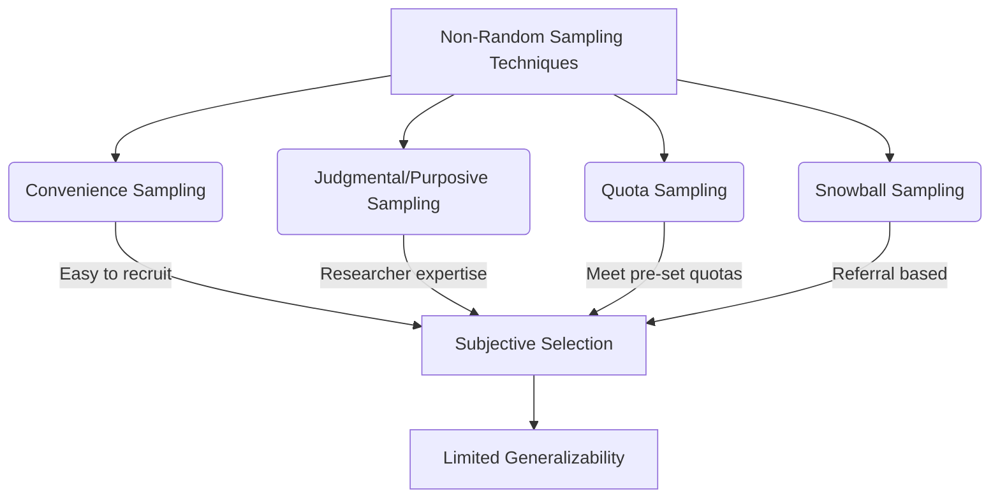

# Definition
Before proceeding, ensure you master [[Sampling_Techniques]] and Statistical_Bias.
**Non-random sampling techniques**, also known as non-probability sampling, are methods where the selection of sample elements is based on the researcher's subjective judgment, convenience, or specific criteria, rather than on random chance. This means that not all members of the population have an equal or known chance of participating in the study. Unlike [[Random_Sampling_Techniques]], non-random sampling methods do not allow for the calculation of Sampling_Error or the reliable generalization of findings to the broader population. These techniques are often employed in qualitative research, exploratory studies, or when access to a full sampling frame is unavailable, including methods like [[Convenience_Sampling]], [[Judgmental_or_Purposive_Sampling]], [[Quota_Sampling]], and [[Snowball_Sampling]].

# The Mental Model
Imagine you need to pick a few people from a crowd for a quick interview. "Non-random sampling techniques" are like just picking the people closest to you, or the ones who look friendly, or the ones who seem to fit a certain profile. You're not trying to be fair or ensure everyone has a chance; you're picking based on your own (or the situation's) convenience or judgment. This is fast, but your picks might not represent the whole crowd.

*Note: This `graph TD` illustrates the four main types of non-random sampling techniques, showing how each relies on subjective selection, which then leads to limited generalizability of findings.*

# Context & Framework
### The Exploratory Tool
Within the overarching framework of [[Sampling_Techniques]], non-random sampling techniques often serve as an "exploratory tool," particularly valuable in the initial stages of research or when quantitative generalization is not the primary objective. These methods are frequently integrated into Qualitative_Research_Methodologies, where the emphasis is on in-depth understanding, theory generation, or identifying specific cases rather than statistical representativeness. For instance, a software company developing a new application might use [[Convenience_Sampling]] to quickly gather initial user feedback from employees, or [[Judgmental_or_Purposive_Sampling]] to select expert users for detailed interviews. While these insights cannot be generalized to the entire user base, they provide crucial preliminary information to guide design iterations and refine subsequent, more rigorous research.

# The Mastery Deep Dive
### The "Duh!" Moment (Intuitive Proof)
If you're not going through the effort of truly random selection (like drawing names from a perfectly mixed hat), then whatever method you *are* using is probably influenced by something specific – like who is easiest to reach, or who you think knows the most. It's intuitively clear that if you're selecting based on convenience or your own ideas, the group you end up with might not fairly represent the larger group you're interested in. You wouldn't trust a lottery that wasn't random, right? The "duh!" moment here is recognizing that non-random selection inherently introduces a risk of bias because it lacks the mathematical safeguards of probability-based methods.

### The Family Tree
**Non-Random Sampling Techniques** are typically employed when random sampling is impractical, too expensive, or when the research objective does not require statistical generalization. This family includes:
*   **Convenience Sampling:** Selecting individuals who are readily available or easiest to reach (e.g., surveying people at a shopping mall).
*   **Judgmental (or Purposive) Sampling:** The researcher deliberately selects individuals whom they believe are most appropriate for the study based on their expertise or specific characteristics (e.g., interviewing industry experts).
*   **Quota Sampling:** Dividing the population into subgroups (like strata) and then non-randomly selecting a predetermined number of individuals from each subgroup to meet specific quotas (e.g., ensuring 50 males and 50 females are interviewed, regardless of selection method).
*   **Snowball Sampling:** Initial participants refer other potential participants who share similar characteristics, creating a "snowball" effect. This is useful for hard-to-reach populations.

The common thread is the absence of probability-based selection, meaning the probability of any given individual being selected is unknown.

# Constraints & Limitations
### The Engineering Trade-off
Non-random sampling techniques, while offering convenience and cost-effectiveness, come with significant engineering trade-offs, primarily revolving around **statistical validity and generalizability**. The most critical limitation is that these methods inherently introduce Sampling_Bias because the selection is not based on chance. This means the sample is unlikely to be representative of the larger population, and therefore, findings cannot be reliably generalized. It's impossible to calculate Sampling_Error or construct confidence intervals. Secondly, the **credibility of the research findings** can be lower compared to studies using [[Random_Sampling_Techniques]], as the lack of objectivity in selection makes results vulnerable to criticism. Thirdly, while often faster, the reliance on subjective judgment or accessibility means there's no systematic way to ensure all relevant perspectives are captured, potentially leading to incomplete or skewed insights. Researchers must accept these limitations and carefully qualify their conclusions, acknowledging that insights are often context-specific and not broadly applicable.

# Significance & Application
Non-random sampling techniques are significant for their practicality and utility in specific research contexts, especially when resource constraints or the nature of the inquiry preclude random methods. Academically, they are crucial for Qualitative_Research, Exploratory_Studies, and Case_Study_Research. In real-world applications, they are used in:
*   **Pilot Testing:** Quickly gathering initial feedback on new products or services.
*   **Hard-to-Reach Populations:** Studying marginalized groups where no comprehensive sampling frame exists.
*   **Deep Dive Interviews:** Selecting specific experts or individuals with unique experiences for in-depth insights.
*   **Market Testing:** Quickly assessing reactions in specific, accessible locations.
While not offering statistical generalizability, they provide valuable preliminary data and rich qualitative understanding.

# The Worked Example
*Test your mastery. Cover the solutions below to test yourself first.*

## The Pilot's Checklist (Do Not Skip)
A small local business wants to quickly gather initial feedback on a new potential logo design for their coffee shop.

1.  **Define the objective:** What kind of feedback is needed?
    *   *Example:* "To get immediate, qualitative reactions and opinions on the aesthetic appeal and brand message conveyed by the new logo design from readily available customers."
2.  **Consider Convenience Sampling:** How could this be applied?
    *   *Example:* "Approach customers who are currently in the coffee shop, show them the logo, and ask for their immediate thoughts."
3.  **Consider Judgmental (Purposive) Sampling:** If specific expertise is desired, how might this be used?
    *   *Example:* "Identify and interview a few local graphic designers or branding experts for their professional critique of the logo."
4.  **Identify a Limitation:** What is a key statistical limitation of using these methods?
    *   *Example:* "The primary limitation is that the feedback received cannot be generalized to all potential customers of the coffee shop, as the sample is not randomly selected and is likely biased towards the opinions of those currently present or those with specific expertise."
5.  **Explain the Trade-off:** Why choose these methods despite limitations?
    *   *Example:* "These methods are chosen for their speed and low cost, allowing for rapid, initial feedback to quickly iterate on the logo design before committing to a more expensive, large-scale study with [[Random_Sampling_Techniques]]."

# The Proving Ground
*Test your mastery. Cover the solutions below to test yourself first.*

### Level 1: The Sanity Check (Verification)
**The Question:** What is the fundamental difference between random sampling techniques and non-random sampling techniques?
> **Solution:** The fundamental difference is that in random sampling techniques, every element in the population has a known, non-zero chance of being selected, allowing for statistical generalization. In contrast, non-random sampling techniques rely on subjective judgment or convenience for selection, meaning not all elements have a known chance of selection, thereby limiting the generalizability of findings.

### Level 2: The Crucible (Mastery & Edge Cases)
**The Scenario:** A university researcher wants to conduct an exploratory study on the impact of a rare neurological condition on daily life. Due to the rarity of the condition and the absence of a comprehensive patient registry, they begin by interviewing a few patients they know and then ask these patients to refer other individuals with the same condition to participate in the study.
**The Challenge:**
(a) Identify the specific non-random sampling technique being used in this scenario.
(b) Explain why this chosen technique is practically advantageous for studying a "rare neurological condition" despite its statistical limitations.
(c) Predict a potential Selection_Bias that could arise from this method if the initial few patients referred individuals who are all part of the same support group, which might have a shared perspective or experience that differs from other patients.
> **Solution:**
(a) The specific non-random sampling technique being used is [[Snowball_Sampling]].
(b) This technique is practically advantageous because the "rare neurological condition" makes the target population hard to find. [[Snowball_Sampling]] leverages existing social networks or contacts to identify and recruit participants who would otherwise be inaccessible through conventional random sampling methods, making the study feasible.
(c) A potential Selection_Bias could arise if the initial patients refer individuals who are all part of the same support group. This could lead to an overrepresentation of perspectives and experiences common within that specific group, potentially missing the diversity of experiences of other patients with the same rare condition who are not part of that support group. The sample would then be biased towards the views and experiences of that particular network, limiting the breadth of insights gathered.

# Key Takeaways
*   Non-random sampling relies on subjective judgment or convenience, not random chance.
*   It does not allow for calculation of sampling error or reliable generalization to the population.
*   Common types include convenience, judgmental, quota, and snowball sampling.

# Knowledge Graph Connections
| Concept                            | Connection / Relationship                                                                 |
| :
---------------------------------- | :
---------------------------------------------------------------------------------------- |
| [[Sampling_Techniques]]             | This is a major category of sampling techniques, contrasting with random sampling.       |
| Statistical_Bias                | Non-random selection inherently introduces a higher risk of various forms of bias.        |
| [[Random_Sampling_Techniques]]      | The advantages and disadvantages are often compared to highlight the strengths of random methods. |
| Qualitative_Research_Methods    | Frequently employed in qualitative studies for in-depth understanding rather than generalization. |
| Accessibility_Of_Population     | Often chosen when accessing the target population through random means is difficult or impossible. |
---