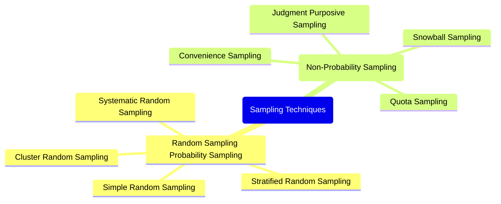

# Definition
Before proceeding, ensure you master [[Sample_and_Sampling_Error]] and Statistical_Bias.
**Sampling techniques** are the specific methods used to select a subset (a [[Sample_and_Sampling_Error]]) from a larger population. The goal of these techniques is to ensure that the chosen sample is as representative as possible of the original population, thereby minimizing Sampling_Error and allowing for valid inferences about the population. These techniques are broadly categorized into [[Random_Sampling_Techniques]] (or probability sampling), where every element has a known, non-zero chance of being selected, and [[Non_Random_Sampling_Techniques]] (non-probability sampling), where selection is based on the researcher's judgment or convenience. The choice of technique is critical, as it directly impacts the generalizability and reliability of the research findings.

# The Mental Model
Imagine you need to select a few representatives from a large school assembly.
*   **Sampling Techniques:** This is the "how-to" manual for picking those representatives.
*   **Goal:** You want the chosen few to accurately speak for everyone in the assembly.
*   **Poor Technique:** Picking only your friends (biased).
*   **Good Technique:** Drawing names randomly from a hat (unbiased, but still a "sample" so not perfect).
The "technique" is the systematic process you follow to ensure your selected group is a fair reflection of the whole.

*Note: This `mindmap` illustrates the two main categories of sampling techniques and their respective sub-methods, providing a hierarchical overview of the different approaches to selecting a sample.*

# Context & Framework
### The Bridge Between Sample and Population
Sampling techniques serve as the crucial bridge between the observed data from a sample and the inferences made about a larger population. They provide the systematic procedures necessary to draw a [[Sample_and_Sampling_Error]] that is statistically sound and representative. For example, a medical researcher studying the effects of a new drug needs to select a sample of patients from the entire patient population with the condition. The choice of a specific sampling technique (e.g., [[Stratified_Random_Sampling]] to ensure age and gender representation) within the broader framework of Experimental_Design will directly determine the validity and ethical implications of the study's conclusions. Without robust sampling techniques, the leap from sample findings to population-wide generalizations would be unfounded.

# The Mastery Deep Dive
### Opening the Hood: What's Inside?
Sampling techniques are essentially the blueprints for how to select a [[Sample_and_Sampling_Error]] from a larger [[Population_and_Census]]. They are broadly divided into two main categories:
1.  **Random Sampling (Probability Sampling)**: Here, every element in the population has a known, non-zero chance of being selected. This is the cornerstone of statistical inference because it allows for the calculation of Sampling_Error and the generalization of results to the population. Types include [[Simple_Random_Sampling]], [[Systematic_Random_Sampling]], [[Stratified_Random_Sampling]], and [[Cluster_Random_Sampling]].
2.  **Non-Random Sampling (Non-Probability Sampling)**: In this approach, elements are selected based on the researcher's subjective judgment, convenience, or other non-random criteria. While often easier and cheaper, these methods do not allow for the calculation of sampling error and typically limit the generalizability of findings. Types include [[Convenience_Sampling]], [[Judgmental_or_Purposive_Sampling]], [[Quota_Sampling]], and [[Snowball_Sampling]].

The core distinction lies in the ability to apply probability theory to random samples, which is not possible with non-random samples.

### Who are the Neighbors?
Sampling techniques are closely related to several other key statistical concepts. They are the practical application of how to draw a [[Sample_and_Sampling_Error]] from a [[Population_and_Census]]. The choice of a particular technique directly impacts the likelihood and types of [[Categories_of_Sampling_Errors]] that might occur. Furthermore, the effectiveness of a sampling technique determines the extent to which Inferential_Statistics can be reliably used to make statements about the population. Without appropriate sampling, the data collected through [[Collection_of_Data]] may be biased, rendering subsequent analysis unreliable. Thus, sampling techniques act as the methodological link between defining a study's scope and drawing credible conclusions.

# Constraints & Limitations
### The Engineering Trade-off
Choosing a sampling technique involves a crucial engineering trade-off between **statistical rigor** (generalizability, control over sampling error) and **practical feasibility** (cost, time, accessibility). [[Random_Sampling_Techniques]] offer higher statistical rigor, allowing for unbiased estimates and quantifiable error. However, they can be more complex and expensive to implement, requiring a complete list of the population (sampling frame) which may not always exist. [[Non_Random_Sampling_Techniques]], on the other hand, are often cheaper, faster, and more convenient, especially when a complete sampling frame is unavailable or when exploratory research is needed. The trade-off is that they introduce the risk of significant bias, and their results cannot be reliably generalized to the larger population. Researchers must carefully weigh the scientific demands of their study against the real-world constraints to select the most appropriate and defensible technique.

# Significance & Application
Sampling techniques are indispensable in virtually all fields that rely on data for decision-making. Academically, they are central to Survey_Methodology, Experimental_Design, and Quantitative_Research. In the real world, these techniques are applied in:
*   **Market Research:** To gauge consumer preferences for new products without surveying every potential customer.
*   **Public Opinion Polling:** To predict election outcomes or measure public sentiment on policy issues.
*   **Quality Control:** To inspect a subset of products from a large production run to ensure quality standards.
*   **Medical Research:** To select patient groups for clinical trials to test the efficacy of new treatments.
*   **Environmental Studies:** To assess pollution levels by sampling water or air at various locations.
Effective application of sampling techniques ensures that resources are used efficiently while yielding representative data.

# The Worked Example
*Test your mastery. Cover the solutions below to test yourself first.*

## The Pilot's Checklist (Do Not Skip)
Imagine a company wants to survey its 5,000 employees to understand job satisfaction levels.

1.  **Define the Population:** Clearly identify the entire group of interest.
    *   *Example:* "All 5,000 employees currently working for the company."
2.  **Identify if a Census is Feasible:** Can data be collected from all 5,000 employees?
    *   *Example:* "While technically feasible, a full census might lead to lower response rates and take longer, making a sample survey more practical for quick insights."
3.  **Consider Random Sampling Techniques:** If a sample is desired, name two suitable random sampling techniques.
    *   *Example:* "[[Simple_Random_Sampling]] (randomly pick names from the employee list) or [[Stratified_Random_Sampling]] (divide by department and pick randomly from each) would be suitable."
4.  **Consider Non-Random Sampling Techniques:** If resources are extremely limited or exploratory insights are needed, name one non-random technique.
    *   *Example:* "[[Convenience_Sampling]] (surveying employees in the cafeteria) or [[Judgmental_or_Purposive_Sampling]] (selecting key department heads for interviews) could be used for initial insights, but with acknowledged limitations."
5.  **Identify the Goal of the Chosen Technique:** What is the primary objective of using a specific technique?
    *   *Example:* "The primary objective is to select a representative sample of employees so that the findings on job satisfaction can be generalized to the entire 5,000-employee population with a measurable level of confidence."

# The Proving Ground
*Test your mastery. Cover the solutions below to test yourself first.*

### Level 1: The Sanity Check (Verification)
**The Question:** What is the main purpose of using sampling techniques in a research study?
> **Solution:** The main purpose of using sampling techniques is to select a subset (sample) from a larger population that is as representative as possible of the original population, thereby minimizing sampling error and allowing for valid inferences about the population.

### Level 2: The Crucible (Mastery & Edge Cases)
**The Scenario:** A research team wants to study the impact of social media usage on academic performance among high school students in a large school district. They have access to a list of all 10,000 students in the district. They are debating between using a technique that ensures every student has an equal chance of being selected versus one where they simply survey students in common areas during lunch breaks.
**The Challenge:**
(a) Identify the two broad categories of sampling techniques being debated.
(b) Explain why using the technique where "every student has an equal chance of being selected" is generally preferred for this study if the goal is to make generalizable statements about the entire district.
(c) What specific type of "error" is more likely to be introduced by surveying students in common areas during lunch breaks, and why?
> **Solution:**
(a) The two broad categories of sampling techniques being debated are **Random Sampling (Probability Sampling)** (where every student has an equal chance) and **Non-Random Sampling (Non-Probability Sampling)** (surveying students in common areas).
(b) The technique where "every student has an equal chance of being selected" (Random Sampling) is generally preferred because it introduces less **bias** and allows for the calculation of Sampling_Error. This means the results from the sample can be more reliably generalized to the entire district, and the level of uncertainty in those generalizations can be statistically quantified. This is crucial for making valid inferences about the impact of social media on *all* high school students in the district.
(c) Surveying students in common areas during lunch breaks is likely to introduce **Selection Error**, a category of sampling error. This occurs because students present in common areas during lunch might not be representative of the entire student body (e.g., students who bring lunch, students with specific friend groups, or those with certain class schedules). They are essentially "self-selecting" their participation by their presence, leading to a biased sample that does not accurately reflect the diversity of the student population or their social media usage habits.

# Key Takeaways
*   Sampling techniques are methods for selecting a representative subset from a population.
*   They are categorized into random (probability) and non-random (non-probability) sampling.
*   Random sampling allows for generalizable conclusions and measurable sampling error, while non-random sampling is often more practical but prone to bias.

# Knowledge Graph Connections
| Concept                            | Connection / Relationship                                                                 |
| :
---------------------------------- | :
---------------------------------------------------------------------------------------- |
| [[Sample_and_Sampling_Error]]       | These techniques are used to obtain a sample and manage its associated error.             |
| Statistical_Bias                | Proper sampling techniques are crucial for minimizing statistical bias in research.       |
| [[Random_Sampling_Techniques]]      | This is one of the two main categories of sampling techniques.                            |
| [[Non_Random_Sampling_Techniques]]  | This is the other main category, contrasting with random sampling.                       |
| Research_Methodology_Design     | The choice of sampling technique is a fundamental component of research methodology design. |
---