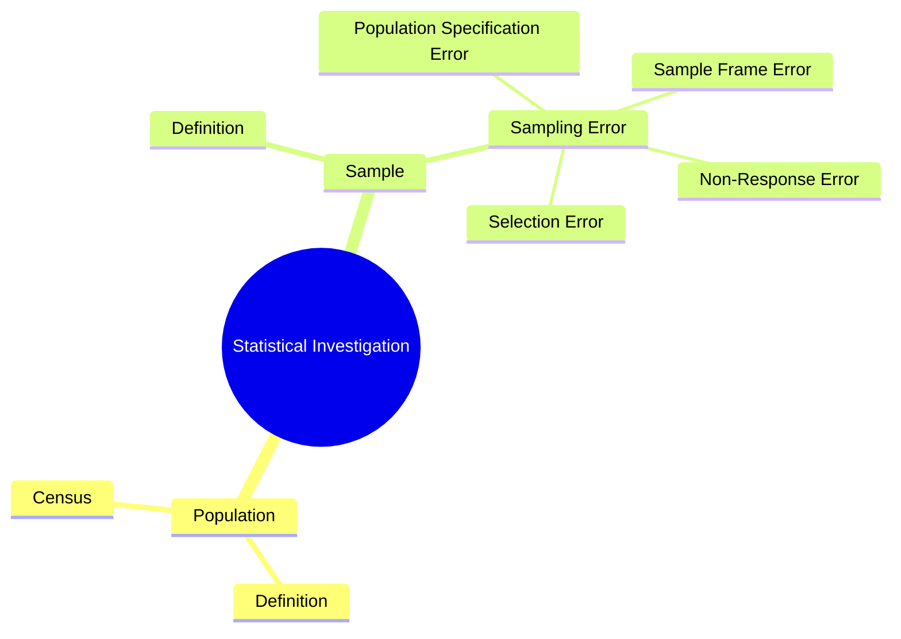

# Definition
Before proceeding, ensure you master [[Collection_of_Data]] and Fundamental_Concepts_Of_Measurement.
The scopes of statistical investigations define the boundaries and subjects of a study, determining who or what will be observed. This involves clearly delineating the entire group of interest (the [[Population_and_Census]]) and the smaller, representative subset that will actually be studied (the [[Sample_and_Sampling_Error]]). Understanding these scopes is fundamental because it dictates the generalizability of findings and the methodologies employed. Essentially, it's about deciding who you're talking about (population) and who you're actually talking to (sample).

# The Mental Model
Imagine you are an explorer mapping a new continent. The "scope" of your investigation is whether you are mapping the entire continent (the population) or just a smaller, representative region of it (the sample). If you map the whole continent, you have complete knowledge. If you map a region, you assume that region gives you enough information to understand the whole. But, if you pick the wrong region, your map of the continent will be inaccurate.

*Note: This `mindmap` visually categorizes the key elements defining the scope of a statistical investigation, showing the relationship between population, census, sample, and various types of sampling errors.*

# Context & Framework
### Defining the Universe of Inquiry
The scope of a statistical investigation is established by defining the "universe of inquiry," which is the total set of elements relevant to the research question. This involves a crucial initial decision: whether to examine every single individual or entity within that universe (a census) or to focus on a manageable subset (a sample). This decision has profound implications for resources, accuracy, and the ability to generalize results. For instance, a pharmaceutical company testing a new drug must define its population (e.g., all adults with a specific condition) before deciding if it will conduct a full-scale trial (census-like for approval) or a pilot study on a smaller group (sample). The chosen scope guides all subsequent methodological choices.

# The Mastery Deep Dive
### Opening the Hood: What's Inside?
At the heart of statistical investigations are two core components: the **population** and the **sample**. The population is the *entire group* that a researcher is interested in studying. For example, if you want to know about all students at a university, then "all students" is your population. A **census** is an attempt to collect data from *every single individual* in that population. In contrast, a **sample** is a *smaller, selected subset* of that population. So, instead of surveying all students, you might survey 200 students. The aim of the sample is to accurately *represent* the larger population, allowing you to draw conclusions about the whole group without having to collect data from everyone. The process also includes understanding Sampling_Error, which is the natural difference that exists between what you find in your sample and the true value in the population.

### The Translator: From "Lego" to "Jargon"
When we talk about the "set of all individuals of interest in a particular study," we're not just saying "everyone we care about"; the formal term for this is **population**. When we aim to "observe every single element" in that population, we're performing a **census**, not just a "100% survey." Similarly, a "smaller group chosen from the big group to represent it" is formally called a **sample**. The "difference or error between what we find in the small group and what's true for the big group" is precisely defined as **sampling error**. Using these precise terms is crucial for clear and unambiguous communication in statistics, especially in academic and professional contexts where accuracy is paramount.

# Constraints & Limitations
### The Engineering Trade-off
Choosing between a census and a sample involves a significant engineering trade-off. A census offers unparalleled accuracy, eliminating Sampling_Error entirely because it observes the entire population. However, this comes at a very high cost in terms of **time, resources, and logistical complexity**, often making it impractical or impossible for large populations. Conversely, a sample survey is far more **economical and time-efficient**, allowing for quicker insights. The trade-off is that samples introduce Sampling_Error, meaning there will always be some discrepancy between the sample results and the true population parameters. Researchers must weigh the need for absolute precision against practical constraints, deciding whether the benefits of a census outweigh its substantial disadvantages, or if a well-designed sample can provide sufficient accuracy within acceptable limits.

# Significance & Application
Understanding the scopes of statistical investigations is foundational for designing valid research and interpreting results correctly. Academically, it underpins concepts like Inferential_Statistics and Sampling_Theory. In practical applications, these scopes guide everything from national census undertakings to market research and scientific experiments, defining who or what data will be collected from. Without this clear understanding, studies risk flawed design, invalid conclusions, and misallocation of resources.

# The Worked Example
*Test your mastery. Cover the solutions below to test yourself first.*

## The Pilot's Checklist (Do Not Skip)
Consider a scenario where a local government wants to determine the average income of households in a city to assess the need for social support programs.

1.  **Define the Population:** Clearly state the entire group of interest.
    *   *Example:* "All households residing within the city limits."
2.  **Consider a Census:** How would a census be conducted for this population?
    *   *Example:* "Government agents would attempt to visit every single household in the city, or send questionnaires to every household, to collect income data."
3.  **Consider a Sample:** How would a sample be drawn for this population?
    *   *Example:* "A random selection of 500 households from the city's property tax records would be chosen for a survey."
4.  **Identify Potential Sampling Error (for a sample):** What kind of discrepancy might exist if a sample is used?
    *   *Example:* "The average income reported by the 500 sampled households might be slightly higher or lower than the true average income of all households in the city."
5.  **Evaluate Practicality:** Which method is more practical for this scenario, and why?
    *   *Example:* "A sample is likely more practical due to the high cost and time involved in surveying every single household in a city for a census, especially if the city is large."

# The Proving Ground
*Test your mastery. Cover the solutions below to test yourself first.*

### Level 1: The Sanity Check (Verification)
**The Question:** Define a statistical population and provide a simple example.
> **Solution:** A statistical population is the set of all individuals or items of interest in a particular study. A simple example is "all registered voters in a country" if a study aims to understand voter behavior.

### Level 2: The Crucible (Mastery & Edge Cases)
**The Scenario:** A manufacturing company produces millions of small electronic components daily. They need to assess the defect rate of these components to maintain quality standards.
**The Challenge:**
(a) Why would conducting a full "census" of every single component produced be an impossible or highly impractical task in this scenario?
(b) How would the company define a "sample" in this context?
(c) What ethical or safety implications might arise if the company *failed* to define a proper scope and relied on inaccurate data?
> **Solution:**
(a) Conducting a full census would be impossible or highly impractical because of the sheer volume of components produced daily (millions). It would be prohibitively expensive, time-consuming, and potentially destructive (if testing is destructive), halting production.
(b) The company would define a "sample" as a randomly selected subset of components from the daily production, perhaps every 1000th component, or a batch of 500 components chosen at regular intervals throughout the day.
(c) If the company failed to define a proper scope and relied on inaccurate data (e.g., from a biased sample or no sample at all), they might release a high number of defective products. This could lead to customer safety issues (if the components are critical, like in medical devices), product recalls, significant financial losses, damage to their brand reputation, and potential legal liabilities.

# Key Takeaways
*   The scope of a statistical investigation is defined by the population (the entire group of interest) and the sample (a subset of the population).
*   A census involves observing the entire population, providing complete accuracy but at high cost and time.
*   A sample involves observing a subset, offering efficiency but introducing sampling error, which is the natural discrepancy from the population.

# Knowledge Graph Connections
| Concept                            | Connection / Relationship                                                              |
| :
---------------------------------- | :
------------------------------------------------------------------------------------- |
| [[Collection_of_Data]]              | Scopes define *who* or *what* the data will be collected from.                       |
| [[Population_and_Census]]           | These are core components of statistical investigation scopes.                         |
| [[Sample_and_Sampling_Error]]       | These are core components of statistical investigation scopes, alongside population.   |
| [[Sampling_Techniques]]             | The choice of technique is determined by the defined scope and desired sample.         |
| Inferential_Statistics          | Understanding scopes is crucial for drawing valid inferences about populations from samples. |
---