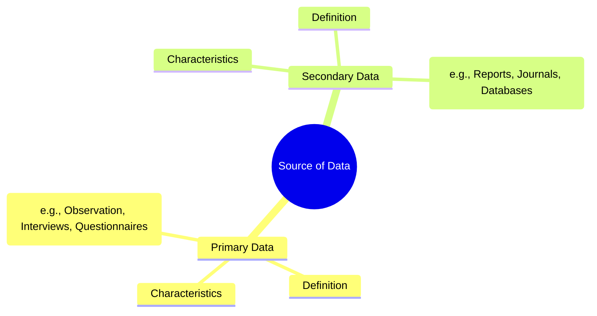

# Definition
Before proceeding, ensure you master [[Collection_of_Data]] and Data_Validity_And_Reliability.
The **source of data** refers to the origin from which information is obtained for a statistical investigation or research study. It fundamentally distinguishes between [[Primary_Data]] (information collected directly from a first-hand source for the specific purpose of the current inquiry) and [[Secondary_Data]] (information that has already been collected and compiled by someone else for a different purpose, then re-used). Understanding the source of data is paramount because it directly impacts the data's relevance, reliability, and the level of control the researcher has over its quality. It's about knowing where your information comes from and what journey it has taken before it reaches your analysis.

# The Mental Model
Imagine you're baking a cake.
*   **Primary Data:** You go to the farm, gather fresh eggs, milk the cow, and grind your own flour. You know exactly where everything came from and how fresh it is.
*   **Secondary Data:** You go to the supermarket and buy pre-packaged eggs, milk, and flour. You're using ingredients that someone else already processed and packaged. It's convenient, but you don't know the exact farm or the specific cow.
The "source of data" is essentially whether you're collecting "farm-fresh" (primary) or "store-bought" (secondary) ingredients for your research "cake."

*Note: This `mindmap` visually categorizes the two main sources of data, detailing their definitions, characteristics, and common collection/origin methods.*

# Context & Framework
### The Informational Lineage
Within the overall framework of [[Collection_of_Data]], identifying the source of data establishes its "informational lineage," directly influencing its suitability and credibility for a given research question. This foundational distinction impacts subsequent decisions regarding data processing, analysis, and the confidence placed in findings. For example, a historian researching a specific battle might prioritize [[Primary_Data]] by examining original letters and military dispatches from the period, as these offer direct, unfiltered accounts. However, they might also leverage [[Secondary_Data]] by consulting published academic analyses of the battle to gain broader context or identify existing interpretations. The choice and judicious integration of these data sources are critical for building a comprehensive and well-substantiated historical narrative, highlighting how the source directly informs the depth and authenticity of research insights.

# The Mastery Deep Dive
### The "Duh!" Moment (Intuitive Proof)
If you're making a big decision, like buying a house, you wouldn't rely on secondhand rumors from someone who heard it from someone else. You'd want to go directly to the source: the seller, the official property records, the inspector. This "duh!" moment highlights why distinguishing the source of data is so important. Data from the original source (primary) tends to feel more trustworthy and relevant because it hasn't been filtered or reinterpreted. Data from a secondhand source (secondary) is convenient, but you instinctively question its accuracy and how well it truly fits *your* needs. Knowing the origin helps you decide how much to trust and how to use the information.

### The Kill Sheet (Comparison Table)
| Feature                   | [[Primary_Data]]                                           | [[Secondary_Data]]                                       | **The "Gotcha" Difference**                                                 |
| :
------------------------ | :
--------------------------------------------------------- | :
------------------------------------------------------- | :
-------------------------------------------------------------------------- |
| **Origin**                | Original and new; collected specifically for current research. | Re-used and old; collected by others for different purpose. | **Novelty:** Fresh, purpose-built vs. Pre-existing.                     |
| **Purpose Match**         | Customized as per the need of the research; directly linked. | May not directly link with current research needs.       | **Relevance:** Tailored vs. Potentially Mismatched.                     |
| **Cost & Time**           | Less economical (more expensive); more time-consuming.     | More economical (cheaper); less time-consuming.          | **Efficiency:** Resource-intensive vs. Resource-saving.                 |
| **Reliability & Control** | High on reliability; full control over methodology.        | Lower on reliability; no control over original methods.  | **Trustworthiness:** Direct oversight vs. Inherited quality.             |
| **Examples of Methods**   | [[Direct_Observation]], [[Personal_Interview]], [[Written_Questionnaires]] | Government reports, academic journals, company records.  | **Collection Mechanism:** Direct engagement vs. Retrieval from archives. |

# Constraints & Limitations
### The Engineering Trade-off
The choice between [[Primary_Data]] and [[Secondary_Data]] involves a fundamental engineering trade-off between **control, relevance, and accuracy** versus **cost, time, and accessibility**. Primary data offers complete control over the collection methodology, ensuring the data is perfectly tailored to the research question and maximizing its relevance and reliability. However, this comes at a significant cost in terms of time and financial resources, as it involves generating entirely new information. Secondary data, conversely, is highly economical and time-efficient, as it leverages existing information that is readily available. The trade-off is a potential **mismatch in relevance** (data collected for a different purpose) and **reduced control over data quality and biases** from the original collection. Furthermore, secondary data can be **outdated**, especially in dynamic fields. Researchers must carefully assess whether the unique benefits of primary data outweigh its substantial investment, or if the efficiencies of secondary data are acceptable given its inherent limitations and potential for compromise in relevance and quality.

# Significance & Application
Understanding the source of data is paramount for assessing its credibility and making informed research design choices. Academically, this distinction is fundamental to all Research_Methodology courses and Data_Analysis. In real-world applications, it guides decisions in:
*   **Business Strategy:** Deciding whether to conduct new market research (primary) or analyze existing industry reports (secondary).
*   **Academic Research:** Determining if new experiments or surveys are needed, or if existing datasets are sufficient.
*   **Government Planning:** Using census data (secondary for many researchers) versus conducting targeted surveys (primary).
*   **Journalism:** Differentiating between original investigative reporting (primary) and reporting on existing studies (secondary).
The ability to critically evaluate data sources is a core skill for any data-driven professional.

# The Worked Example
*Test your mastery. Cover the solutions below to test yourself first.*

## The Pilot's Checklist (Do Not Skip)
A startup company is developing a new fitness app and needs to understand both broad market trends in health and fitness *and* specific user preferences for app features.

1.  **Identify the need for Secondary Data:** What broad information is available?
    *   *Example:* "To understand broad market size, growth trends in the fitness industry, and competitor offerings, the startup should first consult [[Secondary_Data]] sources like market research reports, industry analyses, and published user statistics from existing apps."
2.  **Identify the need for Primary Data:** What specific information is missing?
    *   *Example:* "To understand specific user preferences for *their unique app features*, pain points with existing apps, and willingness to pay, the startup will need to collect [[Primary_Data]] directly from potential users."
3.  **Propose a Primary Data collection method:** How would they get specific user preferences?
    *   *Example:* "Conduct focus groups or [[Personal_Interview]]s with target users to gather qualitative insights, and distribute online [[Written_Questionnaires]] to a larger sample for quantitative feature prioritization."
4.  **Explain the cost/time trade-off:** Which is faster/cheaper?
    *   *Example:* "Collecting secondary data will be faster and more economical, allowing for a quick market overview. Collecting primary data will be more time-consuming and expensive but will yield highly relevant, tailored insights directly applicable to their app design."
5.  **Describe the logical flow:** How do these sources complement each other?
    *   *Example:* "Start with secondary data to frame the problem and understand the landscape. Then, use primary data to fill specific knowledge gaps and validate assumptions generated from the secondary analysis, leading to informed product development decisions."

# The Proving Ground
*Test your mastery. Cover the solutions below to test yourself first.*

### Level 1: The Sanity Check (Verification)
**The Question:** Define "primary data" and "secondary data."
> **Solution:** **Primary data** is information collected directly from a first-hand source specifically for the purpose of the current research. **Secondary data** is information that has already been collected, compiled, and often published by someone else for a different purpose, and is then re-used by the current researcher.

### Level 2: The Crucible (Mastery & Edge Cases)
**The Scenario:** A university student is writing a research paper on the socio-economic impact of a recent natural disaster on a specific coastal community. They have access to:
(a) Official government disaster relief reports and economic statistics for the affected region (published online).
(b) The opportunity to conduct new interviews with disaster victims and local community leaders.
**The Challenge:**
(a) Categorize sources (a) and (b) as either primary or secondary data.
(b) The student has a very tight deadline (2 weeks). Justify why relying *primarily* on one of these data sources would be more practical for meeting the deadline, and what would be the main trade-off.
(c) The "Impostor" scenario: The student, having read some online news articles about the disaster, claims these articles count as "primary data" because they describe eyewitness accounts. Explain why this claim is incorrect based on the definition of primary data.
> **Solution:**
(a) Sources:
    *   (a) Official government disaster relief reports and economic statistics: **Secondary Data** (already collected and published by others).
    *   (b) New interviews with disaster victims and local community leaders: **Primary Data** (collected directly by the student for this specific research).
(b) Relying *primarily* on **secondary data** (a) would be more practical for meeting the tight 2-week deadline. These reports and statistics are readily available online, allowing for quick access and analysis, thus saving the significant time and logistical effort required to plan, conduct, transcribe, and analyze new interviews. The main trade-off would be that this data might **not directly link** with the student's *specific research questions* about the socio-economic impact, potentially lacking the nuanced, first-hand perspectives and emotional context that only primary interviews could provide.
(c) The claim that online news articles about the disaster, even those describing eyewitness accounts, count as "primary data" is incorrect. While the *eyewitness accounts themselves* are primary data, the **news articles are secondary data**. The journalist collected, interpreted, and reported those accounts. The student is reading a published report *about* the primary data, not accessing the primary data directly from the original source. The articles are a secondhand account of primary information.

# Key Takeaways
*   Source of data classifies information as primary (first-hand, new) or secondary (re-used, collected by others).
*   Primary data offers high relevance and control but is costly and time-consuming.
*   Secondary data is economical and fast but may lack direct relevance or control over quality.

# Knowledge Graph Connections
| Concept                            | Connection / Relationship                                                                 |
| :
---------------------------------- | :
---------------------------------------------------------------------------------------- |
| [[Collection_of_Data]]              | This is a fundamental categorization within the broader process of data collection.       |
| [[Primary_Data]]                    | One of the two primary types of data sources, characterized by its original nature.       |
| [[Secondary_Data]]                  | The other primary type of data source, characterized by its re-used nature.               |
| Research_Methodology_Design     | The choice of data source is a critical decision in designing a research study.           |
| Data_Quality_Assessment         | Critically evaluating the source is essential for assessing the quality and suitability of data. |
---