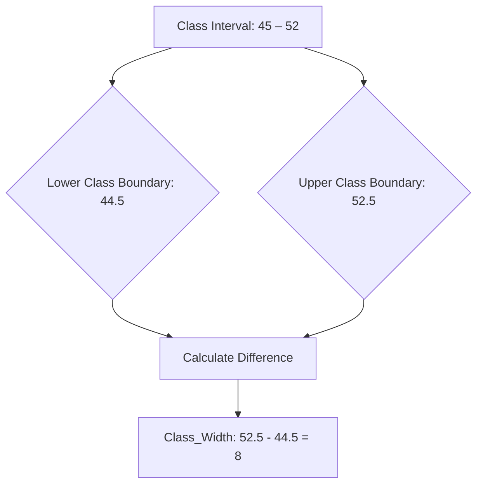

# Definition
Before proceeding, ensure you master [[Grouped_Frequency_Distributions_GFD]] and [[Class_Limits]].
The Class Width is the range of values encompassed by a class interval in a [[Grouped_Frequency_Distributions_GFD]]. It represents the difference between the upper [[Class_Boundaries]] and the lower [[Class_Boundaries]] of a class. Alternatively, it can be calculated as the difference between two consecutive lower class limits (or two consecutive upper class limits). Think of it as the 'size' or 'span' of each data bucket; if a class covers weights from 45 kg to 52 kg, its width defines how many kilograms are included in that particular group.

# The Mental Model
Imagine organizing books on a shelf by their spine height. You decide each shelf "class" should hold books within a certain height range, say 5 inches. So, books from 0-5 inches go on one shelf, 5.1-10 inches on another. The "5 inches" represents the class width – the consistent size of each grouping. This consistent width makes comparisons fair and ensures the visual representation of data (like a histogram) is not distorted.

*Note: This `graph TD` illustrates the calculation of class width as the difference between the upper (52.5) and lower (44.5) class boundaries of a class interval, yielding a width of 8.*

# Context & Framework
### The Variable Dictionary
The [[Class_Width]] is a critical parameter in the "variable dictionary" of a [[Grouped_Frequency_Distributions_GFD]]. It directly influences the number of classes and the level of detail presented in the distribution. A larger class width results in fewer classes, providing a more summarized, generalized view of the data. A smaller class width yields more classes, offering a more detailed, granular view. This parameter must be carefully chosen, often using the overall data range and desired number of classes as guides, to ensure the GFD effectively communicates the data's underlying patterns without being either too broad or too fragmented.

# The Mastery Deep Dive
### Anatomy of the Formula (Who is Who?)
The primary formula for determining [[Class_Width]] is:
$$ \boxed{\displaystyle \text{Class Width} = \frac{\text{Largest Data Value} - \text{Smallest Data Value}}{\text{Number of Classes}}} $$
*   **Largest Data Value:** The maximum observed value in the raw dataset.
*   **Smallest Data Value:** The minimum observed value in the raw dataset.
*   **Number of Classes:** The desired number of intervals for the GFD (typically 5-15).
It is crucial to **round this calculated width *up*** to the nearest unit of data precision to ensure that all data values are accommodated within the chosen number of classes. For example, if data is whole numbers and the calculation yields 7.3, the class width must be rounded up to 8. This "who is who" clarifies that the formula provides a *minimum* width; rounding up guarantees exhaustive coverage.

### Let's Plug in Numbers (Watch it Work)
Let's apply the formula with numbers. Suppose the largest data value is 90, the smallest is 26, and we want 6 classes.
$$ \boxed{\displaystyle \text{Class Width} = \frac{90 - 26}{6}} $$
$$ \boxed{\displaystyle = \frac{64}{6}} $$
$$ \boxed{\displaystyle \approx 10.67} $$
Since data is typically reported to a certain precision (e.g., whole numbers), the calculated width (10.67) must be rounded *up* to the nearest appropriate unit. If the original data are whole numbers, we round up to 11. Thus, a [[Class_Width]] of 11 would be used. This ensures all data points, from 26 to 90, are accommodated across 6 classes without truncation or exclusion.

# Constraints & Limitations
### The Engineering Trade-off: Impact on Interpretation
The choice of [[Class_Width]] involves a critical "engineering trade-off" that directly impacts the interpretation of the [[Grouped_Frequency_Distributions_GFD]]. If the width is too small, there will be many classes, and the distribution might appear "jagged" or sparse, obscuring underlying patterns. If the width is too large, there will be few classes, and the distribution might be overly smoothed, hiding important details or variations. This trade-off requires careful judgment to select a width that provides a balance between detail and summarization, ensuring the GFD accurately and meaningfully represents the data's characteristics.

# Significance & Application
[[Class_Width]] is a foundational parameter in constructing any [[Grouped_Frequency_Distributions_GFD]]. It determines the size of each class interval, directly influencing the number of classes and, consequently, the level of detail in the summarized data. A consistently applied class width ensures that the distribution is not distorted, making visual representations like [[Histogram]] and [[Frequency_Polygon]] accurate. Proper calculation and rounding of class width, as per specific [[Rules_for_Forming_a_GFD]], are essential for creating meaningful and interpretable grouped frequency distributions, facilitating effective data analysis.

# The Worked Example
*Test your mastery. Cover the solutions below to test yourself first.*

A dataset of student marks ranges from a minimum of 29 to a maximum of 91. The goal is to construct a [[Grouped_Frequency_Distributions_GFD]] with 6 classes.

**Goal:** Calculate the appropriate class width for this GFD.

**Step 1: Identify Largest and Smallest Data Values**
*   Largest Data Value = 91
*   Smallest Data Value = 29

**Step 2: Identify the Number of Classes Desired**
*   Number of Classes = 6

**Step 3: Apply the Class Width Formula**
$$ \displaystyle \text{Class Width} = \frac{\text{Largest Data Value} - \text{Smallest Data Value}}{\text{Number of Classes}} $$
$$ \displaystyle \text{Class Width} = \frac{91 - 29}{6} $$
$$ \displaystyle \text{Class Width} = \frac{62}{6} $$
$$ \displaystyle \text{Class Width} \approx 10.33 $$

**Step 4: Round Up to the Nearest Unit of Data Precision**
Assuming marks are whole numbers, we round 10.33 up to 11.

**Conclusion:**
The appropriate [[Class_Width]] is 11.

**Why this works:**
*   **Coverage:** A class width of 11 ensures that all data points from 29 to 91 can be accommodated within 6 classes without any values being left out.
*   **Consistency:** This calculated width provides a uniform interval size for each class, critical for an unbiased representation of the data distribution.

# The Proving Ground
*Test your mastery. Cover the solutions below to test yourself first.*

### Level 1: The Sanity Check (Verification)
**The Variable ID:** Define class width in the context of a Grouped Frequency Distribution.
> **Solution:** Class width is the range of values encompassed by a class interval, representing the difference between its upper and lower class boundaries or between two consecutive lower (or upper) class limits.

### Level 2: The Crucible (Mastery & Edge Cases)
**The Impossible Case:** A data analyst has a dataset of exam scores ranging from 0 to 100, recorded as whole numbers. They calculate an ideal class width of 9.7 and decide to use exactly 9.7 as the width for their [[Grouped_Frequency_Distributions_GFD]]. Explain why this leads to an "impossible case" for creating clear and mutually exclusive [[Class_Limits]] and how the [[Rules_for_Forming_a_GFD]] would specifically address this.
> **Solution:** Using a class width of 9.7 for whole number data leads to an "impossible case" for creating clear and mutually exclusive [[Class_Limits]]. If you start the first class at 0 with a width of 9.7, the next would start at 9.7, then 19.4, etc. This creates fractional [[Class_Limits]] that do not align with the whole-number nature of the raw data, making it impossible to unambiguously assign whole-number scores to classes without overlap or gaps. The [[Rules_for_Forming_a_GFD]] specifically address this by mandating that the calculated class width *always be rounded up to the nearest unit of the data's precision*. In this case, 9.7 should be rounded up to 10, ensuring whole-number class limits (e.g., 0-9, 10-19) that match the raw data's format.

# Key Takeaways
*   Class width is the range of values within each class interval, calculated using the data range and desired number of classes.
*   It must be rounded up to the nearest unit of data precision to ensure all data is covered.
*   Consistent class width is crucial for an accurate and unbiased representation of data in a GFD.

# Knowledge Graph Connections
| Concept                                 | Connection / Relationship                                                          |
| :
-------------------------------------- | :
--------------------------------------------------------------------------------- |
| [[Grouped_Frequency_Distributions_GFD]] | Class width is a fundamental parameter in the construction and design of a GFD.    |
| [[Class_Limits]]                        | Used in conjunction with class width to define the explicit boundaries of intervals. |
| [[Class_Boundaries]]                    | The difference between consecutive class boundaries directly yields the class width. |
| [[Rules_for_Forming_a_GFD]]             | Calculating and appropriately rounding class width is a key rule for GFD construction. |
| [[Histogram]]                           | Determines the width of the bars in a histogram, influencing its visual appearance. |
---