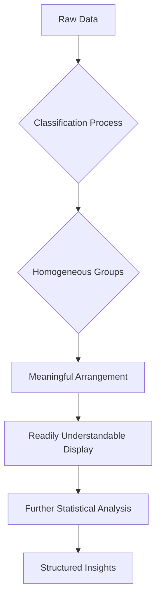

# Definition
Before proceeding, ensure you master Data_Collection and Statistical_Analysis.
Classification and Presentation of Statistical Data refers to the fundamental processes of arranging raw, unorganized information into homogeneous (similar) groups based on common characteristics, and then displaying it in a meaningful, readily understandable format to facilitate further statistical analysis. It transforms chaotic data into structured insights. Think of it like organizing a massive collection of diverse items: first, you sort them into logical categories (classification), and then you arrange those categories in a display cabinet so others can easily see and understand them (presentation).

# The Mental Model
Imagine you're a detective with a mountain of clues from a complex case. Your "raw data" is scattered and overwhelming. To make sense of it, you first "classify" the clues: separating eyewitness accounts from forensic evidence, sorting alibis by time, or grouping suspect profiles by common traits. Once classified, you "present" this organized information on a whiteboard, with diagrams, timelines, and clearly labeled sections. This allows you and your team to quickly grasp the relationships, identify patterns, and ultimately solve the case. Without classification and presentation, the raw data remains a jumbled mess, impossible to analyze effectively.

*Note: This `graph TD` illustrates the sequential flow from raw data through classification and presentation to derive structured insights, highlighting the transformative process.*

# Context & Framework
### The Data's Journey: From Chaos to Clarity
The process of classification and presentation of statistical data is the crucial intermediate step in the statistical investigation, bridging the gap between raw data collection and advanced analytical techniques. When data is first collected, it is often in an "ungrouped" or "unorganized" form, making it difficult to discern patterns or draw conclusions. Classification serves to impose order on this chaos by identifying inherent similarities among data points, grouping them logically. Following this, presentation translates these organized groups into visual or tabular formats that enhance comprehensibility and highlight key features. This structured approach is fundamental for validating initial hypotheses, communicating findings to non-experts, and preparing data for more sophisticated statistical modeling.

# The Mastery Deep Dive
### The Exploded View: Components of Organization
The overall process of data organization can be viewed as having two main components: classification and tabulation. Classification is the conceptual act of sorting data based on attributes like time, location, or descriptive characteristics. Tabulation is the practical act of arranging this classified data into tables, such as frequency distributions, to quantify the occurrences within each group. Furthermore, within presentation, the choice of graphical representation (e.g., bar chart, histogram) is critical, as each serves to highlight different aspects of the data. For instance, a histogram effectively visualizes the distribution of continuous data, while a bar chart is better suited for discrete or categorical comparisons.

### The Art of Data Storytelling
Effective data presentation is not merely about displaying numbers; it's about telling a clear, compelling story with data. The initial raw data holds many potential narratives, but without proper classification, these stories remain hidden. By strategically grouping data (e.g., by age group, by sales quarter), and then choosing appropriate visual aids (e.g., line graph for trends, pie chart for proportions), the data architect guides the audience to understand the most significant patterns and relationships. This active storytelling is critical for converting complex statistical outputs into understandable and actionable insights for decision-makers.

# Constraints & Limitations
### The Engineering Trade-off: Loss of Granularity
While classification and presentation are essential for clarity, they inherently involve a trade-off: a certain degree of data granularity is lost. When raw data points are grouped into classes (e.g., ages 20-29), the individual identities of the original data points within that class are obscured. This can sometimes limit the depth of subsequent analysis if very specific individual data points are needed. Additionally, poorly chosen classification criteria or inappropriate presentation methods can lead to misrepresentation, distorting the true nature of the data and potentially leading to incorrect conclusions. Developers must balance the need for simplification with the risk of oversimplification, always considering the potential for misinterpretation.

# Significance & Application
Classification and presentation are foundational to all statistical inquiries. They are the initial steps that transform raw observations into interpretable patterns, enabling everything from simple descriptive statistics to complex inferential analysis. In **scientific research**, they allow researchers to organize experimental results to identify significant findings. In **business intelligence**, these techniques structure sales, marketing, and operational data, providing the basis for strategic decision-making. For **public policy**, data on demographics, health, or economic indicators must be classified and presented to inform government planning and resource allocation. Mastery of these processes is indispensable for anyone working with data.

# The Worked Example
*Test your mastery. Cover the solutions below to test yourself first.*

Consider a raw dataset of the number of siblings reported by 15 students: 1, 0, 2, 1, 3, 0, 1, 1, 2, 4, 0, 1, 2, 1, 3.

**Goal:** Classify and present this raw data into a simple, organized format.

**Step 1: Classification**
Identify common characteristics: The data points are counts of siblings. We can group identical counts together.

**Step 2: Tabulation (Creating an Ungrouped Frequency Distribution)**
We will count how many times each number of siblings appears.

| Number of Siblings (x) | Tally | Frequency (f) |
| :
--------------------- | :
---- | :
------------ |
| 0                      | |||   | 3             |
| 1                      | ||||| | 6             |
| 2                      | |||   | 3             |
| 3                      | ||    | 2             |
| 4                      | |     | 1             |
| **Total**              |       | **15**        |

**Step 3: Presentation (Using a Vertical Line Graph - Mental Model)**
Although we don't draw it, mentally visualize a vertical line graph where the x-axis represents the 'Number of Siblings' and the y-axis represents 'Frequency'. Each number of siblings (0, 1, 2, 3, 4) would have a vertical line extending upwards corresponding to its frequency. For example, a line for '1 sibling' would extend to a height of 6.

**Why this works:**
*   **Classification:** Grouped similar data (number of siblings).
*   **Presentation:** The frequency table organizes the counts, making it immediately clear that having 1 sibling is the most common, and having 4 siblings is the least common among this sample. A mental image of a vertical line graph further enhances this understanding.

# The Proving Ground
*Test your mastery. Cover the solutions below to test yourself first.*

### Level 1: The Sanity Check (Verification)
**The Fact Check:** A dataset contains information on employee salaries, departments, and years of experience. Define what classification means in the context of organizing this data.
> **Solution:** Classification is the process of arranging the raw employee data into homogeneous or similar groups based on common characteristics, such as grouping employees by department, salary ranges, or experience levels.

### Level 2: The Crucible (Mastery & Edge Cases)
**The Impostor:** A data analyst presents a spreadsheet of raw survey responses, claiming they have "classified" the data by simply listing all the responses under their respective survey questions. Critically evaluate this claim, referencing the core principles of classification and presentation, and explain why this is an "impostor" classification.
> **Solution:** This is an "impostor" classification. Simply listing raw responses under survey questions is mere data collection, not classification. True classification, as defined, requires *arranging data into homogeneous groups based on common characteristics* to enable meaningful analysis and presentation. The analyst has not grouped similar responses, identified patterns, or transformed the chaotic raw data into a structured, readily understandable form. The essential step of identifying shared attributes and creating categories is missing, leaving the data unorganized for "further statistical analysis," which is the ultimate goal of classification.

# Key Takeaways
*   Classification transforms raw, unorganized data into homogeneous groups, making it amenable to analysis.
*   Presentation techniques (e.g., tables, graphs) display classified data in a clear and understandable manner.
*   The entire process is crucial for extracting insights, identifying patterns, and effectively communicating statistical information.

# Knowledge Graph Connections
| Concept                     | Connection / Relationship                                                          |
| :
-------------------------- | :
--------------------------------------------------------------------------------- |
| Data_Collection         | Classification is the next logical step after the initial collection of raw data.  |
| Statistical_Analysis    | Proper classification and presentation are prerequisites for meaningful statistical analysis. |
| [[Frequency_Distributions]] | A primary method of presenting classified data in a tabular format.              |
| [[Other_Graphical_Representations_of_Statistical_Data]] | Classification provides the organized input for various graphical presentations. |
---