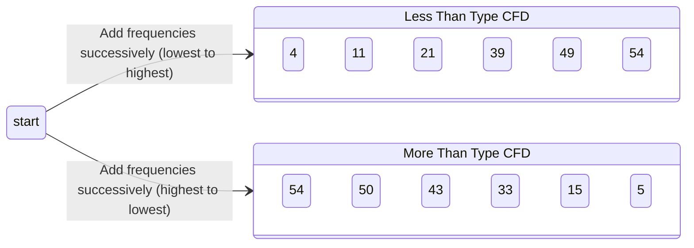

# Definition
Before proceeding, ensure you master [[Frequency_Distributions]] and [[Grouped_Frequency_Distributions_GFD]].
A Cumulative Frequency Distribution (CFD) is a tabular representation that shows the total frequency of all classes up to (or less than) the upper [[Class_Boundaries]] of a given class, or from (or more than or equal to) the lower [[Class_Boundaries]] of a given class. It accumulates frequencies across classes, indicating how many observations fall below a certain value (less than type) or above a certain value (more than type). Think of it like a running total: instead of just knowing how many students got 70-80 marks, you know how many got *less than 80 marks* or *80 marks or more*.

# The Mental Model
Imagine you're tracking how many tasks you've completed throughout a project. A regular frequency distribution tells you how many tasks you finished *today*. A cumulative frequency distribution tells you how many tasks you've finished *up to today*. It's a "running tally," where each new entry adds to the previous total. This helps you quickly see progress towards a goal or identify points where a significant portion of the work was completed.

*Note: This `stateDiagram-v2` illustrates the two main types of Cumulative Frequency Distributions: "Less Than Type CFD" (summing frequencies from lowest to highest class boundary) and "More Than Type CFD" (summing frequencies from highest to lowest class boundary), with example cumulative counts.*

# Context & Framework
### The Pilot's Checklist (Do Not Skip)
Constructing a [[Cumulative_Frequency_Distribution_CFD]] is a crucial "pilot's checklist" item when you need to understand the proportion of data falling below or above specific points. It's often built directly from a [[Grouped_Frequency_Distributions_GFD]], ensuring that each class's frequency is correctly added to the preceding totals (for "less than" type) or subsequent totals (for "more than" type). This systematic accumulation provides a foundational view of data distribution, crucial for identifying quantiles (like median or percentiles) and for constructing graphical representations like the [[Ogive]]. Skipping this step would make it difficult to answer questions like "What percentage of students scored below 70?" directly.

# The Mastery Deep Dive
### The Exploded View: Step-by-Step Accumulation
The "exploded view" of a [[Cumulative_Frequency_Distribution_CFD]] involves understanding the step-by-step accumulation process for each type.
*   **"Less Than" Type:** You start with the frequency of the lowest class and successively add the frequencies of the subsequent classes. Each cumulative frequency corresponds to the upper [[Class_Boundaries]] of that class. For example, if class 1 is (25.5 – 36.5) with frequency 4, and class 2 (36.5 – 47.5) with frequency 7, the "less than 47.5" cumulative frequency would be 4 + 7 = 11.
*   **"More Than" Type:** You start with the total frequency and successively subtract frequencies from the lowest classes, or sum from the highest class downwards. Each cumulative frequency corresponds to the lower [[Class_Boundaries]] of that class. For example, if total is 54 and class 1 frequency is 4, the "25.5 or more" cumulative frequency would be 54.
This systematic addition/subtraction reveals how observations are distributed across the entire range, from lowest to highest values.

### "It's Not Working!" - The Fix-it Guide
If your [[Cumulative_Frequency_Distribution_CFD]] is "not working" (e.g., final cumulative frequency doesn't match total, or values decrease in "less than" type), this "fix-it guide" will help:
*   **Final Cumulative Frequency Incorrect:** For "less than" type, the final cumulative frequency for the highest class's upper boundary **must equal the total number of observations**. If it doesn't, you've either miscalculated a frequency or made an arithmetic error in summing. Double-check all individual frequencies and sums. For "more than" type, the first cumulative frequency for the lowest class's lower boundary should be the total frequency, and the last should be zero.
*   **"Less Than" Type Decreasing:** The cumulative frequencies in a "less than" CFD **must always be non-decreasing**. If they decrease at any point, it indicates an arithmetic error. You've likely subtracted a frequency instead of added it, or added a negative value.
*   **Incorrect Class Boundaries:** Ensure you are using the correct [[Class_Boundaries]] when stating "less than" or "more than" values. For "less than" type, it's always "less than the *upper* boundary." For "more than" type, it's always "more than or equal to the *lower* boundary." Mismatching these will result in an incorrect CFD.

# Constraints & Limitations
### The Engineering Trade-off: Hiding Individual Class Frequencies
A subtle "engineering trade-off" with a [[Cumulative_Frequency_Distribution_CFD]] is that by emphasizing cumulative totals, it "hides individual class frequencies" in a quick glance. While you can deduce the frequency of a single class by subtracting adjacent cumulative frequencies, it's not immediately apparent as it is in a standard [[Grouped_Frequency_Distributions_GFD]]. This means that if the primary goal is to know the exact number of observations within *each specific interval*, a CFD alone might not be the most direct tool. Analysts must balance the benefit of cumulative insights with the need for individual interval details, sometimes requiring both types of distributions.

# Significance & Application
[[Cumulative_Frequency_Distribution_CFD]]s are essential for understanding the proportion of data that falls below or above specific values, making them critical for **percentile calculations** and **determining ranks**. In **education**, a CFD can show how many students scored below a certain grade or passed a threshold. In **quality control**, it can indicate the number of products that fall below a specific tolerance level. They are also the foundational step for constructing [[Ogive]] graphs, which visually represent cumulative distributions, providing insights into the overall spread and concentration of data.

# The Worked Example
*Test your mastery. Cover the solutions below to test yourself first.*

Consider the following [[Grouped_Frequency_Distributions_GFD]] for student marks (total students = 54):

| Class Limit | Frequency | Class Boundary |
| :
---------- | :
-------- | :
------------- |
| 26 – 36     | 4         | 25.5 – 36.5    |
| 37 – 47     | 7         | 36.5 – 47.5    |
| 48 – 58     | 10        | 47.5 – 58.5    |
| 59 – 69     | 18        | 58.5 – 69.5    |
| 70 – 80     | 10        | 69.5 – 80.5    |
| 81 – 91     | 5         | 80.5 – 91.5    |
| **Total**   | **54**    |                |

**Goal:** Construct a "Less than" type Cumulative Frequency Distribution.

**Step 1: Start Accumulating Frequencies from the Lowest Class**

| Class Boundary  | Frequency | Cumulative Frequency (Less than type) |
| :
-------------- | :
-------- | :
------------------------------------ |
| Less than 25.5  | 0         | 0                                     |
| Less than 36.5  | 4         | 4 (0 + 4)                             |
| Less than 47.5  | 7         | 11 (4 + 7)                            |
| Less than 58.5  | 10        | 21 (11 + 10)                          |
| Less than 69.5  | 18        | 39 (21 + 18)                          |
| Less than 80.5  | 10        | 49 (39 + 10)                          |
| Less than 91.5  | 5         | 54 (49 + 5)                           |

**Why this works:**
*   **Running Total:** Each cumulative frequency shows the total number of students whose marks fall below the upper [[Class_Boundaries]] of that specific interval.
*   **Insight:** For example, we can immediately see that 39 students scored less than 69.5 marks, providing a quick way to assess overall performance up to a certain point.

# The Proving Ground
*Test your mastery. Cover the solutions below to test yourself first.*

### Level 1: The Sanity Check (Verification)
**The Tool Check:** In a "less than" type [[Cumulative_Frequency_Distribution_CFD]], what value should the final cumulative frequency for the highest class's upper boundary equal?
> **Solution:** The final cumulative frequency for the highest class's upper boundary in a "less than" type [[Cumulative_Frequency_Distribution_CFD]] should equal the total number of observations (total frequency) in the dataset.

### Level 2: The Crucible (Mastery & Edge Cases)
**The Disaster Drill:** You are constructing a "less than" type [[Cumulative_Frequency_Distribution_CFD]] for student ages. After calculating the cumulative frequency for the 20-29 age group as 50, you then calculate the cumulative frequency for the next group (30-39) as 45. Explain why this creates an "impossible case" for a "less than" CFD and what arithmetic error this indicates. How would you "fix it"?
> **Solution:** This creates an "impossible case" for a "less than" type [[Cumulative_Frequency_Distribution_CFD]] because cumulative frequencies **must always be non-decreasing**. A value of 45 after a value of 50 indicates that the total number of individuals *less than* 39.5 years old is *less than* the number *less than* 29.5 years old, which is logically impossible. This indicates an arithmetic error where you've likely *subtracted* the frequency of the 30-39 age group instead of *adding* it, or there was an error in the individual frequency itself. To "fix it," you must re-calculate the cumulative frequency for the 30-39 age group by adding its frequency to the preceding cumulative total (50), ensuring the cumulative value is always increasing or staying the same.

# Key Takeaways
*   CFDs show the running total of frequencies, either "less than" or "more than" a certain value.
*   They are built from grouped frequency distributions using class boundaries.
*   Crucial for understanding data concentration and determining quantiles.

# Knowledge Graph Connections
| Concept                                 | Connection / Relationship                                                          |
| :
-------------------------------------- | :
--------------------------------------------------------------------------------- |
| [[Frequency_Distributions]]             | A specialized form of frequency distribution that provides cumulative insights.    |
| [[Grouped_Frequency_Distributions_GFD]] | CFDs are typically constructed by accumulating frequencies from a GFD.             |
| [[Class_Boundaries]]                    | Used as the reference points (e.g., "less than 36.5") for cumulative frequencies. |
| [[Ogive]]                               | The primary graphical representation for visualizing cumulative frequency distributions. |
| [[Cumulative_Percentage_Frequency_Distribution_CPFD]] | A derived form of CFD, where cumulative frequencies are expressed as percentages. |
---