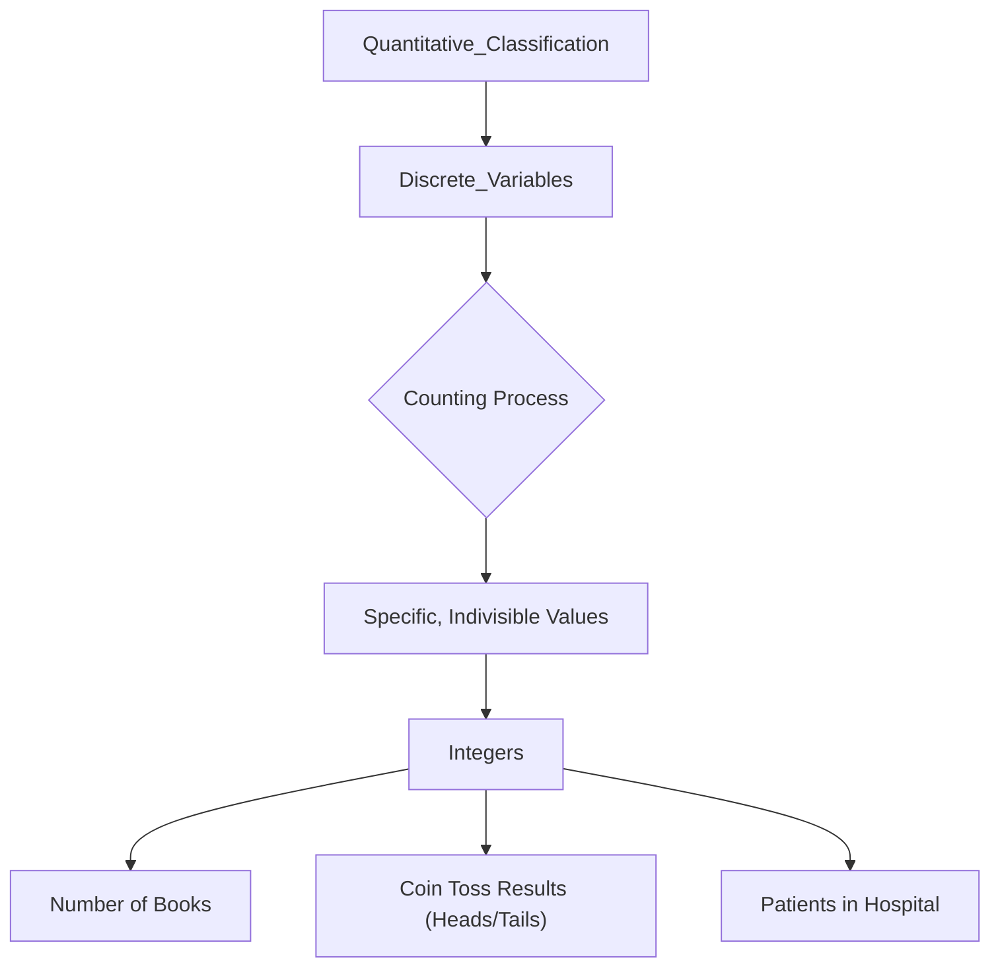

# Definition
Before proceeding, ensure you master [[Quantitative_Classification]] and Data_Collection.
Discrete Variables are a type of numerical data that can only assume specific, distinct values and cannot be meaningfully subdivided into smaller parts. These values are typically obtained by counting and usually result in whole numbers or integers. You can have 20 lions or 21 lions, but not 20.5 lions. They are like counting the number of fingers on your hand; you can have 5 or 6, but not 5.75.

# The Mental Model
Imagine you're trying to count the number of cars passing a specific point on a road. You can count 1 car, 2 cars, 3 cars, and so on. You can never have 1.5 cars or 2.7 cars. Each count is a distinct, separate whole unit. This "counting" nature is the core mental model for discrete variables: there are no valid fractional or decimal values in between the specific, countable units.

*Note: This `graph TD` illustrates the relationship of discrete variables to quantitative classification, emphasizing their derivation from counting and the resulting specific, indivisible integer values.*

# Context & Framework
### The Family Tree
Discrete variables are a fundamental branch within the "family tree" of [[Quantitative_Classification]]. They represent countable phenomena, contrasting directly with continuous variables which are measurable. This distinction is crucial for selecting appropriate statistical methods and visualizations. For example, the number of defects on a production line, the number of goals scored in a game, or the number of students in a class are all discrete. Understanding this categorization allows for proper data handling, such as using specific probability distributions designed for discrete data (e.g., Poisson or Binomial distributions).

# The Mastery Deep Dive
### The Exploded View: Precision in Countable Units
A deeper look into discrete variables reveals their absolute precision in countable units. Unlike continuous variables that can have infinite values between any two points, discrete variables inherently possess "gaps" between their possible values. For instance, the number of employees in a company can only be an integer (e.g., 50, 51, not 50.5). This "exploded view" emphasizes that these variables are not about measurement along a scale, but rather about exact enumeration. This characteristic influences how discrete data is recorded, analyzed, and interpreted, especially in frequency distributions where each distinct value (or small range of values) holds significance.

### Spot the Impostor (Don't be Fooled)
A common trap is to confuse discrete variables with continuous ones, especially when averages are involved. For example, while the *number* of children in a family is discrete (1, 2, 3), the *average* number of children per family across a population can be a fractional value (e.g., 2.2). The "impostor" here is the average, which appears continuous, but the underlying individual data points remain discrete. The crucial test is whether an individual data point can logically take on a fractional value. If not, it's discrete. Don't be fooled by the aggregation; always look at the nature of the individual observation.

# Constraints & Limitations
### The Engineering Trade-off: Limited Granularity
A key limitation of discrete variables is their inherently limited granularity. While this precision in counting is an advantage in some contexts, it means that subtle variations or fractional nuances cannot be captured. For instance, you can count the number of customers, but you cannot have half a customer. This lack of intermediate values can sometimes restrict the depth of analysis or the applicability of certain mathematical models that assume a continuous underlying distribution. The "engineering trade-off" is between the simplicity and exactness of counting versus the detailed spectrum of measurement.

# Significance & Application
Discrete variables are omnipresent in data analysis. In **business**, they are used to count the number of products sold, customer complaints, or employees. In **healthcare**, they quantify the number of patients, disease cases, or surgical procedures. **Researchers** use them to count experimental outcomes, such as the number of successes in a series of trials. These variables form the basis for many statistical tests and models, particularly those involving counts and frequencies. Understanding discrete variables is fundamental to accurate enumeration and analysis of countable phenomena.

# The Worked Example
*Test your mastery. Cover the solutions below to test yourself first.*

Consider the results of rolling a single die multiple times. The possible outcomes are 1, 2, 3, 4, 5, or 6.

**Goal:** Determine if the outcome of a single die roll is a discrete variable and explain why.

**Step 1: Analyze the Nature of the Values**
The outcomes are specific integers (1, 2, 3, 4, 5, 6).

**Step 2: Check for Subdivisibility**
Can you roll a 3.5 on a standard die? No. The values cannot be meaningfully subdivided. You either roll a 3 or a 4, but nothing in between.

**Conclusion:**
Yes, the outcome of a single die roll is a [[Discrete_Variables]]. This is because the values it can assume are specific, countable integers that cannot be further subdivided. It's a clear instance of data obtained by counting distinct possibilities.

# The Proving Ground
*Test your mastery. Cover the solutions below to test yourself first.*

### Level 1: The Sanity Check (Verification)
**The Variable ID:** Is the number of books in a library a discrete variable?
> **Solution:** Yes, the number of books in a library is a discrete variable because you count individual books, and you cannot have a fraction of a book.

### Level 2: The Crucible (Mastery & Edge Cases)
**The Impossible Case:** A statistician reports that the average number of traffic accidents at a particular intersection last year was 3.7. A new intern argues this is an "impossible case" because "you can't have 0.7 of an accident," implying that the number of accidents is not a discrete variable. Explain why the intern is confused and how the number of accidents is indeed a discrete variable, despite the fractional average.
> **Solution:** The intern's confusion arises from misinterpreting the average as an individual observation. The number of accidents on any given day or in any single event *is* a [[Discrete_Variables]] (you have 0, 1, 2, etc., accidents, not 0.7). However, when you calculate the *average* over multiple discrete observations (e.g., total accidents divided by the number of days/intersections), that average can legitimately be a fractional value (e.g., 37 accidents over 10 days = 3.7 accidents/day). The "impossible case" is only if an *individual* accident could be fractional; the average is simply a summary statistic.

# Key Takeaways
*   Discrete variables assume specific, distinct, and indivisible numerical values, typically obtained by counting.
*   They usually result in whole numbers and do not have valid fractional or decimal values between possibilities.
*   Understanding their countable nature is crucial for appropriate statistical analysis.

# Knowledge Graph Connections
| Concept                         | Connection / Relationship                                                          |
| :
------------------------------ | :
--------------------------------------------------------------------------------- |
| [[Quantitative_Classification]] | Discrete variables are a fundamental sub-category of quantitative classification. |
| [[Continuous_Variables]]        | Directly contrasted with discrete variables based on divisibility of values.       |
| [[Ungrouped_Frequency_Distributions]] | Often used to display the frequencies of discrete variable values.                 |
| [[Frequency_Distributions]]     | Discrete variables are a type of data that frequency distributions organize.       |
---