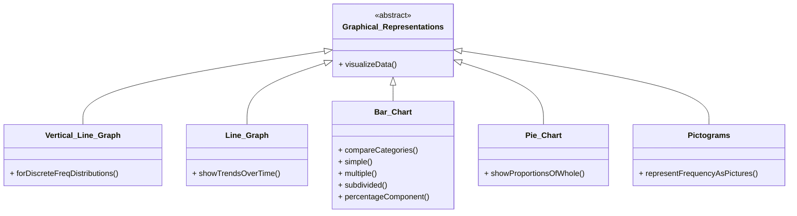

# Definition
Before proceeding, ensure you master [[Classification_and_Presentation_of_Statistical_Data]] and [[Frequency_Distributions]].
Other Graphical Representations of Statistical Data refers to the diverse range of visual tools, beyond basic frequency distributions and histograms, used to display classified data in a clear, concise, and meaningful way. These include [[Vertical_Line_Graph]]s, [[Line_Graph]]s, [[Bar_Chart]]s (simple, multiple, subdivided, percentage component), [[Pie_Chart]]s, and [[Pictograms]]. Each type is designed to highlight different aspects of data, such as trends over time, comparisons between categories, or proportions of a whole. Think of it as a toolbox filled with different visual instruments, each suited for a particular kind of data story.

# The Mental Model
Imagine you're an architect designing a building. You wouldn't use only blueprints; you'd use floor plans, elevation drawings, 3D renderings, and even miniature models. Each representation highlights a different aspect of the building, providing a comprehensive understanding. Similarly, when presenting data, "other graphical representations" are your architectural tools. You choose a [[Line_Graph]] for trends over time, a [[Bar_Chart]] for comparing categories, or a [[Pie_Chart]] for showing parts of a whole, ensuring the clearest possible visual narrative for your data.

*Note: This `classDiagram` illustrates the hierarchical relationship between general graphical representations and specific types like vertical line graphs, line graphs, bar charts, pie charts, and pictograms, highlighting their distinct functionalities for data visualization.*

# Context & Framework
### The Cookie Cutter: Why We Reuse Shapes
The concept of "other graphical representations" embodies the "cookie cutter" principle: why we reuse shapes or patterns for specific types of data. Each graph type (e.g., [[Vertical_Line_Graph]] for discrete frequency, [[Line_Graph]] for time series) acts as a specialized "cookie cutter" designed to optimally present certain data structures. This standardization ensures consistency and allows users to quickly interpret common data patterns. For example, a [[Bar_Chart]] is consistently used to compare distinct categories because its visual layout naturally facilitates such comparisons, making the process of data visualization efficient and universally understood. Understanding these established "shapes" is key to effective and unbiased data communication.

# The Mastery Deep Dive
### The Exploded View: Purpose-Driven Visual Elements
An "exploded view" of these various graphical representations reveals that each is built from purpose-driven visual elements.
*   [[Vertical_Line_Graph]]: Emphasizes discrete values and their exact frequencies with distinct vertical lines.
*   [[Line_Graph]]: Connects data points over time, highlighting trends and changes with its continuous line.
*   [[Bar_Chart]]: Uses the length of bars to compare magnitudes of different categories, often with gaps between bars. Its subtypes (multiple, subdivided, percentage component) add layers for complex comparisons.
*   [[Pie_Chart]]: Divides a circle into sectors, where each sector's area represents a proportion of the whole, ideal for showing composition.
*   [[Pictograms]]: Uses repetitive symbols to represent frequencies, often for engaging a broader audience.
Each element is strategically chosen to convey specific data relationships, making the graph a highly efficient communication tool.

### The Makeover: Fixing the Ugly Version
These graphical representations often serve as the "makeover" for "ugly" or raw data, transforming complex tables into intuitive visuals. For instance, a long table of sales figures over five years might be "ugly," but a [[Line_Graph]] gives it a beautiful makeover, immediately revealing growth, decline, or seasonality. Similarly, a list of product defects by type is dry, but a [[Pie_Chart]] quickly shows which defect is the largest proportion, drawing attention to critical areas. The "makeover" involves choosing the right graph to highlight the most important story in the data, enhancing understanding and engagement.

# Constraints & Limitations
### The Engineering Trade-off: Potential for Misrepresentation
A significant "engineering trade-off" with "other graphical representations" is their inherent "potential for misrepresentation." While powerful, poorly designed graphs can easily distort data, mislead viewers, or obscure crucial information. For instance, a [[Bar_Chart]] with a truncated y-axis can exaggerate differences, while a [[Pie_Chart]] with too many slices becomes unreadable. This means that while these tools offer great expressive power, they demand ethical and skillful application. The designer must consciously avoid manipulating visual cues (e.g., scale, color, order) that could lead to biased or inaccurate interpretations, ensuring the graph tells a true and fair story.

# Significance & Application
These "other graphical representations" are vital for effective data communication across all disciplines. [[Line_Graph]]s track stock prices, temperature changes, or population growth. [[Bar_Chart]]s compare sales figures by product, student counts by major, or votes by candidate. [[Pie_Chart]]s show market share, budget allocation, or demographic proportions. [[Pictograms]] are often used for simplified public statistics. Each graph serves a unique purpose, making complex datasets accessible, highlighting patterns and trends, and supporting evidence-based decision-making for diverse audiences. Mastery of these tools is crucial for any data communicator.

# The Worked Example
*Test your mastery. Cover the solutions below to test yourself first.*

Consider a dataset showing the number of students who chose different majors in a university.

| Major           | Number of Students |
| :
-------------- | :
----------------- |
| Computer Science | 200                |
| Business        | 150                |
| Engineering     | 100                |
| Arts            | 50                 |
| **Total**       | **500**            |

**Goal:** Choose an appropriate graphical representation to show the proportion of students in each major and explain why.

**Step 1: Analyze Data Type and Goal**
The data is categorical (majors) and the goal is to show parts of a whole (proportion of students in each major relative to the total).

**Step 2: Choose Appropriate Graph**
A [[Pie_Chart]] is the most appropriate graphical representation for showing parts of a whole or the composition of a total, as it visually divides a circle into sectors proportional to each category's contribution.

**Step 3: Calculate Angles for Pie Chart (Mental Model)**
*   Total Students = 500
*   Computer Science: (200/500) * 360° = 144°
*   Business: (150/500) * 360° = 108°
*   Engineering: (100/500) * 360° = 72°
*   Arts: (50/500) * 360° = 36°

**Why this works:**
*   **Proportional Representation:** The [[Pie_Chart]] effectively visualizes each major's share of the total student body, making it immediately clear which major is largest and how the others compare proportionally.
*   **Clarity:** The visual sectors directly translate to the percentage contribution of each category, which is the exact goal.

# The Proving Ground
*Test your mastery. Cover the solutions below to test yourself first.*

### Level 1: The Sanity Check (Verification)
**The Element ID:** Which graphical representation is best suited for showing trends or changes in a variable over time?
> **Solution:** A [[Line_Graph]] is best suited for showing trends or changes in a variable over time.

### Level 2: The Crucible (Mastery & Edge Cases)
**The "Grandma Test":** A political candidate wants to show that support for them has dramatically increased from 5% to 10% in two months. They present a [[Bar_Chart]] where the y-axis starts at 4% and goes up to 10%, making the 10% bar appear twice as tall as the 5% bar. Explain why this graph, despite using "other graphical representations," fails the "Grandma Test" for honest communication and constitutes a form of visual misrepresentation.
> **Solution:** This [[Bar_Chart]] fails the "Grandma Test" for honest communication and constitutes visual misrepresentation because of a truncated y-axis. By starting the y-axis at 4% instead of 0%, the visual difference between 5% and 10% is exaggerated. While 10% is indeed double 5%, the graph makes the *increase* look disproportionately larger than it is in absolute terms, misleading the viewer into perceiving a more dramatic surge in support than occurred. A truthful [[Bar_Chart]] should always start its quantitative axis at zero to ensure visual representation is proportional to the actual data values, enabling fair comparison and clear comprehension without distortion.

# Key Takeaways
*   Diverse graphical representations exist to effectively display different aspects of classified data.
*   Each graph type (line, bar, pie, pictogram) is chosen based on the data's nature and the message to convey.
*   Careful and ethical application of these tools is crucial to avoid misrepresentation and ensure clarity.

# Knowledge Graph Connections
| Concept                                      | Connection / Relationship                                                          |
| :
------------------------------------------- | :
--------------------------------------------------------------------------------- |
| [[Classification_and_Presentation_of_Statistical_Data]] | This concept encompasses the wide array of visual tools for presenting classified data. |
| [[Vertical_Line_Graph]]                      | A specific graphical representation for discrete frequency distributions.          |
| [[Line_Graph]]                               | A specific graphical representation for displaying trends over time.               |
| [[Bar_Chart]]                                | A specific graphical representation for comparing categories (with various subtypes). |
| [[Pie_Chart]]                                | A specific graphical representation for showing proportions of a whole.            |
| [[Pictograms]]                               | A specific graphical representation using symbols to denote frequencies.           |
---