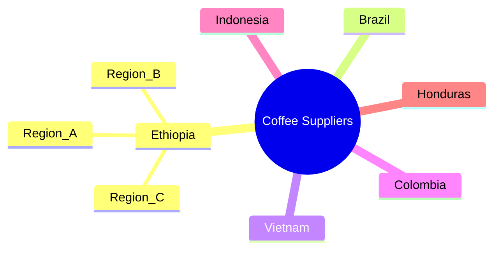

# Definition
Before proceeding, ensure you master [[Classification_and_Presentation_of_Statistical_Data]] and Data_Collection.
Spatial or Geographical Classification is the process of arranging statistical data based on areas or places, thereby organizing information according to its geographical distribution. This type of classification is also known as areal classification, and it groups data into categories such as countries, states, districts, or zones. It's like having a map and marking where certain events or resources are located to see patterns related to geography.

# The Mental Model
Imagine you're a meteorologist trying to understand weather patterns. You wouldn't just look at a list of temperatures; you'd look at a weather map. The map classifies temperatures by geographical location (cities, regions, continents), allowing you to visually identify cold fronts, hot zones, or storm systems moving across an area. The geographical classification is the underlying principle that enables the creation of such a map, making spatial relationships and distributions immediately clear.

*Note: This `mindmap` illustrates a geographical classification of coffee suppliers, with countries as primary branches and regions as sub-branches, demonstrating how data can be organized by location.*

# Context & Framework
### Where Does it Live? (The Map)
Spatial classification fundamentally answers the question "Where does this data live?" It provides a geographical lens through which to view statistical phenomena. This approach is particularly powerful for datasets where location plays a significant role in the observed values. For example, understanding the distribution of mineral resources, population density, or sales performance inherently requires categorizing data by specific geographical areas. By structuring data in this manner, patterns tied to physical location become apparent, such as concentrations, dispersions, or gradients across different regions. This contextual framework is vital for fields like urban planning, resource management, and market analysis.

# The Mastery Deep Dive
### Who are the Neighbors? (Contextual Relationships)
When data is classified geographically, it's not just about isolated points on a map; it's about understanding the relationships between "neighbors." For instance, classifying coffee production by country allows us to compare Brazil's output with Vietnam's, and then understand regional disparities within a country like Ethiopia. This helps in identifying geographical clusters of high or low values, understanding trade routes, or assessing the impact of localized policies. The ability to compare and contrast data across adjacent or distinct geographical units is a core strength of spatial classification, offering insights into spatial autocorrelation and regional influences that would be lost in a non-spatial arrangement.

### The Regional Blueprint: Detailed Stratification
A deeper dive into geographical classification involves a more granular stratification of areas. While initially grouping by country is useful, further classifying data by states, districts, or even specific zones within a city provides a "regional blueprint." For example, analyzing student distribution in universities might begin by grouping students by country, then by state, and finally by the specific city or campus location. This multi-level geographical classification allows for increasingly detailed analysis, pinpointing specific areas of interest or concern, and enabling highly targeted interventions or strategies. This granular approach moves beyond broad patterns to reveal localized nuances.

# Constraints & Limitations
### The Engineering Trade-off: Boundary Problems
One significant limitation of spatial classification is the "boundary problem." The definition of geographical areas (e.g., administrative districts, sales territories) can be arbitrary or change over time, which can impact data interpretation. Data collected within one set of boundaries might be difficult to compare with data from another, or if boundaries shift, historical comparisons become challenging. This can distort trends or make it difficult to aggregate or disaggregate data effectively. Additionally, some phenomena do not strictly adhere to administrative boundaries, meaning data classified by such divisions might not accurately reflect the underlying spatial patterns of the phenomenon itself.

# Significance & Application
Spatial classification is crucial for understanding the geographical distribution of various phenomena. In **economics**, it helps analyze regional GDP, trade flows, or resource distribution. For **public health**, classifying disease outbreaks by location is vital for containment and intervention strategies. **Urban planners** use it to understand population density, infrastructure needs, and land use patterns. Even in **ecology**, species distribution is often studied through geographical classification. This method transforms raw location-based data into actionable intelligence, revealing spatial trends and informing geographically targeted decisions.

# The Worked Example
*Test your mastery. Cover the solutions below to test yourself first.*

Consider a simplified dataset of student enrollments from different cities in a country for a specific university program:

*   Addis Ababa: 150 students
*   Hawassa: 80 students
*   Bahir Dar: 120 students
*   Mekelle: 70 students
*   Adama: 90 students

**Goal:** Apply spatial/geographical classification to this data and present it clearly.

**Step 1: Classification**
The data is already inherently classified by geographical location (city). The task is to organize and present these geographical groups.

**Step 2: Tabulation**
We can arrange this data into a simple table, listing each city and its corresponding enrollment.

| City        | Number of Students |
| :
---------- | :
----------------- |
| Addis Ababa | 150                |
| Bahir Dar   | 120                |
| Adama       | 90                 |
| Hawassa     | 80                 |
| Mekelle     | 70                 |

**Step 3: Presentation (Mental Model of a Bar Chart)**
Mentally, you would visualize a bar chart (or a map with shaded regions) where each city has a bar representing its student enrollment. Addis Ababa's bar would be the tallest, followed by Bahir Dar, and so on. This visual immediately highlights the city with the highest and lowest enrollments.

**Why this works:**
*   **Classification:** Grouped data by a spatial characteristic (city).
*   **Presentation:** The table and conceptual bar chart clearly show the distribution of student enrollment across different cities, making it easy to compare geographical differences.

# The Proving Ground
*Test your mastery. Cover the solutions below to test yourself first.*

### Level 1: The Sanity Check (Verification)
**The Element ID:** A company tracks its product sales by continent, then by country within each continent. Is this an example of spatial/geographical classification?
> **Solution:** Yes, this is a clear example of spatial/geographical classification because the data is organized based on physical locations (continents and countries).

### Level 2: The Crucible (Mastery & Edge Cases)
**The Friction Point:** A government agency is planning to distribute emergency relief aid based on poverty levels, classifying regions as "High," "Medium," or "Low" poverty. However, the geographical classifications used are broad administrative regions that may contain pockets of both extreme wealth and extreme poverty. Identify how this broad classification might lead to a "friction point" in effectively targeting aid and propose a refinement based on the principles of spatial classification.
> **Solution:** The "friction point" is that broad administrative regions may mask significant internal variations in poverty levels. By classifying at too high a level, aid intended for "High Poverty" regions might be diluted by reaching affluent pockets within those regions, while genuinely impoverished areas within "Medium" or "Low" classifications could be overlooked. A refinement would be to apply a more granular spatial classification, such as classifying by sub-districts, local communities, or even using geographical information systems (GIS) to identify specific areas of high poverty density, rather than relying solely on large, potentially heterogeneous administrative boundaries.

# Key Takeaways
*   Spatial classification organizes data based on geographical location, such as countries, states, or regions.
*   It is crucial for analyzing phenomena with spatial distribution patterns like population, resources, or sales.
*   While powerful, care must be taken with boundary definitions to avoid misrepresentation and ensure accurate insights.

# Knowledge Graph Connections
| Concept                                      | Connection / Relationship                                                                   |
| :
------------------------------------------- | :
------------------------------------------------------------------------------------------ |
| [[Classification_and_Presentation_of_Statistical_Data]] | A specific type of classification used to organize raw data.                            |
| [[Qualitative_Classification]]               | While distinct, geographical categories can sometimes be treated qualitatively (e.g., "North" region). |
| [[Quantitative_Classification]]              | Often combined with quantitative data (e.g., sales figures by region).                  |
| [[Other_Graphical_Representations_of_Statistical_Data]] | Forms the basis for creating maps and geographically-themed charts.                     |
---