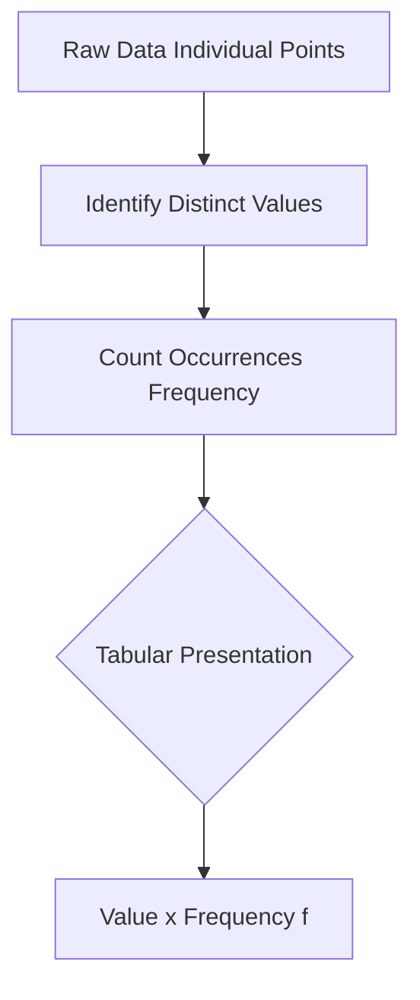

# Definition
Before proceeding, ensure you master [[Frequency_Distributions]] and [[Discrete_Variables]].
Ungrouped Frequency Distributions are tabular representations of data that list each individual data point or value observed in a dataset, along with the number of times each distinct value occurs (its frequency). This type of distribution is typically used for small datasets or when dealing with [[Discrete_Variables]] that have a limited number of unique values. It's like taking a list of test scores (e.g., 7, 8, 7, 9, 8) and creating a simple table that shows: Score 7: 2 times, Score 8: 2 times, Score 9: 1 time.

# The Mental Model
Imagine you're collecting feedback on a new product feature, asking users to rate it from 1 to 5. If you have 20 responses, an ungrouped frequency distribution is like tallying each distinct rating. You'd see exactly how many users gave a '1', how many gave a '2', and so on. This immediate visual of individual scores and their counts helps you understand the direct response to each rating option without any aggregation or grouping into broader categories.

*Note: This `graph TD` outlines the straightforward process of constructing an ungrouped frequency distribution, from raw individual data points to a clear tabular format.*

# Context & Framework
### The Pilot's Checklist (Do Not Skip)
Constructing an ungrouped frequency distribution is often the first "pilot's checklist" item when dealing with raw, individual data points, especially for [[Discrete_Variables]] or small datasets. This initial step helps to quickly organize data from its chaotic form into a digestible summary. It ensures that every distinct value is accounted for and its prevalence is accurately noted. This clear, direct count of each occurrence is a prerequisite for calculating many basic statistics and for deciding if more advanced grouping (like a [[Grouped_Frequency_Distributions_GFD]]) is necessary. Skipping this foundational step can lead to errors in subsequent analysis.

# The Mastery Deep Dive
### The Exploded View: Preserving Original Detail
The strength of an ungrouped frequency distribution lies in its ability to present the "exploded view" of the dataset while preserving almost all of the original detail. Unlike grouped distributions, no data granularity is lost because each distinct observed value is listed explicitly. For instance, if scores are 1, 2, 3, 4, 5, the distribution explicitly states the frequency of each score. This allows for precise identification of the mode (most frequent score) and for accurate calculation of exact averages, without the approximation inherent in grouped data. This preservation of individual identity is invaluable for detailed insights when the range of values is small.

### Identifying the "Lone Wolf" and "Crowd"
By presenting each distinct value with its frequency, ungrouped distributions excel at identifying both the "lone wolves" (values that occur very rarely, or even just once) and the "crowd" (values with very high frequencies). This immediate visibility into the prevalence of each specific outcome is crucial for understanding the data's inherent patterns. For example, if a product quality check reveals a defect type with a frequency of 1 (a lone wolf) alongside another with a frequency of 50 (the crowd), this direct comparison immediately highlights the most pressing issue for resolution, something that might be obscured in a grouped representation.

# Constraints & Limitations
### The Engineering Trade-off: Readability for Large Ranges
A significant limitation of ungrouped frequency distributions is their compromised "readability for large ranges" of data. If a dataset has many unique values (e.g., ages of 1,000 people, each with a slightly different age), an ungrouped distribution would be very long and cumbersome, defeating the purpose of summarization. This "engineering trade-off" means that while they preserve individual detail, they become impractical and uninformative when the number of distinct values is high. In such scenarios, [[Grouped_Frequency_Distributions_GFD]] become the necessary alternative to maintain conciseness and clarity.

# Significance & Application
Ungrouped frequency distributions are fundamental for initial data exploration. In **surveys**, they tally responses to categorical or discrete questions (e.g., number of children, satisfaction ratings). In **quality control**, they count the occurrences of specific types of defects. In **education**, they summarize individual student scores on small quizzes. They provide a quick, transparent summary of data, making it easy to identify popular choices, rare occurrences, and the overall spread of individual values, particularly for variables where each specific value holds significance.

# The Worked Example
*Test your mastery. Cover the solutions below to test yourself first.*

A small restaurant owner tracks the number of coffees sold each hour over a 10-hour shift: 15, 20, 18, 15, 22, 18, 15, 20, 22, 18.

**Goal:** Construct an ungrouped frequency distribution for the number of coffees sold per hour.

**Step 1: Identify Distinct Values**
The distinct values for the number of coffees sold are 15, 18, 20, and 22.

**Step 2: Count Frequencies for Each Value**
*   15: Appears 3 times
*   18: Appears 3 times
*   20: Appears 2 times
*   22: Appears 2 times

**Step 3: Tabulate the Ungrouped Frequency Distribution**

| Number of Coffees Sold (x) | Frequency (f) |
| :
------------------------- | :
------------ |
| 15                         | 3             |
| 18                         | 3             |
| 20                         | 2             |
| 22                         | 2             |
| **Total**                  | **10**        |

**Why this works:**
*   **Data Type:** The number of coffees sold is a [[Discrete_Variables]] (you sell whole coffees, not half).
*   **Clarity:** The table clearly shows how many times each specific number of coffees was sold per hour, immediately revealing that 15 and 18 sales per hour were the most frequent occurrences.

# The Proving Ground
*Test your mastery. Cover the solutions below to test yourself first.*

### Level 1: The Sanity Check (Verification)
**The Tool Check:** What type of data is typically used to construct an ungrouped frequency distribution?
> **Solution:** Ungrouped frequency distributions are typically used for discrete variables or for small datasets where the number of unique data points is limited.

### Level 2: The Crucible (Mastery & Edge Cases)
**The Disaster Drill:** You are given a large dataset of 1,000 unique individual scores on a highly granular exam (scores ranging from 0.00 to 100.00 with two decimal places). You attempt to create an ungrouped frequency distribution. Explain why this quickly becomes a "disaster drill" in terms of readability and utility, and what immediate alternative would be essential.
> **Solution:** This quickly becomes a "disaster drill" because an ungrouped frequency distribution for 1,000 unique, highly granular scores would result in a table with potentially 1,000 rows (one for each unique score), each with a frequency of typically "1". This defeats the purpose of summarization, making the table extremely long, unreadable, and utterly uninformative for discerning patterns. The immediate and essential alternative would be to construct a [[Grouped_Frequency_Distributions_GFD]], where scores are organized into meaningful class intervals (e.g., 0-10, 10.01-20.00), significantly reducing the number of rows and enhancing readability.

# Key Takeaways
*   Ungrouped frequency distributions list each individual data value with its frequency.
*   They are ideal for small datasets or discrete variables with a limited range of unique values.
*   They preserve individual data detail but can become cumbersome for large datasets with many unique values.

# Knowledge Graph Connections
| Concept                     | Connection / Relationship                                                          |
| :
-------------------------- | :
--------------------------------------------------------------------------------- |
| [[Frequency_Distributions]] | A specific type of frequency distribution, particularly useful for individual data. |
| [[Discrete_Variables]]      | Commonly used to represent and summarize discrete variable data.                   |
| [[Grouped_Frequency_Distributions_GFD]] | Often contrasted with ungrouped distributions, which are for larger ranges or continuous data. |
| Raw_Data                | Ungrouped frequency distributions are one of the first steps in organizing raw data. |
---