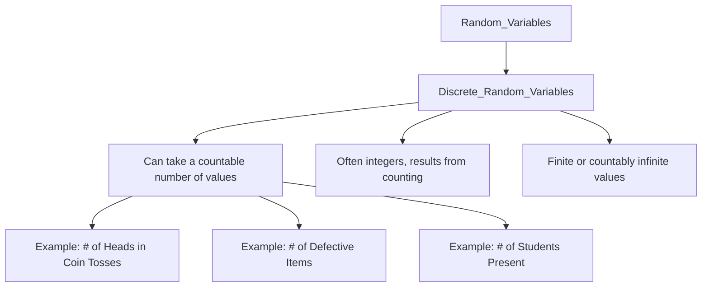

# Definition
Before proceeding, ensure you master [[Random_Variables]] because discrete random variables are a specific type of random variable, characterized by their countable nature.
A discrete random variable is a **random variable that can take on only a countable number of distinct values**. These values are typically integers and often result from counting something. The "countable" aspect means that you can list the possible values, even if the list is infinite. A simpler way to think about it: if you can tally the possible outcomes using whole numbers (0, 1, 2, 3, etc.), then you're dealing with a discrete random variable. It's like counting the number of times you land on "heads" when flipping a coin – you can have 0, 1, 2, etc., heads, but not 1.5 heads.

# The Mental Model
Imagine you're trying to count items in distinct, separate chunks. For example, if you count the number of red cars passing a street in an hour, you'll get a whole number: 0, 1, 2, 3, and so on. You won't get 1.7 red cars. This makes "number of red cars" a discrete random variable. The key is that there are "gaps" between the possible values, meaning the variable jumps from one specific value to the next without taking on any values in between.


```text
// Scenario 1: Hierarchical classification and examples of Discrete Random Variables.
// Output:
// (A visual graph diagram illustrating the classification of Discrete Random Variables under Random Variables.)
// The diagram shows "Random_Variables" leading to "Discrete_Random_Variables".
// From "Discrete_Random_Variables", branches explain its characteristics: "Can take a countable number of values", "Often integers, results from counting", "Finite or countably infinite values".
// Further examples branch from "Can take a countable number of values": "# of Heads in Coin Tosses", "# of Defective Items", "# of Students Present".
```
*Note: This `graph TD` illustrates the hierarchical classification and key characteristics of discrete random variables, along with typical examples.*

# Context & Framework
### Counting the Unpredictable: Discrete Values
Discrete random variables arise in situations where the outcomes can be listed or counted. The values are distinct and separate, often whole numbers (integers), and there are no intermediate values between any two consecutive values.
Examples include:
*   The **number of members in a family**. You can have 2, 3, 4 members, but not 3.5.
*   The **number of defective light bulbs in a box of 10 bulbs**. The possible values are 0, 1, 2, ..., 10.
*   The **number of houses in a specific living compound**.
*   The **number of customers who visit a bank during any given hour**.
These examples highlight that discrete random variables represent numbers found by counting. Even if a set of values is theoretically infinite (like the number of coin flips until the first head appears), if they can be counted as distinct items (1st flip, 2nd flip, etc.), the variable is discrete.

# The Mastery Deep Dive
### Taxonomist: Categorizing Countable Events
Discrete random variables are fundamentally characterized by the **countability of their outcomes**. This means that if you were to plot the possible values on a number line, there would be distinct, isolated points with gaps in between. This is in stark contrast to continuous variables, which can take any value within an interval.
The formal distinction lies in the mathematical concept of countability. A set is countable if its elements can be put into a one-to-one correspondence with the set of natural numbers. Thus, for a discrete random variable $X$, its possible values $\{x_1, x_2, x_3, \dots\}$ can be enumerated.
This characteristic directly impacts how probabilities are assigned and calculated for these variables. For discrete random variables, we typically use a **Probability Mass Function (PMF)**, which assigns a probability $P(X=x)$ to each specific value $x$ that the random variable can take. The sum of all probabilities in a PMF must equal 1.

# Constraints & Limitations
### The "Oops!" List: Averaging Discrete Counts
A common misconception is to treat the *average* of discrete counts as itself a discrete random variable. For instance, if the average number of children per family is 2.3, "2.3 children" isn't a discrete outcome; it's a summary statistic derived from discrete data. The random variable itself (number of children in a *single* randomly selected family) is discrete. This confusion can lead to incorrectly applying continuous probability distributions where discrete ones are appropriate, or misinterpreting the nature of the data. Always remember that the underlying *individual outcomes* determine whether the variable is discrete or continuous.

# Significance & Application
Discrete random variables are fundamental to understanding and modeling phenomena where outcomes are distinct and countable. In academic fields, they are central to concepts like the Binomial, Poisson, and Hypergeometric distributions, which are widely used in combinatorics, statistical inference, and hypothesis testing. In the real world, discrete random variables are applied in various scenarios:
*   **Quality Control:** The number of defects per batch of products.
*   **Epidemiology:** The number of new cases of a disease in a given period.
*   **Marketing:** The number of clicks on an advertisement.
*   **Finance:** The number of stock price increases in a week.
By providing a clear framework for quantifying countable uncertainties, discrete random variables enable precise predictions and informed decisions in these and many other domains.

# The Worked Example
Consider the experiment of observing the number of cars that pass through a toll booth in a 5-minute interval.

1.  **Define the Experiment:** Observing car count at a toll booth over 5 minutes.
2.  **Define a Random Variable (X):** Let $X$ be the number of cars passing in 5 minutes.
3.  **Identify Possible Values of X:**
    Since we are counting cars, the values can only be non-negative integers. It's possible 0 cars pass, 1 car, 2 cars, and so on. There's no theoretical upper limit unless specified by some external factor, but the values are still distinct counts.
    So, $X \in \{0, 1, 2, 3, \dots \}$.
4.  **Confirm Discrete Nature:**
    The values are distinct and countable. We can list them. Therefore, $X$ is a discrete random variable. We cannot have, for example, 1.5 cars pass through.

# The Proving Ground
*Test your mastery. Cover the solutions below to test yourself first.*

### Level 1: The Sanity Check (Verification)
**The Question:** Is the number of goals scored in a football match a discrete random variable? Explain why.
> **Solution:** Yes, it is a discrete random variable because the number of goals can only be whole, countable numbers (0, 1, 2, 3, etc.), not fractional values.

### Level 2: The Crucible (Mastery & Edge Cases)
**The Scenario:** A survey asks participants for their household income, rounded to the nearest thousand dollars. Is this a discrete random variable? Justify your answer.
> **Solution:** Yes, this is a discrete random variable. Even though income itself can be continuous, rounding to the "nearest thousand dollars" forces the possible values into distinct, countable categories (e.g., $10,000, $11,000, etc.). The act of rounding makes the variable's observed values discrete.

# Key Takeaways
*   Discrete random variables take on only countable, distinct values, typically integers from counting.
*   They have "gaps" between possible values and are often represented by Probability Mass Functions (PMFs).
*   Examples include counts of events, defects, or people.

# Knowledge Graph Connections
| Concept                     | Connection / Relationship                                                                   |
| :
-------------------------- | :
------------------------------------------------------------------------------------------ |
| [[Random_Variables]]        | Is a specific type of random variable, distinguishing it from continuous variables.        |
| [[Continuous_Random_Variables]] | Provides a contrast by defining the other major type of random variable based on measurability. |
| [[Binomial_Distribution]]   | Is a probability distribution specifically for discrete random variables.                   |
| [[Poisson_Distribution]]    | Is a probability distribution specifically for discrete random variables.                   |
---