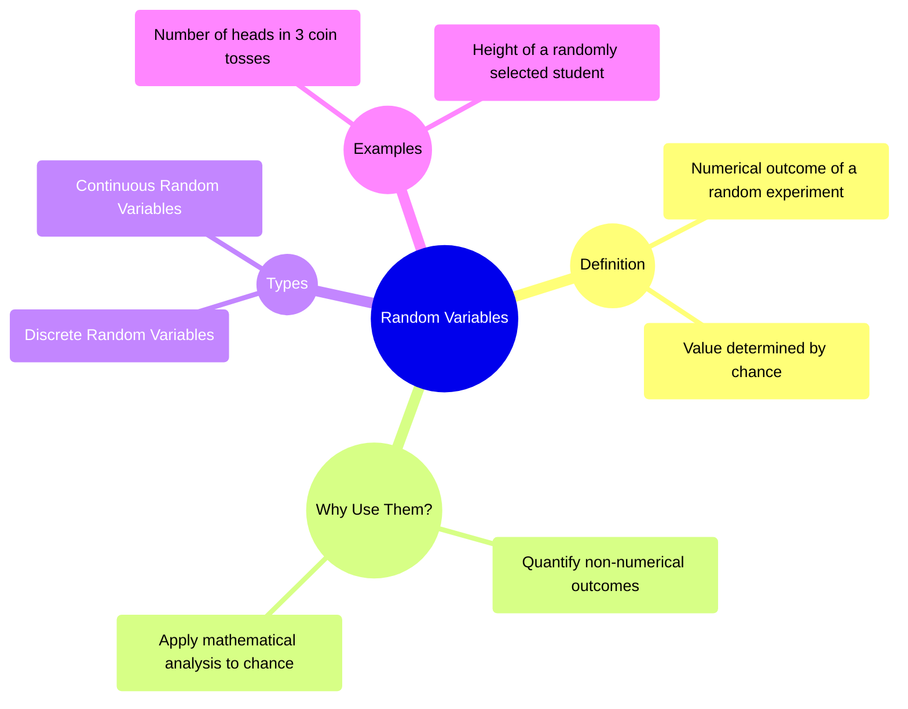

# Definition
Before proceeding, ensure you master [[Introduction_to_Probability]] because random variables are numerical representations of outcomes from probability experiments.
A random variable is a **variable whose value is a numerical outcome of a random phenomenon or experiment**. Its value is determined by chance. Unlike algebraic variables that have a fixed, albeit unknown, value, a random variable can take on different values with associated probabilities. A simpler way to think about it: imagine rolling a die. The outcome itself is a number (1, 2, 3, 4, 5, or 6). This numerical outcome is the random variable. We don't know *which* number it will be before we roll, but we know the possible values and their probabilities.

# The Mental Model
Imagine you're at a carnival game where you spin a wheel. The actual physical outcome is where the pointer lands (e.g., "Red Sector," "Blue Sector," "Green Sector"). A **random variable** is simply a way to assign a *number* to each of those outcomes. For example, if landing on "Red" gives you 10 points, "Blue" 5 points, and "Green" 0 points, then the "points won" in this game is a random variable. It's a numerical summary of a random process. We're translating qualitative results into quantifiable values that we can then analyze mathematically.


```text
// Scenario 1: Conceptual overview of Random Variables.
// Output:
// (A visual mindmap illustrating the core concepts of Random Variables.)
// The mindmap will show "Random Variables" as the central theme.
// Branches will extend to "Definition" (numerical outcome, value by chance).
// "Why Use Them?" (quantify outcomes, mathematical analysis).
// "Types" (Discrete and Continuous).
// "Examples" (number of heads, student height).
```
*Note: This `mindmap` visually organizes the definition, purpose, types, and examples of random variables.*

# Context & Framework
### Quantifying Uncertainty: Bridging Outcomes to Numbers
Random variables serve as a critical bridge between the qualitative outcomes of an experiment and the quantitative tools of probability and statistics. By assigning numerical values to the outcomes, we can apply mathematical functions, plot distributions, and calculate expected values. This transformation allows us to move beyond simply listing "heads" or "tails" to talking about the "number of heads" in a series of flips, which is a numerical value.
A **random experiment** is a process whose outcome is not known in advance. The result is uncertain. For example, the tossing of an unbiased coin is a random experiment because we don't know whether it will be heads or tails. A random variable, $X$, assigns a real number to each outcome in the sample space of a random experiment. This numerical assignment is what enables statistical analysis, as we can then talk about the probability of $X$ taking on certain values.

# The Mastery Deep Dive
### Mapping the Landscape: Categorization by Countability
The primary way to map the landscape of random variables is by distinguishing their types based on the nature of the numerical values they can assume:
1.  **Discrete Random Variables:** These variables can take on only a **countable** number of distinct values. Typically, these are integers resulting from counting. For example, the number of defective items in a batch, the number of heads in five coin tosses, or the number of students present in a class are all discrete random variables. Even if the number of possible values is very large, as long as it's finite or countably infinite, it's discrete.
2.  **Continuous Random Variables:** These variables can take on an **infinite** number of possible values within a given range. These values typically arise from measurements. For example, the height of a person, the weight of a baby, the time taken to complete a task, or the temperature in a room are all continuous random variables. Between any two possible values, there is an infinite number of other possible values.

### The Rigorous Translator: From Event to Numerical Function
Formally, a random variable $X$ is a **function** that maps each outcome $\omega$ in the sample space $S$ of an experiment to a unique real number, $X(\omega)$. This transformation is critical because it allows us to define probabilities for numerical events. Instead of $P(\{Heads\})$, we can define $P(X=1)$ if $X$ represents the number of heads (where Heads = 1, Tails = 0). This formalization enables the development of probability distributions, which associate each possible value of the random variable with its probability of occurrence. This is the bridge that links the abstract concept of chance to concrete mathematical models.

# Constraints & Limitations
### The Illusory Certainty: Confusing Values with Randomness
A common misconception is to confuse a variable that *produces* random numbers (like a computer's random number generator) with a true random variable defined by an experiment. While a generator outputs numbers, a random variable is strictly tied to the *outcomes of an actual random experiment*. Another pitfall is mistaking any numerical observation for a random variable; the key is that the value must be *determined by chance* from an experiment. For example, a student's fixed ID number is not a random variable, but the ID number of a *randomly selected* student is.

# Significance & Application
Random variables are the fundamental building blocks for all statistical inference and modeling. They enable us to apply mathematical rigor to real-world uncertainty. Academically, they form the basis for understanding probability distributions (like the binomial, Poisson, and normal distributions), which are central to inferential statistics. In practical applications, random variables are used extensively in risk management (e.g., modeling insurance claims), engineering (e.g., stress on materials), finance (e.g., stock price fluctuations), and science (e.g., measurement errors). They transform unpredictable events into quantifiable data, allowing for predictions, hypothesis testing, and informed decision-making.

# The Worked Example
Consider the experiment of tossing a fair coin three times.

1.  **Define the Sample Space (S):**
    The possible outcomes are: HHH, HHT, HTH, THH, HTT, THT, TTH, TTT.
2.  **Define a Random Variable (X):**
    Let $X$ be the number of heads obtained in the three tosses.
3.  **Map Outcomes to Numerical Values for X:**
    *   HHH $\to X=3$
    *   HHT $\to X=2$
    *   HTH $\to X=2$
    *   THH $\to X=2$
    *   HTT $\to X=1$
    *   THT $\to X=1$
    *   TTH $\to X=1$
    *   TTT $\to X=0$
4.  **Identify the Possible Values of X:**
    The random variable $X$ can take on the values $\{0, 1, 2, 3\}$.
5.  **Calculate Probabilities for Each Value of X:**
    *   $P(X=0) = P(\{TTT\}) = 1/8$
    *   $P(X=1) = P(\{HTT, THT, TTH\}) = 3/8$
    *   $P(X=2) = P(\{HHT, HTH, THH\}) = 3/8$
    *   $P(X=3) = P(\{HHH\}) = 1/8$

This shows how a random variable converts non-numerical outcomes (like HHH) into numerical values (like 3) for easier probabilistic analysis.

# The Proving Ground
*Test your mastery. Cover the solutions below to test yourself first.*

### Level 1: The Sanity Check (Verification)
**The Question:** What is the defining characteristic of a random variable?
> **Solution:** A random variable is a variable whose value is a numerical outcome of a random experiment, determined by chance.

### Level 2: The Crucible (Mastery & Edge Cases)
**The Scenario:** A new product's success is being evaluated. The outcomes are "Failure," "Moderate Success," or "Wild Success."
(a) How can you define a random variable to quantify these outcomes?
(b) Give an example of a value this random variable might take for "Moderate Success."
> **Solution:**
> (a) Define a random variable $X$ representing the "degree of success."
> (b) For example:
>     *   $X=0$ for "Failure"
>     *   $X=1$ for "Moderate Success"
>     *   $X=2$ for "Wild Success"
> (Other numerical assignments are also valid, as long as they are consistent and ordered if appropriate).

# Key Takeaways
*   A random variable assigns numerical values to the outcomes of a random experiment.
*   It quantifies uncertainty, allowing for mathematical analysis of chance events.
*   Random variables are categorized as either discrete (countable values) or continuous (infinite values within a range).

# Knowledge Graph Connections
| Concept                     | Connection / Relationship                                                                   |
| :
-------------------------- | :
------------------------------------------------------------------------------------------ |
| [[Introduction_to_Probability]] | Provides the foundational understanding of experiments and outcomes which random variables quantify. |
| [[Discrete_Random_Variables]] | Is a specific type of random variable, characterized by countable outcomes.                  |
| [[Continuous_Random_Variables]] | Is a specific type of random variable, characterized by measurable outcomes within a range. |
| [[Types_of_Probability_Distributions_Overview]] | Random variables are the subject of probability distributions, which describe their behavior. |
---