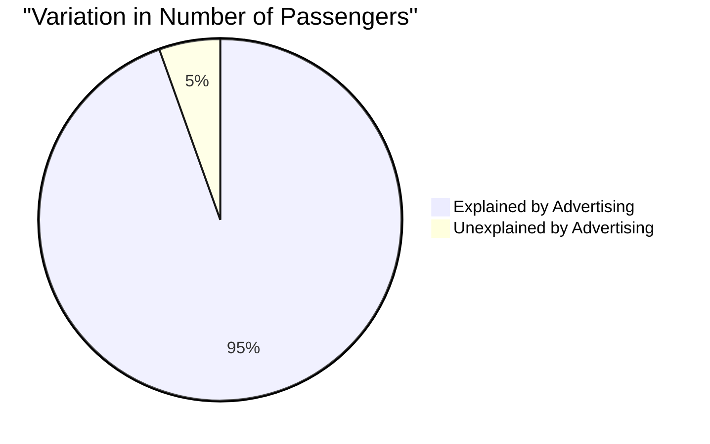

# Definition
Before proceeding, ensure you master [[Simple_Linear_Regression]] and Variation because the coefficient of determination quantifies the proportion of variation in the dependent variable that is explained by the regression model.
The **coefficient of determination**, denoted as $R^2$ (or sometimes $r^2$ for simple linear regression), is the portion of the total variation in the dependent variable that is explained by the variation in the independent variable(s) of a regression model. It is a measure of how well the regression line fits the observed data, with values always between 0 and 1 inclusive ($0 \le R^2 \le 1$). A higher $R^2$ indicates a better fit of the model to the data. A simpler way to think about it is "how much of the mystery about Y can X explain?"

# The Mental Model
Imagine you're trying to figure out why some students score higher on a test than others. You might consider how many hours they studied. If "hours studied" explains 70% of the differences in test scores, then your $R^2$ is 0.70. The remaining 30% is still a mystery (maybe it's natural ability, sleep, etc.). So, $R^2$ tells you how much of the "score mystery" your "study hours" explanation solves.

# Context & Framework
### The Problem: Quantifying the "Goodness of Fit"
After fitting a regression line to data, an essential question arises: how well does this line actually represent the data points? Visually inspecting a scatter plot can give a qualitative sense, but a precise, quantitative measure of the "goodness of fit" is needed for objective evaluation and comparison of models. The coefficient of determination ($R^2$) emerged as this crucial metric. It transformed the subjective assessment of how closely data points cluster around a regression line into an objective proportion: the percentage of the dependent variable's variance that the independent variable(s) can account for. This allows researchers to confidently state the explanatory power of their models and assess their practical utility.

# The Mastery Deep Dive
### Step-by-Step Derivation
The coefficient of determination ($R^2$) is calculated from the sums of squares related to the regression model. It can be understood as the ratio of explained variation to total variation.

**Key Components:**
1.  **Total Sum of Squares (SST):** Measures the total variation in the dependent variable ($Y$) around its mean ($\bar{Y}$).
    $$ \boxed{\displaystyle SST = \sum (Y_i - \bar{Y})^2} \quad \text{(Total Variation)} $$
2.  **Regression Sum of Squares (SSR):** Measures the variation in $Y$ that is explained by the regression model (i.e., by the relationship with $X$). This is the variation between the predicted values ($\hat{Y}$) and the mean of $Y$.
    $$ \boxed{\displaystyle SSR = \sum (\hat{Y}_i - \bar{Y})^2} \quad \text{(Explained Variation)} $$
3.  **Error Sum of Squares (SSE):** Measures the variation in $Y$ that is *not* explained by the regression model. This is the residual variation between the observed values ($Y$) and the predicted values ($\hat{Y}$).
    $$ \boxed{\displaystyle SSE = \sum (Y_i - \hat{Y}_i)^2} \quad \text{(Unexplained Variation)}$$

**Relationship:** The total variation is the sum of the explained and unexplained variation:
$$ \boxed{\displaystyle SST = SSR + SSE} \quad \text{(Decomposition of Variation)} $$

**Formula for $R^2$:**
The coefficient of determination is defined as the proportion of the total variation in the dependent variable ($Y$) that is explained by the regression model:
$$ \boxed{\displaystyle R^2 = \frac{SSR}{SST} = 1 - \frac{SSE}{SST}} \quad \text{(Formula for R-squared)}$$

For **simple linear regression** only, $R^2$ is simply the square of the Karl Pearson correlation coefficient ($r$):
$$ \boxed{\displaystyle R^2 = r^2} \quad \text{(R-squared for Simple Linear Regression)}$$
This is why it's also sometimes denoted as $r^2$.

**Worked Example Calculation:**
Let's use the advertising expense (X) and products sold (Y) example from previous notes.
From `Simple_Linear_Regression` calculations, we found the Karl Pearson correlation coefficient $r \approx 0.9723$.

Using the relationship $R^2 = r^2$:
$$ \displaystyle R^2 = (0.9723)^2 \quad \text{(Square the correlation coefficient)} $$
$$ \boxed{\displaystyle R^2 \approx 0.9453} \quad \text{(Calculate R-squared)}$$

**Interpretation:**
An $R^2$ of approximately 0.9453 (or 94.53%) means that approximately 94.53% of the total variation in products sold (Y) can be explained by the variation in advertising expense (X). This indicates a very strong fit of the regression model to the data, suggesting that advertising expense is an excellent predictor of product sales.

# Constraints & Limitations
### The "Oops!" List: Misinterpreting High R-squared
A high $R^2$ (or $r^2$) value is often seen as the ultimate goal, but it can be a significant "trap" if misinterpreted. The core pitfalls are:
1.  **Causation vs. Correlation:** A high $R^2$ only indicates that the independent variable(s) explain a large proportion of the variance in the dependent variable; it does **not** imply a causal relationship. Spurious correlations can yield high $R^2$ values.
2.  **Model Validity:** A high $R^2$ does not guarantee that the regression model is appropriate or valid. For instance, if linearity assumptions are violated, a high $R^2$ might still indicate a strong association but a poor model of the underlying mechanism.
3.  **Overfitting:** Especially with multiple regression, adding more independent variables will always increase $R^2$, even if the new variables are irrelevant. This can lead to overfitting, where the model performs well on training data but poorly on new data.
Therefore, a high $R^2$ should be interpreted cautiously and in conjunction with other diagnostic measures, domain knowledge, and a check of model assumptions. It's a measure of explanatory power, not necessarily proof of causation or perfect predictive ability.

# Significance & Application
The coefficient of determination ($R^2$) is a crucial metric for evaluating the utility and "goodness of fit" of a regression model. It provides a clear, standardized percentage that quantifies the explanatory power of the independent variables. In **market research**, an $R^2$ of 0.80 for a model predicting consumer spending based on income suggests that 80% of the variability in spending can be attributed to income. In **quality control**, an $R^2$ between manufacturing process settings and product defect rates indicates how well the settings control defects. This measure allows researchers and practitioners to assess the strength of their models, compare alternative explanations for phenomena, and communicate the practical significance of their findings in a universally understood way.

# The Worked Example
Let's refer to the example from the lecture slides that calculates the coefficient of determination. We are given the correlation coefficient ($r$) for advertising expense and number of passengers.

From lecture slide 63/76, the coefficient of correlation is $r = 0.9723$.

**Step 1: Calculate the coefficient of determination ($r^2$).**
Since this is simple linear regression, $r^2$ is simply the square of the correlation coefficient:
$$ \boxed{\displaystyle r^2 = (0.9723)^2} \quad \text{(Square the correlation coefficient)} $$
$$ \boxed{\displaystyle r^2 \approx 0.94537229} \quad \text{(Calculate the squared value)} $$

**Step 2: Express $r^2$ as a percentage.**
$$ \displaystyle r^2 \times 100\% \approx 0.94537229 \times 100\% \approx 94.54\% \quad \text{(Convert to percentage)} $$

**Step 3: Interpret the result.**
This figure indicates that there is a very strong correlation between advertising expense and the number of passengers. More specifically, approximately **94.54% of the total variation in the number of passengers can be explained by the variation in advertising expense**. The remaining approximately 5.46% of the variation in passenger numbers is attributed to other factors not included in this model (unexplained variation).


```text
// Scenario 1: High R-squared interpretation
// Input: R-squared = 0.9454 (94.54%)
// Output: 94.54% of the variability in passenger numbers is accounted for by advertising expense. This implies a very strong relationship and high predictive power.
//
// Scenario 2: Low R-squared interpretation (Hypothetical)
// Input: R-squared = 0.10 (10%)
// Output: Only 10% of the variability in passenger numbers is accounted for by advertising expense. This indicates a weak relationship and low predictive power, suggesting many other factors are at play.
```
*Note: This `pie` chart visually represents the proportion of explained versus unexplained variation, providing a clear intuitive understanding of the $R^2$ value.*

# The Proving Ground
*Test your mastery. Cover the solutions below to test yourself first.*

### Level 1: The Sanity Check (Verification)
**The Variable ID:** What is the possible range of values for the coefficient of determination ($R^2$)?
> **Solution:** The possible range of values for the coefficient of determination ($R^2$) is between 0 and 1 inclusive ($0 \le R^2 \le 1$).

### Level 2: The Crucible (Mastery & Edge Cases)
**The Impossible Case:** A social scientist builds a simple linear regression model to predict an individual's happiness score (Y) based on their daily screen time (X). The model yields an $R^2$ of 0.88. The scientist enthusiastically concludes that reducing screen time *will directly cause* a significant increase in happiness. Explain how this conclusion falls into the "Misinterpreting High R-squared" trap (as discussed in `# Constraints & Limitations`). What critical distinction is the scientist missing, and what alternative factors might actually be influencing both screen time and happiness?
> **Solution:** This conclusion falls directly into the "Misinterpreting High R-squared" trap, specifically conflating correlation with causation. The "impossible case" is the leap from a strong statistical association ($R^2 = 0.88$) to a direct causal claim. The scientist is missing the critical distinction that **correlation does not imply causation**. While there's a strong statistical relationship, it doesn't mean that screen time *causes* happiness. There could be numerous **alternative factors** or **confounding variables** influencing both screen time and happiness, such as:
> 1.  **Mental health:** Individuals experiencing depression or anxiety might spend more time on screens (X) and simultaneously report lower happiness (Y). Here, mental health is a confounding variable, not screen time itself.
> 2.  **Social isolation:** Lack of social interaction might lead to both increased screen time and decreased happiness.
> 3.  **Job satisfaction/stress:** A stressful job could increase screen time (for escapism or work-related reasons) and reduce happiness.
> A high $R^2$ simply means screen time is a good *predictor* of happiness within this dataset, but it doesn't confirm it as the *cause*. To infer causation, a controlled experiment (randomized controlled trial) would be needed, or advanced causal inference techniques that go beyond simple regression.

# Key Takeaways
*   The coefficient of determination ($R^2$) measures the proportion of variance in the dependent variable explained by the model.
*   It ranges from 0 to 1, with higher values indicating a better fit.
*   A high $R^2$ does not imply causation and must be interpreted carefully with regard to model validity and potential overfitting.

# Knowledge Graph Connections
| Concept                     | Connection / Relationship                                          |
| :
-------------------------- | :
----------------------------------------------------------------- |
| [[Simple_Linear_Regression]]| $R^2$ is a key metric for evaluating the goodness of fit of a simple linear regression model. |
| Correlation_Coefficient | For simple linear regression, $R^2$ is the square of the Karl Pearson correlation coefficient. |
| [[Explained_and_Unexplained_Variation]]| $R^2$ is the ratio of explained variation to total variation. |
| Prediction              | A higher $R^2$ generally indicates better predictive power of the model. |
| Goodness_Of_Fit         | $R^2$ is a direct measure of the goodness of fit of a regression model to the observed data. |
---