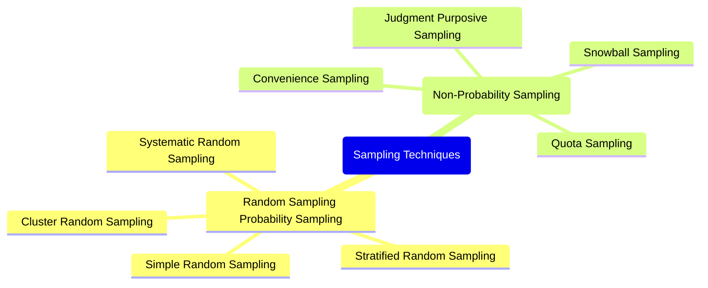

# 1 Introduction To Statistics And Probability

Comprehensive resource for 1 Introduction To Statistics And Probability.

---

## 1 Introduction To Statistics And Probability Hub

## Overview
This unit serves as a foundational introduction to the principles and applications of Statistics_And_Probability. It demystifies the field by exploring its necessity in daily life and academic pursuits, while also delineating its core concepts and methodologies. You will learn how Statistics provides the tools to collect, organize, analyze, and interpret data, empowering informed decision-making and predictions across diverse domains. The overarching goal is to equip you with a robust conceptual framework for understanding how quantitative information shapes our comprehension of the world and for navigating its inherent complexities.

## Learning Objectives
*   Define Statistics and explain its fundamental purpose and applications.
*   Articulate the reasons why the study of Statistics is essential in various professional and personal contexts.
*   Distinguish between [[Population_and_Sample]] in statistical inquiry and differentiate [[Parameter_and_Statistic]] appropriately.
*   Outline and describe the [[Steps_of_Statistical_Investigation]] from problem definition to data interpretation.
*   Compare and contrast [[Descriptive_and_Inferential_Statistics]], identifying their distinct objectives and methodologies.
*   Recognize the [[Importance_of_Statistics]] in facilitating data summary, comparison, policy formulation, and future forecasting.
*   Identify and understand the inherent [[Limitations_of_Statistics]], including its inability to deal with individual values, qualitative characteristics, and potential for misuse.

## Unit Applications & Real-World Relevance
Statistics is not merely an academic discipline; it is an indispensable tool woven into the fabric of modern society. From understanding public opinion through Sampling_Methods to predicting economic trends using Inferential_Statistics, its applications are vast. In healthcare, it informs treatment efficacy and disease prevalence. In engineering, it optimizes processes and ensures quality control. For programmers, it's crucial in data analysis, algorithm performance evaluation, and machine learning model validation. Even daily news reports, from crime rates to average incomes, are underpinned by statistical analysis, making a basic understanding of this unit fundamental for any informed citizen and professional.

## Active Learning Prompts
*   Consider a recent news article that uses Statistical_Data. How would you verify the credibility of the data presented and the conclusions drawn?
*   Think of a real-world problem you would like to solve. How could the [[Steps_of_Statistical_Investigation]] be applied to address this problem systematically?
*   Imagine you are explaining the difference between a [[Population_and_Sample]] to someone with no statistical background. What analogy would you use to make it intuitive?
*   Reflect on a situation where Misleading_Statistics could be used for unethical purposes. How would you identify and counteract such manipulation?

## Unit Challenges & Common Misconceptions
A common challenge in statistics is moving beyond rote memorization to truly understanding the underlying logic and implications. Students often struggle with the precise distinctions between [[Population_and_Sample]] or [[Parameter_and_Statistic]], which are foundational. Another pitfall lies in misinterpreting statistical findings, either by over-generalizing from a Sample or by failing to account for the [[Limitations_of_Statistics]]. The potential for Misleading_Statistics, whether intentional or accidental, also presents a significant hurdle, requiring critical thinking and a careful examination of methodology. It is crucial to remember that statistics provides insights, not absolute truths, and its power lies in its proper application and interpretation.

## Connections
  - [[What_is_Statistics]]
    - [[Steps_of_Statistical_Investigation]]
    - [[Population_and_Sample]]
      - [[Parameter_and_Statistic]]
  - [[Why_Study_Statistics]]
    - [[Importance_of_Statistics]]
    - [[Limitations_of_Statistics]]
  - [[Descriptive_and_Inferential_Statistics]]

## Next Steps for Deeper Understanding
To further solidify your understanding of these introductory concepts, consider exploring the history of Statistics_And_Probability and the individuals who shaped its development. Investigate different [[Sampling_Techniques]] and their implications for Inferential_Statistics. Delve into ethical considerations in data collection and presentation, paying particular attention to how biases can be introduced. Finally, familiarize yourself with common statistical software tools, as practical application is key to true mastery.

## Possible Questions
[[CC2135_1_Introduction_to_Statistics_and_Probability_Possible_Questions]]

---

---

## Descriptive And Inferential Statistics

## Definition
Before proceeding, ensure you master [[What_is_Statistics]] and [[Population_and_Sample]].
Statistics is broadly divided into two main phases: Descriptive_Statistics and Inferential_Statistics.
Descriptive_Statistics is the phase that focuses solely on summarizing, organizing, and presenting data in a meaningful way, typically from a Sample or a complete Population, without drawing any conclusions or generalizations *beyond* the observed data. It aims to describe the main features of a dataset.
Inferential_Statistics, on the other hand, deals with drawing important conclusions, making generalizations, or predicting about a larger Population based on the analysis of data collected from a Sample. It involves making educated guesses about the unknown.

## The Mental Model
Imagine you have a basket of apples. Descriptive_Statistics is like describing *just* the apples in *your* basket: "There are 10 red apples, 5 green, and their average weight is 150 grams." You're only talking about what you see.
Inferential_Statistics is like looking at your basket of apples and then making a statement about *all* the apples in the orchard: "Based on my basket, I predict that about two-thirds of all apples in this orchard are red." You're using your small observation to make a broader statement, with a degree of uncertainty.

## Context & Framework
#### Spot the Impostor (Don't be Fooled)
A classic impostor scenario occurs when a researcher presents descriptive findings (e.g., "45% of first marriages in our *survey* ended in divorce") and then implicitly or explicitly suggests this *guarantees* the same rate for the entire country without using inferential methods or acknowledging uncertainty. The leap from sample observation to population certainty without proper statistical inference is a fallacy. Descriptive statements are factual for the data observed; inferential statements are predictions about a larger group, always with a margin of error.

## The Mastery Deep Dive
#### The "Wikipedia One-Liner"
The distinction between Descriptive_Statistics and Inferential_Statistics defines the two primary goals of statistical analysis. Descriptive statistics provide a clear, concise summary of data, using measures like means, medians, modes, and visualizations to make the raw data comprehensible. This phase is crucial for initial data exploration. Inferential statistics builds upon this by utilizing probability theory to extrapolate findings from a sample to a population, testing hypotheses, and making predictions. This involves techniques such as confidence intervals and hypothesis testing, which quantify the reliability of generalizations, acknowledging that a sample is only an imperfect reflection of its population.

#### The Flow of Statistical Inquiry
A typical statistical inquiry begins with Descriptive_Statistics. Before making any complex inferences, data must be understood. This initial phase involves calculating summary measures and creating graphical representations (e.g., histograms, bar charts) to identify patterns, outliers, and basic distributions. Once the data's characteristics are well-understood, the inquiry can then move to Inferential_Statistics, where the insights gained from the sample are used to draw broader conclusions about the population. This sequential flow ensures that inferences are grounded in a solid understanding of the observed data.

## Constraints & Limitations
#### The "Confidence Gap" Protocol
If a study makes sweeping claims about a Population's characteristics (e.g., "The unemployment rate in the country will rise by 2% next year") but only presents data summarizing past observations from a Sample (e.g., "Unemployment in our survey group rose by 1.8% last year"), a "Confidence Gap" should be flagged. The leap from a descriptive observation of a sample to an inferential prediction for a population without the appropriate statistical tools (e.g., regression analysis, forecasting models) is a critical methodological flaw.

## Significance & Application
Descriptive_Statistics provides the initial insights necessary to understand any dataset, forming the basis for further analysis. Inferential_Statistics allows researchers to make broader statements, test theories, and inform policy decisions based on limited data, which is essential when studying large populations. Both are indispensable for turning raw data into actionable knowledge across academic research, business intelligence, and public policy.

## The Worked Example
**Scenario:** A company wants to assess the job satisfaction of its 500 employees. They conduct a survey with a randomly selected group of 100 employees.

**Application of Descriptive and Inferential Statistics:**
1.  **Data Collection:** The company collects survey responses from the 100 employees.
2.  **Descriptive_Statistics Application:**
    *   They calculate the average job satisfaction score for the 100 surveyed employees.
    *   They create a bar chart showing the distribution of satisfaction levels (e.g., very satisfied, satisfied, neutral, dissatisfied) among the 100 employees.
    *   They report that "60% of the surveyed employees are satisfied with their job." (This statement *only* describes the 100 employees.)
3.  **Inferential_Statistics Application:**
    *   Using the data from the 100 employees, the company then estimates that "between 50% and 70% of *all 500 employees* are satisfied with their job, with a 95% confidence level." (This is a generalization about the entire workforce, with an acknowledged margin of error.)
    *   They might also perform a hypothesis test to determine if the average satisfaction score of their employees is significantly different from a national average, thereby inferring something about their workforce's relative satisfaction compared to others.

## The Proving Ground
*Test your mastery. Cover the solutions below to test yourself first.*

#### Level 1: Understanding (The Basics)
1.  **The Fact Check:** Briefly define Descriptive_Statistics and Inferential_Statistics, highlighting their primary objectives.
> **Solution:** Descriptive_Statistics involves organizing, summarizing, and presenting data to describe its main features without generalizing beyond the observed data. Inferential_Statistics involves using sample data to draw conclusions, make predictions, or generalize about a larger population.

#### Level 2: Competence (Application)
2.  **The Kill Sheet Comparison:** Present a scenario where a researcher collects data on student test scores. Describe how both Descriptive_Statistics and Inferential_Statistics could be applied to analyze this data.
> **Solution:** **Scenario:** A university professor collects test scores from a class of 50 students.
    *   **Descriptive_Statistics Application:** The professor calculates the average (mean) score for the 50 students, finds the highest and lowest scores, and creates a histogram to show the distribution of grades. These actions describe *only* that specific class's performance.
    *   **Inferential_Statistics Application:** The professor might then use the average score of these 50 students to estimate the average test score for *all* students taking this course across the university, or perhaps hypothesize that a new teaching method (used in this class) improves scores compared to previous years. This involves generalizing beyond the 50 students, with a degree of uncertainty.

#### Level 3: Mastery (The Impostor)
3.  **The Impostor:** A newspaper headline reads, "Local school's average test score is 75, indicating that students nationwide are performing below expectations." Identify which part of this statement uses descriptive statistics and which part makes an inferential claim. Explain why the inferential claim, based solely on this information, might be an impostor of sound statistical reasoning.
> **Solution:**
    *   **Descriptive Statistics:** "Local school's average test score is 75." This statement simply describes the observed data for a specific group (the local school).
    *   **Inferential Claim:** "indicating that students nationwide are performing below expectations." This part attempts to generalize from the local school's performance to *all* students nationwide.
    *   **Impostor Reasoning:** The inferential claim is an impostor because it makes a broad generalization about a national Population based solely on the performance of a single local school (a very small and potentially unrepresentative Sample). Sound statistical reasoning requires a robust sampling method for the nationwide population and appropriate Inferential_Statistics (e.g., hypothesis testing against a national benchmark, with a margin of error) to make such a claim. Without this, the inference is unjustified and potentially misleading.

## Key Takeaways
*   Descriptive_Statistics summarizes and presents observed data without making broader conclusions.
*   Inferential_Statistics uses sample data to draw conclusions, predictions, and generalizations about a larger population.
*   Both phases are critical in Statistical_Analysis, with descriptive preceding and informing inferential methods.

## Knowledge Graph Connections
| Concept                     | Connection / Relationship                                                                                                         |
| :
-------------------------- | :
-------------------------------------------------------------------------------------------------------------------------------- |
| [[What_is_Statistics]]      | These two phases constitute the core methodologies within the scientific discipline of statistics.                                  |
| [[Population_and_Sample]]   | The distinction between population and sample is fundamental to deciding whether descriptive or inferential methods are appropriate. |
| [[Parameter_and_Statistic]] | Descriptive statistics often involve calculating statistics, while inferential statistics use statistics to estimate parameters.      |
---

---

## Sampling Techniques

## Definition
Before proceeding, ensure you master [[Sample_and_Sampling_Error]] and Statistical_Bias.
**Sampling techniques** are the specific methods used to select a subset (a [[Sample_and_Sampling_Error]]) from a larger population. The goal of these techniques is to ensure that the chosen sample is as representative as possible of the original population, thereby minimizing Sampling_Error and allowing for valid inferences about the population. These techniques are broadly categorized into [[Random_Sampling_Techniques]] (or probability sampling), where every element has a known, non-zero chance of being selected, and [[Non_Random_Sampling_Techniques]] (non-probability sampling), where selection is based on the researcher's judgment or convenience. The choice of technique is critical, as it directly impacts the generalizability and reliability of the research findings.

## The Mental Model
Imagine you need to select a few representatives from a large school assembly.
*   **Sampling Techniques:** This is the "how-to" manual for picking those representatives.
*   **Goal:** You want the chosen few to accurately speak for everyone in the assembly.
*   **Poor Technique:** Picking only your friends (biased).
*   **Good Technique:** Drawing names randomly from a hat (unbiased, but still a "sample" so not perfect).
The "technique" is the systematic process you follow to ensure your selected group is a fair reflection of the whole.

*Note: This `mindmap` illustrates the two main categories of sampling techniques and their respective sub-methods, providing a hierarchical overview of the different approaches to selecting a sample.*

## Context & Framework
#### The Bridge Between Sample and Population
Sampling techniques serve as the crucial bridge between the observed data from a sample and the inferences made about a larger population. They provide the systematic procedures necessary to draw a [[Sample_and_Sampling_Error]] that is statistically sound and representative. For example, a medical researcher studying the effects of a new drug needs to select a sample of patients from the entire patient population with the condition. The choice of a specific sampling technique (e.g., [[Stratified_Random_Sampling]] to ensure age and gender representation) within the broader framework of Experimental_Design will directly determine the validity and ethical implications of the study's conclusions. Without robust sampling techniques, the leap from sample findings to population-wide generalizations would be unfounded.

## The Mastery Deep Dive
#### Opening the Hood: What's Inside?
Sampling techniques are essentially the blueprints for how to select a [[Sample_and_Sampling_Error]] from a larger [[Population_and_Census]]. They are broadly divided into two main categories:
1.  **Random Sampling (Probability Sampling)**: Here, every element in the population has a known, non-zero chance of being selected. This is the cornerstone of statistical inference because it allows for the calculation of Sampling_Error and the generalization of results to the population. Types include [[Simple_Random_Sampling]], [[Systematic_Random_Sampling]], [[Stratified_Random_Sampling]], and [[Cluster_Random_Sampling]].
2.  **Non-Random Sampling (Non-Probability Sampling)**: In this approach, elements are selected based on the researcher's subjective judgment, convenience, or other non-random criteria. While often easier and cheaper, these methods do not allow for the calculation of sampling error and typically limit the generalizability of findings. Types include [[Convenience_Sampling]], [[Judgmental_or_Purposive_Sampling]], [[Quota_Sampling]], and [[Snowball_Sampling]].

The core distinction lies in the ability to apply probability theory to random samples, which is not possible with non-random samples.

#### Who are the Neighbors?
Sampling techniques are closely related to several other key statistical concepts. They are the practical application of how to draw a [[Sample_and_Sampling_Error]] from a [[Population_and_Census]]. The choice of a particular technique directly impacts the likelihood and types of [[Categories_of_Sampling_Errors]] that might occur. Furthermore, the effectiveness of a sampling technique determines the extent to which Inferential_Statistics can be reliably used to make statements about the population. Without appropriate sampling, the data collected through [[Collection_of_Data]] may be biased, rendering subsequent analysis unreliable. Thus, sampling techniques act as the methodological link between defining a study's scope and drawing credible conclusions.

## Constraints & Limitations
#### The Engineering Trade-off
Choosing a sampling technique involves a crucial engineering trade-off between **statistical rigor** (generalizability, control over sampling error) and **practical feasibility** (cost, time, accessibility). [[Random_Sampling_Techniques]] offer higher statistical rigor, allowing for unbiased estimates and quantifiable error. However, they can be more complex and expensive to implement, requiring a complete list of the population (sampling frame) which may not always exist. [[Non_Random_Sampling_Techniques]], on the other hand, are often cheaper, faster, and more convenient, especially when a complete sampling frame is unavailable or when exploratory research is needed. The trade-off is that they introduce the risk of significant bias, and their results cannot be reliably generalized to the larger population. Researchers must carefully weigh the scientific demands of their study against the real-world constraints to select the most appropriate and defensible technique.

## Significance & Application
Sampling techniques are indispensable in virtually all fields that rely on data for decision-making. Academically, they are central to Survey_Methodology, Experimental_Design, and Quantitative_Research. In the real world, these techniques are applied in:
*   **Market Research:** To gauge consumer preferences for new products without surveying every potential customer.
*   **Public Opinion Polling:** To predict election outcomes or measure public sentiment on policy issues.
*   **Quality Control:** To inspect a subset of products from a large production run to ensure quality standards.
*   **Medical Research:** To select patient groups for clinical trials to test the efficacy of new treatments.
*   **Environmental Studies:** To assess pollution levels by sampling water or air at various locations.
Effective application of sampling techniques ensures that resources are used efficiently while yielding representative data.

## The Worked Example
*Test your mastery. Cover the solutions below to test yourself first.*

### The Pilot's Checklist (Do Not Skip)
Imagine a company wants to survey its 5,000 employees to understand job satisfaction levels.

1.  **Define the Population:** Clearly identify the entire group of interest.
    *   *Example:* "All 5,000 employees currently working for the company."
2.  **Identify if a Census is Feasible:** Can data be collected from all 5,000 employees?
    *   *Example:* "While technically feasible, a full census might lead to lower response rates and take longer, making a sample survey more practical for quick insights."
3.  **Consider Random Sampling Techniques:** If a sample is desired, name two suitable random sampling techniques.
    *   *Example:* "[[Simple_Random_Sampling]] (randomly pick names from the employee list) or [[Stratified_Random_Sampling]] (divide by department and pick randomly from each) would be suitable."
4.  **Consider Non-Random Sampling Techniques:** If resources are extremely limited or exploratory insights are needed, name one non-random technique.
    *   *Example:* "[[Convenience_Sampling]] (surveying employees in the cafeteria) or [[Judgmental_or_Purposive_Sampling]] (selecting key department heads for interviews) could be used for initial insights, but with acknowledged limitations."
5.  **Identify the Goal of the Chosen Technique:** What is the primary objective of using a specific technique?
    *   *Example:* "The primary objective is to select a representative sample of employees so that the findings on job satisfaction can be generalized to the entire 5,000-employee population with a measurable level of confidence."

## The Proving Ground
*Test your mastery. Cover the solutions below to test yourself first.*

#### Level 1: The Sanity Check (Verification)
**The Question:** What is the main purpose of using sampling techniques in a research study?
> **Solution:** The main purpose of using sampling techniques is to select a subset (sample) from a larger population that is as representative as possible of the original population, thereby minimizing sampling error and allowing for valid inferences about the population.

#### Level 2: The Crucible (Mastery & Edge Cases)
**The Scenario:** A research team wants to study the impact of social media usage on academic performance among high school students in a large school district. They have access to a list of all 10,000 students in the district. They are debating between using a technique that ensures every student has an equal chance of being selected versus one where they simply survey students in common areas during lunch breaks.
**The Challenge:**
(a) Identify the two broad categories of sampling techniques being debated.
(b) Explain why using the technique where "every student has an equal chance of being selected" is generally preferred for this study if the goal is to make generalizable statements about the entire district.
(c) What specific type of "error" is more likely to be introduced by surveying students in common areas during lunch breaks, and why?
> **Solution:**
(a) The two broad categories of sampling techniques being debated are **Random Sampling (Probability Sampling)** (where every student has an equal chance) and **Non-Random Sampling (Non-Probability Sampling)** (surveying students in common areas).
(b) The technique where "every student has an equal chance of being selected" (Random Sampling) is generally preferred because it introduces less **bias** and allows for the calculation of Sampling_Error. This means the results from the sample can be more reliably generalized to the entire district, and the level of uncertainty in those generalizations can be statistically quantified. This is crucial for making valid inferences about the impact of social media on *all* high school students in the district.
(c) Surveying students in common areas during lunch breaks is likely to introduce **Selection Error**, a category of sampling error. This occurs because students present in common areas during lunch might not be representative of the entire student body (e.g., students who bring lunch, students with specific friend groups, or those with certain class schedules). They are essentially "self-selecting" their participation by their presence, leading to a biased sample that does not accurately reflect the diversity of the student population or their social media usage habits.

## Key Takeaways
*   Sampling techniques are methods for selecting a representative subset from a population.
*   They are categorized into random (probability) and non-random (non-probability) sampling.
*   Random sampling allows for generalizable conclusions and measurable sampling error, while non-random sampling is often more practical but prone to bias.

## Knowledge Graph Connections
| Concept                            | Connection / Relationship                                                                 |
| :
---------------------------------- | :
---------------------------------------------------------------------------------------- |
| [[Sample_and_Sampling_Error]]       | These techniques are used to obtain a sample and manage its associated error.             |
| Statistical_Bias                | Proper sampling techniques are crucial for minimizing statistical bias in research.       |
| [[Random_Sampling_Techniques]]      | This is one of the two main categories of sampling techniques.                            |
| [[Non_Random_Sampling_Techniques]]  | This is the other main category, contrasting with random sampling.                       |
| Research_Methodology_Design     | The choice of sampling technique is a fundamental component of research methodology design. |
---

---

## What Is Statistics

## Definition
Before proceeding, ensure you master [[Why_Study_Statistics]].
Statistics is the branch of mathematics that deals with the scientific methods of collecting, organizing, and analyzing data so as to make valid conclusions, reasonable decisions, and future predictions on the basis of such analysis. It is essentially the science of learning from data. The raw materials for any statistical analysis are data, which are the numerical information from which we make analysis and interpretation. Think of it as a methodical detective work: you gather clues (data), arrange them, examine them, and then, with solid evidence, draw conclusions and forecast future events.

## The Mental Model
Imagine you're trying to figure out the most popular ice cream flavor in your town. You can't ask everyone, so you ask a smaller group (your sample). Statistics provides the tools to make sure that smaller group truly represents the whole town, and then tells you how confident you can be in saying "Vanilla is probably the most popular!" This field helps us move from specific observations to broader, reliable insights.

## Context & Framework
#### Spot the Impostor (Don't be Fooled)
A common misconception is equating "statistics" (the discipline) with "statistics" (numerical facts like crime rates or average incomes). The discipline of Statistics is far more than just a collection of numbers; it's a rigorous scientific methodology for *generating* and *interpreting* those numbers responsibly. Numerical facts, without proper context and methodology, can be misleading or lack generalizability. The discipline ensures that conclusions drawn from data are sound and defensible, preventing the casual misinterpretation of raw figures.

## The Mastery Deep Dive
#### The "Wikipedia One-Liner"
The formal definition of Statistics encompasses its entire lifecycle: from the careful collection of raw data to its systematic organization, rigorous analysis, and finally, the formulation of valid conclusions, reasonable decisions, and accurate predictions. This scientific method guards against bias and ensures the reliability of findings. Without these structured steps, data remains mere noise, incapable of yielding meaningful insights.

#### Core Elements of the Discipline
The scientific method embedded within Statistics ensures a structured approach to understanding phenomena. This involves not only crunching numbers but also critically evaluating the source of data, the methods used to collect it, and the potential for confounding factors. This holistic perspective is what elevates statistics beyond simple arithmetic into a powerful tool for empirical research and knowledge discovery across virtually all fields, from medicine to sports management. It’s the framework that allows us to interpret the "language in which we read the universe."

## Constraints & Limitations
#### The "Confidence Gap" Protocol
If you encounter a scenario where the data presented as "statistics" is merely a list of numbers without any information on its collection or analysis methods, you should invoke the "Confidence Gap" Protocol. These are just raw facts; they do not constitute the scientific discipline of statistics. Without methodological transparency, the reliability of any conclusions drawn from them is questionable.

## Significance & Application
Statistics is crucial for making sense of the vast amounts of data generated daily. It allows for evidence-based decision-making in government, business, and science. From informing public health policies to predicting market trends, its applications are ubiquitous, enabling societies to navigate complexity with greater certainty.

## The Worked Example
**Scenario:** A local government is trying to understand public opinion on a new waste management initiative. They conduct a poll of 500 residents.

**Application of "What is Statistics":**
1.  **Collection:** The government employs a structured survey method to gather opinions from residents, ensuring a representative Sample.
2.  **Organization:** The survey responses are then categorized, perhaps by age group, location, and opinion (for/against/neutral).
3.  **Analysis:** Statistical techniques are applied to calculate the percentage of residents supporting the initiative, the margin of error for the poll, and any correlations between opinion and demographic factors.
4.  **Conclusion & Decision:** Based on this analysis, the government concludes that 60% of residents support the initiative with a 3% margin of error, and decides whether to proceed with the plan, perhaps refining it based on demographic insights. This entire process, from survey design to decision, embodies the scientific methodology of statistics.

## The Proving Ground
*Test your mastery. Cover the solutions below to test yourself first.*

#### Level 1: Understanding (The Basics)
1.  **The Fact Check:** Define Statistics in your own words, emphasizing its core components and scientific nature.
> **Solution:** Statistics is the scientific discipline that involves the collection, organization, analysis, interpretation, and presentation of data to draw conclusions, make decisions, and predict future outcomes. It provides a methodical framework for understanding numerical information.

#### Level 2: Competence (Application)
2.  **The Kill Sheet Comparison:** Create a comparison table highlighting the key differences between Statistics as a field of study and "statistics" as numerical facts.
> **Solution:**
| Feature          | "Statistics" (Numerical Facts)                                | Statistics (Field of Study)                                     |
| :
--------------- | :
------------------------------------------------------------ | :
------------------------------------------------------------------ |
| **Nature**       | Raw, quantitative data (e.g., "5 crimes per day").          | Scientific methodology for handling and interpreting data.          |
| **Purpose**      | To report specific observed values.                           | To derive meaningful insights, make predictions, and inform decisions. |
| **Methodology**  | None explicitly stated for the numbers themselves.            | Rigorous process: collection, organization, analysis, interpretation. |
| **Reliability**  | Can be misleading if context/source is unknown.               | Aims for objectivity, generalizability, and verifiable conclusions. |

#### Level 3: Mastery (The Impostor)
3.  **The Impostor:** You are presented with three definitions. Identify the one that does *not* accurately represent the scientific discipline of statistics and explain why it is misleading:
    (a) "Statistics is the collection and display of numerical data."
    (b) "Statistics is the branch of mathematics that deals with the scientific methods of collecting, organizing, and analyzing data to make valid conclusions, reasonable decisions, and future predictions."
    (c) "Statistics is the art of manipulating numbers to prove a point."
> **Solution:** Definition (c) "Statistics is the art of manipulating numbers to prove a point" is the impostor. While numbers *can* be manipulated, this definition describes the *misuse* or *abuse* of statistics, not its fundamental scientific purpose. The true discipline of Statistics (as in definition b) aims for objectivity and validity, adhering to scientific methods to ensure conclusions are sound, not predetermined.

## Key Takeaways
*   Statistics is a scientific discipline for processing data to make valid conclusions and predictions, not just a collection of numbers.
*   Its methodology involves systematic collection, organization, analysis, and interpretation of data.
*   Understanding Statistics enables evidence-based decision-making across various fields, from scientific research to daily life.

## Knowledge Graph Connections
| Concept                     | Connection / Relationship                                                                                                         |
| :
-------------------------- | :
-------------------------------------------------------------------------------------------------------------------------------- |
| [[Why_Study_Statistics]]    | Understanding the definition of statistics provides the foundation for appreciating its importance and wide range of applications.  |
| [[Steps_of_Statistical_Investigation]] | The definition of statistics directly outlines the systematic steps involved in any statistical inquiry.                          |
| [[Population_and_Sample]]   | Statistics relies on collecting data from populations or samples, which are fundamental to its analytical processes.                |
| [[Descriptive_and_Inferential_Statistics]] | The core objectives of statistics are further categorized into descriptive and inferential methodologies.                        |
---

---

## Why Study Statistics

## Definition
Before proceeding, ensure you master [[What_is_Statistics]].
Studying Statistics is essential because it equips individuals with the ability to navigate a data-rich world, enabling them to make informed decisions, critically evaluate information, and contribute to knowledge discovery. It provides a universal language for understanding phenomena, from analyzing crime rates and birth rates to evaluating average incomes and rainfall patterns, as frequently encountered in daily news. This knowledge helps in applying proper techniques to collect data, perform precise calculations, and effectively present conclusions, underpinning scientific discoveries and data-driven forecasts.

## The Mental Model
Imagine you're trying to buy a new car. You wouldn't just pick the first one you see. Instead, you'd look at fuel efficiency ratings, reliability scores, and safety data. Studying statistics is like learning how to interpret all that information effectively to make the best choice. It helps you avoid being misled by flashy advertisements and instead focus on what the numbers truly reveal. It’s the critical lens through which you analyze the 'story' that data tells.

## Context & Framework
#### The Hard Choice: Option A or Option B?
In countless scenarios, from personal finance to governmental policy, decisions are rarely straightforward. Consider the choice between allocating resources to crime prevention versus improving educational facilities. Both are vital, but with limited budgets, a decision must be made. Statistical_Analysis provides the framework to assess the potential impact of each option, quantifying benefits and risks based on empirical data rather than mere intuition or anecdote. This allows decision-makers to weigh options systematically, even when facing difficult trade-offs, and move towards more effective solutions.

## The Mastery Deep Dive
#### The Devil's Advocate: Why might this be wrong?
Without Statistical_Knowledge, individuals are susceptible to misinterpretations and biases. For instance, an increase in reported crime rates might simply reflect better reporting mechanisms, not an actual surge in criminal activity. A superficial glance at "facts and figures" (as mentioned in the source) can lead to erroneous conclusions. Studying statistics teaches critical evaluation, encouraging one to question the source, methodology, and potential confounding variables behind any presented data. This 'devil's advocate' mindset is crucial for identifying flaws and ensuring robust analysis.

#### The Elevator Pitch
The value of Statistical_Literacy extends to nearly every profession. Agronomists use it for crop yield optimization, chemists for experimental analysis, educators for assessing learning outcomes, and programmers for algorithm efficiency. The increasing availability of computers and statistical software further amplifies its role, making it an indispensable tool for empirical research across disciplines. The ability to speak "the language of the universe" through mathematics and statistics is effectively an "elevator pitch" for any professional seeking to make data-driven contributions and informed decisions.

## Constraints & Limitations
#### The "Confidence Gap" Protocol
If you encounter a situation where a significant decision is being made without any reference to empirical data or statistical analysis, it's a clear signal for a "Confidence Gap." Relying solely on intuition or anecdotal evidence, particularly for complex problems with substantial implications, is a major limitation that statistics aims to overcome. The absence of data-driven insights here is a critical vulnerability.

## Significance & Application
The study of Statistics is paramount for fostering critical thinking and evidence-based reasoning. It enables individuals to effectively analyze complex information, understand trends, and make reliable predictions, which are skills highly valued in academic, professional, and personal spheres. From public health policy to financial market analysis, statistics provides the backbone for informed decision-making.

## The Worked Example
**Scenario:** A company is launching a new product and needs to decide on its pricing strategy. They collect data on competitor prices, consumer purchasing power, and historical sales of similar products.

**Application of "Why Study Statistics":**
1.  **Data Collection Expertise:** Statistical knowledge guides the company on how to properly collect relevant data (e.g., using stratified Sampling_Methods for consumer surveys) to avoid bias and ensure representativeness.
2.  **Precise Calculations:** Using statistical software, they calculate the average price of competitors, the median income of target consumers, and use regression analysis to predict optimal pricing points that maximize profit while remaining competitive.
3.  **Effective Presentation:** The findings are then summarized using Descriptive_Statistics (e.g., charts, graphs, summary tables) and Inferential_Statistics (e.g., confidence intervals for projected sales) for stakeholders, allowing them to understand the data's implications clearly and make an informed pricing decision.
This example illustrates how studying statistics empowers the company to move from raw data to a strategic, data-backed pricing decision, avoiding arbitrary choices.

## The Proving Ground
*Test your mastery. Cover the solutions below to test yourself first.*

#### Level 1: Understanding (The Basics)
1.  **The Fact Check:** List three distinct real-world scenarios where Statistical_Knowledge is crucial for making informed decisions.
> **Solution:** 1. Evaluating the effectiveness of a new medical treatment. 2. Predicting economic trends or stock market movements. 3. Analyzing consumer preferences for product development and marketing.

#### Level 2: Competence (Application)
2.  **The Trade-off:** Imagine you are a city planner deciding where to allocate resources for a new public park. Explain how not studying statistics could lead to a poor decision compared to using a basic statistical approach.
> **Solution:** Without studying Statistics, a city planner might base the decision on personal preference, anecdotal evidence, or lobbying from a small group, leading to a park location that is inconvenient for most citizens, underutilized, or lacks necessary amenities. With a basic statistical approach, the planner could analyze population density, survey resident needs (e.g., via Sampling), study existing park utilization data, and assess traffic patterns. This data-driven approach would lead to a more optimal location and design, maximizing public benefit and resource efficiency, thus avoiding a poor investment.

#### Level 3: Mastery (The Lose-Lose Scenario)
3.  **The Lose-Lose Scenario:** A local government needs to decide whether to invest in a new road project or upgrade existing public transport, but only has enough budget for one. Without proper statistical analysis, both options carry significant risks. Describe how a lack of Statistical_Information could lead to a 'lose-lose' situation, regardless of the choice made.
> **Solution:** Without proper Statistical_Analysis, the government might choose the road project, only to find that traffic congestion remains high because the root cause was inefficient public transport, not insufficient roads. Conversely, they might upgrade public transport, but fail to alleviate congestion for areas heavily reliant on private vehicles due to poor road infrastructure. In both cases, the lack of data-driven insights (e.g., traffic flow data, public transport ridership, impact assessments) means the chosen solution fails to address the actual problem effectively, wasting resources and failing to improve citizen welfare, resulting in a 'lose-lose' outcome.

## Key Takeaways
*   Statistical_Knowledge is vital for making informed decisions and critically evaluating information in a data-driven world.
*   It is a foundational tool for scientific discovery, research across all professions, and accurate forecasting and predictions.
*   Studying statistics enhances critical thinking and provides a common language for understanding complex phenomena.

## Knowledge Graph Connections
| Concept                     | Connection / Relationship                                                                                                 |
| :
-------------------------- | :
------------------------------------------------------------------------------------------------------------------------ |
| [[What_is_Statistics]]      | Understanding the definition of statistics naturally leads to recognizing the reasons for its study.                      |
| [[Importance_of_Statistics]] | The benefits of studying statistics are directly elaborated upon as its importance in various fields.                     |
| [[Limitations_of_Statistics]] | Recognizing the reasons to study statistics also implies an awareness of its inherent limitations and potential misuses. |
| [[Descriptive_and_Inferential_Statistics]] | Statistics is studied to master both descriptive summaries and inferential conclusions from data.                            |
---

---

## Importance Of Statistics

## Definition
Before proceeding, ensure you master [[Why_Study_Statistics]].
The [[Importance_of_Statistics]] stems from its unique ability to transform raw numerical data into actionable insights, facilitating informed decision-making across virtually all sectors. It condenses and summarizes vast amounts of information into understandable figures, enables the classification and comparison of data, and serves as a vital tool for central management and governments in formulating policies. Furthermore, statistics is indispensable for predicting future trends, allowing proactive planning and resource allocation in areas ranging from urban development to national resource management.

## The Mental Model
Imagine you have a huge, unorganized pile of receipts, bank statements, and invoices (your raw data). If you just stare at them, you learn nothing. But if you use tools (statistics) to sort them, tally categories, and calculate averages, you suddenly understand your spending habits, where you can save money, and even predict future expenses. Statistics is that powerful tool that turns chaos into clarity, helping you make smart financial choices for yourself or a whole nation.

## Context & Framework
#### The Hard Choice: Option A or Option B?
Governments and organizations constantly face complex decisions requiring substantial resource allocation. Should a city invest more in public transport or in building new roads? Should a healthcare system prioritize vaccination campaigns or new hospital infrastructure? These are "hard choices" with significant societal impact. The [[Importance_of_Statistics]] lies in its capacity to provide data-driven evidence (e.g., public transport ridership trends, traffic congestion data, health outcome statistics) to evaluate the potential efficacy and cost-benefit of each option. This allows for evidence-based policy formulation, moving beyond guesswork to strategic, justifiable decisions.

## The Mastery Deep Dive
#### The Devil's Advocate: Why might this be wrong?
Without Statistical_Analysis, decision-making often defaults to intuition, anecdotal evidence, or political expediency, which can lead to inefficient resource allocation or even detrimental outcomes. For example, without statistics, a government might invest heavily in a condominium project based on perceived housing shortages, only to find the units remain empty due to misjudged demand or affordability, as illustrated by the condominium housing unit construction table in the source. This highlights how failing to use statistical insights can lead to flawed policies.

#### The Elevator Pitch
The practical utility of statistics is its ability to reveal patterns and forecast future events. For instance, by analyzing historical mobile banking transaction volumes and monetary amounts (as shown in the source, increasing from 16.8 billion in 2011 to 1.16 trillion in 2014), financial institutions can predict future growth, assess market penetration, and formulate strategies for digital payment expansion. Similarly, agricultural forecasts (like Ethiopia's expected coffee production) enable national planning. This predictive power makes statistics an invaluable asset for strategic foresight in any domain.

## Constraints & Limitations
#### The "Confidence Gap" Protocol
If a government or business makes a significant policy or investment decision without presenting any supporting statistical data or analysis, a "Confidence Gap" should be flagged. This absence of empirical justification means the decision lacks a verifiable basis, making its potential effectiveness and outcomes highly uncertain. It indicates a failure to leverage the fundamental importance of statistics for informed governance.

## Significance & Application
The [[Importance_of_Statistics]] cannot be overstated in a world increasingly reliant on data. It is the bedrock for scientific research, economic forecasting, public health initiatives, and effective governance. By enabling data summarization, comparison, and prediction, statistics empowers individuals and institutions to make smarter choices, mitigate risks, and drive progress across all aspects of life.

## The Worked Example
**Scenario:** The Ethiopian Roads Administration needs to plan for the next budget year's road construction projects, particularly regarding cement and fuel procurement.

**Application of Importance of Statistics:**
1.  **Summarize Data:** The administration uses statistics to condense information on requested vs. received cement and fuel for the current budget year. For example, they report that out of 682,085 tons of cement requested, only 95,610 tons (14%) were received, and for fuel, only 39% of the requested amount was received.
2.  **Facilitate Comparison:** They compare the procurement percentages for cement (14%) and fuel (39%), highlighting that cement procurement faced a much larger shortfall. They might also compare current year's procurement data against previous years to identify trends.
3.  **Formulate Policies:** Based on these figures, the administration can formulate new procurement policies, negotiate more effectively with suppliers, or adjust project timelines and budgets to account for anticipated material shortfalls. They might lobby the House of People's Representatives with this data to advocate for better resource allocation.
4.  **Predict Future Trends:** By analyzing historical procurement data and current shortfalls, they can predict future challenges in obtaining construction materials and adjust their requests or strategies for upcoming budget years, ensuring projects are completed more efficiently.

## The Proving Ground
*Test your mastery. Cover the solutions below to test yourself first.*

#### Level 1: Understanding (The Basics)
1.  **The Fact Check:** Provide three reasons why Statistics is considered important in decision-making and policy formulation.
> **Solution:** 1. It condenses and summarizes vast amounts of data into understandable figures. 2. It facilitates the classification and comparison of data. 3. It helps central management and government in formulating policies and predicting future trends.

#### Level 2: Competence (Application)
2.  **The Trade-off:** Explain how a government might use Statistical_Analysis to compare the effectiveness of two different economic policies before implementing one nationwide.
> **Solution:** A government might use Statistical_Analysis to compare two economic policies by implementing each in a controlled, smaller region or through simulated models based on historical data. They would then collect and analyze key economic indicators (e.g., employment rates, GDP growth, inflation) for both policies using Descriptive_Statistics to summarize outcomes and Inferential_Statistics to determine if observed differences are statistically significant. This allows them to make a data-driven trade-off, selecting the policy that statistically demonstrates superior performance or better meets specific economic goals before a costly nationwide rollout.

#### Level 3: Mastery (The Lose-Lose Scenario)
3.  **The Lose-Lose Scenario:** A pharmaceutical company is developing a new drug. Without rigorous Statistical_Testing during its development, what could be the severe 'lose-lose' consequences for both the company and potential patients?
> **Solution:** Without rigorous Statistical_Testing during drug development, the pharmaceutical company faces a 'lose-lose' scenario. For the **company**, it could mean investing billions into a drug that is ineffective or, worse, has severe unquantified side effects, leading to massive financial losses, reputational damage, and legal liabilities. For **potential patients**, it could mean being prescribed a drug that doesn't work (prolonging illness) or, critically, one that causes unforeseen harm, leading to adverse health outcomes or even death. The absence of statistical evidence on efficacy and safety, gathered through randomized controlled trials and statistical analysis, results in a catastrophic failure for both parties, making it a true 'lose-lose'.

## Key Takeaways
*   Statistics simplifies complex data, making it comprehensible and actionable for decision-makers.
*   It is vital for **policy formulation**, enabling governments and organizations to make evidence-based choices.
*   Statistical_Analysis facilitates **comparison** of data and **prediction of future trends**, crucial for strategic planning.

## Knowledge Graph Connections
| Concept                     | Connection / Relationship                                                                                                         |
| :
-------------------------- | :
-------------------------------------------------------------------------------------------------------------------------------- |
| [[Why_Study_Statistics]]    | The practical reasons for studying statistics are directly aligned with its importance in various domains.                        |
| [[Limitations_of_Statistics]] | Recognizing the importance of statistics also necessitates an understanding of its limitations to prevent misuse and misinterpretation. |
| [[Descriptive_and_Inferential_Statistics]] | Both descriptive summaries and inferential conclusions contribute to the overall importance and utility of statistics.             |
| [[Steps_of_Statistical_Investigation]] | Following the systematic steps of investigation ensures that the importance of statistics is realized through valid findings.     |
---

---

## Limitations Of Statistics

## Definition
Before proceeding, ensure you master [[Why_Study_Statistics]] and [[What_is_Statistics]].
Despite its profound utility, Statistics possesses inherent [[Limitations_of_Statistics]] that must be understood to prevent misuse and misinterpretation. These limitations include: its inability to deal with individual values (focusing only on aggregates), its primary focus on quantitative characteristics (often requiring conversion for qualitative data), and the fact that statistical conclusions are not universally true (being subject to data quality and potential bias). Furthermore, statistical interpretation requires a high degree of skill, and statistics can be easily manipulated or distorted, making it a dangerous tool in the hands of non-experts or those with selfish motives.

## The Mental Model
Imagine you have a magnifying glass (statistics) to study a forest. It's great for seeing patterns across many trees (aggregates) or how many are green (quantitative). But it can't tell you the unique story of a single, special tree (individual values), or the beauty of its individual leaves (qualitative data). Also, if someone intentionally points your magnifying glass at a misleading patch of the forest, you'll draw the wrong conclusions. It's a powerful tool, but it has specific functions and can be misused.

## Context & Framework
#### Who Wins and Who Loses?
The [[Limitations_of_Statistics]] directly impact "who wins and who loses" in society. If statistics are misused or misinterpreted, policies based on flawed data can inadvertently harm vulnerable populations or unfairly benefit others. For example, a company claiming "80% of dentists recommend their product" (Colgate example from source) without transparent methodology can mislead consumers, where the company wins market share, but consumers lose trust and potentially make suboptimal health choices. This highlights the ethical dimension of statistical application.

## The Mastery Deep Dive
#### The Crystal Ball: What Happens Next?
While statistics can predict future trends, this predictive power is limited by the quality of past data and underlying assumptions. Statistical models, like a crystal ball, offer probabilities, not certainties. If the input data is biased, incomplete, or if unforeseen events drastically alter conditions, the predictions will fail. For instance, predicting housing demand based on past trends might be accurate, but a sudden economic recession or pandemic (an external, unmodeled variable) could render those predictions useless. The "crystal ball" is only as good as the information fed into it and the stability of the environment.

#### The "Confidence Gap" Protocol
The warning that "statistical conclusions are not universally true" and can be "easily misused by an untrustworthy person" highlights a critical "Confidence Gap." If a statistical claim is presented without details on the data collection process, potential biases, or the expertise of the interpreter, its reliability should be questioned. This gap points to the need for critical evaluation, especially when data is used to persuade or influence decisions, as seen in misleading advertising.

## Constraints & Limitations
#### The "Confidence Gap" Protocol
If a report makes a definitive statement about an individual (e.g., "This student is below average, therefore they are destined to fail") based solely on statistical group data, a "Confidence Gap" should be flagged. This violates the principle that Statistics does not deal with individual values. Generalizing aggregate trends to specific individuals without considering their unique circumstances is a misuse of statistics and creates an unreliable conclusion.

## Significance & Application
Understanding the [[Limitations_of_Statistics]] is as crucial as grasping its importance. It fosters critical thinking, enabling individuals to identify misleading claims, question biased presentations, and appreciate the nuanced nature of statistical conclusions. This awareness is vital for responsible data interpretation in academic research, journalism, public discourse, and ethical decision-making.

## The Worked Example
**Scenario:** A local news channel reports: "Crime has increased by 15% in our city, showing a severe decline in safety."

**Application of Limitations of Statistics:**
1.  **Does Not Deal with Individual Values:** While the 15% increase is an aggregate figure, it doesn't describe individual experiences of safety or vulnerability. An individual citizen might still feel very safe, or very unsafe, regardless of the overall percentage change. Statistics cannot capture these individual perceptions directly.
2.  **Does Not Deal with Qualitative Characteristics:** The statistic "15% increase" doesn't explain *why* crime increased (e.g., socioeconomic factors, changes in reporting, new laws) or the *severity* of the crimes. These qualitative aspects are crucial for understanding the problem but are not directly addressed by the numerical statistic.
3.  **Statistical Conclusions Not Universally True / Can Be Misused:** The claim "severe decline in safety" is an interpretation that might be misleading. The 15% increase could be due to a significant rise in minor offenses, or improved reporting mechanisms, rather than a surge in violent crime. Without further context, the conclusion could be exaggerated or distorted to create alarm, similar to the Colgate example where a statistic was used to imply superior product quality without full transparency.

## The Proving Ground
*Test your mastery. Cover the solutions below to test yourself first.*

#### Level 1: Understanding (The Basics)
1.  **The Fact Check:** State two significant [[Limitations_of_Statistics]].
> **Solution:** 1. Statistics does not deal with individual values; it focuses on aggregates. 2. Statistics does not directly deal with qualitative characteristics, requiring their conversion to quantitative terms for analysis.

#### Level 2: Competence (Application)
2.  **The Trade-off:** Discuss the trade-off inherent in the limitation that statistics does not deal with individual values. Why is this a limitation, and what is its counterbalancing benefit?
> **Solution:** **Limitation:** The trade-off is that while Statistics provides powerful insights into group behavior and overall trends, it cannot capture the unique nuances, experiences, or specifics of any single individual. This can lead to overgeneralizations or a lack of understanding of individual cases. **Counterbalancing Benefit:** The benefit is that by focusing on aggregates, statistics can process vast amounts of data efficiently, revealing broad patterns and tendencies that would be impossible to discern from individual observations alone. This allows for policy-making and decision-making on a large scale.

#### Level 3: Mastery (The Impostor)
3.  **The Impostor:** A company advertises that "85% of our customers report complete satisfaction!" Based on your understanding of the [[Limitations_of_Statistics]] and potential for misuse, identify a possible "impostor" element in this claim and explain how the statistic could be misleading.
> **Solution:** A possible "impostor" element in the claim "85% of our customers report complete satisfaction!" is the **lack of transparency about the methodology**, leading to potential misuse. This statistic could be misleading due to several [[Limitations_of_Statistics]]:
    1.  **Biased Sampling:** Were *all* customers surveyed, or only those likely to give positive feedback (e.g., recent purchasers, users of a specific feature)? If the sample is not representative, the 85% is an impostor for overall satisfaction.
    2.  **Subjectivity of "Complete Satisfaction":** This is a qualitative characteristic. How was "complete satisfaction" defined and measured? Was it a 1-10 scale, or a simple yes/no? The wording could be leading.
    3.  **Focus on Aggregates:** The 85% masks the 15% who are *not* completely satisfied. Ignoring these individuals could prevent the company from addressing critical issues, demonstrating the limitation of not dealing with individual values.
Without these details, the statistic is likely manipulated to persuade, making it an impostor of objective data.

## Key Takeaways
*   Statistics focuses on **aggregates**, not individual values, and primarily on **quantitative data**.
*   **Conclusions are not universally true** and are susceptible to data quality and biases.
*   **Misuse is possible**, requiring high skill and ethical understanding for proper interpretation.

## Knowledge Graph Connections
| Concept                     | Connection / Relationship                                                                                                         |
| :
-------------------------- | :
-------------------------------------------------------------------------------------------------------------------------------- |
| [[Why_Study_Statistics]]    | Understanding the limitations of statistics is crucial for applying its power responsibly and effectively.                         |
| [[What_is_Statistics]]      | The scientific definition of statistics highlights its methodologies, implicitly defining the boundaries of what it can achieve.    |
| [[Importance_of_Statistics]] | The limitations serve as a critical counterbalance to the importance, ensuring a balanced perspective on statistical utility.       |
| [[Descriptive_and_Inferential_Statistics]] | Both descriptive and inferential methods are subject to these limitations, especially concerning generalization and data quality.   |
---

---

## Population And Sample

## Definition
Before proceeding, ensure you master [[What_is_Statistics]].
In Statistics, a Population is the complete set of elements that belong to the entire group under investigation, representing *all* possible observations or individuals of interest. In contrast, a Sample is a carefully selected portion or subset of the total population that is considered for study and analysis. The relationship between a population and a sample is crucial for making inferences: researchers study the sample to draw conclusions about the larger, often inaccessible, population. Think of a population as a vast ocean and a sample as a bucket of water taken from that ocean to analyze its properties.

## The Mental Model
Imagine you want to know the average weight of all the fish in a very large lake. It's impossible to catch and weigh every single fish (the **Population**). So, you catch a few hundred fish, weigh them, and then release them (your **Sample**). You use the information from your sample to make a good guess about the average weight of *all* the fish in the lake. The trick is making sure your sample is a good representation of all the fish.

## Context & Framework
#### Spot the Impostor (Don't be Fooled)
A common error is confusing a large sample with a population, or assuming a convenient sample accurately represents the population. For instance, surveying all students in a single classroom to understand the study habits of "all university students" is an impostor for a true population study. While the classroom might be a large group, it's merely a specific sample and unlikely to represent the diversity of all university students. The key distinction lies in whether *every* element of interest has been included, not just a large number of elements.

## The Mastery Deep Dive
#### The "Wikipedia One-Liner"
The fundamental distinction between a Population and a Sample underpins the entire framework of Inferential_Statistics. A population is exhaustive, encompassing every single unit relevant to the research question (e.g., all 15-49 year-old women in Ethiopia for a fertility survey). A sample, by necessity, is a subset chosen to be representative, allowing for feasible data collection when populations are too large or inaccessible. The validity of any statistical inference from a sample to its population hinges entirely on how well the sample reflects the characteristics of that population, typically achieved through rigorous Sampling_Methods.

#### Challenges of Population vs. Sample
Working with populations can be impractical due to size, cost, or time constraints. For example, knowing the exact "death rate" for *all* 1,000 inhabitants in a country often requires census-level data, which is expensive and time-consuming. This is why sampling is so prevalent. However, sampling introduces the challenge of ensuring representativeness. A biased sample, even if large, will lead to inaccurate conclusions about the population. For instance, surveying only urban populations to understand national divorce rates would likely yield skewed results.

## Constraints & Limitations
#### The "Confidence Gap" Protocol
If a study's conclusions claim to apply to a broad Population (e.g., "all Ethiopians") but the actual data collection was limited to a very specific, non-random subset (e.g., "residents of Addis Ababa"), a "Confidence Gap" should be flagged. The connection between the studied sample and the inferred population is too weak, making the generalization unreliable. This gap indicates a mismatch between the scope of the data and the scope of the conclusion.

## Significance & Application
Understanding [[Population_and_Sample]] is foundational to all Statistical_Analysis. It guides researchers in deciding how to collect data (e.g., census vs. survey), how to interpret findings, and the extent to which results can be generalized. In fields like market research, medical trials, and social sciences, correctly defining and sampling from a population is paramount for generating valid insights and making reliable decisions.

## The Worked Example
**Scenario:** A national health organization wants to determine the prevalence of a certain chronic disease among adults in Ethiopia (aged 18-65).

**Application of Population and Sample:**
1.  **Defining the Population:** The **population** for this study is *all adults in Ethiopia aged 18-65*. This group is too large to practically test every individual.
2.  **Defining the Sample:** To gather data, the organization decides to select a **sample** of 5,000 adults aged 18-65 from different regions of Ethiopia using a randomized sampling technique (e.g., stratified random sampling) to ensure representativeness.
3.  **Data Collection:** Health screenings and questionnaires are administered to these 5,000 individuals.
4.  **Inference:** Based on the prevalence found in this sample of 5,000, the organization will then use Inferential_Statistics to estimate the prevalence of the disease in the entire population of Ethiopian adults aged 18-65, along with a margin of error.

## The Proving Ground
*Test your mastery. Cover the solutions below to test yourself first.*

#### Level 1: Understanding (The Basics)
1.  **The Element ID:** Distinguish between a Population and a Sample in statistical terms.
> **Solution:** A Population is the entire group of individuals or objects under study, encompassing all possible observations. A Sample is a smaller, representative subset drawn from that population for the purpose of analysis.

#### Level 2: Competence (Application)
2.  **The Sort:** In a study aiming to understand the average height of all university students in a country, 500 students from various universities are randomly selected and measured. Identify the population and the sample in this study.
> **Solution:**
    *   **Population:** All university students in the country.
    *   **Sample:** The 500 randomly selected students from various universities.

#### Level 3: Mastery (The Impostor)
3.  **The Impostor:** A researcher claims to have studied the "entire population of trees in a forest" by measuring every tree visible from a main path. Is this truly the entire population? Explain why or why not, referencing the definition of Population.
> **Solution:** No, this is not truly the entire Population of trees in the forest. The definition of a Population requires *all* elements of interest to be included. By only measuring trees visible from a main path, the researcher has created a **sample** that is likely biased, excluding trees deeper in the forest, those in less accessible areas, or those hidden from view. Therefore, the "entire population" claim is an impostor because it does not encompass every single tree within the defined forest.

## Key Takeaways
*   A Population is the complete group of all elements of interest in a study.
*   A Sample is a subset of the population selected for analysis.
*   The goal of sampling is to draw conclusions about a large, often inaccessible, population by studying a smaller, manageable sample.

## Knowledge Graph Connections
| Concept                     | Connection / Relationship                                                                                                         |
| :
-------------------------- | :
-------------------------------------------------------------------------------------------------------------------------------- |
| [[What_is_Statistics]]      | Understanding populations and samples is fundamental to the data collection and analysis methods central to statistics.           |
| [[Parameter_and_Statistic]] | These two concepts directly correspond to measures derived from either a population or a sample, respectively.                    |
| [[Descriptive_and_Inferential_Statistics]] | The distinction between population and sample is crucial for understanding when to use descriptive versus inferential statistical methods. |
| [[Steps_of_Statistical_Investigation]] | Defining the population and selecting an appropriate sample are critical early steps in any statistical investigation.          |
---

---

## Steps Of Statistical Investigation

## Definition
Before proceeding, ensure you master [[What_is_Statistics]].
A Statistical_Investigation is a systematic process used to address a research question or problem using data. It follows a defined sequence of steps to ensure that conclusions are valid and reliable. These steps include: **careful and full definition of the situation**, **proper collection of data**, **organization and classification of data**, **presentation of data**, and **interpretation of data**. This structured approach is crucial for moving from raw observations to meaningful insights and informed decisions.

## The Mental Model
Imagine you're baking a complex cake. You wouldn't just throw ingredients together. You'd first understand the recipe (**define the situation**), then gather all your ingredients (**collect data**), measure and mix them properly (**organize and classify**), decorate it nicely (**present data**), and finally, taste it to see if it's good (**interpret data**). Each step is vital for a successful outcome, just as it is in a statistical investigation. Skipping or messing up a step will ruin the whole process.

## Context & Framework
#### The "Pilot's Checklist" (Do Not Skip)
The [[Steps_of_Statistical_Investigation]] serve as a critical checklist, ensuring rigor and preventing fundamental errors. Each step is interdependent; a flaw in one can invalidate the entire investigation. For instance, an improperly defined problem (Step 1) will lead to collecting irrelevant data (Step 2), which in turn yields meaningless analysis (Steps 3-4) and incorrect conclusions (Step 5). This systematic adherence to the checklist is paramount, much like a pilot meticulously following pre-flight checks to ensure a safe and successful flight.

## The Mastery Deep Dive
#### The Problem: Framing the Inquiry
The initial step, "The situation being investigated should be carefully and fully defined," is arguably the most critical. It involves clearly articulating the research question, defining the Population of interest, and specifying the variables to be measured. A vague or ill-defined problem leads to aimless data collection and irrelevant findings. For example, simply asking "Are people happy?" is insufficient; it needs refinement: "What is the average happiness score (on a 1-10 scale) of working adults in City X aged 25-45, and what factors correlate with higher scores?"

#### Data Collection: The Foundation
"Proper collection of data" emphasizes the importance of using appropriate Sampling_Methods and data collection instruments (e.g., surveys, experiments) that minimize bias and ensure the data is representative and accurate. This step often requires careful planning to determine sample size, choose sampling techniques (e.g., random sampling, stratified sampling), and design valid questionnaires or experimental protocols. Flawed data collection (e.g., surveying only easily accessible individuals) will compromise all subsequent steps, leading to unreliable results.

#### Organization & Classification: Making Sense of the Raw
Once collected, raw data is often chaotic. "Organization and classification of data" involves structuring this data, typically into tables or databases, and categorizing it (e.g., by age, gender, response type). This step facilitates readability and prepares the data for analysis. For instance, survey responses might be grouped by demographic, or numerical data might be binned into ranges.

#### Presentation: Communicating Insights
"Presentation of data" focuses on effectively communicating the organized data through visual aids such as graphs, charts (e.g., bar charts, histograms, pie charts), and summary tables. The goal is to make complex data understandable and highlight key patterns and trends without misrepresenting the information. A well-presented dataset can convey a story much more effectively than raw numbers.

#### Interpretation: Drawing Meaning
The final step, "Interpretation of data," is where meaning is extracted, and conclusions are drawn based on the analysis. This involves explaining what the data reveals, linking findings back to the original research question, and making decisions or predictions. This stage often leverages Inferential_Statistics to generalize from sample findings to the larger population, always considering the [[Limitations_of_Statistics]] and the possibility of error. It's where the detective makes their case based on all the gathered evidence.

## Constraints & Limitations
#### The "Confidence Gap" Protocol
If an investigation omits or severely compromises any of the five steps (e.g., defines the problem vaguely, uses a biased data collection method, misinterprets presented data), a "Confidence Gap" should be immediately identified. The integrity of the entire statistical process relies on the diligent execution of each step. A significant flaw in one step creates an unbridgeable gap in the reliability and validity of the final conclusions.

## Significance & Application
Adhering to the [[Steps_of_Statistical_Investigation]] ensures the scientific rigor and validity of any data-driven inquiry. This systematic process is fundamental in all fields requiring empirical evidence, from designing medical trials to evaluating marketing campaigns or informing government policy. It provides a robust framework for transforming raw data into reliable knowledge and actionable insights.

## The Worked Example
**Scenario:** A tech company wants to understand why their new software application has a high user uninstall rate.

**Application of Steps of Statistical Investigation:**
1.  **Define the Situation:** The problem is to identify the root causes of the high uninstall rate for the new software application among users aged 18-45 in North America. The key variables are uninstall rate, user feedback, application usage patterns, and demographic information.
2.  **Collect Data:** The company implements an in-app survey for users who uninstall, collects anonymous usage analytics (e.g., feature usage, crash reports), and randomly selects a Sample of users for interviews.
3.  **Organize and Classify Data:** Survey responses are categorized by common pain points; usage analytics are stored in a database; and crash reports are grouped by error type. This data is then linked to demographic information.
4.  **Present Data:** The data is visualized through bar charts showing common uninstallation reasons, line graphs illustrating usage drop-off over time, and tables summarizing demographic profiles of uninstallers.
5.  **Interpret Data:** Analysis reveals that users often uninstall due to complex onboarding and frequent crashes on older operating systems. Based on this, the company concludes that improving the user onboarding tutorial and optimizing for older OS versions are critical next steps to reduce uninstall rates.

## The Proving Ground
*Test your mastery. Cover the solutions below to test yourself first.*

#### Level 1: Understanding (The Basics)
1.  **The Tool Check:** List the five basic [[Steps_of_Statistical_Investigation]].
> **Solution:** 1. Careful and full definition of the situation. 2. Proper collection of data. 3. Organization and classification of data. 4. Presentation of data. 5. Interpretation of data.

#### Level 2: Competence (Application)
2.  **The Routine Run:** Outline the sequential steps a market research firm would follow to investigate consumer preferences for a new product, adhering to the [[Steps_of_Statistical_Investigation]].
> **Solution:**
    1.  **Define the Situation:** Clearly articulate the research question, e.g., "What are the preferences of young adults (18-30) in urban areas for flavor and packaging of a new energy drink?"
    2.  **Collect Data:** Design a survey to gather data on flavor preferences, packaging aesthetics, price sensitivity, and demographic information from a representative Sample of the target population.
    3.  **Organize and Classify Data:** Input survey responses into a database, categorizing answers by flavor choice, packaging rating, and demographic segments (e.g., age, gender, location).
    4.  **Present Data:** Create bar charts for flavor preferences, pie charts for packaging appeal, and tables summarizing average ratings, making the data visually digestible.
    5.  **Interpret Data:** Analyze the presented data to identify the most preferred flavor and packaging, determine if preferences vary significantly by demographic, and conclude on the optimal product design for market launch.

#### Level 3: Mastery (The Disaster Drill)
3.  **The Disaster Drill:** During the "Proper collection of data" step of a statistical investigation into public health, a critical error is made where survey participants are chosen from only one specific demographic. Describe the immediate negative impact this error will have on subsequent steps and the overall validity of the investigation's conclusions.
> **Solution:** The critical error of choosing survey participants from only one specific demographic during the "Proper collection of data" step will have an immediate and devastating negative impact. The data collected will be severely **biased** and **unrepresentative** of the wider Population (e.g., "public health"). Consequently, during the "Organization and classification," "Presentation," and "Interpretation of data" steps, any patterns, trends, or conclusions observed will be skewed and **not generalizable** to the true population. The investigation's overall validity will be compromised, leading to inaccurate public health policies or interventions that may fail or even harm other demographics, as the initial data collection error acts like a poison affecting the entire subsequent process.

## Key Takeaways
*   A Statistical_Investigation is a **five-step systematic process**: define, collect, organize, present, and interpret.
*   Each step is crucial for ensuring the **validity and reliability** of the findings.
*   Flaws in early steps can **invalidate** the entire investigation.

## Knowledge Graph Connections
| Concept                     | Connection / Relationship                                                                                                         |
| :
-------------------------- | :
-------------------------------------------------------------------------------------------------------------------------------- |
| [[What_is_Statistics]]      | These steps define the practical application of the scientific methods inherent in statistics.                                      |
| [[Population_and_Sample]]   | Defining the population and proper data collection (sampling) are critical early steps in a statistical investigation.            |
| [[Descriptive_and_Inferential_Statistics]] | Data organization and presentation involve descriptive statistics, while interpretation often uses inferential statistics.        |
| [[Limitations_of_Statistics]] | An awareness of limitations is crucial during the interpretation phase to ensure valid conclusions from an investigation.            |
---

---

## Parameter And Statistic

## Definition
Before proceeding, ensure you master [[Population_and_Sample]].
A Parameter is a numerical summary measure that describes a characteristic of an entire Population. It is a fixed, often unknown, value. In contrast, a Statistic is a numerical summary measure that describes a characteristic of a Sample. It is a known value calculated from sample data, and it is used to estimate the unknown population parameter. For example, if we measure the average height of *all* adult males in a country, that average is a parameter. If we measure the average height of a *sample* of adult males, that average is a statistic.

## The Mental Model
Think of the "parameter" as the true, secret average weight of all the fish in the lake (the **Population**). You can't know it exactly without weighing every single fish. The "statistic" is the average weight you calculated from the handful of fish you *did* catch (your **Sample**). You use that statistic to make your best guess about the secret parameter. The statistic is your observable clue; the parameter is the hidden truth you're trying to discover.

## Context & Framework
#### Spot the Impostor (Don't be Fooled)
A common mistake is using the terms Parameter and Statistic interchangeably, or incorrectly assigning a sample measure as a parameter. For instance, if a study finds the average age of participants in a specific survey to be 28, referring to this as a "population parameter" is an impostor statement. This value (28) is explicitly derived from the *sample* of participants, making it a Statistic, not a parameter. A parameter would be the average age of the *entire population* from which those participants were drawn.

## The Mastery Deep Dive
#### The "Wikipedia One-Liner"
The rigorous distinction between a Parameter and a Statistic is foundational to understanding Inferential_Statistics. A parameter is a true descriptive measure of a population (e.g., the true mean income of all registered voters), which is usually impossible or impractical to calculate directly. A statistic, derived from a sample, serves as an estimate of this elusive parameter. The entire goal of inferential statistics is to use calculated statistics to make educated guesses (inferences) about population parameters, quantifying the uncertainty associated with these estimations.

#### Symbolism and Interpretation
To further solidify the distinction, different symbols are often used:
*   **Population Mean:** $\displaystyle \mu$ (mu)
*   **Sample Mean:** $\displaystyle \bar{x}$ (x-bar)
*   **Population Standard Deviation:** $\displaystyle \sigma$ (sigma)
*   **Sample Standard Deviation:** $\displaystyle s$

Understanding these different symbols reinforces that one describes the whole (parameter), while the other describes a part (statistic). When you see $\displaystyle \bar{x}$, you know it's a value calculated from a sample, and you're likely going to use it to learn about the (unknown) $\displaystyle \mu$.

## Constraints & Limitations
#### The "Confidence Gap" Protocol
If a research report presents a numerical summary and ambiguously labels it without specifying whether it refers to the entire Population or a Sample, a "Confidence Gap" exists. Without this clarity, it's impossible to determine if the value is a true Parameter or an estimated Statistic, which has significant implications for how the findings should be interpreted and generalized. This ambiguity necessitates flagging for further clarification.

## Significance & Application
The distinction between [[Parameter_and_Statistic]] is paramount for accurate statistical communication and inference. It prevents misinterpretation of research findings, ensuring that conclusions drawn from sample data are appropriately qualified and generalized. In fields like quality control, public health, and social research, correctly identifying whether a measure is a parameter or a statistic is crucial for making valid inferences and supporting evidence-based decisions.

## The Worked Example
**Scenario:** A country's government wants to know the average household income of all its citizens. Due to the immense size of the population, they conduct a survey of 10,000 households and find their average income.

**Application of Parameter and Statistic:**
1.  **Defining the Population:** All households in the country.
2.  **Defining the Sample:** The 10,000 households surveyed.
3.  **Identifying the Parameter:** The true average household income of *all* households in the country is the Parameter. This value is unknown to the government because they cannot survey every household.
4.  **Identifying the Statistic:** The average household income calculated from the 10,000 surveyed households (e.g., $45,000) is the Statistic. This is a known value from the sample, and the government will use it to *estimate* the unknown population parameter.

## The Proving Ground
*Test your mastery. Cover the solutions below to test yourself first.*

#### Level 1: Understanding (The Basics)
1.  **The Variable ID:** Define Parameter and Statistic, clarifying what each describes.
> **Solution:** A Parameter is a numerical summary measure that describes a characteristic of an entire Population. A Statistic is a numerical summary measure that describes a characteristic of a Sample.

#### Level 2: Competence (Application)
2.  **The Sort:** The average income of all registered voters in a city is $65,000. A survey of 1,000 registered voters found their average income to be $62,000. Identify the parameter and the statistic in this scenario.
> **Solution:**
    *   **Parameter:** $65,000 (average income of *all* registered voters in the city - the population).
    *   **Statistic:** $62,000 (average income of the *1,000 surveyed* registered voters - the sample).

#### Level 3: Mastery (The Impostor)
3.  **The Impostor:** A report states, "The average age of participants in our study was 28. This value is a parameter of the study's subjects." Is the term "parameter" used correctly here? Explain your reasoning, distinguishing between [[Parameter_and_Statistic]].
> **Solution:** No, the term "parameter" is *not* used correctly here. The value "28" represents the average age of the "participants in our study," which clearly refers to a **sample**. Therefore, "28" is a Statistic, not a Parameter. A parameter would be the true average age of the entire population from which these participants were drawn. The statement is an impostor because it mislabels a sample characteristic as a population characteristic.

## Key Takeaways
*   Parameter: A fixed, often unknown, value describing a characteristic of the entire Population.
*   Statistic: A known value calculated from a Sample, used to estimate the population parameter.
*   The distinction is crucial for understanding the scope and generalizability of research findings.

## Knowledge Graph Connections
| Concept                     | Connection / Relationship                                                                                                         |
| :
-------------------------- | :
-------------------------------------------------------------------------------------------------------------------------------- |
| [[Population_and_Sample]]   | Parameters describe populations, while statistics describe samples; they are intrinsically linked to these two concepts.            |
| [[What_is_Statistics]]      | Understanding parameters and statistics is fundamental to the analytical process within the field of statistics.                     |
| [[Descriptive_and_Inferential_Statistics]] | Statistics are used in descriptive analysis, while both are essential for the inferential process of generalizing from a sample to a population. |
---

---

## CC2135 1 Introduction To Statistics And Probability Possible Questions

## Part I: The Conceptual Mastery Ladder
*Progress through these levels for every atomic concept. Do not move to the next concept until you can answer Level 3.*

### [[What_is_Statistics]]
#### Level 1: Understanding (The Basics)
1.  **The Fact Check:** Define Statistics in your own words, emphasizing its core components and scientific nature.
#### Level 2: Competence (Application)
2.  **The Kill Sheet Comparison:** Create a comparison table highlighting the key differences between Statistics as a field of study and "statistics" as numerical facts.
#### Level 3: Mastery (The Impostor)
3.  **The Impostor:** You are presented with three definitions. Identify the one that does *not* accurately represent the scientific discipline of statistics and explain why it is misleading:
    (a) "Statistics is the collection and display of numerical data."
    (b) "Statistics is the branch of mathematics that deals with the scientific methods of collecting, organizing, and analyzing data to make valid conclusions, reasonable decisions, and future predictions."
    (c) "Statistics is the art of manipulating numbers to prove a point."

### [[Why_Study_Statistics]]
#### Level 1: Understanding (The Basics)
1.  **The Fact Check:** List three distinct real-world scenarios where Statistical_Knowledge is crucial for making informed decisions.
#### Level 2: Competence (Application)
2.  **The Trade-off:** Imagine you are a city planner deciding where to allocate resources for a new public park. Explain how not studying statistics could lead to a poor decision compared to using a basic statistical approach.
#### Level 3: Mastery (The Lose-Lose Scenario)
3.  **The Lose-Lose Scenario:** A local government needs to decide whether to invest in a new road project or upgrade existing public transport, but only has enough budget for one. Without proper statistical analysis, both options carry significant risks. Describe how a lack of Statistical_Information could lead to a 'lose-lose' situation, regardless of the choice made.

### [[Population_and_Sample]]
#### Level 1: Understanding (The Basics)
1.  **The Element ID:** Distinguish between a Population and a Sample in statistical terms.
#### Level 2: Competence (Application)
2.  **The Sort:** In a study aiming to understand the average height of all university students in a country, 500 students from various universities are randomly selected and measured. Identify the population and the sample in this study.
#### Level 3: Mastery (The Impostor)
3.  **The Impostor:** A researcher claims to have studied the "entire population of trees in a forest" by measuring every tree visible from a main path. Is this truly the entire population? Explain why or why not, referencing the definition of Population.

### [[Parameter_and_Statistic]]
#### Level 1: Understanding (The Basics)
1.  **The Variable ID:** Define Parameter and Statistic, clarifying what each describes.
#### Level 2: Competence (Application)
2.  **The Sort:** The average income of all registered voters in a city is $65,000. A survey of 1,000 registered voters found their average income to be $62,000. Identify the parameter and the statistic in this scenario.
#### Level 3: Mastery (The Impostor)
3.  **The Impostor:** A report states, "The average age of participants in our study was 28. This value is a parameter of the study's subjects." Is the term "parameter" used correctly here? Explain your reasoning, distinguishing between [[Parameter_and_Statistic]].

### [[Descriptive_and_Inferential_Statistics]]
#### Level 1: Understanding (The Basics)
1.  **The Fact Check:** Briefly define Descriptive_Statistics and Inferential_Statistics, highlighting their primary objectives.
#### Level 2: Competence (Application)
2.  **The Kill Sheet Comparison:** Present a scenario where a researcher collects data on student test scores. Describe how both Descriptive_Statistics and Inferential_Statistics could be applied to analyze this data.
#### Level 3: Mastery (The Impostor)
3.  **The Impostor:** A newspaper headline reads, "Local school's average test score is 75, indicating that students nationwide are performing below expectations." Identify which part of this statement uses descriptive statistics and which part makes an inferential claim. Explain why the inferential claim, based solely on this information, might be an impostor of sound statistical reasoning.

### [[Steps_of_Statistical_Investigation]]
#### Level 1: Understanding (The Basics)
1.  **The Tool Check:** List the five basic [[Steps_of_Statistical_Investigation]].
#### Level 2: Competence (Application)
2.  **The Routine Run:** Outline the sequential steps a market research firm would follow to investigate consumer preferences for a new product, adhering to the [[Steps_of_Statistical_Investigation]].
#### Level 3: Mastery (The Disaster Drill)
3.  **The Disaster Drill:** During the "Proper collection of data" step of a statistical investigation into public health, a critical error is made where survey participants are chosen from only one specific demographic. Describe the immediate negative impact this error will have on subsequent steps and the overall validity of the investigation's conclusions.

### [[Importance_of_Statistics]]
#### Level 1: Understanding (The Basics)
1.  **The Fact Check:** Provide three reasons why Statistics is considered important in decision-making and policy formulation.
#### Level 2: Competence (Application)
2.  **The Trade-off:** Explain how a government might use Statistical_Analysis to compare the effectiveness of two different economic policies before implementing one nationwide.
#### Level 3: Mastery (The Lose-Lose Scenario)
3.  **The Lose-Lose Scenario:** A pharmaceutical company is developing a new drug. Without rigorous Statistical_Testing during its development, what could be the severe 'lose-lose' consequences for both the company and potential patients?

### [[Limitations_of_Statistics]]
#### Level 1: Understanding (The Basics)
1.  **The Fact Check:** State two significant [[Limitations_of_Statistics]].
#### Level 2: Competence (Application)
2.  **The Trade-off:** Discuss the trade-off inherent in the limitation that statistics does not deal with individual values. Why is this a limitation, and what is its counterbalancing benefit?
#### Level 3: Mastery (The Impostor)
3.  **The Impostor:** A company advertises that "85% of our customers report complete satisfaction!" Based on your understanding of the [[Limitations_of_Statistics]] and potential for misuse, identify a possible "impostor" element in this claim and explain how the statistic could be misleading.

## Part II: Unit Synthesis (The Final Boss)
*These questions require combining multiple concepts from the unit to solve a complex problem.*

#### Integrated Scenario: University Enrollment Trends
**The Setup:** A university administration wants to understand the enrollment trends for its Computer Science program over the last five years and predict future enrollment. They have access to historical data including student demographics, application numbers, and graduation rates. They also want to identify potential factors influencing these trends, such as economic conditions or changes in high school interest in STEM fields.
**The Constraints:** The administration has limited budget for extensive surveys and needs to make a preliminary decision on resource allocation for the next academic year within two months. They are concerned about making a decision based on incomplete or potentially biased information.
**The Challenge:**
(a) Outline the [[Steps_of_Statistical_Investigation]] the university should follow to analyze the enrollment trends. For each step, briefly describe a specific action or consideration relevant to this scenario.
(b) Explain how both Descriptive_Statistics and Inferential_Statistics would be used in this investigation, providing a concrete example for each.
(c) Identify two specific [[Limitations_of_Statistics]] that the administration must be acutely aware of during this process to avoid drawing misleading conclusions. For each limitation, suggest a practical mitigation strategy.