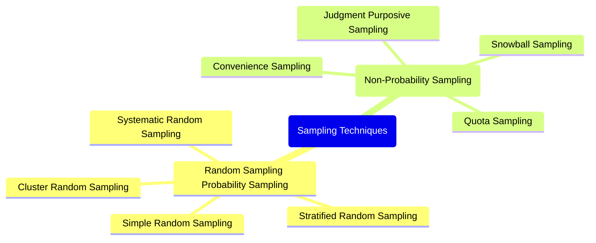
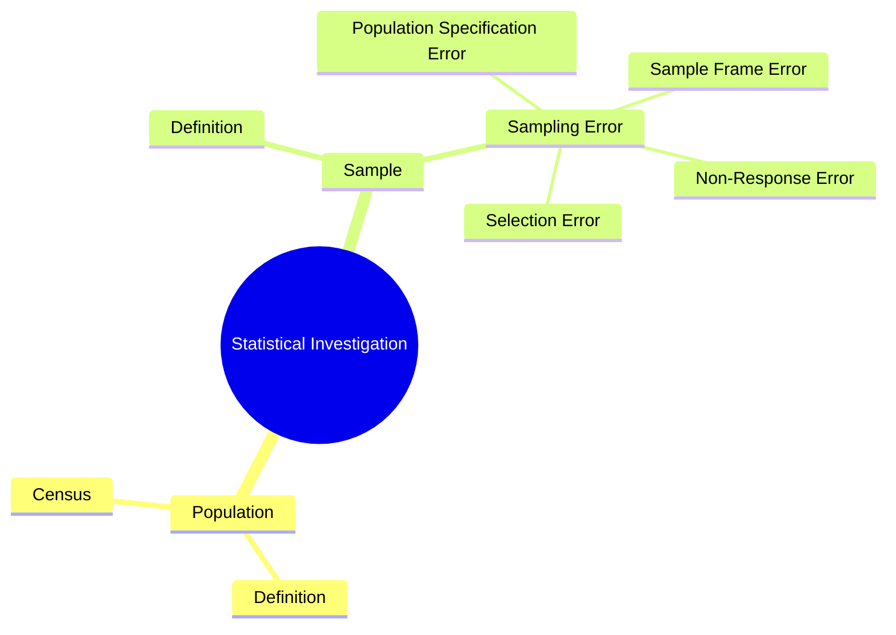
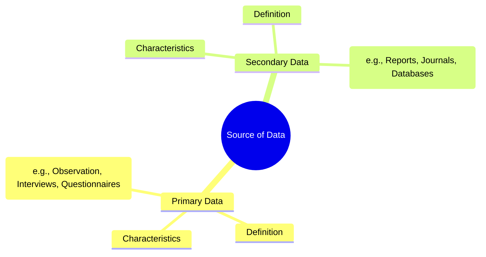
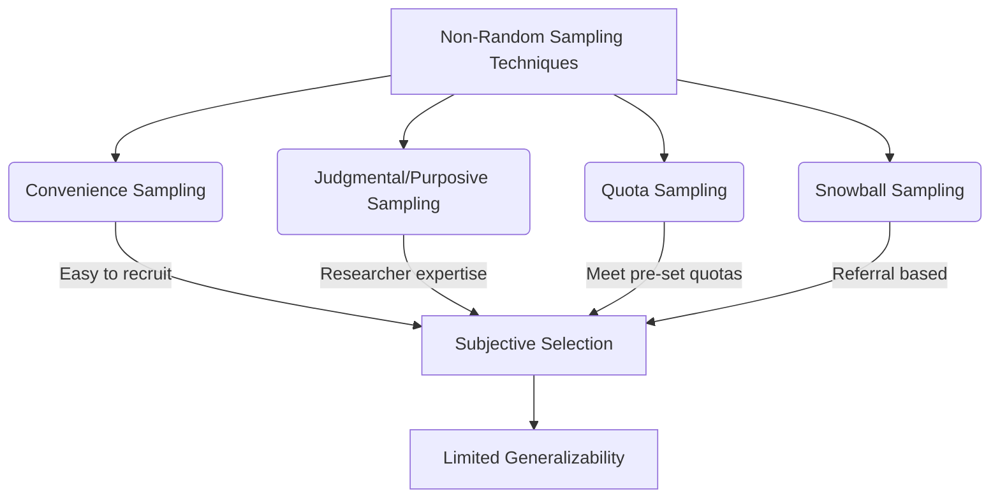
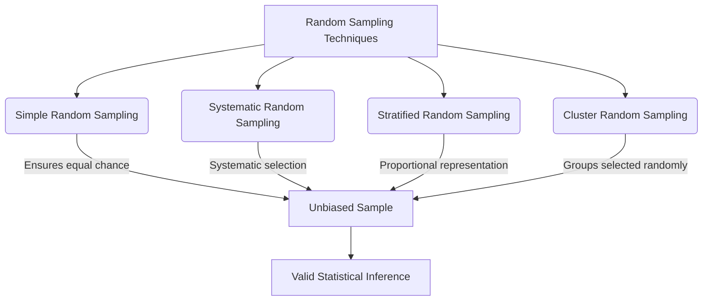

# 2 Collection Of Data

Comprehensive resource for 2 Collection Of Data.

---

## 2 Collection Of Data Hub

## Overview
The "Collection of Data" unit introduces the fundamental principles and methodologies for gathering information in statistical investigations. It explores the critical role data plays in decision-making across various fields, from business to science and education. This unit distinguishes between populations and samples, defining key concepts such as Census_And_Sample_Surveys and Sampling_Errors. It then delves into the diverse array of [[Sampling_Techniques]], categorizing them into Random_Sampling_Methods and Non_Random_Sampling_Methods, each with its own advantages and disadvantages. Finally, the unit examines the fundamental [[Source_of_Data]], differentiating between [[Primary_Data]] and [[Secondary_Data]] and detailing various methods for their collection.

## Learning Objectives
*   Define data collection and explain its importance in research and decision-making.
*   Differentiate between a population and a sample in statistical investigations.
*   Distinguish between a census and a sample survey, outlining their respective advantages and disadvantages.
*   Identify and categorize different types of sampling errors.
*   Describe and provide examples of various random sampling techniques, including [[Simple_Random_Sampling]], [[Systematic_Random_Sampling]], [[Stratified_Random_Sampling]], and [[Cluster_Random_Sampling]].
*   Describe and provide examples of various non-random sampling techniques, including [[Convenience_Sampling]], [[Judgmental_or_Purposive_Sampling]], [[Quota_Sampling]], and [[Snowball_Sampling]].
*   Compare and contrast random and non-random sampling methods, highlighting their strengths and weaknesses.
*   Differentiate between primary and secondary data, identifying the appropriate collection methods for each.
*   Outline and explain methods of collecting primary data, such as [[Direct_Observation]], [[Telephone_Interview]], [[Personal_Interview]], and [[Written_Questionnaires]].

## Unit Applications & Real-World Relevance
Understanding data collection is paramount in numerous professional and academic domains. In **business**, it informs product development, market analysis, and strategic planning, ensuring offerings meet customer needs and competitive landscapes. **Scientific research** relies on meticulous data collection from experiments to validate hypotheses and draw reliable conclusions. In **education**, data collection helps educators identify learning gaps, assess student progress, and evaluate teaching effectiveness, leading to improved pedagogical strategies. Furthermore, **government bodies** utilize census data for infrastructure development, social program planning, and demographic analysis, directly impacting public policy and resource allocation. Effective data collection underpins evidence-based decision-making and ensures the validity of any analytical endeavor.

## Active Learning Prompts
*   Consider a hypothetical scenario where you need to collect data on student satisfaction with online learning. Which sampling technique would you choose and why, justifying your choice based on its advantages and disadvantages?
*   Imagine you are conducting a market research study for a new smartphone. Formulate three questions suitable for a written questionnaire and explain how you would mitigate the risk of a low response rate.
*   Reflect on a recent news report or academic study. Identify whether primary or secondary data was primarily used and discuss the potential implications of that data source for the study's conclusions.

## Unit Challenges & Common Misconceptions
A common challenge in data collection is ensuring the **representativeness of the sample** to the larger population, which directly impacts the generalizability of findings. Misconceptions often arise regarding the difference between **sampling error** and **non-sampling error**, with many confusing random discrepancies with systematic biases. Another frequent pitfall is the assumption that any collected data is inherently reliable; however, the quality of data is critically dependent on the Collection_Of_Data_Methods employed and the rigor of their application. Over-reliance on easily accessible data without considering its source or potential biases (e.g., using only [[Convenience_Sampling]]) can lead to flawed conclusions.

## Connections
  - [[Collection_of_Data]]
  - [[Scopes_of_Statistical_Investigations]]
    - [[Population_and_Census]]
    - [[Sample_and_Sampling_Error]]
    - [[Categories_of_Sampling_Errors]]
  - [[Advantages_and_Disadvantages_of_Census_and_Sample_Surveys]]
  - [[Sampling_Techniques]]
    - [[Random_Sampling_Techniques]]
      - [[Simple_Random_Sampling]]
      - [[Systematic_Random_Sampling]]
      - [[Stratified_Random_Sampling]]
      - [[Cluster_Random_Sampling]]
    - [[Non_Random_Sampling_Techniques]]
      - [[Convenience_Sampling]]
      - [[Judgmental_or_Purposive_Sampling]]
      - [[Quota_Sampling]]
      - [[Snowball_Sampling]]
    - [[Advantages_and_Disadvantages_of_Sampling_Methods]]
  - [[Source_of_Data]]
    - [[Primary_Data]]
      - [[Direct_Observation]]
      - [[Telephone_Interview]]
      - [[Personal_Interview]]
      - [[Written_Questionnaires]]
    - [[Secondary_Data]]

## Next Steps for Deeper Understanding
To further deepen your understanding, explore the ethical considerations in data collection, including privacy, consent, and data security. Research the evolution of data collection techniques with the advent of big data and artificial intelligence, focusing on automated collection and algorithmic bias. Additionally, delve into advanced statistical software tools (e.g., R, Python libraries) that facilitate efficient data cleaning, processing, and preliminary analysis, which are the immediate steps following data collection.

## Possible Questions
[[CC2135_2_Collection_of_data_Possible_Questions]]

---

---

## Collection Of Data

## Definition
Before proceeding, ensure you master Foundational_Concepts_Of_Statistics and Research_Methodology_Basics.
Collection of data is the systematic gathering of all necessary information for the purpose of an inquiry. Data, in this context, refers to facts, figures, objects, symbols, and events obtained from various sources. This process is crucial across business, governmental, and academic domains, as it provides first-hand knowledge and original insights into a research problem. Without accurate and relevant data, organizations and researchers would struggle to make informed decisions or draw valid conclusions. A simple analogy for data collection is gathering ingredients before baking a cake; each ingredient (data point) is necessary to achieve the desired outcome.

## The Mental Model
Imagine you are a detective trying to solve a mystery. Each clue you find – a fingerprint, a witness statement, a discarded item – is a piece of "data." The process of meticulously searching for, documenting, and securing these clues is "data collection." The more carefully and systematically you collect your clues, the clearer the picture becomes, allowing you to solve the mystery (your research problem) accurately. If you miss a crucial clue or mishandle one, your investigation could go awry.

## Context & Framework
#### The Unseen Foundation
Data collection serves as the unseen foundation upon which all subsequent analysis and decision-making are built. It underpins the validity and reliability of any statistical investigation or research endeavor. The careful planning of data collection, including defining the research aim, identifying the type of data needed, and outlining the methods for collection, storage, and processing, directly impacts the quality of the insights derived. Without a robust data collection strategy, even the most sophisticated analytical tools will yield unreliable or misleading results. This fundamental process ensures that the information gathered is fit for purpose and capable of addressing the research question effectively.

## The Mastery Deep Dive
#### The "Duh!" Moment (Intuitive Proof)
Intuitively, it makes sense that you can't make good decisions without good information. Imagine trying to choose a university without knowing anything about their programs, costs, or student reviews. You would be guessing. Data collection is simply the formalized process of getting that "good information." When a government plans social programs, they need to know how many people are in different age groups, their income levels, and their needs. If they just "guessed," they'd likely waste resources or fail to help those who need it most. The act of "gathering facts" before making a judgment is an almost universal human behavior, and data collection is its structured, academic counterpart.

#### The Problem: Why Did We Invent This?
Historically, decisions were often made based on intuition, tradition, or limited anecdotal evidence, leading to suboptimal outcomes and repeated mistakes. The formalization of data collection arose from the need for more objective, verifiable, and comprehensive information to guide decisions in increasingly complex societies and scientific pursuits. Early censuses, for example, were driven by the need for efficient taxation and military conscription, demonstrating the practical necessity of organized data gathering. Without structured data collection, identifying patterns, assessing impact, or accurately predicting future trends would be impossible, leaving societies and organizations vulnerable to costly errors and inefficiencies.

## Constraints & Limitations
#### The "Oops!" List: Where Everyone Fails
A common failure in data collection is not clearly defining the **research aim** beforehand. If you don't know exactly what you're trying to find out, you'll collect irrelevant data, or worse, miss critical information. Another pitfall is collecting data that is **biased**, either through leading questions, unrepresentative samples, or researcher influence. Failing to plan for data storage and processing can also lead to chaos, with data getting lost, corrupted, or becoming too unwieldy to analyze. Lastly, neglecting to consider **ethical implications**, such as privacy and consent, can lead to serious legal and reputational damage. Each of these "oops" moments can invalidate an entire research effort.

## Significance & Application
Data collection is academically significant as the initial phase of any empirical research, dictating the quality and validity of subsequent statistical analysis. In the real world, its applications are vast. Businesses use it for market research, customer feedback, and sales forecasting. Governments conduct censuses for demographic planning and policy formulation. Scientists collect experimental data to test hypotheses, while educators gather assessment data to measure learning outcomes. Its meticulous application ensures evidence-based decision-making and continuous improvement across all sectors.

## The Worked Example
*Test your mastery. Cover the solutions below to test yourself first.*

### The Pilot's Checklist (Do Not Skip)
Imagine you are launching a new online learning platform and need to collect data on potential users' preferences for features (e.g., interactive quizzes, video lectures, live Q&A).

1.  **Define the Research Aim:** Clearly state what specific information you want to gather.
    *   *Example:* "To identify the top three most desired interactive features in an online learning platform among university students, and their preferred format for content delivery (video, text, live)."
2.  **Identify the Target Population:** Who are you collecting data from?
    *   *Example:* "University students aged 18-25 currently enrolled in STEM programs."
3.  **Determine Data Type:** What kind of data will best answer your questions (quantitative, qualitative)?
    *   *Example:* "Quantitative (e.g., ratings for features, multiple-choice for format preference) and some qualitative (e.g., open-ended feedback on 'most challenging aspect of online learning')."
4.  **Select Collection Method(s):** How will you gather this data?
    *   *Example:* "An online written questionnaire distributed via university email lists and social media channels."
5.  **Plan Data Storage & Processing:** How will you organize and clean the collected data?
    *   *Example:* "Responses will be automatically stored in a spreadsheet (e.g., Google Sheets or Excel), and then filtered for completeness and duplicates before analysis."
6.  **Consider Ethical Implications:** How will you ensure privacy and obtain consent?
    *   *Example:* "Include an informed consent statement at the beginning of the questionnaire, anonymize responses, and state how data will be used and protected."

## The Proving Ground
*Test your mastery. Cover the solutions below to test yourself first.*

#### Level 1: The Sanity Check (Verification)
**The Question:** Define "collection of data" and provide one real-world example of its importance.
> **Solution:** Collection of data is the systematic gathering of all necessary information for the purpose of an inquiry. One real-world example of its importance is how a city government conducts a census to collect demographic data for planning infrastructure and social programs, as this allows for evidence-based decision-making.

#### Level 2: The Crucible (Mastery & Edge Cases)
**The Scenario:** A small, local bakery wants to launch a new type of artisan bread. The owner, eager to save money, decides to skip formal data collection and instead asks her friends and family for their opinions on potential new recipes.
**The Challenge:**
(a) Identify the primary flaw in this data collection approach based on the principles discussed.
(b) How might this flaw lead to the new bread failing in the wider market, even if friends and family loved it?
(c) What simple, low-cost (but still more rigorous than the current approach) data collection method could the bakery owner have used to mitigate this flaw?
> **Solution:**
(a) The primary flaw is the severe **bias and lack of representativeness** in the sample (friends and family). This is a form of [[Convenience_Sampling]] that does not accurately reflect the preferences of the general customer base.
(b) This flaw could lead to failure because the preferences of friends and family are likely not representative of the broader market. They may be more inclined to give positive feedback due to personal relationships or share similar tastes that don't reflect diverse consumer demands. The new bread might cater to a very narrow, unviable niche, or simply not appeal to the tastes of the average bakery customer, leading to low sales.
(c) A simple, low-cost data collection method would be to conduct a brief, anonymous survey with a small sample of **actual customers** visiting the bakery over a week. This would involve a [[Written_Questionnaires]] or short [[Personal_Interview]] after their purchase, asking for feedback on potential new bread types. This expands the sample beyond personal connections, offering a more representative (though still limited) view of the target market.

## Key Takeaways
*   Data collection is the systematic process of gathering information to gain insights and make informed decisions, essential across all domains.
*   The quality and validity of research findings are directly dependent on the rigor and objectivity of the data collection methods employed.
*   Poorly defined aims, biased samples, and inadequate planning for data handling are common pitfalls that can undermine an entire data collection effort.

## Knowledge Graph Connections
| Concept                            | Connection / Relationship                                                          |
| :
---------------------------------- | :
----------------------------------------------------------------------------------- |
| Foundational_Concepts_Of_Statistics | Data collection is the initial, fundamental step in any statistical process.     |
| Research_Methodology_Basics       | It is a core component of research methodology, providing raw material for analysis. |
| [[Sampling_Techniques]]             | The choice of sampling technique directly impacts the representativeness of collected data. |
| [[Source_of_Data]]                  | Understanding the origin of data is crucial for assessing its reliability and relevance. |
| Decision_Making_Under_Uncertainty | Reliable data collection reduces uncertainty and improves the quality of decisions.  |
---

---

## Sampling Techniques

## Definition
Before proceeding, ensure you master [[Sample_and_Sampling_Error]] and Statistical_Bias.
**Sampling techniques** are the specific methods used to select a subset (a [[Sample_and_Sampling_Error]]) from a larger population. The goal of these techniques is to ensure that the chosen sample is as representative as possible of the original population, thereby minimizing Sampling_Error and allowing for valid inferences about the population. These techniques are broadly categorized into [[Random_Sampling_Techniques]] (or probability sampling), where every element has a known, non-zero chance of being selected, and [[Non_Random_Sampling_Techniques]] (non-probability sampling), where selection is based on the researcher's judgment or convenience. The choice of technique is critical, as it directly impacts the generalizability and reliability of the research findings.

## The Mental Model
Imagine you need to select a few representatives from a large school assembly.
*   **Sampling Techniques:** This is the "how-to" manual for picking those representatives.
*   **Goal:** You want the chosen few to accurately speak for everyone in the assembly.
*   **Poor Technique:** Picking only your friends (biased).
*   **Good Technique:** Drawing names randomly from a hat (unbiased, but still a "sample" so not perfect).
The "technique" is the systematic process you follow to ensure your selected group is a fair reflection of the whole.

*Note: This `mindmap` illustrates the two main categories of sampling techniques and their respective sub-methods, providing a hierarchical overview of the different approaches to selecting a sample.*

## Context & Framework
#### The Bridge Between Sample and Population
Sampling techniques serve as the crucial bridge between the observed data from a sample and the inferences made about a larger population. They provide the systematic procedures necessary to draw a [[Sample_and_Sampling_Error]] that is statistically sound and representative. For example, a medical researcher studying the effects of a new drug needs to select a sample of patients from the entire patient population with the condition. The choice of a specific sampling technique (e.g., [[Stratified_Random_Sampling]] to ensure age and gender representation) within the broader framework of Experimental_Design will directly determine the validity and ethical implications of the study's conclusions. Without robust sampling techniques, the leap from sample findings to population-wide generalizations would be unfounded.

## The Mastery Deep Dive
#### Opening the Hood: What's Inside?
Sampling techniques are essentially the blueprints for how to select a [[Sample_and_Sampling_Error]] from a larger [[Population_and_Census]]. They are broadly divided into two main categories:
1.  **Random Sampling (Probability Sampling)**: Here, every element in the population has a known, non-zero chance of being selected. This is the cornerstone of statistical inference because it allows for the calculation of Sampling_Error and the generalization of results to the population. Types include [[Simple_Random_Sampling]], [[Systematic_Random_Sampling]], [[Stratified_Random_Sampling]], and [[Cluster_Random_Sampling]].
2.  **Non-Random Sampling (Non-Probability Sampling)**: In this approach, elements are selected based on the researcher's subjective judgment, convenience, or other non-random criteria. While often easier and cheaper, these methods do not allow for the calculation of sampling error and typically limit the generalizability of findings. Types include [[Convenience_Sampling]], [[Judgmental_or_Purposive_Sampling]], [[Quota_Sampling]], and [[Snowball_Sampling]].

The core distinction lies in the ability to apply probability theory to random samples, which is not possible with non-random samples.

#### Who are the Neighbors?
Sampling techniques are closely related to several other key statistical concepts. They are the practical application of how to draw a [[Sample_and_Sampling_Error]] from a [[Population_and_Census]]. The choice of a particular technique directly impacts the likelihood and types of [[Categories_of_Sampling_Errors]] that might occur. Furthermore, the effectiveness of a sampling technique determines the extent to which Inferential_Statistics can be reliably used to make statements about the population. Without appropriate sampling, the data collected through [[Collection_of_Data]] may be biased, rendering subsequent analysis unreliable. Thus, sampling techniques act as the methodological link between defining a study's scope and drawing credible conclusions.

## Constraints & Limitations
#### The Engineering Trade-off
Choosing a sampling technique involves a crucial engineering trade-off between **statistical rigor** (generalizability, control over sampling error) and **practical feasibility** (cost, time, accessibility). [[Random_Sampling_Techniques]] offer higher statistical rigor, allowing for unbiased estimates and quantifiable error. However, they can be more complex and expensive to implement, requiring a complete list of the population (sampling frame) which may not always exist. [[Non_Random_Sampling_Techniques]], on the other hand, are often cheaper, faster, and more convenient, especially when a complete sampling frame is unavailable or when exploratory research is needed. The trade-off is that they introduce the risk of significant bias, and their results cannot be reliably generalized to the larger population. Researchers must carefully weigh the scientific demands of their study against the real-world constraints to select the most appropriate and defensible technique.

## Significance & Application
Sampling techniques are indispensable in virtually all fields that rely on data for decision-making. Academically, they are central to Survey_Methodology, Experimental_Design, and Quantitative_Research. In the real world, these techniques are applied in:
*   **Market Research:** To gauge consumer preferences for new products without surveying every potential customer.
*   **Public Opinion Polling:** To predict election outcomes or measure public sentiment on policy issues.
*   **Quality Control:** To inspect a subset of products from a large production run to ensure quality standards.
*   **Medical Research:** To select patient groups for clinical trials to test the efficacy of new treatments.
*   **Environmental Studies:** To assess pollution levels by sampling water or air at various locations.
Effective application of sampling techniques ensures that resources are used efficiently while yielding representative data.

## The Worked Example
*Test your mastery. Cover the solutions below to test yourself first.*

### The Pilot's Checklist (Do Not Skip)
Imagine a company wants to survey its 5,000 employees to understand job satisfaction levels.

1.  **Define the Population:** Clearly identify the entire group of interest.
    *   *Example:* "All 5,000 employees currently working for the company."
2.  **Identify if a Census is Feasible:** Can data be collected from all 5,000 employees?
    *   *Example:* "While technically feasible, a full census might lead to lower response rates and take longer, making a sample survey more practical for quick insights."
3.  **Consider Random Sampling Techniques:** If a sample is desired, name two suitable random sampling techniques.
    *   *Example:* "[[Simple_Random_Sampling]] (randomly pick names from the employee list) or [[Stratified_Random_Sampling]] (divide by department and pick randomly from each) would be suitable."
4.  **Consider Non-Random Sampling Techniques:** If resources are extremely limited or exploratory insights are needed, name one non-random technique.
    *   *Example:* "[[Convenience_Sampling]] (surveying employees in the cafeteria) or [[Judgmental_or_Purposive_Sampling]] (selecting key department heads for interviews) could be used for initial insights, but with acknowledged limitations."
5.  **Identify the Goal of the Chosen Technique:** What is the primary objective of using a specific technique?
    *   *Example:* "The primary objective is to select a representative sample of employees so that the findings on job satisfaction can be generalized to the entire 5,000-employee population with a measurable level of confidence."

## The Proving Ground
*Test your mastery. Cover the solutions below to test yourself first.*

#### Level 1: The Sanity Check (Verification)
**The Question:** What is the main purpose of using sampling techniques in a research study?
> **Solution:** The main purpose of using sampling techniques is to select a subset (sample) from a larger population that is as representative as possible of the original population, thereby minimizing sampling error and allowing for valid inferences about the population.

#### Level 2: The Crucible (Mastery & Edge Cases)
**The Scenario:** A research team wants to study the impact of social media usage on academic performance among high school students in a large school district. They have access to a list of all 10,000 students in the district. They are debating between using a technique that ensures every student has an equal chance of being selected versus one where they simply survey students in common areas during lunch breaks.
**The Challenge:**
(a) Identify the two broad categories of sampling techniques being debated.
(b) Explain why using the technique where "every student has an equal chance of being selected" is generally preferred for this study if the goal is to make generalizable statements about the entire district.
(c) What specific type of "error" is more likely to be introduced by surveying students in common areas during lunch breaks, and why?
> **Solution:**
(a) The two broad categories of sampling techniques being debated are **Random Sampling (Probability Sampling)** (where every student has an equal chance) and **Non-Random Sampling (Non-Probability Sampling)** (surveying students in common areas).
(b) The technique where "every student has an equal chance of being selected" (Random Sampling) is generally preferred because it introduces less **bias** and allows for the calculation of Sampling_Error. This means the results from the sample can be more reliably generalized to the entire district, and the level of uncertainty in those generalizations can be statistically quantified. This is crucial for making valid inferences about the impact of social media on *all* high school students in the district.
(c) Surveying students in common areas during lunch breaks is likely to introduce **Selection Error**, a category of sampling error. This occurs because students present in common areas during lunch might not be representative of the entire student body (e.g., students who bring lunch, students with specific friend groups, or those with certain class schedules). They are essentially "self-selecting" their participation by their presence, leading to a biased sample that does not accurately reflect the diversity of the student population or their social media usage habits.

## Key Takeaways
*   Sampling techniques are methods for selecting a representative subset from a population.
*   They are categorized into random (probability) and non-random (non-probability) sampling.
*   Random sampling allows for generalizable conclusions and measurable sampling error, while non-random sampling is often more practical but prone to bias.

## Knowledge Graph Connections
| Concept                            | Connection / Relationship                                                                 |
| :
---------------------------------- | :
---------------------------------------------------------------------------------------- |
| [[Sample_and_Sampling_Error]]       | These techniques are used to obtain a sample and manage its associated error.             |
| Statistical_Bias                | Proper sampling techniques are crucial for minimizing statistical bias in research.       |
| [[Random_Sampling_Techniques]]      | This is one of the two main categories of sampling techniques.                            |
| [[Non_Random_Sampling_Techniques]]  | This is the other main category, contrasting with random sampling.                       |
| Research_Methodology_Design     | The choice of sampling technique is a fundamental component of research methodology design. |
---

---

## Scopes Of Statistical Investigations

## Definition
Before proceeding, ensure you master [[Collection_of_Data]] and Fundamental_Concepts_Of_Measurement.
The scopes of statistical investigations define the boundaries and subjects of a study, determining who or what will be observed. This involves clearly delineating the entire group of interest (the [[Population_and_Census]]) and the smaller, representative subset that will actually be studied (the [[Sample_and_Sampling_Error]]). Understanding these scopes is fundamental because it dictates the generalizability of findings and the methodologies employed. Essentially, it's about deciding who you're talking about (population) and who you're actually talking to (sample).

## The Mental Model
Imagine you are an explorer mapping a new continent. The "scope" of your investigation is whether you are mapping the entire continent (the population) or just a smaller, representative region of it (the sample). If you map the whole continent, you have complete knowledge. If you map a region, you assume that region gives you enough information to understand the whole. But, if you pick the wrong region, your map of the continent will be inaccurate.

*Note: This `mindmap` visually categorizes the key elements defining the scope of a statistical investigation, showing the relationship between population, census, sample, and various types of sampling errors.*

## Context & Framework
#### Defining the Universe of Inquiry
The scope of a statistical investigation is established by defining the "universe of inquiry," which is the total set of elements relevant to the research question. This involves a crucial initial decision: whether to examine every single individual or entity within that universe (a census) or to focus on a manageable subset (a sample). This decision has profound implications for resources, accuracy, and the ability to generalize results. For instance, a pharmaceutical company testing a new drug must define its population (e.g., all adults with a specific condition) before deciding if it will conduct a full-scale trial (census-like for approval) or a pilot study on a smaller group (sample). The chosen scope guides all subsequent methodological choices.

## The Mastery Deep Dive
#### Opening the Hood: What's Inside?
At the heart of statistical investigations are two core components: the **population** and the **sample**. The population is the *entire group* that a researcher is interested in studying. For example, if you want to know about all students at a university, then "all students" is your population. A **census** is an attempt to collect data from *every single individual* in that population. In contrast, a **sample** is a *smaller, selected subset* of that population. So, instead of surveying all students, you might survey 200 students. The aim of the sample is to accurately *represent* the larger population, allowing you to draw conclusions about the whole group without having to collect data from everyone. The process also includes understanding Sampling_Error, which is the natural difference that exists between what you find in your sample and the true value in the population.

#### The Translator: From "Lego" to "Jargon"
When we talk about the "set of all individuals of interest in a particular study," we're not just saying "everyone we care about"; the formal term for this is **population**. When we aim to "observe every single element" in that population, we're performing a **census**, not just a "100% survey." Similarly, a "smaller group chosen from the big group to represent it" is formally called a **sample**. The "difference or error between what we find in the small group and what's true for the big group" is precisely defined as **sampling error**. Using these precise terms is crucial for clear and unambiguous communication in statistics, especially in academic and professional contexts where accuracy is paramount.

## Constraints & Limitations
#### The Engineering Trade-off
Choosing between a census and a sample involves a significant engineering trade-off. A census offers unparalleled accuracy, eliminating Sampling_Error entirely because it observes the entire population. However, this comes at a very high cost in terms of **time, resources, and logistical complexity**, often making it impractical or impossible for large populations. Conversely, a sample survey is far more **economical and time-efficient**, allowing for quicker insights. The trade-off is that samples introduce Sampling_Error, meaning there will always be some discrepancy between the sample results and the true population parameters. Researchers must weigh the need for absolute precision against practical constraints, deciding whether the benefits of a census outweigh its substantial disadvantages, or if a well-designed sample can provide sufficient accuracy within acceptable limits.

## Significance & Application
Understanding the scopes of statistical investigations is foundational for designing valid research and interpreting results correctly. Academically, it underpins concepts like Inferential_Statistics and Sampling_Theory. In practical applications, these scopes guide everything from national census undertakings to market research and scientific experiments, defining who or what data will be collected from. Without this clear understanding, studies risk flawed design, invalid conclusions, and misallocation of resources.

## The Worked Example
*Test your mastery. Cover the solutions below to test yourself first.*

### The Pilot's Checklist (Do Not Skip)
Consider a scenario where a local government wants to determine the average income of households in a city to assess the need for social support programs.

1.  **Define the Population:** Clearly state the entire group of interest.
    *   *Example:* "All households residing within the city limits."
2.  **Consider a Census:** How would a census be conducted for this population?
    *   *Example:* "Government agents would attempt to visit every single household in the city, or send questionnaires to every household, to collect income data."
3.  **Consider a Sample:** How would a sample be drawn for this population?
    *   *Example:* "A random selection of 500 households from the city's property tax records would be chosen for a survey."
4.  **Identify Potential Sampling Error (for a sample):** What kind of discrepancy might exist if a sample is used?
    *   *Example:* "The average income reported by the 500 sampled households might be slightly higher or lower than the true average income of all households in the city."
5.  **Evaluate Practicality:** Which method is more practical for this scenario, and why?
    *   *Example:* "A sample is likely more practical due to the high cost and time involved in surveying every single household in a city for a census, especially if the city is large."

## The Proving Ground
*Test your mastery. Cover the solutions below to test yourself first.*

#### Level 1: The Sanity Check (Verification)
**The Question:** Define a statistical population and provide a simple example.
> **Solution:** A statistical population is the set of all individuals or items of interest in a particular study. A simple example is "all registered voters in a country" if a study aims to understand voter behavior.

#### Level 2: The Crucible (Mastery & Edge Cases)
**The Scenario:** A manufacturing company produces millions of small electronic components daily. They need to assess the defect rate of these components to maintain quality standards.
**The Challenge:**
(a) Why would conducting a full "census" of every single component produced be an impossible or highly impractical task in this scenario?
(b) How would the company define a "sample" in this context?
(c) What ethical or safety implications might arise if the company *failed* to define a proper scope and relied on inaccurate data?
> **Solution:**
(a) Conducting a full census would be impossible or highly impractical because of the sheer volume of components produced daily (millions). It would be prohibitively expensive, time-consuming, and potentially destructive (if testing is destructive), halting production.
(b) The company would define a "sample" as a randomly selected subset of components from the daily production, perhaps every 1000th component, or a batch of 500 components chosen at regular intervals throughout the day.
(c) If the company failed to define a proper scope and relied on inaccurate data (e.g., from a biased sample or no sample at all), they might release a high number of defective products. This could lead to customer safety issues (if the components are critical, like in medical devices), product recalls, significant financial losses, damage to their brand reputation, and potential legal liabilities.

## Key Takeaways
*   The scope of a statistical investigation is defined by the population (the entire group of interest) and the sample (a subset of the population).
*   A census involves observing the entire population, providing complete accuracy but at high cost and time.
*   A sample involves observing a subset, offering efficiency but introducing sampling error, which is the natural discrepancy from the population.

## Knowledge Graph Connections
| Concept                            | Connection / Relationship                                                              |
| :
---------------------------------- | :
------------------------------------------------------------------------------------- |
| [[Collection_of_Data]]              | Scopes define *who* or *what* the data will be collected from.                       |
| [[Population_and_Census]]           | These are core components of statistical investigation scopes.                         |
| [[Sample_and_Sampling_Error]]       | These are core components of statistical investigation scopes, alongside population.   |
| [[Sampling_Techniques]]             | The choice of technique is determined by the defined scope and desired sample.         |
| Inferential_Statistics          | Understanding scopes is crucial for drawing valid inferences about populations from samples. |
---

---

## Source Of Data

## Definition
Before proceeding, ensure you master [[Collection_of_Data]] and Data_Validity_And_Reliability.
The **source of data** refers to the origin from which information is obtained for a statistical investigation or research study. It fundamentally distinguishes between [[Primary_Data]] (information collected directly from a first-hand source for the specific purpose of the current inquiry) and [[Secondary_Data]] (information that has already been collected and compiled by someone else for a different purpose, then re-used). Understanding the source of data is paramount because it directly impacts the data's relevance, reliability, and the level of control the researcher has over its quality. It's about knowing where your information comes from and what journey it has taken before it reaches your analysis.

## The Mental Model
Imagine you're baking a cake.
*   **Primary Data:** You go to the farm, gather fresh eggs, milk the cow, and grind your own flour. You know exactly where everything came from and how fresh it is.
*   **Secondary Data:** You go to the supermarket and buy pre-packaged eggs, milk, and flour. You're using ingredients that someone else already processed and packaged. It's convenient, but you don't know the exact farm or the specific cow.
The "source of data" is essentially whether you're collecting "farm-fresh" (primary) or "store-bought" (secondary) ingredients for your research "cake."

*Note: This `mindmap` visually categorizes the two main sources of data, detailing their definitions, characteristics, and common collection/origin methods.*

## Context & Framework
#### The Informational Lineage
Within the overall framework of [[Collection_of_Data]], identifying the source of data establishes its "informational lineage," directly influencing its suitability and credibility for a given research question. This foundational distinction impacts subsequent decisions regarding data processing, analysis, and the confidence placed in findings. For example, a historian researching a specific battle might prioritize [[Primary_Data]] by examining original letters and military dispatches from the period, as these offer direct, unfiltered accounts. However, they might also leverage [[Secondary_Data]] by consulting published academic analyses of the battle to gain broader context or identify existing interpretations. The choice and judicious integration of these data sources are critical for building a comprehensive and well-substantiated historical narrative, highlighting how the source directly informs the depth and authenticity of research insights.

## The Mastery Deep Dive
#### The "Duh!" Moment (Intuitive Proof)
If you're making a big decision, like buying a house, you wouldn't rely on secondhand rumors from someone who heard it from someone else. You'd want to go directly to the source: the seller, the official property records, the inspector. This "duh!" moment highlights why distinguishing the source of data is so important. Data from the original source (primary) tends to feel more trustworthy and relevant because it hasn't been filtered or reinterpreted. Data from a secondhand source (secondary) is convenient, but you instinctively question its accuracy and how well it truly fits *your* needs. Knowing the origin helps you decide how much to trust and how to use the information.

#### The Kill Sheet (Comparison Table)
| Feature                   | [[Primary_Data]]                                           | [[Secondary_Data]]                                       | **The "Gotcha" Difference**                                                 |
| :
------------------------ | :
--------------------------------------------------------- | :
------------------------------------------------------- | :
-------------------------------------------------------------------------- |
| **Origin**                | Original and new; collected specifically for current research. | Re-used and old; collected by others for different purpose. | **Novelty:** Fresh, purpose-built vs. Pre-existing.                     |
| **Purpose Match**         | Customized as per the need of the research; directly linked. | May not directly link with current research needs.       | **Relevance:** Tailored vs. Potentially Mismatched.                     |
| **Cost & Time**           | Less economical (more expensive); more time-consuming.     | More economical (cheaper); less time-consuming.          | **Efficiency:** Resource-intensive vs. Resource-saving.                 |
| **Reliability & Control** | High on reliability; full control over methodology.        | Lower on reliability; no control over original methods.  | **Trustworthiness:** Direct oversight vs. Inherited quality.             |
| **Examples of Methods**   | [[Direct_Observation]], [[Personal_Interview]], [[Written_Questionnaires]] | Government reports, academic journals, company records.  | **Collection Mechanism:** Direct engagement vs. Retrieval from archives. |

## Constraints & Limitations
#### The Engineering Trade-off
The choice between [[Primary_Data]] and [[Secondary_Data]] involves a fundamental engineering trade-off between **control, relevance, and accuracy** versus **cost, time, and accessibility**. Primary data offers complete control over the collection methodology, ensuring the data is perfectly tailored to the research question and maximizing its relevance and reliability. However, this comes at a significant cost in terms of time and financial resources, as it involves generating entirely new information. Secondary data, conversely, is highly economical and time-efficient, as it leverages existing information that is readily available. The trade-off is a potential **mismatch in relevance** (data collected for a different purpose) and **reduced control over data quality and biases** from the original collection. Furthermore, secondary data can be **outdated**, especially in dynamic fields. Researchers must carefully assess whether the unique benefits of primary data outweigh its substantial investment, or if the efficiencies of secondary data are acceptable given its inherent limitations and potential for compromise in relevance and quality.

## Significance & Application
Understanding the source of data is paramount for assessing its credibility and making informed research design choices. Academically, this distinction is fundamental to all Research_Methodology courses and Data_Analysis. In real-world applications, it guides decisions in:
*   **Business Strategy:** Deciding whether to conduct new market research (primary) or analyze existing industry reports (secondary).
*   **Academic Research:** Determining if new experiments or surveys are needed, or if existing datasets are sufficient.
*   **Government Planning:** Using census data (secondary for many researchers) versus conducting targeted surveys (primary).
*   **Journalism:** Differentiating between original investigative reporting (primary) and reporting on existing studies (secondary).
The ability to critically evaluate data sources is a core skill for any data-driven professional.

## The Worked Example
*Test your mastery. Cover the solutions below to test yourself first.*

### The Pilot's Checklist (Do Not Skip)
A startup company is developing a new fitness app and needs to understand both broad market trends in health and fitness *and* specific user preferences for app features.

1.  **Identify the need for Secondary Data:** What broad information is available?
    *   *Example:* "To understand broad market size, growth trends in the fitness industry, and competitor offerings, the startup should first consult [[Secondary_Data]] sources like market research reports, industry analyses, and published user statistics from existing apps."
2.  **Identify the need for Primary Data:** What specific information is missing?
    *   *Example:* "To understand specific user preferences for *their unique app features*, pain points with existing apps, and willingness to pay, the startup will need to collect [[Primary_Data]] directly from potential users."
3.  **Propose a Primary Data collection method:** How would they get specific user preferences?
    *   *Example:* "Conduct focus groups or [[Personal_Interview]]s with target users to gather qualitative insights, and distribute online [[Written_Questionnaires]] to a larger sample for quantitative feature prioritization."
4.  **Explain the cost/time trade-off:** Which is faster/cheaper?
    *   *Example:* "Collecting secondary data will be faster and more economical, allowing for a quick market overview. Collecting primary data will be more time-consuming and expensive but will yield highly relevant, tailored insights directly applicable to their app design."
5.  **Describe the logical flow:** How do these sources complement each other?
    *   *Example:* "Start with secondary data to frame the problem and understand the landscape. Then, use primary data to fill specific knowledge gaps and validate assumptions generated from the secondary analysis, leading to informed product development decisions."

## The Proving Ground
*Test your mastery. Cover the solutions below to test yourself first.*

#### Level 1: The Sanity Check (Verification)
**The Question:** Define "primary data" and "secondary data."
> **Solution:** **Primary data** is information collected directly from a first-hand source specifically for the purpose of the current research. **Secondary data** is information that has already been collected, compiled, and often published by someone else for a different purpose, and is then re-used by the current researcher.

#### Level 2: The Crucible (Mastery & Edge Cases)
**The Scenario:** A university student is writing a research paper on the socio-economic impact of a recent natural disaster on a specific coastal community. They have access to:
(a) Official government disaster relief reports and economic statistics for the affected region (published online).
(b) The opportunity to conduct new interviews with disaster victims and local community leaders.
**The Challenge:**
(a) Categorize sources (a) and (b) as either primary or secondary data.
(b) The student has a very tight deadline (2 weeks). Justify why relying *primarily* on one of these data sources would be more practical for meeting the deadline, and what would be the main trade-off.
(c) The "Impostor" scenario: The student, having read some online news articles about the disaster, claims these articles count as "primary data" because they describe eyewitness accounts. Explain why this claim is incorrect based on the definition of primary data.
> **Solution:**
(a) Sources:
    *   (a) Official government disaster relief reports and economic statistics: **Secondary Data** (already collected and published by others).
    *   (b) New interviews with disaster victims and local community leaders: **Primary Data** (collected directly by the student for this specific research).
(b) Relying *primarily* on **secondary data** (a) would be more practical for meeting the tight 2-week deadline. These reports and statistics are readily available online, allowing for quick access and analysis, thus saving the significant time and logistical effort required to plan, conduct, transcribe, and analyze new interviews. The main trade-off would be that this data might **not directly link** with the student's *specific research questions* about the socio-economic impact, potentially lacking the nuanced, first-hand perspectives and emotional context that only primary interviews could provide.
(c) The claim that online news articles about the disaster, even those describing eyewitness accounts, count as "primary data" is incorrect. While the *eyewitness accounts themselves* are primary data, the **news articles are secondary data**. The journalist collected, interpreted, and reported those accounts. The student is reading a published report *about* the primary data, not accessing the primary data directly from the original source. The articles are a secondhand account of primary information.

## Key Takeaways
*   Source of data classifies information as primary (first-hand, new) or secondary (re-used, collected by others).
*   Primary data offers high relevance and control but is costly and time-consuming.
*   Secondary data is economical and fast but may lack direct relevance or control over quality.

## Knowledge Graph Connections
| Concept                            | Connection / Relationship                                                                 |
| :
---------------------------------- | :
---------------------------------------------------------------------------------------- |
| [[Collection_of_Data]]              | This is a fundamental categorization within the broader process of data collection.       |
| [[Primary_Data]]                    | One of the two primary types of data sources, characterized by its original nature.       |
| [[Secondary_Data]]                  | The other primary type of data source, characterized by its re-used nature.               |
| Research_Methodology_Design     | The choice of data source is a critical decision in designing a research study.           |
| Data_Quality_Assessment         | Critically evaluating the source is essential for assessing the quality and suitability of data. |
---

---

## Advantages And Disadvantages Of Census And Sample Surveys

## Definition
Before proceeding, ensure you master [[Population_and_Census]] and [[Sample_and_Sampling_Error]].
Understanding the **advantages and disadvantages of census and sample surveys** is crucial for selecting the appropriate data collection method in any statistical investigation. A **census**, which surveys an entire [[Population_and_Census]], offers complete accuracy and avoids Sampling_Error. However, it is typically **very expensive**, **time-consuming**, and sometimes **impossible** to conduct. Conversely, a **sample survey**, which observes a subset ([[Sample_and_Sampling_Error]]) of the population, is **less costly** and **faster**, but inherently **less accurate** due to the presence of sampling error and the risk of not fully representing the population. The choice between these two approaches fundamentally shapes the feasibility, cost, and reliability of research outcomes.

## The Mental Model
Imagine you need to know the exact number of jellybeans in a giant jar.
*   **Census:** You spend hours meticulously counting every single jellybean. It's perfectly accurate, but takes a long time and a lot of effort.
*   **Sample Survey:** You take out a handful, count those, and then guess how many are in the jar. It's quick and easy, but your guess might be a bit off (that's the "disadvantage" or sampling error), and your handful might not perfectly represent the colors in the whole jar.

## Context & Framework
#### The Optimal Information Trade-off
The decision to conduct a census versus a sample survey sits at the core of optimizing data collection for specific research objectives, resources, and timelines. For situations demanding absolute precision and complete enumeration (e.g., national population statistics, definitive counts of registered voters), the comprehensive nature of a census is invaluable. However, for most dynamic or large-scale investigations (e.g., market research for consumer preferences, quick polls on public opinion), the efficiency and cost-effectiveness of a sample survey are undeniable. This framework emphasizes that there is no universally "best" method; instead, the optimal choice depends on a careful assessment of the Research_Question, available Budget_Constraints, desired Timeliness_Of_Data, and acceptable levels of Data_Accuracy.

## The Mastery Deep Dive
#### The Hard Choice: Option A or Option B?
When deciding between a census and a sample survey, researchers are faced with a fundamental trade-off.
**Census: The "Gold Standard"**
*   **Advantage 1: More accurate.** By observing every element, a census provides the true population parameters and avoids Sampling_Error.
*   **Advantage 2: Avoids sampling errors.** No chance of discrepancy arising from a subset.
*   **Disadvantage 1: Very expensive.** Significant financial resources are required.
*   **Disadvantage 2: Time-taking.** Requires extensive time for collection and processing.
*   **Disadvantage 3: Sometimes impossible.** Impractical for infinite populations or destructive testing.
*   **Disadvantage 4: Significant delay.** Results can be outdated upon release.

**Sample Survey: The "Practical Approach"**
*   **Advantage 1: Less time and less cost.** Much more efficient than a census.
*   **Disadvantage 1: Less accurate.** Inherently subject to Sampling_Error.
*   **Disadvantage 2: May not represent the given population.** Risk of bias if not carefully designed.

The choice hinges on whether the need for absolute accuracy outweighs the substantial costs and delays of a census, or if the efficiencies of a sample survey are acceptable given its inherent limitations.

#### The Devil's Advocate: Why might this be wrong?
A common argument against sample surveys is their "less accurate" nature. The devil's advocate would point out that because a sample is only a subset, it will *never* perfectly match the true population values. This inherent Sampling_Error means any conclusions drawn are estimates, not definitive facts. Furthermore, if the sample is not truly representative (perhaps due to poor [[Sampling_Techniques]] or [[Categories_of_Sampling_Errors]] like non-response), the results can be severely biased and misleading, even if they are collected quickly and cheaply. Therefore, for critical decisions where precision is paramount, relying solely on a sample can be a risky proposition, potentially leading to flawed policies or product failures based on incomplete information.

## Constraints & Limitations
#### The Engineering Trade-off
The engineering trade-off between a census and a sample survey revolves around balancing the desire for **absolute data fidelity** with **practical constraints** of resources, time, and feasibility. A census offers perfect fidelity by collecting data from every individual, thus eliminating Sampling_Error. This is invaluable when high stakes are involved, like determining precise population counts for electoral districts. However, this perfection demands immense investment. A sample survey, by contrast, sacrifices some fidelity by only observing a subset, thereby accepting the presence of sampling error. In return, it offers significantly lower costs and faster data collection, making it the only viable option for large or dynamic populations, or when quick insights are needed. The design challenge lies in making a sample as representative as possible while keeping it within budget and time limits, thus controlling the magnitude of sampling error to an acceptable level.

## Significance & Application
The comparison between census and sample surveys is a foundational concept in Survey_Methodology and Statistical_Analysis. Academically, it informs decisions in research design. In real-world applications, it directly impacts policy-making (e.g., national censuses for resource allocation), market research (e.g., quick surveys for consumer trends), and scientific studies (e.g., clinical trials on patient subgroups). The ability to intelligently choose between these methods, understanding their implications, is a core skill for any data-driven professional.

## The Worked Example
*Test your mastery. Cover the solutions below to test yourself first.*

### The Hard Choice: Option A or Option B?
A large university wants to assess the mental health and well-being of its student body (totaling 30,000 students) at the beginning of the academic year to tailor support services. They need to decide between two data collection strategies:

**Option A (Census-like):** Administer a mandatory, anonymous online survey to *all* 30,000 students, with a deadline for completion.
**Option B (Sample Survey):** Select a stratified random sample of 3,000 students (10% of the population), ensuring representation from different faculties and academic years, and invite them to complete the anonymous online survey.

1.  **What is a major advantage of Option A for the university's goal?**
    *   *Example:* "A major advantage of Option A (census-like) is that it would provide a complete and definitive picture of the mental health landscape across the entire student body, avoiding Sampling_Error and ensuring no specific student group is inadvertently missed."
2.  **What is a significant disadvantage of Option A that might make Option B more appealing?**
    *   *Example:* "A significant disadvantage of Option A is the high likelihood of a low response rate, even if mandatory, given the large number of students. This could lead to a large Non_Response_Error, making the 'census' incomplete and potentially biased. Option B, with its smaller, targeted sample, might achieve a higher response rate within that subgroup, making it more appealing for practical data collection."
3.  **If a quick turnaround is critical for implementing support services early in the semester, which option is generally more advantageous, and why?**
    *   *Example:* "Option B (sample survey) is generally more advantageous for quick turnaround. Collecting and processing 3,000 responses will be significantly faster than managing 30,000, allowing the university to analyze results and implement support services much earlier in the semester."

## The Proving Ground
*Test your mastery. Cover the solutions below to test yourself first.*

#### Level 1: The Sanity Check (Verification)
**The Question:** State one advantage of a sample survey over a census, and one disadvantage.
> **Solution:** One advantage of a sample survey is that it takes less time and less cost compared with a census. One disadvantage is that it is less accurate due to the presence of Sampling_Error.

#### Level 2: The Crucible (Mastery & Edge Cases)
**The Scenario:** A government department is tasked with evaluating the effectiveness of a new nationwide adult literacy program. They have a budget that allows for either a comprehensive evaluation of a few randomly selected literacy centers or a less detailed survey of every participant across all centers.
**The Challenge:**
(a) Identify which of the two options aligns with a census approach and which aligns with a sample survey approach.
(b) Justify which approach (census or sample survey) is more appropriate for evaluating program *effectiveness* in this scenario, considering the need for in-depth data versus broad coverage.
(c) Predict a potential problem if the *less appropriate* approach were chosen.
> **Solution:**
(a) The option of a "less detailed survey of every participant across all centers" aligns with a **census** approach, as it attempts to collect data from the entire population of program participants. The option of a "comprehensive evaluation of a few randomly selected literacy centers" aligns with a **sample survey** approach, as it focuses on a subset (the selected centers) to draw conclusions about the whole program.
(b) The **sample survey** approach (comprehensive evaluation of a few randomly selected centers) is more appropriate for evaluating program *effectiveness*. Effectiveness often requires in-depth data, qualitative insights, and detailed metrics (e.g., learning gains, participant feedback, instructional quality). A comprehensive evaluation, even if only of a sample of centers, allows for this depth. A less detailed census of all participants might miss the nuances required to truly understand *why* the program is effective or not.
(c) If the *less appropriate* approach (the census-like "less detailed survey of every participant") were chosen, a potential problem is that while it would provide broad coverage of participation numbers, the lack of depth might mean the department cannot truly understand the *mechanisms* of the program's success or failure. They would have wide data but shallow insights, making it difficult to pinpoint what aspects of the program work, what needs improvement, or *why* certain outcomes are observed. This could lead to ineffective program modifications or misallocation of resources.

## Key Takeaways
*   Censuses offer complete accuracy and avoid sampling error but are expensive, time-consuming, and sometimes impractical.
*   Sample surveys are cost-effective and faster but are less accurate due to inherent sampling error and potential for non-representativeness.
*   The choice between a census and a sample survey depends on research objectives, available resources, and the acceptable level of data accuracy.

## Knowledge Graph Connections
| Concept                            | Connection / Relationship                                                                 |
| :
---------------------------------- | :
---------------------------------------------------------------------------------------- |
| [[Population_and_Census]]           | These are the two primary approaches compared and contrasted regarding their pros and cons. |
| [[Sample_and_Sampling_Error]]       | The core trade-off revolves around avoiding or managing sampling error.                   |
| [[Sampling_Techniques]]             | The choice of technique is informed by the decision to conduct a census or a sample.      |
| Data_Collection_Methods         | These two represent fundamental categories of data collection strategies.                 |
| Research_Design_Considerations  | The advantages and disadvantages directly influence the feasibility and validity of research designs. |
---

---

## Advantages And Disadvantages Of Sampling Methods

## Definition
Before proceeding, ensure you master [[Sampling_Techniques]] and Statistical_Inference.
Understanding the **advantages and disadvantages of random (probability) and non-random (non-probability) sampling methods** is crucial for selecting the appropriate approach for any research study. [[Random_Sampling_Techniques]] offer the significant advantage of **statistical generalizability**, allowing researchers to draw unbiased inferences about a [[Population_and_Census]] and quantify Sampling_Error. However, they can be **complex and costly** to implement. Conversely, [[Non_Random_Sampling_Techniques]] are **more economical and convenient** for quick insights or hard-to-reach populations, but inherently suffer from **selection bias** and **lack statistical generalizability**, making it impossible to calculate sampling error. The choice between these two broad categories depends critically on the research objectives, available resources, and the acceptable level of certainty regarding the generalizability of findings.

## The Mental Model
Imagine you need to know how many red and blue marbles are in a huge, unseen bag.
*   **Random Sampling:** You reach in blindly, stir the bag, and pull out a handful. You might get a few more reds or blues by chance (sampling error), but your method is fair, and you can make a good *estimate* about the whole bag. The advantage is you can trust your estimate; the disadvantage is it's still an estimate.
*   **Non-Random Sampling:** You peek into the bag and pick out all the red marbles you can see easily, or you only pick the shiny ones. This is fast and convenient, but you know your handful probably doesn't represent the true mix in the bag. The advantage is speed; the disadvantage is you can't trust your estimate for the whole bag.

## Context & Framework
#### The Justification for Choice
Within the overarching framework of [[Sampling_Techniques]], the comparative analysis of the advantages and disadvantages of random versus non-random methods serves as the "justification for choice." This critical assessment guides researchers in aligning their sampling strategy with their research aims, ethical considerations, and practical constraints. For instance, a government agency conducting a national health survey typically prioritizes [[Random_Sampling_Techniques]] to ensure statistically robust, generalizable findings that can inform public policy. Conversely, a grassroots organization conducting an exploratory study on a marginalized community might initially opt for [[Non_Random_Sampling_Techniques]] (like [[Snowball_Sampling]]) due to accessibility challenges, with a clear understanding that such findings are illustrative rather than statistically representative. This framework emphasizes that a justifiable choice is not about finding the "perfect" method, but selecting the "most appropriate" method given the research context and explicitly acknowledging its inherent trade-offs.

## The Mastery Deep Dive
#### The "Duh!" Moment (Intuitive Proof)
If you want to know something about "everyone," you need a "fair" way to pick a few to talk to. Random means fair. Non-random means someone (or something) is making choices, which means it's probably not fair for "everyone." It's intuitively clear that if you want to make statements about a whole big group, you need to pick your smaller group in a way that gives everyone an unbiased chance. If you don't, then your smaller group might be weirdly specific, and you can't really claim it speaks for the big group. The "duh!" moment is simply acknowledging that fairness in selection leads to trustworthy information, and lack of fairness leads to unreliable information for the whole.

#### The Kill Sheet (Comparison Table)
| Feature                      | [[Random_Sampling_Techniques]]                                          | [[Non_Random_Sampling_Techniques]]                                      | **The "Gotcha" Difference**                                                 |
| :
--------------------------- | :
---------------------------------------------------------------------- | :
------------------------------------------------------------------------ | :
-------------------------------------------------------------------------- |
| **Selection Process**        | Elements chosen by chance (known probability of selection).               | Elements chosen by researcher's judgment/convenience (unknown probability). | **Randomness:** Probability-based vs. Subjective.                         |
| **Generalizability**         | High; findings can be generalized to population with statistical confidence. | Low; findings cannot be reliably generalized.                             | **External Validity:** Ability to make population inferences.             |
| **Statistical Inference**    | Possible; can calculate Sampling_Error & confidence intervals.      | Not possible; cannot calculate sampling error or make robust inferences.  | **Quantifiable Error:** Ability to measure uncertainty.                   |
| **Bias Risk**                | Lower risk of Selection_Bias; chance errors are measurable.         | Higher risk of Selection_Bias; often unmeasurable.                   | **Objectivity:** Minimized researcher influence vs. inherent subjectivity. |
| **Cost & Time**              | Can be higher; requires sampling frame & careful implementation.          | Generally lower; quicker & easier to implement.                          | **Efficiency vs. Rigor:** Trade-off between resources and scientific soundness. |
| **Sampling Frame Required?** | Yes, usually a complete list of population elements.                    | Not always; can rely on accessibility or referrals.                       | **Pre-existing Lists:** Need for population enumeration.                  |

## Constraints & Limitations
#### The Engineering Trade-off
The engineering trade-off between random and non-random sampling methods forces a critical decision: whether to prioritize **statistical rigor and generalizability** or **practical feasibility and cost-effectiveness**. Random sampling offers the immense advantage of producing statistically representative samples, allowing for unbiased inferences and quantification of Sampling_Error. However, it often demands a complete Sampling_Frame, which can be expensive or impossible to obtain, and the logistical challenges of truly random selection can be substantial. Non-random sampling, on the other hand, is highly practical for quick insights, limited budgets, or hard-to-reach populations, requiring no sampling frame. The trade-off is the inherent Selection_Bias and the complete inability to generalize findings to the wider population or quantify the error. Researchers must carefully assess their research question: if "how many" or "how often" for a broad population is key, random sampling is usually necessary; if "what kinds of experiences" or "what are the expert opinions" are key, non-random methods might be more appropriate, provided their limitations are explicitly acknowledged.

## Significance & Application
The understanding of the advantages and disadvantages of different sampling methods is foundational for designing credible research across all disciplines. Academically, this comparison is central to courses in Research_Methodology, Statistics_For_Social_Sciences, and Business_Analytics. In real-world applications, it informs the strategic choices in:
*   **Public Policy Research:** Deciding between a national probability sample for a policy impact assessment versus non-probability samples for exploratory stakeholder consultations.
*   **Market Entry Strategy:** Using quick, non-random samples to gauge initial interest in a new product, then a more rigorous random sample for market sizing.
*   **Scientific Experimentation:** Random assignment of subjects to control/treatment groups for internal validity (a form of random sampling), but sometimes non-random selection of the initial subject pool due to feasibility.
The ability to articulate the rationale behind chosen sampling methods and their implications for the generalizability of findings is a hallmark of sound research practice.

## The Worked Example
*Test your mastery. Cover the solutions below to test yourself first.*

### The Pilot's Checklist (Do Not Skip)
A government agency wants to conduct a nationwide survey to estimate the average income of households in the country. A separate, non-profit organization wants to understand the unique financial challenges faced by low-income single-parent households in a specific city.

1.  **For the government agency (estimating national average income):**
    *   **Which broad sampling method category is most appropriate, and why?**
        *   *Example:* "[[Random_Sampling_Techniques]] (Probability Sampling) are most appropriate for the government agency because their goal is to estimate the *national average income*, which requires drawing unbiased inferences about the entire population. Random selection allows for statistical generalizability and quantification of sampling error."
    *   **What is a key advantage of this method for their goal?**
        *   *Example:* "A key advantage is that the results from a well-designed random sample can be statistically generalized to the entire country, providing a reliable and objective estimate of average household income, which is crucial for policy formulation."
2.  **For the non-profit organization (understanding unique financial challenges):**
    *   **Which broad sampling method category is most appropriate, and why?**
        *   *Example:* "[[Non_Random_Sampling_Techniques]] (Non-Probability Sampling), specifically [[Judgmental_or_Purposive_Sampling]] or [[Snowball_Sampling]], would be most appropriate. Their goal is to understand *unique financial challenges* and *in-depth experiences* within a very specific, potentially hard-to-reach subgroup (low-income single-parent households). Statistical generalizability is secondary to rich, targeted insights."
    *   **What is a key advantage of this method for their goal?**
        *   *Example:* "A key advantage is the ability to specifically target and access individuals who possess the unique characteristics and experiences central to their research question, allowing for in-depth qualitative data collection that would be difficult to obtain through random sampling."

## The Proving Ground
*Test your mastery. Cover the solutions below to test yourself first.*

#### Level 1: The Sanity Check (Verification)
**The Question:** State one primary advantage of random sampling over non-random sampling, and one primary disadvantage of non-random sampling.
> **Solution:** One primary advantage of random sampling over non-random sampling is that random sampling allows for **statistical generalizability** to the population and the **quantification of sampling error**. One primary disadvantage of non-random sampling is its inherent susceptibility to Selection_Bias, which limits the generalizability of findings and makes it impossible to calculate sampling error.

#### Level 2: The Crucible (Mastery & Edge Cases)
**The Scenario:** A new social media platform is rapidly growing and wants to understand its user base. They conduct two concurrent research efforts:
1.  **Research Effort A:** Uses an internal algorithm to randomly select 10,000 active users and invites them to complete a detailed survey about their platform usage, demographics, and satisfaction.
2.  **Research Effort B:** Posts an open invitation on the platform's public feed, asking interested users to click a link and provide feedback on new features being tested.

**The Challenge:**
(a) Identify which broad category of sampling method (random or non-random) is primarily being used for Research Effort A and for Research Effort B.
(b) Explain why the findings from Research Effort A, despite being more complex to implement, will be more valuable for the platform's *long-term strategic planning* compared to Research Effort B.
(c) The "Impostor" scenario: A platform executive argues that Research Effort B is "better because it got quick feedback from engaged users about new features." Explain why this statement, while partially true for immediate feedback, misses the critical distinction that makes Research Effort A more statistically sound for broader strategic decisions.
> **Solution:**
(a) Research Effort A is primarily using [[Random_Sampling_Techniques]] (e.g., [[Simple_Random_Sampling]] or [[Systematic_Random_Sampling]] of active users). Research Effort B is primarily using [[Non_Random_Sampling_Techniques]], specifically [[Convenience_Sampling]] (and potentially Selection_Bias due to self-selection).
(b) The findings from Research Effort A will be more valuable for the platform's *long-term strategic planning* because, due to its random sampling, it will yield **statistically generalizable** results about the entire active user base. This means the platform can confidently infer user demographics, satisfaction levels, and usage patterns across all 10,000 users (and potentially beyond, given the size), allowing for data-driven decisions on product development, marketing, and feature prioritization that are representative of their broad user population. This robust, unbiased data is essential for strategic, high-stakes decisions.
(c) The executive's statement misses the critical distinction of **generalizability and statistical inference**. While Research Effort B does provide "quick feedback from engaged users," this feedback is from a **self-selected, non-random sample**. Engaged users testing new features are likely power users, early adopters, or those with strong opinions, and their feedback cannot be reliably generalized to the *entire* user base. For immediate feature iteration, it's useful. However, for broader strategic decisions that impact *all* users (e.g., resource allocation, core platform changes), relying solely on such biased feedback is a "warning light" that could lead to developing features only for a niche segment, alienating the majority, and missing critical insights from the wider, less engaged user population. Research Effort A provides the statistical foundation for understanding the entire user landscape, something Research Effort B cannot.

## Key Takeaways
*   Random sampling ensures generalizability and measurable error, but is complex and costly.
*   Non-random sampling is convenient and economical but prone to bias and lacks generalizability.
*   The choice depends on research objectives: statistical inference vs. exploratory insights.

## Knowledge Graph Connections
| Concept                            | Connection / Relationship                                                                 |
| :
---------------------------------- | :
---------------------------------------------------------------------------------------- |
| [[Sampling_Techniques]]             | This note provides a comparative analysis of the two main categories of sampling techniques. |
| [[Random_Sampling_Techniques]]      | Discusses the specific advantages and disadvantages of this category.                     |
| [[Non_Random_Sampling_Techniques]]  | Discusses the specific advantages and disadvantages of this category.                     |
| Statistical_Generalizability    | The core differentiating factor between the two types of sampling methods.                |
| Research_Decision_Making        | Informs researchers on how to choose the most appropriate sampling method for their goals. |
---

---

## Categories Of Sampling Errors

## Definition
Before proceeding, ensure you master [[Sample_and_Sampling_Error]] and Biases_In_Research.
**Sampling error** refers to the natural discrepancy between a sample statistic and the true population parameter. However, this overarching concept can be broken down into distinct **categories of sampling errors**, each arising from different issues during the sampling process. These categories include **Population Specification Error** (misunderstanding who to survey), **Selection Error** (self-selected respondents), **Sample Frame Error** (sampling from the wrong population list), and **Non-Response Error** (failure to obtain useful responses). Understanding these categories is crucial because while sampling error is inherent, identifying its sources allows researchers to design better studies and mitigate specific types of bias.

## The Mental Model
Imagine you're trying to count the number of specific bird species in a forest (your population).
*   **Population Specification Error:** You think you're counting all "forest birds," but you accidentally only focus on migratory birds, ignoring resident species. You've misunderstood *who* to count.
*   **Selection Error:** You put out bird feeders, and only the boldest, hungriest birds come to be counted. You're not getting a random selection; the birds are "self-selecting."
*   **Sample Frame Error:** You use an outdated map of the forest that doesn't show a newly forested area. So, you're counting birds from the *wrong list* of trees.
*   **Non-Response Error:** You try to count birds in very dense foliage, but many simply don't show themselves, or you can't identify them. They "refuse to respond" to your observation.

## Context & Framework
#### The Leakage Points
Within the broader framework of [[Sampling_Techniques]], various categories of sampling errors act as "leakage points" where the representativeness of a sample can be compromised. These errors don't stem from chance variation but rather from flaws in the design or execution of the sampling process itself. For example, a marketing company aiming to survey "young adults" but failing to clearly define the age range or accidentally only surveying college students on campus might be prone to a **Population Specification Error**. Similarly, relying on purely voluntary online surveys often introduces **Selection Error** because only those with a strong opinion or motivation will participate. Addressing these specific error categories through rigorous methodology is critical for improving the quality and generalizability of sample-based research.

## The Mastery Deep Dive
#### The Family Tree
**Sampling Errors** are a broad category, and they branch out into several distinct types, each stemming from a different part of the sampling process gone awry.
*   **Population Specification Error**: This occurs at the very beginning when the researcher doesn't clearly understand or correctly define the target population. It's like aiming at the wrong target.
*   **Selection Error**: This happens when the process of choosing individuals for the sample is flawed, often leading to a non-random or biased subset. Self-selected participation (e.g., online polls where only interested people respond) is a classic example.
*   **Sample Frame Error**: This arises when the list or source used to draw the sample (the "sample frame") is inaccurate, incomplete, or contains irrelevant elements. If your list of "all residents" excludes newly built neighborhoods, that's a sample frame error.
*   **Non-Response Error**: This occurs when selected individuals refuse to participate, cannot be contacted, or provide incomplete responses. If a significant portion of your chosen sample doesn't provide data, your final sample might not be representative.

#### The Cheat Code: How to Remember This
Think of the acronym **P.S.S.N.** to remember the categories of sampling errors:
*   **P**opulation **S**pecification Error (Who should I survey?)
*   **S**election Error (Who actually got picked/responded?)
*   **S**ample Frame Error (Is my list of people accurate?)
*   **N**on-Response Error (Did everyone I picked answer?)
This mnemonic helps quickly recall the distinct sources of sampling error and their specific nature.

## Constraints & Limitations
#### The "Oops!" List: Where Everyone Fails
Failing to account for categories of sampling errors is a common pitfall. **Population Specification Error** often manifests when researchers assume a broad group (e.g., "consumers") but then only survey a narrow subset (e.g., "online shoppers"), thus misrepresenting the true population of interest. **Selection Error** is rampant in convenience or self-selected samples, where the motivation to participate skews the data (e.g., only highly satisfied or highly dissatisfied customers respond). An outdated or incomplete list (e.g., using old phone directories for a current population) leads directly to **Sample Frame Error**. Finally, high rates of individuals refusing to answer surveys or being unreachable result in **Non-Response Error**, potentially causing the final collected data to be unrepresentative because certain groups are underrepresented. Each of these can severely compromise the validity of study findings.

## Significance & Application
Understanding the categories of sampling errors is crucial for designing robust research and interpreting statistical results with appropriate caution. Academically, this knowledge is essential for courses in Survey_Methodology, Experimental_Design, and Research_Ethics. In practical terms, it guides the development of sampling strategies in market research to avoid biased customer insights, informs public health surveys to ensure accurate population health assessments, and helps in quality control to prevent misleading conclusions about product defects. By recognizing these error types, researchers can implement measures to minimize their impact and improve the reliability of their findings.

## The Worked Example
*Test your mastery. Cover the solutions below to test yourself first.*

### The Pilot's Checklist (Do Not Skip)
Consider a scenario where a local newspaper wants to conduct a poll to gauge public opinion on a new city park development project.

1.  **Population Specification Error:** How could this error occur in defining "public opinion"?
    *   *Example:* "If the newspaper decides to survey only 'homeowners' but intends to represent 'all city residents,' it commits a Population Specification Error by incorrectly specifying the target group."
2.  **Selection Error:** How might this error arise in collecting responses?
    *   *Example:* "If the newspaper conducts an online poll and only those highly passionate about the park (either for or against) choose to click and respond, this introduces Selection Error through self-selection bias."
3.  **Sample Frame Error:** What could lead to this error if the newspaper uses an existing list?
    *   *Example:* "If the newspaper uses an outdated city directory that doesn't include new residents or excludes those without landline phones, this creates a Sample Frame Error as the list doesn't accurately represent the current population."
4.  **Non-Response Error:** How could this error manifest during the survey?
    *   *Example:* "If a significant portion of randomly selected residents refuse to participate in a phone survey or do not answer calls, this results in Non-Response Error, as the opinions of non-responders might differ systematically from responders."

## The Proving Ground
*Test your mastery. Cover the solutions below to test yourself first.*

#### Level 1: The Sanity Check (Verification)
**The Question:** Name and briefly describe two distinct categories of sampling errors.
> **Solution:** Two distinct categories of sampling errors are:
1.  **Population Specification Error:** Occurs when the researcher does not correctly identify or define the target population for the study.
2.  **Selection Error:** Arises when the sampling procedure leads to a biased sample because certain individuals are more likely to be selected or to participate (e.g., self-selection).

#### Level 2: The Crucible (Mastery & Edge Cases)
**The Scenario:** A university wants to survey its alumni to understand their career progression. They obtain a list of all alumni email addresses from 2000-2020. They send out an email survey, but only alumni who are currently employed and highly successful are motivated to respond. Additionally, their email list is incomplete, missing a significant number of alumni from the early 2000s who have since changed emails.
**The Challenge:**
(a) Identify and explain two distinct categories of sampling errors evident in this scenario.
(b) How might the combination of these errors lead to a highly misleading conclusion about overall alumni career progression?
(c) What simple "cheat code" mnemonic could help a researcher remember these types of errors during future planning?
> **Solution:**
(a) Two distinct categories of sampling errors are:
    1.  **Selection Error:** Only alumni who are "currently employed and highly successful" are motivated to respond. This is a classic case of self-selection bias, where participation is not random but driven by specific characteristics, skewing the results towards positive outcomes.
    2.  **Sample Frame Error:** The email list is "incomplete, missing a significant number of alumni from the early 2000s." This means the list used to draw the sample (the sample frame) does not accurately represent the entire target population of alumni from 2000-2020, leading to systematic exclusion of a segment of the population.
(b) The combination of these errors would lead to a highly misleading conclusion by significantly **overestimating** the overall career progression of alumni. The Selection Error biases responses towards success, while the Sample Frame Error might miss older alumni who could have different career trajectories or a higher rate of outdated contact information, further skewing the perception of success. The university might conclude its alumni are doing exceptionally well, failing to identify areas for improvement or support for struggling graduates.
(c) The mnemonic **P.S.S.N.** can help:
    *   **P**opulation **S**pecification Error
    *   **S**election Error
    *   **S**ample Frame Error
    *   **N**on-Response Error

## Key Takeaways
*   Sampling errors are categorized into Population Specification, Selection, Sample Frame, and Non-Response errors.
*   These categories arise from flaws in defining the population, selecting respondents, using outdated lists, or failing to secure responses.
*   Identifying and mitigating these specific errors is vital for improving sample representativeness and research validity.

## Knowledge Graph Connections
| Concept                            | Connection / Relationship                                                                 |
| :
---------------------------------- | :
---------------------------------------------------------------------------------------- |
| [[Sample_and_Sampling_Error]]       | These categories are specific manifestations of the broader concept of sampling error.     |
| [[Sampling_Techniques]]             | Understanding these errors guides the selection and implementation of appropriate sampling techniques. |
| Biases_In_Research              | Many sampling errors directly contribute to various forms of bias in research findings.   |
| Data_Quality_Assessment         | Recognizing these error types is crucial for assessing the overall quality of collected data. |
| Research_Methodology_Improvement | Addressing these categories of error leads to more robust and reliable research designs.  |
---

---

## Cluster Random Sampling

## Definition
Before proceeding, ensure you master [[Random_Sampling_Techniques]] and Geographic_Sampling.
**Cluster random sampling** is a [[Random_Sampling_Techniques]] method that involves dividing a population into naturally occurring, heterogeneous subgroups called **clusters**, and then randomly selecting entire clusters to be included in the sample. Crucially, each cluster must be representative of the overall population itself, rather than being homogeneous like strata in [[Stratified_Random_Sampling]]. For example, if an elementary school had five different grade eight classes, cluster random sampling might be used, and only one or two entire classes would be chosen as a sample, with all students in the selected classes being surveyed. This method is particularly efficient for large, geographically dispersed populations where individual random selection would be impractical.

## The Mental Model
Imagine you want to survey students in a very large university with hundreds of classes.
*   **Stratified:** You would try to pick a few students from *every* class (too much work).
*   **Cluster:** You say, "Okay, each *class* is a 'cluster' that represents the whole university in miniature (each class has a mix of good/bad students, different majors, etc.). I'll just pick 10 random classes and survey *everyone* in those 10 classes." It's much easier, but your chosen classes need to truly represent the whole university.

## Context & Framework
#### The Logistical Simplifier
Within the suite of [[Random_Sampling_Techniques]], cluster random sampling serves as a logistical simplifier, making large-scale surveys feasible, especially when populations are geographically dispersed or difficult to enumerate individually. Instead of creating a sampling frame of every individual, it leverages naturally occurring groupings. For instance, a public health organization wanting to survey households in a large city about vaccination rates might divide the city into administrative blocks (clusters). By randomly selecting a subset of these blocks and then surveying *all* households within those selected blocks, they can efficiently gather data. This approach is particularly effective when the cost and effort of reaching individuals across a wide area are prohibitive, offering a practical alternative while maintaining an element of randomness.

## The Mastery Deep Dive
#### The "Duh!" Moment (Intuitive Proof)
If you have a really big area to cover, like many cities or neighborhoods, and it's too expensive or difficult to randomly pick individual people all over the place, it makes sense to just pick a few *whole areas* and then survey everyone in those chosen areas. It's like wanting to know about all the houses in a region, but instead of trying to randomly pick individual houses across hundreds of miles, you just randomly pick a few entire towns and survey every house *in those towns*. This dramatically cuts down on travel time and complexity. The key "duh!" moment is recognizing that each chosen area must itself be a fairly good "mini-version" of the whole region you're interested in.

#### The Grip/Stance Description
Cluster random sampling's "grip" is its grouping of individuals into naturally occurring, heterogeneous units (clusters), followed by the random selection of entire clusters. Its "stance" is one of logistical efficiency, particularly for geographically spread populations. The procedure involves:
1.  **Divide the population into clusters:** These are naturally existing, mutually exclusive, and collectively exhaustive subgroups. Crucially, each cluster should ideally be a miniature, heterogeneous representation of the entire population.
2.  **Create a sampling frame of clusters:** List all the clusters in the population.
3.  **Randomly select a subset of clusters:** Use [[Simple_Random_Sampling]] or [[Systematic_Random_Sampling]] to choose the clusters.
4.  **Survey all individuals within the selected clusters:** Unlike stratified sampling where you sample *within* strata, in cluster sampling, you typically include *every* element of the chosen clusters.
This method is highly cost-effective and practical for large-scale studies.

## Constraints & Limitations
#### The Engineering Trade-off
While highly efficient for large, dispersed populations, cluster random sampling comes with significant engineering trade-offs. The primary disadvantage is that it typically has **higher sampling error** compared to [[Simple_Random_Sampling]] or [[Stratified_Random_Sampling]] for the same sample size. This is because individuals within a cluster tend to be more similar to each other than individuals across different clusters (i.e., clusters are internally homogeneous, even if the overall population is heterogeneous, which is opposite to the ideal for clusters being mini-representations). If the clusters are not truly representative of the population, it can introduce Sampling_Bias. Secondly, it requires careful definition and selection of clusters that *are* genuinely representative, which can be challenging. If the clusters themselves are internally too homogeneous, or if only a few clusters are selected, the sample might not accurately reflect the overall population. Furthermore, while reducing travel costs, there can still be **logistical challenges** in gaining access to and surveying all individuals within chosen clusters, or in managing multiple interviewers across various locations.

## Significance & Application
Cluster random sampling is a vital [[Random_Sampling_Techniques]] when faced with large, geographically dispersed populations where traditional individual sampling is impractical. Academically, it's a key topic in Survey_Sampling and Applied_Statistics. In real-world applications, it is extensively used in:
*   **Public Health Surveys:** Assessing health indicators in a country by randomly selecting villages or districts and surveying all households within them.
*   **Educational Research:** Evaluating new curricula by randomly selecting schools or classrooms and surveying all students within those units.
*   **Market Research:** Surveying consumers by randomly selecting retail locations or urban blocks.
*   **Emergency Response:** Rapidly assessing needs in disaster-affected areas by sampling specific affected zones.
Its efficiency allows for broad coverage, but careful consideration of cluster representativeness is paramount to avoid bias.

## The Worked Example
*Test your mastery. Cover the solutions below to test yourself first.*

### The Pilot's Checklist (Do Not Skip)
A large non-profit organization wants to survey parents of elementary school children across a metropolitan area, which has 200 elementary schools, to understand their opinions on school-lunch programs. They decide to use cluster random sampling.

1.  **Divide the population into clusters:** What are the natural clusters here?
    *   *Example:* "The 200 elementary schools in the metropolitan area will serve as the clusters, with parents of children in each school forming a cluster."
2.  **Create a sampling frame of clusters:** What would this look like?
    *   *Example:* "A list of all 200 elementary schools, perhaps with unique IDs."
3.  **Randomly select a subset of clusters:** If they want to survey 20 schools, how would they do this?
    *   *Example:* "Use [[Simple_Random_Sampling]] (e.g., a random number generator) to select 20 schools from the list of 200 schools."
4.  **Survey all individuals within the selected clusters:** What does this mean for the selected schools?
    *   *Example:* "For each of the 20 randomly selected schools, the organization will aim to survey *all* parents of elementary school children enrolled in those specific schools about their opinions on school-lunch programs."
5.  **Explain the efficiency benefit:** How does this differ from simple random sampling for individual parents?
    *   *Example:* "This is much more efficient than trying to randomly sample individual parents from across the entire metropolitan area and then trying to locate them. By focusing on entire schools, travel time and administrative effort are significantly reduced."

## The Proving Ground
*Test your mastery. Cover the solutions below to test yourself first.*

#### Level 1: The Sanity Check (Verification)
**The Question:** What is the key difference between how a population is divided in stratified random sampling versus cluster random sampling?
> **Solution:** In stratified random sampling, the population is divided into **homogeneous strata** (subgroups that are similar *within* themselves regarding a characteristic, but different from other strata), and then a random sample is drawn *from each stratum*. In contrast, in cluster random sampling, the population is divided into **heterogeneous clusters** (subgroups that are, ideally, miniature representations of the *entire population*), and then entire clusters are randomly selected, with all individuals within the selected clusters being surveyed.

#### Level 2: The Crucible (Mastery & Edge Cases)
**The Scenario:** A national survey organization wants to collect data on the internet usage habits of adults in a very large, diverse country. They decide to use cluster random sampling by randomly selecting 50 administrative districts (clusters) out of thousands, and then interviewing every adult household in those 50 selected districts.
**The Challenge:**
(a) What crucial characteristic must each of these 50 selected administrative districts ideally possess to minimize bias in the survey results?
(b) The survey encounters a "warning light": it's discovered that internet usage habits are *highly similar* within each of the selected administrative districts, but *vary widely* between districts. How does this finding highlight a key vulnerability of cluster sampling in this specific context?
(c) What immediate "fix-it guide" step or alternative sampling strategy should the organization consider if they realize this homogeneity within clusters is a significant problem, and why?
> **Solution:**
(a) Each of these 50 selected administrative districts must ideally be a **heterogeneous miniature representation** of the overall country's adult population regarding internet usage habits. This means each district should contain a mix of different demographics, socioeconomic statuses, and internet access levels that broadly reflect the national diversity.
(b) This finding highlights a key vulnerability of cluster sampling: **if individuals within a cluster are highly similar (internally homogeneous) regarding the variable of interest, and there is significant variation *between* clusters, the sampling error will be higher.** In this case, if all households in District A use the internet extensively, and all in District B use it minimally, selecting only 50 districts means the sample might miss the true range of national usage if it happens to pick too many "high usage" or "low usage" districts. The higher similarity within clusters (intraclass correlation) reduces the unique information gained from each additional household within a selected cluster.
(c) If the organization realizes this homogeneity within clusters is a significant problem, an immediate "fix-it guide" step or alternative strategy would be to consider **increasing the number of clusters selected** (even if it means reducing the number of households surveyed within each cluster) to capture more inter-cluster variability. Alternatively, they might need to move to [[Stratified_Random_Sampling]], where they would define strata based on characteristics known to influence internet usage (e.g., urban/rural, income levels) and then randomly sample individuals from each stratum to ensure better representation of diverse usage patterns. The reason is to reduce the bias and increase the representativeness that comes from having too few, internally similar clusters.

## Key Takeaways
*   Cluster random sampling divides a population into heterogeneous clusters and randomly selects entire clusters.
*   Each cluster should ideally be a miniature representation of the population.
*   It is efficient for large, geographically dispersed populations but can have higher sampling error.

## Knowledge Graph Connections
| Concept                            | Connection / Relationship                                                                 |
| :
---------------------------------- | :
---------------------------------------------------------------------------------------- |
| [[Random_Sampling_Techniques]]      | This is an efficient method within the family of random sampling, especially for large areas. |
| Geographic_Sampling             | Often used when populations are naturally grouped by geographical boundaries.            |
| [[Stratified_Random_Sampling]]      | Contrasts with stratified sampling, where clusters are heterogeneous, not homogeneous.    |
| Sampling_Efficiency             | A key advantage is its logistical efficiency and reduced costs for wide-scale surveys.   |
| Homogeneity_And_Heterogeneity   | Relies on clusters being internally heterogeneous and representative of the population.    |
---

---

## Non Random Sampling Techniques

## Definition
Before proceeding, ensure you master [[Sampling_Techniques]] and Statistical_Bias.
**Non-random sampling techniques**, also known as non-probability sampling, are methods where the selection of sample elements is based on the researcher's subjective judgment, convenience, or specific criteria, rather than on random chance. This means that not all members of the population have an equal or known chance of participating in the study. Unlike [[Random_Sampling_Techniques]], non-random sampling methods do not allow for the calculation of Sampling_Error or the reliable generalization of findings to the broader population. These techniques are often employed in qualitative research, exploratory studies, or when access to a full sampling frame is unavailable, including methods like [[Convenience_Sampling]], [[Judgmental_or_Purposive_Sampling]], [[Quota_Sampling]], and [[Snowball_Sampling]].

## The Mental Model
Imagine you need to pick a few people from a crowd for a quick interview. "Non-random sampling techniques" are like just picking the people closest to you, or the ones who look friendly, or the ones who seem to fit a certain profile. You're not trying to be fair or ensure everyone has a chance; you're picking based on your own (or the situation's) convenience or judgment. This is fast, but your picks might not represent the whole crowd.

*Note: This `graph TD` illustrates the four main types of non-random sampling techniques, showing how each relies on subjective selection, which then leads to limited generalizability of findings.*

## Context & Framework
#### The Exploratory Tool
Within the overarching framework of [[Sampling_Techniques]], non-random sampling techniques often serve as an "exploratory tool," particularly valuable in the initial stages of research or when quantitative generalization is not the primary objective. These methods are frequently integrated into Qualitative_Research_Methodologies, where the emphasis is on in-depth understanding, theory generation, or identifying specific cases rather than statistical representativeness. For instance, a software company developing a new application might use [[Convenience_Sampling]] to quickly gather initial user feedback from employees, or [[Judgmental_or_Purposive_Sampling]] to select expert users for detailed interviews. While these insights cannot be generalized to the entire user base, they provide crucial preliminary information to guide design iterations and refine subsequent, more rigorous research.

## The Mastery Deep Dive
#### The "Duh!" Moment (Intuitive Proof)
If you're not going through the effort of truly random selection (like drawing names from a perfectly mixed hat), then whatever method you *are* using is probably influenced by something specific – like who is easiest to reach, or who you think knows the most. It's intuitively clear that if you're selecting based on convenience or your own ideas, the group you end up with might not fairly represent the larger group you're interested in. You wouldn't trust a lottery that wasn't random, right? The "duh!" moment here is recognizing that non-random selection inherently introduces a risk of bias because it lacks the mathematical safeguards of probability-based methods.

#### The Family Tree
**Non-Random Sampling Techniques** are typically employed when random sampling is impractical, too expensive, or when the research objective does not require statistical generalization. This family includes:
*   **Convenience Sampling:** Selecting individuals who are readily available or easiest to reach (e.g., surveying people at a shopping mall).
*   **Judgmental (or Purposive) Sampling:** The researcher deliberately selects individuals whom they believe are most appropriate for the study based on their expertise or specific characteristics (e.g., interviewing industry experts).
*   **Quota Sampling:** Dividing the population into subgroups (like strata) and then non-randomly selecting a predetermined number of individuals from each subgroup to meet specific quotas (e.g., ensuring 50 males and 50 females are interviewed, regardless of selection method).
*   **Snowball Sampling:** Initial participants refer other potential participants who share similar characteristics, creating a "snowball" effect. This is useful for hard-to-reach populations.

The common thread is the absence of probability-based selection, meaning the probability of any given individual being selected is unknown.

## Constraints & Limitations
#### The Engineering Trade-off
Non-random sampling techniques, while offering convenience and cost-effectiveness, come with significant engineering trade-offs, primarily revolving around **statistical validity and generalizability**. The most critical limitation is that these methods inherently introduce Sampling_Bias because the selection is not based on chance. This means the sample is unlikely to be representative of the larger population, and therefore, findings cannot be reliably generalized. It's impossible to calculate Sampling_Error or construct confidence intervals. Secondly, the **credibility of the research findings** can be lower compared to studies using [[Random_Sampling_Techniques]], as the lack of objectivity in selection makes results vulnerable to criticism. Thirdly, while often faster, the reliance on subjective judgment or accessibility means there's no systematic way to ensure all relevant perspectives are captured, potentially leading to incomplete or skewed insights. Researchers must accept these limitations and carefully qualify their conclusions, acknowledging that insights are often context-specific and not broadly applicable.

## Significance & Application
Non-random sampling techniques are significant for their practicality and utility in specific research contexts, especially when resource constraints or the nature of the inquiry preclude random methods. Academically, they are crucial for Qualitative_Research, Exploratory_Studies, and Case_Study_Research. In real-world applications, they are used in:
*   **Pilot Testing:** Quickly gathering initial feedback on new products or services.
*   **Hard-to-Reach Populations:** Studying marginalized groups where no comprehensive sampling frame exists.
*   **Deep Dive Interviews:** Selecting specific experts or individuals with unique experiences for in-depth insights.
*   **Market Testing:** Quickly assessing reactions in specific, accessible locations.
While not offering statistical generalizability, they provide valuable preliminary data and rich qualitative understanding.

## The Worked Example
*Test your mastery. Cover the solutions below to test yourself first.*

### The Pilot's Checklist (Do Not Skip)
A small local business wants to quickly gather initial feedback on a new potential logo design for their coffee shop.

1.  **Define the objective:** What kind of feedback is needed?
    *   *Example:* "To get immediate, qualitative reactions and opinions on the aesthetic appeal and brand message conveyed by the new logo design from readily available customers."
2.  **Consider Convenience Sampling:** How could this be applied?
    *   *Example:* "Approach customers who are currently in the coffee shop, show them the logo, and ask for their immediate thoughts."
3.  **Consider Judgmental (Purposive) Sampling:** If specific expertise is desired, how might this be used?
    *   *Example:* "Identify and interview a few local graphic designers or branding experts for their professional critique of the logo."
4.  **Identify a Limitation:** What is a key statistical limitation of using these methods?
    *   *Example:* "The primary limitation is that the feedback received cannot be generalized to all potential customers of the coffee shop, as the sample is not randomly selected and is likely biased towards the opinions of those currently present or those with specific expertise."
5.  **Explain the Trade-off:** Why choose these methods despite limitations?
    *   *Example:* "These methods are chosen for their speed and low cost, allowing for rapid, initial feedback to quickly iterate on the logo design before committing to a more expensive, large-scale study with [[Random_Sampling_Techniques]]."

## The Proving Ground
*Test your mastery. Cover the solutions below to test yourself first.*

#### Level 1: The Sanity Check (Verification)
**The Question:** What is the fundamental difference between random sampling techniques and non-random sampling techniques?
> **Solution:** The fundamental difference is that in random sampling techniques, every element in the population has a known, non-zero chance of being selected, allowing for statistical generalization. In contrast, non-random sampling techniques rely on subjective judgment or convenience for selection, meaning not all elements have a known chance of selection, thereby limiting the generalizability of findings.

#### Level 2: The Crucible (Mastery & Edge Cases)
**The Scenario:** A university researcher wants to conduct an exploratory study on the impact of a rare neurological condition on daily life. Due to the rarity of the condition and the absence of a comprehensive patient registry, they begin by interviewing a few patients they know and then ask these patients to refer other individuals with the same condition to participate in the study.
**The Challenge:**
(a) Identify the specific non-random sampling technique being used in this scenario.
(b) Explain why this chosen technique is practically advantageous for studying a "rare neurological condition" despite its statistical limitations.
(c) Predict a potential Selection_Bias that could arise from this method if the initial few patients referred individuals who are all part of the same support group, which might have a shared perspective or experience that differs from other patients.
> **Solution:**
(a) The specific non-random sampling technique being used is [[Snowball_Sampling]].
(b) This technique is practically advantageous because the "rare neurological condition" makes the target population hard to find. [[Snowball_Sampling]] leverages existing social networks or contacts to identify and recruit participants who would otherwise be inaccessible through conventional random sampling methods, making the study feasible.
(c) A potential Selection_Bias could arise if the initial patients refer individuals who are all part of the same support group. This could lead to an overrepresentation of perspectives and experiences common within that specific group, potentially missing the diversity of experiences of other patients with the same rare condition who are not part of that support group. The sample would then be biased towards the views and experiences of that particular network, limiting the breadth of insights gathered.

## Key Takeaways
*   Non-random sampling relies on subjective judgment or convenience, not random chance.
*   It does not allow for calculation of sampling error or reliable generalization to the population.
*   Common types include convenience, judgmental, quota, and snowball sampling.

## Knowledge Graph Connections
| Concept                            | Connection / Relationship                                                                 |
| :
---------------------------------- | :
---------------------------------------------------------------------------------------- |
| [[Sampling_Techniques]]             | This is a major category of sampling techniques, contrasting with random sampling.       |
| Statistical_Bias                | Non-random selection inherently introduces a higher risk of various forms of bias.        |
| [[Random_Sampling_Techniques]]      | The advantages and disadvantages are often compared to highlight the strengths of random methods. |
| Qualitative_Research_Methods    | Frequently employed in qualitative studies for in-depth understanding rather than generalization. |
| Accessibility_Of_Population     | Often chosen when accessing the target population through random means is difficult or impossible. |
---

---

## Population And Census

## Definition
Before proceeding, ensure you master [[Scopes_of_Statistical_Investigations]] and Variables_And_Data_Types.
A **population** is the complete set of all individuals or items of interest in a particular statistical study. It represents the entire group about which conclusions are to be drawn. A **census** is a specific type of survey or investigation in which observations are made on *every single element* of the entire population. This means that if every element in the population can be listed, or enumerated, and observed, then a census is compiled. Essentially, a census is a "100% survey" of the population, aiming for complete and exhaustive data. Think of a population as all the fish in an ocean, and a census as catching and measuring every single one.

## The Mental Model
Imagine you are a teacher who wants to know the exact average test score for *all* students in your class. The "population" is every single student in your class. If you collect every student's test score, calculate the average, and then know with 100% certainty the true average for your class, you have conducted a "census" of their test scores. If even one student's score is missing, it's no longer a perfect census.

## Context & Framework
#### The Universe Defined
Within the broader framework of statistical investigations, defining the population is the critical first step that establishes the boundaries of inquiry. It explicitly states who or what the study aims to understand. A census is then the most exhaustive method of data collection for this defined universe. For example, a global organization interested in the "world population" for a demographic study would define its population as "all living human beings." A census of this population, while a monumental undertaking (like a national census repeated globally), would involve collecting data from every individual, providing a complete picture without sampling uncertainty. This meticulous approach ensures that no relevant individuals or items are excluded from the direct measurement.

## The Mastery Deep Dive
#### Opening the Hood: What's Inside?
The concept of a **population** is fundamental: it's the entire group you are ultimately interested in understanding. This could be all the trees in a forest, all the customers of a company, or all the votes cast in an election. The crucial characteristic is that it's the *full* set. A **census** is the process of getting data from *every single member* of that population. If you literally measure every tree in the forest, survey every customer, or count every single vote, you are conducting a census. The result of a census is a complete, unestimated measure of the population's characteristics, known as a **parameter**. This is distinct from a **statistic**, which is a measure derived from a sample. The advantage of a census is that it avoids Sampling_Error by definition.

#### The "Wikipedia One-Liner"
A **population** is the complete set of all possible observations, individuals, or elements relevant to a statistical study, representing the entire group for which inferences are desired. A **census** is a comprehensive survey that collects data from every single member of this defined population, aiming for absolute and exhaustive enumeration without reliance on sampling. This complete enumeration distinguishes a census as a 100% survey, providing definitive population parameters.

## Constraints & Limitations
#### The Engineering Trade-off
While a census provides the most accurate data by observing every member of a population, it faces severe practical constraints. It is **very expensive** and **time-consuming**, especially for large or geographically dispersed populations. For instance, conducting a national census involves immense logistical planning, staffing, and budget allocation. It can also be **sometimes impossible** if the population is infinite, inaccessible, or if the observation process is destructive (e.g., testing every single light bulb until it burns out). Furthermore, there is usually a **significant delay** between data collection and result release (18 months to two years for national censuses), meaning the data only offers a snapshot of the population at a point in the past, quickly becoming outdated. These factors often push researchers towards using [[Sample_and_Sampling_Error]].

## Significance & Application
Population and census are critical concepts in statistical theory, forming the basis for understanding sampling and inferential statistics. A census, when feasible, provides a definitive baseline of information about a population, such as demographic data for national planning or complete inventory counts for businesses. This is academically relevant for courses on Demography and Survey_Methodology. It's applied in national censuses, complete quality inspections, and comprehensive market saturation analyses.

## The Worked Example
*Test your mastery. Cover the solutions below to test yourself first.*

### The Hard Choice: Option A or Option B?
Imagine the Department of Education wants to determine the *exact* number of students enrolled in all public schools across a small island nation for budget allocation. They are considering two options:

**Option A (Census):** Mandate every public school to submit a verified list of all enrolled students by a specific date, and then aggregate these lists to get the total.
**Option B (Sample Survey):** Select a random sample of 20% of the public schools, collect their enrollment data, and then extrapolate to estimate the total number of students for the entire nation.

1.  **Which option represents a census, and why?**
    *   *Example:* "Option A represents a census because it involves collecting data from *every single public school* (and thus every student) in the defined population (all public school students on the island), aiming for a 100% count."
2.  **What is the primary advantage of Option A for budget allocation?**
    *   *Example:* "The primary advantage of Option A (census) is that it will provide the *exact* and most accurate number of students for budget allocation, avoiding any Sampling_Error that would be present in an estimate from a sample."
3.  **What is a significant practical disadvantage of Option A compared to Option B?**
    *   *Example:* "A significant practical disadvantage of Option A is that it is likely to be more time-consuming and resource-intensive to collect and verify data from every single school, especially if there are many schools, compared to just 20% of them in Option B."
4.  **If the island nation has 1,000 public schools, and Option A takes 6 months to complete, but Option B takes 1 month, how might this impact the utility of the data for urgent budget decisions?**
    *   *Example:* "The significant delay in Option A (6 months) means the data might be outdated by the time it's available for budget decisions, especially if student enrollment fluctuates. Option B's quicker turnaround (1 month) could provide more timely, albeit estimated, data for urgent decisions, even with the presence of Sampling_Error."

## The Proving Ground
*Test your mastery. Cover the solutions below to test yourself first.*

#### Level 1: The Sanity Check (Verification)
**The Question:** Distinguish between a statistical "population" and a "census."
> **Solution:** A statistical "population" refers to the entire group of individuals or items that are the subject of a study, representing all possible observations. A "census" is a method of data collection that involves surveying or observing every single element within that defined population, resulting in a 100% count.

#### Level 2: The Crucible (Mastery & Edge Cases)
**The Scenario:** A small town with 5,000 residents wants to determine the average number of pets per household. The town council initially proposes conducting a full census by visiting every single household.
**The Challenge:**
(a) Identify two distinct reasons why, even in a small town, a full census might face "sometimes impossible" challenges.
(b) If the town successfully completes the census, what specific type of "error" will be entirely avoided, and why?
(c) Assuming the census reveals an average of 1.8 pets per household, and later a new resident moves in with 5 pets, explain how this new data point immediately impacts the "snapshot" nature of the census.
> **Solution:**
(a) Even in a small town, a full census might face "sometimes impossible" challenges if: (1) some households are consistently unoccupied or inaccessible (e.g., vacation homes, locked properties), making it impossible to collect data from them all, or (2) some residents refuse to participate, leading to incomplete data collection despite the intent of a full count.
(b) If the town successfully completes the census, **sampling error** will be entirely avoided. This is because a census collects data from the entire population, leaving no room for discrepancies that arise from only observing a subset.
(c) The new resident with 5 pets immediately impacts the "snapshot" nature of the census because the census data reflects the population *only at the specific time it was conducted*. The average of 1.8 pets per household is now outdated, as the population has changed, and a new calculation would be needed to reflect the current average. This highlights that census data can quickly lose currency in dynamic populations.

## Key Takeaways
*   A population is the complete group of interest, while a census is a 100% survey of that population.
*   Censuses provide definitive, accurate data, avoiding sampling errors.
*   However, censuses are often expensive, time-consuming, sometimes impossible, and provide only a snapshot in time.

## Knowledge Graph Connections
| Concept                            | Connection / Relationship                                                                 |
| :
---------------------------------- | :
---------------------------------------------------------------------------------------- |
| [[Scopes_of_Statistical_Investigations]] | Population and census define the fundamental boundaries of a statistical study.           |
| [[Sample_and_Sampling_Error]]       | A census is the alternative to sampling, which inherently introduces sampling error.      |
| [[Advantages_and_Disadvantages_of_Census_and_Sample_Surveys]] | Understanding census benefits/drawbacks is key to comparing with sample surveys. |
| Demography                      | National censuses are foundational for demographic studies and population analysis.       |
| Data_Accuracy                   | A census aims for maximum data accuracy by covering the entire population.                |
---

---

## Primary Data

## Definition
Before proceeding, ensure you master [[Source_of_Data]] and Research_Question_Formulation.
**Primary data** is a type of information that is obtained directly from a first-hand source by the researcher for the specific purpose of the current inquiry. It is data that has not been previously published and is derived from a new or original research study. This means the researcher has full control over the data collection methodology, ensuring the data is customized to their exact needs and directly linked with their research question. Common methods for collecting primary data include [[Direct_Observation]], [[Telephone_Interview]]s, [[Personal_Interview]]s, and [[Written_Questionnaires]]. The defining characteristic of primary data is its novelty and direct relevance to the research at hand.

## The Mental Model
Imagine you are a chef creating a brand-new recipe. "Primary data" is like going to the farmer's market yourself, picking out the freshest ingredients, and then experimenting with them in your kitchen. You have full control over the quality, freshness, and how you combine them. You are getting the information directly from the source for your specific creation.

## Context & Framework
#### The Tailored Insight
Within the overarching framework of [[Source_of_Data]], primary data provides "tailored insight," being precisely generated to address a specific research question or objective. This is particularly crucial in Experimental_Design and highly focused Survey_Research, where the exact variables, populations, and contexts need to be meticulously controlled. For example, a pharmaceutical company testing the efficacy of a new drug would collect primary data through clinical trials, observing patient responses directly under controlled conditions. This ensures that the data directly measures the drug's effect, eliminating the confounding factors that might be present in pre-existing (secondary) data. The collection of primary data is a resource-intensive but indispensable step for generating novel knowledge and providing definitive answers to unique research problems.

## The Mastery Deep Dive
#### The "Duh!" Moment (Intuitive Proof)
If you have a very specific question that no one else has ever answered exactly the way you need it, the only way to get that information is to go out and find it yourself. You wouldn't expect someone else to have precisely what you need if your need is unique. This "duh!" moment highlights the core logic of primary data collection: it is necessary when secondary data is insufficient, unavailable, or lacks the specificity required for the research. It's the ultimate method for custom-tailored information, making it intuitively clear why researchers undertake this effort despite its costs.

#### The Kill Sheet (Comparison Table)
| Feature                   | [[Primary_Data]]                                           | [[Secondary_Data]]                                       | **The "Gotcha" Difference**                                                 |
| :
------------------------ | :
--------------------------------------------------------- | :
------------------------------------------------------- | :
-------------------------------------------------------------------------- |
| **Origin**                | Original and new; collected specifically for current research. | Re-used and old; collected by others for different purpose. | **Novelty:** Fresh, purpose-built vs. Pre-existing.                     |
| **Purpose Match**         | Customized as per the need of the research; directly linked. | May not directly link with current research needs.       | **Relevance:** Tailored vs. Potentially Mismatched.                     |
| **Cost & Time**           | Less economical (more expensive); more time-consuming.     | More economical (cheaper); less time-consuming.          | **Efficiency:** Resource-intensive vs. Resource-saving.                 |
| **Reliability & Control** | High on reliability; full control over methodology.        | Lower on reliability; no control over original methods.  | **Trustworthiness:** Direct oversight vs. Inherited quality.             |
| **Examples of Methods**   | [[Direct_Observation]], [[Personal_Interview]], [[Written_Questionnaires]] | Government reports, academic journals, company records.  | **Collection Mechanism:** Direct engagement vs. Retrieval from archives. |

## Constraints & Limitations
#### The Engineering Trade-off
While offering unparalleled relevance and control, primary data collection comes with significant engineering trade-offs. It is **less economical (more expensive)** and **more time-consuming** than relying on secondary data, as it involves designing, implementing, and executing entirely new data gathering processes. This can be a major constraint for researchers with limited budgets or tight deadlines. Secondly, it requires substantial **expertise in research methodology** to ensure the data is collected correctly, reliably, and without bias. Poorly designed primary data collection can lead to flawed or invalid results, negating the benefit of its custom nature. Thirdly, for large or geographically dispersed populations, the **logistical challenges** can be immense. Researchers must carefully weigh the critical need for highly specific, controlled data against the substantial investment of resources, recognizing that the "perfect" data often comes at a high price.

## Significance & Application
Primary data is of paramount significance for generating novel insights, providing definitive answers to specific research questions, and ensuring maximum relevance and control over data quality. Academically, it is central to Empirical_Research, Dissertation_Research, and any study aiming to make original contributions to knowledge. In real-world applications, it is extensively used in:
*   **Product Development:** Conducting surveys and focus groups to gather specific feedback on new product features.
*   **Scientific Discovery:** Performing experiments and field observations to test hypotheses and discover new phenomena.
*   **Tailored Policy Evaluation:** Interviewing specific stakeholders to assess the unique impact of local policies.
*   **Customer Experience Research:** Gathering direct feedback through various channels to understand specific customer journeys.
*   **Medical Trials:** Collecting direct patient response data to test new treatments.
Its ability to directly address research gaps makes it indispensable.

## The Worked Example
*Test your mastery. Cover the solutions below to test yourself first.*

### The Hard Choice: Option A or Option B?
A non-profit organization wants to assess the specific needs of homeless individuals in a particular city to design new support programs. They are considering:

**Option A (Primary Data):** Conduct face-to-face [[Personal_Interview]]s with 50 homeless individuals and 10 local shelter managers.
**Option B (Secondary Data):** Analyze existing reports from national homelessness charities and government census data on poverty.

1.  **Which option provides data that is customized and directly linked to the specific needs of homeless individuals in *that particular city*?**
    *   *Example:* "Option A (Primary Data) provides data that is customized and directly linked to the specific needs because the interviews are conducted directly with individuals and managers within *that particular city*, allowing for tailored questions and context-specific insights."
2.  **What is a key advantage of Option A for designing *new* support programs specific to that city?**
    *   *Example:* "A key advantage of Option A is that it provides fresh, original insights into the unique challenges and priorities of the local homeless population and the operational realities of local shelters. This direct, up-to-date information is crucial for designing *new* support programs that are truly relevant and effective for that specific community, rather than relying on generalized national data."
3.  **What is a significant disadvantage of Option A compared to Option B, especially if the non-profit has a limited budget and staff?**
    *   *Example:* "A significant disadvantage of Option A is that it is much **less economical (more expensive)** and **more time-consuming** than Option B. Conducting personal interviews requires trained staff, travel, time for transcription and analysis, all of which strain a limited budget and staff compared to simply reviewing existing reports."

## The Proving Ground
*Test your mastery. Cover the solutions below to test yourself first.*

#### Level 1: The Sanity Check (Verification)
**The Question:** What is the defining characteristic of primary data?
> **Solution:** The defining characteristic of primary data is that it is original and new, collected directly from a first-hand source by the researcher specifically for the purpose of the current inquiry.

#### Level 2: The Crucible (Mastery & Edge Cases)
**The Scenario:** A university student is researching the effectiveness of a new teaching method in local high schools. They decide to observe classroom interactions, interview teachers, and survey students in several high schools using this new method.
**The Challenge:**
(a) Identify three distinct methods of primary data collection the student is using in this scenario.
(b) The "warning light" scenario: One high school's principal insists that the student can only conduct observations and surveys in classrooms taught by the most enthusiastic and experienced teachers of the new method. How does this restriction, despite aiming for "good examples," potentially compromise the *generalizability* of the student's primary data to *all* teachers using the new method?
(c) While the student will collect highly relevant data, what is a significant practical challenge they will face compared to a student who only uses academic journals and government reports for their research?
> **Solution:**
(a) The three distinct methods of primary data collection the student is using are:
    1.  [[Direct_Observation]] (observing classroom interactions).
    2.  [[Personal_Interview]] (interviewing teachers).
    3.  [[Written_Questionnaires]] (surveying students).
(b) This restriction potentially compromises the *generalizability* of the student's primary data because it introduces Selection_Bias. By only observing and surveying the "most enthusiastic and experienced teachers," the student's sample is not representative of the *entire* population of teachers using the new method (which would also include less experienced, less enthusiastic, or struggling teachers). The findings on effectiveness would therefore be biased towards optimal implementation and might not reflect the method's true effectiveness under more varied teaching conditions, limiting its broader applicability.
(c) A significant practical challenge the student will face compared to a student who only uses academic journals and government reports ([[Secondary_Data]]) is the **high cost and time commitment** associated with collecting primary data. This involves planning, scheduling, traveling to schools, conducting observations and interviews, developing and administering surveys, and then transcribing and analyzing all the new data. The student relying on secondary data would simply access existing published information, saving immense resources and time.

## Key Takeaways
*   Primary data is original information collected directly for current research, ensuring customization and relevance.
*   Methods include observation, interviews (telephone, personal), and questionnaires.
*   It offers high reliability and control but is more expensive and time-consuming than secondary data.

## Knowledge Graph Connections
| Concept                            | Connection / Relationship                                                                 |
| :
---------------------------------- | :
---------------------------------------------------------------------------------------- |
| [[Source_of_Data]]                  | This is one of the two main types of data sources, characterized by its original nature.  |
| Research_Question_Formulation   | Collected specifically to answer precisely formulated research questions.                 |
| [[Direct_Observation]]              | One of the key methods for collecting primary data, focusing on natural behavior.          |
| [[Telephone_Interview]]             | A method of primary data collection, balancing reach with interaction.                    |
| [[Personal_Interview]]              | A method of primary data collection, offering maximum depth and nuance.                   |
| [[Written_Questionnaires]]          | A method of primary data collection, efficient for large, dispersed samples.              |
---

---

## Random Sampling Techniques

## Definition
Before proceeding, ensure you master [[Sampling_Techniques]] and Statistical_Inference.
**Random sampling techniques**, also known as probability sampling, are methods where every element (individual, item, etc.) in a population has a known, non-zero, and often equal chance of being selected for a [[Sample_and_Sampling_Error]]. This is crucial because it ensures the sample is unbiased and statistically representative of the entire population, allowing for the calculation of Sampling_Error and the valid generalization of findings from the sample to the population. These techniques are the cornerstone of robust statistical research, including methods like [[Simple_Random_Sampling]], [[Systematic_Random_Sampling]], [[Stratified_Random_Sampling]], and [[Cluster_Random_Sampling]]. Without random sampling, it would be difficult to make objective, data-driven decisions.

## The Mental Model
Imagine you want to pick a truly fair lottery winner from 1,000 tickets. "Random sampling techniques" are the methods that guarantee every single ticket has an exactly equal chance of being chosen (e.g., drawing from a well-mixed drum). If you just picked the top ticket, it wouldn't be fair. The goal is to avoid any personal influence or bias in the selection, so the winner is truly random.

*Note: This `graph TD` illustrates the four main types of random sampling techniques, showing how each contributes to creating an unbiased sample, which then allows for valid statistical inference.*

## Context & Framework
#### The Engine of Generalizability
Within the broader framework of [[Sampling_Techniques]], random sampling techniques serve as the "engine of generalizability." They provide the statistical foundation for drawing conclusions about a large population based on observations from a smaller, carefully selected subset. For instance, a pharmaceutical company conducting a clinical trial must use random sampling to select patients for treatment groups from the target patient population. This ensures that any observed effects of the drug can be attributed to the treatment rather than to biases in patient selection, allowing for the reliable generalization of the drug's efficacy to the wider patient community. The rigorous application of these techniques is paramount for scientific validity and ethical research.

## The Mastery Deep Dive
#### The Family Tree
**Random Sampling Techniques** form the most scientifically robust branch of sampling, ensuring that every element of the population has a calculable probability of being included. This family includes:
*   **Simple Random Sampling:** Every possible sample of a given size has an equal chance of being selected. It's like drawing names from a hat.
*   **Systematic Random Sampling:** Involves selecting elements from a list at a fixed, periodic interval, after a random start. For example, picking every 10th person.
*   **Stratified Random Sampling:** The population is divided into distinct subgroups (strata) based on shared characteristics, and then a random sample is taken from each stratum. This ensures representation of key subgroups.
*   **Cluster Random Sampling:** The population is divided into clusters, and then entire clusters are randomly selected. All individuals within the selected clusters are then surveyed. This is efficient for geographically dispersed populations.

Each technique offers different advantages depending on the nature of the population and the research objectives, but all share the common goal of unbiased, probability-based selection.

#### The Translator: Hacker Slang to Exam Terms
When a data scientist says they "picked data without favoring anyone," the exam term is **unbiased sampling**. If they ensure "every piece of data could possibly be picked," that's the core principle of **random selection**. And when they say "we know how likely it was for any data point to show up," they're referring to the **known probability of selection** inherent in random sampling. The informal "making sure it's not biased" directly translates to the statistical goal of **minimizing sampling error** through probability-based methods. These precise academic terms enable clear communication of the rigor and validity of data collection processes.

## Constraints & Limitations
#### The Engineering Trade-off
While offering superior statistical validity, random sampling techniques come with inherent "engineering trade-offs." They often require a **complete and accurate sampling frame** (a list of every element in the population), which can be costly, time-consuming, or impossible to obtain for very large or dynamic populations. The logistical effort involved in ensuring true randomness can also be substantial. For example, conducting [[Simple_Random_Sampling]] across a diverse, geographically dispersed population can be very expensive. Furthermore, if the randomly selected individuals are **unwilling or unable to participate** (leading to Non_Response_Error), the achieved sample may lose its random characteristics and become biased. These practical challenges mean that while random sampling is ideal in theory, its perfect implementation can be difficult and costly in real-world scenarios, sometimes pushing researchers towards [[Non_Random_Sampling_Techniques]] despite their statistical limitations.

## Significance & Application
Random sampling techniques are paramount in enabling **inferential statistics**, allowing researchers to make reliable generalizations about populations from sample data. Academically, they are a cornerstone of Quantitative_Research_Methods and Epidemiology. In real-world applications, they are extensively used in:
*   **Public Health:** To estimate disease prevalence or assess the effectiveness of health interventions across a population.
*   **Social Sciences:** To study societal trends, attitudes, and behaviors with statistical validity.
*   **Market Analysis:** To gauge consumer demand and preferences in a way that is generalizable to the entire target market.
*   **Government Statistics:** To collect reliable economic and demographic data for national planning and policy formulation.
The absence of random sampling often undermines the scientific credibility and practical utility of research findings.

## The Worked Example
*Test your mastery. Cover the solutions below to test yourself first.*

### The Pilot's Checklist (Do Not Skip)
A large online retailer with 1,000,000 active customers wants to understand their average monthly spending habits.

1.  **Define the Population:** Clearly state the entire group of interest.
    *   *Example:* "All 1,000,000 active customers of the online retailer."
2.  **State the Goal of Random Sampling:** Why is random selection important here?
    *   *Example:* "Random sampling is important to ensure that the selected sample of customers is representative of all active customers, allowing the retailer to accurately estimate the average monthly spending for the entire customer base without bias."
3.  **Propose a Simple Random Sampling approach:** How would this be implemented?
    *   *Example:* "Assign each customer a unique ID number, then use a random number generator to select 5,000 customer IDs for the survey."
4.  **Propose a Stratified Random Sampling approach (if relevant):** If the retailer suspects spending habits differ by customer loyalty tiers (e.g., Bronze, Silver, Gold), how would this be applied?
    *   *Example:* "Divide the 1,000,000 customers into strata based on their loyalty tier. Then, from each tier, randomly select a proportional number of customers for the sample (e.g., if 60% are Bronze, 60% of the sample comes from Bronze customers)."
5.  **Explain the Benefit:** What does random sampling allow that non-random sampling would not?
    *   *Example:* "Random sampling allows the retailer to calculate a margin of error for their average spending estimate, providing a quantifiable level of confidence in generalizing the findings to all 1,000,000 customers. This statistical inference is not possible with non-random methods."

## The Proving Ground
*Test your mastery. Cover the solutions below to test yourself first.*

#### Level 1: The Sanity Check (Verification)
**The Question:** What is the defining characteristic of "random sampling techniques," and why is this important?
> **Solution:** The defining characteristic of random sampling techniques is that every element in the population has a known, non-zero, and often equal chance of being selected for the sample. This is important because it ensures the sample is unbiased and statistically representative, allowing for valid generalization of findings to the population and the calculation of sampling error.

#### Level 2: The Crucible (Mastery & Edge Cases)
**The Scenario:** A university library wants to assess student satisfaction with its digital resources. They decide to use a random sampling technique. They have a complete list of all 20,000 enrolled students.
**The Challenge:**
(a) If they chose [[Simple_Random_Sampling]], what is a potential practical disadvantage compared to [[Systematic_Random_Sampling]] for a very large student body?
(b) If they instead used [[Stratified_Random_Sampling]] based on academic faculty (e.g., Arts, Science, Engineering), what specific benefit would this provide that simple random sampling might miss?
(c) The university's IT system experiences a glitch, and only students who logged into the digital library in the *last hour* are randomly selected. How does this immediate error compromise the "random" nature of the sample, even if the selection within that group was random?
> **Solution:**
(a) For a very large student body, a potential practical disadvantage of [[Simple_Random_Sampling]] is the need to generate and map individual random numbers to 20,000 students, which can be cumbersome and slightly less efficient to execute compared to the streamlined, interval-based selection of [[Systematic_Random_Sampling]].
(b) If they used [[Stratified_Random_Sampling]] based on academic faculty, the specific benefit would be ensuring **proportional representation** of students from each faculty. This is important because satisfaction with digital resources might vary significantly between Arts students (who might use humanities databases) and Engineering students (who might use engineering journals). Simple random sampling might, by chance, over- or under-represent certain faculties, leading to a less accurate overall picture of satisfaction across diverse academic needs.
(c) The error compromises the "random" nature of the sample because the initial selection of the sampling frame is biased. Even if students *within* the "logged in the last hour" group are randomly selected, this group is not representative of *all* 20,000 enrolled students. Students who haven't logged in recently (e.g., those who don't use digital resources, or those with technical issues) are systematically excluded, introducing a Sample_Frame_Error and a strong **Selection Bias**. The sample is no longer random with respect to the entire student population, only with respect to a biased subset of recent users.

## Key Takeaways
*   Random sampling ensures unbiased and representative samples, crucial for valid statistical inference.
*   Key types include simple, systematic, stratified, and cluster random sampling.
*   These techniques allow for the calculation of sampling error and robust generalizations to the population.

## Knowledge Graph Connections
| Concept                            | Connection / Relationship                                                                 |
| :
---------------------------------- | :
---------------------------------------------------------------------------------------- |
| [[Sampling_Techniques]]             | This is a major category of sampling techniques, emphasizing probability-based selection. |
| Statistical_Inference           | Random sampling forms the basis for making valid inferences about populations.            |
| [[Simple_Random_Sampling]]          | This is one of the foundational methods within random sampling.                           |
| [[Systematic_Random_Sampling]]      | This is a specific method, offering a structured approach to random selection.            |
| [[Stratified_Random_Sampling]]      | This method enhances representativeness by sampling proportionally from subgroups.        |
| [[Cluster_Random_Sampling]]         | This technique is efficient for geographically dispersed populations by sampling groups.  |
---

---

## Sample And Sampling Error

## Definition
Before proceeding, ensure you master [[Scopes_of_Statistical_Investigations]] and [[Population_and_Census]].
A **sample** is a subset of individuals or items selected from a larger population, usually intended to represent that population in a research study. Because it's a subset, there will inevitably be a **sampling error**, which is the discrepancy, or amount of error, that exists between a sample statistic (a measure derived from the sample) and the true population parameter (the corresponding measure for the entire population). This error is inherent in sampling and occurs simply because a sample does not perfectly mirror the entire population. Imagine tasting a spoonful of soup (sample) to judge the entire pot (population); the spoonful might not perfectly represent the whole, leading to a slight "error" in your judgment of the pot's seasoning.

## The Mental Model
Think of a large bowl of different colored candies (your population). If you scoop out a handful (your sample), you'll probably get a mix of colors. The "sampling error" is the difference between the exact proportion of each color in your handful and the exact proportion of each color in the entire bowl. Your handful is *close* to the whole bowl, but rarely *perfectly* identical. The larger and more diverse the bowl, the harder it is for a small handful to be perfect.

## Context & Framework
#### The Representative Proxy
Within the framework of statistical investigations, a sample serves as a representative proxy for the entire population, offering a practical alternative when a census is unfeasible. The crucial objective is to select a sample that accurately reflects the characteristics of the population from which it is drawn, thereby minimizing Sampling_Error. For instance, a political poll aiming to predict election outcomes will interview a sample of voters, not every single voter. The success of such a poll hinges on how well the sample's opinions align with the broader electorate, with any deviation contributing to the sampling error. This strategic use of a subset allows for efficient data collection and analysis, making large-scale studies viable.

## The Mastery Deep Dive
#### The "Duh!" Moment (Intuitive Proof)
It's intuitively obvious that if you don't look at *everything*, you can't be 100% sure about *everything*. If you guess the average age of everyone in a large concert hall by only asking 10 people, your guess (from the sample) is very unlikely to be the *exact* average age of everyone in the hall (the population). There will always be some difference, just by chance, in who you happen to pick. This difference is simply what we call "sampling error." It's not a mistake you made; it's just the natural consequence of using a smaller group to infer something about a larger one. It’s like trying to predict the weather for an entire city based on observations from just one backyard – you'll be close, but not perfect.

#### The Translator: Converting English to Math
When we take a "smaller group of individuals selected from a larger collection" for study, we are formally referring to a **sample**. The "natural difference that occurs between the characteristics of this smaller group and the true characteristics of the larger collection from which it was drawn" is precisely defined as **sampling error**. This error is quantified by comparing a **sample statistic** (e.g., the average height of the sampled individuals) to the **population parameter** (e.g., the actual average height of all individuals in the population). The presence of sampling error acknowledges that sample-based inferences are estimates, not exact measures of the population.

#### The Variable Dictionary
| Symbol | Name           | Unit     | Analogy                                     |
| :
----- | :
------------- | :
------- | :
------------------------------------------ |
| $\bar{x}$ | Sample Mean    | (Variable Specific) | Average taste of the spoonful of soup.      |
| $\mu$    | Population Mean | (Variable Specific) | Average taste of the entire pot of soup.    |
| $s$      | Sample Std Dev | (Variable Specific) | Variation in taste within the spoonful.     |
| $\sigma$ | Population Std Dev | (Variable Specific) | Variation in taste within the entire pot.   |
| $e_s$    | Sampling Error | (Variable Specific) | Difference in taste between spoonful and pot. |

## Constraints & Limitations
#### The Engineering Trade-off
The primary trade-off when using a sample is sacrificing the absolute certainty of a census for greater **efficiency and feasibility**. Samples are typically **less expensive** and **less time-consuming** to collect, especially for large populations, making many research projects possible that would otherwise be impractical. However, this comes at the cost of introducing **sampling error**, meaning the results derived from the sample will not perfectly match the true population parameters. This requires the use of Inferential_Statistics to estimate population parameters and quantify the uncertainty (e.g., confidence intervals). Researchers must balance the need for timely and affordable data against the acceptable level of potential error, often aiming for a sample size large enough to keep sampling error within tolerable limits.

## Significance & Application
The concept of a sample and understanding sampling error is paramount in modern statistics, enabling efficient data collection and analysis for vast populations. It forms the backbone of [[Sampling_Techniques]] and Inferential_Statistics. In practice, it's used in political polling, market research, quality control, medical trials, and nearly all scientific research where studying entire populations is unfeasible. Accurate assessment of sampling error is essential for providing reliable predictions and conclusions about populations.

## The Worked Example
*Test your mastery. Cover the solutions below to test yourself first.*

### Let's Plug in Numbers (Watch it Work)
A market research company wants to determine the average customer satisfaction score for a new product, rated on a scale of 1 to 10. They have a total of 10,000 customers (the population).
They randomly survey 200 customers (the sample) and find that the average satisfaction score for this sample is 7.8.
Later, through a comprehensive follow-up (which is rare), they discover the true average satisfaction score for *all 10,000 customers* is 8.1.

**Calculate the sampling error.**

1.  **Identify the sample statistic:**
    *   *Example:* "The sample mean satisfaction score ($\bar{x}$) is 7.8."
2.  **Identify the population parameter:**
    *   *Example:* "The population mean satisfaction score ($\mu$) is 8.1."
3.  **Calculate the sampling error:**
    *   *Example:* "Sampling Error = Population Parameter - Sample Statistic"
        "Sampling Error = $\mu - \bar{x}$"
        "Sampling Error = $8.1 - 7.8$"
        "Sampling Error = $0.3$"

    $$ \boxed{\displaystyle \text{Sampling Error} = \mu - \bar{x}} $$
    $$ \boxed{\displaystyle 0.3 = 8.1 - 7.8} \quad \text{(Calculation)} $$

4.  **Interpret the meaning of the sampling error:**
    *   *Example:* "The sampling error of 0.3 indicates that the sample's average satisfaction score was 0.3 points lower than the true average satisfaction score of the entire customer population. This discrepancy is due to the inherent variability of using a sample instead of the full population."

## The Proving Ground
*Test your mastery. Cover the solutions below to test yourself first.*

#### Level 1: The Sanity Check (Verification)
**The Question:** Define "sample" in a statistical context and explain why "sampling error" is an unavoidable consequence of using a sample.
> **Solution:** A "sample" is a subset of individuals selected from a larger population, intended to represent that population in a study. Sampling error is an unavoidable consequence because a sample, by its very nature, is a smaller, incomplete representation of the population and will rarely perfectly mirror all of its characteristics, leading to a natural discrepancy between sample statistics and population parameters.

#### Level 2: The Crucible (Mastery & Edge Cases)
**The Scenario:** A tech company launches a new app and wants to quickly gauge user satisfaction. They randomly select 500 of their 100,000 users to participate in a satisfaction survey, obtaining an average score of 4.2 out of 5. Unbeknownst to them, the true average satisfaction for all 100,000 users is 4.5.
**The Challenge:**
(a) What is the precise numerical value of the sampling error in this scenario?
(b) If the company had instead surveyed only 50 users and found an average of 3.8, would this necessarily mean the sampling error is *larger* than in the original 500-user sample (assuming the population mean remains 4.5)? Explain why or why not.
(c) The company's CEO, after seeing the 4.2 score, states: "Our app is not as good as we thought; the survey proves it." How does the concept of sampling error challenge the CEO's definitive conclusion?
> **Solution:**
(a) The precise numerical value of the sampling error is: Population Mean (4.5) - Sample Mean (4.2) = **0.3**.
(b) Not necessarily. While a smaller sample size (50 users) generally *increases the potential for* a larger sampling error, it does not *guarantee* that the actual observed sampling error will be larger in every instance. Due to random chance, a particular small sample could theoretically have a smaller observed error than a particular larger sample, although this is less probable. In this specific case, if the sample mean was 3.8, the sampling error would be 4.5 - 3.8 = 0.7, which *is* larger than 0.3. However, the question asks if it would *necessarily* be larger, which is false; it's more *likely* to be larger.
(c) The concept of sampling error challenges the CEO's definitive conclusion by highlighting that the observed average score of 4.2 from the sample is just an *estimate* of the true population satisfaction. The true satisfaction for all 100,000 users might actually be 4.5, and the difference (0.3) is simply the inherent discrepancy that arises from using a sample. The CEO cannot definitively say the app is "not as good as we thought" based solely on the sample statistic without accounting for the margin of error associated with that sample. The sample provides an indication, but not absolute proof.

## Key Takeaways
*   A sample is a representative subset of a population, used when a census is impractical.
*   Sampling error is the unavoidable difference between a sample statistic and a population parameter.
*   Understanding and quantifying sampling error is crucial for drawing valid inferences from samples.

## Knowledge Graph Connections
| Concept                            | Connection / Relationship                                                          |
| :
---------------------------------- | :
----------------------------------------------------------------------------------- |
| [[Scopes_of_Statistical_Investigations]] | Samples are a core component of defining the scope of a study, alongside populations. |
| [[Population_and_Census]]           | Samples are used as an alternative to a census when full enumeration is not possible. |
| [[Sampling_Techniques]]             | Various techniques are employed to draw samples that minimize sampling error.        |
| [[Categories_of_Sampling_Errors]]   | Specific types of errors contribute to the overall discrepancy between sample and population. |
| Inferential_Statistics          | Statistical methods are used to draw conclusions about populations based on samples and their associated sampling error. |
---

---

## Secondary Data

## Definition
Before proceeding, ensure you master [[Source_of_Data]] and Data_Validity_And_Reliability.
**Secondary data** is a type of information that is *not* collected by the person or organization who is doing the current research. Instead, it is data that has already been collected, compiled, and often published by someone else for a different purpose. This data can be obtained from various published and unpublished resources, such as government publications, academic journals, company reports, historical records, and online databases. The primary characteristic of secondary data is that it is "re-used and old" in the context of the current research, making it generally more economical but potentially less directly linked with the specific research question.

## The Mental Model
Imagine you're writing a report on historical weather patterns.
*   **Primary Data:** You would go outside *right now* and record the temperature, rainfall, etc. (new, custom data).
*   **Secondary Data:** You would go to the weather bureau's archives and look up temperature and rainfall records from the past 50 years (existing, re-used data).
Secondary data is simply using information someone *else already collected* for *their* purposes, but which happens to be useful for *your* current project.

## Context & Framework
#### The Pre-existing Footprint
Within the broader framework of [[Source_of_Data]], secondary data represents the "pre-existing footprint" of information, offering a ready-made pool of insights previously gathered for other objectives. This data is often integrated within Literature_Reviews or Exploratory_Research to establish context, identify trends, or validate preliminary hypotheses before committing to resource-intensive [[Primary_Data]] collection. For example, a startup conducting market research for a new product might first analyze existing industry reports, competitor sales data, and demographic statistics from government censuses. This allows them to quickly understand the market landscape, identify gaps, and refine their research questions before embarking on their own surveys or interviews, making the research process more efficient and economical.

## The Mastery Deep Dive
#### The "Duh!" Moment (Intuitive Proof)
If someone else has already gone through the effort of collecting, cleaning, and organizing data that is relevant to your question, it's intuitively more efficient and cheaper to use their work rather than starting from scratch. Why reinvent the wheel? This "duh!" moment highlights the primary appeal of secondary data: cost-effectiveness and speed. While you might need to verify its quality or adapt it to your specific needs, leveraging existing information saves immense resources compared to collecting [[Primary_Data]] anew. It's like borrowing a textbook from a library instead of writing a new one every time you want to learn something.

#### The Devil's Advocate: Why might this be wrong?
The devil's advocate would strongly caution against relying solely on secondary data, arguing that its convenience often masks critical flaws. The biggest risk is that it "may not directly link with research." Data collected for one purpose might not perfectly align with the current research question, leading to a mismatch of definitions, variables, or scope. Furthermore, secondary data can have **low reliability** and **questionable validity** if the original collection methods were flawed, biased, or if the source itself is not credible. You don't have control over the data quality. It's also "re-used and old," meaning it might be outdated and not reflect current trends, making conclusions irrelevant. Finally, it often lacks the **specific detail or depth** that [[Primary_Data]] offers, which can be crucial for nuanced insights. The devil's advocate's stance is: convenience can breed inaccuracy if not critically evaluated.

## Constraints & Limitations
#### The Engineering Trade-off
Secondary data, while economical, comes with significant engineering trade-offs. The primary limitation is that it **may not directly link with research** questions. Data collected for a different purpose might use different definitions, populations, or measurements, requiring extensive adaptation or leaving critical gaps. Secondly, its **reliability and validity can be questionable**. Researchers have no control over the original data collection methods, potential biases of the original collectors, or errors made during its compilation. This means the data might be inaccurate, incomplete, or biased, leading to flawed conclusions. Thirdly, it is often **"re-used and old,"** meaning it can be outdated and not reflect current trends, particularly in fast-changing fields. Lastly, the **lack of customization** means it cannot be tailored to specific, unique research needs in the way [[Primary_Data]] can. Researchers must critically evaluate the source, methodology, and relevance of secondary data before incorporating it into their analysis, as its apparent economy can be a false saving if the data is unsuitable.

## Significance & Application
Secondary data is fundamentally important for exploratory research, historical analysis, and providing context to primary studies. Academically, it is crucial for Literature_Review, Meta_Analysis, and Historical_Research_Methods. In real-world applications, it is widely used in:
*   **Market Analysis:** Reviewing industry reports, government statistics, and competitor data to understand market trends.
*   **Business Intelligence:** Analyzing sales records, customer databases, and financial statements for strategic planning.
*   **Social Sciences:** Using census data, public archives, and survey results from previous studies.
*   **Policy Research:** Consulting government reports, legislative documents, and statistical databases.
*   **Trend Forecasting:** Utilizing historical data to predict future patterns.
Its accessibility and cost-effectiveness make it a valuable starting point for many investigations.

## The Worked Example
*Test your mastery. Cover the solutions below to test yourself first.*

### The Hard Choice: Option A or Option B?
A small startup wants to understand the market size and growth trends for vegan food products in their country before launching a new product line. They are considering two options:

**Option A (Primary Data):** Conduct extensive surveys and focus groups with vegan consumers nationwide.
**Option B (Secondary Data):** Analyze existing market research reports from consulting firms, government dietary surveys, and sales data from major grocery chains on vegan product categories.

1.  **Which option is more economical and faster for understanding market size and growth trends?**
    *   *Example:* "Option B (Secondary Data) is more economical and faster because it involves leveraging existing, already collected and compiled data, avoiding the high costs and time associated with generating new primary data from scratch."
2.  **What is a potential disadvantage of Option B for understanding *specific* consumer preferences for *their unique* new product?**
    *   *Example:* "A potential disadvantage of Option B is that the existing secondary data, while providing broad market trends, may not directly link with the very specific consumer preferences or niche features relevant to *their unique* new product. The data might be too generalized or not granular enough to inform specific product development decisions."
3.  **If the startup needs to assess the market *immediately* to secure investor funding, which option is significantly more advantageous, and why?**
    *   *Example:* "Option B is significantly more advantageous because it offers immediate access to a wealth of existing information, allowing for rapid market assessment. Collecting new primary data (Option A) would take months, delaying the investor funding process significantly."

## The Proving Ground
*Test your mastery. Cover the solutions below to test yourself first.*

#### Level 1: The Sanity Check (Verification)
**The Question:** Define "secondary data" and provide one example of where it can be obtained.
> **Solution:** Secondary data is information that has already been collected, compiled, and often published by someone else for a different purpose, rather than being collected directly by the current researcher. One example of where it can be obtained is from government publications, such as census reports.

#### Level 2: The Crucible (Mastery & Edge Cases)
**The Scenario:** A university student is writing a research paper on the effectiveness of online learning during the COVID-19 pandemic. They find numerous academic articles published in 2020 and 2021 that analyze student performance data from various universities during that period. They decide to primarily use these articles as their data source.
**The Challenge:**
(a) Identify why the academic articles serve as "secondary data" for the student's research paper.
(b) The student primarily cites articles from 2020 and 2021. What "warning light" (sign of trouble) does this raise regarding the data's relevance, especially if the paper aims to discuss the *current* state of online learning in 2025?
(c) While the student saves time by not conducting new surveys, what specific aspect of the data's "reliability" is outside their control when using these articles, and how could this impact their conclusions?
> **Solution:**
(a) The academic articles serve as "secondary data" because the student is using data that was **collected and analyzed by other researchers (the authors of the articles) for their own specific studies** during 2020 and 2021. The student is not conducting new, original data collection.
(b) The "warning light" raised by primarily citing articles from 2020 and 2021 is regarding the **data's timeliness and currency**. While relevant to the pandemic period, online learning methodologies, student adaptation, and technological tools have significantly evolved between 2021 and 2025. This means the data might be **outdated** and not accurately reflect the *current* state or effectiveness of online learning, potentially leading to irrelevant or misleading conclusions if applied to 2025 without careful qualification.
(c) A specific aspect of the data's "reliability" that is outside the student's control is the **original methodology and potential biases of the researchers who wrote the articles**. The student cannot verify how those researchers selected their samples, designed their questionnaires, or analyzed their data. If the original studies had methodological flaws, sampling biases, or reporting errors, these issues are inherited by the student's research, potentially impacting their conclusions without their ability to directly verify or correct them.

## Key Takeaways
*   Secondary data is information collected by others for different purposes, then re-used.
*   It is economical and faster than primary data but can be outdated or lack direct relevance.
*   Reliability and validity are concerns, as the original collection methodology is beyond the current researcher's control.

## Knowledge Graph Connections
| Concept                            | Connection / Relationship                                                                 |
| :
---------------------------------- | :
---------------------------------------------------------------------------------------- |
| [[Source_of_Data]]                  | This is one of the two main types of data sources, contrasting with primary data.        |
| [[Primary_Data]]                    | Secondary data is often used in conjunction with or as a precursor to collecting primary data. |
| Data_Validity_And_Reliability   | Critical evaluation of secondary data sources is necessary to assess its validity and reliability. |
| Cost_Efficiency_In_Research     | A key advantage is its cost-effectiveness, making it suitable for budget-constrained research. |
| Timeliness_Of_Data              | A significant concern, as secondary data can quickly become outdated, especially in dynamic fields. |
---

---

## Simple Random Sampling

## Definition
Before proceeding, ensure you master [[Random_Sampling_Techniques]] and Probability_Theory.
**Simple random sampling** is a fundamental [[Random_Sampling_Techniques]] method where every element in a population has an equal chance of being chosen for the sample. Furthermore, every possible combination of elements (i.e., every possible sample of a given size) also has an equal chance of being selected. This technique requires using randomly generated numbers to select individuals, ensuring an unbiased and truly representative sample. It's often compared to drawing names from a hat, where each name has the same likelihood of being picked, and the selection of one name doesn't influence the chance of another. This method is the purest form of probability sampling, forming the basis for many other more complex sampling designs.

## The Mental Model
Imagine you have a basket filled with 100 uniquely numbered balls (your population). To perform "simple random sampling" for a sample of 10 balls, you thoroughly mix the basket, close your eyes, and pull out 10 balls one by one, without putting them back. Every single ball had an equal chance of being picked, and every possible combination of 10 balls had an equal chance of being chosen.

## Context & Framework
#### The Unbiased Foundation
Within the broader framework of [[Random_Sampling_Techniques]], simple random sampling stands as the unbiased foundation. It is the most straightforward method for ensuring that a sample is truly representative of a population, as every element is given an equal opportunity for inclusion. For instance, if a researcher wants to study the average height of students in a small school (the population), they would obtain a list of all students, assign each a number, and then use a random number generator to select a specific number of students for the sample. This meticulous process ensures that no student is favored or excluded due to any systematic bias, thereby bolstering the validity of the study's conclusions about the school's overall student height.

## The Mastery Deep Dive
#### The "Duh!" Moment (Intuitive Proof)
Intuitively, if you want a fair representation of a group, you shouldn't "cherry-pick" or have any personal influence over who gets chosen. The fairest way is to give everyone an equal shot. Simple random sampling formalizes this "equal shot" idea. If everyone has the exact same chance of being picked, then, over many repetitions, your samples will, on average, accurately reflect the true characteristics of the population. It's the statistical equivalent of a perfectly fair raffle: everyone who buys a ticket has the same chance to win, regardless of who they are or where they sit. This inherent fairness is what makes it unbiased and powerful.

#### The Grip/Stance Description
Simple random sampling's "grip" is its reliance on pure chance, giving every element and every possible sample an equal probability of selection. Its "stance" is one of fundamental unbiasedness. The procedure involves:
1.  **Obtain a complete list (sampling frame)** of the entire population.
2.  **Assign a unique identifier** to each element in the population.
3.  **Determine the desired sample size** ($n$).
4.  **Use a random number generator** (or physical method like drawing names from a hat) to select $n$ unique identifiers.
5.  **Include the elements corresponding to the selected identifiers** in your sample.
This systematic approach ensures that human bias is entirely removed from the selection process, making it a powerful tool for generating representative samples.

## Constraints & Limitations
#### The Engineering Trade-off
While conceptually simple and statistically powerful, simple random sampling faces several engineering trade-offs in practice. It requires a **complete and accurate sampling frame** of the entire population, which can be challenging, expensive, or impossible to obtain for very large or geographically dispersed populations. If the sampling frame is outdated or incomplete, it introduces Sample_Frame_Error, compromising the randomness. Secondly, the logistical difficulty of contacting and collecting data from **randomly dispersed individuals** can be high, leading to increased costs and time. For example, if a randomly selected sample means visiting individuals scattered across a large city, it's inefficient. Lastly, it does not guarantee representation of **small subgroups** within the population. If a small but important demographic is only 1% of the population, a simple random sample might, by chance, entirely miss them, which could be better addressed by [[Stratified_Random_Sampling]].

## Significance & Application
Simple random sampling is a cornerstone of Statistical_Sampling theory, forming the basis for understanding bias and representativeness. Academically, it is introduced as the ideal, foundational sampling method. In the real world, it's applied when populations are relatively small and accessible, and when a high degree of precision is required:
*   **Quality Control:** Randomly selecting products from a production line for inspection.
*   **Small-Scale Surveys:** Conducting surveys within a well-defined and manageable group, like employees in a single office.
*   **Auditing:** Randomly selecting financial transactions for audit to ensure compliance.
*   **Lottery Selection:** The quintessential example, ensuring fairness in prize distribution.
Its simplicity makes it easy to understand, but its requirements (complete list) can limit its application to certain contexts.

## The Worked Example
*Test your mastery. Cover the solutions below to test yourself first.*

### The Pilot's Checklist (Do Not Skip)
A small elementary school has 150 students. The principal wants to select a simple random sample of 15 students to participate in a pilot program for a new educational game.

1.  **Obtain a complete list:** What would be the most suitable list?
    *   *Example:* "The school's official student enrollment roster, ensuring it includes all 150 students."
2.  **Assign unique identifiers:** How would you do this?
    *   *Example:* "Assign each student on the roster a unique number from 1 to 150."
3.  **Determine desired sample size:** What is it?
    *   *Example:* "The desired sample size ($n$) is 15 students."
4.  **Use a random number generator:** How would you use it?
    *   *Example:* "Use an online random number generator or a calculator's random function to generate 15 unique numbers between 1 and 150."
5.  **Select the sample:** How would you identify the students?
    *   *Example:* "The 15 students whose assigned numbers match the randomly generated numbers will be selected for the pilot program."

## The Proving Ground
*Test your mastery. Cover the solutions below to test yourself first.*

#### Level 1: The Sanity Check (Verification)
**The Question:** Describe how simple random sampling is typically performed.
> **Solution:** Simple random sampling is typically performed by first obtaining a complete list of the entire population, assigning a unique identifier to each element, determining the desired sample size, and then using a random number generator to select the required number of unique identifiers. The elements corresponding to these selected identifiers form the sample.

#### Level 2: The Crucible (Mastery & Edge Cases)
**The Scenario:** A local health department wants to survey 100 residents from a town of 10,000 to gauge satisfaction with public health services. They obtain a list of all 10,000 residents, assign each a unique number from 1 to 10,000, and use a random number generator to select 100 residents.
**The Challenge:**
(a) After selecting the 100 residents, it's discovered that by pure chance, 95% of the selected sample are under the age of 30, while the town's actual demographic is 50% over 30. How does this outcome, despite correct simple random sampling, illustrate a potential "sign of trouble" for the representativeness of the sample?
(b) What immediate "fix-it guide" step could the health department have taken *before* drawing the sample to prevent this potential issue, and what would that new sampling method be called?
(c) If the survey is conducted as planned with the heavily skewed sample, how might the final results on "satisfaction with public health services" be biased?
> **Solution:**
(a) This outcome, where 95% of the sample are under 30 despite the town being 50% over 30, illustrates a potential "sign of trouble" because, while the sampling *method* was random, the *resulting sample* is not representative of the town's age demographic. This chance occurrence, especially in smaller samples, can lead to a Sampling_Error that significantly misrepresents the population.
(b) To prevent this potential issue *before* drawing the sample, the health department could have first divided the 10,000 residents into age groups (strata), such as "under 30" and "over 30." Then, they would randomly sample a proportional number of residents from each stratum. This new sampling method would be called [[Stratified_Random_Sampling]].
(c) If the survey is conducted with the heavily skewed sample, the final results on "satisfaction with public health services" would likely be biased towards the opinions of residents under 30. If younger residents have different satisfaction levels or priorities regarding health services compared to older residents, the overall satisfaction score would not accurately reflect the sentiment of the entire town, potentially leading to misinformed service improvements or resource allocation.

## Key Takeaways
*   Simple random sampling gives every population element and every sample an equal chance of selection.
*   It is unbiased and requires a complete sampling frame and random number generation.
*   While pure, it can be logistically challenging for large populations and may not guarantee subgroup representation by chance.

## Knowledge Graph Connections
| Concept                            | Connection / Relationship                                                                 |
| :
---------------------------------- | :
---------------------------------------------------------------------------------------- |
| [[Random_Sampling_Techniques]]      | This is the most basic and fundamental method within the family of random sampling.       |
| Probability_Theory              | Its principles are directly rooted in probability, ensuring equal chances of selection.   |
| Sampling_Frame                  | A complete and accurate sampling frame is a prerequisite for effective simple random sampling. |
| Statistical_Representativeness  | The goal is to achieve a representative sample, though chance can sometimes lead to anomalies. |
| [[Stratified_Random_Sampling]]      | This method is often used to overcome the potential representativeness issues of simple random sampling for subgroups. |
---

---

## Stratified Random Sampling

## Definition
Before proceeding, ensure you master [[Random_Sampling_Techniques]] and Homogeneity_And_Heterogeneity.
**Stratified random sampling** is a [[Random_Sampling_Techniques]] method that involves dividing a population into distinct, non-overlapping subgroups, called **strata**, based on shared characteristics (e.g., age, gender, income level, department). After stratification, a random sample is then drawn from each stratum. This method is used to ensure that different segments or subgroups within a population are adequately represented in the overall sample, particularly when these subgroups are small or their opinions are expected to differ significantly. For example, in a school survey, it might make sense to use stratified random sampling to equally represent the opinions of students in each department, rather than relying on chance alone to capture those views.

## The Mental Model
Imagine you're trying to get a fair opinion from a candy store that sells three types of candy: 50% chocolates, 30% gummies, and 20% lollipops. If you just grab a random handful, you might get too many chocolates and too few lollipops. "Stratified random sampling" is like saying, "Okay, I'll grab half my handful from the chocolate bin, 30% from the gummy bin, and 20% from the lollipop bin." You ensure each "stratum" (candy type) is proportionally represented in your final sample.

## Context & Framework
#### The Precision Enhancer
Within the family of [[Random_Sampling_Techniques]], stratified random sampling acts as a precision enhancer, ensuring that the diversity of a population is accurately reflected in the sample. This technique is particularly valuable when a population is heterogeneous (diverse) but contains identifiable homogeneous (similar) subgroups that are relevant to the research question. For example, a political pollster aiming to predict election results in a diverse country might stratify the population by region (urban, suburban, rural) or socioeconomic status. By then drawing random samples from each stratum, the pollster guarantees that these important segments are adequately represented, thereby reducing Sampling_Error and increasing the overall statistical power and generalizability of their predictions compared to a simple random approach.

## The Mastery Deep Dive
#### The "Duh!" Moment (Intuitive Proof)
If you know that certain groups within a larger population behave differently or are important to hear from, it just makes sense to make sure those groups are actually *in* your sample. Imagine trying to get a fair view of a country's voting intentions if your random sample accidentally only picked people from one region. You'd instinctively think, "That's not right, we need people from *all* regions!" Stratified random sampling formalizes this intuition. By dividing the population into meaningful "strata" (like regions, age groups, or income levels) and then randomly sampling from *each* of those, you guarantee that important voices are heard proportionally. It's about consciously structuring your randomness to ensure comprehensive representation.

#### The Grip/Stance Description
Stratified random sampling's "grip" is its deliberate partitioning of the population into homogeneous subgroups (strata), followed by random selection from each. Its "stance" is one of enhanced representativeness and precision, particularly for heterogeneous populations. The procedure involves:
1.  **Identify relevant stratification variables:** (e.g., age, gender, education level, department). These variables should be related to the research question and define distinct, non-overlapping subgroups.
2.  **Divide the population into strata:** Based on the chosen variables, create mutually exclusive and collectively exhaustive strata.
3.  **Determine sample size for each stratum:** This can be proportional (reflecting the stratum's size in the population) or disproportionate (oversampling small but important strata).
4.  **Draw a random sample from each stratum:** Use [[Simple_Random_Sampling]] or [[Systematic_Random_Sampling]] within each stratum.
5.  **Combine the samples** from all strata to form the overall stratified random sample.
This systematic approach ensures adequate representation of all critical subgroups.

## Constraints & Limitations
#### The Engineering Trade-off
While highly effective for ensuring subgroup representation, stratified random sampling presents its own engineering trade-offs. The primary challenge is the **need for detailed population information** to create the strata. Researchers must have accurate and up-to-date data on the stratification variables for every element in the population. If this information is unavailable or inaccurate, stratification is impossible or leads to Sample_Frame_Error. Secondly, it can be **more complex and time-consuming** to implement than [[Simple_Random_Sampling]] or [[Systematic_Random_Sampling]], as it requires additional steps for identifying strata, assigning individuals, and drawing multiple random samples. Logistically, contacting individuals from many different, sometimes geographically dispersed, strata can increase costs. Lastly, if the chosen stratification variables are not actually relevant to the research question, the effort of stratifying may yield no significant benefit over simpler random methods, making the added complexity an inefficient use of resources.

## Significance & Application
Stratified random sampling is highly significant for obtaining statistically powerful and representative samples, especially in heterogeneous populations. Academically, it's a key technique taught in Advanced_Sampling_Methods and Survey_Research. In practical applications, it is widely used in:
*   **Market Research:** To ensure diverse consumer segments (e.g., different income brackets, age groups) are represented in product feedback surveys.
*   **Political Polling:** To accurately reflect the voting intentions of different demographic or geographic groups.
*   **Public Health Studies:** To ensure representation of various ethnic groups or socioeconomic classes in health surveys.
*   **Educational Research:** To compare outcomes across different school types or student performance levels.
Its ability to control for known population characteristics makes it a powerful tool for reducing sampling error and increasing the precision of estimates.

## The Worked Example
*Test your mastery. Cover the solutions below to test yourself first.*

### The Pilot's Checklist (Do Not Skip)
A company with 1,000 employees wants to conduct a job satisfaction survey. They know that satisfaction levels might differ significantly between management, administrative staff, and production workers.

1.  **Identify relevant stratification variables:** What characteristic defines these groups?
    *   *Example:* "Employee role/department (Management, Administrative, Production)."
2.  **Divide the population into strata:** Based on company records, there are 100 managers, 300 administrative staff, and 600 production workers.
    *   *Example:* "Stratum 1: Managers (100 employees). Stratum 2: Administrative Staff (300 employees). Stratum 3: Production Workers (600 employees)."
3.  **Determine overall sample size:** Let's say a total sample of 100 employees is desired.
    *   *Example:* "Desired total sample size ($n$) = 100."
4.  **Determine sample size for each stratum (proportional allocation):** Show calculations.
    *   *Example:*
        *   Managers: $(100/1000) \times 100 = 10$ employees.
        *   Administrative Staff: $(300/1000) \times 100 = 30$ employees.
        *   Production Workers: $(600/1000) \times 100 = 60$ employees.
5.  **Draw a random sample from each stratum:** How would you do this for managers?
    *   *Example:* "For managers, use [[Simple_Random_Sampling]] (e.g., random number generator) to select 10 individuals from the list of 100 managers." (Repeat similarly for administrative staff and production workers).
6.  **Combine the samples:** What is the final step?
    *   *Example:* "Combine the 10 sampled managers, 30 administrative staff, and 60 production workers to form the final stratified random sample of 100 employees."

## The Proving Ground
*Test your mastery. Cover the solutions below to test yourself first.*

#### Level 1: The Sanity Check (Verification)
**The Question:** What is the primary reason for using stratified random sampling?
> **Solution:** The primary reason for using stratified random sampling is to ensure that different, identifiable subgroups (strata) within a population are adequately and proportionally represented in the overall sample, thereby increasing the precision of estimates and reducing sampling error.

#### Level 2: The Crucible (Mastery & Edge Cases)
**The Scenario:** A national survey aims to understand public opinion on environmental policy. The country has a population where 70% live in urban areas, 20% in suburban areas, and 10% in rural areas. The research team decides to use stratified random sampling to obtain a sample of 1,000 respondents.
**The Challenge:**
(a) How many respondents should be randomly sampled from each of the three geographic strata to ensure proportional representation?
(b) If, for logistical reasons, the research team *oversamples* the rural population (e.g., takes 200 rural respondents instead of the proportionally correct number), how does this immediately affect the overall representativeness of the unadjusted sample, and what statistical technique would be required to correct for this in the analysis phase?
(c) The survey data collection encounters a "sign of trouble": it's discovered that the "rural" stratum in the sampling frame (the list used to draw the sample) is severely outdated, missing a large number of newer rural residents. How does this specific issue undermine the core benefit of stratification, even if the sampling *within* the stratum was random?
> **Solution:**
(a) To ensure proportional representation:
    *   Urban: $70\% \times 1000 = \textbf{700 respondents}$
    *   Suburban: $20\% \times 1000 = \textbf{200 respondents}$
    *   Rural: $10\% \times 1000 = \textbf{100 respondents}$
(b) If the research team oversamples the rural population (taking 200 instead of 100), the unadjusted sample will immediately become **unrepresentative** of the national population's geographic distribution. The rural voice will be disproportionately weighted. To correct for this in the analysis phase, a statistical technique called **weighting** would be required, where the responses from the oversampled rural stratum are statistically adjusted (down-weighted) to reflect their true proportion in the population.
(c) The severely outdated "rural" stratum in the sampling frame undermines the core benefit of stratification because it introduces a significant Sample_Frame_Error. Even if the sampling within that stratum is random, the sample drawn from it will not be representative of the *true* rural population (as it misses newer residents). This means the stratum itself is flawed, and consequently, the overall stratified sample will not accurately reflect the national population, despite the best intentions of the stratification design.

## Key Takeaways
*   Stratified random sampling divides a population into strata and samples randomly from each.
*   It ensures proportional representation of subgroups, increasing precision and reducing sampling error.
*   Requires detailed population information for effective stratification.

## Knowledge Graph Connections
| Concept                            | Connection / Relationship                                                                 |
| :
---------------------------------- | :
---------------------------------------------------------------------------------------- |
| [[Random_Sampling_Techniques]]      | This is a refined method within the family of random sampling, addressing heterogeneity. |
| Homogeneity_And_Heterogeneity   | It leverages homogeneity within strata and heterogeneity between them for better sampling. |
| [[Simple_Random_Sampling]]          | Simple random sampling is often used as the mechanism to draw samples within each stratum. |
| Sampling_Error_Reduction        | A key benefit is its ability to reduce sampling error, especially for diverse populations. |
| Statistical_Weighting           | Weighting is used to adjust for disproportionate stratification or non-response in analysis. |
---

---

## Systematic Random Sampling

## Definition
Before proceeding, ensure you master [[Random_Sampling_Techniques]] and Sampling_Frame.
**Systematic random sampling** is a type of [[Random_Sampling_Techniques]] method where sample elements are selected from an ordered sampling frame at regular, predetermined intervals. After a random starting point is chosen within the first interval, every $k$-th element thereafter is selected. The sampling interval, $k$, is calculated by dividing the population size ($N$) by the desired sample size ($n$) (i.e., $k = N/n$). This method offers a simpler and more efficient alternative to [[Simple_Random_Sampling]] for large populations, particularly when the population list is readily available in an ordered format. It ensures a systematic spread of the sample across the population.

## The Mental Model
Imagine you have a very long line of people (your population) and you need to pick a few for a survey. Instead of drawing names from a hat (simple random), you randomly pick someone at the very beginning of the line, and then you decide to pick every 5th person after that. You *systematically* go through the line, but your starting point was *random*. This ensures you get people spread throughout the line.

## Context & Framework
#### The Efficient Spread
Within the diverse landscape of [[Random_Sampling_Techniques]], systematic random sampling offers a pragmatic balance between randomness and efficiency, particularly when dealing with large, ordered populations. It ensures a relatively even spread of the sample across the entire list, preventing the possibility (however small) of a purely chance-based [[Simple_Random_Sampling]] method yielding a clustered or unrepresentative subset. For instance, in a quality control scenario where products come off an assembly line in sequence, a manufacturer might choose a random starting point and then select every 100th product for detailed inspection. This systematic approach guarantees that quality checks are distributed throughout the production run, providing a more reliable and logistically manageable assessment than attempting a truly simple random selection from millions of items.

## The Mastery Deep Dive
#### The "Duh!" Moment (Intuitive Proof)
If you have a long, orderly list of things (students, products, phone numbers), and you need to pick a fair subset, it feels sensible to spread your picks out. Picking one at the beginning, then one in the middle-ish, then one near the end feels more representative than just picking 10 things all from the same spot. Systematic random sampling formalizes this "spreading out" idea. By choosing a random starting point and then picking at fixed intervals, you ensure that your sample covers the entire range of the list, preventing accidental clustering that might occur with pure chance in small samples. It's like cutting a cake into equal slices – you get a fair representation of the whole, but you start cutting at a random point.

#### The Grip/Stance Description
Systematic random sampling's "grip" is its disciplined, interval-based selection, ensuring an even distribution across the sampling frame. Its "stance" is one of structured efficiency with a random start. The procedure involves:
1.  **Obtain a complete and ordered sampling frame** of the population (e.g., a numbered list of employees).
2.  **Determine the desired sample size** ($n$).
3.  **Calculate the sampling interval ($k$)**: $k = N/n$, where $N$ is the population size. Round $k$ down to the nearest whole number if it's not an integer.
4.  **Choose a random starting point**: Select a random number between 1 and $k$ (inclusive). This is your first sample element.
5.  **Select subsequent elements**: Add $k$ to the random starting point to find the second element, then add $k$ again to find the third, and so on, until the desired sample size ($n$) is reached.
This method is particularly effective when dealing with physical lists or sequential processes.

## Constraints & Limitations
#### The Engineering Trade-off
Systematic random sampling, while efficient, comes with specific engineering trade-offs. Its primary vulnerability lies in the **periodicity of the sampling frame**. If the ordered list has a hidden pattern or cycle that aligns with the sampling interval ($k$), it can introduce a significant bias and make the sample unrepresentative. For example, if every 10th item on a production line is defective, and your $k$ is also 10, your sample will either be all defective or all perfect, completely misrepresenting the actual defect rate. Secondly, like [[Simple_Random_Sampling]], it requires a **complete and ordered sampling frame**, which can be difficult or impossible to obtain for certain populations. While generally more straightforward to execute than simple random sampling for large lists, the risk of hidden periodicities must be carefully assessed and, if present, an alternative method like [[Stratified_Random_Sampling]] might be more appropriate.

## Significance & Application
Systematic random sampling is a widely applied [[Random_Sampling_Techniques]] due to its efficiency and ease of implementation for ordered populations. Academically, it is studied as an alternative to simple random sampling when efficiency is a concern. In real-world scenarios, it is frequently used in:
*   **Quality Control:** Selecting items from an assembly line at regular intervals for inspection.
*   **Auditing:** Choosing financial records from a ledger at fixed intervals.
*   **Customer Surveys:** Selecting customers from a database every $k$-th entry.
*   **Ecological Surveys:** Sampling points along a transect at regular distances.
Its utility lies in providing a spread-out sample while being logistically simpler than pure simple random selection, provided no hidden periodicities exist.

## The Worked Example
*Test your mastery. Cover the solutions below to test yourself first.*

### The Pilot's Checklist (Do Not Skip)
A library has a database of 10,000 registered users, ordered alphabetically by last name. They want to conduct a survey on library service satisfaction using a systematic random sample of 200 users.

1.  **Obtain a complete and ordered sampling frame:** What is it?
    *   *Example:* "The database of 10,000 registered users, already ordered alphabetically by last name."
2.  **Determine desired sample size:** What is it?
    *   *Example:* "The desired sample size ($n$) is 200 users."
3.  **Calculate the sampling interval ($k$):** Show the calculation.
    *   *Example:* "$N = 10,000$, $n = 200$. So, $k = N/n = 10,000 / 200 = 50$."
4.  **Choose a random starting point:** How would you do this?
    *   *Example:* "Select a random number between 1 and 50 (inclusive). Let's say the random number generated is 37."
5.  **Select subsequent elements:** How would you identify the first few students?
    *   *Example:* "The first user selected is the 37th user on the list. The second user is the $(37 + 50) = 87$th user. The third is the $(87 + 50) = 137$th user, and so on, until 200 users are selected."

## The Proving Ground
*Test your mastery. Cover the solutions below to test yourself first.*

#### Level 1: The Sanity Check (Verification)
**The Question:** Explain how the sampling interval ($k$) is determined in systematic random sampling.
> **Solution:** The sampling interval ($k$) in systematic random sampling is determined by dividing the total population size ($N$) by the desired sample size ($n$). The formula is $k = N/n$.

#### Level 2: The Crucible (Mastery & Edge Cases)
**The Scenario:** A call center handles 1,000 customer service calls per day. To monitor quality, a supervisor decides to implement systematic random sampling, aiming to listen to 100 calls. The calls are logged chronologically, and a random starting point is chosen within the first interval.
**The Challenge:**
(a) If the sampling interval ($k$) is calculated correctly, what would its value be?
(b) The call center has an automated system that plays a short promotional message every 10th call. If the supervisor's random starting point for sampling happens to fall on a call immediately *after* such a promotional message, and the sampling interval ($k$) is also a multiple of 10, how does this specifically represent a "warning light" (sign of trouble) for the sampling method?
(c) What immediate "fix-it guide" action should the supervisor consider if they suspect such a pattern, to prevent bias in their quality assessment?
> **Solution:**
(a) The sampling interval ($k$) would be $N/n = 1000 / 100 = \textbf{10}$.
(b) This scenario specifically represents a "warning light" because the periodicity of the sampling frame (promotional message every 10th call) aligns with the sampling interval ($k=10$). If the random start leads to always picking calls *immediately after* a promotional message (or always *on* a promotional message, or always *before* one), the sample will be systematically biased. It will either consistently include or consistently exclude calls with the promotional message, failing to represent the true distribution of call types and potentially skewing the quality assessment. This is a classic example of how a hidden pattern can compromise systematic random sampling.
(c) If the supervisor suspects such a pattern, an immediate "fix-it guide" action would be to **randomly select a new starting point** or, more robustly, **switch to a different random sampling technique** that is less vulnerable to periodicity, such as [[Simple_Random_Sampling]] or [[Stratified_Random_Sampling]]. They should also investigate if other periodic patterns exist in the call logs that could interact with their sampling interval.

## Key Takeaways
*   Systematic random sampling selects elements at regular intervals after a random start.
*   It's efficient for large, ordered populations with readily available sampling frames.
*   However, it's vulnerable to bias if the sampling frame has a hidden periodicity that aligns with the sampling interval.

## Knowledge Graph Connections
| Concept                            | Connection / Relationship                                                                 |
| :
---------------------------------- | :
---------------------------------------------------------------------------------------- |
| [[Random_Sampling_Techniques]]      | This is a practical and efficient method within the family of random sampling.            |
| Sampling_Frame                  | An ordered sampling frame is a prerequisite for implementing systematic random sampling.  |
| [[Simple_Random_Sampling]]          | It is an alternative to simple random sampling, offering logistical advantages.           |
| [[Stratified_Random_Sampling]]      | This method can be a better choice if the population has inherent periodic patterns.      |
| Sampling_Bias                   | The primary concern is to avoid bias introduced by periodicities in the data.             |
---

---

## Convenience Sampling

## Definition
Before proceeding, ensure you master [[Non_Random_Sampling_Techniques]] and Sampling_Bias.
**Convenience sampling**, also known as opportunity or availability sampling, is a [[Non_Random_Sampling_Techniques]] where samples are selected from the population solely because they are conveniently available and accessible to the researcher. Researchers choose these samples primarily for ease of recruitment, rather than considering whether they accurately represent the entire population. A classic example is the Pepsi Challenge, where participants were easily acquired in crowded public areas like shopping malls without specific demographic targeting. This method is highly practical for quick, low-cost data collection but is inherently prone to Selection_Bias and limits the generalizability of findings.

## The Mental Model
Imagine you need to quickly gather opinions for a class project. Instead of going through a formal process, you just ask your roommates, your friends, or the first few people you see in the hallway. This is "convenience sampling" – you're picking whoever is most *conveniently available* to you. It's easy, but your group might not represent the broader population.

## Context & Framework
#### The Expedient Snapshot
Within the spectrum of [[Non_Random_Sampling_Techniques]], convenience sampling provides an expedient "snapshot" of data, often utilized in the early, exploratory phases of research when speed and cost-efficiency are paramount. This method is frequently employed in Pilot_Studies or for quick feedback collection when strict statistical generalizability is not the immediate goal. For example, a student conducting a preliminary survey for a thesis might opt to interview classmates or individuals found in a public park due to their easy accessibility. While offering a quick glance at potential trends or issues, this approach operates outside the rigorous statistical framework of [[Random_Sampling_Techniques]], with its findings needing careful qualification and rarely being considered representative of the broader [[Population_and_Census]].

## The Mastery Deep Dive
#### The "Duh!" Moment (Intuitive Proof)
If you're in a hurry and need some information, you'll naturally turn to whoever is closest or easiest to ask. If you're running late for class and need to know the time, you ask the first person you see, not the person who is 100 yards away and perfectly representative of the entire student body. This "duh!" moment highlights the core logic of convenience sampling: it prioritizes ease and speed of data collection. It's the most straightforward method because it requires minimal planning for participant selection, making it appealing for quick insights or when resources are severely limited.

#### The Pilot's Checklist (Do Not Skip)
Consider a situation where a university library wants to quickly gather initial feedback on a new self-checkout system.

1.  **Define target group (implicitly):** Who are the potential users?
    *   *Example:* "University students and faculty currently using the library."
2.  **Identify convenient locations/times:** Where are these users readily available?
    *   *Example:* "Near the self-checkout machines during peak library hours (e.g., late morning, early afternoon)."
3.  **Approach individuals:** How would you engage them?
    *   *Example:* "Station a researcher near the self-checkout machine and politely ask individuals who have just used it if they would be willing to provide quick feedback."
4.  **Collect feedback:** What kind of data would you get?
    *   *Example:* "Brief verbal comments, quick ratings on a simple scale, or short answers to a few open-ended questions about their experience."
5.  **Acknowledge limitations:** What is the main drawback?
    *   *Example:* "Acknowledge that this sample is not representative of all library users (e.g., those who don't use self-checkout, or those who visit at different times) and the feedback might be biased towards those who are either very satisfied or very frustrated."

## Constraints & Limitations
#### The Engineering Trade-off
Convenience sampling, despite its ease, comes with significant engineering trade-offs. Its most critical limitation is that it is highly susceptible to Selection_Bias. Since participants are chosen based solely on their accessibility, the sample is unlikely to be representative of the larger population, leading to findings that cannot be reliably generalized. This introduces substantial uncertainty about whether the results truly reflect the broader population's characteristics or opinions. Secondly, due to this bias, it is **impossible to calculate Sampling_Error** or construct meaningful confidence intervals, undermining any claims of statistical representativeness. Thirdly, the data collected can be **highly skewed** if the convenient sample happens to share characteristics that are not typical of the overall population (e.g., surveying only morning shoppers in a mall, whose demographics might differ from evening shoppers). While offering speed and low cost, researchers must accept that convenience sampling sacrifices statistical rigor for practicality, limiting the scientific validity and broader applicability of its conclusions.

## Significance & Application
Convenience sampling is significant for its efficiency in providing quick, low-cost data, particularly for exploratory or preliminary research. Academically, it's often discussed in Introductory_Research_Methods to highlight sampling biases. In real-world applications, it is used in:
*   **Pilot Studies:** Testing questionnaires or research instruments before a full-scale study.
*   **Quick Feedback:** Gathering immediate opinions on products or services (e.g., customer feedback forms at a store).
*   **Exploratory Research:** Identifying potential issues or themes for further, more rigorous investigation.
*   **Student Projects:** When time and resources are limited, and generalizability is not the primary concern.
Its practicality makes it useful, but the lack of representativeness means its results should be interpreted with extreme caution.

## The Worked Example
*Test your mastery. Cover the solutions below to test yourself first.*

### The Pilot's Checklist (Do Not Skip)
A classic example of convenience sampling is the Pepsi Challenge. Originally, this involved conducting blind taste tests at shopping malls and other public venues. Participants tasted unmarked cups of Coca-Cola and Pepsi and indicated their preference.

1.  **Identify the convenient locations/methods:** How were participants easily found?
    *   *Example:* "Crowded public areas like shopping malls facilitated the easy acquisition of participants without needing extensive recruitment efforts."
2.  **Explain the lack of selection requirements:** What made it easy to participate?
    *   *Example:* "There were typically no specific demographic requirements for participating beyond being present and willing to taste, further streamlining the process."
3.  **Identify the primary trade-off/limitation:** What was sacrificed for convenience?
    *   *Example:* "The primary trade-off was representativeness. People who frequent malls or are willing to participate in a taste test might not be demographically representative of the entire population of soft drink consumers, leading to potential Selection_Bias."
4.  **How might the results be biased?**
    *   *Example:* "The results might be biased towards the preferences of mall-goers, who might have different taste profiles or brand loyalties than the general population. This could lead to a skewed perception of overall market preference."
5.  **What initial purpose does this method serve?**
    *   *Example:* "Despite its limitations, the method served as an effective and economical way to generate public interest, direct comparison data, and anecdotal evidence of preference, useful for marketing campaigns."

## The Proving Ground
*Test your mastery. Cover the solutions below to test yourself first.*

#### Level 1: The Sanity Check (Verification)
**The Question:** What is the primary criterion for selecting participants in convenience sampling?
> **Solution:** The primary criterion for selecting participants in convenience sampling is their convenient availability and accessibility to the researcher, prioritizing ease of recruitment over representativeness.

#### Level 2: The Crucible (Mastery & Edge Cases)
**The Scenario:** A local coffee shop owner wants to get quick feedback on a new menu item. They decide to offer a small discount to the first 20 customers who order the new item and ask them for their opinion.
**The Challenge:**
(a) Why is this a clear example of convenience sampling?
(b) How does this method introduce Selection_Bias into the feedback collected?
(c) Predict a "warning light" (sign of trouble) scenario where relying *only* on this feedback could lead to a poor long-term business decision for the coffee shop.
> **Solution:**
(a) This is a clear example of convenience sampling because the owner is selecting participants (the first 20 customers to order) based solely on their **immediate availability and ease of access**. These customers are conveniently present and willing to try the new item, requiring minimal effort from the owner to collect feedback.
(b) This method introduces Selection_Bias because the first 20 customers who order a new item, especially with a discount, are likely not representative of the entire customer base. They might be more adventurous, more price-sensitive, or simply more frequent visitors. Their opinions may not reflect the preferences of more cautious customers or those who visit at different times. The sample is self-selected based on immediate action and incentive.
(c) A "warning light" scenario could be if the first 20 customers (who might be loyal, adventurous, or discount-seeking) absolutely love the new item, leading the owner to invest heavily in it. However, if the broader customer base (who are more cautious, or have different tastes) finds the item unappealing or overpriced without the discount, sales could plummet after the initial launch. The biased positive feedback from the convenience sample could lead to a poor long-term business decision, causing financial losses instead of the anticipated success.

## Key Takeaways
*   Convenience sampling selects easily accessible participants for quick, low-cost data collection.
*   It is highly susceptible to selection bias, limiting the generalizability of findings.
*   Often used for exploratory research or pilot studies where statistical rigor is not paramount.

## Knowledge Graph Connections
| Concept                            | Connection / Relationship                                                                 |
| :
---------------------------------- | :
---------------------------------------------------------------------------------------- |
| [[Non_Random_Sampling_Techniques]]  | This is the most basic form of non-random sampling, prioritizing ease of access.          |
| Sampling_Bias                   | It is inherently prone to selection bias, as representativeness is not guaranteed.        |
| Exploratory_Research            | Frequently used in exploratory phases to gather preliminary insights quickly.             |
| Pilot_Studies                   | Ideal for piloting questionnaires or methods before a more rigorous full-scale study.     |
| Resource_Constraints            | Often chosen when time and financial resources for sampling are severely limited.         |
---

---

## Direct Observation

## Definition
Before proceeding, ensure you master [[Primary_Data]] and Qualitative_And_Quantitative_Data.
**Direct observation** is a [[Primary_Data]] collection method where researchers gather data by watching behavior, events, or noting physical characteristics in their natural setting as they occur. It involves directly witnessing and recording interactions, processes, or behaviors, rather than relying on self-reports or secondary sources. For example, observing a teacher teaching a lesson from a written curriculum to determine whether they are delivering it with fidelity is a form of direct observation. This method provides first-hand, unfiltered information, often capturing nuances that might be missed in other data collection techniques.

## The Mental Model
Imagine you want to know how many cars stop at a traffic light. You don't ask drivers, you don't look at old traffic reports. You simply stand there and *watch* the light, counting each car that stops. You are directly "observing" the event as it happens, without any middlemen or assumptions.

## Context & Framework
#### The Unfiltered Lens
Within the framework of [[Primary_Data]] collection, direct observation acts as an unfiltered lens, providing immediate and contextual insights into phenomena as they naturally unfold. This method is particularly valuable when studying behaviors that individuals may struggle to accurately self-report (e.g., unconscious habits) or when validating the implementation of a specific process. For instance, a usability expert assessing a new software interface might directly observe users as they attempt to complete tasks, noting their facial expressions, hesitation, and click patterns. This direct, real-time data collection method bypasses potential biases of recall or interpretation, offering a rich, firsthand understanding of user interaction within its natural context.

## The Mastery Deep Dive
#### The "Duh!" Moment (Intuitive Proof)
If you want to know what someone *does*, watching them do it is often the most straightforward and reliable way. Asking them might give you what they *think* they do, or what they *want you to think* they do, but actual behavior can be different. Similarly, if you want to know how long a process takes, timing it yourself is more accurate than asking someone to estimate. Direct observation aligns with the simple truth that seeing is believing. It removes layers of interpretation and recall, aiming to capture reality as it unfolds, which is intuitively more trustworthy for certain types of information.

#### The Grip/Stance Description
Direct observation's "grip" is its capacity to capture immediate, real-time data in natural settings, offering insights into actual behaviors rather than reported ones. Its "stance" is one of non-intrusive (ideally) witnessing and meticulous recording. The procedure involves:
1.  **Define specific behaviors/events to observe:** Clearly articulate what you are looking for.
2.  **Choose an appropriate setting and duration:** Where and for how long will the observation take place?
3.  **Select recording method:** (e.g., checklists, coding sheets, narrative notes, video/audio recording).
4.  **Train observers (if multiple):** Ensure consistency in data collection across different observers.
5.  **Conduct observation:** Systematically watch and record the defined behaviors/events.
6.  **Minimize observer bias and reactivity:** Strategies to ensure the observer's presence doesn't alter the observed behavior (e.g., hidden cameras, long-term observation to habituate subjects).
This systematic approach helps ensure the data collected is objective and relevant.

## Constraints & Limitations
#### The Engineering Trade-off
Direct observation, while rich in detail, comes with significant engineering trade-offs. The primary limitation is that it can be **very time-consuming and expensive**, especially for long-duration or large-scale studies requiring multiple observers. Secondly, the **observer's presence can influence behavior** (the "Hawthorne effect"), leading to reactivity where subjects act differently because they know they are being watched, thus biasing the data. This means the collected data may not reflect natural behavior. Thirdly, it is inherently **subjective**, as different observers might interpret or record the same event differently, leading to observer bias or inconsistency unless rigorous training and protocols are in place. Lastly, it often struggles to capture **internal states** like motivations, attitudes, or thoughts; it only reveals outward actions. Researchers must weigh the depth of observational data against these practical and methodological challenges.

## Significance & Application
Direct observation is a cornerstone method in Qualitative_Research and Behavioral_Science, providing rich, contextual data on actual behaviors. Academically, it is taught in courses on Research_Methods and Anthropology. In real-world applications, it is extensively used in:
*   **Usability Testing:** Observing users interacting with software or products to identify pain points.
*   **Market Research:** Watching shoppers' behavior in stores to understand purchasing patterns.
*   **Child Development Studies:** Observing children's play to understand social interactions.
*   **Workplace Studies:** Analyzing employee workflows to identify inefficiencies.
*   **Ecological Research:** Monitoring animal behavior in their natural habitats.
Its strength lies in capturing behavior as it happens, unmediated by self-report.

## The Worked Example
*Test your mastery. Cover the solutions below to test yourself first.*

### The Pilot's Checklist (Do Not Skip)
A city council wants to improve pedestrian safety at a busy intersection. They decide to use direct observation to understand how pedestrians and drivers behave at this intersection.

1.  **Define specific behaviors/events to observe:** What exactly are they looking for?
    *   *Example:* "Pedestrians: jaywalking incidence, use of crosswalks, obedience to traffic signals. Drivers: red light violations, yielding to pedestrians, speeding."
2.  **Choose an appropriate setting and duration:** Where and when would be best?
    *   *Example:* "The intersection itself, during peak morning and evening commute hours for several days, and during off-peak hours for comparison."
3.  **Select recording method:** How will data be captured?
    *   *Example:* "A pre-designed checklist or coding sheet for tallying specific behaviors, possibly supplemented with video recording for later detailed analysis."
4.  **Train observers (if multiple):** Why is this important?
    *   *Example:* "If multiple observers are used, training is crucial to ensure they consistently identify and record the same behaviors, minimizing Observer_Bias and ensuring data reliability."
5.  **Conduct observation:** What is the primary task?
    *   *Example:* "Systematically watch the intersection from an unobtrusive location (e.g., a nearby building or vehicle) and record observed behaviors according to the checklist."
6.  **Minimize observer bias and reactivity:** How can they make observations more natural?
    *   *Example:* "Observers should remain as inconspicuous as possible. Using a long-term observation period might allow people to become accustomed to the presence of monitoring equipment (if used) or the observer, reducing the Hawthorne effect."

## The Proving Ground
*Test your mastery. Cover the solutions below to test yourself first.*

#### Level 1: The Sanity Check (Verification)
**The Question:** Provide an example of a situation where direct observation would be an appropriate method for collecting data.
> **Solution:** Direct observation would be an appropriate method for collecting data if a researcher wants to study how children interact with new toys in a daycare setting, as it allows for firsthand recording of natural play behaviors without relying on self-reports.

#### Level 2: The Crucible (Mastery & Edge Cases)
**The Scenario:** A retail store manager wants to understand why customers are not purchasing a new product displayed prominently at the store entrance. They decide to use direct observation, placing a hidden camera to record customer interactions with the display over several days.
**The Challenge:**
(a) While using a hidden camera mitigates the "Hawthorne effect" (reactivity to being observed), what critical *limitation* of direct observation does this method still *fail to address* regarding customer motivations?
(b) How could the manager combine direct observation with another [[Primary_Data]] collection method to overcome this specific limitation?
(c) The camera captures customers frequently pausing, reading the product label, and then walking away. What immediate "fix-it guide" question should the manager ask to diagnose the problem, even without knowing customer motivations?
> **Solution:**
(a) While a hidden camera mitigates reactivity, it still *fails to address* the critical limitation of direct observation: it **cannot directly capture customers' internal states, motivations, or reasons** for not purchasing. It shows *what* they do (pause, read, walk away) but not *why* (e.g., price too high, confusing features, negative past experience).
(b) The manager could combine direct observation with [[Personal_Interview]] or a short [[Written_Questionnaires]] for customers who interact with the display but do not purchase. By asking follow-up questions immediately after the observation, the manager could directly inquire about their reasons, preferences, and price sensitivity, thereby capturing their internal motivations.
(c) The immediate "fix-it guide" question the manager should ask is: "What specific information on the label or product display might be causing hesitation or leading customers to decide against purchase?" This focuses on observable elements that can be directly modified, even without knowing internal motivations.

## Key Takeaways
*   Direct observation involves watching behaviors/events in natural settings, providing unfiltered, first-hand data.
*   It's strong for capturing actual behavior but weak for internal states (motivations).
*   Limitations include time/cost, observer influence (Hawthorne effect), and subjectivity.

## Knowledge Graph Connections
| Concept                            | Connection / Relationship                                                                 |
| :
---------------------------------- | :
---------------------------------------------------------------------------------------- |
| [[Primary_Data]]                    | This is a fundamental method for collecting primary data directly from the source.        |
| Qualitative_And_Quantitative_Data | Can yield both qualitative (narrative descriptions) and quantitative (tallies of behaviors) data. |
| Behavioral_Research             | A cornerstone method for studying behavior in fields like psychology and sociology.      |
| Usability_Testing               | Widely used in product and software development to observe user interactions.             |
| Hawthorne_Effect                | Researchers must mitigate this effect, where observation itself alters behavior.          |
---

---

## Judgmental Or Purposive Sampling

## Definition
Before proceeding, ensure you master [[Non_Random_Sampling_Techniques]] and Qualitative_Research_Methods.
**Judgmental sampling**, also known as purposive sampling, is a [[Non_Random_Sampling_Techniques]] method where researchers select sample elements based purely on their own knowledge, expertise, and credibility. In other words, researchers intentionally choose only those individuals who they deem fit to participate in the research study because they possess specific characteristics, experiences, or expertise relevant to the research question. For example, if one wants to study the relationship between cancer rates and nuclear radiation, one might consider individuals who live near a nuclear power station and have specific health profiles. This method is highly effective for gathering in-depth insights from specific target groups but is prone to researcher bias and limits generalizability.

## The Mental Model
Imagine you need to interview someone about advanced quantum physics. You wouldn't just pick a random person off the street (convenience). You would intentionally seek out a renowned quantum physicist – someone whose "judgment" you trust and who is "purposely" chosen for their expertise. That's judgmental sampling: you're making a conscious, informed choice about *who* you need to talk to based on their specific relevance.

## Context & Framework
#### The Expert Lens
Within the spectrum of [[Non_Random_Sampling_Techniques]], judgmental (purposive) sampling provides an "expert lens," directing researchers to specific individuals or cases that can offer the most valuable insights for the research question. This method is a cornerstone of Qualitative_Research_Methods and Case_Study_Research, where the goal is to delve deeply into phenomena through the perspectives of key informants. For instance, a policy researcher studying the effectiveness of a new educational reform might purposively select interviews with veteran teachers, school principals, and education ministry officials because of their unique insights and experience. This deliberate selection ensures that the sample is rich in information relevant to the study's objectives, allowing for detailed exploration of specific issues, even if the findings cannot be generalized to a broader [[Population_and_Census]].

## The Mastery Deep Dive
#### The "Duh!" Moment (Intuitive Proof)
If you have a very specific question that only a certain type of person can answer (e.g., "What are the challenges of designing a microchip?"), it's intuitive to go directly to someone who designs microchips. You wouldn't randomly pick a chef or a painter. This "duh!" moment highlights the logical basis of judgmental sampling: when expertise or specific experience is paramount, directly targeting individuals who possess that knowledge is the most efficient and sensible way to gather relevant information. It's about prioritizing informational richness over statistical representativeness.

#### The Pilot's Checklist (Do Not Skip)
Consider a scenario where a technology company is developing a new artificial intelligence (AI) ethics framework and needs to gather expert opinions.

1.  **Define specific criteria for selection:** Who are the "experts" in AI ethics?
    *   *Example:* "Individuals with a PhD in AI ethics, published research in the field, or senior roles in AI policy/governance from reputable organizations."
2.  **Identify potential experts:** Where would you find them?
    *   *Example:* "Academic faculty directories, conference speaker lists, AI ethics organizational rosters, LinkedIn profiles of professionals in the field."
3.  **Select based on expertise/judgment:** Who would you choose from the list?
    *   *Example:* "The researcher would review the credentials and publications of identified individuals and select those whose specific areas of expertise (e.g., bias in algorithms, data privacy, autonomous systems) are most relevant to the framework being developed."
4.  **Conduct in-depth interviews:** What kind of data is sought?
    *   *Example:* "Perform [[Personal_Interview]]s to gather nuanced, detailed perspectives, ethical concerns, best practices, and potential pitfalls related to the AI ethics framework."
5.  **Acknowledge limitations:** What is the main drawback?
    *   *Example:* "Recognize that the sample is not statistically representative of all AI professionals or the general public. The findings reflect expert opinions, which may differ from other stakeholders, and cannot be generalized to the broader population without further research."

## Constraints & Limitations
#### The Engineering Trade-off
Judgmental (purposive) sampling, while effective for targeted insights, comes with significant engineering trade-offs. The primary limitation is its high susceptibility to Researcher_Bias. The selection of participants relies entirely on the researcher's subjective judgment, meaning their preconceptions or existing knowledge can inadvertently lead them to select individuals who confirm their hypotheses or provide only specific perspectives, thus skewing the sample. This makes it challenging to demonstrate objectivity. Secondly, due to this bias, the findings derived from judgmental samples **cannot be reliably generalized** to the wider population, and it is impossible to calculate Sampling_Error or confidence intervals. Thirdly, the process can be **time-consuming** if the specific experts or cases are difficult to identify and access. While offering depth of insight from relevant sources, researchers must meticulously document their selection criteria and acknowledge the inherent biases, as the method sacrifices statistical representativeness for targeted relevance.

## Significance & Application
Judgmental sampling is significant for its ability to target specific, information-rich cases for in-depth study, making it invaluable in qualitative and exploratory research. Academically, it's a core method in Case_Study_Research, Expert_Interviews, and Theory_Development. In real-world applications, it is used in:
*   **Expert Panels:** Selecting individuals with specialized knowledge for consultations or strategic planning.
*   **Qualitative Market Research:** Identifying specific consumer segments (e.g., early adopters, brand loyalists) for focus groups or in-depth interviews.
*   **Policy Analysis:** Interviewing key stakeholders or decision-makers to understand complex policy issues.
*   **Medical Research:** Selecting patients with very specific symptoms or disease stages for detailed clinical observation.
Its strength lies in maximizing the relevance and depth of information collected from a carefully chosen sample.

## The Worked Example
*Test your mastery. Cover the solutions below to test yourself first.*

### The Pilot's Checklist (Do Not Skip)
A medical researcher wants to conduct a qualitative study on the emotional impact of a specific rare chronic illness on patients' daily lives. Due to the rarity, a random sample is impractical.

1.  **Define specific criteria for patient selection:** Who are the ideal participants?
    *   *Example:* "Patients officially diagnosed with the specific chronic illness, who have lived with it for at least 5 years, and are willing to share their personal experiences."
2.  **Identify potential sources for recruitment:** Where could these patients be found?
    *   *Example:* "Referrals from specialists in relevant medical fields, patient advocacy groups for the specific illness, or specialized clinics."
3.  **Select based on expertise/judgment:** How would the researcher make the final choices?
    *   *Example:* "The researcher would screen potential participants based on the defined criteria, selecting a diverse (in terms of age, gender, background) but highly relevant group of patients whose experiences are likely to provide rich, varied insights into the emotional impact of the illness."
4.  **Conduct in-depth interviews:** What kind of data would be gathered?
    *   *Example:* "Perform [[Personal_Interview]]s to collect detailed narratives, feelings, coping strategies, and challenges faced by patients, focusing on the subjective emotional experiences."
5.  **Acknowledge limitations and potential bias:** What is the main drawback?
    *   *Example:* "Recognize that the findings are specific to the selected patients and cannot be generalized to all individuals with the rare illness. There might be researcher bias in who was selected or what experiences were emphasized."

## The Proving Ground
*Test your mastery. Cover the solutions below to test yourself first.*

#### Level 1: The Sanity Check (Verification)
**The Question:** What is the primary basis for a researcher's selection of samples in judgmental (purposive) sampling?
> **Solution:** The primary basis for a researcher's selection of samples in judgmental (purposive) sampling is the researcher's own knowledge, expertise, and credibility, intentionally choosing individuals who possess specific characteristics, experiences, or expertise relevant to the research question.

#### Level 2: The Crucible (Mastery & Edge Cases)
**The Scenario:** A non-profit organization wants to understand the most effective strategies for engaging youth in community service projects. They decide to conduct interviews with ten youth leaders who have successfully organized multiple community service initiatives in the past year.
**The Challenge:**
(a) Why is this a clear example of judgmental (purposive) sampling?
(b) While these youth leaders provide invaluable insights, what specific aspect of Researcher_Bias might inadvertently influence the selection of these ten leaders, and how could this impact the breadth of strategies identified?
(c) The organization needs to develop a scalable program to engage *all* youth. If they rely *solely* on the strategies identified from these ten leaders, how might this "sign of trouble" lead to a failure to engage a broader, less leadership-oriented youth population?
> **Solution:**
(a) This is a clear example of judgmental (purposive) sampling because the non-profit organization is **intentionally selecting specific individuals (ten youth leaders) based on their demonstrated expertise and success** ("successfully organized multiple community service initiatives"). The selection is driven by the researcher's judgment of who can best inform the research question.
(b) A specific aspect of Researcher_Bias might inadvertently influence the selection of these ten leaders if the researchers primarily choose leaders from their existing network, or leaders who are highly visible/vocal, or leaders whose initiatives align with the researchers' pre-existing ideas of "effective." This could impact the breadth of strategies identified by **excluding alternative, potentially successful engagement strategies** employed by less visible or differently-styled leaders, leading to a narrower understanding of "effectiveness."
(c) If the organization relies *solely* on the strategies identified from these ten leaders, this "sign of trouble" could lead to a failure to engage a broader youth population because the strategies developed by successful leaders might be tailored to highly motivated, leadership-oriented youth. These strategies might not resonate with or be accessible to the majority of youth who are not natural leaders, less proactive, or have different needs/motivations for community engagement. The program might implicitly assume all youth are like the leaders, leading to a mismatch between program design and the target audience.

## Key Takeaways
*   Judgmental sampling selects participants based on researcher expertise and specific relevance.
*   It's effective for in-depth insights from targeted groups but prone to researcher bias.
*   Findings cannot be generalized to the wider population.

## Knowledge Graph Connections
| Concept                            | Connection / Relationship                                                                 |
| :
---------------------------------- | :
---------------------------------------------------------------------------------------- |
| [[Non_Random_Sampling_Techniques]]  | This is a specific type of non-random sampling, emphasizing expert or targeted selection. |
| Qualitative_Research_Methods    | A cornerstone method in qualitative studies for deep understanding of specific phenomena. |
| Researcher_Bias                 | Highly susceptible to researcher's subjective judgment influencing participant selection. |
| Expert_Knowledge_Acquisition    | Ideal for acquiring specialized knowledge or insights from knowledgeable informants.      |
| Case_Study_Research             | Frequently used to select cases that are particularly rich in information for detailed analysis. |
---

---

## Personal Interview

## Definition
Before proceeding, ensure you master [[Primary_Data]] and Qualitative_Research_Methods.
A **personal interview**, also known as a face-to-face interview, is a [[Primary_Data]] collection method where an interviewer directly communicates with a respondent in person. This method is considered a foremost tool in primary research due to its potential for high-quality data. It allows for the recording of both verbal and non-verbal responses, capturing nuanced information through facial expressions, body language, and the nature of words used. The direct human interaction facilitates probing, clarification, and building rapport, leading to richer, more in-depth data than what can typically be obtained from [[Telephone_Interview]]s or [[Written_Questionnaires]].

## The Mental Model
Imagine you're trying to deeply understand someone's life story. You wouldn't just send them a checklist or call them on the phone. You'd sit down with them, face-to-face, ask questions, listen carefully, and observe their expressions and gestures. A "personal interview" is exactly that: a direct, human conversation designed to gather rich, detailed information that goes beyond simple verbal answers.

## Context & Framework
#### The Deep Dive Probe
Within the broader framework of [[Primary_Data]] collection, the personal interview serves as the "deep dive probe," enabling researchers to explore complex topics with unparalleled depth and nuance. It is a cornerstone of Qualitative_Research_Methods and often employed in Case_Study_Research where rich, contextual data is paramount. For example, an anthropologist studying cultural practices in a remote community would extensively use personal interviews to understand beliefs, traditions, and social structures, leveraging the direct interaction to build trust and interpret subtle cues. This method's capacity to capture both explicit verbal responses and implicit non-verbal communication allows for a holistic understanding of the respondent's perspective, making it indispensable for intricate and sensitive research questions.

## The Mastery Deep Dive
#### The "Duh!" Moment (Intuitive Proof)
Intuitively, when you want to truly understand someone, a direct, face-to-face conversation is almost always more effective than talking on the phone or exchanging written messages. You pick up on so much more – their tone of voice, their hesitation, their eye contact. These non-verbal cues add layers of meaning that purely verbal or written responses lack. This "duh!" moment explains why personal interviews are considered the gold standard for depth and richness of data. The human brain is wired for direct social interaction, and leveraging this for data collection naturally yields more comprehensive and authentic information.

#### The Grip/Stance Description
Personal interview's "grip" is its ability to capture rich, multi-layered data through direct human interaction, including non-verbal cues. Its "stance" is one of depth, rapport-building, and flexibility. The procedure involves:
1.  **Develop an interview guide:** A semi-structured or unstructured guide with key themes and questions, allowing flexibility for probing.
2.  **Select and train interviewers:** Ensure they possess excellent communication skills, empathy, and are trained to avoid Interviewer_Bias.
3.  **Establish rapport:** Build trust and comfort with the respondent before and during the interview.
4.  **Conduct the interview:** Ask questions, actively listen, probe for details, and encourage elaboration.
5.  **Record data:** Use audio/video recording (with consent) and/or detailed note-taking to capture both verbal and non-verbal information.
6.  **Transcribe and analyze:** Convert recordings to text and analyze for themes, patterns, and insights.
This meticulous approach aims to maximize the quality and depth of data collected.

## Constraints & Limitations
#### The Engineering Trade-off
While yielding high-quality data, personal interviews come with significant engineering trade-offs. They are **very expensive** and **time-consuming** to conduct, especially for large samples or geographically dispersed populations, making them impractical for broad-scale quantitative surveys. Secondly, they are highly susceptible to Interviewer_Bias, where the interviewer's own characteristics, opinions, or probing techniques can inadvertently influence the respondent's answers or the interpretation of data. This makes standardization challenging. Thirdly, ensuring **anonymity and confidentiality** can be more difficult in a face-to-face setting, which might deter respondents from discussing sensitive topics openly. Lastly, the **logistical challenges** of scheduling, travel, and managing multiple interviewers are substantial. Researchers must weigh the unparalleled depth of data against these considerable costs, time investments, and potential biases, often reserving personal interviews for smaller, in-depth qualitative studies.

## Significance & Application
Personal interviews are paramount for gathering rich, nuanced, and detailed data, especially for complex or sensitive topics. Academically, they are central to Qualitative_Methodology, Sociology, and Psychology. In real-world applications, they are used in:
*   **In-depth Market Research:** Understanding consumer motivations, brand perceptions, and lifestyle choices.
*   **Clinical Psychology:** Diagnosing conditions and understanding patient experiences.
*   **Social Policy Evaluation:** Gathering detailed feedback from stakeholders on policy impacts.
*   **Historical Research:** Collecting oral histories and personal narratives.
*   **UX Research:** Gaining deep insights into user needs and pain points through contextual inquiry.
Their strength lies in the depth of understanding they provide.

## The Worked Example
*Test your mastery. Cover the solutions below to test yourself first.*

### The Pilot's Checklist (Do Not Skip)
A research team wants to conduct an in-depth study on the experiences of refugees integrating into a new country. They decide to use personal interviews due to the sensitive nature and complexity of the topic.

1.  **Develop an interview guide:** What type of questions are appropriate?
    *   *Example:* "Prepare open-ended questions and prompts designed to encourage narrative and explore themes such as challenges, support systems, cultural adaptation, and future aspirations, while avoiding leading questions."
2.  **Select and train interviewers:** What skills are crucial?
    *   *Example:* "Choose interviewers who are culturally sensitive, empathetic, possess strong active listening skills, and are trained to maintain neutrality, build rapport, and handle emotional responses appropriately, minimizing Interviewer_Bias."
3.  **Establish rapport:** How can this be done?
    *   *Example:* "Start with informal conversation, explain the purpose of the study clearly, assure strict confidentiality, and obtain informed consent in a reassuring manner to build trust."
4.  **Conduct the interview:** What is key for rich data?
    *   *Example:* "Allow respondents ample time to speak, use probing questions ('Can you tell me more about that?'), pay attention to non-verbal cues (e.g., body language, tone of voice), and create a comfortable environment."
5.  **Record data:** What methods would ensure comprehensive capture?
    *   *Example:* "Use audio recording (with explicit consent) to capture verbal data accurately, supplemented by detailed written notes on non-verbal cues and observations made during the interview."
6.  **Transcribe and analyze:** What is the next step after recording?
    *   *Example:* "Transcribe the audio recordings verbatim, and then systematically analyze the textual data (e.g., using thematic analysis) to identify recurring themes, patterns, and key insights related to the refugee experience."

## The Proving Ground
*Test your mastery. Cover the solutions below to test yourself first.*

#### Level 1: The Sanity Check (Verification)
**The Question:** What is the primary advantage of a personal interview over a written questionnaire for collecting data?
> **Solution:** The primary advantage of a personal interview over a written questionnaire is its ability to capture rich, in-depth, and nuanced information, including non-verbal cues like facial expressions and body language, allowing for clarification and probing that is not possible with written methods.

#### Level 2: The Crucible (Mastery & Edge Cases)
**The Scenario:** A non-governmental organization (NGO) wants to conduct a study on the impact of a recent drought on food security in remote rural communities. They decide to use personal interviews with community elders, who are key informants with deep historical knowledge.
**The Challenge:**
(a) During the interviews, it becomes apparent that some elders are hesitant to speak openly about food shortages, possibly due to a sense of shame or fear of negative consequences. How does this represent a "sign of trouble" for the validity of the data collected, specifically regarding the accuracy of reported food security levels?
(b) What immediate "fix-it guide" principle should interviewers recall and apply to mitigate this hesitancy during the interview?
(c) While the interviews provide rich qualitative data, what significant *disadvantage* of using personal interviews for a large-scale assessment across many scattered communities does this scenario highlight?
> **Solution:**
(a) This hesitancy represents a "sign of trouble" because it indicates a potential for **social desirability bias** or **underreporting of sensitive information**. If elders are not speaking openly about food shortages, the collected data will likely be an inaccurate reflection of the true food security levels, compromising the validity and reliability of the study's findings.
(b) Interviewers should immediately recall and apply principles of **establishing and maintaining strong rapport and ensuring absolute confidentiality and anonymity**. They should re-emphasize that responses are confidential, that there are no negative consequences for honesty, and frame questions in a non-judgmental way, perhaps using indirect questioning or asking about community-level issues rather than individual experiences initially.
(c) This scenario highlights the significant disadvantage of personal interviews being **time-consuming and expensive**, especially for a large-scale assessment across many scattered, remote communities. The logistical challenges, travel costs, and time required for in-person interviews with numerous elders would be substantial, making it difficult to achieve broad coverage efficiently.

## Key Takeaways
*   Personal interviews involve direct, face-to-face communication for data collection.
*   They capture rich verbal and non-verbal cues, enabling in-depth, nuanced data gathering.
*   Disadvantages include high cost, time consumption, susceptibility to interviewer bias, and logistical challenges.

## Knowledge Graph Connections
| Concept                            | Connection / Relationship                                                                 |
| :
---------------------------------- | :
---------------------------------------------------------------------------------------- |
| [[Primary_Data]]                    | This is a core method for collecting primary data, offering the highest depth of insight. |
| Qualitative_Research_Methods    | A foundational technique for qualitative studies, exploring complex phenomena.           |
| Interviewer_Bias                | Researchers must be highly aware of and trained to mitigate this potential bias.          |
| Non_Verbal_Communication        | One of its unique strengths is the ability to interpret non-verbal cues for richer data.  |
| Cost_Benefit_Analysis           | The high cost and time commitment necessitate a careful cost-benefit analysis in research design. |
---

---

## Quota Sampling

## Definition
Before proceeding, ensure you master [[Non_Random_Sampling_Techniques]] and Stratification_Variables.
**Quota sampling** is a [[Non_Random_Sampling_Techniques]] method that involves dividing the population into subgroups (similar to strata in [[Stratified_Random_Sampling]]) based on certain characteristics (e.g., age, gender, location). However, instead of randomly selecting participants from each subgroup, the researcher non-randomly selects a predetermined number of individuals from each subgroup until a specific quota for each subgroup is met. For example, a political pollster might aim to interview 50% women and 50% men. While it attempts to ensure proportional representation of certain population characteristics, the non-random selection within each quota makes it susceptible to Selection_Bias and limits generalizability.

## The Mental Model
Imagine you need to fill a bus with 20 men and 20 women for a survey. "Quota sampling" is like standing at a bus stop and stopping people until you have exactly 20 men and 20 women. You're not randomly picking; you're just picking people until you hit your targets for each group. The first 20 men and 20 women you encounter might not represent all men and women, but you met your "quota."

## Context & Framework
#### The Structured Convenience
Within the broad array of [[Non_Random_Sampling_Techniques]], quota sampling provides a "structured convenience," aiming to inject a degree of representativeness into an otherwise non-random selection process. It is often employed in Market_Research and Public_Opinion_Polling when quick results are needed, and a truly random sample is impractical or too expensive, but some demographic balance is desired. For example, a company testing a new product might set quotas for different age groups (e.g., 20 people aged 18-25, 20 people aged 26-40) and instruct interviewers to approach individuals until these quotas are filled. This method attempts to mimic the proportional representation achieved by [[Stratified_Random_Sampling]] but without the statistical rigor of random selection at each stage, making it susceptible to interviewer bias in who gets chosen to fulfill the quota.

## The Mastery Deep Dive
#### The "Duh!" Moment (Intuitive Proof)
If you know your target audience is roughly 50% male and 50% female, and you want to get their opinions, it just makes sense to make sure your survey *also* has 50% males and 50% females. You wouldn't want to end up with 80% male opinions if that's not reflective of the real world. Quota sampling formalizes this common-sense desire for demographic balance in your sample. It's an intuitive way to ensure that key characteristics of the population are proportionally represented, even if you're not using a truly random method for selection. It aims for "looks like" representativeness, even if it's not statistically proven.

#### The Pilot's Checklist (Do Not Skip)
Consider a market research firm conducting a street interview survey on attitudes towards a new local government policy. They need to ensure the sample reflects the city's age distribution: 30% young adults (18-30), 40% middle-aged (31-55), and 30% seniors (56+). They aim for a total sample of 200 people.

1.  **Define population characteristics for quotas:** What are the groups and their proportions?
    *   *Example:* "Young adults (18-30): 30%. Middle-aged (31-55): 40%. Seniors (56+): 30%."
2.  **Calculate quotas for each subgroup:** How many people for each?
    *   *Example:*
        *   Young adults: $0.30 \times 200 = 60$ people.
        *   Middle-aged: $0.40 \times 200 = 80$ people.
        *   Seniors: $0.30 \times 200 = 60$ people.
3.  **Instruct interviewers on selection:** How do they find people?
    *   *Example:* "Interviewers are instructed to approach individuals on the street until they have filled the quota for each age group. For instance, once they have interviewed 60 young adults, they stop interviewing people in that age bracket and focus on the remaining quotas."
4.  **Acknowledge non-random selection:** What's the main limitation?
    *   *Example:* "While the final sample will have the correct age proportions, the selection *within* each age group is non-random (e.g., the interviewer might pick friendly-looking people, or those who respond quickly). This introduces Selection_Bias and limits the generalizability of the findings beyond the surveyed individuals."
5.  **Manage potential difficulties:** What happens if a quota is hard to fill?
    *   *Example:* "If the 'seniors' quota is difficult to fill at a particular location, interviewers might need to move to different areas or extend their interviewing time to reach the target number. This can introduce further bias based on where and when these individuals were found."

## Constraints & Limitations
#### The Engineering Trade-off
Quota sampling, while offering a structured approach to non-random selection, comes with significant engineering trade-offs. Its primary vulnerability is Selection_Bias because the selection within each quota is left to the interviewer's discretion. This means interviewers might choose conveniently accessible individuals, those who appear more approachable, or those who confirm their own biases, leading to a sample that meets demographic targets but is not truly representative. This absence of random selection within quotas makes it impossible to calculate Sampling_Error or confidently generalize findings to the wider population. Secondly, the method requires **accurate population data** to set the quotas, and if this data is outdated or incorrect, the entire sampling design is flawed. Thirdly, managing and monitoring interviewers to ensure quotas are met without introducing undue bias can be **logistically challenging**. While aiming for proportional representation, the non-random nature of selection within subgroups means quota sampling sacrifices statistical rigor and objective generalizability for the sake of practical implementation and basic demographic balance.

## Significance & Application
Quota sampling is significant for its efficiency in achieving some demographic balance in non-random samples, making it useful in specific practical research contexts. Academically, it's often compared to [[Stratified_Random_Sampling]] to highlight the differences between probability and non-probability methods. In real-world applications, it is widely used in:
*   **Market Research:** Quickly surveying a balanced group of consumers (e.g., by age, gender, income) to get initial reactions to products.
*   **Public Opinion Polling:** When rapid, demographically balanced insights are needed, and a full random sample is not feasible.
*   **Customer Intercepts:** Gathering feedback from store visitors while ensuring certain customer profiles are included.
*   **Media Research:** Ensuring balanced representation of viewer demographics in surveys about programming.
Its utility lies in providing a demographically structured sample when random methods are impractical, though its results require careful interpretation.

## The Worked Example
*Test your mastery. Cover the solutions below to test yourself first.*

### The Pilot's Checklist (Do Not Skip)
A political campaign wants to understand voter sentiment in a swing district. They aim to survey 500 potential voters, ensuring they have an equal number of male and female respondents (250 each) and proportional representation from different age groups (e.g., 20% young, 50% middle-aged, 30% elderly).

1.  **Define population characteristics for quotas:** What are the groups and their proportions?
    *   *Example:* "Gender: 50% Male, 50% Female. Age Groups: 20% Young, 50% Middle-aged, 30% Elderly."
2.  **Calculate quotas for each subgroup:** How many for each gender and age group?
    *   *Example:*
        *   Males: 250 total. Females: 250 total.
        *   Young (100 total): 50 male, 50 female.
        *   Middle-aged (250 total): 125 male, 125 female.
        *   Elderly (150 total): 75 male, 75 female.
3.  **Instruct interviewers on selection:** How do they find people to fill quotas?
    *   *Example:* "Interviewers are sent to various public locations (e.g., community centers, shopping areas) and instructed to approach individuals until their specific quotas for male/female within each age group are filled. Once a quota is met (e.g., 50 young males), they cease interviewing individuals from that specific subgroup."
4.  **Manage potential difficulties:** What happens if a quota is hard to fill?
    *   *Example:* "If it's difficult to find, for instance, elderly male respondents in a particular location, the interviewer might need to spend more time there, or move to different locations (e.g., senior centers) to meet that specific quota. This introduces potential bias based on the specific efforts and locations used to fill hard-to-reach quotas."
5.  **Acknowledge limitations of generalization:** What is the main drawback for a political campaign?
    *   *Example:* "While the final sample matches the target demographics, the non-random selection within each quota means the results cannot be statistically generalized to all voters in the swing district. The sample may still be biased (e.g., only capturing opinions of those willing to be interviewed in public places), potentially leading to inaccurate predictions of voter behavior."

## The Proving Ground
*Test your mastery. Cover the solutions below to test yourself first.*

#### Level 1: The Sanity Check (Verification)
**The Question:** What is the defining characteristic of quota sampling that differentiates it from [[Simple_Random_Sampling]]?
> **Solution:** The defining characteristic of quota sampling is that while it divides the population into subgroups based on certain characteristics (like strata), the selection of individuals within each subgroup is **non-random** and relies on the researcher filling a predetermined number (quota) for each subgroup. This contrasts with [[Simple_Random_Sampling]] which ensures every individual has an equal chance of selection.

#### Level 2: The Crucible (Mastery & Edge Cases)
**The Scenario:** A university library wants to survey 300 students on their satisfaction with online resources, ensuring they get 100 undergraduate, 100 master's, and 100 PhD students. Interviewers are stationed at the library entrance and approach students until these quotas are met.
**The Challenge:**
(a) Why is this a clear example of quota sampling, and why is it considered a non-random method despite aiming for proportional representation?
(b) The "warning light" flashes: after two days, the interviewers have easily filled their undergraduate and master's quotas, but are struggling to find PhD students at the library entrance, indicating PhD students might be less visible or use resources differently. How does this struggle to fill a quota specifically highlight a potential Selection_Bias?
(c) What immediate "fix-it guide" step or alternative strategy should the library consider to address the difficulty in reaching PhD students, and what would be the trade-off of this new approach?
> **Solution:**
(a) This is a clear example of quota sampling because the library has set **specific numerical targets (quotas)** for each student level (100 undergraduate, 100 master's, 100 PhD) and interviewers are non-randomly selecting students until these targets are met. It is considered non-random because the selection *within* each quota is not based on probability; interviewers exercise discretion in who they approach, rather than using a random selection process from a list.
(b) The struggle to find PhD students at the library entrance highlights a potential Selection_Bias because it suggests that PhD students who *are* easily accessible at the library entrance during the survey times might not be representative of the entire PhD student population. For instance, PhD students who primarily work remotely, conduct research in specialized labs, or use online resources from off-campus might be systematically excluded. The selection process is inherently biased towards those who are physically present and approachable at specific times.
(c) An immediate "fix-it guide" step or alternative strategy the library could consider is to **change the recruitment location/method for PhD students**. Instead of relying on the library entrance, they could try:
    *   **Contacting PhD students directly via their departmental email lists** (if allowed and with ethical clearance).
    *   **Visiting PhD student common rooms or research labs** during specific times.
    *   **Switching to [[Judgmental_or_Purposive_Sampling]]** for PhDs, specifically targeting known PhD researchers.
    The trade-off of this new approach would be that while it increases the likelihood of reaching PhD students and filling the quota, it might introduce **different forms of bias**. For instance, email lists might miss students who don't check their university email often, and visiting labs might only capture students focused on specific research areas. Furthermore, if they switch to a different non-random method for one subgroup, it adds complexity to the overall sampling design and could make cross-group comparisons more problematic.

## Key Takeaways
*   Quota sampling divides the population into subgroups and non-randomly fills predetermined quotas for each.
*   It aims for demographic balance but is highly susceptible to selection bias.
*   Lacks the statistical rigor to calculate sampling error or generalize findings.

## Knowledge Graph Connections
| Concept                            | Connection / Relationship                                                                 |
| :
---------------------------------- | :
---------------------------------------------------------------------------------------- |
| [[Non_Random_Sampling_Techniques]]  | This is a structured form of non-random sampling, attempting to control for demographics. |
| [[Stratified_Random_Sampling]]      | Often compared to stratified random sampling, but lacks random selection within subgroups. |
| Selection_Bias                  | A major inherent limitation, as interviewers introduce bias in participant selection.    |
| Demographic_Representation      | Its primary goal is to achieve some level of demographic balance in the sample.           |
| Practicality_In_Research        | Chosen for its practicality when random sampling for proportional representation is not feasible. |
---

---

## Snowball Sampling

## Definition
Before proceeding, ensure you master [[Non_Random_Sampling_Techniques]] and Hard_To_Reach_Populations.
**Snowball sampling** is a type of [[Non_Random_Sampling_Techniques]] in which initial participants (who meet the study criteria) are asked to identify and refer other potential participants who also meet the criteria. This creates a "pyramid effect" or a growing chain of referrals, making the sample larger and larger, much like a snowball rolling downhill. This method is particularly useful for studying **hard-to-find populations** that are rare, hidden, or lack a readily available sampling frame (e.g., individuals with stigmatized conditions, members of clandestine groups, or those with very specific niche expertise). While efficient for access, it is highly susceptible to Selection_Bias due to the interconnectedness of social networks.

## The Mental Model
Imagine you need to find people who have a very unusual hobby, like collecting antique thimbles. You find one person who collects them, and then you ask them, "Do you know anyone else who collects antique thimbles?" That person connects you to two more, who then connect you to others, and so on. Your sample "snowballs" through referrals. It's the best way to find these hidden people, but you might only meet people from the same thimble-collecting *club*.

## Context & Framework
#### The Network Expander
Within the domain of [[Non_Random_Sampling_Techniques]], snowball sampling acts as a "network expander," uniquely suited for accessing populations that are otherwise inaccessible or difficult to identify through conventional methods. It is a vital tool in Qualitative_Research_Methods, particularly when studying sensitive topics or marginalized communities where trust and referral are paramount. For instance, a researcher investigating the experiences of undocumented immigrants might begin by interviewing a few individuals who are willing to participate, and then ask them to refer other members of their community. This method leverages the existing social connections of participants to penetrate a hidden population, ensuring that voices that would otherwise remain unheard are brought into the research, albeit with an acknowledged risk of Sampling_Bias towards interconnected groups.

## The Mastery Deep Dive
#### The "Duh!" Moment (Intuitive Proof)
If you're looking for someone specific and hard to find, and you've found one, your first thought is usually, "Who else do you know who is like you?" It's the most natural way to expand your search when a direct list (sampling frame) doesn't exist. This "duh!" moment underpins snowball sampling: when traditional methods fail, leveraging existing social networks to find "more of the same" becomes the most pragmatic solution. While not statistically robust, it is an intuitively logical approach for reaching niche or hidden populations, making the seemingly impossible task of sampling feasible.

#### The Pilot's Checklist (Do Not Skip)
Consider a qualitative study aiming to understand the experiences of individuals who have successfully transitioned from homelessness to stable housing. This is a hard-to-reach population.

1.  **Identify initial participants ("seeds"):** Who are the first few?
    *   *Example:* "Partner with a local homeless shelter or social worker to identify 2-3 individuals who meet the criteria and are willing to participate and refer others."
2.  **Conduct initial interviews:** What kind of data is gathered?
    *   *Example:* "Perform [[Personal_Interview]]s with these initial participants to gather their stories and experiences, and build rapport."
3.  **Ask for referrals:** How does the "snowball" begin?
    *   *Example:* "At the end of each interview, politely ask participants if they know anyone else who has successfully transitioned from homelessness and would be willing to be interviewed for the study."
4.  **Follow up on referrals:** How do you expand the sample?
    *   *Example:* "Contact the referred individuals, explain the study, assure confidentiality, and invite them to participate. Repeat the referral request with new participants."
5.  **Acknowledge limitations:** What's the main drawback?
    *   *Example:* "Recognize that the sample will likely be biased towards individuals connected to the initial participants, potentially missing diverse experiences from those outside these networks. It does not provide a statistically representative sample of all individuals who have transitioned from homelessness."

## Constraints & Limitations
#### The Engineering Trade-off
Snowball sampling, while an effective tool for accessing hidden populations, comes with significant engineering trade-offs. Its most critical limitation is its inherent Selection_Bias. Since participants are referred by existing contacts, the sample tends to be homogeneous and clustered around specific social networks, potentially missing diverse perspectives from individuals outside these networks. This means the sample is unlikely to be representative of the broader population, and therefore, findings **cannot be reliably generalized**. It is impossible to calculate Sampling_Error or confidence intervals. Secondly, the **control over the sampling process is minimal** once the initial "seeds" are identified; the chain of referrals can lead in unpredictable directions, making it difficult to control the final sample composition. Thirdly, the method can be **slow and dependent on the willingness of participants to refer others**. While providing access to otherwise inaccessible groups, researchers must rigorously acknowledge the profound biases and limited generalizability inherent in snowball sampling, making it more suitable for exploratory qualitative research than for quantitative population estimates.

## Significance & Application
Snowball sampling is significant for its unique ability to reach populations that are hidden, rare, or difficult to enumerate, making otherwise impossible research feasible. Academically, it is a key method in Qualitative_Sociology, Public_Health_Research (for specific populations), and Criminology. In real-world applications, it is used in:
*   **Studying Marginalized Communities:** Researching groups like undocumented immigrants, drug users, or victims of human trafficking.
*   **Niche Market Research:** Identifying and interviewing individuals with very specific, rare consumer behaviors or preferences.
*   **Professional Networking:** Finding experts in highly specialized fields who are not publicly listed.
*   **Advocacy Research:** Gathering insights from populations that lack formal representation or organization.
Its strength lies in its ability to penetrate social networks to gather information that would otherwise be unobtainable.

## The Worked Example
*Test your mastery. Cover the solutions below to test yourself first.*

### The Pilot's Checklist (Do Not Skip)
A public health organization wants to study the health-seeking behaviors of individuals with a very rare genetic condition, for which there is no national registry.

1.  **Identify initial participants ("seeds"):** How would you find them?
    *   *Example:* "Work with a genetics clinic or a specialized support group to identify 2-3 individuals with the condition who are willing to participate in interviews and refer others."
2.  **Conduct initial interviews:** What kind of data is sought?
    *   *Example:* "Perform [[Personal_Interview]]s with these initial participants to understand their experiences with healthcare, challenges, and support networks."
3.  **Ask for referrals:** How does the snowball effect start?
    *   *Example:* "At the end of each interview, kindly ask participants if they know other individuals with the same rare genetic condition who might be interested in sharing their experiences for the study."
4.  **Follow up on referrals and screen:** What is important for sample quality?
    *   *Example:* "Contact referred individuals, explain the study, and screen them to ensure they meet the specific diagnostic criteria for the genetic condition before inviting them to participate."
5.  **Acknowledge chain bias:** What is the main drawback?
    *   *Example:* "Recognize that the sample generated will likely be biased towards individuals within the social networks of the initial participants. For example, if the initial seeds are all from one geographical area or share a common online forum, the sample might overrepresent those specific characteristics, potentially missing experiences from other networks."

## The Proving Ground
*Test your mastery. Cover the solutions below to test yourself first.*

#### Level 1: The Sanity Check (Verification)
**The Question:** For what kind of populations is snowball sampling particularly useful?
> **Solution:** Snowball sampling is particularly useful for studying hard-to-find populations that are rare, hidden, or lack a readily available sampling frame, such as individuals with stigmatized conditions, members of clandestine groups, or those with very specific niche expertise.

#### Level 2: The Crucible (Mastery & Edge Cases)
**The Scenario:** A university researcher is conducting a study on the experiences of former child soldiers from a conflict-affected region who have resettled in urban areas. Due to the sensitive nature and potential trauma, this is a very difficult population to access. The researcher initiates snowball sampling, starting with a few individuals identified through local NGOs.
**The Challenge:**
(a) Why is snowball sampling a pragmatic choice for accessing this "hard-to-reach population" despite its inherent biases?
(b) The "warning light" flashes: after several rounds of referrals, the researcher notices that all participants seem to be connected to the *same* local NGO and share similar positive narratives about their resettlement. How does this specifically represent a potential Selection_Bias and limit the study's findings?
(c) What immediate "fix-it guide" action or adjustment to the snowball sampling strategy should the researcher consider to mitigate this bias and attempt to access more diverse perspectives?
> **Solution:**
(a) Snowball sampling is a pragmatic choice because the population of former child soldiers is a "hard-to-reach population" due to their sensitive experiences, potential trauma, and the likelihood that they are not formally documented or easily identifiable through traditional sampling frames. Leveraging existing social networks and trust built through initial contacts (e.g., local NGOs) is often the only feasible way to access such a hidden population.
(b) This represents a potential Selection_Bias because the sample is heavily clustered around the specific network associated with that *same* local NGO. Participants sharing similar positive narratives suggest that individuals with less positive experiences, those connected to different NGOs, or those who have had different resettlement trajectories might be systematically excluded. The findings would be limited to the experiences promoted or facilitated by that particular NGO's network, failing to capture the full spectrum of experiences within the broader population of former child soldiers.
(c) An immediate "fix-it guide" action or adjustment would be to **seek out new "seed" participants from entirely different starting points or networks**. This could involve contacting *other* NGOs, community leaders, or support groups in different parts of the urban area or even from different conflict-affected regions, if possible. The goal is to intentionally break the existing chain of referrals and initiate new, independent chains to access more diverse perspectives and mitigate the network-induced bias.

## Key Takeaways
*   Snowball sampling uses referrals to build a sample, ideal for hard-to-find populations.
*   It's highly efficient for access but prone to selection bias due to network clustering.
*   Findings cannot be reliably generalized and are often context-specific.

## Knowledge Graph Connections
| Concept                            | Connection / Relationship                                                                 |
| :
---------------------------------- | :
---------------------------------------------------------------------------------------- |
| [[Non_Random_Sampling_Techniques]]  | This is a specific type of non-random sampling, leveraging social networks.               |
| Hard_To_Reach_Populations       | Its primary utility is accessing populations that are otherwise inaccessible or unidentifiable. |
| Selection_Bias                  | Highly susceptible to bias due to the non-random, network-dependent nature of selection.  |
| Qualitative_Research_Methods    | Frequently employed in qualitative studies where in-depth insights from specific groups are sought. |
| Social_Networks_In_Research     | Relies heavily on the structure and dynamics of social networks for sample expansion.     |
---

---

## Telephone Interview

## Definition
Before proceeding, ensure you master [[Primary_Data]] and Interview_Methodology.
A **telephone interview** is a [[Primary_Data]] collection method where an interviewer communicates with a respondent over the telephone, typically following a prepared questionnaire or script. This method allows researchers to gather data from a geographically dispersed sample efficiently and often more quickly than face-to-face interviews. While it lacks the visual cues available in personal interviews, it offers a degree of personal interaction and the ability to clarify questions that is absent in written questionnaires. It's a common tool for public opinion polls, market research, and customer satisfaction surveys, providing a balance between reach and interaction.

## The Mental Model
Imagine you're trying to quickly ask many people in different cities a set of questions, but you can't travel to see them all. A "telephone interview" is like being a radio host who calls listeners. You have your script, you ask questions, and they answer. You get their verbal responses directly, but you can't see their body language or hand gestures.

## Context & Framework
#### The Remote Conversation
Within the spectrum of [[Primary_Data]] collection methods, the telephone interview provides a mechanism for remote, verbal data gathering, bridging the gap between impersonal written surveys and resource-intensive face-to-face interactions. It's often chosen within the framework of Survey_Research when a broad geographic reach is necessary, and some degree of interviewer interaction is desired for clarification or probing. For instance, a political campaign might use telephone interviews to gauge voter sentiment across an entire state, where direct personal interviews with every potential voter would be logistically impossible. This method allows for structured questioning while retaining the flexibility to adapt to respondent queries, making it a powerful tool for large-scale opinion and behavioral studies.

## The Mastery Deep Dive
#### The "Duh!" Moment (Intuitive Proof)
If you need to talk to a lot of people who are far away, and you can't afford to travel to each one, calling them on the phone is the obvious solution. It's faster and cheaper than traveling, and you still get to ask questions and hear their answers directly, unlike just sending a letter. It's a natural extension of conversation across distance. This intuitive practicality explains its widespread use in fields like polling and market research, where reaching a large, dispersed sample quickly is paramount, and the nuances of body language are less critical than direct verbal responses.

#### The Grip/Stance Description
Telephone interview's "grip" is its ability to facilitate direct verbal communication with dispersed respondents. Its "stance" is one of structured questioning via a remote medium. The procedure involves:
1.  **Develop a clear, concise questionnaire/script:** Questions should be unambiguous and easy to understand over the phone.
2.  **Define target population and sampling frame:** Obtain a list of phone numbers (e.g., random digit dialing, customer lists).
3.  **Train interviewers:** Ensure consistency in question delivery, probing techniques, and recording responses.
4.  **Conduct calls:** Introduce oneself, explain the purpose, ensure anonymity/confidentiality, obtain consent, and ask questions.
5.  **Record responses accurately:** Directly input into a database or mark on a paper questionnaire.
6.  **Manage call logistics:** (e.g., callback schedules, managing refusals).
This systematic approach ensures efficient data collection while maintaining a level of interaction.

## Constraints & Limitations
#### The Engineering Trade-off
Telephone interviews, while efficient, come with notable engineering trade-offs. A primary limitation is the **absence of visual cues**, meaning interviewers cannot observe body language or facial expressions, which can provide valuable context in [[Personal_Interview]]s. This can lead to a less rich understanding of respondent sentiment. Secondly, **response rates have declined** significantly due to caller ID, call screening, and a general distrust of unknown numbers, leading to Non_Response_Error and potential bias. Thirdly, the **duration of interviews is often limited**; respondents are less likely to stay on the phone for long, complex surveys, restricting the depth of data that can be collected. Lastly, it excludes individuals without phones or those who prefer other communication methods, potentially creating a **sample frame error**. Researchers must balance the broad reach and cost-effectiveness against these challenges in depth, response, and representativeness.

## Significance & Application
Telephone interviews hold significant importance for conducting timely, large-scale surveys over vast geographic areas. Academically, they are studied within Survey_Methodology and Communication_Studies. In real-world applications, they are widely used in:
*   **Public Opinion Polling:** Gauging voter sentiment and attitudes on political issues.
*   **Market Research:** Collecting consumer feedback on products, services, and brands.
*   **Customer Satisfaction Surveys:** Measuring customer experience after a service interaction or purchase.
*   **Public Health Surveillance:** Conducting rapid health surveys or tracking disease outbreaks.
*   **Social Research:** Gathering demographic data and social attitudes from large, dispersed samples.
Their efficiency and interactive nature make them a powerful tool for quantitative data collection.

## The Worked Example
*Test your mastery. Cover the solutions below to test yourself first.*

### The Pilot's Checklist (Do Not Skip)
A market research company wants to quickly survey 500 consumers across a country about their awareness of a new brand of eco-friendly cleaning products. They decide to use telephone interviews.

1.  **Develop a clear, concise questionnaire/script:** What kind of questions are suitable for phone?
    *   *Example:* "Focus on closed-ended questions (e.g., 'On a scale of 1 to 5, how familiar are you with Brand X?') and some simple open-ended questions that can be answered briefly and clearly over the phone."
2.  **Define target population and sampling frame:** How would they get numbers?
    *   *Example:* "Target population: adults aged 18+ who are primary household shoppers. Sampling frame: A purchased list of random digit dial numbers or a de-duplicated customer database."
3.  **Train interviewers:** Why is clarity important for phone interviews?
    *   *Example:* "Train interviewers on clear articulation, standardized question reading, active listening, and how to handle common objections or requests for clarification, ensuring minimal interviewer bias."
4.  **Conduct calls:** What are initial critical steps?
    *   *Example:* "Start calls by introducing the company, stating the purpose of the call, estimating interview duration, assuring anonymity, and explicitly asking for consent to participate."
5.  **Record responses accurately:** What tools might be used?
    *   *Example:* "Use computer-assisted telephone interviewing (CATI) software for direct data entry, which automatically guides interviewers through the script and records responses."
6.  **Manage call logistics:** How to deal with busy lines?
    *   *Example:* "Implement a system for scheduling callbacks for unanswered numbers, managing time zones, and noting reasons for refusal to participate."

## The Proving Ground
*Test your mastery. Cover the solutions below to test yourself first.*

#### Level 1: The Sanity Check (Verification)
**The Question:** What is a primary advantage of using telephone interviews for data collection compared to personal interviews?
> **Solution:** A primary advantage of using telephone interviews compared to personal interviews is that they are generally more cost-effective and allow researchers to reach a larger, geographically dispersed sample more quickly, enhancing efficiency.

#### Level 2: The Crucible (Mastery & Edge Cases)
**The Scenario:** A university wants to conduct a survey to understand student satisfaction with its counseling services. They decide to use telephone interviews with a randomly selected sample of 500 students.
**The Challenge:**
(a) During the interviews, students are often very brief in their answers, offering one-word responses, making it difficult to gather rich, detailed feedback. How does this represent a "warning light" for the effectiveness of the telephone interview method in this specific context?
(b) What immediate "fix-it guide" technique could the interviewers employ during the call to encourage more detailed responses without changing the questionnaire itself?
(c) Predict a potential Selection_Bias that could arise if a significant portion of the randomly selected students refuse to answer calls from an unknown university number, especially if those students are already struggling with mental health issues.
> **Solution:**
(a) This represents a "warning light" for the effectiveness of the telephone interview method because the method's strength in allowing for clarification and some interaction is being undermined by respondent behavior. The brevity of answers suggests a lack of engagement or comfort, limiting the depth of data collected and failing to capture the nuanced insights needed for assessing counseling services.
(b) An immediate "fix-it guide" technique interviewers could employ is to use **probing questions** or **active listening techniques**. For example, if a student gives a one-word answer like "Fine," the interviewer could follow up with "Could you elaborate on what aspects you find fine?" or "What makes you say that?" without introducing new questions not in the script.
(c) A potential Selection_Bias could arise because students who are already struggling with mental health issues might be less likely to answer calls from an unknown number, or less willing to discuss sensitive topics over the phone. If these students are systematically underrepresented in the final sample, the survey results would overestimate overall student satisfaction with counseling services, failing to identify critical areas where support is most needed. This creates a non-response bias.

## Key Takeaways
*   Telephone interviews are a primary data method for remote, verbal data collection via phone.
*   They offer efficiency for dispersed samples and allow clarification, but lack visual cues.
*   Challenges include declining response rates and limited interview depth.

## Knowledge Graph Connections
| Concept                            | Connection / Relationship                                                                 |
| :
---------------------------------- | :
---------------------------------------------------------------------------------------- |
| [[Primary_Data]]                    | This is a specific method for collecting primary data, often used in survey research.     |
| Interview_Methodology           | It is a type of interview, characterized by its remote, verbal nature.                    |
| Questionnaire_Design            | Requires careful questionnaire design for clarity and ease of understanding over the phone. |
| Response_Rate_Bias              | Susceptible to bias due to non-response, a significant concern in survey validity.        |
| Sampling_Efficiency             | Offers high efficiency for reaching geographically widespread populations.                |
---

---

## Written Questionnaires

## Definition
Before proceeding, ensure you master [[Primary_Data]] and Survey_Design_Principles.
**Written questionnaires** are a [[Primary_Data]] collection method where respondents are provided with a set of written questions to answer, typically without the direct presence of an interviewer. These can be distributed physically (e.g., via mail, in-person handouts) or digitally (e.g., online forms). This method is particularly cost-effective for studies involving large sample sizes and broad geographic areas, as it eliminates interviewer expenses and travel time. However, its effectiveness heavily relies on respondents' motivation to participate, which is often reflected in the **response rate**. A major disadvantage is the possibility of low response rates, which can significantly lower confidence in the results and introduce Non_Response_Error.

## The Mental Model
Imagine you want feedback from hundreds or thousands of customers about a new product, but you can't talk to each one individually. A "written questionnaire" is like sending everyone a carefully designed form to fill out on their own time. You hope they fill it honestly and send it back. It's efficient for reaching many, but you can't explain questions or see their reactions, and many might not bother to reply.

## Context & Framework
#### The Scalable Query
Within the diverse landscape of [[Primary_Data]] collection, written questionnaires serve as the "scalable query" mechanism, allowing researchers to gather standardized data from a large number of respondents simultaneously. This method is particularly well-suited for the Quantitative_Research paradigm, where the goal is to obtain statistically analyzable data on attitudes, behaviors, or demographics across a broad population. For example, a large government agency conducting a national health survey might use written questionnaires mailed to thousands of households to collect data on lifestyle habits. The standardized nature of the questions and the ability to reach a wide, dispersed sample make it a cornerstone of large-scale social science and market research, provided the challenge of Response_Rate_Bias can be effectively managed.

## The Mastery Deep Dive
#### The "Duh!" Moment (Intuitive Proof)
If you need to ask the same exact questions to hundreds or thousands of people, and you don't have the time or money to talk to each one, writing the questions down and letting them answer on their own is the most logical and efficient approach. It's like sending out an email to a huge group instead of calling everyone individually. This intuitive understanding of efficiency, especially for large numbers, underpins the widespread use of written questionnaires. It's a pragmatic solution to a large-scale data collection problem, even if it comes with the trade-off of less direct interaction.

#### The Grip/Stance Description
Written questionnaire's "grip" is its capacity for standardized data collection from large, dispersed samples, offering cost and time efficiency. Its "stance" is one of self-administration, relying on the respondent to complete the task independently. The procedure involves:
1.  **Design clear, unambiguous questions:** Avoid leading questions, jargon, and double-barreled questions. Use appropriate question types (e.g., multiple-choice, Likert scale, open-ended).
2.  **Structure the questionnaire logically:** Group related questions, start with easy ones, and ensure a smooth flow.
3.  **Pilot test the questionnaire:** Test with a small group to identify ambiguities or issues.
4.  **Determine distribution method:** (e.g., mail, email, online survey platform, in-person handout).
5.  **Distribute and encourage participation:** Include clear instructions, a compelling cover letter explaining purpose and confidentiality, and possibly incentives.
6.  **Collect and process data:** Establish a system for receiving completed questionnaires and inputting data for analysis.
This systematic approach aims for maximum reach and standardized data.

## Constraints & Limitations
#### The Engineering Trade-off
While highly cost-effective and efficient for large samples, written questionnaires come with significant engineering trade-offs. The most critical is the **possibility of low response rates**, which is often referred to as "the curse of statistical analysis." A low response rate leads to Non_Response_Error, meaning the sample of actual responders may no longer be representative of the target population, severely undermining confidence in the results and introducing bias. Secondly, there is a **lack of direct interaction**, preventing the interviewer from clarifying ambiguous questions, probing for deeper insights, or observing non-verbal cues, leading to less rich data than [[Personal_Interview]]s. Thirdly, respondents may **misinterpret questions** or provide superficial answers without the guidance of an interviewer. Lastly, they are **not suitable for all populations** (e.g., illiterate individuals or those with language barriers), which can lead to further sample frame issues. Researchers must diligently design questionnaires and employ strategies to maximize response rates to mitigate these limitations.

## Significance & Application
Written questionnaires are a cornerstone of Survey_Research due to their efficiency in collecting quantitative data from large populations. Academically, they are central to courses in Research_Methods, Sociology, and Marketing_Research. In real-world applications, they are widely used in:
*   **Customer Satisfaction Surveys:** Gathering feedback from thousands of customers.
*   **Public Opinion Surveys:** Collecting data on attitudes towards social or political issues.
*   **Employee Engagement Surveys:** Measuring workforce morale and satisfaction.
*   **Health and Lifestyle Surveys:** Collecting demographic and behavioral data from large populations.
*   **Educational Assessments:** Administering standardized tests or feedback forms.
Their scalability makes them invaluable for obtaining broad insights into population characteristics.

## The Worked Example
*Test your mastery. Cover the solutions below to test yourself first.*

### The Pilot's Checklist (Do Not Skip)
A large online retailer wants to collect feedback from 10,000 customers who recently made a purchase about their shopping experience. They decide to use an online written questionnaire.

1.  **Design clear, unambiguous questions:** What are examples of good/bad questions?
    *   *Example:* "Good: 'How satisfied were you with the website navigation? (1=Very Dissatisfied, 5=Very Satisfied).' Bad: 'Was the website fast and easy to use? (Yes/No)' - this is a double-barreled question."
2.  **Structure the questionnaire logically:** How to ensure a smooth flow?
    *   *Example:* "Start with general questions (e.g., overall satisfaction), then move to specific areas (e.g., website, product range, delivery), and end with demographic questions."
3.  **Pilot test the questionnaire:** Who should test it?
    *   *Example:* "Pilot test with a small group of internal employees or a few actual customers to identify any confusing questions, technical glitches, or estimation of completion time."
4.  **Determine distribution method:** How will it reach 10,000 customers?
    *   *Example:* "Distribute via email to the 10,000 customers who recently made a purchase, embedding a direct link to the online survey platform."
5.  **Distribute and encourage participation:** What motivates responses?
    *   *Example:* "Include a concise, professional email explaining the survey's purpose, assuring confidentiality, estimating completion time, and potentially offering a small discount on a future purchase as an incentive."
6.  **Collect and process data:** How is this managed digitally?
    *   *Example:* "Utilize an online survey platform (e.g., SurveyMonkey, Qualtrics) that automatically collects and stores responses in a structured format, ready for export and statistical analysis."

## The Proving Ground
*Test your mastery. Cover the solutions below to test yourself first.*

#### Level 1: The Sanity Check (Verification)
**The Question:** What is one major advantage of written questionnaires compared to personal interviews, particularly for studies with large samples?
> **Solution:** One major advantage of written questionnaires compared to personal interviews is that they are very cost-effective and efficient for studies involving large sample sizes and broad geographic areas, as they eliminate the need for interviewer expenses and travel time.

#### Level 2: The Crucible (Mastery & Edge Cases)
**The Scenario:** A university library wants to understand the research needs of its entire student body (25,000 students). They decide to distribute a comprehensive written questionnaire online via the university portal.
**The Challenge:**
(a) The library receives only 1,500 completed questionnaires, an extremely low response rate. How does this low response rate represent a "warning light" (sign of trouble) for the validity of the survey results, specifically regarding the representativeness of the sample?
(b) What immediate "fix-it guide" question should the library ask to understand the root causes of this low response rate, aiming for a future, more successful survey?
(c) The survey included an open-ended question: "What are your biggest frustrations with the library's digital resources?" Despite a low overall response, the few students who did answer provided extremely detailed and passionate negative feedback. How might this scenario lead to a biased perception of overall student sentiment, even if the individual feedback is valuable?
> **Solution:**
(a) This extremely low response rate (1,500 out of 25,000, or 6%) represents a "warning light" for the validity of the survey results because it indicates a significant Non_Response_Error. The sample of 1,500 responders may not be representative of the entire 25,000-student body. Students who chose to respond might have stronger opinions (either positive or negative) or specific characteristics that differ from non-responders, thereby biasing the results and making it difficult to confidently generalize the findings to all students.
(b) The immediate "fix-it guide" question the library should ask is: "Why did so many students *not* complete the questionnaire?" This can lead to further investigation into factors like the survey's length, clarity of questions, perceived relevance, incentives, or the method of distribution, to address the root causes of low engagement for future surveys.
(c) This scenario could lead to a biased perception of overall student sentiment because of **self-selection bias** combined with the low response rate. The "few students who did answer" the open-ended question with "extremely detailed and passionate negative feedback" are likely those with the strongest grievances. Students who are moderately satisfied or indifferent are less likely to invest the time in providing extensive feedback. Therefore, the library might incorrectly conclude that "biggest frustrations" are widespread, when in reality, they might represent the intense feelings of a small, self-selected, and potentially unrepresentative group, leading to an overemphasis on specific issues.

## Key Takeaways
*   Written questionnaires collect primary data through self-administered questions, suitable for large, dispersed samples.
*   They are cost-effective but vulnerable to low response rates and non-response error.
*   Lack direct interaction, limiting clarification and observation of non-verbal cues.

## Knowledge Graph Connections
| Concept                            | Connection / Relationship                                                                 |
| :
---------------------------------- | :
---------------------------------------------------------------------------------------- |
| [[Primary_Data]]                    | This is a common and efficient method for collecting primary data, especially quantitatively. |
| Survey_Design_Principles        | Effective design, clear questions, and logical structure are critical for questionnaire success. |
| Response_Rate_Bias              | A significant challenge and source of bias, where low response rates compromise representativeness. |
| Non_Response_Error              | Low response rates directly contribute to this type of sampling error.                    |
| Cost_Efficiency_In_Research     | A key advantage, making it suitable for large-scale data collection on limited budgets.   |
---

---

## CC2135 2 Collection Of Data Possible Questions

## Part I: The Conceptual Mastery Ladder
*Progress through these levels for every atomic concept. Do not move to the next concept until you can answer Level 3.*

### [[Collection_of_Data]]
#### Level 1: Understanding (The Basics)
1.  **The Neighbor Check:** Identify two academic disciplines that heavily rely on systematic data collection, and for each, name one type of data they typically collect.
#### Level 2: Competence (Application)
2.  **The Sort:** You are given a list of scenarios: (a) recording temperatures for a climate study, (b) counting customer foot traffic in a store, (c) analyzing historical stock market prices, (d) surveying student opinions on cafeteria food. Categorize these into scenarios that primarily involve active data collection for specific inquiry versus passive observation of existing facts.
#### Level 3: Mastery (The Crucible)
3.  **The Impostor:** Four different research teams claim to be performing "data collection" for a new product launch. One team is simply re-analyzing old sales reports without any new information gathering. Which team is the "impostor" in terms of true data collection as defined in this unit, and why?

### [[Scopes_of_Statistical_Investigations]]
#### Level 1: Understanding (The Basics)
4.  **Where Does it Live? (The Map):** In the context of a study on the average height of trees in a national park, identify the specific "population" and a possible "sample."
#### Level 2: Competence (Application)
5.  **Who are the Neighbors?:** Consider a scenario where a university wants to study the career outcomes of its alumni. Explain how the concepts of population, sample, and census relate to this investigation.
#### Level 3: Mastery (The Crucible)
6.  **Spot the Impostor:** A researcher proposes to study the reading habits of all children in a specific city by surveying every child under 12. They claim this is a "sample survey." Explain why this statement contains a fundamental misunderstanding of statistical investigation scopes.

### [[Population_and_Census]]
#### Level 1: Understanding (The Basics)
7.  **The Fact Check:** Provide a formal definition for "population" in a statistical context.
#### Level 2: Competence (Application)
8.  **The Trade-off:** A country is considering whether to conduct a full census or a large-scale sample survey to gather demographic information. List two distinct factors an executive decision-maker would weigh when choosing between these two options.
#### Level 3: Mastery (The Crucible)
9.  **The Lose-Lose Scenario:** A remote island community needs to rapidly assess its population for emergency relief efforts after a natural disaster. Conducting a full census would be highly accurate but too time-consuming, while a quick sample survey might miss critical vulnerable groups. Justify which 'least bad' option should be chosen in this crisis, considering the context of the situation.

### [[Sample_and_Sampling_Error]]
#### Level 1: Understanding (The Basics)
10. **The Variable ID:** Define "sampling error" and explain why it is an inherent characteristic of using samples rather than an entire population.
#### Level 2: Competence (Application)
11. **The Standard Solver:** A quality control manager inspects a sample of 100 products from a batch of 10,000. If the defect rate in the sample is 2%, but the true defect rate in the entire batch is 1.5%, calculate the magnitude of the sampling error in this specific instance.
#### Level 3: Mastery (The Crucible)
12. **The Impossible Case:** Explain what happens to the concept of "sampling error" if a researcher somehow manages to observe every single element of a population. Does the sampling error approach zero, or does it become undefined?

### [[Categories_of_Sampling_Errors]]
#### Level 1: Understanding (The Basics)
13. **The Neighbor Check:** Name two distinct categories of sampling errors as discussed in the unit.
#### Level 2: Competence (Application)
14. **The Sort:** For each scenario, identify the primary category of sampling error: (a) a survey targeting "car enthusiasts" accidentally includes individuals who only use public transport, (b) an online poll only receives responses from people who are passionate enough to click on an ad, (c) a researcher attempts to survey "all registered voters" but uses an outdated voter registration list.
#### Level 3: Mastery (The Crucible)
15. **The Impostor:** A research report states that "our survey suffered from a high rate of typographical errors, which is a significant sampling error." Identify the misconception in this statement and explain why typographical errors are generally not classified as sampling errors.

### [[Advantages_and_Disadvantages_of_Census_and_Sample_Surveys]]
#### Level 1: Understanding (The Basics)
16. **The Fact Check:** State one primary advantage of conducting a census over a sample survey.
#### Level 2: Competence (Application)
17. **The Trade-off:** A national statistical office needs to collect highly accurate data on income distribution. While a census would provide maximum accuracy, it is extremely costly and time-consuming. Justify why a well-designed sample survey might still be preferred in this scenario, considering the practical trade-offs.
#### Level 3: Mastery (The Crucible)
18. **The Lose-Lose Scenario:** A small research budget necessitates either a very small census of a niche population or a large, but potentially less in-depth, sample survey of a broader group. If the goal is to understand the intricate nuances of the niche population's behavior, but also to make some generalizable statements, which "least bad" option would you choose and why, acknowledging its limitations?

### [[Sampling_Techniques]]
#### Level 1: Understanding (The Basics)
19. **Where Does it Live? (The Map):** Define "sampling technique" in the context of statistical investigation.
#### Level 2: Competence (Application)
20. **Who are the Neighbors?:** Briefly explain the fundamental difference between random (probability) and non-random (non-probability) sampling techniques in terms of selection principles.
#### Level 3: Mastery (The Crucible)
21. **Spot the Impostor:** A new marketing firm claims to have invented a "hybrid sampling technique" that involves selecting participants based on researcher judgment but then assigning them a random number to ensure impartiality. Explain why this approach fundamentally misunderstands the core principles of random sampling.

### [[Random_Sampling_Techniques]]
#### Level 1: Understanding (The Basics)
22. **The Neighbor Check:** Name two distinct types of random sampling techniques.
#### Level 2: Competence (Application)
23. **The Sort:** You are asked to obtain a representative sample of opinions from employees at a large company. You have access to the full employee directory. Which type of random sampling would be most suitable if you want to ensure proportional representation from different departments, and why?
#### Level 3: Mastery (The Crucible)
24. **The Impostor:** A researcher claims to be using a "random sampling technique" by selecting every 10th person walking past a specific street corner. Explain why this might not be a truly random sample.

### [[Simple_Random_Sampling]]
#### Level 1: Understanding (The Basics)
25. **The Tool Check:** What is the primary method used to select individuals in simple random sampling?
#### Level 2: Competence (Application)
26. **The Routine Run:** Outline the basic steps a researcher would take to implement simple random sampling for a population of 500 individuals, aiming for a sample size of 50.
#### Level 3: Mastery (The Crucible)
27. **The Disaster Drill:** A researcher attempts to use simple random sampling from a list of 1,000 email addresses. However, 20% of the randomly selected emails bounce back or receive no response. What is the immediate recovery step the researcher should take, and what impact does this have on the initial sampling plan?

### [[Systematic_Random_Sampling]]
#### Level 1: Understanding (The Basics)
28. **The Tool Check:** What is the defining characteristic of the selection process in systematic random sampling?
#### Level 2: Competence (Application)
29. **The Routine Run:** A factory produces 2,000 widgets per day. You need to inspect a sample of 200 widgets using systematic random sampling. Explain the steps you would take to select your sample, including how to determine the sampling interval.
#### Level 3: Mastery (The Crucible)
30. **The Disaster Drill:** You are conducting systematic random sampling from a long list of students, where every 10th student is selected. If the list is inadvertently ordered in such a way that every 10th student happens to be from a specific, underrepresented demographic group, how does this compromise the randomness, and what immediate action should you consider?

### [[Stratified_Random_Sampling]]
#### Level 1: Understanding (The Basics)
31. **The Tool Check:** What is the initial, crucial step in stratified random sampling that differentiates it from simple random sampling?
#### Level 2: Competence (Application)
32. **The Routine Run:** A university has 60% undergraduate students, 30% postgraduate students, and 10% doctoral students. If you need a stratified random sample of 200 students to assess their satisfaction with campus facilities, explain how you would determine the number of students to sample from each stratum.
#### Level 3: Mastery (The Crucible)
33. **The Disaster Drill:** You have stratified a population by income levels (low, medium, high). However, due to practical constraints, you are only able to obtain a very small random sample from the "high income" stratum. How does this limitation affect the overall representativeness of your stratified sample, and what immediate mitigation strategy could you employ?

### [[Cluster_Random_Sampling]]
#### Level 1: Understanding (The Basics)
34. **The Tool Check:** In cluster random sampling, what characteristic must each cluster possess to be an effective representation of the population?
#### Level 2: Competence (Application)
35. **The Routine Run:** A large school district has 50 elementary schools. To study the effectiveness of a new teaching method, you decide to use cluster random sampling and select 5 schools for the study. Outline the steps you would follow to execute this sampling method.
#### Level 3: Mastery (The Crucible)
36. **The Disaster Drill:** You conducted cluster random sampling by selecting entire classes within a school. However, it is later discovered that some of the selected classes had a disproportionately high number of students with a specific learning disability, skewing your results. What immediate action should be taken, and how does this highlight a key vulnerability of cluster sampling?

### [[Non_Random_Sampling_Techniques]]
#### Level 1: Understanding (The Basics)
37. **The Neighbor Check:** Name two non-random sampling methods.
#### Level 2: Competence (Application)
38. **The Sort:** Categorize the following scenarios as either primarily random or non-random sampling: (a) drawing names from a hat, (b) interviewing people you meet at a coffee shop, (c) selecting every 20th customer from a list, (d) asking experts for their opinion on a complex issue.
#### Level 3: Mastery (The Crucible)
39. **The Impostor:** A researcher claims that their non-random sample still provides "scientifically valid, generalizable results" because they tried their best to pick a diverse group of participants. Explain why this claim is fundamentally flawed from a statistical perspective.

### [[Convenience_Sampling]]
#### Level 1: Understanding (The Basics)
40. **The Tool Check:** What is the primary criterion for selecting participants in convenience sampling?
#### Level 2: Competence (Application)
41. **The Routine Run:** A student needs to conduct a quick survey for a class project on campus food preferences. They decide to stand outside the main cafeteria during lunch and interview fellow students. Describe how this scenario exemplifies convenience sampling.
#### Level 3: Mastery (The Crucible)
42. **The Disaster Drill:** A company uses convenience sampling by surveying customers who visit their main store location. If they primarily want to understand the preferences of their entire customer base (including online shoppers and those in other regions), how does this convenience sample become a "warning light" for biased results, and what immediate problem does it indicate?

### [[Judgmental_or_Purposive_Sampling]]
#### Level 1: Understanding (The Basics)
43. **The Tool Check:** What is the primary basis for a researcher's selection of samples in judgmental sampling?
#### Level 2: Competence (Application)
44. **The Routine Run:** An educational researcher wants to study the teaching methods of highly effective high school physics teachers. Explain how they would employ judgmental (purposive) sampling to select their participants.
#### Level 3: Mastery (The Crucible)
45. **The Disaster Drill:** A medical researcher uses judgmental sampling to select patients for a study on a rare disease, relying on their expertise to identify suitable candidates. If the researcher's initial judgment inadvertently overlooks certain subgroups of patients (e.g., those with atypical symptoms), how does this represent a "sign of trouble," and what immediate diagnostic question should be asked?

### [[Quota_Sampling]]
#### Level 1: Understanding (The Basics)
46. **The Tool Check:** What is the primary goal of dividing a population into strata in quota sampling?
#### Level 2: Competence (Application)
47. **The Routine Run:** A political pollster wants to survey 1,000 voters, ensuring that 50% are female and 50% are male. Explain how quota sampling would be applied in this scenario to meet these demographic targets.
#### Level 3: Mastery (The Crucible)
48. **The Disaster Drill:** A market research firm is conducting a quota sample to ensure an equal number of respondents from different age groups (e.g., 18-25, 26-40, 41-60). If, towards the end of the data collection, they find it increasingly difficult to find respondents in the 18-25 age group, what "fix-it guide" step should be considered, and what challenge does this pose to meeting the quota?

### [[Snowball_Sampling]]
#### Level 1: Understanding (The Basics)
49. **The Tool Check:** What kind of situations is snowball sampling particularly useful for?
#### Level 2: Competence (Application)
50. **The Routine Run:** A researcher wants to study the experiences of individuals who have a rare medical condition. Explain how they would initiate and expand their sample using snowball sampling.
#### Level 3: Mastery (The Crucible)
51. **The Disaster Drill:** A study on a clandestine online community uses snowball sampling. However, the initial participants recruited are all highly interconnected within a very specific subgroup of the community. How does this "warning light" indicate a potential issue with the sample's representativeness, and what immediate concern does it raise regarding the breadth of perspectives gathered?

### [[Advantages_and_Disadvantages_of_Sampling_Methods]]
#### Level 1: Understanding (The Basics)
52. **The Fact Check:** State one key advantage of using random sampling techniques over non-random sampling techniques.
#### Level 2: Competence (Application)
53. **The Trade-off:** A social scientist is researching sensitive topics, such as illicit drug use, where participants are difficult to identify and recruit through traditional random methods. Justify why a non-random sampling method like snowball sampling might be chosen despite its inherent limitations, focusing on the pragmatic trade-off.
#### Level 3: Mastery (The Crucible)
54. **The Impostor:** A research proposal asserts that "since our study uses a large non-random sample, its results are guaranteed to be more accurate than a small random sample." Identify the logical flaw in this statement and explain why sample size alone does not overcome the fundamental difference in inferential capabilities between random and non-random sampling.

### [[Source_of_Data]]
#### Level 1: Understanding (The Basics)
55. **Where Does it Live? (The Map):** Define the term "source of data" in the context of research.
#### Level 2: Competence (Application)
56. **Who are the Neighbors?:** Differentiate between primary and secondary data by providing an example of each in a business context.
#### Level 3: Mastery (The Crucible)
57. **Spot the Impostor:** A historical researcher claims to be using "primary data" by reading a published book written by another historian about a past event. Explain why this claim is incorrect based on the definition of primary data.

### [[Primary_Data]]
#### Level 1: Understanding (The Basics)
58. **The Fact Check:** What is the defining characteristic of primary data regarding its origin?
#### Level 2: Competence (Application)
59. **The Hard Choice:** A non-profit organization needs current, specific information about the needs of a local homeless population to tailor a new support program. They are weighing whether to conduct direct interviews (primary data) or rely on existing reports from other charities (secondary data). Justify why choosing primary data is the more appropriate (though perhaps more challenging) option in this specific scenario.
#### Level 3: Mastery (The Crucible)
60. **The Lose-Lose Scenario:** A startup with a very limited budget needs to quickly gather highly specific feedback on a prototype product feature. Conducting extensive personal interviews would yield the most detailed primary data but is too expensive and slow. Relying solely on a free online survey would be fast and cheap but might not capture the necessary depth or nuanced feedback. Which "least bad" option would you recommend, and what immediate compromise must be accepted?

### [[Direct_Observation]]
#### Level 1: Understanding (The Basics)
61. **The Tool Check:** Describe a scenario where direct observation would be an appropriate method for collecting data.
#### Level 2: Competence (Application)
62. **The Routine Run:** Outline the steps a market researcher would take to use direct observation to study customer behavior in a grocery store, focusing on how customers interact with product displays.
#### Level 3: Mastery (The Crucible)
63. **The Disaster Drill:** A researcher uses direct observation to study classroom engagement. However, the students become aware of the observer's presence and begin to alter their normal behavior, demonstrating the "Hawthorne effect." What immediate "fix-it guide" step could the researcher consider to mitigate this reactivity, and what does this scenario highlight about the limitations of direct observation?

### [[Telephone_Interview]]
#### Level 1: Understanding (The Basics)
64. **The Tool Check:** What is the primary mode of communication used in a telephone interview?
#### Level 2: Competence (Application)
65. **The Routine Run:** A political campaign wants to gauge voter sentiment on a new policy across a wide geographical area. Outline the steps for conducting a telephone interview survey to collect this data efficiently.
#### Level 3: Mastery (The Crucible)
66. **The Disaster Drill:** During a telephone interview, a respondent repeatedly provides very brief, uninformative answers, making it difficult to gather rich qualitative data. How does this represent a "warning light" for the effectiveness of the method, and what immediate troubleshooting technique could the interviewer employ to encourage more detailed responses?

### [[Personal_Interview]]
#### Level 1: Understanding (The Basics)
67. **The Tool Check:** What is the most significant advantage of a personal interview over other primary data collection methods, particularly regarding data quality?
#### Level 2: Competence (Application)
68. **The Routine Run:** A sociologist is conducting a study on sensitive social issues and requires in-depth, nuanced information. Outline the key steps in conducting a personal interview that would allow them to gather rich verbal and non-verbal cues.
#### Level 3: Mastery (The Crucible)
69. **The Disaster Drill:** In a personal interview, the interviewer inadvertently uses leading questions that subtly guide the interviewee towards desired answers, compromising the objectivity of the data. How does this represent a "sign of trouble" for data validity, and what immediate preventative "fix-it guide" principle should the interviewer recall?

### [[Written_Questionnaires]]
#### Level 1: Understanding (The Basics)
70. **The Tool Check:** What is one major advantage of written questionnaires compared to personal interviews, especially for large-scale studies?
#### Level 2: Competence (Application)
71. **The Routine Run:** A consumer electronics company wants to collect feedback on customer satisfaction with a recently purchased product from 5,000 customers. Outline the steps for distributing and collecting data via written questionnaires for this large sample.
#### Level 3: Mastery (The Crucible)
72. **The Disaster Drill:** A company distributes a written questionnaire to 1,000 customers, but only receives 50 completed responses. This extremely low response rate is a "warning light." What immediate "fix-it guide" question should be asked to understand the root cause of this low response, and what does it imply about the reliability of the collected data?

### [[Secondary_Data]]
#### Level 1: Understanding (The Basics)
73. **The Fact Check:** Describe the primary characteristic that defines secondary data.
#### Level 2: Competence (Application)
74. **The Hard Choice:** A financial analyst needs to quickly assess the market trends for a particular industry over the past five years. They have the option of commissioning a new, extensive market research study (primary data) or analyzing publicly available industry reports and economic forecasts (secondary data). Justify why relying on secondary data is the more practical and efficient choice in this specific scenario.
#### Level 3: Mastery (The Crucible)
75. **The Lose-Lose Scenario:** A historian needs to understand the personal motivations of individuals during a specific historical event. They have found numerous published accounts and scholarly articles (secondary data) but no direct diaries or letters from the period. While primary data is unavailable, the secondary sources are vast but potentially biased by interpretation. Given this "lose-lose" situation (no direct primary data, potentially biased secondary data), what is the "least bad" approach the historian can take, and what critical limitation must they acknowledge?