# 3 Classification And Presentation Of Statistical Data

Comprehensive resource for 3 Classification And Presentation Of Statistical Data.


---

## 3 Classification And Presentation Of Statistical Data Hub


## Overview
This unit serves as your guide to organizing and visually representing raw data. We begin with understanding the fundamental processes of classifying information into meaningful categories, which lays the groundwork for any subsequent statistical analysis. Imagine a messy pile of clothes; classification is like sorting them into drawers based on type, color, or season. This foundational skill is crucial for transforming chaotic raw data into structured insights, enabling you to extract patterns, make informed decisions, and communicate findings effectively.

## Learning Objectives
*   Define classification and identify its importance in statistical analysis.
*   Distinguish between spatial/geographical, chronological, qualitative, and quantitative classifications.
*   Differentiate between discrete and continuous variables with clear examples.
*   Construct and interpret ungrouped and grouped frequency distributions.
*   Identify and apply the rules for forming a grouped frequency distribution, including calculating class limits, boundaries, marks, and widths.
*   Construct and interpret various graphical representations of data, including histograms, frequency polygons, vertical line graphs, line graphs, bar charts, pie charts, and pictograms.
*   Compute and interpret relative frequency distributions, cumulative frequency distributions, and cumulative percentage frequency distributions.
*   Understand and create ogives and percentage ogives to visualize cumulative data.

## Unit Applications & Real-World Relevance
The ability to classify and present statistical data is paramount in nearly every field. In **business**, it's used to categorize sales data by region (geographical), track revenue over time (chronological), analyze customer demographics (qualitative), and measure product prices (quantitative). **Healthcare professionals** classify patient data by age, symptoms, or treatment outcomes to identify trends and evaluate interventions. **Researchers** in any domain rely on these techniques to organize experimental results, making complex datasets comprehensible. Even in **everyday life**, understanding data presentation helps in interpreting news reports, financial statements, or public health information, turning raw numbers into actionable insights.

## Active Learning Prompts
*   Consider a dataset of student performance in your current course. How would you apply each type of classification (geographical, chronological, qualitative, quantitative) to this data, and what insights would each reveal?
*   Think about a real-world phenomenon, like daily temperature readings or the number of cars passing a point. Which of these would be best represented by a discrete variable, and which by a continuous variable? Justify your choices.
*   Using a small dataset (e.g., 20 student ages), try to construct both an ungrouped and a grouped frequency distribution. What challenges did you encounter in defining class intervals for the grouped data?
*   Imagine you need to present your findings on the most popular social media platforms among your peers. Which graphical representation would be most effective, and why? Design a simple mock-up.
*   Reflect on a time you encountered a misleading graph or chart in the media. How did the principles of proper data presentation, as discussed in this unit, reveal the deception?

## Unit Challenges & Common Misconceptions
One common challenge is correctly identifying when to use a discrete versus a continuous variable, especially with concepts like "age" (often treated as discrete but fundamentally continuous). Students also frequently struggle with the precise calculation of [[Class_Boundaries]] and [[Class_Width]] in [[Grouped_Frequency_Distributions_GFD]], often leading to overlapping classes or gaps. Another misconception is confusing a [[Histogram]] with a [[Bar_Chart]]; while visually similar, their underlying data types and interpretations are distinct. Mastering the nuances of when to apply each type of classification and graphical representation is critical for avoiding misrepresentation of data.

## Connections
  - [[Classification_and_Presentation_of_Statistical_Data]]
    - [[Spatial_Geographical_Classification]]
    - [[Chronological_Classification]]
      - [[Time_Series]]
    - [[Qualitative_Classification]]
    - [[Quantitative_Classification]]
      - [[Discrete_Variables]]
      - [[Continuous_Variables]]
  - [[Frequency_Distributions]]
    - [[Ungrouped_Frequency_Distributions]]
    - [[1-Academic/Year_II/Semester_I/Statistics_And_Probability/3_Classification_And_Presentation_Of_Statistical_Data/Grouped_Frequency_Distributions_GFD]]
      - [[Class_Limits]]
      - [[Class_Boundaries]]
      - [[Class_Mark]]
      - [[Class_Width]]
      - [[Rules_for_Forming_a_GFD]]
      - [[Histogram]]
      - [[Frequency_Polygon]]
    - [[Relative_Frequency_Distribution]]
    - [[1-Academic/Year_II/Semester_I/Statistics_And_Probability/3_Classification_And_Presentation_Of_Statistical_Data/Cumulative_Frequency_Distribution_CFD]]
      - [[Ogive]]
      - [[1-Academic/Year_II/Semester_I/Statistics_And_Probability/3_Classification_And_Presentation_Of_Statistical_Data/Cumulative_Percentage_Frequency_Distribution_CPFD]]
  - [[Other_Graphical_Representations_of_Statistical_Data]]
    - [[Vertical_Line_Graph]]
    - [[Line_Graph]]
    - [[Bar_Chart]]
    - [[Pie_Chart]]
    - [[Pictograms]]

## Next Steps for Deeper Understanding
To further your mastery, explore the concept of **Data_Transformation** and its impact on classification and presentation. Investigate advanced visualization techniques beyond those covered here, such as **Box_and_Whisker_Plots** or **Scatter_Plots**, and understand their specific applications. Delve into the ethical considerations of data visualization, focusing on how misleading graphs can distort public perception. Finally, practice implementing these techniques using statistical software packages like R or Python, as hands-on application will solidify your theoretical understanding.

## Possible Questions
[[CC2135_3_Classification_and_presentation_of_statistical_data_Possible_Questions]]

---

---

## Classification And Presentation Of Statistical Data


## Definition
Before proceeding, ensure you master Data_Collection and Statistical_Analysis.
Classification and Presentation of Statistical Data refers to the fundamental processes of arranging raw, unorganized information into homogeneous (similar) groups based on common characteristics, and then displaying it in a meaningful, readily understandable format to facilitate further statistical analysis. It transforms chaotic data into structured insights. Think of it like organizing a massive collection of diverse items: first, you sort them into logical categories (classification), and then you arrange those categories in a display cabinet so others can easily see and understand them (presentation).

## The Mental Model
Imagine you're a detective with a mountain of clues from a complex case. Your "raw data" is scattered and overwhelming. To make sense of it, you first "classify" the clues: separating eyewitness accounts from forensic evidence, sorting alibis by time, or grouping suspect profiles by common traits. Once classified, you "present" this organized information on a whiteboard, with diagrams, timelines, and clearly labeled sections. This allows you and your team to quickly grasp the relationships, identify patterns, and ultimately solve the case. Without classification and presentation, the raw data remains a jumbled mess, impossible to analyze effectively.

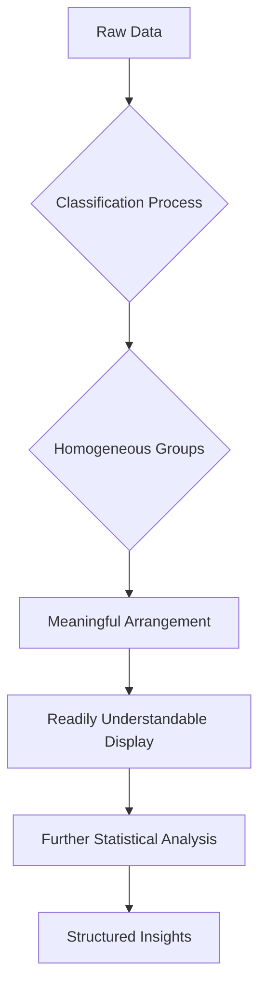
*Note: This `graph TD` illustrates the sequential flow from raw data through classification and presentation to derive structured insights, highlighting the transformative process.*

## Context & Framework
#### The Data's Journey: From Chaos to Clarity
The process of classification and presentation of statistical data is the crucial intermediate step in the statistical investigation, bridging the gap between raw data collection and advanced analytical techniques. When data is first collected, it is often in an "ungrouped" or "unorganized" form, making it difficult to discern patterns or draw conclusions. Classification serves to impose order on this chaos by identifying inherent similarities among data points, grouping them logically. Following this, presentation translates these organized groups into visual or tabular formats that enhance comprehensibility and highlight key features. This structured approach is fundamental for validating initial hypotheses, communicating findings to non-experts, and preparing data for more sophisticated statistical modeling.

## The Mastery Deep Dive
#### The Exploded View: Components of Organization
The overall process of data organization can be viewed as having two main components: classification and tabulation. Classification is the conceptual act of sorting data based on attributes like time, location, or descriptive characteristics. Tabulation is the practical act of arranging this classified data into tables, such as frequency distributions, to quantify the occurrences within each group. Furthermore, within presentation, the choice of graphical representation (e.g., bar chart, histogram) is critical, as each serves to highlight different aspects of the data. For instance, a histogram effectively visualizes the distribution of continuous data, while a bar chart is better suited for discrete or categorical comparisons.

#### The Art of Data Storytelling
Effective data presentation is not merely about displaying numbers; it's about telling a clear, compelling story with data. The initial raw data holds many potential narratives, but without proper classification, these stories remain hidden. By strategically grouping data (e.g., by age group, by sales quarter), and then choosing appropriate visual aids (e.g., line graph for trends, pie chart for proportions), the data architect guides the audience to understand the most significant patterns and relationships. This active storytelling is critical for converting complex statistical outputs into understandable and actionable insights for decision-makers.

## Constraints & Limitations
#### The Engineering Trade-off: Loss of Granularity
While classification and presentation are essential for clarity, they inherently involve a trade-off: a certain degree of data granularity is lost. When raw data points are grouped into classes (e.g., ages 20-29), the individual identities of the original data points within that class are obscured. This can sometimes limit the depth of subsequent analysis if very specific individual data points are needed. Additionally, poorly chosen classification criteria or inappropriate presentation methods can lead to misrepresentation, distorting the true nature of the data and potentially leading to incorrect conclusions. Developers must balance the need for simplification with the risk of oversimplification, always considering the potential for misinterpretation.

## Significance & Application
Classification and presentation are foundational to all statistical inquiries. They are the initial steps that transform raw observations into interpretable patterns, enabling everything from simple descriptive statistics to complex inferential analysis. In **scientific research**, they allow researchers to organize experimental results to identify significant findings. In **business intelligence**, these techniques structure sales, marketing, and operational data, providing the basis for strategic decision-making. For **public policy**, data on demographics, health, or economic indicators must be classified and presented to inform government planning and resource allocation. Mastery of these processes is indispensable for anyone working with data.

## The Worked Example
*Test your mastery. Cover the solutions below to test yourself first.*

Consider a raw dataset of the number of siblings reported by 15 students: 1, 0, 2, 1, 3, 0, 1, 1, 2, 4, 0, 1, 2, 1, 3.

**Goal:** Classify and present this raw data into a simple, organized format.

**Step 1: Classification**
Identify common characteristics: The data points are counts of siblings. We can group identical counts together.

**Step 2: Tabulation (Creating an Ungrouped Frequency Distribution)**
We will count how many times each number of siblings appears.

| Number of Siblings (x) | Tally | Frequency (f) |
| :
--------------------- | :
---- | :
------------ |
| 0                      | |||   | 3             |
| 1                      | ||||| | 6             |
| 2                      | |||   | 3             |
| 3                      | ||    | 2             |
| 4                      | |     | 1             |
| **Total**              |       | **15**        |

**Step 3: Presentation (Using a Vertical Line Graph - Mental Model)**
Although we don't draw it, mentally visualize a vertical line graph where the x-axis represents the 'Number of Siblings' and the y-axis represents 'Frequency'. Each number of siblings (0, 1, 2, 3, 4) would have a vertical line extending upwards corresponding to its frequency. For example, a line for '1 sibling' would extend to a height of 6.

**Why this works:**
*   **Classification:** Grouped similar data (number of siblings).
*   **Presentation:** The frequency table organizes the counts, making it immediately clear that having 1 sibling is the most common, and having 4 siblings is the least common among this sample. A mental image of a vertical line graph further enhances this understanding.

## The Proving Ground
*Test your mastery. Cover the solutions below to test yourself first.*

#### Level 1: The Sanity Check (Verification)
**The Fact Check:** A dataset contains information on employee salaries, departments, and years of experience. Define what classification means in the context of organizing this data.
> **Solution:** Classification is the process of arranging the raw employee data into homogeneous or similar groups based on common characteristics, such as grouping employees by department, salary ranges, or experience levels.

#### Level 2: The Crucible (Mastery & Edge Cases)
**The Impostor:** A data analyst presents a spreadsheet of raw survey responses, claiming they have "classified" the data by simply listing all the responses under their respective survey questions. Critically evaluate this claim, referencing the core principles of classification and presentation, and explain why this is an "impostor" classification.
> **Solution:** This is an "impostor" classification. Simply listing raw responses under survey questions is mere data collection, not classification. True classification, as defined, requires *arranging data into homogeneous groups based on common characteristics* to enable meaningful analysis and presentation. The analyst has not grouped similar responses, identified patterns, or transformed the chaotic raw data into a structured, readily understandable form. The essential step of identifying shared attributes and creating categories is missing, leaving the data unorganized for "further statistical analysis," which is the ultimate goal of classification.

## Key Takeaways
*   Classification transforms raw, unorganized data into homogeneous groups, making it amenable to analysis.
*   Presentation techniques (e.g., tables, graphs) display classified data in a clear and understandable manner.
*   The entire process is crucial for extracting insights, identifying patterns, and effectively communicating statistical information.

## Knowledge Graph Connections
| Concept                     | Connection / Relationship                                                          |
| :
-------------------------- | :
--------------------------------------------------------------------------------- |
| Data_Collection         | Classification is the next logical step after the initial collection of raw data.  |
| Statistical_Analysis    | Proper classification and presentation are prerequisites for meaningful statistical analysis. |
| [[Frequency_Distributions]] | A primary method of presenting classified data in a tabular format.              |
| [[Other_Graphical_Representations_of_Statistical_Data]] | Classification provides the organized input for various graphical presentations. |
---

---

## Frequency Distributions


## Definition
Before proceeding, ensure you master [[Classification_and_Presentation_of_Statistical_Data]] and [[Quantitative_Classification]].
Frequency Distributions are tabular representations of quantitatively classified data, showing the number of times each distinct value (or range of values) of a variable occurs in a dataset. They systematically arrange data to show how frequently each score or item appears. Think of it like a voter count: a frequency distribution would show how many votes each candidate received, or how many people voted in each age bracket.

## The Mental Model
Imagine you've given a quiz to a class, and you have a long list of scores (e.g., 7, 8, 5, 7, 9, 6...). To make sense of this raw data, you create a frequency distribution. You list each possible score (e.g., 5, 6, 7, 8, 9, 10) and then count how many students received each score. This immediately tells you, "Ah, 5 students got a 7, and only 1 student got a 10." This mental organization reveals patterns in performance that were hidden in the raw list.

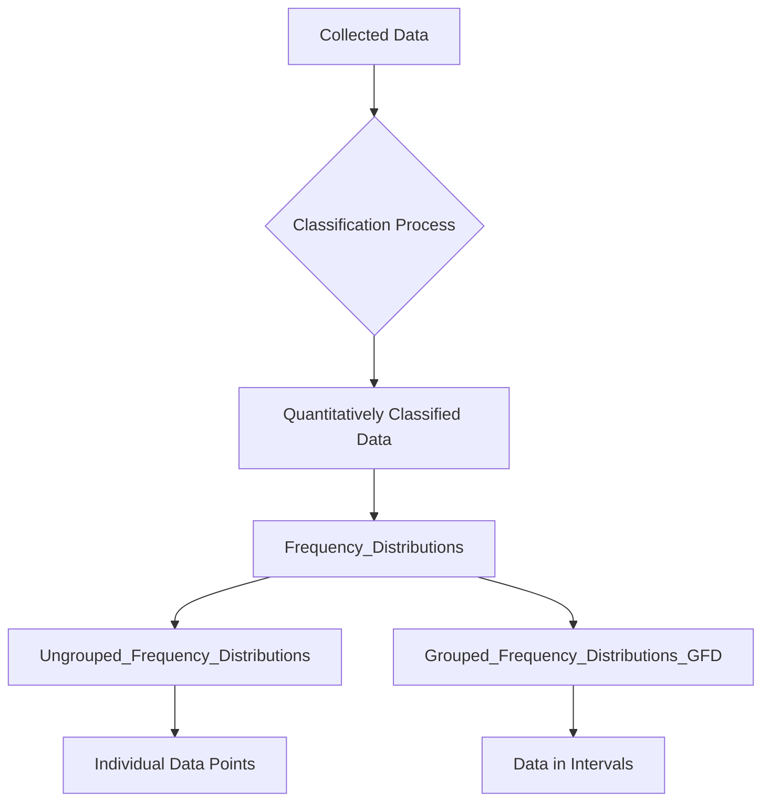
*Note: This `graph TD` illustrates the process from collected data through classification to the two main types of frequency distributions: ungrouped for individual points and grouped for intervals.*

## Context & Framework
#### The Family Tree
Frequency distributions form a crucial branch within the "family tree" of data Presentation_Of_Statistical_Data, specifically for quantitatively classified data. They serve as the foundational step before creating many graphical representations like histograms or frequency polygons. There are two main types: [[Ungrouped_Frequency_Distributions]] for individual data points and [[Grouped_Frequency_Distributions_(GFD)]] for data organized into intervals. This framework provides a clear, concise summary of data, revealing the shape, spread, and central tendency of a dataset at a glance, and is essential for both descriptive and inferential statistics.

## The Mastery Deep Dive
#### The Exploded View: Components of a Distribution
A frequency distribution, at its core, "explodes" a dataset into its constituent values and their respective counts. For an ungrouped distribution, this means listing every distinct data point ($x$) and its associated frequency ($f$). For a grouped distribution, it involves defining [[Class_Limits]], [[Class_Boundaries]], and a [[Class_Mark]] for each interval, along with the frequency for that interval. This detailed breakdown allows statisticians to observe not just the most common values, but also the range of values, the presence of outliers, and the symmetry or skewness of the data's spread. Understanding these components is critical for constructing accurate and informative distributions.

#### Analyzing the Data's Signature
Beyond simple counts, a frequency distribution allows for the analysis of the data's "signature." By examining the frequencies, one can identify the mode (most frequent value), get a sense of the spread (range of values), and infer the approximate central tendency. For example, a distribution heavily concentrated at one end suggests a skewed dataset, while a distribution with frequencies spread evenly across values indicates uniformity. This qualitative analysis of the frequency pattern is invaluable for understanding the underlying characteristics of the data before applying more complex statistical measures.

## Constraints & Limitations
#### The Engineering Trade-off: Loss of Individual Identity
A significant limitation, particularly with [[Grouped_Frequency_Distributions_GFD]], is the "loss of individual identity." Once raw data points are grouped into classes, the specific values of individual observations within a class are no longer known. For example, if a class interval is 10-19 with a frequency of 5, we know five observations fall into this range, but not their exact values (e.g., were they all 10s, all 19s, or spread evenly?). This "engineering trade-off" enhances readability and manageability for large datasets but sacrifices the granularity of the original data, which can limit certain types of detailed analysis.

## Significance & Application
Frequency distributions are the backbone of descriptive statistics. In **education**, they summarize student test scores, showing grade distributions. In **market research**, they tabulate customer demographics like age groups or income brackets. In **manufacturing**, they track the frequency of defects or product sizes. **Public health** uses them to count disease cases by age or geographical region. They provide the most basic yet powerful way to summarize raw data, making it comprehensible and facilitating subsequent calculations of measures of central tendency and dispersion.

## The Worked Example
*Test your mastery. Cover the solutions below to test yourself first.*

Consider the following raw data representing the number of daily sales calls made by 10 sales representatives: 12, 15, 12, 18, 15, 12, 19, 15, 18, 12.

**Goal:** Construct a frequency distribution for this data.

**Step 1: Identify Distinct Values**
The distinct values for the number of calls are 12, 15, 18, and 19.

**Step 2: Count Frequencies for Each Value**
*   12: Appears 4 times
*   15: Appears 3 times
*   18: Appears 2 times
*   19: Appears 1 time

**Step 3: Tabulate the Frequency Distribution**

| Number of Calls (x) | Frequency (f) |
| :
------------------ | :
------------ |
| 12                  | 4             |
| 15                  | 3             |
| 18                  | 2             |
| 19                  | 1             |
| **Total**           | **10**        |

**Why this works:**
*   **Classification:** The data is implicitly classified by the number of calls made.
*   **Presentation:** The frequency distribution table clearly shows how often each specific number of calls occurred, instantly revealing that 12 calls were the most frequent.

## The Proving Ground
*Test your mastery. Cover the solutions below to test yourself first.*

#### Level 1: The Sanity Check (Verification)
**The Fact Check:** What is the primary purpose of a frequency distribution in statistics?
> **Solution:** The primary purpose of a frequency distribution is to organize and summarize quantitatively classified data by showing the number of times each distinct value or range of values occurs in a dataset.

#### Level 2: The Crucible (Mastery & Edge Cases)
**The Impostor:** A market research report displays a list of the top 5 most popular car brands sold last month, along with the total revenue generated by each. The analyst claims this list is a "frequency distribution." Explain why this is an "impostor" frequency distribution and what essential component is missing to truly make it one.
> **Solution:** This is an "impostor" frequency distribution. While it presents data about car brands, it lacks the essential component of showing the *frequency of occurrence* (i.e., the *number of cars sold* for each brand). Instead, it shows "total revenue," which is an aggregate measure, not a count of individual occurrences. To be a true frequency distribution, it would need to list each car brand and the *number of units sold* (or the frequency of purchases for each brand), showing how often each category appeared in the sales data.

## Key Takeaways
*   Frequency distributions are tabular summaries of how often each data value or range occurs.
*   They are fundamental for organizing quantitative data into a meaningful and understandable form.
*   There are two main types: ungrouped for individual values and grouped for intervals.

## Knowledge Graph Connections
| Concept                                      | Connection / Relationship                                                          |
| :
------------------------------------------- | :
--------------------------------------------------------------------------------- |
| [[Classification_and_Presentation_of_Statistical_Data]] | Frequency distributions are a key method for presenting classified statistical data. |
| [[Quantitative_Classification]]              | They are specifically used to tabulate data that has been quantitatively classified. |
| [[Ungrouped_Frequency_Distributions]]        | A specific type of frequency distribution for individual data points.            |
| [[Grouped_Frequency_Distributions_GFD]]    | A specific type of frequency distribution for data grouped into intervals.       |
---

---

## Other Graphical Representations Of Statistical Data


## Definition
Before proceeding, ensure you master [[Classification_and_Presentation_of_Statistical_Data]] and [[Frequency_Distributions]].
Other Graphical Representations of Statistical Data refers to the diverse range of visual tools, beyond basic frequency distributions and histograms, used to display classified data in a clear, concise, and meaningful way. These include [[Vertical_Line_Graph]]s, [[Line_Graph]]s, [[Bar_Chart]]s (simple, multiple, subdivided, percentage component), [[Pie_Chart]]s, and [[Pictograms]]. Each type is designed to highlight different aspects of data, such as trends over time, comparisons between categories, or proportions of a whole. Think of it as a toolbox filled with different visual instruments, each suited for a particular kind of data story.

## The Mental Model
Imagine you're an architect designing a building. You wouldn't use only blueprints; you'd use floor plans, elevation drawings, 3D renderings, and even miniature models. Each representation highlights a different aspect of the building, providing a comprehensive understanding. Similarly, when presenting data, "other graphical representations" are your architectural tools. You choose a [[Line_Graph]] for trends over time, a [[Bar_Chart]] for comparing categories, or a [[Pie_Chart]] for showing parts of a whole, ensuring the clearest possible visual narrative for your data.

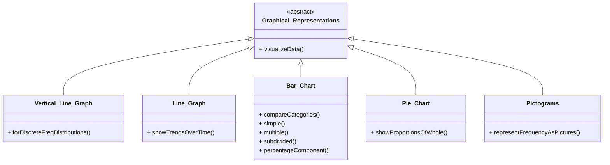
*Note: This `classDiagram` illustrates the hierarchical relationship between general graphical representations and specific types like vertical line graphs, line graphs, bar charts, pie charts, and pictograms, highlighting their distinct functionalities for data visualization.*

## Context & Framework
#### The Cookie Cutter: Why We Reuse Shapes
The concept of "other graphical representations" embodies the "cookie cutter" principle: why we reuse shapes or patterns for specific types of data. Each graph type (e.g., [[Vertical_Line_Graph]] for discrete frequency, [[Line_Graph]] for time series) acts as a specialized "cookie cutter" designed to optimally present certain data structures. This standardization ensures consistency and allows users to quickly interpret common data patterns. For example, a [[Bar_Chart]] is consistently used to compare distinct categories because its visual layout naturally facilitates such comparisons, making the process of data visualization efficient and universally understood. Understanding these established "shapes" is key to effective and unbiased data communication.

## The Mastery Deep Dive
#### The Exploded View: Purpose-Driven Visual Elements
An "exploded view" of these various graphical representations reveals that each is built from purpose-driven visual elements.
*   [[Vertical_Line_Graph]]: Emphasizes discrete values and their exact frequencies with distinct vertical lines.
*   [[Line_Graph]]: Connects data points over time, highlighting trends and changes with its continuous line.
*   [[Bar_Chart]]: Uses the length of bars to compare magnitudes of different categories, often with gaps between bars. Its subtypes (multiple, subdivided, percentage component) add layers for complex comparisons.
*   [[Pie_Chart]]: Divides a circle into sectors, where each sector's area represents a proportion of the whole, ideal for showing composition.
*   [[Pictograms]]: Uses repetitive symbols to represent frequencies, often for engaging a broader audience.
Each element is strategically chosen to convey specific data relationships, making the graph a highly efficient communication tool.

#### The Makeover: Fixing the Ugly Version
These graphical representations often serve as the "makeover" for "ugly" or raw data, transforming complex tables into intuitive visuals. For instance, a long table of sales figures over five years might be "ugly," but a [[Line_Graph]] gives it a beautiful makeover, immediately revealing growth, decline, or seasonality. Similarly, a list of product defects by type is dry, but a [[Pie_Chart]] quickly shows which defect is the largest proportion, drawing attention to critical areas. The "makeover" involves choosing the right graph to highlight the most important story in the data, enhancing understanding and engagement.

## Constraints & Limitations
#### The Engineering Trade-off: Potential for Misrepresentation
A significant "engineering trade-off" with "other graphical representations" is their inherent "potential for misrepresentation." While powerful, poorly designed graphs can easily distort data, mislead viewers, or obscure crucial information. For instance, a [[Bar_Chart]] with a truncated y-axis can exaggerate differences, while a [[Pie_Chart]] with too many slices becomes unreadable. This means that while these tools offer great expressive power, they demand ethical and skillful application. The designer must consciously avoid manipulating visual cues (e.g., scale, color, order) that could lead to biased or inaccurate interpretations, ensuring the graph tells a true and fair story.

## Significance & Application
These "other graphical representations" are vital for effective data communication across all disciplines. [[Line_Graph]]s track stock prices, temperature changes, or population growth. [[Bar_Chart]]s compare sales figures by product, student counts by major, or votes by candidate. [[Pie_Chart]]s show market share, budget allocation, or demographic proportions. [[Pictograms]] are often used for simplified public statistics. Each graph serves a unique purpose, making complex datasets accessible, highlighting patterns and trends, and supporting evidence-based decision-making for diverse audiences. Mastery of these tools is crucial for any data communicator.

## The Worked Example
*Test your mastery. Cover the solutions below to test yourself first.*

Consider a dataset showing the number of students who chose different majors in a university.

| Major           | Number of Students |
| :
-------------- | :
----------------- |
| Computer Science | 200                |
| Business        | 150                |
| Engineering     | 100                |
| Arts            | 50                 |
| **Total**       | **500**            |

**Goal:** Choose an appropriate graphical representation to show the proportion of students in each major and explain why.

**Step 1: Analyze Data Type and Goal**
The data is categorical (majors) and the goal is to show parts of a whole (proportion of students in each major relative to the total).

**Step 2: Choose Appropriate Graph**
A [[Pie_Chart]] is the most appropriate graphical representation for showing parts of a whole or the composition of a total, as it visually divides a circle into sectors proportional to each category's contribution.

**Step 3: Calculate Angles for Pie Chart (Mental Model)**
*   Total Students = 500
*   Computer Science: (200/500) * 360° = 144°
*   Business: (150/500) * 360° = 108°
*   Engineering: (100/500) * 360° = 72°
*   Arts: (50/500) * 360° = 36°

**Why this works:**
*   **Proportional Representation:** The [[Pie_Chart]] effectively visualizes each major's share of the total student body, making it immediately clear which major is largest and how the others compare proportionally.
*   **Clarity:** The visual sectors directly translate to the percentage contribution of each category, which is the exact goal.

## The Proving Ground
*Test your mastery. Cover the solutions below to test yourself first.*

#### Level 1: The Sanity Check (Verification)
**The Element ID:** Which graphical representation is best suited for showing trends or changes in a variable over time?
> **Solution:** A [[Line_Graph]] is best suited for showing trends or changes in a variable over time.

#### Level 2: The Crucible (Mastery & Edge Cases)
**The "Grandma Test":** A political candidate wants to show that support for them has dramatically increased from 5% to 10% in two months. They present a [[Bar_Chart]] where the y-axis starts at 4% and goes up to 10%, making the 10% bar appear twice as tall as the 5% bar. Explain why this graph, despite using "other graphical representations," fails the "Grandma Test" for honest communication and constitutes a form of visual misrepresentation.
> **Solution:** This [[Bar_Chart]] fails the "Grandma Test" for honest communication and constitutes visual misrepresentation because of a truncated y-axis. By starting the y-axis at 4% instead of 0%, the visual difference between 5% and 10% is exaggerated. While 10% is indeed double 5%, the graph makes the *increase* look disproportionately larger than it is in absolute terms, misleading the viewer into perceiving a more dramatic surge in support than occurred. A truthful [[Bar_Chart]] should always start its quantitative axis at zero to ensure visual representation is proportional to the actual data values, enabling fair comparison and clear comprehension without distortion.

## Key Takeaways
*   Diverse graphical representations exist to effectively display different aspects of classified data.
*   Each graph type (line, bar, pie, pictogram) is chosen based on the data's nature and the message to convey.
*   Careful and ethical application of these tools is crucial to avoid misrepresentation and ensure clarity.

## Knowledge Graph Connections
| Concept                                      | Connection / Relationship                                                          |
| :
------------------------------------------- | :
--------------------------------------------------------------------------------- |
| [[Classification_and_Presentation_of_Statistical_Data]] | This concept encompasses the wide array of visual tools for presenting classified data. |
| [[Vertical_Line_Graph]]                      | A specific graphical representation for discrete frequency distributions.          |
| [[Line_Graph]]                               | A specific graphical representation for displaying trends over time.               |
| [[Bar_Chart]]                                | A specific graphical representation for comparing categories (with various subtypes). |
| [[Pie_Chart]]                                | A specific graphical representation for showing proportions of a whole.            |
| [[Pictograms]]                               | A specific graphical representation using symbols to denote frequencies.           |
---

---

## Chronological Classification


## Definition
Before proceeding, ensure you master [[Classification_and_Presentation_of_Statistical_Data]] and Data_Collection.
Chronological Classification is the process of arranging collected statistical data based on their time of occurrence. This type of classification is used when data changes or evolves over a period, creating a time series. It's like organizing your daily schedule, where each event is placed in order from earliest to latest (or vice versa) to show a sequence of activities over time.

## The Mental Model
Imagine you're tracking your personal fitness goals: daily step counts, weekly workout hours, or monthly weight changes. You don't just list these numbers randomly; you record them by date. This ordered sequence allows you to see trends: "Did my steps increase over the last month?" or "Is my weight going down over time?" The chronological classification is the method by which you organize this data, making it easy to spot progress, plateaus, or declines over specific periods.

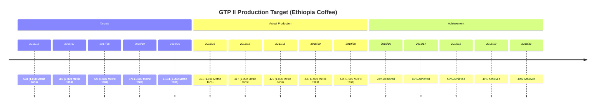
*Note: This `timeline` diagram visually represents the chronological classification of coffee production targets, actual production, and achievement percentages over different years, highlighting trends and progress.*

## Context & Framework
#### Where Does it Live? (The Map)
Chronological classification, akin to placing events on a linear map, focuses on the temporal dimension of data. It is inherently suitable for phenomena that are observed or measured at different points in time, such as population changes, economic indicators (e.g., inflation, GDP), sales figures, or climate data. The series obtained from this classification is known as a [[Time_Series]], which can be arranged in ascending order (earliest to latest) or descending order (latest to earliest). This framework provides a critical perspective for identifying trends, seasonality, cyclical patterns, and irregular fluctuations in data, which are essential for forecasting and historical analysis.

## The Mastery Deep Dive
#### Who are the Neighbors? (Contextual Relationships)
In chronological classification, the "neighbors" are the data points immediately preceding and succeeding a given observation. Understanding these relationships is crucial because the value of a variable at one point in time is often influenced by its past values. For instance, classifying monthly sales data chronologically allows us to see how January's sales relate to December's, or how a quarter's performance compares to the previous one. This temporal proximity helps in identifying growth, decline, or stability, and can reveal the impact of events that occurred at specific times. Analyzing these relationships is key to understanding dynamics and making predictions about future trends.

#### The Historical Blueprint: Detailed Time Intervals
A deeper dive into chronological classification involves carefully selecting and defining time intervals. This could range from macro-level classifications like decades or centuries, to micro-level classifications such as years, quarters, months, weeks, days, or even hours. The choice of interval depends on the phenomenon being studied; for instance, stock market data might require daily or hourly classification, while demographic shifts might be analyzed annually or biennially. This "historical blueprint" enables fine-grained analysis of temporal patterns, allowing for the detection of subtle shifts, short-term trends, and the precise timing of significant events that influence the data.

## Constraints & Limitations
#### The Engineering Trade-off: Data Gaps
A significant challenge in chronological classification is dealing with "data gaps" or missing observations for certain time periods. If data is not consistently collected at regular intervals, it can distort trends, make accurate comparisons difficult, and introduce biases into any analysis. Interpolating missing data can introduce inaccuracies, while simply omitting incomplete periods can lead to a skewed view of the overall trend. This requires careful management and transparency regarding the completeness of the time series data. Furthermore, for very long time series, consistency in data collection methods over time can also become a limiting factor.

## Significance & Application
Chronological classification is fundamental for understanding dynamics and forecasting. In **finance**, it's used to analyze stock market performance, economic indicators, and investment returns over time. **Businesses** track sales, customer growth, and operational costs chronologically to identify trends and plan for the future. **Climate scientists** use time-series data to study long-term environmental changes. For **public health**, the chronological classification of disease incidence helps in monitoring outbreaks and evaluating intervention effectiveness. This method provides the critical temporal context necessary for virtually any data that evolves over time.

## The Worked Example
*Test your mastery. Cover the solutions below to test yourself first.*

Consider a simplified dataset of the average monthly temperature (in °C) for a city over six months:

*   January: 5°C
*   February: 7°C
*   March: 10°C
*   April: 14°C
*   May: 18°C
*   June: 22°C

**Goal:** Apply chronological classification to this data and present it clearly.

**Step 1: Classification**
The data is already inherently classified by its time of occurrence (month). The task is to organize and present these temporal groups.

**Step 2: Tabulation**
We can arrange this data into a simple table, listing each month in sequence and its corresponding average temperature.

| Month   | Average Temperature (°C) |
| :
------ | :
----------------------- |
| January | 5                        |
| February | 7                        |
| March   | 10                       |
| April   | 14                       |
| May     | 18                       |
| June    | 22                       |

**Step 3: Presentation (Mental Model of a Line Graph)**
Mentally, you would visualize a line graph where the x-axis represents the 'Month' (January to June) and the y-axis represents the 'Average Temperature'. A line would connect the temperature points for each month. This visual immediately reveals an upward trend in temperature over these months, indicating a seasonal change.

**Why this works:**
*   **Classification:** Grouped data by a chronological characteristic (month).
*   **Presentation:** The table and conceptual line graph clearly show the progression and trend of temperature over time, making temporal patterns easy to discern.

## The Proving Ground
*Test your mastery. Cover the solutions below to test yourself first.*

#### Level 1: The Sanity Check (Verification)
**The Element ID:** A historian compiles a list of major world events, ordered from the earliest to the most recent. Is this an example of chronological classification?
> **Solution:** Yes, this is an example of chronological classification because the events are arranged based on their time of occurrence.

#### Level 2: The Crucible (Mastery & Edge Cases)
**The Disaster Drill:** A researcher is analyzing the annual rainfall data for a specific region over 50 years. Due to record-keeping issues, data for five non-consecutive years is completely missing. If the researcher proceeds with a chronological classification that simply omits these missing years without acknowledgment, explain how this could lead to a "disaster drill" in interpreting long-term climate trends. What immediate recovery step should be taken?
> **Solution:** Omitting missing years without acknowledgment in a chronological classification creates a "disaster drill" by distorting the perceived continuity and rate of change in rainfall. Trends might appear steeper or flatter than they truly are, and significant climatic events could be misrepresented or missed entirely due to the artificial compression of the timeline. The immediate recovery step is to explicitly identify and flag the missing data points (e.g., using placeholders or footnotes) and, if possible, attempt to find alternative sources or use imputation techniques, while clearly stating the limitations of such methods. Transparency about data gaps is crucial for preventing misinterpretation.

## Key Takeaways
*   Chronological classification organizes data based on the time of its occurrence, creating a time series.
*   It is essential for analyzing trends, seasonality, and changes in phenomena over time.
*   Careful attention must be paid to data completeness and consistent time intervals to avoid misrepresentation.

## Knowledge Graph Connections
| Concept                                      | Connection / Relationship                                                          |
| :
------------------------------------------- | :
--------------------------------------------------------------------------------- |
| [[Classification_and_Presentation_of_Statistical_Data]] | A fundamental type of classification for organizing raw data.                       |
| [[Time_Series]]                              | The resulting ordered sequence of data when applying chronological classification.  |
| [[Line_Graph]]                               | The most common graphical representation for data classified chronologically.     |
| [[Other_Graphical_Representations_of_Statistical_Data]] | Forms the basis for various time-based charts and graphs.                           |
---

---

## Qualitative Classification


## Definition
Before proceeding, ensure you master [[Classification_and_Presentation_of_Statistical_Data]] and Data_Collection.
Qualitative Classification is the process of arranging statistical data based on certain descriptive characters or qualitative aspects of a phenomenon. These characteristics are non-numerical and cannot be measured numerically but can be categorized. Examples include sex, citizenship, qualification, marital status, religion, color, or opinion. It's like sorting people by hair color or favorite genre of music; you group them based on attributes that describe them rather than numbers.

## The Mental Model
Imagine you're a casting director for a play. You receive applications from many actors. You don't just list them; you classify them. You might group them by "Gender" (Male/Female/Non-binary), "Ethnicity" (various categories), or "Hair Color" (Blonde/Brunette/Black/Red). These are all qualitative characteristics. This classification helps you quickly see the composition of your applicant pool based on descriptive traits, rather than numerical data.

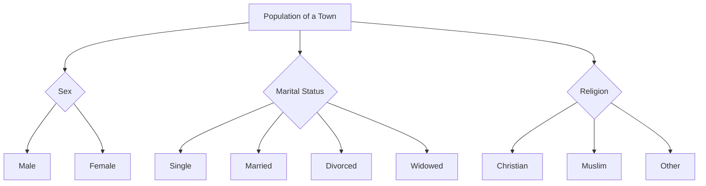
*Note: This `graph TD` illustrates the hierarchical classification of a town's population based on qualitative characteristics such as sex, marital status, and religion.*

## Context & Framework
#### The Family Tree
Qualitative classification establishes a "family tree" based on non-numerical attributes. It's used when the distinguishing feature of the data is descriptive rather than measurable. For example, when analyzing customer feedback, responses might be classified by "Sentiment" (Positive, Negative, Neutral) or by "Type of Issue" (Billing, Technical Support, Product Feature). This framework is essential in social sciences, marketing, and human resources, where understanding attributes that define categories rather than quantities is paramount. It allows for the exploration of thematic patterns and the composition of groups based on shared characteristics.

## The Mastery Deep Dive
#### The Exploded View: Levels of Detail in Qualitative Attributes
Qualitative attributes can exist at different levels of detail, which impacts how they are classified. A simple classification might group people by 'Marital Status' (Single, Married). A more detailed "exploded view" might further subdivide 'Married' into 'Legally Registered Couples' or 'Common-Law'. Similarly, 'Qualification' could be a broad category, but within that, 'High School Diploma', 'Bachelor's Degree', and 'Master's Degree' offer a finer classification. The choice of detail depends on the research question; a broader view provides an overview, while a more granular view reveals specific sub-groups within a qualitative category.

#### The Nuance of Descriptive Grouping
Deeper engagement with qualitative classification involves recognizing the nuances and potential ambiguities in descriptive grouping. For instance, categories like "qualification" might seem straightforward, but if a dataset includes international qualifications, establishing equivalent categories requires careful consideration. Unlike numerical data where 20 is always 20, qualitative terms can have shades of meaning or cultural context. The skill lies in defining categories that are mutually exclusive (an item belongs to only one category) and exhaustive (all items can be placed in a category), ensuring that the descriptive groupings accurately reflect the underlying phenomenon and avoid overlap or ambiguity.

## Constraints & Limitations
#### The Engineering Trade-off: Subjectivity and Ambiguity
A significant limitation of qualitative classification is the potential for subjectivity and ambiguity in defining categories. Unlike quantitative data, which has objective numerical values, descriptive characteristics can sometimes be open to interpretation. For example, classifying "customer satisfaction" as "High," "Medium," or "Low" can vary from one person's judgment to another without clear criteria. This can lead to inconsistencies in classification and affect the reliability of the analysis. Ensuring clear, well-defined, and mutually exclusive categories is crucial to mitigate this trade-off, but it often requires careful operationalization of the qualitative attributes.

## Significance & Application
Qualitative classification is indispensable for understanding populations, markets, and social phenomena. In **demography**, it helps in analyzing population structures based on gender, ethnicity, or religion. **Marketing research** uses it to segment customers by lifestyle, preferences, or brand loyalty. **Sociologists** classify survey respondents by socio-economic status or educational background. In **human resources**, employees might be classified by job role, department, or performance rating. This method provides rich, descriptive insights into the characteristics of groups, enabling targeted strategies and a deeper understanding of non-numerical attributes.

## The Worked Example
*Test your mastery. Cover the solutions below to test yourself first.*

Consider a simplified dataset of marital status for 50 employees in a factory:
*   Single: 26
*   Married: 43
*   Divorced: 11
*   Widowed: 8
*   Legally registered couples: 5

**Goal:** Apply qualitative classification to this data and present it clearly.

**Step 1: Classification**
The data is already classified by the qualitative characteristic of "Marital Status." The task is to organize and present these descriptive groups.

**Step 2: Tabulation**
We arrange this data into a table, listing each marital status and its corresponding number of employees. Note: "Married" and "Legally registered couples" represent overlapping categories in the raw data, which needs to be addressed for mutually exclusive classification. Assuming "Legally registered couples" is a subset of "Married" or a more specific category within it, for simplicity, we'll maintain the given categories as distinct counts in this example, but in a real scenario, this would require clarification from the source. For this example, we treat "Married" and "Legally registered couples" as potentially distinct reporting categories based on the source material.

| Marital Status           | Number of Employees |
| :
----------------------- | :
------------------ |
| Married                  | 43                  |
| Single                   | 26                  |
| Divorced                 | 11                  |
| Widowed                  | 8                   |
| Legally registered couples | 5                   |

**Step 3: Presentation (Mental Model of a Bar Chart)**
Mentally, you would visualize a bar chart where the x-axis represents the 'Marital Status' categories and the y-axis represents the 'Number of Employees'. Each category would have a bar corresponding to its frequency. This visual quickly shows which marital status is most common among the employees.

**Why this works:**
*   **Classification:** Grouped data by a qualitative characteristic (marital status).
*   **Presentation:** The table and conceptual bar chart clearly show the distribution of employees across different marital statuses, providing descriptive insights into the workforce.

## The Proving Ground
*Test your mastery. Cover the solutions below to test yourself first.*

#### Level 1: The Sanity Check (Verification)
**The Fact Check:** A survey asks respondents to indicate their favorite color from a list of options. Is the data collected for "favorite color" suitable for qualitative classification?
> **Solution:** Yes, "favorite color" is a descriptive, non-numerical characteristic, making it perfectly suitable for qualitative classification.

#### Level 2: The Crucible (Mastery & Edge Cases)
**The Impostor:** A health researcher classifies patient pain levels using a scale of 1 to 10, where 1 is "no pain" and 10 is "excruciating pain." The researcher claims this is a qualitative classification because it describes the *quality* of pain. Explain why this is an "impostor" qualitative classification and what its true nature is.
> **Solution:** This is an "impostor" qualitative classification. While pain *quality* is a descriptive concept, using a numerical scale from 1 to 10 makes this fundamentally a [[Quantitative_Classification]]. The numbers (1 to 10) have an inherent order and can be compared (e.g., 5 is more pain than 3), even if the intervals aren't necessarily equal (it's an ordinal scale). The true nature is quantitative, as the classification is based on numerical values, despite those values representing a qualitative experience. A genuinely qualitative classification for pain might use non-numerical categories like "Mild," "Moderate," and "Severe" without assigning numerical ranks.

## Key Takeaways
*   Qualitative classification organizes data based on descriptive, non-numerical characteristics.
*   It is crucial for understanding attributes like sex, marital status, religion, or opinions.
*   Careful definition of mutually exclusive and exhaustive categories is vital to avoid subjectivity and ambiguity.

## Knowledge Graph Connections
| Concept                                      | Connection / Relationship                                                          |
| :
------------------------------------------- | :
--------------------------------------------------------------------------------- |
| [[Classification_and_Presentation_of_Statistical_Data]] | A fundamental type of classification used to organize raw data.                       |
| [[Quantitative_Classification]]              | Often contrasted with qualitative classification, which focuses on numerical attributes. |
| [[Bar_Chart]]                                | A common graphical representation for displaying qualitative data frequencies.     |
| [[Pie_Chart]]                                | Another common graphical representation for showing proportions of qualitative categories. |
---

---

## Quantitative Classification


## Definition
Before proceeding, ensure you master [[Classification_and_Presentation_of_Statistical_Data]] and Data_Collection.
Quantitative Classification is the process of arranging collected statistical data based on certain quantifiable variables, meaning characteristics that can be expressed as numbers. These variables represent measurable quantities such as marks, income, expenditure, profit, loss, height, weight, age, price, or production. It's like sorting students by their exam scores or employees by their salary; you group them based on numerical values.

## The Mental Model
Imagine you're managing a shop and tracking daily sales. You wouldn't classify sales by "good" or "bad"; instead, you'd group them by numerical ranges: "$0-$100," "$101-$500," "$501-$1000," etc. This allows you to see how many days fall into each sales bracket, identifying patterns in revenue generation. Quantitative classification is the underlying method that enables you to categorize and understand data based purely on its numerical value.

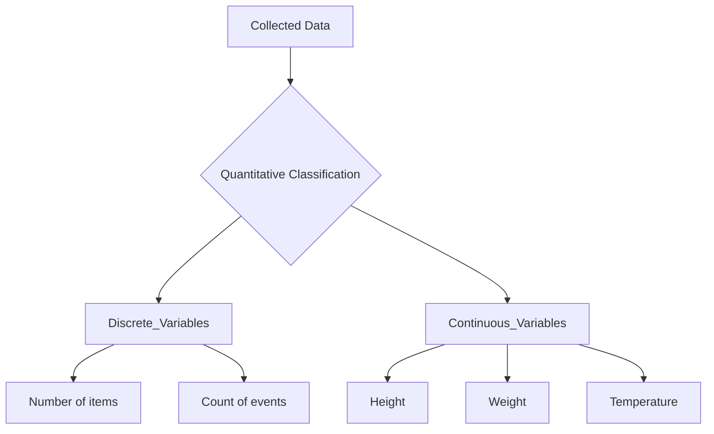
*Note: This `graph TD` illustrates the primary subdivision of quantitative classification into discrete and continuous variables, with examples for each, showing a hierarchical grouping of numerical data.*

## Context & Framework
#### The Family Tree
Quantitative classification creates a "family tree" where branches are defined by numerical ranges or values. This method is used when the characteristics being studied are inherently numerical and measurable, allowing for precise grouping. For example, classifying students by "Age" into categories like "18-20," "21-23," and so on, or classifying products by "Price Range." This framework is fundamental in economics, finance, engineering, and the natural sciences, where precise measurement and numerical comparison are critical. It allows for the analysis of distributions, central tendencies, and variations within numerical datasets.

## The Mastery Deep Dive
#### The Exploded View: Precision in Numerical Grouping
Quantitative classification often demands a precise "exploded view" of the numerical ranges. For example, classifying income might start with broad brackets like "Low," "Medium," "High." However, a more detailed quantitative approach would use specific, non-overlapping numerical intervals: "$0-$20,000," "$20,001-$50,000," "$50,001-$100,000," and so forth. The art here lies in selecting appropriate class intervals that are both manageable for analysis and sufficiently granular to reveal meaningful patterns without losing critical detail. This is particularly important for variables like "marks" or "production," where small numerical differences can signify important distinctions.

#### The Nuance of Numerical Interpretation
Deeper engagement with quantitative classification involves understanding the nuances of how numerical data is interpreted within categories. For instance, when classifying "age," a group "20-29 years old" implies that all individuals within this range share a similar developmental stage. However, care must be taken to ensure that the chosen numerical intervals truly represent homogeneous groups for the purpose of the study. The method also requires clear rules for handling boundary cases (e.g., does "30" belong to "20-30" or "30-40"? This is typically resolved by defining exclusive upper bounds like "20 up to, but not including, 30"). This precision prevents misclassification and ensures the integrity of numerical comparisons between groups.

## Constraints & Limitations
#### The Engineering Trade-off: Arbitrary Boundaries
A significant limitation of quantitative classification is the potential for arbitrary boundaries when defining class intervals. The choice of where to start and end numerical ranges (e.g., "ages 20-30" vs. "ages 21-31") can influence the appearance of the data distribution and potentially lead to different interpretations. If intervals are too wide, important details might be obscured; if too narrow, the data might appear overly complex. This arbitrary aspect means that the classification itself can introduce a subjective element, even though the underlying data is numerical. Careful consideration and justification of interval choices are crucial to mitigate this trade-off.

## Significance & Application
Quantitative classification is paramount for any field relying on numerical measurements. In **economics**, it's used to classify income brackets, GDP growth rates, or inflation levels. **Education** uses it to categorize student grades, test scores, or attendance rates. **Manufacturing** classifies products by defect rates, production volumes, or cost. **Healthcare** categorizes patients by blood pressure readings, weight, or cholesterol levels. This method transforms raw numerical data into structured categories, enabling statistical analysis, identification of patterns, and evidence-based decision-making.

## The Worked Example
*Test your mastery. Cover the solutions below to test yourself first.*

Consider a simplified dataset of 20 student marks (out of 25) in a Statistics and Probability course: 18, 20, 15, 22, 19, 17, 21, 16, 23, 18, 14, 20, 19, 21, 17, 22, 16, 18, 20, 15.

**Goal:** Apply quantitative classification to this data by grouping marks into intervals.

**Step 1: Classification**
Identify the numerical variable: Student marks. We need to define class intervals for these numerical values.

**Step 2: Define Class Intervals (Example with 3 classes)**
*   Smallest mark: 14
*   Largest mark: 23
*   Range = 23 - 14 = 9
*   If we choose 3 classes, width ≈ 9/3 = 3.
*   Let's use class width of 3.

Class Intervals:
*   14-16
*   17-19
*   20-22
*   23-25 (This would capture the maximum value)

**Step 3: Tabulation (Creating a Grouped Frequency Distribution)**
Count how many marks fall into each interval.

| Class Limit (Marks) | Frequency |
| :
------------------ | :
-------- |
| 14 – 16             | 4         |
| 17 – 19             | 7         |
| 20 – 22             | 7         |
| 23 – 25             | 2         |
| **Total**           | **20**    |

**Why this works:**
*   **Classification:** Grouped numerical data (marks) into defined intervals.
*   **Presentation:** The grouped frequency distribution table provides a clear overview of how student marks are distributed across different performance ranges, making it easier to identify clusters (e.g., 17-22 marks are most common).

## The Proving Ground
*Test your mastery. Cover the solutions below to test yourself first.*

#### Level 1: The Sanity Check (Verification)
**The Fact Check:** A public health agency collects data on the body mass index (BMI) of individuals and groups them into categories like "Underweight," "Normal Weight," "Overweight," and "Obese" based on numerical BMI ranges. Is this an example of quantitative classification?
> **Solution:** Yes, this is quantitative classification because the categories ("Underweight," "Normal Weight," etc.) are derived from underlying numerical BMI values, which are quantifiable variables.

#### Level 2: The Crucible (Mastery & Edge Cases)
**The Impostor:** A data analyst classifies customer ages into "Young," "Middle-Aged," and "Senior." They argue that this is a qualitative classification because the labels are descriptive. Explain why this is an "impostor" qualitative classification and why it is, in fact, a quantitative classification, even with descriptive labels.
> **Solution:** This is an "impostor" qualitative classification. Despite using descriptive labels ("Young," "Middle-Aged," "Senior"), the underlying characteristic, "age," is a numerical variable. These descriptive labels represent predefined numerical ranges (e.g., "Young" = 18-30 years, "Middle-Aged" = 31-55 years). Therefore, the grouping is based on quantifiable values, making it fundamentally a [[Quantitative_Classification]]. The "impostor" aspect lies in masking a numerical grouping with qualitative-sounding tags, which doesn't change the underlying quantitative nature of the data.

## Key Takeaways
*   Quantitative classification organizes data based on measurable numerical variables.
*   It is used for characteristics like income, height, age, or production.
*   The choice of class intervals is crucial for effective representation and avoiding misinterpretation.

## Knowledge Graph Connections
| Concept                                      | Connection / Relationship                                                          |
| :
------------------------------------------- | :
--------------------------------------------------------------------------------- |
| [[Classification_and_Presentation_of_Statistical_Data]] | A fundamental type of classification for organizing raw data.                       |
| [[Qualitative_Classification]]               | Often contrasted with quantitative classification, which focuses on descriptive attributes. |
| [[Discrete_Variables]]                       | A subtype of quantitative classification, representing countable values.          |
| [[Continuous_Variables]]                     | A subtype of quantitative classification, representing measurable values.         |
---

---

## Relative Frequency Distribution


## Definition
Before proceeding, ensure you master [[Frequency_Distributions]] and [[Grouped_Frequency_Distributions_GFD]].
A Relative Frequency Distribution is a tabular representation of data that shows the proportion or percentage of total observations that fall into each class interval or for each distinct value. Instead of absolute counts (frequencies), it displays frequencies relative to the total number of observations. It's like turning raw vote counts into percentages: instead of "Candidate A got 500 votes," it's "Candidate A got 50% of the votes," making it easier to compare parts to the whole or compare distributions of different sizes.

## The Mental Model
Imagine you're at a casino, playing a game where you roll a special die. You play it 1,000 times. A regular frequency distribution tells you how many times each number (1-6) came up. A *relative* frequency distribution tells you the *proportion* of times each number came up (e.g., "The number 3 appeared 16.5% of the time"). This helps you understand the probability of each outcome, making it easier to see if the die is fair, regardless of how many times you actually rolled it.

```mermaid
graph TD
    A[Frequency Distribution] --> B{Calculate Relative Frequency};
    B --> C[Relative Frequency = Frequency / Total Frequency];
    C --> D{Tabular Presentation};
    D --> E[Class | Frequency | Relative Frequency | Relative Frequency Percentage];
```
*Note: This `graph TD` illustrates the calculation of relative frequency by dividing each class's frequency by the total frequency, and then presenting it in a tabular format that also includes the relative frequency percentage.*

## Context & Framework
#### The Casino Game: Playing it 1,000 Times
The [[Relative_Frequency_Distribution]] provides the empirical basis for understanding probability, much like playing a "casino game 1,000 times." By converting absolute counts into proportions, it directly answers "What is the likelihood or chance of this outcome occurring?" This framework is essential for comparing distributions that have different total numbers of observations, as proportions remove the influence of sample size. For instance, comparing the proportion of students in the "70-80 mark" class in a class of 50 versus a class of 200 is only meaningful with relative frequencies, providing context for each part relative to its specific whole.

## The Mastery Deep Dive
#### The Exploded View: From Count to Proportion
The "exploded view" of a [[Relative_Frequency_Distribution]] reveals the transformation from raw count (frequency) to a normalized measure (proportion or percentage). For each class interval, the formula is:
$$ \boxed{\displaystyle \text{Relative Frequency} = \frac{\text{Frequency of Class}}{\text{Total Frequency}}} $$
The sum of all relative frequencies **must always be 1 (or 100%)**. This normalization allows for direct comparison of data distribution shapes across different datasets, regardless of their size. For example, if a class (26-36 marks) has a frequency of 4 in a total of 54 students, its relative frequency is 4/54 ≈ 0.074 or 7.4%. This conversion is fundamental for understanding the contribution of each class to the overall dataset without being biased by the overall sample size.

#### The Average Day vs. The Crazy Day (Expected Value vs. Outliers/Variance)
[[Relative_Frequency_Distribution]]s are crucial for understanding the "average day" versus "the crazy day" in terms of expected value and deviations. While a simple frequency tells you "how many," the relative frequency implicitly points towards "how likely." A class with a high relative frequency represents a common or "average" occurrence. Conversely, classes with very low relative frequencies indicate rarer events or potential outliers ("crazy days"). This distinction is vital for risk assessment, quality control, and identifying unusual patterns in any dataset, providing a probabilistic interpretation of observed frequencies.

## Constraints & Limitations
#### The Engineering Trade-off: Hiding Raw Volume
A subtle "engineering trade-off" with a [[Relative_Frequency_Distribution]] is that by focusing on proportions, it can sometimes "hide the raw volume" or absolute size of the dataset. While ideal for comparisons, a relative frequency of 50% for a particular category means very different things if the total dataset size is 10 (5 observations) versus 1,000 (500 observations). This means that while proportions are great for comparing shapes, they should ideally be presented alongside the total frequency or sample size to provide complete context. Failing to do so can obscure the practical significance of the proportions, as a small percentage in a massive sample might still represent a large absolute number.

## Significance & Application
[[Relative_Frequency_Distribution]]s are invaluable for comparing data distributions, especially when the total number of observations differs between datasets. They are widely used in **survey analysis** to show the percentage of respondents in each demographic category or opinion group. In **quality control**, they track the proportion of defective items per batch. In **education**, they display the percentage of students achieving specific grade ranges. They transform absolute counts into meaningful proportions, providing a standardized way to interpret and communicate the distribution of data, and form a fundamental link to the concept of probability.

## The Worked Example
*Test your mastery. Cover the solutions below to test yourself first.*

Consider the following [[Grouped_Frequency_Distributions_GFD]] for student marks (total students = 54):

| Class Limit | Frequency |
| :
---------- | :
-------- |
| 26 – 36     | 4         |
| 37 – 47     | 7         |
| 48 – 58     | 10        |
| 59 – 69     | 18        |
| 70 – 80     | 10        |
| 81 – 91     | 5         |
| **Total**   | **54**    |

**Goal:** Construct a Relative Frequency Distribution from this data.

**Step 1: Calculate Relative Frequency for Each Class**
Formula: `Relative Frequency = Frequency / Total Frequency`

*   **26 – 36:** 4 / 54 ≈ 0.074
*   **37 – 47:** 7 / 54 ≈ 0.130
*   **48 – 58:** 10 / 54 ≈ 0.185
*   **59 – 69:** 18 / 54 ≈ 0.333
*   **70 – 80:** 10 / 54 ≈ 0.185
*   **81 – 91:** 5 / 54 ≈ 0.093

**Step 2: Convert to Percentage (Relative Frequency Percentage - RFP)**
Multiply relative frequency by 100%.

**Summary Table (Relative Frequency Distribution):**

| Class Limit | Frequency | Relative Frequency | RFP (%) |
| :
---------- | :
-------- | :
----------------- | :
------ |
| 26 – 36     | 4         | 0.074              | 7.4     |
| 37 – 47     | 7         | 0.130              | 13.0    |
| 48 – 58     | 10        | 0.185              | 18.5    |
| 59 – 69     | 18        | 0.333              | 33.3    |
| 70 – 80     | 10        | 0.185              | 18.5    |
| 81 – 91     | 5         | 0.093              | 9.3     |
| **Total**   | **54**    | **1.000**          | **100.0** |

**Why this works:**
*   **Normalization:** The distribution is now expressed in proportions, making it easy to see that the 59-69 mark range accounts for a third (33.3%) of all students, a clear and comparable insight regardless of the total number of students.
*   **Probability Link:** The relative frequencies can be interpreted as empirical probabilities of a randomly selected student falling into a particular mark range.

## The Proving Ground
*Test your mastery. Cover the solutions below to test yourself first.*

#### Level 1: The Sanity Check (Verification)
**The Casino Game:** What is the primary benefit of using a [[Relative_Frequency_Distribution]] compared to a standard frequency distribution when comparing two datasets of different sizes?
> **Solution:** The primary benefit is that relative frequencies normalize the data by converting absolute counts into proportions or percentages, allowing for a fair comparison of data distributions even when the total number of observations (sample sizes) differs between datasets.

#### Level 2: The Crucible (Mastery & Edge Cases)
**The Crazy Day:** A social media company wants to analyze user engagement for two different features. Feature A has 1,000,000 users, with 100,000 active users. Feature B has 10,000 users, with 2,000 active users. If you only look at the *absolute frequencies* (active user counts), Feature A appears more successful. Explain why this could lead to a "crazy day" of misinterpretation and why a [[Relative_Frequency_Distribution]] is essential to truly understand the engagement for each feature, referencing the concept of "average day vs. crazy day."
> **Solution:** Relying solely on absolute frequencies ("100,000 active for Feature A" vs. "2,000 active for Feature B") could lead to a "crazy day" of misinterpretation because it obscures the *proportional engagement* relative to each feature's total user base. Feature A's 100,000 active users represent only 10% of its 1,000,000 users, while Feature B's 2,000 active users represent a much higher 20% of its 10,000 users. A [[Relative_Frequency_Distribution]] is essential here to understand the true engagement effectiveness. It reveals that Feature B, despite lower absolute numbers, has a *higher proportion* of active users, indicating better relative engagement (the "average day" is better for Feature B's users). This shift in perspective prevents drawing incorrect conclusions based purely on raw volume.

## Key Takeaways
*   Relative frequency distributions show the proportion or percentage of observations per class.
*   They are crucial for comparing distributions of different sizes and understanding empirical probabilities.
*   The sum of relative frequencies always equals 1 (or 100%).

## Knowledge Graph Connections
| Concept                                 | Connection / Relationship                                                          |
| :
-------------------------------------- | :
--------------------------------------------------------------------------------- |
| [[Frequency_Distributions]]             | A specialized form of frequency distribution that normalizes counts.               |
| [[Grouped_Frequency_Distributions_GFD]] | Often derived from a GFD by converting class frequencies to proportions.           |
| [[Cumulative_Frequency_Distribution_CFD]] | Can be extended to form cumulative relative frequency distributions.             |
| [[Cumulative_Percentage_Frequency_Distribution_CPFD]] | Directly uses relative frequencies, expressed as percentages, in a cumulative manner. |
---

---

## Spatial Geographical Classification


## Definition
Before proceeding, ensure you master [[Classification_and_Presentation_of_Statistical_Data]] and Data_Collection.
Spatial or Geographical Classification is the process of arranging statistical data based on areas or places, thereby organizing information according to its geographical distribution. This type of classification is also known as areal classification, and it groups data into categories such as countries, states, districts, or zones. It's like having a map and marking where certain events or resources are located to see patterns related to geography.

## The Mental Model
Imagine you're a meteorologist trying to understand weather patterns. You wouldn't just look at a list of temperatures; you'd look at a weather map. The map classifies temperatures by geographical location (cities, regions, continents), allowing you to visually identify cold fronts, hot zones, or storm systems moving across an area. The geographical classification is the underlying principle that enables the creation of such a map, making spatial relationships and distributions immediately clear.

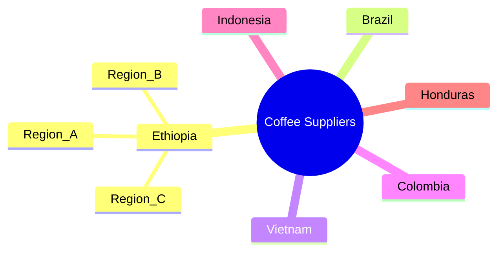
*Note: This `mindmap` illustrates a geographical classification of coffee suppliers, with countries as primary branches and regions as sub-branches, demonstrating how data can be organized by location.*

## Context & Framework
#### Where Does it Live? (The Map)
Spatial classification fundamentally answers the question "Where does this data live?" It provides a geographical lens through which to view statistical phenomena. This approach is particularly powerful for datasets where location plays a significant role in the observed values. For example, understanding the distribution of mineral resources, population density, or sales performance inherently requires categorizing data by specific geographical areas. By structuring data in this manner, patterns tied to physical location become apparent, such as concentrations, dispersions, or gradients across different regions. This contextual framework is vital for fields like urban planning, resource management, and market analysis.

## The Mastery Deep Dive
#### Who are the Neighbors? (Contextual Relationships)
When data is classified geographically, it's not just about isolated points on a map; it's about understanding the relationships between "neighbors." For instance, classifying coffee production by country allows us to compare Brazil's output with Vietnam's, and then understand regional disparities within a country like Ethiopia. This helps in identifying geographical clusters of high or low values, understanding trade routes, or assessing the impact of localized policies. The ability to compare and contrast data across adjacent or distinct geographical units is a core strength of spatial classification, offering insights into spatial autocorrelation and regional influences that would be lost in a non-spatial arrangement.

#### The Regional Blueprint: Detailed Stratification
A deeper dive into geographical classification involves a more granular stratification of areas. While initially grouping by country is useful, further classifying data by states, districts, or even specific zones within a city provides a "regional blueprint." For example, analyzing student distribution in universities might begin by grouping students by country, then by state, and finally by the specific city or campus location. This multi-level geographical classification allows for increasingly detailed analysis, pinpointing specific areas of interest or concern, and enabling highly targeted interventions or strategies. This granular approach moves beyond broad patterns to reveal localized nuances.

## Constraints & Limitations
#### The Engineering Trade-off: Boundary Problems
One significant limitation of spatial classification is the "boundary problem." The definition of geographical areas (e.g., administrative districts, sales territories) can be arbitrary or change over time, which can impact data interpretation. Data collected within one set of boundaries might be difficult to compare with data from another, or if boundaries shift, historical comparisons become challenging. This can distort trends or make it difficult to aggregate or disaggregate data effectively. Additionally, some phenomena do not strictly adhere to administrative boundaries, meaning data classified by such divisions might not accurately reflect the underlying spatial patterns of the phenomenon itself.

## Significance & Application
Spatial classification is crucial for understanding the geographical distribution of various phenomena. In **economics**, it helps analyze regional GDP, trade flows, or resource distribution. For **public health**, classifying disease outbreaks by location is vital for containment and intervention strategies. **Urban planners** use it to understand population density, infrastructure needs, and land use patterns. Even in **ecology**, species distribution is often studied through geographical classification. This method transforms raw location-based data into actionable intelligence, revealing spatial trends and informing geographically targeted decisions.

## The Worked Example
*Test your mastery. Cover the solutions below to test yourself first.*

Consider a simplified dataset of student enrollments from different cities in a country for a specific university program:

*   Addis Ababa: 150 students
*   Hawassa: 80 students
*   Bahir Dar: 120 students
*   Mekelle: 70 students
*   Adama: 90 students

**Goal:** Apply spatial/geographical classification to this data and present it clearly.

**Step 1: Classification**
The data is already inherently classified by geographical location (city). The task is to organize and present these geographical groups.

**Step 2: Tabulation**
We can arrange this data into a simple table, listing each city and its corresponding enrollment.

| City        | Number of Students |
| :
---------- | :
----------------- |
| Addis Ababa | 150                |
| Bahir Dar   | 120                |
| Adama       | 90                 |
| Hawassa     | 80                 |
| Mekelle     | 70                 |

**Step 3: Presentation (Mental Model of a Bar Chart)**
Mentally, you would visualize a bar chart (or a map with shaded regions) where each city has a bar representing its student enrollment. Addis Ababa's bar would be the tallest, followed by Bahir Dar, and so on. This visual immediately highlights the city with the highest and lowest enrollments.

**Why this works:**
*   **Classification:** Grouped data by a spatial characteristic (city).
*   **Presentation:** The table and conceptual bar chart clearly show the distribution of student enrollment across different cities, making it easy to compare geographical differences.

## The Proving Ground
*Test your mastery. Cover the solutions below to test yourself first.*

#### Level 1: The Sanity Check (Verification)
**The Element ID:** A company tracks its product sales by continent, then by country within each continent. Is this an example of spatial/geographical classification?
> **Solution:** Yes, this is a clear example of spatial/geographical classification because the data is organized based on physical locations (continents and countries).

#### Level 2: The Crucible (Mastery & Edge Cases)
**The Friction Point:** A government agency is planning to distribute emergency relief aid based on poverty levels, classifying regions as "High," "Medium," or "Low" poverty. However, the geographical classifications used are broad administrative regions that may contain pockets of both extreme wealth and extreme poverty. Identify how this broad classification might lead to a "friction point" in effectively targeting aid and propose a refinement based on the principles of spatial classification.
> **Solution:** The "friction point" is that broad administrative regions may mask significant internal variations in poverty levels. By classifying at too high a level, aid intended for "High Poverty" regions might be diluted by reaching affluent pockets within those regions, while genuinely impoverished areas within "Medium" or "Low" classifications could be overlooked. A refinement would be to apply a more granular spatial classification, such as classifying by sub-districts, local communities, or even using geographical information systems (GIS) to identify specific areas of high poverty density, rather than relying solely on large, potentially heterogeneous administrative boundaries.

## Key Takeaways
*   Spatial classification organizes data based on geographical location, such as countries, states, or regions.
*   It is crucial for analyzing phenomena with spatial distribution patterns like population, resources, or sales.
*   While powerful, care must be taken with boundary definitions to avoid misrepresentation and ensure accurate insights.

## Knowledge Graph Connections
| Concept                                      | Connection / Relationship                                                                   |
| :
------------------------------------------- | :
------------------------------------------------------------------------------------------ |
| [[Classification_and_Presentation_of_Statistical_Data]] | A specific type of classification used to organize raw data.                            |
| [[Qualitative_Classification]]               | While distinct, geographical categories can sometimes be treated qualitatively (e.g., "North" region). |
| [[Quantitative_Classification]]              | Often combined with quantitative data (e.g., sales figures by region).                  |
| [[Other_Graphical_Representations_of_Statistical_Data]] | Forms the basis for creating maps and geographically-themed charts.                     |
---

---

## Ungrouped Frequency Distributions


## Definition
Before proceeding, ensure you master [[Frequency_Distributions]] and [[Discrete_Variables]].
Ungrouped Frequency Distributions are tabular representations of data that list each individual data point or value observed in a dataset, along with the number of times each distinct value occurs (its frequency). This type of distribution is typically used for small datasets or when dealing with [[Discrete_Variables]] that have a limited number of unique values. It's like taking a list of test scores (e.g., 7, 8, 7, 9, 8) and creating a simple table that shows: Score 7: 2 times, Score 8: 2 times, Score 9: 1 time.

## The Mental Model
Imagine you're collecting feedback on a new product feature, asking users to rate it from 1 to 5. If you have 20 responses, an ungrouped frequency distribution is like tallying each distinct rating. You'd see exactly how many users gave a '1', how many gave a '2', and so on. This immediate visual of individual scores and their counts helps you understand the direct response to each rating option without any aggregation or grouping into broader categories.

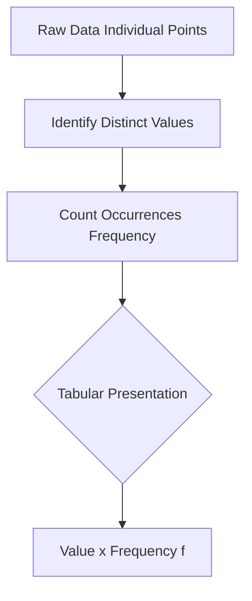
*Note: This `graph TD` outlines the straightforward process of constructing an ungrouped frequency distribution, from raw individual data points to a clear tabular format.*

## Context & Framework
#### The Pilot's Checklist (Do Not Skip)
Constructing an ungrouped frequency distribution is often the first "pilot's checklist" item when dealing with raw, individual data points, especially for [[Discrete_Variables]] or small datasets. This initial step helps to quickly organize data from its chaotic form into a digestible summary. It ensures that every distinct value is accounted for and its prevalence is accurately noted. This clear, direct count of each occurrence is a prerequisite for calculating many basic statistics and for deciding if more advanced grouping (like a [[Grouped_Frequency_Distributions_GFD]]) is necessary. Skipping this foundational step can lead to errors in subsequent analysis.

## The Mastery Deep Dive
#### The Exploded View: Preserving Original Detail
The strength of an ungrouped frequency distribution lies in its ability to present the "exploded view" of the dataset while preserving almost all of the original detail. Unlike grouped distributions, no data granularity is lost because each distinct observed value is listed explicitly. For instance, if scores are 1, 2, 3, 4, 5, the distribution explicitly states the frequency of each score. This allows for precise identification of the mode (most frequent score) and for accurate calculation of exact averages, without the approximation inherent in grouped data. This preservation of individual identity is invaluable for detailed insights when the range of values is small.

#### Identifying the "Lone Wolf" and "Crowd"
By presenting each distinct value with its frequency, ungrouped distributions excel at identifying both the "lone wolves" (values that occur very rarely, or even just once) and the "crowd" (values with very high frequencies). This immediate visibility into the prevalence of each specific outcome is crucial for understanding the data's inherent patterns. For example, if a product quality check reveals a defect type with a frequency of 1 (a lone wolf) alongside another with a frequency of 50 (the crowd), this direct comparison immediately highlights the most pressing issue for resolution, something that might be obscured in a grouped representation.

## Constraints & Limitations
#### The Engineering Trade-off: Readability for Large Ranges
A significant limitation of ungrouped frequency distributions is their compromised "readability for large ranges" of data. If a dataset has many unique values (e.g., ages of 1,000 people, each with a slightly different age), an ungrouped distribution would be very long and cumbersome, defeating the purpose of summarization. This "engineering trade-off" means that while they preserve individual detail, they become impractical and uninformative when the number of distinct values is high. In such scenarios, [[Grouped_Frequency_Distributions_GFD]] become the necessary alternative to maintain conciseness and clarity.

## Significance & Application
Ungrouped frequency distributions are fundamental for initial data exploration. In **surveys**, they tally responses to categorical or discrete questions (e.g., number of children, satisfaction ratings). In **quality control**, they count the occurrences of specific types of defects. In **education**, they summarize individual student scores on small quizzes. They provide a quick, transparent summary of data, making it easy to identify popular choices, rare occurrences, and the overall spread of individual values, particularly for variables where each specific value holds significance.

## The Worked Example
*Test your mastery. Cover the solutions below to test yourself first.*

A small restaurant owner tracks the number of coffees sold each hour over a 10-hour shift: 15, 20, 18, 15, 22, 18, 15, 20, 22, 18.

**Goal:** Construct an ungrouped frequency distribution for the number of coffees sold per hour.

**Step 1: Identify Distinct Values**
The distinct values for the number of coffees sold are 15, 18, 20, and 22.

**Step 2: Count Frequencies for Each Value**
*   15: Appears 3 times
*   18: Appears 3 times
*   20: Appears 2 times
*   22: Appears 2 times

**Step 3: Tabulate the Ungrouped Frequency Distribution**

| Number of Coffees Sold (x) | Frequency (f) |
| :
------------------------- | :
------------ |
| 15                         | 3             |
| 18                         | 3             |
| 20                         | 2             |
| 22                         | 2             |
| **Total**                  | **10**        |

**Why this works:**
*   **Data Type:** The number of coffees sold is a [[Discrete_Variables]] (you sell whole coffees, not half).
*   **Clarity:** The table clearly shows how many times each specific number of coffees was sold per hour, immediately revealing that 15 and 18 sales per hour were the most frequent occurrences.

## The Proving Ground
*Test your mastery. Cover the solutions below to test yourself first.*

#### Level 1: The Sanity Check (Verification)
**The Tool Check:** What type of data is typically used to construct an ungrouped frequency distribution?
> **Solution:** Ungrouped frequency distributions are typically used for discrete variables or for small datasets where the number of unique data points is limited.

#### Level 2: The Crucible (Mastery & Edge Cases)
**The Disaster Drill:** You are given a large dataset of 1,000 unique individual scores on a highly granular exam (scores ranging from 0.00 to 100.00 with two decimal places). You attempt to create an ungrouped frequency distribution. Explain why this quickly becomes a "disaster drill" in terms of readability and utility, and what immediate alternative would be essential.
> **Solution:** This quickly becomes a "disaster drill" because an ungrouped frequency distribution for 1,000 unique, highly granular scores would result in a table with potentially 1,000 rows (one for each unique score), each with a frequency of typically "1". This defeats the purpose of summarization, making the table extremely long, unreadable, and utterly uninformative for discerning patterns. The immediate and essential alternative would be to construct a [[Grouped_Frequency_Distributions_GFD]], where scores are organized into meaningful class intervals (e.g., 0-10, 10.01-20.00), significantly reducing the number of rows and enhancing readability.

## Key Takeaways
*   Ungrouped frequency distributions list each individual data value with its frequency.
*   They are ideal for small datasets or discrete variables with a limited range of unique values.
*   They preserve individual data detail but can become cumbersome for large datasets with many unique values.

## Knowledge Graph Connections
| Concept                     | Connection / Relationship                                                          |
| :
-------------------------- | :
--------------------------------------------------------------------------------- |
| [[Frequency_Distributions]] | A specific type of frequency distribution, particularly useful for individual data. |
| [[Discrete_Variables]]      | Commonly used to represent and summarize discrete variable data.                   |
| [[Grouped_Frequency_Distributions_GFD]] | Often contrasted with ungrouped distributions, which are for larger ranges or continuous data. |
| Raw_Data                | Ungrouped frequency distributions are one of the first steps in organizing raw data. |
---

---

## Bar Chart


## Definition
Before proceeding, ensure you master [[Other_Graphical_Representations_of_Statistical_Data]] and [[Qualitative_Classification]].
A Bar Chart is a graphical representation that uses a set of equally spaced, usually rectangular, bars to represent data. The height or length of each bar corresponds to the magnitude (frequency or value) of a certain category. Bar charts are primarily used for [[Qualitative_Classification]] or discrete quantitative data to compare magnitudes across distinct categories. Unlike a [[Histogram]], the bars in a bar chart are typically separated by gaps, emphasizing the discrete nature of the categories. Think of it as a competition podium, where the height of each step shows the performance of a distinct winner.

## The Mental Model
Imagine you're comparing the popularity of different movie genres: Action, Comedy, Drama, Sci-Fi. A bar chart would show a separate bar for each genre, with the height of the bar indicating how many people prefer that genre. The bars wouldn't touch because "Action" isn't a continuous flow into "Comedy." This clear separation and varying heights immediately tell you which genres are most and least popular, making direct comparisons effortless.

```mermaid
xychart-beta
    title "Favorite Movies by Genre"
    x-axis ["Action", "Comedy", "Drama", "Sci-Fi"]
    y-axis "Number of Students" min:0 max:100 step:20
    bar "Preference"
```
*Note: This `xychart-beta` (bar type) visually represents a simple bar chart. The x-axis shows discrete movie genres (categories), and the height of each bar corresponds to the number of students preferring that genre, emphasizing direct comparison between distinct categories.*

## Context & Framework
#### The "Grandma Test"
A [[Bar_Chart]] generally passes the "Grandma Test" for intuitive understanding because its design is straightforward: longer bars mean more, shorter bars mean less. This direct visual comparison of magnitudes across distinct categories is universally understood. Whether comparing sales figures by product line, student numbers by major, or votes by candidate, the immediate visual difference in bar lengths makes data interpretation effortless. The clear separation between bars reinforces the idea of distinct categories, preventing confusion with continuous data representations like [[Histogram]]s. This simplicity makes bar charts highly effective for broad communication.

## The Mastery Deep Dive
#### The Exploded View: Subtypes for Complex Comparisons
The "exploded view" of a [[Bar_Chart]] reveals its versatility through various subtypes, each designed for specific comparison needs:
1.  **Simple Bar Chart:** Represents a single set of data across different categories (e.g., number of students per major).
2.  **Multiple Bar Chart:** Compares two or more interrelated sets of data for each category (e.g., male vs. female students per major), using grouped bars.
3.  **Subdivided (Component) Bar Chart:** Displays the cumulative total for each category, with each bar segmented into components representing parts of that total (e.g., total students per major, broken down by year level within the bar).
4.  **Percentage Component Bar Chart:** Similar to subdivided, but each bar represents 100%, and segments show percentage contributions (e.g., percentage breakdown of year levels within each major).
These subtypes offer increasing levels of complexity for comparison, allowing architects of data visualization to choose the precise tool for their specific narrative.

#### The "Makeover": Horizontal vs. Vertical Presentation
The presentation of [[Bar_Chart]]s can also undergo a "makeover" by being displayed either horizontally or vertically.
*   **Vertical Bars:** Typically used when categories are few and their names are short, or when emphasizing a "progress" or "amount" upward.
*   **Horizontal Bars:** Often preferred when category names are long (to prevent overcrowding the x-axis) or for [[Qualitative_Classification]] and geographical data, where the emphasis is on ranking or comparing distinct entities.
The choice between horizontal and vertical depends on readability and the aesthetic flow, ensuring the chart remains clear and impactful, especially when dealing with many categories or complex labels.

## Constraints & Limitations
#### The Engineering Trade-off: Potential for Truncated Y-Axis Misleading
A significant "engineering trade-off" with a [[Bar_Chart]] is its "potential for misleading with a truncated y-axis." While effective, if the y-axis (representing magnitude) does not start at zero, the visual differences between bars can be severely exaggerated, distorting the true relative proportions. For example, if a bar representing 10 units is shown as twice as tall as a bar representing 5 units, but the y-axis starts at 4, the visual impact is far greater than if the axis started at 0. This intentional or unintentional truncation can "fail the Grandma Test" for honest communication, leading to misrepresentation and biased conclusions.

## Significance & Application
[[Bar_Chart]]s are one of the most widely used graphical representations due to their versatility and ease of interpretation. They are fundamental for comparing discrete categories. In **business**, they compare sales of different products, market share by brand, or revenue across departments. In **social sciences**, they illustrate demographic distributions (e.g., population by age group or marital status). In **education**, they might compare student enrollment by program or grades across subjects. Their clear visual comparison of magnitudes makes them an indispensable tool for descriptive statistics and communicating findings effectively to diverse audiences.

## The Worked Example
*Test your mastery. Cover the solutions below to test yourself first.*

Consider a simplified dataset showing the number of employees by marital status in a factory:

| Marital Status           | Number of Employees |
| :
----------------------- | :
------------------ |
| Single                   | 26                  |
| Married                  | 43                  |
| Divorced                 | 11                  |
| Widowed                  | 8                   |
| Legally Registered Couples | 5                   |

**Goal:** Understand how a [[Bar_Chart]] would represent this data to compare the number of employees in each marital status category.

**Step 1: Identify Axes**
*   **X-axis:** Discrete categories (Marital Status: Single, Married, etc.).
*   **Y-axis:** Magnitude (Number of Employees).

**Step 2: Visualize Bars (Mental Model)**
Imagine drawing separate, rectangular bars for each marital status category. The height of the bar for 'Married' would reach 43 on the y-axis, the bar for 'Single' would reach 26, and so on. There would be clear gaps between each bar.

**Why this works:**
*   **Categorical Comparison:** The separate bars clearly represent distinct marital status categories, allowing for easy visual comparison of the number of employees in each group.
*   **Direct Magnitude:** The height of each bar directly and intuitively shows the frequency for that category, making it immediately apparent that 'Married' is the most frequent category.

## The Proving Ground
*Test your mastery. Cover the solutions below to test yourself first.*

#### Level 1: The Sanity Check (Verification)
**The Element ID:** What is a fundamental visual characteristic that differentiates a [[Bar_Chart]] from a [[Histogram]]?
> **Solution:** A fundamental visual characteristic that differentiates a [[Bar_Chart]] from a [[Histogram]] is that the bars in a bar chart are typically separated by gaps, whereas the bars in a histogram touch each other.

#### Level 2: The Crucible (Mastery & Edge Cases)
**The "Grandma Test":** A company presents a [[Bar_Chart]] comparing the average customer satisfaction ratings (on a scale of 1 to 5) for two different products, Product X (average 4.5) and Product Y (average 3.5). The y-axis of the chart is truncated, starting at 3.0 and extending to 5.0. Explain why this chart, while technically using a bar chart, might fail the "Grandma Test" for fair comparison and how the truncated y-axis exaggerates the perceived difference in satisfaction.
> **Solution:** This [[Bar_Chart]] might fail the "Grandma Test" for fair comparison due to the truncated y-axis, which starts at 3.0 instead of 0.0. While the actual difference between 4.5 and 3.5 is only 1 point, visually, the bar for Product X (4.5) will appear significantly taller than the bar for Product Y (3.5) on a truncated axis, making the difference seem disproportionately large to the viewer. This exaggeration of the perceived difference in customer satisfaction can mislead, as it makes Product X appear far superior than it truly is in proportion to a 0-5 scale. A fair comparison requires the y-axis to start at zero to prevent such visual distortions.

## Key Takeaways
*   Bar charts use separate rectangular bars to compare magnitudes of distinct categories.
*   They are ideal for qualitative or discrete quantitative data, emphasizing separation between categories.
*   Various subtypes exist for simple, multiple, subdivided, and percentage comparisons.

## Knowledge Graph Connections
| Concept                                      | Connection / Relationship                                                          |
| :
------------------------------------------- | :
--------------------------------------------------------------------------------- |
| [[Other_Graphical_Representations_of_Statistical_Data]] | A primary type of graphical representation within the broader category.           |
| [[Qualitative_Classification]]               | Bar charts are frequently used to visualize data classified qualitatively.         |
| [[Quantitative_Classification]]              | Can be used for discrete quantitative data to compare specific values or ranges.   |
| [[Histogram]]                                | Contrasted with histograms due to the gaps between bars and data type.           |
| [[Vertical_Line_Graph]]                      | Similar to vertical line graphs in representing discrete categories, but with thicker bars. |
---

---

## Class Boundaries


## Definition
Before proceeding, ensure you master [[Grouped_Frequency_Distributions_GFD]] and [[Class_Limits]].
Class Boundaries are the true real limits that separate classes in a [[Grouped_Frequency_Distributions_GFD]]. Unlike [[Class_Limits]], which are the stated values, class boundaries are typically extended by half a unit (or half the precision unit) to ensure continuity between classes, preventing gaps and overlaps. They are defined such that the upper class boundary of one class is identical to the lower class boundary of the subsequent class. Think of them as the precise, invisible lines drawn exactly halfway between the upper limit of one class and the lower limit of the next.

## The Mental Model
Imagine you have two adjacent plots of land defined by visible fences. The fences are your "class limits." But what if a measurement falls exactly on a fence line? To ensure every point belongs to only one plot, you define invisible "class boundaries" that run exactly down the middle of the shared fence. So, if one plot ends at 52 units and the next starts at 53 units, the boundary is 52.5 units. Any measurement exactly on 52.5 would then belong to one specific side, resolving ambiguity and ensuring seamless coverage.

```mermaid
graph TD
    A[Class Interval: 45 – 52] --> B{Lower Class Limit: 45};
    A --> C{Upper Class Limit: 52};
    B --- D[Lower Class Boundary: 44.5];
    C --- E[Upper Class Boundary: 52.5];
    F[Class Interval: 53 – 60] --> G{Lower Class Limit: 53};
    F --> H{Upper Class Limit: 60};
    G --- E; %% Upper boundary of previous = Lower boundary of current
    H --- I[Upper Class Boundary: 60.5];
```
*Note: This `graph TD` visually differentiates class limits from class boundaries, showing how boundaries are extended (e.g., 44.5-52.5) to bridge the gap between adjacent classes like 45-52 and 53-60, ensuring the upper boundary of one class matches the lower boundary of the next.*

## Context & Framework
#### Spot the Impostor (Don't be Fooled)
A critical mistake (the "impostor") is confusing [[Class_Limits]] with [[Class_Boundaries]]. Class limits are the actual values seen in the data (e.g., 45-52), while class boundaries are the precise points halfway between the apparent upper limit of one class and the lower limit of the next (e.g., 52.5). The key difference is that class limits can have "gaps" between classes, especially for [[Discrete_Variables]], while class boundaries are designed to be continuous and mutually exclusive for all possible numerical values, particularly crucial for [[Continuous_Variables]]. Always remember that boundaries ensure continuous coverage across the entire range of data.

## The Mastery Deep Dive
#### The Exploded View: Micro-Precision Between Intervals
The concept of [[Class_Boundaries]] provides a "micro-precision" exploded view of the transition between class intervals. For data recorded to the nearest whole unit (e.g., 45-52, 53-60), the upper class limit of the first class (52) and the lower class limit of the next class (53) have a gap of one unit. The class boundary of 52.5 precisely bisects this gap. This meticulous definition ensures that any data point, no matter how precisely measured (e.g., 52.3, 52.8), can be unambiguously assigned to one and only one class. This level of detail is fundamental for the mathematical integrity of a [[Grouped_Frequency_Distributions_GFD]] and especially for constructing a [[Histogram]], where bars must touch.

#### Mutually Exclusive, But Not the Limits
A critical nuance of [[Class_Boundaries]] is that they are "mutually exclusive" in their assignment (a data point falls into only one class) even though the upper boundary of one class is identical to the lower boundary of the next. For instance, the upper boundary of 52.5 for the class 45-52 is also the lower boundary for the class 53-60. The convention is that the upper boundary *is included* in the lower class, while the lower boundary *is excluded* from the upper class. This seemingly counter-intuitive overlap ensures there are no unassigned data points. This is unlike [[Class_Limits]] which, when stated directly, often appear to have a gap. This design guarantees seamless coverage of all possible data values across the entire distribution.

## Constraints & Limitations
#### The Engineering Trade-off: Abstraction from Raw Data
A minor "engineering trade-off" with [[Class_Boundaries]] is that they introduce a level of abstraction from the raw, observed data points. While [[Class_Limits]] directly reflect the recorded values (e.g., "ages 20-29"), class boundaries (e.g., "19.5-29.5") are conceptual constructs used for statistical precision. This abstraction might initially be confusing for beginners as it doesn't directly correspond to the integer-based data they are typically used to seeing. However, this is a necessary sacrifice for mathematical accuracy, especially in continuous data representation and graphical tools like [[Histogram]] where bars must seamlessly adjoin.

## Significance & Application
Class boundaries are critical for the mathematical accuracy and visual representation of [[Grouped_Frequency_Distributions_GFD]], especially for [[Continuous_Variables]]. They eliminate ambiguity in classifying data points that fall precisely between stated class limits and ensure that histograms can be drawn with adjoining bars. The calculation of [[Class_Mark]] and [[Class_Width]] also often relies on class boundaries for greater precision. Properly defining class boundaries is fundamental for accurate data interpretation and for creating visually correct and interpretable graphical representations.

## The Worked Example
*Test your mastery. Cover the solutions below to test yourself first.*

Consider a [[Grouped_Frequency_Distributions_GFD]] with the following class limits for student weights (data to nearest kg):

| Class Limit (Weight in kg) |
| :
------------------------- |
| 45 – 52                    |
| 53 – 60                    |
| 61 – 68                    |

**Goal:** Calculate the class boundaries for these intervals.

**Step 1: Determine the Gap Between Adjacent Class Limits**
The upper limit of the first class is 52. The lower limit of the second class is 53. The gap is 53 - 52 = 1 unit.

**Step 2: Calculate Half the Precision Unit**
Since the data is to the nearest kg, the precision unit is 1. Half of this is 0.5.

**Step 3: Calculate Lower and Upper Class Boundaries**
*   **For 45 – 52:**
    *   Lower Boundary = 45 - 0.5 = 44.5
    *   Upper Boundary = 52 + 0.5 = 52.5
*   **For 53 – 60:**
    *   Lower Boundary = 53 - 0.5 = 52.5
    *   Upper Boundary = 60 + 0.5 = 60.5
*   **For 61 – 68:**
    *   Lower Boundary = 61 - 0.5 = 60.5
    *   Upper Boundary = 68 + 0.5 = 68.5

**Summary Table:**

| Class Limit | Class Boundary |
| :
---------- | :
------------- |
| 45 – 52     | 44.5 – 52.5    |
| 53 – 60     | 52.5 – 60.5    |
| 61 – 68     | 60.5 – 68.5    |

**Why this works:**
*   **Continuity:** The upper boundary of one class (e.g., 52.5) precisely matches the lower boundary of the next (52.5), ensuring there are no gaps or ambiguities in classifying continuous data.
*   **Precision:** It extends the apparent limits by half the measurement unit, providing the true numerical range for each class.

## The Proving Ground
*Test your mastery. Cover the solutions below to test yourself first.*

#### Level 1: The Sanity Check (Verification)
**The Fact Check:** For a Grouped Frequency Distribution with class limits 10-19, 20-29, what is the upper class boundary for the 10-19 class and the lower class boundary for the 20-29 class?
> **Solution:** The upper class boundary for 10-19 is 19.5. The lower class boundary for 20-29 is also 19.5.

#### Level 2: The Crucible (Mastery & Edge Cases)
**The Impossible Case:** A statistician constructs a GFD using class limits, but for a continuous variable (e.g., reaction times measured to milliseconds), they *fail* to calculate and use class boundaries, assuming the stated limits are sufficient. Explain why this oversight creates an "impossible case" for accurately assigning *all* possible data points and how it leads to a fundamental flaw in the GFD.
> **Solution:** This oversight creates an "impossible case" for accurately assigning all possible data points because it leaves "gaps" between classes. For example, if class limits are 10-19ms and 20-29ms, a reaction time of 19.3ms or 19.8ms cannot be assigned to any class. This fundamentally flaws the GFD by making it non-exhaustive and non-mutually exclusive for continuous data. [[Class_Boundaries]] (e.g., 9.5-19.5ms, 19.5-29.5ms) are essential to ensure every possible continuous value can be unambiguously assigned, preventing these "impossible cases" where data points fall into a theoretical "no man's land" between categories.

## Key Takeaways
*   Class boundaries are the true, precise limits that separate classes in a GFD, eliminating gaps and overlaps.
*   They are calculated by extending class limits by half a unit (or precision unit).
*   The upper boundary of one class matches the lower boundary of the next, ensuring continuity.

## Knowledge Graph Connections
| Concept                                 | Connection / Relationship                                                          |
| :
-------------------------------------- | :
--------------------------------------------------------------------------------- |
| [[Grouped_Frequency_Distributions_GFD]] | Class boundaries are essential for the mathematical integrity and visual display of a GFD. |
| [[Class_Limits]]                        | Derived from class limits but extend to bridge gaps between apparent limits.       |
| [[Continuous_Variables]]                | Particularly critical for accurately classifying and representing continuous data. |
| [[Histogram]]                           | Ensure that bars in a histogram are drawn adjacent to each other without gaps.     |
| [[Rules_for_Forming_a_GFD]]             | Defining class boundaries is a key rule to ensure mutual exclusivity and exhaustiveness. |
---

---

## Class Limits


## Definition
Before proceeding, ensure you master [[Grouped_Frequency_Distributions_GFD]] and [[Quantitative_Classification]].
Class Limits are the smallest and largest numerical values that can be included in a given class interval within a [[Grouped_Frequency_Distributions_GFD]]. Each class has a lower class limit (the smallest value) and an upper class limit (the largest value). They define the apparent boundaries of a class. Think of them as the visible range markers on a ruler; for a segment from 1 to 5, 1 is the lower limit and 5 is the upper limit.

## The Mental Model
Imagine you're sorting students by age into groups like "18-20 years old" or "21-23 years old." In the "18-20" group, 18 is the *lower class limit* and 20 is the *upper class limit*. These numbers tell you exactly which individual ages (whole numbers, assuming age is typically rounded to the nearest year) are included in that specific group. This clear definition prevents confusion about which students belong to which age bracket based on their stated age.

```mermaid
graph TD
    A[Class Interval (e.g., 45 - 52)] --> B{Lower Class Limit};
    B --> C;
    A --> D{Upper Class Limit};
    D --> E;
```
*Note: This `graph TD` visually defines the lower and upper class limits for a given class interval (45-52), explicitly showing the smallest and largest values included in the class.*

## Context & Framework
#### The Cheat Code: How to Remember This
To remember [[Class_Limits]], think of them as the "inclusive ends" of your numerical buckets. They are the actual data values that you *see* in the class definition. For example, if a class is `45-52`, then any data point from 45 up to and including 52 will fall into that class. This direct and visible range is crucial for quickly understanding the scope of each group in a [[Grouped_Frequency_Distributions_GFD]]. These limits are distinct from [[Class_Boundaries]], which are used to bridge the gaps between classes.

## The Mastery Deep Dive
#### The Exploded View: Precision in Inclusivity
A deeper understanding of [[Class_Limits]] involves recognizing their role in defining precise inclusivity within a class. For a class like "45-52," both 45 and 52 are included in that interval. This exactness is particularly important when raw data values match the limits. The definition ensures no ambiguity: a value equal to a class limit belongs to that class. This contrasts with [[Class_Boundaries]], which are often defined with half-units (e.g., 44.5 to 52.5) to manage the transition between classes for continuous data. The limits are the 'labels' of the buckets, telling you what raw numbers are put inside.

#### The "Same Story, Different Setting" (Discrete vs. Continuous)
While class limits are conceptually the same for both discrete and continuous data (smallest and largest values in a class), their practical application can subtly differ, telling the "same story in a different setting." For discrete data (like "number of children"), limits might be `0-1`, `2-3`, ensuring whole numbers. For continuous data (like "height"), though presented as `150-159 cm`, the actual "true" limits are often implied to extend infinitesimally close to the next class, which is then explicitly handled by [[Class_Boundaries]]. The limits provide the user-friendly labels, regardless of the data type, while boundaries handle the mathematical precision.

## Constraints & Limitations
#### The Engineering Trade-off: Gaps Between Classes
A critical limitation of relying solely on [[Class_Limits]] is that they can create apparent "gaps between classes" for certain types of data. For instance, if one class is 45-52 and the next is 53-60, what about a data point of 52.5? If data is recorded to the nearest whole number, this isn't an issue. However, for [[Continuous_Variables]], these gaps can lead to ambiguity or misplacement of values. This "engineering trade-off" highlights the need for [[Class_Boundaries]] to resolve such ambiguities, ensuring that every possible data point (even fractional ones) can be uniquely assigned to a class without falling into a "no man's land" between intervals.

## Significance & Application
Class limits are foundational for structuring [[Grouped_Frequency_Distributions_GFD]]. They provide the explicit numerical ranges that define each group, making the table immediately understandable. In **surveys**, they might define age brackets (e.g., 20-29 years). In **manufacturing**, they could specify size categories for products (e.g., 10-15 mm). These limits are essential for categorizing raw data into meaningful intervals, allowing for initial summarization and visualization before more complex statistical analysis is performed. Correctly defining class limits is the first step toward building an accurate GFD.

## The Worked Example
*Test your mastery. Cover the solutions below to test yourself first.*

Consider a [[Grouped_Frequency_Distributions_GFD]] for student weights:

| Weight (in kg) | Frequency |
| :
------------- | :
-------- |
| 45 – 52        | 5         |
| 53 – 60        | 8         |

**Goal:** Identify the lower and upper class limits for the first two classes.

**Step 1: Focus on the "45 – 52" Class**
The smallest value included is 45.
The largest value included is 52.

**Step 2: Focus on the "53 – 60" Class**
The smallest value included is 53.
The largest value included is 60.

**Conclusion:**
For the class 45 – 52:
*   Lower Class Limit = 45
*   Upper Class Limit = 52

For the class 53 – 60:
*   Lower Class Limit = 53
*   Upper Class Limit = 60

**Why this works:**
*   **Definition:** The class limits clearly indicate the precise range of raw data values (to the nearest whole number in this case) that fall into each respective category, ensuring unambiguous classification for each student's weight.

## The Proving Ground
*Test your mastery. Cover the solutions below to test yourself first.*

#### Level 1: The Sanity Check (Verification)
**The Fact Check:** For a class interval of 70-79 in a Grouped Frequency Distribution, what is the lower class limit?
> **Solution:** The lower class limit for the interval 70-79 is 70.

#### Level 2: The Crucible (Mastery & Edge Cases)
**The Impostor:** A student proposes a GFD where the first class is "less than 20," the second is "20 to less than 30," and so on. They argue that "less than 20" serves as the lower class limit for the first interval. Explain why this approach is an "impostor" definition of class limits and why it is problematic for a properly constructed GFD.
> **Solution:** This is an "impostor" definition of class limits. [[Class_Limits]] are defined as the *smallest and largest numerical values that can be included* in a class. "Less than 20" does not specify a precise smallest value; it's an open-ended statement. This is problematic because it makes the lower bound of the first class ambiguous and potentially non-numeric. A properly constructed GFD requires explicit numerical lower and upper class limits (e.g., 0-19 or 10-19) for each interval to ensure clarity and enable consistent calculations.

## Key Takeaways
*   Class limits define the smallest (lower) and largest (upper) observed values included in a class interval.
*   They are the visible boundaries of each class in a grouped frequency distribution.
*   Correctly defined class limits are essential for clear and unambiguous data categorization.

## Knowledge Graph Connections
| Concept                                 | Connection / Relationship                                                          |
| :
-------------------------------------- | :
--------------------------------------------------------------------------------- |
| [[Grouped_Frequency_Distributions_GFD]] | Class limits are fundamental components for defining the intervals within a GFD. |
| [[Class_Boundaries]]                   | Distinct from class limits, as boundaries bridge gaps between classes.             |
| [[Class_Width]]                         | The width is determined by the range between the upper and lower limits (plus one unit). |
| [[Rules_for_Forming_a_GFD]]             | Adhering to rules for defining class limits is critical for accurate GFD construction. |
---

---

## Class Mark


## Definition
Before proceeding, ensure you master [[Grouped_Frequency_Distributions_GFD]] and [[Class_Limits]].
The Class Mark (also known as the class midpoint) is the representative value for a given class interval within a [[Grouped_Frequency_Distributions_GFD]]. It is calculated as the average of the lower and upper [[Class_Limits]] (or [[Class_Boundaries]]) of that class. Think of it as the 'center point' of each bucket of data, used to represent all the data points contained within that specific range.

## The Mental Model
Imagine you have a class of students aged 20-29. Instead of having to talk about "students aged between 20 and 29," you can use the class mark, which is 24.5, as a single representative age for that group in certain calculations or graphs. This allows you to simplify and visualize the group's central tendency without listing every single age. It's like finding the exact center of a target to represent where most shots are landing.

```mermaid
graph TD
    A[Class Interval (e.g., 45 - 52)] --> B{Lower Class Limit: 45};
    A --> C{Upper Class Limit: 52};
    B & C --> D[Calculate Average];
    D --> E[Class_Mark: (45 + 52) / 2 = 48.5];
```
*Note: This `graph TD` visually demonstrates how the class mark (48.5) is calculated by averaging the lower and upper class limits (45 and 52) of a given class interval, highlighting its role as a representative midpoint.*

## Context & Framework
#### The Variable Dictionary
The [[Class_Mark]] acts as a crucial "variable" in a special dictionary: the [[Grouped_Frequency_Distributions_GFD]]. While individual data values are lost in grouping, the class mark serves as the best single-point representative for all data falling within that interval. This is vital for further calculations like the mean or median for grouped data, where the class mark is used to approximate the sum of values within each class. It also plays a key role in graphical representations such as the [[Frequency_Polygon]], where class marks are plotted against frequencies.

## The Mastery Deep Dive
#### Anatomy of the Formula (Who is Who?)
The formula for calculating the [[Class_Mark]] is straightforward:
$$ \boxed{\displaystyle \text{Class Mark} = \frac{\text{Lower Class Limit} + \text{Upper Class Limit}}{2}} $$
Alternatively, one can use the class boundaries:
$$ \boxed{\displaystyle \text{Class Mark} = \frac{\text{Lower Class Boundary} + \text{Upper Class Boundary}}{2}} $$
*   **Lower Class Limit/Boundary:** The smallest value defining the class.
*   **Upper Class Limit/Boundary:** The largest value defining the class.
The denominator, '2', signifies that we are finding the midpoint between these two values. Understanding 'who is who' in this formula ensures accurate calculation of this central representative value, which is critical because subsequent calculations for grouped data depend heavily on the accuracy of the class marks.

#### Let's Plug in Numbers (Watch it Work)
Let's see the [[Class_Mark]] calculation in action with actual numbers. Suppose we have a class interval of `53 - 60`.
$$ \boxed{\displaystyle \text{Class Mark} = \frac{53 + 60}{2}} $$
$$ \boxed{\displaystyle = \frac{113}{2}} $$
$$ \boxed{\displaystyle = 56.5} $$
In this example, 56.5 is the class mark, serving as the midpoint for all data points falling within the 53 to 60 range. This single value will represent the entire interval in further calculations, demonstrating how a complex range is distilled into a single, manageable number for analytical purposes. This process is consistent across all class intervals in a GFD.

## Constraints & Limitations
#### The Engineering Trade-off: Approximation of Data
A significant limitation of using the [[Class_Mark]] is that it is an "approximation of data" for all values within its class. Once data is grouped, the individual values are lost, and the class mark is used as a stand-in for all observations within that interval. This "engineering trade-off" means that while the class mark simplifies calculations for grouped data, any statistics derived using it (like the mean or standard deviation) will not be perfectly accurate compared to calculations performed on the original raw data. The accuracy of these approximations depends on how well the class mark truly represents the center of the data within its interval.

## Significance & Application
The [[Class_Mark]] is a vital statistic for [[Grouped_Frequency_Distributions_GFD]] because it provides a single representative value for each class interval. This is essential when calculating approximate measures of central tendency (like the mean) and dispersion for grouped data, as individual raw data values are no longer available. Furthermore, class marks are plotted as points on the x-axis when constructing a [[Frequency_Polygon]], making them integral to graphical representation. Their correct calculation ensures that these approximations and visual summaries are as accurate as possible.

## The Worked Example
*Test your mastery. Cover the solutions below to test yourself first.*

Consider the following class interval from a [[Grouped_Frequency_Distributions_GFD]]:

| Class Limit |
| :
---------- |
| 69 – 76     |

**Goal:** Calculate the class mark for this interval.

**Step 1: Identify Lower and Upper Class Limits**
*   Lower Class Limit = 69
*   Upper Class Limit = 76

**Step 2: Apply the Class Mark Formula**
$$ \displaystyle \text{Class Mark} = \frac{\text{Lower Class Limit} + \text{Upper Class Limit}}{2} $$
$$ \displaystyle \text{Class Mark} = \frac{69 + 76}{2} $$
$$ \displaystyle \text{Class Mark} = \frac{145}{2} $$
$$ \displaystyle \text{Class Mark} = 72.5 $$

**Why this works:**
*   **Representation:** The class mark of 72.5 accurately represents the midpoint of the 69-76 class, providing a single value that can be used for calculations and graphical plotting, effectively summarizing the values within that range.

## The Proving Ground
*Test your mastery. Cover the solutions below to test yourself first.*

#### Level 1: The Sanity Check (Verification)
**The Variable ID:** Define the class mark and explain its alternative name.
> **Solution:** The class mark is the representative value for a class interval, calculated as the average of its limits. Its alternative name is the class midpoint.

#### Level 2: The Crucible (Mastery & Edge Cases)
**The Impossible Case:** A statistician is analyzing data from a GFD and, to simplify, decides to use the lower [[Class_Limits]] of each interval (e.g., for "60-69," they use 60) in calculations for the mean. Explain why this approach would lead to an "impossible case" of systematic misrepresentation and why the [[Class_Mark]] is essential to avoid this flaw.
> **Solution:** Using only the lower [[Class_Limits]] for calculations would lead to an "impossible case" of systematic misrepresentation because it would consistently underestimate the true average value of the data within each class. For a class like "60-69," using 60 ignores all data points that fall between 60.1 and 69. This consistently biases any calculations (like the mean) downwards, giving a false impression of the data's central tendency. The [[Class_Mark]] (e.g., 64.5 for 60-69) is essential to avoid this flaw because it provides the best single-point *average representation* of all data within the entire interval, thereby minimizing systematic bias in subsequent calculations for grouped data.

## Key Takeaways
*   The class mark (or midpoint) is the representative value for a class interval in a GFD.
*   It is calculated as the average of the class limits (or boundaries).
*   Class marks are crucial for approximating statistics of grouped data and for constructing frequency polygons.

## Knowledge Graph Connections
| Concept                                 | Connection / Relationship                                                          |
| :
-------------------------------------- | :
--------------------------------------------------------------------------------- |
| [[Grouped_Frequency_Distributions_GFD]] | The class mark is a key component for summarizing and analyzing data within a GFD. |
| [[Class_Limits]]                        | Used directly in the calculation of the class mark.                                |
| [[Class_Boundaries]]                    | Can also be used in the calculation of the class mark, offering equal precision.   |
| [[Frequency_Polygon]]                   | The class mark is plotted on the x-axis to create a frequency polygon.             |
| [[Rules_for_Forming_a_GFD]]             | Calculating the class mark is part of the rules for robust GFD construction.     |
---

---

## Class Width


## Definition
Before proceeding, ensure you master [[Grouped_Frequency_Distributions_GFD]] and [[Class_Limits]].
The Class Width is the range of values encompassed by a class interval in a [[Grouped_Frequency_Distributions_GFD]]. It represents the difference between the upper [[Class_Boundaries]] and the lower [[Class_Boundaries]] of a class. Alternatively, it can be calculated as the difference between two consecutive lower class limits (or two consecutive upper class limits). Think of it as the 'size' or 'span' of each data bucket; if a class covers weights from 45 kg to 52 kg, its width defines how many kilograms are included in that particular group.

## The Mental Model
Imagine organizing books on a shelf by their spine height. You decide each shelf "class" should hold books within a certain height range, say 5 inches. So, books from 0-5 inches go on one shelf, 5.1-10 inches on another. The "5 inches" represents the class width – the consistent size of each grouping. This consistent width makes comparisons fair and ensures the visual representation of data (like a histogram) is not distorted.

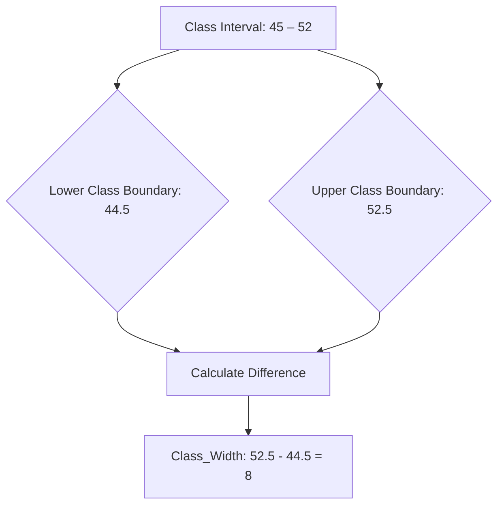
*Note: This `graph TD` illustrates the calculation of class width as the difference between the upper (52.5) and lower (44.5) class boundaries of a class interval, yielding a width of 8.*

## Context & Framework
#### The Variable Dictionary
The [[Class_Width]] is a critical parameter in the "variable dictionary" of a [[Grouped_Frequency_Distributions_GFD]]. It directly influences the number of classes and the level of detail presented in the distribution. A larger class width results in fewer classes, providing a more summarized, generalized view of the data. A smaller class width yields more classes, offering a more detailed, granular view. This parameter must be carefully chosen, often using the overall data range and desired number of classes as guides, to ensure the GFD effectively communicates the data's underlying patterns without being either too broad or too fragmented.

## The Mastery Deep Dive
#### Anatomy of the Formula (Who is Who?)
The primary formula for determining [[Class_Width]] is:
$$ \boxed{\displaystyle \text{Class Width} = \frac{\text{Largest Data Value} - \text{Smallest Data Value}}{\text{Number of Classes}}} $$
*   **Largest Data Value:** The maximum observed value in the raw dataset.
*   **Smallest Data Value:** The minimum observed value in the raw dataset.
*   **Number of Classes:** The desired number of intervals for the GFD (typically 5-15).
It is crucial to **round this calculated width *up*** to the nearest unit of data precision to ensure that all data values are accommodated within the chosen number of classes. For example, if data is whole numbers and the calculation yields 7.3, the class width must be rounded up to 8. This "who is who" clarifies that the formula provides a *minimum* width; rounding up guarantees exhaustive coverage.

#### Let's Plug in Numbers (Watch it Work)
Let's apply the formula with numbers. Suppose the largest data value is 90, the smallest is 26, and we want 6 classes.
$$ \boxed{\displaystyle \text{Class Width} = \frac{90 - 26}{6}} $$
$$ \boxed{\displaystyle = \frac{64}{6}} $$
$$ \boxed{\displaystyle \approx 10.67} $$
Since data is typically reported to a certain precision (e.g., whole numbers), the calculated width (10.67) must be rounded *up* to the nearest appropriate unit. If the original data are whole numbers, we round up to 11. Thus, a [[Class_Width]] of 11 would be used. This ensures all data points, from 26 to 90, are accommodated across 6 classes without truncation or exclusion.

## Constraints & Limitations
#### The Engineering Trade-off: Impact on Interpretation
The choice of [[Class_Width]] involves a critical "engineering trade-off" that directly impacts the interpretation of the [[Grouped_Frequency_Distributions_GFD]]. If the width is too small, there will be many classes, and the distribution might appear "jagged" or sparse, obscuring underlying patterns. If the width is too large, there will be few classes, and the distribution might be overly smoothed, hiding important details or variations. This trade-off requires careful judgment to select a width that provides a balance between detail and summarization, ensuring the GFD accurately and meaningfully represents the data's characteristics.

## Significance & Application
[[Class_Width]] is a foundational parameter in constructing any [[Grouped_Frequency_Distributions_GFD]]. It determines the size of each class interval, directly influencing the number of classes and, consequently, the level of detail in the summarized data. A consistently applied class width ensures that the distribution is not distorted, making visual representations like [[Histogram]] and [[Frequency_Polygon]] accurate. Proper calculation and rounding of class width, as per specific [[Rules_for_Forming_a_GFD]], are essential for creating meaningful and interpretable grouped frequency distributions, facilitating effective data analysis.

## The Worked Example
*Test your mastery. Cover the solutions below to test yourself first.*

A dataset of student marks ranges from a minimum of 29 to a maximum of 91. The goal is to construct a [[Grouped_Frequency_Distributions_GFD]] with 6 classes.

**Goal:** Calculate the appropriate class width for this GFD.

**Step 1: Identify Largest and Smallest Data Values**
*   Largest Data Value = 91
*   Smallest Data Value = 29

**Step 2: Identify the Number of Classes Desired**
*   Number of Classes = 6

**Step 3: Apply the Class Width Formula**
$$ \displaystyle \text{Class Width} = \frac{\text{Largest Data Value} - \text{Smallest Data Value}}{\text{Number of Classes}} $$
$$ \displaystyle \text{Class Width} = \frac{91 - 29}{6} $$
$$ \displaystyle \text{Class Width} = \frac{62}{6} $$
$$ \displaystyle \text{Class Width} \approx 10.33 $$

**Step 4: Round Up to the Nearest Unit of Data Precision**
Assuming marks are whole numbers, we round 10.33 up to 11.

**Conclusion:**
The appropriate [[Class_Width]] is 11.

**Why this works:**
*   **Coverage:** A class width of 11 ensures that all data points from 29 to 91 can be accommodated within 6 classes without any values being left out.
*   **Consistency:** This calculated width provides a uniform interval size for each class, critical for an unbiased representation of the data distribution.

## The Proving Ground
*Test your mastery. Cover the solutions below to test yourself first.*

#### Level 1: The Sanity Check (Verification)
**The Variable ID:** Define class width in the context of a Grouped Frequency Distribution.
> **Solution:** Class width is the range of values encompassed by a class interval, representing the difference between its upper and lower class boundaries or between two consecutive lower (or upper) class limits.

#### Level 2: The Crucible (Mastery & Edge Cases)
**The Impossible Case:** A data analyst has a dataset of exam scores ranging from 0 to 100, recorded as whole numbers. They calculate an ideal class width of 9.7 and decide to use exactly 9.7 as the width for their [[Grouped_Frequency_Distributions_GFD]]. Explain why this leads to an "impossible case" for creating clear and mutually exclusive [[Class_Limits]] and how the [[Rules_for_Forming_a_GFD]] would specifically address this.
> **Solution:** Using a class width of 9.7 for whole number data leads to an "impossible case" for creating clear and mutually exclusive [[Class_Limits]]. If you start the first class at 0 with a width of 9.7, the next would start at 9.7, then 19.4, etc. This creates fractional [[Class_Limits]] that do not align with the whole-number nature of the raw data, making it impossible to unambiguously assign whole-number scores to classes without overlap or gaps. The [[Rules_for_Forming_a_GFD]] specifically address this by mandating that the calculated class width *always be rounded up to the nearest unit of the data's precision*. In this case, 9.7 should be rounded up to 10, ensuring whole-number class limits (e.g., 0-9, 10-19) that match the raw data's format.

## Key Takeaways
*   Class width is the range of values within each class interval, calculated using the data range and desired number of classes.
*   It must be rounded up to the nearest unit of data precision to ensure all data is covered.
*   Consistent class width is crucial for an accurate and unbiased representation of data in a GFD.

## Knowledge Graph Connections
| Concept                                 | Connection / Relationship                                                          |
| :
-------------------------------------- | :
--------------------------------------------------------------------------------- |
| [[Grouped_Frequency_Distributions_GFD]] | Class width is a fundamental parameter in the construction and design of a GFD.    |
| [[Class_Limits]]                        | Used in conjunction with class width to define the explicit boundaries of intervals. |
| [[Class_Boundaries]]                    | The difference between consecutive class boundaries directly yields the class width. |
| [[Rules_for_Forming_a_GFD]]             | Calculating and appropriately rounding class width is a key rule for GFD construction. |
| [[Histogram]]                           | Determines the width of the bars in a histogram, influencing its visual appearance. |
---

---

## Continuous Variables


## Definition
Before proceeding, ensure you master [[Quantitative_Classification]] and Data_Collection.
Continuous Variables are a type of numerical data that can assume any numeric value within a given range and can be meaningfully split into smaller parts. They possess valid fractional and decimal values, and theoretically, there's an infinite number of potential values between any two points. These variables are generally obtained by measuring using a scale. Think of it like measuring your height; you can be 1.75 meters, or 1.753 meters, or even more precisely, as long as your measuring tool allows.

## The Mental Model
Imagine you're baking a cake and need to measure flour. You don't just count cups; you measure precisely. You could have 2 cups, 2.5 cups, 2.37 cups, or even 2.375 cups. The amount of flour can take on any value within a range, limited only by the precision of your scale. This "measuring" nature is the core mental model for continuous variables: they can be infinitely subdivided into smaller and smaller fractional or decimal values.

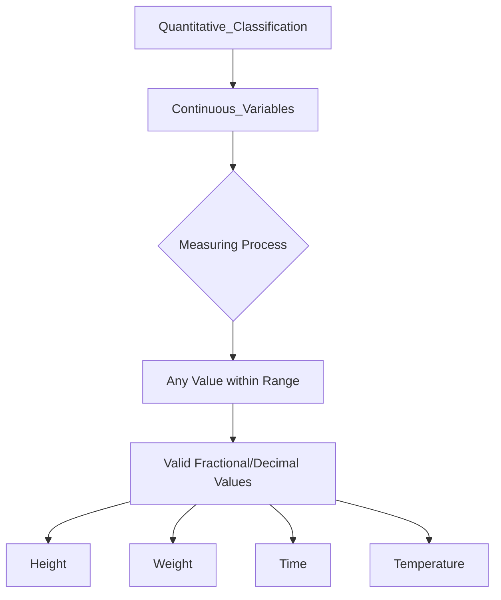
*Note: This `graph TD` illustrates the relationship of continuous variables to quantitative classification, emphasizing their derivation from measuring and the resulting ability to assume any value, including fractional and decimal, within a range.*

## Context & Framework
#### The Family Tree
Continuous variables are a fundamental branch within the "family tree" of [[Quantitative_Classification]]. They represent measurable phenomena, contrasting directly with discrete variables which are countable. This distinction is crucial for selecting appropriate statistical methods and visualizations. For example, height, weight, length, time, temperature, or salary are all continuous. Understanding this categorization allows for proper data handling, such as using specific probability distributions designed for continuous data (e.g., Normal distribution).

## The Mastery Deep Dive
#### The Exploded View: Infinite Precision
A deeper look into continuous variables emphasizes their theoretical "infinite precision." Between any two distinct values (e.g., 20 and 21 degrees Celsius), there exists an infinite number of possible intermediate values (e.g., 20.1, 20.01, 20.001, and so on). This "exploded view" highlights that continuous variables are not limited by integer steps but can take on any value along a continuum, restricted only by the limitations of the measuring instrument. This characteristic profoundly impacts how continuous data is recorded, analyzed, and often grouped into class intervals for frequency distributions, as individual values are rarely repeated exactly.

#### Spot the Impostor (Don't be Fooled)
A common trap is to treat discrete data as continuous, or vice versa, especially when the scale or measurement seems to blur the lines. For example, "shoe size" might appear discrete (e.g., size 9, 9.5, 10), but if it's derived from foot length measurements, the *underlying* variable (foot length) is continuous. The "impostor" is the categorized or rounded value, which looks discrete, but the original phenomenon it represents is continuous. Always ask: can the underlying characteristic theoretically be measured with increasing precision to include infinitely many decimal places? If yes, it's continuous. Don't be fooled by how the data is presented or rounded.

## Constraints & Limitations
#### The Engineering Trade-off: Measurement Error
A key limitation of continuous variables arises from the inherent "measurement error." While theoretically capable of infinite precision, in practice, measurements are always limited by the accuracy of the instruments used. This means that observed continuous data is always an approximation, not the true value. This "engineering trade-off" implies that while continuous variables offer rich detail, their accuracy is constrained by real-world tools, and analyses must account for the potential impact of measurement error on the data's integrity.

## Significance & Application
Continuous variables are vital in science, engineering, and everyday life. In **physics**, they describe quantities like speed, force, and energy. In **healthcare**, they measure blood pressure, temperature, and cholesterol levels. **Engineers** use them for dimensions, tolerances, and material properties. **Economists** analyze continuous variables such as GDP, interest rates, and commodity prices. These variables allow for sophisticated mathematical modeling and calculus-based analysis, providing deep insights into phenomena that exist on a spectrum rather than as distinct counts.

## The Worked Example
*Test your mastery. Cover the solutions below to test yourself first.*

Consider measuring the exact height of students in a class using a very precise measuring tape.

**Goal:** Determine if "student height" is a continuous variable and explain why.

**Step 1: Analyze the Nature of the Values**
Student height can be, for example, 1.70 meters, 1.705 meters, 1.7053 meters, and so on, depending on the precision of the measurement.

**Step 2: Check for Subdivisibility**
Between any two heights, say 1.70m and 1.71m, there are an infinite number of possible heights (e.g., 1.701m, 1.705m, 1.709m). The values can be meaningfully subdivided.

**Conclusion:**
Yes, "student height" is a [[Continuous_Variables]]. This is because it can assume any numeric value within a range, including fractional and decimal values, and is obtained by measurement, not counting.

## The Proving Ground
*Test your mastery. Cover the Cover the solutions below to test yourself first.*

#### Level 1: The Sanity Check (Verification)
**The Variable ID:** Is the exact time it takes a runner to complete a marathon (e.g., 3 hours, 24 minutes, 15.7 seconds) a continuous variable?
> **Solution:** Yes, the time taken is a continuous variable because it can be measured with increasing precision, including fractional seconds.

#### Level 2: The Crucible (Mastery & Edge Cases)
**The Impossible Case:** A chef is weighing ingredients for a recipe and notes down the weight of flour as exactly "250 grams." Another chef, using a more precise scale, measures the same flour as "250.003 grams." The first chef argues their measurement is discrete since it's a whole number. Explain why flour weight is fundamentally a continuous variable, and describe the "impossible case" that illustrates its continuous nature, even if a measurement appears discrete.
> **Solution:** The first chef is confused by the apparent discrete nature of their rounded measurement. Flour weight is fundamentally a [[Continuous_Variables]] because its true value can theoretically be measured with infinite precision (e.g., 250.003 grams, or 250.00345 grams, etc.). The "impossible case" that illustrates its continuous nature is that, between any two seemingly precise whole-number weights (like 250g and 251g), there exists an infinite number of possible fractional weights. The "250 grams" reading is simply a rounded or truncated representation of an underlying continuous measurement, limited by the scale's precision, not because the quantity itself is inherently discrete.

## Key Takeaways
*   Continuous variables can assume any numeric value within a range, including fractional and decimal values.
*   They are obtained by measurement and can be theoretically subdivided infinitely.
*   Their infinite precision is limited only by the accuracy of the measuring instruments.

## Knowledge Graph Connections
| Concept                         | Connection / Relationship                                                          |
| :
------------------------------ | :
--------------------------------------------------------------------------------- |
| [[Quantitative_Classification]] | Continuous variables are a fundamental sub-category of quantitative classification. |
| [[Discrete_Variables]]          | Directly contrasted with continuous variables based on divisibility of values.       |
| [[Grouped_Frequency_Distributions_GFD]] | Often requires grouping continuous variable values into class intervals for analysis. |
| [[Histogram]]                   | A common graphical representation for visualizing the distribution of continuous variables. |
---

---

## Discrete Variables


## Definition
Before proceeding, ensure you master [[Quantitative_Classification]] and Data_Collection.
Discrete Variables are a type of numerical data that can only assume specific, distinct values and cannot be meaningfully subdivided into smaller parts. These values are typically obtained by counting and usually result in whole numbers or integers. You can have 20 lions or 21 lions, but not 20.5 lions. They are like counting the number of fingers on your hand; you can have 5 or 6, but not 5.75.

## The Mental Model
Imagine you're trying to count the number of cars passing a specific point on a road. You can count 1 car, 2 cars, 3 cars, and so on. You can never have 1.5 cars or 2.7 cars. Each count is a distinct, separate whole unit. This "counting" nature is the core mental model for discrete variables: there are no valid fractional or decimal values in between the specific, countable units.

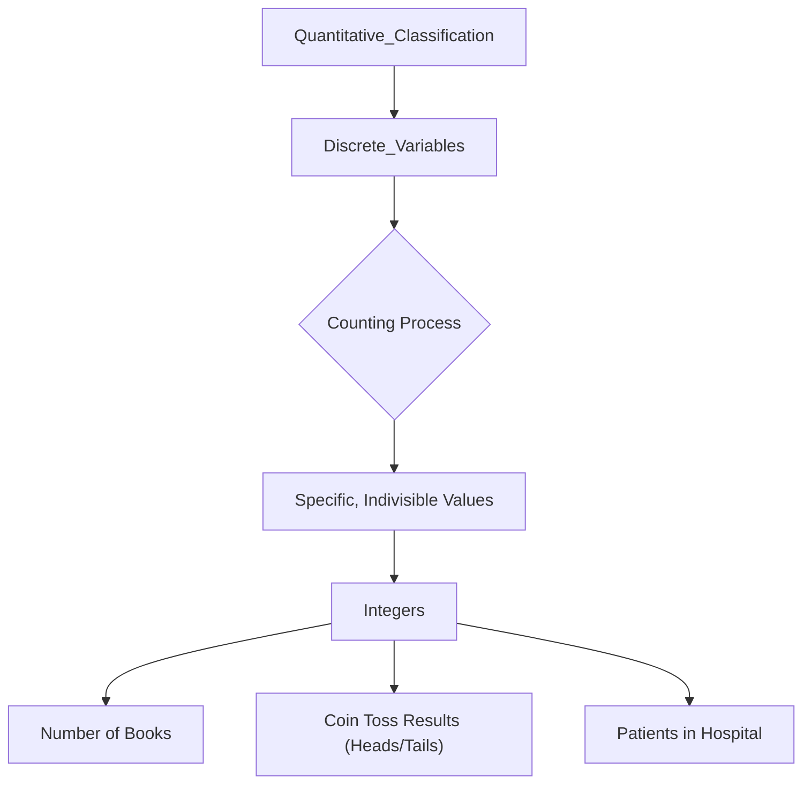
*Note: This `graph TD` illustrates the relationship of discrete variables to quantitative classification, emphasizing their derivation from counting and the resulting specific, indivisible integer values.*

## Context & Framework
#### The Family Tree
Discrete variables are a fundamental branch within the "family tree" of [[Quantitative_Classification]]. They represent countable phenomena, contrasting directly with continuous variables which are measurable. This distinction is crucial for selecting appropriate statistical methods and visualizations. For example, the number of defects on a production line, the number of goals scored in a game, or the number of students in a class are all discrete. Understanding this categorization allows for proper data handling, such as using specific probability distributions designed for discrete data (e.g., Poisson or Binomial distributions).

## The Mastery Deep Dive
#### The Exploded View: Precision in Countable Units
A deeper look into discrete variables reveals their absolute precision in countable units. Unlike continuous variables that can have infinite values between any two points, discrete variables inherently possess "gaps" between their possible values. For instance, the number of employees in a company can only be an integer (e.g., 50, 51, not 50.5). This "exploded view" emphasizes that these variables are not about measurement along a scale, but rather about exact enumeration. This characteristic influences how discrete data is recorded, analyzed, and interpreted, especially in frequency distributions where each distinct value (or small range of values) holds significance.

#### Spot the Impostor (Don't be Fooled)
A common trap is to confuse discrete variables with continuous ones, especially when averages are involved. For example, while the *number* of children in a family is discrete (1, 2, 3), the *average* number of children per family across a population can be a fractional value (e.g., 2.2). The "impostor" here is the average, which appears continuous, but the underlying individual data points remain discrete. The crucial test is whether an individual data point can logically take on a fractional value. If not, it's discrete. Don't be fooled by the aggregation; always look at the nature of the individual observation.

## Constraints & Limitations
#### The Engineering Trade-off: Limited Granularity
A key limitation of discrete variables is their inherently limited granularity. While this precision in counting is an advantage in some contexts, it means that subtle variations or fractional nuances cannot be captured. For instance, you can count the number of customers, but you cannot have half a customer. This lack of intermediate values can sometimes restrict the depth of analysis or the applicability of certain mathematical models that assume a continuous underlying distribution. The "engineering trade-off" is between the simplicity and exactness of counting versus the detailed spectrum of measurement.

## Significance & Application
Discrete variables are omnipresent in data analysis. In **business**, they are used to count the number of products sold, customer complaints, or employees. In **healthcare**, they quantify the number of patients, disease cases, or surgical procedures. **Researchers** use them to count experimental outcomes, such as the number of successes in a series of trials. These variables form the basis for many statistical tests and models, particularly those involving counts and frequencies. Understanding discrete variables is fundamental to accurate enumeration and analysis of countable phenomena.

## The Worked Example
*Test your mastery. Cover the solutions below to test yourself first.*

Consider the results of rolling a single die multiple times. The possible outcomes are 1, 2, 3, 4, 5, or 6.

**Goal:** Determine if the outcome of a single die roll is a discrete variable and explain why.

**Step 1: Analyze the Nature of the Values**
The outcomes are specific integers (1, 2, 3, 4, 5, 6).

**Step 2: Check for Subdivisibility**
Can you roll a 3.5 on a standard die? No. The values cannot be meaningfully subdivided. You either roll a 3 or a 4, but nothing in between.

**Conclusion:**
Yes, the outcome of a single die roll is a [[Discrete_Variables]]. This is because the values it can assume are specific, countable integers that cannot be further subdivided. It's a clear instance of data obtained by counting distinct possibilities.

## The Proving Ground
*Test your mastery. Cover the solutions below to test yourself first.*

#### Level 1: The Sanity Check (Verification)
**The Variable ID:** Is the number of books in a library a discrete variable?
> **Solution:** Yes, the number of books in a library is a discrete variable because you count individual books, and you cannot have a fraction of a book.

#### Level 2: The Crucible (Mastery & Edge Cases)
**The Impossible Case:** A statistician reports that the average number of traffic accidents at a particular intersection last year was 3.7. A new intern argues this is an "impossible case" because "you can't have 0.7 of an accident," implying that the number of accidents is not a discrete variable. Explain why the intern is confused and how the number of accidents is indeed a discrete variable, despite the fractional average.
> **Solution:** The intern's confusion arises from misinterpreting the average as an individual observation. The number of accidents on any given day or in any single event *is* a [[Discrete_Variables]] (you have 0, 1, 2, etc., accidents, not 0.7). However, when you calculate the *average* over multiple discrete observations (e.g., total accidents divided by the number of days/intersections), that average can legitimately be a fractional value (e.g., 37 accidents over 10 days = 3.7 accidents/day). The "impossible case" is only if an *individual* accident could be fractional; the average is simply a summary statistic.

## Key Takeaways
*   Discrete variables assume specific, distinct, and indivisible numerical values, typically obtained by counting.
*   They usually result in whole numbers and do not have valid fractional or decimal values between possibilities.
*   Understanding their countable nature is crucial for appropriate statistical analysis.

## Knowledge Graph Connections
| Concept                         | Connection / Relationship                                                          |
| :
------------------------------ | :
--------------------------------------------------------------------------------- |
| [[Quantitative_Classification]] | Discrete variables are a fundamental sub-category of quantitative classification. |
| [[Continuous_Variables]]        | Directly contrasted with discrete variables based on divisibility of values.       |
| [[Ungrouped_Frequency_Distributions]] | Often used to display the frequencies of discrete variable values.                 |
| [[Frequency_Distributions]]     | Discrete variables are a type of data that frequency distributions organize.       |
---

---

## Frequency Polygon


## Definition
Before proceeding, ensure you master [[Grouped_Frequency_Distributions_GFD]] and [[Class_Mark]].
A Frequency Polygon is a line graph constructed by plotting points representing the frequencies of each class against their corresponding [[Class_Mark]] (midpoint) and then joining these points with straight lines. To close the polygon, the line segments are extended to the class marks of the imaginary classes at each end, which have zero frequency. It's like plotting the exact center of the top of each bar in a [[Histogram]] and then connecting these centers with a continuous line.

## The Mental Model
Imagine you've drawn a series of mountain peaks representing a histogram. A frequency polygon is like tracing a line that connects the very highest point of each peak. This continuous line smooths out the 'blocky' appearance of the histogram, making it easier to see the overall shape of the data distribution, especially for comparing multiple datasets on the same graph. It's a way to emphasize the flow and contour of the data rather than the individual bars.

```mermaid
xychart-beta
    title "Weight Distribution of Students (Frequency Polygon)"
    x-axis [40.5, 48.5, 56.5, 64.5, 72.5, 80.5, 88.5, 96.5]
    y-axis "Number of Students" min:0 max:20 step:5
    line "Frequency"
```
*Note: This `xychart-beta` (line type) visually represents a frequency polygon. The x-axis uses class marks (48.5, 56.5, etc.) and includes imaginary zero-frequency classes (40.5, 96.5) to close the polygon. The y-axis shows frequencies, and the line connects these points, illustrating the smooth distribution of student weights.*

## Context & Framework
#### The "Don't Make Me Think" Rule
A [[Frequency_Polygon]] adheres to the "Don't Make Me Think" rule by providing a clear and continuous visual representation of the data's distribution, making it particularly effective for comparing two or more distributions on the same graph. By using lines instead of bars, it reduces visual clutter and allows the eye to easily follow the contours of the data, highlighting shifts in central tendency, differences in spread, or variations in shape between datasets. For example, overlaying the frequency polygons of exam scores for two different classes immediately shows which class performed better or had a wider range of scores.

## The Mastery Deep Dive
#### The Exploded View: Points and Connectivity
The "exploded view" of a [[Frequency_Polygon]] focuses on the precise plotting of points and their connectivity. Each point on the graph is defined by two coordinates: the x-coordinate, which is the [[Class_Mark]] (midpoint) of a class interval, and the y-coordinate, which is the frequency of that class. For example, for a class 61-68 with a frequency of 13 and a class mark of 64.5, a point would be plotted at (64.5, 13). These points are then connected by straight lines. Crucially, to "close" the polygon and anchor it to the x-axis, additional points are plotted at the class marks of imaginary classes with zero frequency at each end of the distribution. This systematic construction ensures a complete and accurate visual contour of the data.

#### The "Same Story, Different Setting" (Histogram to Polygon)
A [[Frequency_Polygon]] tells the "same story" as a [[Histogram]] but in a "different setting" – a smoother, more continuous line rather than discrete bars. It can be directly constructed from a histogram by joining the midpoints of the upper edges of the rectangles. This transformation allows for a less cluttered visual, especially when dealing with large numbers of observations or comparing multiple datasets. While the histogram emphasizes the frequency within specific intervals, the frequency polygon emphasizes the overall shape and flow of the distribution, making trends and comparisons more apparent to the viewer. Both convey the same underlying frequency information, but with different visual emphasis.

## Constraints & Limitations
#### The Engineering Trade-off: Loss of Interval Clarity
A minor "engineering trade-off" with a [[Frequency_Polygon]] is the "loss of interval clarity" compared to a [[Histogram]]. While the polygon effectively depicts the overall shape and makes comparisons easy, the precise boundaries of each class interval are not as immediately apparent as they are with the distinct bars of a histogram. The points represent the midpoints, and the lines connect these midpoints, slightly abstracting the exact range of values that each frequency represents. This means that for detailed interval-specific information, the underlying [[Grouped_Frequency_Distributions_GFD]] or a [[Histogram]] might still be necessary to complement the polygon's overall view.

## Significance & Application
[[Frequency_Polygon]]s are valuable graphical tools for visualizing the shape of a data distribution, particularly for [[Continuous_Variables]] or large discrete datasets. They are especially useful when comparing two or more distributions simultaneously on the same graph, as the lines are less visually intrusive than multiple sets of bars. In **education**, they can compare grade distributions between different cohorts. In **market research**, they might show the distribution of customer spending across different product categories. They provide a clear, smooth representation of data patterns, aiding in quick visual comparisons and trend identification.

## The Worked Example
*Test your mastery. Cover the solutions below to test yourself first.*

Consider the following [[Grouped_Frequency_Distributions_GFD]] with frequencies and class marks:

| Class Limit | Class Mark | Frequency |
| :
---------- | :
--------- | :
-------- |
| 45 – 52     | 48.5       | 5         |
| 53 – 60     | 56.5       | 8         |
| 61 – 68     | 64.5       | 13        |
| 69 – 76     | 72.5       | 16        |
| 77 – 84     | 80.5       | 5         |
| 85 – 92     | 88.5       | 3         |

**Goal:** Understand how a frequency polygon would represent this data.

**Step 1: Identify Plotting Points**
Each point for the polygon will be (`Class Mark`, `Frequency`):
*   (48.5, 5)
*   (56.5, 8)
*   (64.5, 13)
*   (72.5, 16)
*   (80.5, 5)
*   (88.5, 3)

**Step 2: Add Imaginary Zero-Frequency Classes (Mental Model)**
To close the polygon, add points for imaginary classes:
*   Before 45-52: Class mark 40.5 (48.5 - 8), Frequency 0. Point: (40.5, 0)
*   After 85-92: Class mark 96.5 (88.5 + 8), Frequency 0. Point: (96.5, 0)

**Step 3: Visualize Connecting Points (Mental Model)**
Imagine plotting these points on a graph and connecting them with straight lines, starting from (40.5, 0), going through all the class mark points, and ending at (96.5, 0).

**Why this works:**
*   **Visual Flow:** The connected line segments provide a clear and smooth visual of the data's distribution, emphasizing the overall shape rather than individual bars.
*   **Comparison Aid:** If you had another dataset, you could overlay its frequency polygon on the same graph for direct visual comparison of their distributions.

## The Proving Ground
*Test your mastery. Cover the solutions below to test yourself first.*

#### Level 1: The Sanity Check (Verification)
**The Element ID:** What specific value from a [[Grouped_Frequency_Distributions_GFD]] is plotted on the x-axis to construct a [[Frequency_Polygon]]?
> **Solution:** The [[Class_Mark]] (or midpoint) of each class interval is plotted on the x-axis to construct a [[Frequency_Polygon]].

#### Level 2: The Crucible (Mastery & Edge Cases)
**The Friction Point:** A student creates a [[Frequency_Polygon]] by plotting the upper [[Class_Limits]] against the frequencies and connecting the points. When comparing it to a correctly drawn polygon, their graph appears shifted and distorted. Explain this "friction point" and why using class limits instead of [[Class_Mark]] for plotting points is a fundamental error that leads to misrepresentation.
> **Solution:** This is a "friction point" because using the upper [[Class_Limits]] instead of the [[Class_Mark]] (midpoint) for plotting points fundamentally misrepresents the distribution. The [[Class_Mark]] is designed to be the *representative center* of all data within an interval. Plotting the upper limit systematically shifts all points to the right of their true central position, distorting the perceived shape and location of the distribution's peak. This error makes comparisons inaccurate and leads to a misinterpretation of the data's central tendency and overall shape, creating a "shifted" version of the correct distribution. The [[Class_Mark]] is essential because it is the most accurate single value to represent the entire interval on the graph's x-axis.

## Key Takeaways
*   A frequency polygon is a line graph connecting class marks plotted against their frequencies.
*   It provides a smoother visualization of data distribution than a histogram, especially for comparisons.
*   Imaginary zero-frequency classes are added at the ends to close the polygon to the x-axis.

## Knowledge Graph Connections
| Concept                                 | Connection / Relationship                                                          |
| :
-------------------------------------- | :
--------------------------------------------------------------------------------- |
| [[Grouped_Frequency_Distributions_GFD]] | A frequency polygon is a graphical representation derived from a GFD.            |
| [[Class_Mark]]                          | The x-axis values in a frequency polygon are the class marks.                      |
| [[Histogram]]                           | Can be seen as a smoothed version of a histogram, connecting the midpoints of bars. |
| [[Continuous_Variables]]                | Particularly useful for visualizing the distribution of continuous data.           |
| [[Rules_for_Forming_a_GFD]]             | A correctly formed GFD (following rules) is a prerequisite for accurate frequency polygon construction. |
---

---

## Histogram


## Definition
Before proceeding, ensure you master [[Grouped_Frequency_Distributions_GFD]] and [[Continuous_Variables]].
A Histogram is a graphical representation that organizes a group of [[Continuous_Variables]] into user-specified ranges (classes) and displays the frequency of data points within each range as adjacent vertical bars. It is similar in appearance to a bar graph, but the bars in a histogram touch each other, signifying the continuous nature of the data, and the width of each bar represents the [[Class_Width]]. Think of it as a skyline made of blocks, where each block's height shows how many data points fall into that specific continuous range, and the blocks are all touching.

## The Mental Model
Imagine you're sorting different sized apples into bins. You have a "small" bin, a "medium" bin, and a "large" bin. A histogram is like looking at these bins from the front: the height of each bin shows how many apples are inside, and because apple sizes are continuous, the "bins" (bars) are lined up right next to each other without gaps. This visual immediately tells you which size category has the most apples, and how the sizes are distributed across all the categories.

```mermaid
xychart-beta
    title "Weight Distribution of Students (kg)"
    x-axis [44.5, 52.5, 60.5, 68.5, 76.5, 84.5, 92.5]
    y-axis "Number of Students" min:0 max:20 step:5
    bar "Frequency"
```
*Note: This `xychart-beta` (bar type) visually represents a histogram. The x-axis uses class boundaries (44.5, 52.5, etc.) to show the continuous nature of the data, and the height of each bar corresponds to the frequency within that class, illustrating the distribution of student weights.*

## Context & Framework
#### Where do Users Get Stuck?
Users often "get stuck" by confusing a [[Histogram]] with a standard [[Bar_Chart]]. The critical distinction lies in the type of data they represent and the visual cues. A histogram is exclusively for [[Continuous_Variables]] (or discrete variables with many unique values, treated as continuous), where the bars touch to denote continuity, and the x-axis represents numerical intervals. A bar chart is typically for [[Qualitative_Classification]] or discrete data with distinct categories, where bars are separated. Failing to recognize this difference can lead to misinterpretation of data distribution and relationships. Understanding the continuity is key to avoiding this common friction point.

## The Mastery Deep Dive
#### The Exploded View: Components of a Bar
The "exploded view" of a [[Histogram]] bar reveals that its key components are its width and height. The **width** of each bar is defined by the [[Class_Width]] (the range of the interval) and spans between its [[Class_Boundaries]]. These boundaries ensure that bars touch. The **height** of each bar represents the frequency (or relative frequency) of data points falling into that specific class interval. For example, a bar from 60.5 to 68.5 on the x-axis, with a height of 13, indicates that 13 data points (e.g., students) fall within that weight range. This precise construction allows for a visual understanding of the data's density and distribution.

#### The "Don't Make Me Think" Rule
A well-constructed [[Histogram]] adheres to the "Don't Make Me Think" rule by visually communicating the data's distribution without requiring extensive mental calculations. The contiguous bars immediately convey the continuous nature of the variable. The varying heights of the bars make it effortless to identify peaks (most frequent classes) and valleys (least frequent classes), as well as the overall shape (e.g., symmetrical, skewed) and spread of the data. For example, seeing a histogram with a long tail to the right instantly suggests a positively skewed distribution, requiring no complex interpretation. This intuitive clarity is why histograms are powerful tools for quick data insights.

## Constraints & Limitations
#### The Engineering Trade-off: Sensitivity to Class Width
A significant "engineering trade-off" for a [[Histogram]] is its "sensitivity to [[Class_Width]]." The visual appearance of a histogram, including its perceived shape and the identification of modes, can change dramatically depending on the chosen class width. If the class width is too narrow, the histogram might appear jagged and noisy, obscuring the true distribution. If it's too wide, it might oversimplify the data, hiding important features. This means there's no single "perfect" histogram, and analysts must judiciously select a class width (often guided by the [[Rules_for_Forming_a_GFD]]) that best reveals the underlying data patterns without distortion.

## Significance & Application
[[Histogram]]s are indispensable for visualizing the distribution of continuous numerical data. In **quality control**, they show the distribution of product dimensions or defect rates. In **finance**, they display the distribution of stock returns or asset prices. In **healthcare**, they illustrate the distribution of patient ages, blood pressure readings, or recovery times. They quickly reveal the shape, central tendency, variability, and presence of outliers in a dataset, making complex numerical information accessible and aiding in decision-making based on data patterns. They are a foundational tool for exploratory data analysis.

## The Worked Example
*Test your mastery. Cover the solutions below to test yourself first.*

Consider the following [[Grouped_Frequency_Distributions_GFD]] for student weights:

| Weight (in kg) | Number of students | Class Boundary |
| :
------------- | :
----------------- | :
------------- |
| 45 – 52        | 5                  | 44.5 – 52.5    |
| 53 – 60        | 8                  | 52.5 – 60.5    |
| 61 – 68        | 13                 | 60.5 – 68.5    |
| 69 – 76        | 16                 | 68.5 – 76.5    |
| 77 – 84        | 5                  | 76.5 – 84.5    |
| 85 – 92        | 3                  | 84.5 – 92.5    |

**Goal:** Understand how a histogram would represent this data.

**Step 1: Identify Axes**
*   **X-axis:** Represents the continuous variable (Weight in kg) using the [[Class_Boundaries]] (e.g., 44.5, 52.5, 60.5...).
*   **Y-axis:** Represents the frequency (Number of students).

**Step 2: Visualize Bars (Mental Model)**
Imagine drawing bars for each class:
*   A bar from 44.5 to 52.5 on the x-axis, reaching a height of 5 on the y-axis.
*   An adjacent bar from 52.5 to 60.5, reaching a height of 8.
*   ...and so on, with all bars touching.

**Why this works:**
*   **Continuity:** The bars touch, visually emphasizing that weight is a [[Continuous_Variables]].
*   **Distribution:** The varying heights of the bars immediately show the distribution of student weights, with the 69-76 kg class having the highest frequency (tallest bar). This makes it easy to identify the most common weight range.

## The Proving Ground
*Test your mastery. Cover the solutions below to test yourself first.*

#### Level 1: The Sanity Check (Verification)
**The Element ID:** What is a key visual characteristic that distinguishes a [[Histogram]] from a standard [[Bar_Chart]]?
> **Solution:** The key visual characteristic distinguishing a [[Histogram]] from a [[Bar_Chart]] is that the bars in a histogram touch each other, while bars in a bar chart are separated by gaps. This contact signifies the continuous nature of the data in a histogram.

#### Level 2: The Crucible (Mastery & Edge Cases)
**The Friction Point:** A data scientist presents a [[Histogram]] of "Number of Children per Family" to a non-technical audience. The audience immediately asks why the bars are touching, stating, "You can't have 2.5 children, so why is it continuous?" Explain this "friction point" and how it highlights a common misunderstanding in interpreting histograms, particularly when discrete data is represented as continuous for visualization purposes.
> **Solution:** This is a classic "friction point" highlighting a common misunderstanding. While the "number of children per family" is indeed a [[Discrete_Variables]], histograms are traditionally used for [[Continuous_Variables]] (where bars touch). When discrete data with a wide range of values or where the interpretation benefits from grouping is displayed in a histogram, it's often treated as if it were continuous for visual representation, using [[Class_Boundaries]] to ensure bars touch. The audience's confusion stems from the literal interpretation of "continuous," overlooking that for visualization purposes, even discrete data can be grouped into intervals and presented this way to show its distribution pattern, despite the underlying data not being infinitely divisible. The explanation must clarify that the touching bars indicate the *grouping of ranges* rather than the infinite divisibility of the underlying discrete values.

## Key Takeaways
*   A histogram is a bar-like graph for [[Continuous_Variables]], with adjacent bars representing class frequencies.
*   Bar width is determined by class width and spans class boundaries, ensuring bars touch.
*   It effectively visualizes data distribution, shape, central tendency, and spread.

## Knowledge Graph Connections
| Concept                                 | Connection / Relationship                                                          |
| :
-------------------------------------- | :
--------------------------------------------------------------------------------- |
| [[Grouped_Frequency_Distributions_GFD]] | A histogram is the primary graphical representation derived from a GFD.            |
| [[Continuous_Variables]]                | Histograms are specifically designed for visualizing the distribution of continuous data. |
| [[Class_Width]]                         | Defines the width of the bars in a histogram.                                      |
| [[Class_Boundaries]]                    | Used to define the x-axis intervals, ensuring bars touch correctly.                |
| [[Frequency_Polygon]]                   | Can be constructed by joining the midpoints of the tops of histogram bars.         |
| [[Bar_Chart]]                           | Often contrasted with histograms due to differences in data type and bar spacing. |
---

---

## Line Graph


## Definition
Before proceeding, ensure you master [[Other_Graphical_Representations_of_Statistical_Data]] and [[Time_Series]].
A Line Graph is a graphical representation that displays the relationship between time (plotted on the horizontal x-axis) and the value of a variable (plotted on the vertical y-axis). It shows changes in the variable's values through time by connecting successive data points with straight line segments. It is primarily used for [[Time_Series]] data to illustrate trends, patterns, and fluctuations over chronological periods. Think of it like a stock market chart, showing how a stock's price moves up and down over days, weeks, or months.

## The Mental Model
Imagine you're tracking your daily step count over a month. Each day, you mark a point on a calendar grid (day on the bottom, steps on the side). A line graph is simply connecting all these daily points. This immediately creates a "path" that visually reveals your activity pattern: periods of high activity (steep upward lines), low activity (flat lines), or decreasing activity (downward lines). This path is your direct visual of a trend over time.

```mermaid
xychart-beta
    title "Coffee Export Target vs. Achieved (Ethiopia)"
    x-axis
    y-axis "Volume (1,000 Metric Tons)" min:0 max:1200
    line "Target"
    line "Achieved"
```
*Note: This `xychart-beta` (line type) clearly visualizes two time series: coffee export targets and achieved volumes over five years, demonstrating how a line graph is used to show trends and comparisons over time.*

## Context & Framework
#### The "Don't Make Me Think" Rule
A [[Line_Graph]] adheres strongly to the "Don't Make Me Think" rule when visualizing [[Time_Series]] data. The continuous line segments instinctively guide the eye to follow the progression of the variable, making trends, peaks, valleys, and overall patterns immediately apparent. For instance, seeing a sharply rising line requires no complex interpretation to understand a rapid increase over time. This intuitive visual flow makes it effortless for viewers to grasp the temporal dynamics of the data, minimizing cognitive load and maximizing the efficiency of insight extraction from time-dependent information.

## The Mastery Deep Dive
#### The Exploded View: Points and Their Temporal Connections
The "exploded view" of a [[Line_Graph]] emphasizes the precise plotting of individual data points and their crucial temporal connections. Each point on the graph represents a specific observation at a particular moment in time (e.g., sales on January 1st, temperature at 3 PM). The x-axis always represents time (e.g., years, months, days), and the y-axis represents the value of the variable. The power of the line graph comes from connecting these points. These connections create a visual trajectory that instantly conveys rates of change, periods of stability, and overall direction over time. The careful selection of the time scale on the x-axis directly impacts the perceived steepness and detail of these connections.

#### Analyzing the "Slope" for Rates of Change
Beyond just showing trends, a deeper engagement with [[Line_Graph]]s involves analyzing the "slope" of the connecting lines. A steep upward slope indicates a rapid increase in the variable's value over that time period. A steep downward slope suggests a rapid decrease. A relatively flat line denotes stability or slow change. This visual interpretation of slope provides immediate insights into the *rate* of change, which is often as important as the direction itself. For example, comparing the slopes of two lines representing different investment performances can quickly show which investment is growing faster, allowing for dynamic comparative analysis.

## Constraints & Limitations
#### The Engineering Trade-off: Implying False Continuity
A significant "engineering trade-off" with a [[Line_Graph]] is its potential for "implying false continuity" when the underlying data is sparse or inherently discrete. Connecting points with a line visually suggests a continuous progression, even if observations were only taken at infrequent or irregular intervals. This can mislead viewers into assuming values existed between the measured points when, in reality, they were unobserved or perhaps not continuous. For example, connecting annual data points with a line might falsely suggest that growth was perfectly linear throughout the year. Analysts must be mindful of this potential misrepresentation, especially with non-continuous data.

## Significance & Application
[[Line_Graph]]s are ubiquitous for visualizing [[Time_Series]] data and showing trends. In **finance**, they track stock market indices and commodity prices. In **meteorology**, they plot temperature, rainfall, or wind speed over time. **Businesses** use them to monitor sales, profits, and customer growth. **Public health** agencies display disease incidence rates over weeks or months. Their strength lies in clearly illustrating how a variable evolves chronologically, making them an indispensable tool for forecasting, identifying patterns, and making decisions based on temporal dynamics.

## The Worked Example
*Test your mastery. Cover the solutions below to test yourself first.*

Consider the following data on the target and achieved coffee exports for Ethiopia over five years (in 1,000 Metric Tons):

| Year | Target | Achieved |
| :
--- | :
----- | :
------- |
| 2011 | 504    | 391      |
| 2012 | 608    | 417      |
| 2013 | 726    | 423      |
| 2014 | 871    | 438      |
| 2015 | 1103   | 444      |

**Goal:** Understand how a [[Line_Graph]] would represent this data to compare target vs. achieved exports over time.

**Step 1: Identify Axes**
*   **X-axis:** Time (Year: 2011, 2012, ..., 2015).
*   **Y-axis:** Value of the variable (Export Volume in 1,000 Metric Tons).

**Step 2: Visualize Plotting Points and Lines (Mental Model)**
Imagine plotting two sets of points on the same graph:
*   One line connecting the 'Target' values for each year.
*   Another line connecting the 'Achieved' values for each year.

**Why this works:**
*   **Trend Comparison:** The two distinct lines (one for target, one for achieved) immediately allow for a visual comparison of how actual performance tracked against targets over the five-year period. You can quickly see the widening gap between target and achieved exports.
*   **Clarity of Change:** The slopes of the lines visually represent the rate of change in both targets and achievements, highlighting periods of faster or slower progress.

## The Proving Ground
*Test your mastery. Cover the solutions below to test yourself first.*

#### Level 1: The Sanity Check (Verification)
**The Element ID:** What types of data variables are best suited for display on the x-axis of a [[Line_Graph]]?
> **Solution:** Time-based variables (e.g., years, months, days, hours) are best suited for display on the x-axis of a [[Line_Graph]].

#### Level 2: The Crucible (Mastery & Edge Cases)
**The "Don't Make Me Think" Rule:** A news report uses a [[Line_Graph]] to show the unemployment rate, with data points collected quarterly. The line connecting the points is very smooth, almost continuous. A viewer, however, argues that the graph implies a false continuity of the unemployment rate, as it's typically reported at discrete intervals. Explain this "friction point" and how the smoothness of the line can, despite aiding the "Don't Make Me Think" rule for overall trend, subtly mislead the viewer about the precise moment-to-moment fluctuation of the unemployment rate.
> **Solution:** This creates a "friction point" because while the [[Line_Graph]] effectively uses the "Don't Make Me Think" rule to convey the overall trend of unemployment, the smoothness of the line can "imply false continuity" for data that is inherently reported at discrete quarterly intervals. The line visually suggests that the unemployment rate seamlessly and linearly transitioned between the recorded quarterly points, even though precise, moment-to-moment fluctuations within each quarter are unknown or unmeasured. This can subtly mislead the viewer into believing there's a continuous, smooth path of change, rather than distinct measurements at specific points, making them forget the discrete nature of the data collection process.

## Key Takeaways
*   Line graphs show trends of a variable over time, with time on the x-axis.
*   They are ideal for visualizing time series data, showing patterns, and changes.
*   Connecting points implies continuity, which should be considered when interpreting sparse data.

## Knowledge Graph Connections
| Concept                                      | Connection / Relationship                                                          |
| :
------------------------------------------- | :
--------------------------------------------------------------------------------- |
| [[Other_Graphical_Representations_of_Statistical_Data]] | A common type of graphical representation within the broader category.           |
| [[Time_Series]]                              | The primary type of data that a line graph is designed to visualize.               |
| [[Chronological_Classification]]             | Line graphs are the standard for presenting chronologically classified data.       |
| [[Vertical_Line_Graph]]                      | Contrasted with vertical line graphs, which are for discrete frequency distributions. |
---

---

## Ogive


## Definition
Before proceeding, ensure you master [[Cumulative_Frequency_Distribution_CFD]] and [[Class_Boundaries]].
An Ogive (pronounced "OJAIVE") is a line graph of a [[Cumulative_Frequency_Distribution_CFD]]. It is constructed by plotting the cumulative frequencies against the upper [[Class_Boundaries]] of each class interval for a "less than" type ogive, or against the lower class boundaries for a "more than" type ogive. The points are then connected by straight lines. Think of it as a smooth, ascending (or descending) curve that shows how quickly data accumulates over a range of values, providing a visual representation of percentiles.

## The Mental Model
Imagine you're climbing a hill, and the steepness of the hill shows how fast a certain amount of data accumulates. An ogive is like tracing that hill's profile. A "less than" ogive starts low and rises, showing how the total count builds up as you move to higher values. A "more than" ogive starts high and drops, showing how much data remains above a certain point. This visual quickly tells you, for example, at what score 50% of students were reached, or how many students scored above a certain threshold.

```mermaid
xychart-beta
    title "Less Than Type Ogive (Student Marks)"
    x-axis [25.5, 36.5, 47.5, 58.5, 69.5, 80.5, 91.5]
    y-axis "Cumulative Frequency" min:0 max:60 step:10
    line "Cumulative Frequency"
```
*Note: This `xychart-beta` (line type) visualizes a "Less than" type ogive. The x-axis uses class boundaries (25.5, 36.5, etc.), and the y-axis represents the cumulative frequency. The line connects these points, showing the accumulation of student marks.*

## Context & Framework
#### Where do Users Get Stuck?
Users often "get stuck" with [[Ogive]]s when they confuse the x-axis plotting points. For a "less than" ogive, it's crucial to plot against the *upper* [[Class_Boundaries]] of each class interval, not the class limits or class marks. Similarly, for a "more than" ogive, it's against the *lower* class boundaries. Failing to use the correct boundary points will result in a shifted or distorted ogive, leading to misinterpretation of cumulative values. This adherence to precise plotting against boundaries is key to accurately representing the underlying [[Cumulative_Frequency_Distribution_CFD]] and avoiding this common friction point.

## The Mastery Deep Dive
#### The Exploded View: Plotting Cumulative Points
The "exploded view" of an [[Ogive]] focuses on the precise plotting of cumulative points. For a "less than" ogive, each point on the graph is defined by:
*   **X-coordinate:** The upper [[Class_Boundaries]] of a class interval (e.g., 36.5, 47.5, 58.5...).
*   **Y-coordinate:** The cumulative frequency corresponding to that upper boundary.
An additional point (0 cumulative frequency) is plotted at the lower boundary of the first class to ensure the ogive starts at zero. For a "more than" ogive, it's the lower class boundary on the x-axis and the "more than" cumulative frequency on the y-axis, starting at the total frequency and ending at zero for the highest class's upper boundary. This methodical plotting ensures the ogive accurately reflects the step-by-step accumulation of data.

#### The "Don't Make Me Think" Rule
An [[Ogive]] excels at the "Don't Make Me Think" rule by visually answering questions about percentiles and thresholds. Without any calculation, a user can quickly locate, for instance, the score below which 50% of students fall (the median), or the number of students who achieved a score above a certain pass mark. This is achieved by simply drawing a line from the desired cumulative frequency on the y-axis across to the ogive curve, and then down to the x-axis. This intuitive extraction of information makes ogives exceptionally useful for quick data analysis and decision-making related to rank and distribution.

## Constraints & Limitations
#### The Engineering Trade-off: Hiding Individual Class Frequencies
A subtle "engineering trade-off" with an [[Ogive]] is that by emphasizing cumulative totals, it "hides individual class frequencies" in its direct visual. While you can infer the frequency of a single class interval by observing the steepness of the curve between two points, or by referring back to the [[Cumulative_Frequency_Distribution_CFD]] table, it's not immediately apparent as it is in a [[Histogram]]. This means that if the primary goal is to visualize how many observations fall within *each specific interval*, an ogive alone might not be the most direct graphical tool. Analysts must balance the benefit of cumulative insights with the need for individual interval details.

## Significance & Application
[[Ogive]]s are invaluable graphical tools for visualizing [[Cumulative_Frequency_Distribution_CFD]]. They are widely used to determine various percentile values, such as the median (50th percentile), quartiles (25th and 75th percentiles), and other specific data points below or above which a certain percentage of observations fall. In **education**, an ogive can help assess student performance by showing the percentage of students who scored below a certain grade. In **business**, it can illustrate the proportion of products falling within certain quality thresholds. They provide clear insights into the overall shape and concentration of data.

## The Worked Example
*Test your mastery. Cover the solutions below to test yourself first.*

Consider the following "Less than" type **[[Cumulative_Frequency_Distribution_(CFD)]** for student marks:

| Class Boundary  | Cumulative Frequency (Less than type) |
| :
-------------- | :
------------------------------------ |
| Less than 25.5  | 0                                     |
| Less than 36.5  | 4                                     |
| Less than 47.5  | 11                                    |
| Less than 58.5  | 21                                    |
| Less than 69.5  | 39                                    |
| Less than 80.5  | 49                                    |
| Less than 91.5  | 54                                    |

**Goal:** Understand how a "less than" type [[Ogive]] would represent this data.

**Step 1: Identify Plotting Points**
Each point for the ogive will be (`Upper Class Boundary`, `Cumulative Frequency`):
*   (25.5, 0) - This is the starting point (lower boundary of first class, 0 cumulative frequency)
*   (36.5, 4)
*   (47.5, 11)
*   (58.5, 21)
*   (69.5, 39)
*   (80.5, 49)
*   (91.5, 54) - This is the ending point (upper boundary of last class, total cumulative frequency)

**Step 2: Visualize Connecting Points (Mental Model)**
Imagine plotting these points on a graph where the x-axis is the [[Class_Boundaries]] and the y-axis is the cumulative frequency. Connect the points with straight lines. The line will start at 0 and gradually rise to the total frequency (54), forming an S-shaped curve (or part of one).

**Why this works:**
*   **Visual Percentiles:** The ogive visually shows the cumulative build-up of frequencies. You could easily estimate the mark below which, say, 50% of students fall (the median) by finding 27 on the y-axis and tracing to the curve, then down to the x-axis.
*   **Data Concentration:** The steepness of the curve indicates where data is most concentrated; a steeper segment means many observations fall within that range.

## The Proving Ground
*Test your mastery. Cover the solutions below to test yourself first.*

#### Level 1: The Sanity Check (Verification)
**The Element ID:** For a "less than" type [[Ogive]], what values are plotted on the x-axis?
> **Solution:** For a "less than" type [[Ogive]], the upper [[Class_Boundaries]] of each class interval are plotted on the x-axis.

#### Level 2: The Crucible (Mastery & Edge Cases)
**The Friction Point:** An analyst creates a "less than" type [[Ogive]] for a dataset but accidentally plots the [[Class_Mark]] values on the x-axis instead of the upper [[Class_Boundaries]]. Explain why this leads to a "friction point" in interpreting the ogive for percentile calculations and how it distorts the true cumulative distribution.
> **Solution:** This creates a "friction point" because plotting [[Class_Mark]] values instead of upper [[Class_Boundaries]] on the x-axis fundamentally distorts the [[Ogive]] for percentile calculations. A "less than" ogive is designed to show the proportion of data *below* a certain point. By plotting the *midpoint* of a class (class mark), the graph implies that the cumulative frequency up to that point is already achieved at the center of the interval, rather than at its upper limit, where the cumulative count officially ends for that class. This makes any visual estimation of percentiles (like the median) from the x-axis inaccurate and systematically shifted, leading to a misrepresentation of the true cumulative distribution and incorrect threshold interpretations.

## Key Takeaways
*   An ogive is a line graph representing a cumulative frequency distribution.
*   "Less than" ogives plot cumulative frequencies against upper class boundaries.
*   "More than" ogives plot against lower class boundaries.
*   They are excellent for visually determining percentiles and data concentration.

## Knowledge Graph Connections
| Concept                                 | Connection / Relationship                                                          |
| :
-------------------------------------- | :
--------------------------------------------------------------------------------- |
| [[Cumulative_Frequency_Distribution_CFD]] | An ogive is the primary graphical representation of a CFD.                         |
| [[Class_Boundaries]]                    | Essential for accurate plotting on the x-axis of an ogive.                         |
| [[Percentage_Ogive]]                    | A specialized type of ogive that plots cumulative *percentage* frequencies.        |
| [[Frequency_Distributions]]             | Ogives provide a cumulative perspective on data summarized in frequency distributions. |
---

---

## Pictograms


## Definition
Before proceeding, ensure you master [[Other_Graphical_Representations_of_Statistical_Data]] and [[Frequency_Distributions]].
Pictograms (or pictographs) are graphical representations that use pictures or symbols to represent the frequency or magnitude of data. Each picture or symbol may represent one or more units of the data. They are primarily used to make statistical information more engaging, accessible, and intuitive, especially for a general or non-technical audience. Think of a chart showing population growth using a series of stick figures, where each figure represents 1 million people.

## The Mental Model
Imagine you're explaining how many people commute by different modes of transport. Instead of just numbers or bars, a pictogram would show a row of little car icons for car commuters, a row of bus icons for bus commuters, and so on. Each icon represents, say, 100 people. This visual immediately tells a story using familiar images, making the data highly approachable and easy to compare by simply counting or estimating rows of icons.

```mermaid
%% Mermaid cannot directly generate complex pictograms with varying numbers of icons.
%% This is a conceptual representation for instruction.
graph TD
    A[Vehicle Sales (Year X)] --> B{Car: 🚗🚗🚗🚗🚗};
    B --> C{Truck: 🚚🚚🚚};
    C --> D{Motorcycle: 🏍️🏍️};
    %% Each emoji represents 1000 units for this conceptual pictogram.
```
*Note: This `graph TD` conceptually illustrates a pictogram for vehicle sales, where each emoji represents a predefined number of units (e.g., 1000 units per emoji). This method uses repetitive symbols to denote frequencies for different categories.*

## Context & Framework
#### The "Don't Make Me Think" Rule
[[Pictograms]] are perhaps the ultimate embodiment of the "Don't Make Me Think" rule, leveraging visual recognition to convey quantitative information effortlessly. By using simple, relatable images, they bypass the need for extensive numerical processing, making complex data immediately accessible and engaging for a broad audience. For example, a pictogram showing increasing numbers of tree icons over years instantly communicates deforestation or reforestation trends. This direct visual storytelling minimizes cognitive load and maximizes the speed of comprehension, making pictograms highly effective for quick and intuitive communication of data.

## The Mastery Deep Dive
#### The Exploded View: Symbol-Unit Correspondence
The "exploded view" of a [[Pictograms]] reveals its core mechanism: a clear symbol-unit correspondence. Each single picture or symbol represents a predetermined quantity of data. For example, if a car icon represents 1,000 cars, then five car icons visually represent 5,000 cars. This explicit scaling factor is crucial for accurate interpretation. The strength lies in the simplicity of this direct visual translation, where the number of repeated symbols directly correlates with the frequency or magnitude being displayed. This makes it intuitive to compare categories by simply counting or estimating the rows/columns of symbols, provided the scaling factor is well-defined and consistently applied.

#### The "Grandma Test": Visual Hierarchy
[[Pictograms]] excel at the "Grandma Test" by leveraging visual hierarchy to make data comparisons intuitive. The repetitive nature of the symbols creates an immediate visual distinction between categories with higher frequencies (more symbols) and those with lower frequencies (fewer symbols). This visual 'stacking' or 'lining up' of identical elements allows for quick, effortless judgments about relative magnitudes. For instance, a row of ten person-icons is instantly recognizable as "more" than a row of two, without requiring the viewer to engage in complex numerical decoding. This direct visual language makes data accessible to almost anyone, reinforcing clear and undeniable differences in quantity.

## Constraints & Limitations
#### The Engineering Trade-off: Difficulty with Precision
A significant "engineering trade-off" with [[Pictograms]] is their "difficulty with precision." While excellent for general comparisons and broad trends, pictograms struggle to represent exact numerical values or small differences accurately. If a single symbol represents 1,000 units, how do you represent 500 units? You might use half a symbol, but this can become visually ambiguous. This limitation means that pictograms are not suitable when exact numerical accuracy or very fine-grained comparisons are required. They sacrifice precise detail for broad, intuitive appeal, making them less appropriate for scientific or financial reports where exactness is paramount.

## Significance & Application
[[Pictograms]] are highly effective for engaging and communicating statistical information to a broad, non-technical audience. They are often used in **educational materials** to simplify complex data concepts for children. In **public service announcements** or **news graphics**, they illustrate straightforward comparisons of quantities (e.g., population sizes, resource consumption). Their visual appeal and ease of understanding make them an excellent choice for presenting simple frequency data, particularly when the goal is to convey a general idea or emphasize large differences rather than precise numerical values, thus making data more approachable.

## The Worked Example
*Test your mastery. Cover the solutions below to test yourself first.*

Consider a conceptual pictogram representing the number of new houses built in three different towns in a year:

*   Town A: 150 houses
*   Town B: 250 houses
*   Town C: 100 houses

**Goal:** Understand how a pictogram would represent this data, with each house icon (🏡) representing 50 houses.

**Step 1: Determine Number of Icons for Each Town**
*   Town A: 150 houses / 50 houses/icon = 3 icons
*   Town B: 250 houses / 50 houses/icon = 5 icons
*   Town C: 100 houses / 50 houses/icon = 2 icons

**Step 2: Visualize the Pictogram (Mental Model)**
Imagine the following representation:

*   **Town A:** 🏡🏡🏡
*   **Town B:** 🏡🏡🏡🏡🏡
*   **Town C:** 🏡🏡

**Why this works:**
*   **Visual Representation:** The number of house icons directly corresponds to the number of houses built, with each icon acting as a unit of 50.
*   **Easy Comparison:** It's immediately clear that Town B built the most houses and Town C built the fewest, simply by comparing the lengths of the rows of icons.

## The Proving Ground
*Test your mastery. Cover the solutions below to test yourself first.*

#### Level 1: The Sanity Check (Verification)
**The Element ID:** What is the primary characteristic of [[Pictograms]] that makes them engaging for a non-technical audience?
> **Solution:** The primary characteristic of [[Pictograms]] that makes them engaging for a non-technical audience is their use of recognizable pictures or symbols to represent data, making complex numerical information intuitive and easy to grasp.

#### Level 2: The Crucible (Mastery & Edge Cases)
**The "Grandma Test":** A government report uses a [[Pictograms]] to show the number of registered voters, where each stick figure icon represents 100,000 voters. One category shows 3.5 stick figures, representing 350,000 voters. Explain why this specific representation of "3.5 stick figures" creates a "friction point" and potentially fails the "Grandma Test" for immediate, intuitive comprehension, highlighting the limitation of pictograms for precision.
> **Solution:** The representation of "3.5 stick figures" creates a "friction point" and potentially fails the "Grandma Test" for immediate, intuitive comprehension because it forces the viewer to interpret a fractional symbol. While a full stick figure is easily understood as 100,000 voters, "half a stick figure" (0.5) requires an extra mental step (calculating 0.5 * 100,000 = 50,000), which goes against the pictogram's goal of effortless understanding. This highlights the inherent limitation of [[Pictograms]] for precision: they are excellent for showing whole units and general magnitudes, but their visual simplicity breaks down when precise fractional values need to be conveyed, making them less suitable for detailed numerical accuracy.

## Key Takeaways
*   Pictograms use pictures or symbols to represent data frequencies or magnitudes.
*   Each symbol represents a defined unit of data, making them visually intuitive and engaging.
*   They are best for broad comparisons and non-technical audiences, but limited in precision.

## Knowledge Graph Connections
| Concept                                      | Connection / Relationship                                                          |
| :
------------------------------------------- | :
--------------------------------------------------------------------------------- |
| [[Other_Graphical_Representations_of_Statistical_Data]] | A specific type of graphical representation within the broader category.           |
| [[Frequency_Distributions]]                  | Pictograms are a visual way to represent simple frequency distributions.           |
| [[Bar_Chart]]                                | Similar to bar charts in comparing categories, but uses icons instead of bars.   |
| [[Qualitative_Classification]]               | Often used to represent data from qualitative classifications.                     |
---

---

## Pie Chart


## Definition
Before proceeding, ensure you master [[Other_Graphical_Representations_of_Statistical_Data]] and [[Qualitative_Classification]].
A Pie Chart is a diagrammatic representation of categorical data on a circle, where the circle is partitioned into different sectors. Each sector's area (and corresponding central angle) is proportional to the relative frequency (or percentage) of the item it represents within the total. It is primarily used to show the composition of a whole or the proportion that each category contributes to an aggregate. Think of it as slicing a circular cake, where each slice's size represents a portion of the whole cake.

## The Mental Model
Imagine you have a company budget, and you want to see where all the money goes. A pie chart would be like a pizza cut into slices: one slice for marketing, one for salaries, one for operations, etc. The size of each slice immediately tells you its proportion of the total budget. This visual helps you instantly grasp which categories consume the largest or smallest portions of the whole, making the composition clear.

```mermaid
pie
    title "Departmental Student Distribution (Public University 2023-2024)"
    "Physical Science" : 900
    "Public Health and Humanities" : 820
    "Social Science" : 650
    "Others" : 430
```
*Note: This `pie` chart visually represents the distribution of students across different departments in a public university, where the size of each slice is proportional to the number of students in that department, illustrating the composition of the student body.*

## Context & Framework
#### Where do Users Get Stuck?
Users often "get stuck" with [[Pie_Chart]]s when there are too many categories or when categories have very similar proportions. With too many slices, the chart becomes cluttered and unreadable, making it difficult to differentiate between categories (e.g., more than 5-7 slices can be problematic). If two slices are very close in size (e.g., 24% vs. 26%), it can be hard for the eye to accurately compare their proportions without explicit labels. This "friction point" highlights that while pie charts are intuitive for simple part-to-whole comparisons, their effectiveness diminishes rapidly with increased complexity, making a [[Bar_Chart]] a better alternative in such cases.

## The Mastery Deep Dive
#### The Exploded View: Angles of Proportion
The "exploded view" of a [[Pie_Chart]] reveals that its fundamental construction revolves around the calculation of angles for each sector. The angle of a sector is determined by its relative frequency (RF) multiplied by 360 degrees:
$$ \boxed{\displaystyle \text{Angle of a sector} = \text{Relative Frequency} \times 360^\circ} $$
*   **Relative Frequency (RF):** The frequency of a category divided by the total frequency.
This formula ensures that the area of each slice is directly proportional to its contribution to the whole. For example, if a category accounts for 25% of the total, its sector will have a central angle of 0.25 * 360° = 90°. This precise calculation of angles is what gives the pie chart its power in visually representing proportions, as the human eye is generally good at comparing areas of circles when the differences are significant.

#### The "Don't Make Me Think" Rule
A [[Pie_Chart]] strongly adheres to the "Don't Make Me Think" rule by instantly conveying the part-to-whole relationship. When seeing a pie chart, the viewer's brain immediately processes the relative sizes of the slices, allowing for a quick judgment of which categories are dominant and which are minor. For example, a very large slice for "Salaries" in a budget pie chart instantly signals that salaries are the major expenditure, without needing to read exact percentages (though percentages are usually included for precision). This intuitive visual mapping of area to proportion makes the chart a highly efficient communication tool for compositional data.

## Constraints & Limitations
#### The Engineering Trade-off: Difficulty with Precise Comparison
A significant "engineering trade-off" with a [[Pie_Chart]] is its "difficulty with precise comparison," especially when comparing slices of similar size or comparing parts of *two different* wholes. While easy to see which slice is largest, it's very hard for the human eye to accurately judge if a 24% slice is genuinely larger than a 23% slice without numerical labels. This limitation means that for granular comparisons, a [[Bar_Chart]] is often superior because people are better at comparing lengths than angles or areas. Thus, while visually appealing for broad compositions, pie charts sacrifice precision in detailed comparisons.

## Significance & Application
[[Pie_Chart]]s are ideal for displaying the composition of a whole, particularly for [[Qualitative_Classification]] data. They are widely used in **business** to show market share, budget allocation, or product category contributions to total sales. In **social sciences**, they can illustrate demographic proportions (e.g., percentage of population by marital status). In **education**, they might show the breakdown of student enrollment by faculty. Their strength lies in clearly communicating how each part contributes to the overall total, making them an effective tool for showcasing proportions in a clear and intuitive manner.

## The Worked Example
*Test your mastery. Cover the solutions below to test yourself first.*

Consider the grades of 40 students in a Statistics and Probability course:

| Grade | Number of Students |
| :
---- | :
----------------- |
| A     | 10                 |
| B     | 14                 |
| C     | 8                  |
| D     | 5                  |
| F     | 3                  |
| **Total** | **40**             |

**Goal:** Understand how a [[Pie_Chart]] would represent this grade distribution.

**Step 1: Calculate Relative Frequency (RF) for each Grade**
Formula: `RF = Number of Students / Total Students`

*   A: 10 / 40 = 0.25
*   B: 14 / 40 = 0.35
*   C: 8 / 40 = 0.20
*   D: 5 / 40 = 0.125
*   F: 3 / 40 = 0.075

**Step 2: Calculate Angle of Sector for each Grade**
Formula: `Angle = RF * 360°`

*   A: 0.25 * 360° = 90°
*   B: 0.35 * 360° = 126°
*   C: 0.20 * 360° = 72°
*   D: 0.125 * 360° = 45°
*   F: 0.075 * 360° = 27°
*   **Total Angles = 360°**

**Step 3: Visualize Slices (Mental Model)**
Imagine a circle divided into five slices. The 'B' grade slice would be the largest (126°), followed by 'A' (90°), then 'C' (72°), and so on.

**Why this works:**
*   **Part-to-Whole:** The pie chart clearly shows the proportion of students who received each grade, making it visually evident that 'B' is the most frequent grade and 'F' is the least frequent.
*   **Composition:** It directly illustrates the overall grade composition of the class.

## The Proving Ground
*Test your mastery. Cover the solutions below to test yourself first.*

#### Level 1: The Sanity Check (Verification)
**The Element ID:** For what primary purpose is a [[Pie_Chart]] best suited in data visualization?
> **Solution:** A [[Pie_Chart]] is best suited for showing the composition of a whole, or the proportion that each category contributes to an aggregate.

#### Level 2: The Crucible (Mastery & Edge Cases)
**The Friction Point:** A marketing team uses a [[Pie_Chart]] to compare the market share of ten different competitors. Many of the slices are very thin, and it's difficult to tell if Competitor A (7.8% market share) has a larger slice than Competitor B (7.5% market share) without reading the labels. Explain why this chart creates a "friction point" for accurate visual comparison and why, in this scenario, it fails the "Don't Make Me Think" rule.
> **Solution:** This [[Pie_Chart]] creates a significant "friction point" for accurate visual comparison because the human eye struggles to precisely differentiate between very thin slices or slices with very similar areas (e.g., 7.8% vs. 7.5%) without relying on numerical labels. This directly violates the "Don't Make Me Think" rule, as the viewer is forced to read and process numbers rather than intuitively grasping the proportions from the visual alone. In scenarios with many categories or subtle differences, the pie chart loses its effectiveness as a quick comparison tool, making it a poor choice for displaying such granular market share data. A [[Bar_Chart]] would likely be far more effective for this kind of precise comparison.

## Key Takeaways
*   Pie charts display categorical data as sectors of a circle, proportional to relative frequencies.
*   They are ideal for showing the composition of a whole or part-to-whole relationships.
*   Effectiveness diminishes with too many categories or very similar proportions.

## Knowledge Graph Connections
| Concept                                      | Connection / Relationship                                                          |
| :
------------------------------------------- | :
--------------------------------------------------------------------------------- |
| [[Other_Graphical_Representations_of_Statistical_Data]] | A specific type of graphical representation within the broader category.           |
| [[Qualitative_Classification]]               | Often used to visualize data classified qualitatively, especially for proportions. |
| [[Relative_Frequency_Distribution]]          | The calculation of relative frequencies is fundamental for determining sector angles. |
| [[Bar_Chart]]                                | Often used as a superior alternative to pie charts for comparing multiple categories or small proportional differences. |
---

---

## Rules For Forming A GFD


## Definition
Before proceeding, ensure you master [[Grouped_Frequency_Distributions_GFD]] and [[Class_Width]].
The "Rules" for Forming a GFD (Grouped Frequency Distribution) are a set of guidelines and principles that must be strictly followed to ensure that the constructed distribution is clear, accurate, easily understandable, and avoids misrepresentation of data. These rules dictate the selection of the number of classes, the calculation and rounding of [[Class_Width]], and the definition of [[Class_Limits]] and [[Class_Boundaries]]. Think of them as the precise instructions in a recipe; if you follow them, your cake (GFD) will turn out perfectly.

## The Mental Model
Imagine you're building a tower with LEGOs. If you don't follow the instruction manual (the "rules"), your tower might be lopsided, have gaps, or even collapse. Similarly, when constructing a GFD, if you don't follow the "rules," your data summary will be confusing, misleading, or difficult to interpret. The rules ensure that each "block" (class) is the right size, placed correctly, and connects seamlessly with others, resulting in a stable and informative data structure.

```mermaid
stateDiagram-v2
    direction LR
    Initial_Data_Review --> Choose_Number_of_Classes : Rule #1 (5-15 classes)
    Choose_Number_of_Classes --> Calculate_Class_Width : Rule #2 (Range / Num_Classes, round up)
    Calculate_Class_Width --> Define_Class_Limits_Boundaries : Rule #3 (Mutually exclusive limits, continuous boundaries)
    Define_Class_Limits_Boundaries --> Accommodate_All_Data : Rule #4 (Exhaustiveness)
    Accommodate_All_Data --> GFD_Construction_Complete : Final Check
```
*Note: This `stateDiagram-v2` illustrates the sequential flow of rules for forming a GFD, from initial data review to accommodating all data, ensuring each step informs the next for robust construction.*

## Context & Framework
#### The Pilot's Checklist (Do Not Skip)
The "Rules" for Forming a GFD serve as the "pilot's checklist" for any statistician or data analyst. They are not merely suggestions but mandatory steps to ensure the statistical integrity of the distribution. This includes: 1) Selecting between 5 and 15 classes for optimal clarity, 2) Calculating the [[Class_Width]] (range divided by the number of classes) and **always rounding it up** to the precision of the data, 3) Ensuring [[Class_Limits]] are mutually exclusive (no overlap) and [[Class_Boundaries]] are continuous (no gaps), and 4) Confirming exhaustiveness, meaning all data points are accommodated. Following this checklist prevents common pitfalls and guarantees a reliable GFD, which is a foundational step for further analysis.

## The Mastery Deep Dive
#### The "Pilot's Checklist" (Do Not Skip)
The explicit "Pilot's Checklist" for forming a GFD is:
1.  **Rule #1: Choose the number of classes.** Aim for 5 to 15 classes. Fewer than 5 or more than 15 can make the table difficult to interpret. This number is often given or can be determined based on the dataset size.
2.  **Rule #2: Choose the class width.** Calculate `(Largest Data Value - Smallest Data Value) / Number of Classes`. Crucially, **always round this calculated class width *up*** to the accuracy of the given data (e.g., if data is whole numbers and width is 7.3, use 8). This ensures all data points are covered. Also, strive for equal class widths to avoid distorting the view of data.
3.  **Rule #3: Define Class Limits and Class Boundaries.**
    *   [[Class_Limits]] must be mutually exclusive (no overlap) to prevent ambiguity in data placement.
    *   [[Class_Boundaries]] are used to create continuous intervals, where the upper boundary of one class is the lower boundary of the next, eliminating gaps for [[Continuous_Variables]].
4.  **Rule #4: Exhaustiveness.** Ensure there are enough classes to accommodate all of the data, from the smallest to the largest value, without any data points being left out. This means the range covered by the classes must at least equal the range of the raw data.

#### "It's Not Working!" - The Fix-it Guide
If your GFD is "not working" (e.g., data points fall between classes, classes overlap, or it's unreadable), this "fix-it guide" based on the rules will help:
*   **Overlapping Classes:** Review Rule #3. Your [[Class_Limits]] are not mutually exclusive. Adjust them so that each data point belongs to only one class (e.g., if data is whole numbers, use 0-9, 10-19, not 0-10, 10-20). If using class boundaries, ensure the upper boundary of class N exactly matches the lower boundary of class N+1.
*   **Gaps Between Classes:** For [[Continuous_Variables]], if data points fall between the upper limit of one class and the lower limit of the next (e.g., 52.5 between 45-52 and 53-60), you haven't properly defined [[Class_Boundaries]] (Rule #3). Redefine boundaries by subtracting/adding half the unit of precision.
*   **Data Left Out:** Check Rule #2 (rounding up [[Class_Width]]) and Rule #4 (Exhaustiveness). Your class width might be too small, or you haven't created enough classes to cover the full range from the smallest to the largest data value. Adjust the width or add more classes if necessary.
*   **Too Many/Too Few Classes:** Revisit Rule #1. Your chosen number of classes (e.g., 3 or 20) might be making the GFD uninformative. Re-evaluate the optimal number (5-15) to provide a clear summary without losing too much detail.

## Constraints & Limitations
#### The Engineering Trade-off: Subjectivity in Class Number
Despite the clarity of the rules, there is an inherent "engineering trade-off" involving a degree of subjectivity in choosing the *number of classes* (Rule #1). While the guideline is 5-15, the exact number within this range can influence the appearance of the [[Grouped_Frequency_Distributions_GFD]] and, consequently, its interpretation. Different numbers of classes can highlight different features of the data (e.g., more classes for detail, fewer for broad trends). This means the choice is not entirely objective and requires careful judgment based on the specific dataset and analytical goals, acknowledging that various "correct" GFDS could exist for the same data depending on this initial subjective choice.

## Significance & Application
Adhering to the "Rules" for Forming a GFD is paramount for creating statistically sound and interpretable data summaries. These rules ensure that [[Grouped_Frequency_Distributions_GFD]] are not only accurate but also visually consistent and free from misleading representations. Proper application is essential for both manually constructing GFDs and for understanding how statistical software generates them. This foundational knowledge allows for accurate calculation of approximate measures of central tendency and dispersion, and for the correct interpretation of derived graphical representations like [[Histogram]] and [[Frequency_Polygon]].

## The Worked Example
*Test your mastery. Cover the solutions below to test yourself first.*

You have a dataset of 54 student exam marks ranging from a minimum of 26 to a maximum of 91. You are asked to construct a GFD using 6 classes.

**Goal:** Apply the rules for forming a GFD to define the classes.

**Step 1: Apply Rule #1 - Choose the number of classes.**
*   Given: 6 classes. (This falls within the recommended 5-15 range).

**Step 2: Apply Rule #2 - Choose the class width.**
*   Largest Data Value = 91
*   Smallest Data Value = 26
*   Range = 91 - 26 = 65
*   Calculated Class Width = 65 / 6 = 10.833...
*   Round up to nearest whole unit (since marks are whole numbers): [[Class_Width]] = 11.

**Step 3: Apply Rule #3 - Define Class Limits and Class Boundaries.**
*   Start with the smallest value (26) as the lower limit of the first class.
*   First Class Upper Limit = Lower Limit + Class Width - 1 = 26 + 11 - 1 = 36. So, 26-36.
*   Next Class Lower Limit = Previous Upper Limit + 1 = 36 + 1 = 37.
*   Continue this pattern:
    *   **Class 1:** 26 – 36 (Lower Boundary: 25.5, Upper Boundary: 36.5)
    *   **Class 2:** 37 – 47 (Lower Boundary: 36.5, Upper Boundary: 47.5)
    *   **Class 3:** 48 – 58 (Lower Boundary: 47.5, Upper Boundary: 58.5)
    *   **Class 4:** 59 – 69 (Lower Boundary: 58.5, Upper Boundary: 69.5)
    *   **Class 5:** 70 – 80 (Lower Boundary: 69.5, Upper Boundary: 80.5)
    *   **Class 6:** 81 – 91 (Lower Boundary: 80.5, Upper Boundary: 91.5)

**Step 4: Apply Rule #4 - Exhaustiveness.**
*   The first class starts at 26 (smallest data value).
*   The last class ends at 91 (largest data value).
*   All data points are accommodated.
*   Class limits are mutually exclusive (no overlap for whole numbers).
*   Class boundaries are continuous (e.g., 36.5 to 36.5).

**Summary Table of Classes (for GFD construction):**

| Class Limit | Class Boundary |
| :
---------- | :
------------- |
| 26 – 36     | 25.5 – 36.5    |
| 37 – 47     | 36.5 – 47.5    |
| 48 – 58     | 47.5 – 58.5    |
| 59 – 69     | 58.5 – 69.5    |
| 70 – 80     | 69.5 – 80.5    |
| 81 – 91     | 80.5 – 91.5    |

**Why this works:**
*   **Adherence to Rules:** Every step follows the specified rules, ensuring the GFD is well-structured and accurate.
*   **Clarity and Completeness:** The resulting classes are clear, mutually exclusive, exhaustive, and properly defined with their corresponding boundaries, making the distribution ready for tabulation of frequencies.

## The Proving Ground
*Test your mastery. Cover the solutions below to test yourself first.*

#### Level 1: The Sanity Check (Verification)
**The Tool Check:** According to the rules for forming a GFD, what is the recommended range for the number of classes?
> **Solution:** The recommended range for the number of classes is between 5 and 15, to ensure the table is clear and easily understandable.

#### Level 2: The Crucible (Mastery & Edge Cases)
**The Disaster Drill:** A researcher calculates the [[Class_Width]] for a dataset of continuous measurements (e.g., rainfall in mm) as 4.3 mm. They then *round down* to 4 mm to make the numbers "nicer." Explain why this specific action, violating a rule for forming a GFD, could lead to a "disaster drill" where not all data points can be accommodated. What immediate correction is required by the rules?
> **Solution:** Rounding the class width *down* from 4.3 mm to 4 mm directly violates a fundamental rule for forming a GFD and could lead to a "disaster drill" because it might result in the highest data values not being accommodated by the last class. If the calculated width is 4.3, using 4 means the total span covered by the classes will be slightly less than the actual range of the data, potentially leaving out the largest observations. The immediate correction required by the [[Rules_for_Forming_a_GFD]] (Rule #2) is to **always round the calculated class width *up*** to the accuracy of the given data (so, 4.3 should be rounded up to 5 mm, or to 4.5 mm if precision allows and it ensures coverage, then to the nearest suitable whole number for clarity, e.g., 5). This guarantees that all data points, including the maximum value, will be contained within the constructed classes.

## Key Takeaways
*   GFD rules dictate the number of classes, calculation/rounding of class width, and definition of limits/boundaries.
*   Always aim for 5-15 classes, round class width up, and ensure mutual exclusivity and exhaustiveness.
*   Strict adherence to these rules prevents data misrepresentation and ensures statistical integrity.

## Knowledge Graph Connections
| Concept                                 | Connection / Relationship                                                          |
| :
-------------------------------------- | :
--------------------------------------------------------------------------------- |
| [[Grouped_Frequency_Distributions_GFD]] | These rules are the foundational guidelines for the proper construction of any GFD. |
| [[Class_Width]]                         | Rules specify how to calculate and, crucially, how to round the class width.       |
| [[Class_Limits]]                        | Rules enforce mutual exclusivity and correct definition of class limits.           |
| [[Class_Boundaries]]                    | Rules guide the establishment of continuous and non-overlapping class boundaries. |
| [[Histogram]]                           | A correctly formed GFD (following rules) is a prerequisite for accurate histogram construction. |
| [[Frequency_Polygon]]                   | Similarly, accurate GFDs are essential for creating meaningful frequency polygons. |
---

---

## Time Series


## Definition
Before proceeding, ensure you master [[Chronological_Classification]] and Data_Collection.
A Time Series is a sequence of data points indexed (or listed) in time order. It is the specific series obtained when data collected are classified chronologically, meaning the data points are recorded at successive, equally spaced points in time. Think of it as a historical record, like a diary where each entry is dated, showing how something has changed moment by moment, day by day, or year by year.

## The Mental Model
Imagine you have a garden, and you're tracking the height of a particular plant every week. Each week, you record the date and the plant's height. When you put all these weekly measurements in order, from the first week to the last, you've created a time series. This ordered list allows you to see the plant's growth pattern, identify periods of rapid growth or stagnation, and predict its future height based on past performance. The time series is the backbone of understanding anything that evolves over time.

```mermaid
xychart-beta
    title "GTP II Coffee Production Targets vs. Achieved (Ethiopia)"
    x-axis [2015/16, 2016/17, 2017/18, 2018/19, 2019/20]
    y-axis "Production (1,000 Metric Tons)" min:0 max:1200
    line "Target"
    line "Achieved"
```
*Note: This `xychart-beta` (line type) clearly visualizes two time series: "Target" and "Achieved" coffee production over a five-year period, allowing for a direct comparison of trends.*

## Context & Framework
#### Contextual Lists
Time series data forms the basis for understanding how variables behave over intervals. It provides a structured way to observe changes, identify trends, detect seasonal variations, and recognize cyclical patterns or irregular fluctuations. For example, economic indicators like GDP or inflation rates are often presented as time series to show growth or contraction over quarters or years. This contextual framework is vital in fields such as economics, finance, environmental science, and business analytics, where understanding temporal dynamics is key to forecasting and policy-making. The inherent ordering allows for direct comparison of values across different time points.

## The Mastery Deep Dive
#### The Exploded View: Components of Time Series
A time series can be conceptually broken down into several components:
1.  **Trend:** The long-term general direction of the data (upward, downward, or horizontal).
2.  **Seasonality:** Regular, predictable patterns of change that repeat over a calendar year (e.g., higher retail sales during holidays).
3.  **Cyclical Components:** Patterns that occur over longer periods than a year, often associated with business cycles (e.g., economic recessions and expansions).
4.  **Irregular/Random Components:** Unpredictable variations due to random events (e.g., natural disasters, sudden policy changes).
Understanding these components is crucial for decomposing a time series, analyzing each part independently, and then recombining them for a comprehensive understanding or for more accurate forecasting.

#### Analyzing the Temporal Signature
Beyond simply listing data points, analyzing the "temporal signature" of a time series involves rigorous techniques. This includes methods like moving averages to smooth out short-term fluctuations and reveal underlying trends, or exponential smoothing for weighted averages. For identifying seasonality, techniques like seasonal decomposition are employed. Autocorrelation analysis helps in understanding how a data point is related to previous data points in the series. These analytical tools allow practitioners to move beyond visual inspection to mathematically quantify and model the dynamic behavior embedded within the time series.

## Constraints & Limitations
#### The Engineering Trade-off: Data Gaps and Missing Values
A critical constraint for time series analysis is the presence of data gaps or missing values. Because a time series relies on equally spaced observations, any missing data points can severely compromise the integrity of trend analysis, seasonality detection, and forecasting models. Filling these gaps (imputation) can be complex and may introduce bias if not done carefully, while simply ignoring them can lead to an incomplete or misleading representation of the temporal patterns. The reliability of a time series is directly proportional to the completeness and consistency of its observations.

## Significance & Application
Time series analysis is a cornerstone of quantitative disciplines. In **finance**, it's used to model stock prices, predict market volatility, and manage portfolios. **Economists** employ it to forecast GDP, inflation, and unemployment rates. **Meteorologists** use time series data for weather prediction and climate change modeling. **Businesses** analyze sales data, website traffic, and customer service call volumes over time to optimize operations and marketing strategies. The ability to understand and model temporal patterns is invaluable for making informed predictions and strategic decisions across diverse sectors.

## The Worked Example
*Test your mastery. Cover the solutions below to test yourself first.*

Consider the following hypothetical quarterly sales data (in thousands of dollars) for a small online retailer over two years:

*   **Year 1:**
    *   Q1: 100
    *   Q2: 120
    *   Q3: 110
    *   Q4: 150
*   **Year 2:**
    *   Q1: 110
    *   Q2: 130
    *   Q3: 120
    *   Q4: 165

**Goal:** Identify the time series and describe its key characteristics.

**Step 1: Identify the Time Series**
The time series is the sequence of quarterly sales data: 100, 120, 110, 150, 110, 130, 120, 165. The "time order" is Q1 Year 1, Q2 Year 1, ..., Q4 Year 2.

**Step 2: Describe Key Characteristics (Mental Model)**
*   **Trend:** Mentally, observe a slight upward trend in sales over the two years, as Year 2 values are generally higher than Year 1 values.
*   **Seasonality:** Notice a recurring pattern: Q4 sales (150, 165) are consistently higher than other quarters, likely due to holiday shopping. Q1 sales (100, 110) are consistently lower. This indicates a seasonal component.
*   **Irregularity:** While there's a general trend and seasonality, there might be slight variations between specific quarters (e.g., Q1 Year 1 vs. Q1 Year 2, which increased from 100 to 110). These minor, unpredictable fluctuations are irregular components.

**Why this works:**
*   **Chronological Classification:** The data is naturally ordered by quarters and years.
*   **Time Series Analysis:** By viewing it as a time series, we can immediately identify a positive long-term trend and a strong seasonal pattern, providing valuable insights into the business performance.

## The Proving Ground
*Test your mastery. Cover the solutions below to test yourself first.*

#### Level 1: The Sanity Check (Verification)
**The Fact Check:** A report lists the daily closing price of a particular stock for the month of November, from November 1st to November 30th. Is this a time series?
> **Solution:** Yes, this is a time series because it is a sequence of data points (stock prices) recorded in chronological order (daily from November 1st to 30th).

#### Level 2: The Crucible (Mastery & Edge Cases)
**The Broken System:** You are analyzing a "time series" of website visitors over the past year, but due to a tracking error, the data for every Sunday is completely missing. Explain how this systematic missing data could lead to a "broken system" in identifying seasonal patterns within the time series. What immediate recovery step should be taken to mitigate this?
> **Solution:** This systematic missing data for every Sunday would create a "broken system" in identifying seasonal patterns because it would artificially suppress or misrepresent weekly seasonality. Sundays often have distinct visitor patterns (e.g., lower traffic for business sites, higher for entertainment sites). Without this data, any weekly cycle analysis would be inaccurate, potentially leading to incorrect assumptions about user behavior or ineffective scheduling decisions. The immediate recovery step is to explicitly acknowledge the missing Sunday data and, if possible, consider imputation methods (e.g., using the average of surrounding weekdays or previous Sundays if alternative data exists) or clearly state the limitations of any weekly seasonality conclusions.

## Key Takeaways
*   A time series is a chronologically ordered sequence of data points.
*   It is essential for identifying trends, seasonal patterns, cyclical components, and irregular variations in data.
*   Understanding time series components aids in forecasting and making informed decisions in dynamic environments.

## Knowledge Graph Connections
| Concept                     | Connection / Relationship                                                          |
| :
-------------------------- | :
--------------------------------------------------------------------------------- |
| [[Chronological_Classification]] | Time series is the direct result of applying chronological classification to data. |
| [[Line_Graph]]              | The most common and effective visual representation for displaying a time series. |
| Statistical_Analysis    | Time series analysis is a specialized branch of statistical analysis.              |
| Data_Collection         | Requires consistent and regular data collection at specified time intervals.       |
---

---

## Vertical Line Graph


## Definition
Before proceeding, ensure you master [[Other_Graphical_Representations_of_Statistical_Data]] and [[Discrete_Variables]].
A Vertical Line Graph is a graphical representation primarily used for "discrete frequency distributions," where the height of individual, vertical straight lines represents the magnitude (frequency) of each distinct, non-continuous variable. Unlike a [[Bar_Chart]], it uses thin lines instead of thick bars, emphasizing the singular, discrete nature of each category. Think of it as a series of thin needles sticking up from a baseline, each needle's height showing how often its specific value occurred.

## The Mental Model
Imagine you're tracking the number of times each specific outcome occurred when rolling a 6-sided die. You could draw a thin line above "1" for its frequency, a thin line above "2" for its frequency, and so on. The lines are distinct and separate because the outcomes (1, 2, 3...) are discrete. This visual immediately tells you which discrete value had the highest frequency without implying any continuity between the values.

```mermaid
xychart-beta
    title "Test Scores (Out of 10%) for CC 234"
    x-axis
    y-axis "Number of Students" min:0 max:8
    bar "Scores" %% Representing line heights
```
*Note: This `xychart-beta` uses a bar type to visually represent a vertical line graph. The x-axis shows discrete test scores, and the height of each "bar" (representing a line) indicates the number of students who achieved that score, emphasizing the discrete nature of the data.*

## Context & Framework
#### Where do Users Get Stuck?
Users often "get stuck" distinguishing a [[Vertical_Line_Graph]] from a [[Bar_Chart]]. The key difference lies in the emphasis on the discrete nature of the data. A vertical line graph explicitly uses thin lines to visually signal that there is no continuity between the categories on the x-axis, which are usually individual, distinct values (e.g., specific test scores, exact temperatures). A bar chart, while also used for categorical data, often uses thicker bars which can, in some contexts, imply a broader range or a more substantial block of information for each category. Recognizing the thin, distinct lines for individual discrete values is critical for avoiding this visual friction point.

## The Mastery Deep Dive
#### The Exploded View: Precision in Discrete Magnitudes
The "exploded view" of a [[Vertical_Line_Graph]] reveals its core function: to precisely represent the magnitude (frequency) of each individual, discrete data point. Each vertical line originates from a specific point on the x-axis, which corresponds to a unique discrete value (e.g., a test score of 7, an exact temperature of 10°C). The length (height) of this line directly and proportionally represents the frequency or magnitude of that specific value. The absence of width in the line, and the gaps between lines, visually reinforces the idea that these are distinct, non-overlapping categories without any continuum. This precision is ideal when the individual identity of each discrete value is important.

#### The "Don't Make Me Think" Rule
A [[Vertical_Line_Graph]] adheres to the "Don't Make Me Think" rule by providing an uncluttered and direct visual of discrete frequencies. When faced with a small number of distinct, countable outcomes, the graph immediately highlights which outcomes are most frequent and which are rare. For example, if displaying the number of students achieving specific scores on a 10-point quiz, the graph instantly shows the modal score (the tallest line) and the spread of performances without requiring mental integration of bars. This direct visual mapping of discrete value to frequency makes interpretation effortless and efficient for discrete frequency distributions.

## Constraints & Limitations
#### The Engineering Trade-off: Not for Continuous Data
A significant "engineering trade-off" with a [[Vertical_Line_Graph]] is that it is "not suitable for [[Continuous_Variables]]." Its design explicitly emphasizes discrete, separate categories. Attempting to use it for continuous data (e.g., a range of heights) would be misleading, as it would imply distinct, non-overlapping categories where a continuum exists. This limitation means that while it excels at showing the frequency of individual, countable outcomes, it cannot effectively represent distributions where values can be infinitely subdivided. For continuous data, a [[Histogram]] or [[Frequency_Polygon]] would be the appropriate choice, as they are designed to show continuity.

## Significance & Application
[[Vertical_Line_Graph]]s are highly effective for displaying discrete frequency distributions. In **education**, they might show the frequency of specific grades (e.g., A, B, C) or test scores. In **surveys**, they can illustrate the number of respondents who chose each specific answer option. In **quality control**, they could show the count of specific types of defects. They provide a clear, uncluttered visual of how often each distinct, countable value occurs, making it easy to identify the mode and the spread of individual discrete data points without implying continuity between them.

## The Worked Example
*Test your mastery. Cover the solutions below to test yourself first.*

Consider a dataset showing the average minimum temperature (in °C) for Addis Ababa over 12 months in 2017:

| Month     | Temperature (°C) |
| :
-------- | :
--------------- |
| Meskerem  | 10.7             |
| Tikemt    | 8.7              |
| Hidar     | 6.7              |
| Tahesas   | 7.0              |
| Tir       | 7.4              |
| Yekatit   | 8.7              |
| Megabit   | 10.5             |
| Miazia    | 11.1             |
| Ginbot    | 10.8             |
| Sene      | 10.6             |
| Hamle     | 11.1             |
| Nehasse   | 11.0             |

**Goal:** Understand how a [[Vertical_Line_Graph]] would represent this data, treating each month as a discrete category.

**Step 1: Identify Axes**
*   **X-axis:** Discrete categories (Months: Meskerem, Tikemt, etc.).
*   **Y-axis:** Magnitude (Average Minimum Temperature in °C).

**Step 2: Visualize Lines (Mental Model)**
Imagine drawing a thin vertical line above each month on the x-axis, extending up to the corresponding temperature value on the y-axis. For example, a line above 'Meskerem' would reach 10.7 on the y-axis, and a line above 'Hidar' would reach 6.7.

**Why this works:**
*   **Discrete Categories:** Each month is a distinct, separate category, making the vertical lines an appropriate visual to show its unique temperature value without implying a continuous flow between months.
*   **Clear Comparison:** It allows for quick visual comparison of the minimum temperature across different months, highlighting the coldest and warmest months.

## The Proving Ground
*Test your mastery. Cover the solutions below to test yourself first.*

#### Level 1: The Sanity Check (Verification)
**The Element ID:** For which primary type of data distribution is a [[Vertical_Line_Graph]] specifically designed?
> **Solution:** A [[Vertical_Line_Graph]] is specifically designed for discrete frequency distributions.

#### Level 2: The Crucible (Mastery & Edge Cases)
**The Friction Point:** A scientist uses a [[Vertical_Line_Graph]] to display the average height of different plant species (e.g., Species A: 15.2 cm, Species B: 20.5 cm, Species C: 18.0 cm). A colleague argues that while visually distinct, the "height" data itself is continuous, and a vertical line graph might create a "friction point" in accurately representing the underlying nature of plant height. Explain this "friction point" and suggest a more appropriate graphical representation if the goal was to show the *distribution of heights within a single species*.
> **Solution:** The "friction point" arises because while "plant species" are discrete categories, "height" is a [[Continuous_Variables]]. A [[Vertical_Line_Graph]] accurately shows the average height *for each discrete species*, but it doesn't convey the continuous nature of height itself or its distribution *within* a single species. If the goal was to show the *distribution of heights within a single species* (e.g., all plants of Species A), a vertical line graph would be entirely inappropriate and misleading. A more appropriate graphical representation for showing the distribution of heights within a single species would be a [[Histogram]] or a [[Frequency_Polygon]], as these are designed to visualize the spread of continuous data.

## Key Takeaways
*   A vertical line graph uses individual vertical lines to represent frequencies of discrete values.
*   It is ideal for discrete frequency distributions where categories are distinct and not continuous.
*   It emphasizes individual value magnitudes without implying continuity.

## Knowledge Graph Connections
| Concept                                      | Connection / Relationship                                                          |
| :
------------------------------------------- | :
--------------------------------------------------------------------------------- |
| [[Other_Graphical_Representations_of_Statistical_Data]] | A specific type of graphical representation within the broader category.           |
| [[Discrete_Variables]]                       | Specifically designed for visualizing data from discrete variables.                |
| [[Bar_Chart]]                                | Often contrasted with bar charts due to the use of thin lines for discrete data. |
| [[Frequency_Distributions]]                  | Used to visually represent discrete frequency distributions.                       |
---

---

## CC2135 3 Classification And Presentation Of Statistical Data Possible Questions


## Part I: The Conceptual Mastery Ladder
*Progress through these levels for every atomic concept. Do not move to the next concept until you can answer Level 3.*

### [[Classification_and_Presentation_of_Statistical_Data]]
#### Level 1: Understanding (The Basics)
1.  **The Fact Check:** Define classification in the context of statistical data.
#### Level 2: Competence (Application)
2.  **The Sort:** You have a dataset of customer feedback forms, including their age, city, and satisfaction rating (on a scale of 1-5). Describe how you would classify this data using three different types of classification.
#### Level 3: Mastery (The Crucible)
3.  **The Impostor:** Your colleague claims that simply listing all raw data points is a form of classification. Explain why this statement is incorrect, referencing the core purpose of classification.

### [[Spatial_Geographical_Classification]]
#### Level 1: Understanding (The Basics)
4.  **The Element ID:** What is the primary basis for organizing data under spatial/geographical classification?
#### Level 2: Competence (Application)
5.  **The Flow Chart:** A national retail chain wants to analyze its sales performance across different regions. Outline a process using spatial classification to compare sales between urban and rural areas.
#### Level 3: Mastery (The Crucible)
6.  **The Friction Point:** A non-profit organization wants to map instances of a specific health condition across a country using regional data. Identify a potential "friction point" or limitation of relying solely on broad geographical classification for this type of analysis.

### [[Chronological_Classification]]
#### Level 1: Understanding (The Basics)
7.  **The Element ID:** When is chronological classification most appropriately used for statistical data?
#### Level 2: Competence (Application)
8.  **The Routine Run:** A university is tracking student enrollment numbers over the past decade. List the steps to organize this data using chronological classification, ensuring clarity in presentation.
#### Level 3: Mastery (The Crucible)
9.  **The Disaster Drill:** A stock market analyst is using historical stock prices to predict future trends. If the data used for chronological classification is incomplete for several months, what immediate recovery step should be taken to mitigate potential misinterpretations?

### [[Time_Series]]
#### Level 1: Understanding (The Basics)
10. **The Fact Check:** How is a time series defined in the context of chronological classification?
#### Level 2: Competence (Application)
11. **The Flow Chart:** A local government is monitoring monthly electricity consumption over two years. Describe the steps to create a time series representation of this data to identify seasonal patterns.
#### Level 3: Mastery (The Crucible)
12. **The Broken System:** You are presented with a chart showing the annual growth of a company's revenue. However, the x-axis, representing time, is not uniformly spaced (e.g., jumps from 2000 to 2005, then 2006, then 2010). Explain how this inconsistency could lead to a "broken system" in interpreting the true trend of the time series.

### [[Qualitative_Classification]]
#### Level 1: Understanding (The Basics)
13. **The Fact Check:** What type of characteristics are used as the basis for qualitative classification?
#### Level 2: Competence (Application)
14. **The Sort:** You have a survey dataset that includes respondents' marital status, highest education level, and preferred mode of transportation. Classify this data using qualitative categories.
#### Level 3: Mastery (The Crucible)
15. **The Impostor:** A market researcher wants to classify customer income levels using categories like "Low," "Medium," and "High." While these appear qualitative, explain why this approach can be misleading and why a different classification might be more appropriate.

### [[Quantitative_Classification]]
#### Level 1: Understanding (The Basics)
16. **The Fact Check:** What is the fundamental difference in data type used for quantitative classification compared to qualitative?
#### Level 2: Competence (Application)
17. **The Sort:** Given a dataset of student exam scores (out of 100), define an appropriate quantitative classification scheme for grouping these scores.
#### Level 3: Mastery (The Crucible)
18. **The Impostor:** A data analyst classifies customer ages into "Young," "Middle-Aged," and "Senior." Explain why, despite using descriptive labels, this is still fundamentally a quantitative classification and what might be an "impostor" qualitative aspect in this description.

### [[Discrete_Variables]]
#### Level 1: Understanding (The Basics)
19. **The Variable ID:** Provide the definition of a discrete variable and its key characteristic regarding subdividing values.
#### Level 2: Competence (Application)
20. **The Standard Solver:** You are conducting a study on household sizes in a neighborhood. Identify whether "number of children per household" is a discrete or continuous variable and provide two examples of possible values.
#### Level 3: Mastery (The Crucible)
21. **The Impossible Case:** Can the average number of pets per household be a non-integer value, even though the number of pets for any single household is discrete? Justify your answer.

### [[Continuous_Variables]]
#### Level 1: Understanding (The Basics)
22. **The Variable ID:** Define a continuous variable and explain how it differs from a discrete variable in terms of values.
#### Level 2: Competence (Application)
23. **The Standard Solver:** A farmer is measuring the yield of corn per acre. Is "corn yield in kilograms per acre" a discrete or continuous variable? Provide two examples of possible values.
#### Level 3: Mastery (The Crucible)
24. **The Impossible Case:** A scientist measures the exact temperature of a chemical reaction. They report the temperature as "25 degrees Celsius." Explain why, despite this being a whole number, temperature is fundamentally a continuous variable, and describe the "impossible case" that illustrates its continuous nature.

### [[Frequency_Distributions]]
#### Level 1: Understanding (The Basics)
25. **The Fact Check:** What is the primary purpose of a frequency distribution in statistics?
#### Level 2: Competence (Application)
26. **The Sort:** You have collected data on the number of phone calls received by a call center each hour for a day. Describe how you would construct a basic frequency distribution for this data.
#### Level 3: Mastery (The Crucible)
27. **The Impostor:** A report presents a list of cities and their populations. Your colleague claims this is a frequency distribution. Explain why this is not necessarily a frequency distribution and what essential component is missing or misrepresented.

### [[Ungrouped_Frequency_Distributions]]
#### Level 1: Understanding (The Basics)
28. **The Tool Check:** What type of data is typically used to construct an ungrouped frequency distribution?
#### Level 2: Competence (Application)
29. **The Routine Run:** A teacher records the scores (out of 10) of 15 students on a quiz: 7, 8, 5, 7, 9, 6, 8, 7, 5, 9, 10, 6, 7, 8, 7. Construct an ungrouped frequency distribution for these scores.
#### Level 3: Mastery (The Crucible)
30. **The Disaster Drill:** You are given a large dataset of 500 individual student heights (in cm) and asked to create an ungrouped frequency distribution. Why might this become a "disaster drill" in terms of readability, and what immediate alternative would you consider?

### [[Grouped_Frequency_Distributions_GFD]]
#### Level 1: Understanding (The Basics)
31. **The Tool Check:** Define a Grouped Frequency Distribution (GFD) and state its main advantage over an ungrouped frequency distribution for certain types of data.
#### Level 2: Competence (Application)
32. **The Routine Run:** Given a dataset of 100 student exam scores ranging from 30 to 95, outline the initial steps to construct a Grouped Frequency Distribution with 5 classes.
#### Level 3: Mastery (The Crucible)
33. **The Disaster Drill:** During the construction of a GFD, you accidentally choose class intervals that overlap (e.g., 0-10, 10-20). What immediate problem does this create, and how would you correct this "disaster drill" to ensure data integrity?

### [[Class_Limits]]
#### Level 1: Understanding (The Basics)
34. **The Fact Check:** Define lower class limit and upper class limit within a Grouped Frequency Distribution.
#### Level 2: Competence (Application)
35. **The Sort:** For a class interval of 20-29, identify the lower and upper class limits.
#### Level 3: Mastery (The Crucible)
36. **The Impostor:** A student proposes a GFD where the class limits are defined as "less than 20," "20 to less than 30," etc. Explain why this approach is problematic and does not strictly adhere to the definition of class limits.

### [[Class_Boundaries]]
#### Level 1: Understanding (The Basics)
37. **The Fact Check:** What is the purpose of class boundaries in a Grouped Frequency Distribution?
#### Level 2: Competence (Application)
38. **The Standard Solver:** For a GFD with class limits 10-19, 20-29, 30-39, calculate the upper class boundary for the 10-19 class and the lower class boundary for the 20-29 class.
#### Level 3: Mastery (The Crucible)
39. **The Impossible Case:** Explain why class boundaries are *not* mutually exclusive, contrasting this with the mutual exclusivity of class limits. Provide an "impossible case" scenario if class boundaries *were* mutually exclusive.

### [[Class_Mark]]
#### Level 1: Understanding (The Basics)
40. **The Variable ID:** Define the class mark and explain its alternative name.
#### Level 2: Competence (Application)
41. **The Standard Solver:** Calculate the class mark for the class interval 45-52.
#### Level 3: Mastery (The Crucible)
42. **The Impossible Case:** A statistician is analyzing data and decides to represent an entire class interval (e.g., 60-69) by its lower class limit (60) in calculations. Explain why this approach would lead to an "impossible case" of misrepresentation and why the class mark is essential.

### [[Class_Width]]
#### Level 1: Understanding (The Basics)
43. **The Variable ID:** Define class width in the context of a Grouped Frequency Distribution.
#### Level 2: Competence (Application)
44. **The Standard Solver:** A dataset has a smallest value of 15 and a largest value of 85. If you want to construct a GFD with 7 classes, calculate the appropriate class width.
#### Level 3: Mastery (The Crucible)
45. **The Impossible Case:** A data analyst calculates a class width of 7.3 for data that is recorded to the nearest whole number. If they use exactly 7.3 as the width, explain why this leads to an "impossible case" for clear class limits and how the "rules" for forming a GFD would address this.