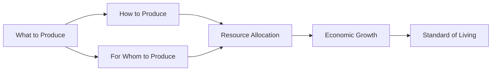

## 1. Mental Model

The car industry and the computer industry together use all of the economy's factors of production, illustrating how resources are allocated. This scenario highlights the fundamental economic problem of allocating resources when their quantity and quality are fixed. As a result, the economy must make crucial decisions about how to distribute these limited resources effectively. This situation is a classic example of the basic economic questions that every economy must address.

## 2. Foundational Concept

The fundamental economic problem leads to three important questions related to the allocation of resources. Given that the quantity as well as quality of economic resources available for use during the year is fixed, economies must determine what goods and services to produce, how to produce them, and for whom they are produced. These questions arise because of [[Scarcity]], which forces economies to make choices about how to allocate [[Limited_Resources]]. The car industry and the computer industry, for instance, use all of the economy's factors of production, demonstrating how resources are allocated between different sectors. Understanding these basic economic questions is crucial for analyzing [[Economic_Systems]] and their impact on [[Economic_Growth]].

### Key Takeaways:

- The car industry and the computer industry together use all of the economy's factors of production.
- The basic economic questions are fundamentally about addressing Scarcity and allocating Limited Resources.
- These questions are essential for understanding how different Economic Systems operate and influence Economic Growth.

## 3. Limitations & Edge Cases

However, this concept assumes that the economy only has to deal with two industries, which is not the case in reality. In real-world scenarios, numerous industries and sectors compete for resources, making the allocation process much more complex. Additionally, the quality and quantity of resources can change over time due to technological advancements or changes in government policies. Moreover, [[Market_Failure]] can occur if resources are not allocated efficiently, leading to suboptimal outcomes. Therefore, understanding the basic economic questions is just the starting point for analyzing the complexities of real-world economies.

## 4. Basic Economic Questions Framework



## 5. Walkthrough

**Step 1:** The car industry and the computer industry use all of the economy's factors of production, illustrating the fundamental economic problem of resource allocation.

**Step 2:** This scenario leads to three basic economic questions: What goods and services to produce, How to produce them, and For whom they are produced.

**Step 3:** These questions are crucial for understanding how different economic systems operate and influence economic growth and the standard of living.

## 6. The Proving Grounds

```interactive-quiz
[
  {
    "type": "fill_in",
    "question": "The fundamental economic problem arises because resources are [[blank]] while wants are unlimited.",
    "answer": "limited",
    "explanation": "The fundamental economic problem is caused by the scarcity of resources relative to unlimited wants.",
    "textWithBlanks": "The fundamental economic problem arises because resources are [[blank]] while wants are unlimited."
  },
  {
    "type": "mcq",
    "question": "What is the primary reason economies must make choices about how to allocate resources?",
    "options": {
      "a": "To maximize profit",
      "b": "To achieve full employment",
      "c": "To address scarcity and limited resources",
      "d": "To promote economic growth"
    },
    "answer": "c",
    "explanation": "The primary reason economies must make choices is to address the fundamental economic problem of scarcity and limited resources."
  },
  {
    "type": "trace",
    "question": "Trace the causal chain from scarcity to the standard of living.",
    "steps": [
      "Scarcity forces economies to make choices about resource allocation",
      "These choices determine what goods and services are produced",
      "The produced goods and services influence economic growth",
      "Economic growth impacts the standard of living"
    ],
    "answer": "Standard of Living",
    "explanation": "Scarcity leads to choices about resource allocation, which in turn affect production, economic growth, and ultimately the standard of living."
  }
]
```