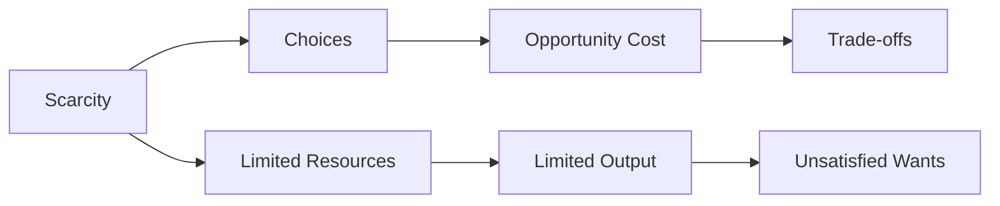

---

title: Basic_Economic_Questions
course: Economics
unit: '1'
semester: Winter 2026
mode: ECON-MICRO
type: atomic_note
hub: '[[1_Basics_Of_Economics_Hub]]'
source: '[[Inbox/Generated/Winter 2026/Economics/Chapter_1.pdf]]'
date: '2026-05-14'
prerequisites:
- '[[Scarcity]]'
- '[[Human_Wants]]'
- '[[Production_Possibilities_Frontier]]'
- '[[Resource_Allocation]]'
source_pages:
- 50
generated: true
read: false

---


## 1. The Plain English Explanation

The basic economic questions refer to the fundamental problems that every economy faces due to the limited availability of resources. To understand this, consider an economy that produces only two goods, like cars and computers, as mentioned in the source text. The economy has to decide how to allocate its resources to produce these goods, given that it can't produce everything it wants due to scarcity.

## 2. How the Economics Actually Work

WHAT: The basic economic questions are about the allocation of resources in an economy that faces scarcity, leading to the need for choices about how to spend money and use time. 
WHY: These questions exist because of scarcity, which implies that the economy cannot satisfy all its wants, necessitating choices and trade-offs. 
HOW: 
1. The economy starts with limited resources.
2. There are unlimited wants and needs, but the economy can't produce everything.
3. Choices must be made about what to produce and how to produce it.
4. When making choices, the economy gives up the opportunity to do something else, which is known as the opportunity cost.
5. The production possibilities frontier (PPF) is a tool used to illustrate these choices and trade-offs, showing the various combinations of output that the economy can produce given its resources and technology.
CONNECTIONS: This concept is closely related to [[Scarcity]], [[Human_Wants]], and [[Production_Possibilities_Frontier]]. Understanding the basic economic questions also involves recognizing the role of [[Resource_Allocation]] in economics.

## 3. The Formal Math & Models

The source text defines the production possibilities frontier (PPF) as "a graph that shows the combinations of output that the economy can possibly produce given the available factors of production and the available production technology." It assumes that the quantity and quality of economic resources available are fixed, there are two broad classes of output, the economy operates at full employment and achieves full production efficiency, technology does not change, and some inputs are better adapted to the production of one good than the other. The PPF describes four important concepts: scarcity, opportunity cost, efficiency, and economic growth.

## 4. Case Study Analysis Table

| [[Basic_Economic_Questions]] | **Description** |
| --- | --- |
| What | Questions about the allocation of resources in an economy facing scarcity |
| Why | Scarcity implies limited resources, limited output, and unsatisfied wants, necessitating choices |
| How | Choices involve costs, trade-offs, and opportunity costs due to limited resources |

| **Key Concepts** | **Description** |
| --- | --- |
| Scarcity | Limited resources leading to limited output |
| Choice | Involves costs and trade-offs due to scarcity |
| Opportunity Cost | Value of the next best alternative sacrificed |

| **Production Possibilities Frontier (PPF)** | **Description** |
| --- | --- |
| Definition | Graph showing combinations of output possible given available factors of production |
| Purpose | Illustrates choices and trade-offs in an economy |



## 5. Where It Breaks (Edge Cases & Flaws)

* **Insufficient Resources**: If resources are not limited, there is no need for choices or trade-offs, rendering basic economic questions moot.
* **No Opportunity Cost**: If there are no alternative uses for resources, opportunity cost is zero, and basic economic questions do not apply.
* **Unlimited Production**: If an economy can produce unlimited output, scarcity and basic economic questions cease to exist.

## 6. Common Misconceptions

- Students often assume that economies can produce everything they want, neglecting the fundamental problem of scarcity.
- Some believe that opportunity cost is just about money, but it also includes the value of the next best alternative that is given up.
- Others think that the PPF is just a simple graph without realizing it represents the economy's potential output and the trade-offs involved in production decisions.


---

## 7. The Proving Grounds

```interactive-quiz

[
  {
    "type": "mcq",
    "question": "What is the primary concern of the basic economic question 'What to produce?' in the context of Game Theory Application?",
    "options": {
      "A": "Determining the optimal allocation of resources to maximize payoffs in a game",
      "B": "Deciding which goods and services to produce to meet unlimited wants and needs",
      "C": "Identifying the Nash Equilibrium in a market with multiple firms",
      "D": "Calculating the marginal cost of producing a good or service"
    },
    "answer": "B",
    "explanation": "The basic economic question 'What to produce?' is concerned with deciding which goods and services to produce to meet unlimited wants and needs. In the context of Game Theory Application, this question is relevant when firms must strategically decide what products to offer to gain a competitive advantage.",
    "explanation_page": 50
  },
  {
    "type": "mcq",
    "question": "How does the basic economic question 'How to produce?' relate to Game Theory Application in a market with multiple firms?",
    "options": {
      "A": "It involves determining the optimal strategy to maximize payoffs in a game",
      "B": "It concerns the method or technique used to produce goods and services",
      "C": "It requires firms to collude and set prices jointly",
      "D": "It focuses on the distribution of goods and services to consumers"
    },
    "answer": "B",
    "explanation": "The basic economic question 'How to produce?' concerns the method or technique used to produce goods and services. In the context of Game Theory Application, firms must strategically decide how to produce goods and services to minimize costs and gain a competitive advantage.",
    "explanation_page": 50
  },
  {
    "type": "mcq",
    "question": "What is the primary focus of the basic economic question 'For whom to produce?' in the context of Game Theory Application?",
    "options": {
      "A": "Determining the optimal price to charge consumers for a good or service",
      "B": "Deciding which consumers to target with a product or service",
      "C": "Identifying the distribution of goods and services to meet the needs of different groups",
      "D": "Calculating the marginal revenue of producing a good or service"
    },
    "answer": "C",
    "explanation": "The basic economic question 'For whom to produce?' focuses on the distribution of goods and services to meet the needs of different groups. In the context of Game Theory Application, firms must strategically decide which consumers to target with a product or service to maximize payoffs.",
    "explanation_page": 50
  }
]

```