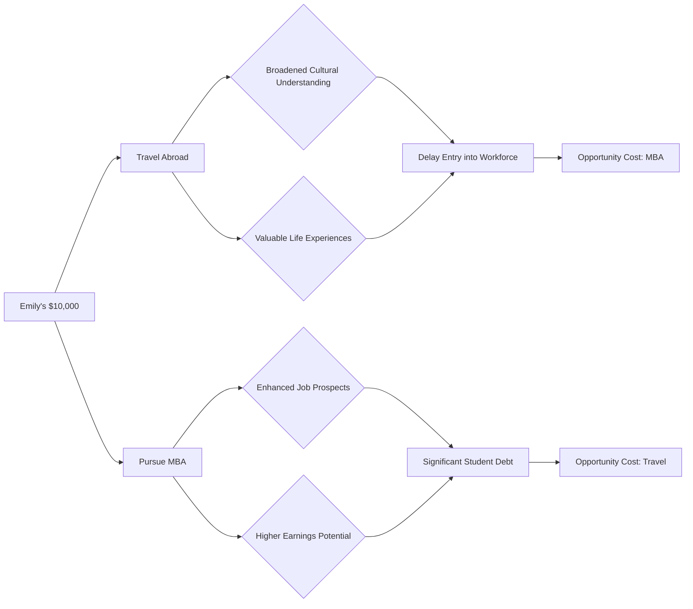

---

title: Choice
course: "Economics"
unit: '1'
semester: "Winter 2026"
mode: ECON-MICRO
type: atomic_note
hub: "[[1_Basics_Of_Economics_Hub]]"
source: "[[Inbox/Generated/Winter 2026/Economics/Chapter_1.pdf]]"
date: '2026-05-10'
prerequisites:
- "[[Scarcity]]"
source_pages:
- 2
generated: true

---

## 1. Mental Model

Emily has just graduated from college and has $10,000 to invest in her future. She is considering two options: taking a year to travel abroad or using the money to pursue a master's degree in business administration (MBA). The travel experience would allow her to broaden her cultural understanding and potentially gain valuable life experiences, but it would mean delaying her entry into the workforce. On the other hand, the MBA would enhance her job prospects and potentially lead to higher earnings, but it would also mean taking on significant student debt.

## 2. Foundational Concept

The concept of choice is closely tied to the idea of [[Scarcity]], which refers to the fundamental economic problem of Unlimited Wants and [[Limited_Resources]]. When individuals, like Emily, make choices, they must consider the [[Opportunity_Cost]], which is the value of the next best alternative that is given up when a choice is made. In Emily's case, the opportunity cost of choosing to pursue an MBA is the travel experience she could have had, and vice versa. This trade-off is a direct result of the need to make choices in the face of Limited Resources, such as her $10,000 investment. The basic questions of resource allocation, including what to produce, how to produce it, and for whom to produce it, are all relevant to Emily's decision-making process. Economic Systems and Market Failure can also influence the choices available to individuals like Emily.

### Key Takeaways:

- The opportunity cost of a choice is the value of the next best alternative that is given up.
- Choices often involve trade-offs between different options, such as between travel and education.
- Understanding opportunity cost is essential for making informed decisions about resource allocation.

## 3. Limitations & Edge Cases

The concept of choice assumes that individuals have complete knowledge of their options and can make rational decisions. However, in reality, individuals may face uncertainty and limited information, which can lead to suboptimal choices. Additionally, choices may be influenced by external factors, such as social norms or government policies, which can affect the options available. Furthermore, the concept of opportunity cost may not always be straightforward, as individuals may have multiple goals and priorities that conflict with one another. Ultimately, the process of making choices can be complex and nuanced, and may involve ongoing learning and adaptation.

## 4. Emily's Choice Diagram



## 5. Walkthrough

**Step 1:** Emily has $10,000 to invest in her future.

**Step 2:** She has two main options: traveling abroad or pursuing an MBA.

**Step 3:** Each option has its benefits and drawbacks.

**Step 4:** Traveling abroad would allow her to broaden her cultural understanding and gain valuable life experiences, but it would delay her entry into the workforce.

**Step 5:** Pursuing an MBA would enhance her job prospects and potentially lead to higher earnings, but it would also mean taking on significant student debt.

**Step 6:** The opportunity cost of choosing to travel is the potential benefits of an MBA, and vice versa.

## 6. The Proving Grounds

```interactive-quiz

[
  {
    "type": "fill_in",
    "question": "The fundamental economic problem that necessitates making choices is characterized by [[blank]] wants and limited resources.",
    "answer": "unlimited",
    "explanation": "The concept of scarcity is central to economics, highlighting the contrast between unlimited wants and limited resources, which necessitates making choices.",
    "textWithBlanks": "The fundamental economic problem that necessitates making choices is characterized by [[blank]] wants and limited resources."
  },
  {
    "type": "mcq",
    "question": "What is the term for the value of the next best alternative that is given up when a choice is made?",
    "options": [
      "Sunk Cost",
      "Opportunity Cost",
      "Market Value",
      "Resource Allocation"
    ],
    "answer": "Opportunity Cost",
    "explanation": "Opportunity cost is a crucial concept in economics that reflects the trade-offs involved in making choices, representing the value of the next best alternative foregone."
  },
  {
    "type": "trace",
    "question": "Trace the causal chain from scarcity to the need for choice in Emily's situation.",
    "steps": [
      "Emily has unlimited wants for travel and education",
      "She has a limited resource of $10,000",
      "This leads to scarcity, as her wants exceed her available resources",
      "Scarcity necessitates making a choice between alternatives",
      "The choice involves trade-offs, such as between travel and pursuing an MBA"
    ],
    "answer": "The need for choice",
    "explanation": "The presence of scarcity in Emily's situation, due to her unlimited wants and limited resources, directly leads to the need for her to make choices, weighing the trade-offs between different options."
  }
]

```