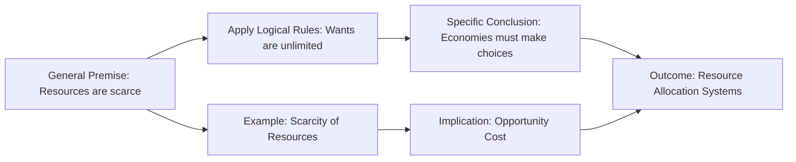

---

title: Deductive_Reasoning
course: Economics
unit: '1'
semester: Winter 2026
mode: ECON-MICRO
type: atomic_note
hub: '[[1_Basics_Of_Economics_Hub]]'
source: '[[Inbox/Generated/Winter 2026/Economics/Chapter_1.pdf]]'
date: '2026-05-15'
prerequisites:
- '[[Scarcity]]'
- '[[Unlimited_Wants]]'
- '[[Economic_Systems]]'
- '[[Economic_Analysis]]'
- '[[Decision_Making_Units]]'
source_pages:
- 21
generated: true
read: false

---


## Mental Model

Deductive reasoning is a type of logical thinking that starts with a general idea or theory and leads to a specific, certain conclusion. In economics, it's like trying to understand how the concept of [[Scarcity]] affects decision-making: if resources are limited and wants are unlimited, then economists can deduce that choices must be made to allocate these resources efficiently. For example, if a farmer has a limited amount of land and seeds, they can deduce that they cannot grow both wheat and corn on all of their land, and must choose which one to prioritize.

## How the Economics Actually Work

- WHAT: Deductive reasoning is a method of reasoning that involves drawing a specific conclusion from one or more general premises using logical rules. In the context of economics, it helps in understanding the implications of [[Scarcity]] and [[Unlimited_Wants]] on resource allocation.
- WHY: This type of reasoning exists because it allows economists to make precise predictions and decisions based on general principles. For instance, understanding that resources are scarce and wants are unlimited leads to the conclusion that economies must have systems for making choices about resource allocation, such as [[Economic_Systems]].
- HOW: 
  1. Start with a general premise (e.g., resources are scarce).
  2. Apply logical rules to this premise (e.g., if resources are scarce and wants are unlimited, then choices must be made).
  3. Derive a specific conclusion (e.g., economies must allocate resources efficiently).
  - CONNECTIONS: This process is closely related to [[Economic_Analysis]], which involves analyzing how resources are used to produce goods and services. It also connects with [[Decision_Making_Units]] like individuals, firms, and governments, which use deductive reasoning to make choices under conditions of scarcity.

## The Formal Math & Models

The source text does not explicitly mention "Deductive Reasoning" or provide a formal definition. However, it implies the use of logical reasoning in understanding economic concepts, such as [[Scarcity]] and [[Unlimited_Wants]], and their implications for [[Economic_Systems]] and [[Decision_Making_Units]].

| Deductive Reasoning Steps | Description | Economic Application |
| --- | --- | --- |
| 1. General Premise | Start with a broad statement | Resources are scarce. |
| 2. Apply Logical Rules | Use logic to derive conclusions | If resources are scarce and wants are unlimited, then choices must be made. |
| 3. Specific Conclusion | Reach a specific outcome | Economies must have systems for making choices about resource allocation. |
| Example | Description | Economic Implication |
| --- | --- | --- |
| Scarcity of Resources | Resources are limited, but wants are unlimited. | Leads to the need for making choices. |
| Opportunity Cost | The value of the next best alternative given up. | Results from the need to make choices due to scarcity. |
| Basic Questions of Resource Allocation | What, how, and for whom to produce. | Guide the economic system's decisions on resource allocation. |




---

## The Proving Grounds

```interactive-quiz

[
  {
    "type": "mcq",
    "question": "A consumer behavior analyst observes that all customers who purchase organic products also prioritize sustainability. If Customer X prioritizes sustainability, what can be deduced about Customer X's purchasing behavior?",
    "options": {
      "A": "Customer X will definitely purchase organic products",
      "B": "Customer X may or may not purchase organic products",
      "C": "Customer X will not purchase organic products",
      "D": "Customer X will only purchase non-organic products"
    },
    "answer": "B",
    "explanation": "The observation only guarantees that customers who purchase organic products prioritize sustainability, not the other way around. Therefore, we cannot conclusively deduce Customer X's purchasing behavior based solely on their prioritization of sustainability.",
    "explanation_page": 21
  },
  {
    "type": "mcq",
    "question": "In a consumer behavior analysis, it is found that all individuals who value brand reputation also consider price. If an individual, Y, considers price when making a purchase, what can be deduced about Y's values?",
    "options": {
      "A": "Y definitely values brand reputation",
      "B": "Y may or may not value brand reputation",
      "C": "Y does not value brand reputation",
      "D": "Y only values price"
    },
    "answer": "B",
    "explanation": "The statement only implies that valuing brand reputation is associated with considering price, not that considering price is exclusive to those who value brand reputation. Hence, we cannot deduce Y's values with certainty.",
    "explanation_page": 21
  },
  {
    "type": "mcq",
    "question": "A study on consumer behavior indicates that people who are loyal to a particular brand tend to have a high level of trust in that brand. If Consumer Z has a high level of trust in Brand A, what can be deduced about Consumer Z's behavior towards Brand A?",
    "options": {
      "A": "Consumer Z is definitely loyal to Brand A",
      "B": "Consumer Z may or may not be loyal to Brand A",
      "C": "Consumer Z is not loyal to Brand A",
      "D": "Consumer Z's loyalty cannot be determined"
    },
    "answer": "B",
    "explanation": "The information provided indicates a characteristic of brand loyalty (high trust), but it does not exclusively define loyalty. Therefore, having a high level of trust does not necessarily mean Consumer Z is loyal; it only suggests a possible inclination towards loyalty.",
    "explanation_page": 21
  }
]

```