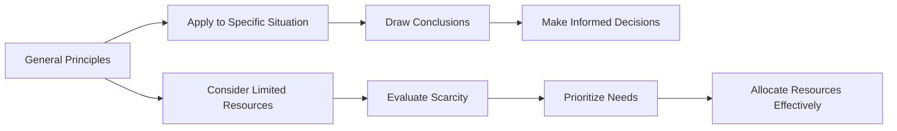

---

title: Deductive_Reasoning
course: Economics
unit: '1'
semester: Winter 2026
mode: ECON-MICRO
type: atomic_note
hub: '[[1_Basics_Of_Economics_Hub]]'
source: '[[Inbox/Generated/Winter 2026/Economics/Chapter_1.pdf]]'
date: '2026-05-10'
prerequisites:
- '[[Limited_Resources]]'
- '[[Scarcity]]'
- '[[Capital_Intensive_Techniques]]'
- '[[Labour_Intensive_Techniques]]'
- '[[Economic_Growth]]'
source_pages:
- 21
generated: true

---


## 1. Mental Model

The science of economics, being about two hundred years old, aims to understand how households and economies manage resources. Consider a household with a limited budget trying to decide between buying a new smartphone or a laptop. This decision involves weighing the importance of each item and making a choice based on the household's priorities and financial constraints. The household uses deductive reasoning to arrive at a decision.

## 2. Foundational Concept

Deductive reasoning is a process of drawing conclusions from general principles or premises. In economics, it involves using [[Limited_Resources]] and [[Scarcity]] to make informed decisions about how to allocate resources. For instance, economists use deductive reasoning to understand the implications of [[Capital_Intensive_Techniques]] versus [[Labour_Intensive_Techniques]] on [[Economic_Growth]]. By applying general principles to specific situations, economists can derive conclusions about how economies function, which is essential for addressing the Basic Economic Questions.

### Key Takeaways:

- The word economy comes from the Greek phrase “one who manages a household”.
- Deductive reasoning helps economists evaluate the impact of Market Failure on Economic Systems.
- Understanding deductive reasoning is crucial for analyzing Unlimited Wants and Limited Resources.

## 3. Limitations & Edge Cases

Deductive reasoning assumes that the premises are true, but in real-world economics, this may not always be the case. For example, economists may have different opinions about the definition of [[Definition_Of_Economics]], which can lead to varying conclusions. Additionally, deductive reasoning may not account for external factors, such as [[Normative_Economics]] and [[Positive_Economics]] biases, which can influence economic decisions. Moreover, the complexity of real-world economies can make it challenging to apply general principles to specific situations. Therefore, economists must be aware of these limitations when using deductive reasoning.

## 4. Deductive Reasoning Process



## 5. Walkthrough

**Step 1:** Start with general principles or premises in economics, such as limited resources and scarcity.

**Step 2:** Apply these principles to a specific situation, like a household deciding between a smartphone and a laptop.

**Step 3:** Draw conclusions based on the application of general principles to the specific situation.

**Step 4:** Use these conclusions to make informed decisions about resource allocation.

**Step 5:** Consider the impact of limited resources on the decision-making process.

**Step 6:** Evaluate the effects of scarcity on the choices available.

**Step 7:** Prioritize needs based on the evaluation of scarcity and limited resources.

**Step 8:** Allocate resources effectively to meet the prioritized needs.

## 6. The Proving Grounds

```interactive-quiz

[
  {
    "type": "fill_in",
    "question": "The word 'economy' originates from the Greek phrase meaning [[blank]].",
    "answer": "one who manages a household",
    "explanation": "The term 'economy' comes from the Greek phrase 'oikonomia', which translates to 'one who manages a household'.",
    "textWithBlanks": "The word 'economy' originates from the Greek phrase meaning [[blank]]."
  },
  {
    "type": "mcq",
    "question": "What is a primary role of deductive reasoning in economics?",
    "options": [
      "To predict future economic trends",
      "To understand the implications of capital-intensive techniques on economic growth",
      "To calculate GDP",
      "To analyze consumer behavior"
    ],
    "answer": "To understand the implications of capital-intensive techniques on economic growth",
    "explanation": "Deductive reasoning helps economists evaluate the impact of different techniques, such as capital-intensive versus labor-intensive techniques, on economic growth and resource allocation.",
    "textWithBlanks": ""
  },
  {
    "type": "trace",
    "question": "Trace the causal chain from general principles to making informed decisions.",
    "steps": [
      "Start with general principles or premises in economics",
      "Apply these principles to a specific situation",
      "Draw conclusions based on the application",
      "Use these conclusions to make informed decisions about resource allocation"
    ],
    "answer": "Making informed decisions",
    "explanation": "The process begins with general principles, applies them to a specific situation, draws conclusions, and ultimately leads to making informed decisions about how to allocate resources effectively."
  }
]

```