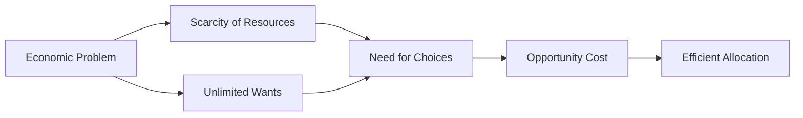

---

title: Definition_Of_Economics
course: Economics
unit: '1'
semester: Winter 2026
mode: ECON-MICRO
type: atomic_note
hub: '[[1_Basics_Of_Economics_Hub]]'
source: '[[Inbox/Generated/Winter 2026/Economics/Chapter_1.pdf]]'
date: '2026-05-15'
prerequisites:
- '[[Scarcity]]'
- '[[Unlimited_Wants]]'
- '[[Economic_Analysis]]'
- '[[Decision_Making_Units]]'
source_pages:
- 7
generated: true
read: false

---


## Mental Model

Imagine you're the manager of a big household with many family members. You have to make sure there's enough food, water, and other essential resources for everyone. Economics is similar, but instead of a household, it's about managing resources for a whole society. The word "economy" comes from the Greek phrase "one who manages a household," showing how economics is all about making the most of what we have.

## How the Economics Actually Work

- **WHAT**: Economics is a social science that studies the efficient allocation of scarce resources to attain the maximum fulfillment of unlimited human wants. 
- **WHY**: This concept exists because, as humans, we have unlimited wants but limited resources. This gap between what we want and what we have forces us to make choices about how to use our resources best. 
- **HOW**: 
  1. **Identifying Resources and Wants**: The process starts with recognizing the resources available (like labor, capital, and raw materials) and the unlimited wants of people.
  2. **Allocating Resources**: Since resources are scarce, societies must decide how to allocate them. This involves making choices about what goods and services to produce, how to produce them, and for whom.
  3. **Making Choices and Trade-offs**: Because resources are limited, choosing to produce more of one thing means producing less of another. This is where opportunity cost comes in—the cost of the next best alternative given up.
  4. **Achieving Maximum Fulfillment**: The goal is to allocate resources in a way that maximizes the satisfaction of human wants, given the constraints.
- **CONNECTIONS**: This concept is closely related to [[Scarcity]], which is the fundamental problem that economics tries to solve. It also connects with [[Unlimited_Wants]], which explains why we can't fulfill all our desires. Additionally, [[Economic_Analysis]] is crucial in understanding how resources are efficiently used. The study of economics also involves understanding [[Decision_Making_Units]] and how they interact.

## The Formal Math & Models

The formal definition of economics, as provided, is: "Economics is a social science which studies about efficient allocation of scarce resources so as to attain the maximum fulfillment of unlimited human wants." This definition highlights the core focus of economics on resource allocation under conditions of scarcity.

| **Concept** | **Description** | **Implication** |
| --- | --- | --- |
| Economics | A social science that studies the efficient allocation of scarce resources to attain the maximum fulfillment of unlimited human wants. | Recognizes the fundamental economic problem of scarcity. |
| Scarcity | Resources are scarce while people's wants are unlimited. | Necessitates making choices about resource allocation. |
| Resources | Limited, e.g., labor, capital, and raw materials. | Must be allocated efficiently. |
| Wants | Unlimited, distinguished from needs. | Drives the need for choices in resource allocation. |
| Opportunity Cost | Results from the need to make choices due to scarcity. | Involves trade-offs in resource allocation. |
| Efficient Allocation | Aims to maximize fulfillment of human wants given scarcity. | Guides decision-making in economics. |
| Household Management | Origin of the word "economy" from Greek, meaning "one who manages a household." | Illustrates basic economic management principles. |
| Social Science | Studies human behavior in relation to resources and wants. | Provides a framework for analyzing economic activities. |
| Unlimited Wants | A fundamental characteristic of human behavior in economics. | Contrasts with the scarcity of resources. |
| Resource Allocation | Basic questions include what, how, and for whom to produce. | Essential for addressing scarcity and wants. |




---

## The Proving Grounds

```interactive-quiz

[
  {
    "type": "mcq",
    "question": "Which of the following statements best reflects the definition of economics in the context of Environmental Economics?",
    "options": {
      "A": "The study of how to maximize profits from pollution",
      "B": "The study of how to manage natural resources for future generations",
      "C": "The study of scarcity and how it affects the allocation of resources",
      "D": "The study of the impact of environmental policies on economic growth"
    },
    "answer": "C",
    "explanation": "Economics is defined as the study of scarcity and how it affects the allocation of resources. This definition is fundamental to understanding environmental economics, which examines how economic activities impact the environment and how environmental policies affect the economy.",
    "explanation_page": 7
  },
  {
    "type": "mcq",
    "question": "An environmental economist is studying the impact of a new policy aimed at reducing carbon emissions. Which of the following concepts is most relevant to their analysis?",
    "options": {
      "A": "The law of supply and demand",
      "B": "The concept of opportunity cost",
      "C": "The definition of economic efficiency",
      "D": "The study of human behavior in response to environmental changes"
    },
    "answer": "B",
    "explanation": "The concept of opportunity cost is crucial in environmental economics as it relates to the definition of economics. When evaluating the impact of a new policy, an environmental economist must consider the trade-offs involved in allocating resources to reduce carbon emissions, and how these trade-offs affect the allocation of resources.",
    "explanation_page": 7
  },
  {
    "type": "mcq",
    "question": "A government agency is considering two alternative policies to protect a endangered species: one that involves creating a wildlife reserve, and another that involves providing financial incentives to farmers to adopt sustainable practices. Which of the following statements best reflects an economic perspective on this decision?",
    "options": {
      "A": "The policy with the highest upfront costs should be chosen",
      "B": "The policy that maximizes the number of species protected should be chosen",
      "C": "The policy that achieves the desired outcome at the lowest cost should be chosen",
      "D": "The policy that involves the fewest government interventions should be chosen"
    },
    "answer": "C",
    "explanation": "From an economic perspective, the goal is to allocate resources efficiently. In this case, the policy that achieves the desired outcome (protecting the endangered species) at the lowest cost is the most economically efficient. This reflects the definition of economics as the study of scarcity and how it affects the allocation of resources.",
    "explanation_page": 7
  }
]

```