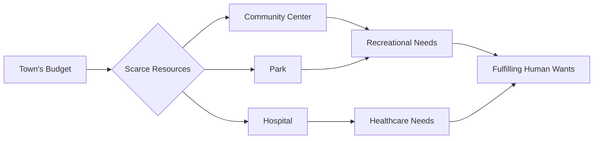

## 1. Mental Model

A small town with a limited budget must decide how to allocate its resources to build a new community center, a park, or improve the local hospital. The town's residents have various desires, such as better healthcare, recreational spaces, and social facilities, but the town can only fund a few projects. This scenario illustrates the fundamental problem of economics: efficiently allocating scarce resources to meet unlimited human wants.

## 2. Foundational Concept

Economics is a social science that studies the efficient allocation of scarce resources to attain the maximum fulfillment of unlimited human wants. There is no universally accepted definition of economics, but this definition highlights the core idea of optimizing resource allocation. The study of economics involves understanding how individuals, businesses, and governments make decisions about how to allocate resources, such as labor, capital, and raw materials, to meet their goals and satisfy their needs and wants. This field is closely related to [[Scarcity]], Unlimited Wants, and [[Basic_Economic_Questions]], which are essential in understanding the fundamental principles of economics. Economists use various techniques, including [[Deductive_Reasoning]] and [[Inductive_Reasoning]], to analyze economic phenomena and develop theories about economic behavior.

### Key Takeaways:

- There is no universally accepted definition of economics.
- Economics is a social science that studies the efficient allocation of scarce resources.
- The field of economics aims to understand how to maximize the fulfillment of unlimited human wants.

## 3. Limitations & Edge Cases

The standard definition of economics faces three primary theoretical hurdles:
1. **Interpersonal Utility Comparison**: Since human wants are subjective, economists cannot mathematically prove that a specific resource allocation "maximizes" total societal fulfillment without making controversial value judgments.
2. **Resource Immobility**: The assumption of "efficient allocation" often ignores the friction of moving resources; for instance, labor specialized in manufacturing cannot be instantly reallocated to healthcare without significant deadweight loss.
3. **Static vs. Dynamic Scarcity**: Traditional definitions often treat resources as a fixed pie, failing to account for how technological innovation and entrepreneurship can "expand the pie," effectively pushing the boundaries of what is considered scarce.

## 4. The Economic Problem



## 5. Walkthrough

**Step 1:** Quantify the total available resources (e.g., the $10M fixed budget) to establish the hard constraint of scarcity.

**Step 2:** Categorize the vector of unlimited human wants into discrete priorities (Healthcare vs. Recreation) to identify competing ends.

**Step 3:** Perform a marginal analysis of each project to determine which allocation provides the highest marginal utility for the community.

**Step 4:** Execute the allocation decision and identify the opportunity cost—the specific wants (e.g., the park) that remain unfulfilled due to the resource constraint.

## 6. The Proving Grounds

```interactive-quiz
[
  {
    "type": "fill_in",
    "question": "Economics is a social science that studies the efficient allocation of [[blank]] resources.",
    "answer": "scarce",
    "explanation": "The study of economics involves understanding how to optimize the use of resources that are limited in supply.",
    "textWithBlanks": "Economics is a social science that studies the efficient allocation of [[blank]] resources."
  },
  {
    "type": "mcq",
    "question": "What is a key characteristic of human wants in the context of economics?",
    "options": {
      "a": "They are limited and can be fully satisfied",
      "b": "They are constant and do not change over time",
      "c": "They are unlimited and diverse",
      "d": "They are only for material goods"
    },
    "answer": "c",
    "explanation": "In economics, human wants are considered unlimited, which contrasts with the scarcity of resources available to satisfy those wants."
  },
  {
    "type": "trace",
    "question": "Trace the causal chain from unlimited human wants to the need for resource allocation.",
    "steps": [
      "Human wants are unlimited and diverse",
      "Resources available to satisfy wants are scarce",
      "This mismatch between wants and resources creates a need for choice",
      "Choices must be made about how to allocate resources efficiently"
    ],
    "answer": "The need for resource allocation",
    "explanation": "The unlimited nature of human wants, combined with the scarcity of resources, necessitates the allocation of resources to meet those wants efficiently."
  }
]
```