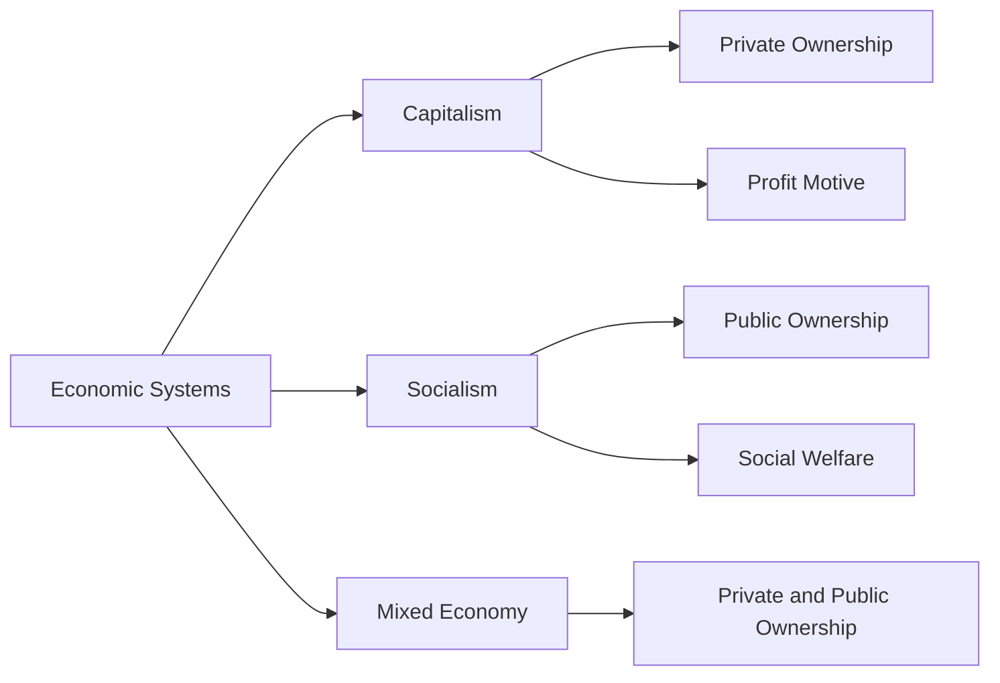

---

title: Economic_Systems
course: Economics
unit: '1'
semester: Winter 2026
mode: ECON-MICRO
type: atomic_note
hub: '[[1_Basics_Of_Economics_Hub]]'
source: '[[Inbox/Generated/Winter 2026/Economics/Chapter_1.pdf]]'
date: '2026-05-15'
prerequisites:
- '[[Scarcity]]'
- '[[Unlimited_Wants]]'
- '[[Decision_Making_Units]]'
- '[[Macroeconomics]]'
source_pages: []
generated: true
read: false

---


## Mental Model

Imagine you're part of a team managing a school's cafeteria. You have to decide how to distribute the food, manage the budget, and ensure everyone gets a meal. This is similar to how economic systems work, but on a much larger scale, involving entire countries. Economic systems are ways to organize and manage resources, like food, money, and labor, to meet people's needs and wants. Just as the cafeteria team must make choices about food distribution, governments and societies make choices about how to allocate resources.

## How the Economics Actually Work

Economic systems are methods for allocating resources, such as labor, capital, and raw materials, to produce goods and services. 
- WHAT: An economic system is a way to organize and manage an economy's resources to meet people's unlimited wants and needs, given the scarcity of those resources.
- WHY: Economic systems exist because resources are limited, but people's wants are not. This fundamental problem of scarcity necessitates choices about how to use resources efficiently. 
- HOW: 
  1. **Identify Resources**: Determine what resources are available, such as labor, materials, and technology.
  2. **Assess Wants and Needs**: Understand what goods and services people want and need.
  3. **Allocate Resources**: Decide how to distribute resources to produce the desired goods and services. This involves making choices about what to produce, how to produce it, and for whom.
  4. **Evaluate Outcomes**: Assess how well the allocation of resources meets people's wants and needs.
- CONNECTIONS: 
  - Economic systems are closely related to [[Scarcity]], as this concept underpins the need for resource allocation.
  - They also interact with [[Unlimited_Wants]], which drives the demand for goods and services.
  - Additionally, economic systems involve [[Decision_Making_Units]], such as households, firms, and governments, which make choices about resource allocation.
  - The study of economic systems is part of [[Macroeconomics]], which looks at the economy as a whole.

## The Formal Math & Models

The source text defines economics as "a social science which studies about efficient allocation of scarce resources so as to attain the maximum fulfillment of unlimited human wants." This definition underpins the study of economic systems, which are frameworks for achieving this efficient allocation. The text highlights that economics is about managing resources to meet unlimited wants, given scarcity. This involves understanding different methods of economic analysis and appreciating various economic systems.

| **Economic System** | **Description** | **Key Characteristics** |
| --- | --- | --- |
| Capitalism | An economic system where private individuals and businesses own and operate the means of production. | Private ownership, profit motive, free market |
| Socialism | An economic system where the means of production are owned and controlled by the state or by the workers themselves. | Public ownership, social welfare, planned economy |
| Mixed Economy | An economic system that combines elements of capitalism and socialism. | Private and public ownership, market and government intervention |

| **Economic System** | **How it Addresses Scarcity** | **Example** |
| --- | --- | --- |
| Capitalism | Market forces allocate resources efficiently | Resources are allocated based on consumer demand and supply |
| Socialism | Government planning and control allocate resources | Resources are allocated based on social welfare and need |
| Mixed Economy | Combination of market forces and government intervention | Resources are allocated through a mix of market and government mechanisms |



The table and graph illustrate the main types of economic systems, their descriptions, and key characteristics. They also show how each system addresses the fundamental problem of scarcity.


---

## The Proving Grounds

```interactive-quiz

[
  {
    "type": "mcq",
    "question": "In a command economy, what is the primary role of the government in relation to the production and distribution of goods and services?",
    "options": {
      "A": "To maximize profits for private businesses",
      "B": "To allocate resources based on consumer demand",
      "C": "To make decisions on the production and distribution of goods and services",
      "D": "To provide public goods only"
    },
    "answer": "C",
    "explanation": "In a command economy, the government plays a central role in making decisions regarding the production and distribution of goods and services. This includes determining what goods to produce, how much to produce, and how to distribute them."
  },
  {
    "type": "mcq",
    "question": "Which economic system is characterized by private ownership of the means of production, creation of goods and services for profit, and free-market exchange?",
    "options": {
      "A": "Socialism",
      "B": "Command Economy",
      "C": "Market Economy",
      "D": "Traditional Economy"
    },
    "answer": "C",
    "explanation": "A market economy is characterized by private ownership of the means of production, creation of goods and services for profit, and free-market exchange. This system relies on the market forces of supply and demand to allocate resources."
  },
  {
    "type": "mcq",
    "question": "What is a key feature that distinguishes a traditional economy from other economic systems?",
    "options": {
      "A": "Centralized government control over production",
      "B": "Use of advanced technology for production",
      "C": "Economic decisions based on customs, traditions, and social norms",
      "D": "Predominant role of private businesses"
    },
    "answer": "C",
    "explanation": "A traditional economy is distinguished by its reliance on customs, traditions, and social norms to make economic decisions. This system often exists in rural or indigenous communities where economic activities are based on long-standing practices."
  }
]

```