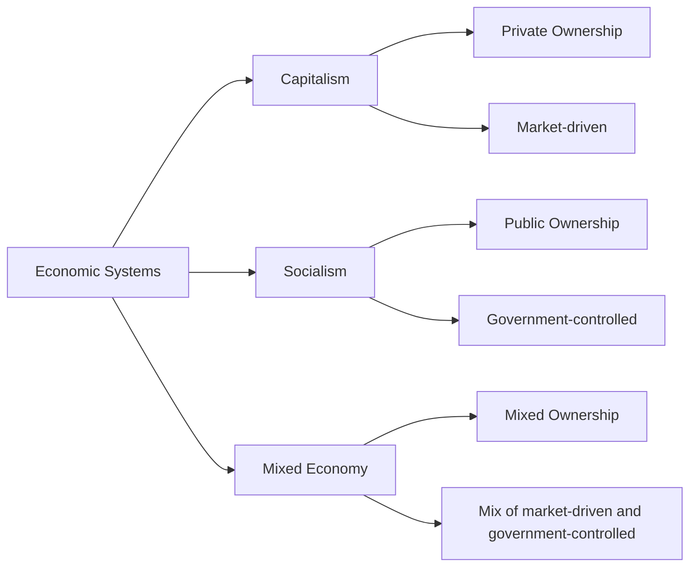

---

title: Economic_Systems
course: Economics
unit: '1'
semester: Winter 2026
mode: ECON-MICRO
type: atomic_note
hub: '[[1_Basics_Of_Economics_Hub]]'
source: '[[Inbox/Generated/Winter 2026/Economics/Chapter_1.pdf]]'
date: '2026-05-14'
prerequisites:
- '[[Resource_Allocation]]'
- '[[Basic_Economic_Questions]]'
- '[[Market_Failure]]'
source_pages: []
generated: true
read: false

---


## 1. The Plain English Explanation

An economic system is like a plan for a country's resources, deciding how to use them to make things people want. Imagine a big factory that makes cars, and the government has to decide how many cars to make, what kind of cars to make, and who gets to make them. The economic system is like a set of rules that helps make those decisions. It's a way for societies to organize and use their resources to meet people's needs and wants.

## 2. How the Economics Actually Work

WHAT: An economic system is a way for a society to organize its resources to meet people's needs and wants. 

| WHY: Economic systems exist because resources are Scarcity|scarce, but people's Human Wants|wants are unlimited. |

HOW: 
1. A society has to decide how to use its resources, like labor, materials, and equipment.
2. It has to choose what goods and services to produce, and how much of each.
3. It must also decide who gets what, and how to distribute the goods and services.
4. Different economic systems, like capitalism, socialism, and mixed economies, make these decisions in different ways.
5. For example, in a capitalist system, businesses make decisions based on profit, while in a socialist system, the government might make more decisions.
CONNECTIONS: 
- [[Resource_Allocation]]: Economic systems help allocate resources in a society.
- [[Basic_Economic_Questions]]: Economic systems try to answer basic questions like what to produce, how to produce, and for whom.
- [[Market_Failure]]: Sometimes, economic systems can fail, and that's called market failure.

## 3. The Formal Math & Models

| The source text doesn't provide a direct definition of economic systems, but it does discuss the basics of economics and the fundamental economic problem of Scarcity|scarcity. |
| It mentions that economics is a social science that studies the efficient allocation of Scarcity|scarce Resources to attain the maximum fulfillment of Human Wants|unlimited Human Wants. |
| The text also introduces the concept of opportunity cost, which results from the need to make choices due to Scarcity|scarcity. |

## 4. Case Study Analysis Table

| **Economic System** | **Description** | **Key Decision Maker** | [[Resource_Allocation]] |
| --- | --- | --- | --- |
| Capitalism | Businesses make decisions based on profit | Businesses, Individuals | Market-driven |
| Socialism | Government makes decisions for the collective good | Government | Government-controlled |
| Mixed Economy | Combination of government and business decisions | Both Government and Businesses | Mix of market-driven and government-controlled |

| **Characteristics** | **Capitalism** | **Socialism** | **Mixed Economy** |
| --- | --- | --- | --- |
| Ownership | Private | Public | Mixed |
| Resource Allocation | Market forces | Government planning | Mix of both |
| Goal | Profit maximization | Social welfare | Balance between profit and social welfare |



## 5. Where It Breaks (Edge Cases & Flaws)

* **Scarcity of Resources**: The artifact does not explicitly show how economic systems address the scarcity of resources, which is a fundamental concept in economics.
* **Lack of Quantitative Examples**: The artifact does not provide numerical examples to illustrate the differences between economic systems, which can make it harder to understand the practical implications.
* **Omission of Opportunity Cost**: The artifact does not explicitly mention opportunity cost, which is a crucial concept in economics that results from the need to make choices due to scarcity of resources.

## 6. Common Misconceptions

* Some students might think that economic systems are only about making money, but they're actually about how societies use their resources to meet people's needs and wants.
* Others might assume that economic systems are only about government control, but they can also involve private businesses and individuals making decisions.
* Some might believe that economic systems are fixed and unchanging, but they can evolve over time as societies change and grow.


---

## 7. The Proving Grounds

```interactive-quiz

[
  {
    "type": "mcq",
    "question": "In a command economy, what is the primary role of the government in relation to the production and distribution of goods and services?",
    "options": {
      "A": "To maximize profits for private businesses",
      "B": "To allocate resources based on consumer demand",
      "C": "To make decisions on the production and distribution of goods and services",
      "D": "To provide public goods only"
    },
    "answer": "C",
    "explanation": "In a command economy, the government plays a central role in making decisions regarding the production and distribution of goods and services. This includes determining what goods to produce, how much to produce, and how to distribute them."
  },
  {
    "type": "mcq",
    "question": "Which economic system is characterized by private ownership of the means of production, creation of goods and services for profit, and free-market exchange?",
    "options": {
      "A": "Socialism",
      "B": "Command Economy",
      "C": "Market Economy",
      "D": "Traditional Economy"
    },
    "answer": "C",
    "explanation": "A market economy is characterized by private ownership of the means of production, creation of goods and services for profit, and free-market exchange. This system relies on the market forces of supply and demand to allocate resources."
  },
  {
    "type": "mcq",
    "question": "What is a key feature that distinguishes a traditional economy from other economic systems?",
    "options": {
      "A": "Centralized government control over production",
      "B": "Use of advanced technology for production",
      "C": "Economic decisions based on customs, traditions, and social norms",
      "D": "Predominant role of private businesses"
    },
    "answer": "C",
    "explanation": "A traditional economy is distinguished by its reliance on customs, traditions, and social norms to make economic decisions. This system often exists in rural or indigenous communities where economic activities are based on long-standing practices."
  }
]

```