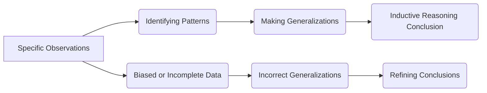

## 1. Mental Model

In a small village, the local farmer, John, observes that every time he uses [[Capital_Intensive_Techniques]] to increase his crop yield, his costs rise significantly. He also notices that his neighbor, who uses [[Labour_Intensive_Techniques]], achieves similar yields at lower costs. Based on these specific instances, John starts to believe that using labor-intensive techniques might be more efficient for his farm. This process of making a generalization based on specific observations is an example of inductive reasoning.

## 2. Foundational Concept

The concept of inductive reasoning involves making generalizations or drawing conclusions based on specific observations. This type of reasoning is essential in economics, where understanding patterns and relationships can help in decision-making. Inductive reasoning starts with specific instances, such as the observation that [[Limited_Resources]] can lead to [[Scarcity]], and then generalizes to broader principles. For instance, a farmer might observe that every time there is a drought, crop prices rise, leading to the generalization that droughts can have significant economic impacts on agriculture. This type of reasoning is contrasted with [[Deductive_Reasoning]], which starts with a general statement and applies it to specific cases. Inductive reasoning is crucial in [[Positive_Economics]], where it is used to develop theories and models that explain economic phenomena.

### Key Takeaways:

- The word economy comes from the Greek phrase “one who manages a household”, implying that economic decisions are often made at a household or individual level.
- A key aspect of inductive reasoning is that it involves making generalizations based on specific observations, which can sometimes lead to incorrect conclusions if the observations are biased or incomplete.
- Understanding inductive reasoning is important for addressing [[Basic_Economic_Questions]], such as how to allocate Unlimited Wants given Limited Resources.

## 3. Limitations & Edge Cases

Inductive reasoning has several limitations, including the potential for incorrect generalizations based on biased or incomplete data. For example, if John’s observation about the effectiveness of labor-intensive techniques is based on a single year’s data, he might not account for variations due to weather or pests. Additionally, inductive reasoning does not provide absolute certainty; it only offers probabilities. In economics, this can be particularly problematic when dealing with complex systems like [[Economic_Systems]] and [[Market_Failure]], where multiple variables interact in unpredictable ways. Therefore, while inductive reasoning is a valuable tool, it must be used carefully and in conjunction with other methods of reasoning and analysis.

## 4. Inductive Reasoning Process



## 5. Walkthrough

**Step 1:** The process begins with specific observations, such as John noticing the effects of capital-intensive versus labor-intensive techniques on his farm.

**Step 2:** These observations help in identifying patterns, like the relationship between the type of technique used and the costs incurred.

**Step 3:** Based on these patterns, generalizations are made, such as assuming labor-intensive techniques are more efficient.

**Step 4:** This generalization leads to an inductive reasoning conclusion, where John considers adopting labor-intensive techniques for his farm.

**Step 5:** However, if the data observed is biased or incomplete, it may lead to incorrect generalizations.

**Step 6:** These incorrect generalizations can result in flawed conclusions, necessitating the refinement of conclusions based on more accurate or comprehensive data.

**Step 7:** The process of inductive reasoning is iterative, involving continuous observation, pattern identification, and generalization refinement.

## 6. The Proving Grounds

```interactive-quiz
[
  {
    "type": "fill_in",
    "question": "The word economy originates from the Greek phrase meaning [[blank]].",
    "answer": "one who manages a household",
    "explanation": "The term 'economy' comes from the Greek phrase 'one who manages a household', implying that economic decisions are often made at a household or individual level.",
    "textWithBlanks": "The word economy originates from the Greek phrase meaning [[blank]]."
  },
  {
    "type": "mcq",
    "question": "What is a potential drawback of inductive reasoning in economics?",
    "options": {
      "a": "It leads to absolute truths",
      "b": "It relies on a single observation",
      "c": "Conclusions can be incorrect if observations are biased or incomplete",
      "d": "It only applies to microeconomics"
    },
    "answer": "c",
    "explanation": "Inductive reasoning involves making generalizations based on specific observations, which can sometimes lead to incorrect conclusions if the observations are biased or incomplete."
  },
  {
    "type": "trace",
    "question": "Trace the process of inductive reasoning from observation to conclusion.",
    "steps": [
      "Making specific observations",
      "Identifying patterns in the observations",
      "Making generalizations based on the patterns",
      "Drawing a conclusion based on the generalizations"
    ],
    "answer": "Drawing a conclusion based on the generalizations",
    "explanation": "The process of inductive reasoning starts with specific observations, leads to identifying patterns, making generalizations, and finally drawing conclusions based on those generalizations."
  }
]
```