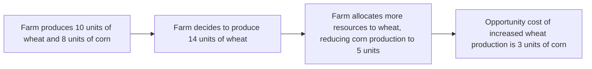

---

title: Law_Of_Increasing_Opportunity_Cost
course: "Economics"
unit: '1'
semester: "Winter 2026"
mode: ECON-MICRO
type: atomic_note
hub: "[[1_Basics_Of_Economics_Hub]]"
source: "[[Inbox/Generated/Winter 2026/Economics/Chapter_1.pdf]]"
date: '2026-05-10'
prerequisites:
- "[[Opportunity_Cost]]"
source_pages:
- 46
generated: true

---

## 1. Mental Model

Imagine a small farm that initially produces both wheat and corn. As the farm decides to produce more wheat, it must allocate more land and labor to wheat production. At first, this shift might be relatively easy and inexpensive because the farm can simply reallocate resources from corn production to wheat production. However, as the farm continues to increase wheat production, it will eventually have to divert resources (like highly skilled labor or the most fertile land) away from corn production. At this point, the opportunity cost of producing more wheat increases because the farm has to give up more and more of its corn production to do so. This scenario illustrates how the opportunity cost of producing additional units of a product (wheat) increases as production levels rise.

## 2. Causal Mechanism

The Law of Increasing Opportunity Cost is fundamentally rooted in the concept of [[Scarcity]] and the idea that in a world of Scarcity, a decision to have more of one thing means a decision to have less of another thing. The core facts of this law can be enumerated as follows: First, as a producer increases the production of one good, it must decrease the production of another good due to [[Limited_Resources]]. Second, the resources are not perfectly adaptable; hence, moving resources from one production line to another involves costs. Third, the opportunity cost - the value of the next best alternative foregone as a result of making a decision - increases with the production of additional units of a product. This increase in opportunity cost is due to the necessity of allocating resources that are better suited for the production of the good being reduced. The law of increasing opportunity cost is a foundational concept in understanding [[Opportunity_Cost]] and [[Basic_Economic_Questions]].

### Key Takeaways:

- The Law of Increasing Opportunity Cost states that as production of a product increases, the opportunity cost per unit of additional output also increases.
- This law is a direct result of the concept of Scarcity and the trade-offs that come with it.
- In a world of Scarcity, decisions to have more of one thing mean decisions to have less of another thing.

## 3. Limitations & Edge Cases

A limitation of the Law of Increasing Opportunity Cost is that it assumes that resources are not perfectly adaptable or substitutable. For instance, in the real world, workers may not easily switch between producing different goods due to skill specificity or location constraints. Another limitation arises when considering the possibility of technological advancements or innovations that could potentially reduce the opportunity cost of producing additional units of a product. However, under the assumptions of the given source context, these factors are not considered.

## 4. Causal Chain Timeline
$$Opportunity Cost = ΔWheat / ΔCorn$$



## 5. Walkthrough

**Step 1:** The farm initially produces 10 units of wheat and 8 units of corn.

**Step 2:** The farm decides to increase wheat production to 14 units.

**Step 3:** To produce more wheat, the farm allocates more resources to wheat production, which results in 10 + 4 = 14 units of wheat.

**Step 4:** This reallocation reduces corn production from 8 units to 5 units, a decrease of 8 - 5 = 3 units of corn.

**Step 5:** The opportunity cost of increasing wheat production by 4 units is 3 units of corn given up.

**Step 6:** If plotted, the curve would show that as wheat production increases, the opportunity cost in terms of corn given up also increases.

## 6. The Proving Grounds

```interactive-quiz
[
  {
    "type": "fill_in",
    "difficulty": "L1",
    "question": "The Law of Increasing Opportunity Cost is fundamentally rooted in the concept of [[Scarcity]] and the idea that in a world of [[Scarcity]], a decision to have more of one thing means a decision to have less of another thing. What is the core reason for the increase in opportunity cost as production of a product increases?",
    "content": "",
    "text_with_blanks": "The core reason for the increase in opportunity cost as production of a product increases is Blank.",
    "options": {},
    "answer": "Limited Resources",
    "explanation": "The Law of Increasing Opportunity Cost states that as production of a product increases, the opportunity cost per unit of additional output also increases. This increase is fundamentally rooted in the concept of scarcity and the limitations of resources. As a producer increases the production of one good, it must decrease the production of another good due to limited resources. The resources are not perfectly adaptable; hence, moving resources from one production line to another involves costs. Therefore, the core reason for the increase in opportunity cost is the limited resources available."
  },
  {
    "type": "mcq",
    "difficulty": "L2",
    "question": "What is a direct result of the concept of [[Scarcity]] and the trade-offs that come with it, according to the Law of Increasing Opportunity Cost?",
    "content": "",
    "text_with_blanks": "",
    "options": {
      "A": "The opportunity cost per unit of additional output decreases",
      "B": "The opportunity cost per unit of additional output remains constant",
      "C": "The opportunity cost per unit of additional output increases"
    },
    "answer": "C",
    "explanation": "The Law of Increasing Opportunity Cost states that as production of a product increases, the opportunity cost per unit of additional output also increases. This is a direct result of the concept of scarcity and the trade-offs that come with it. In a world of scarcity, decisions to have more of one thing mean decisions to have less of another thing. Therefore, the correct answer is C."
  },
  {
    "type": "trace",
    "difficulty": "L3",
    "question": "Suppose a producer is currently producing 10 units of Good A and 20 units of Good B. If the producer decides to increase the production of Good A by 5 units, what will happen to the production of Good B, and what is the resulting opportunity cost?",
    "content": "",
    "text_with_blanks": "",
    "options": {},
    "answer": "decrease by some units",
    "explanation": "According to the Law of Increasing Opportunity Cost, as a producer increases the production of one good, it must decrease the production of another good due to limited resources. If the producer decides to increase the production of Good A by 5 units, it will have to decrease the production of Good B. The exact number of units by which Good B's production decreases is not specified, but it will decrease by some units. The resulting opportunity cost is the value of the next best alternative foregone as a result of making this decision, which in this case is the decrease in production of Good B."
  }
]

```