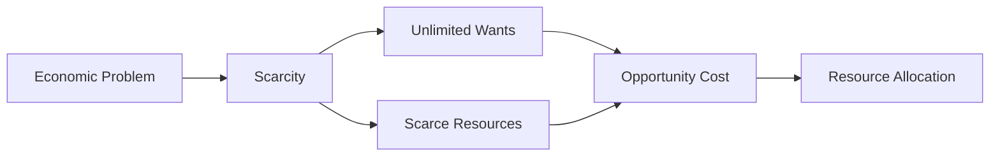

---

title: Macroeconomics
course: Economics
unit: '1'
semester: Winter 2026
mode: ECON-MICRO
type: atomic_note
hub: '[[1_Basics_Of_Economics_Hub]]'
source: '[[Inbox/Generated/Winter 2026/Economics/Chapter_1.pdf]]'
date: '2026-05-15'
prerequisites:
- '[[Economic_Systems]]'
- '[[Limited_Resources]]'
- '[[Economic_Analysis]]'
source_pages:
- 17
generated: true
read: false

---


## Mental Model

Imagine you're the manager of a large factory that produces cars. You need to understand not just how your factory works, but also how the entire car industry and economy are performing. Macroeconomics is like looking at the big picture of the economy, studying how all the different parts interact and affect each other. It's concerned with understanding the economy as a whole, rather than just individual factories or consumers.

## How the Economics Actually Work

- **WHAT**: Macroeconomics is a branch of economics that analyzes the whole economy, looking at the big picture. It examines the economy's overall performance, focusing on issues like economic growth, inflation, and unemployment.
- **WHY**: This concept exists because understanding the economy - **HOW**: Macroeconomics works by analyzing various economic indicators, such as GDP, inflation rate, and unemployment rate. It studies the interactions between different sectors of the economy, like households, businesses, governments, and the foreign sector. This analysis helps economists understand the economy's current state and make predictions about its future performance. For example, macroeconomists might study how changes in government spending or taxation affect the overall level of economic activity. 
- **CONNECTIONS**: This concept is closely related to [[Economic_Systems]], which determine how resources are allocated and how economies function. It's also connected to [[Limited_Resources]], as macroeconomics deals with the efficient allocation of scarce resources. Additionally, macroeconomists use various methods of [[Economic_Analysis]] to understand the economy.

## The Formal Math & Models

The source text defines economics as "a social science which studies about efficient allocation of scarce resources so as to attain the maximum fulfillment of unlimited human wants." Macroeconomics is a part of this broader field, focusing on the economy as a whole. The text mentions that economics is about two hundred years old, with Adam Smith's book "An Inquiry into the Nature and Causes of Wealth of Nations" (1776) marking its beginning.

| **Concept** | **Description** | **Learning Intentions** |
| --- | --- | --- |
| Macroeconomics | A branch of economics that analyzes the whole economy, looking at the big picture. | Define ‘Economics’, Explain the fundamental economic problem of scarcity, Explain the need for individuals, firms, and governments to make choices. |
| Economics | The study of how people make choices about how to use resources to satisfy their wants. | Define ‘Economics’, Explain the fundamental economic problem of scarcity. |
| Scarcity | The fundamental economic problem that resources are scarce while people’s wants are unlimited. | Explain the fundamental economic problem of scarcity, Explain the need for individuals, firms, and governments to make choices. |
| Opportunity Cost | The value of the next best alternative that is given up when a choice is made. | Define opportunity cost and explain how it results from the need to make choices. |
| Resource Allocation | The process of deciding how to use resources to satisfy wants. | Explain the basic questions of resource allocation. |
| Economic Growth | An increase in the production of goods and services in an economy. |  |
| Inflation | A sustained increase in the general price level of goods and services in an economy. |  |
| Unemployment | A situation where people are able and willing to work, but are unable to find employment. |  |




---

## The Proving Grounds

```interactive-quiz

[
  {
    "type": "mcq",
    "question": "If a consumer's income increases and the price of a good they purchase also increases, but the consumer buys the same quantity of the good as before, what can be inferred about the good?",
    "options": {
      "A": "The good is an inferior good",
      "B": "The good is a normal good and the income effect is exactly offset by the substitution effect",
      "C": "The good is a normal good and the consumer's demand is perfectly inelastic",
      "D": "The good is a Giffen good"
    },
    "answer": "B",
    "explanation": "The consumer buying the same quantity despite an increase in income and price suggests that the income effect and substitution effect offset each other. This scenario does not necessarily imply the good is inferior (A), nor does it directly indicate the good is a Giffen good (D), as Giffen goods are rare and characterized by an increase in quantity demanded when price increases. Perfect inelasticity (C) refers to a situation where quantity demanded doesn't change with price, not directly relevant here.",
    "explanation_page": 17
  },
  {
    "type": "mcq",
    "question": "A consumer's budget constraint is determined by their income and the prices of goods they buy. If the price of one good increases while the consumer's income and the price of other goods remain constant, what effect does this have on the consumer's budget constraint?",
    "options": {
      "A": "The budget constraint shifts outward, allowing the consumer to buy more of all goods",
      "B": "The budget constraint pivots inward along the axis of the good whose price increased, reducing the maximum quantity of that good the consumer can buy",
      "C": "The budget constraint shifts inward, equally reducing the consumer's purchasing power for all goods",
      "D": "The budget constraint remains unchanged"
    },
    "answer": "B",
    "explanation": "An increase in the price of one good, with income and other prices constant, pivots the budget constraint inward along the axis of the good whose price increased. This change does not shift the budget constraint outward (A) or remain unchanged (D), nor does it shift inward equally for all goods (C), as the impact is specifically related to the good whose price changed.",
    "explanation_page": 17
  },
  {
    "type": "mcq",
    "question": "If a consumer is maximizing utility subject to a budget constraint and the price of one of the goods they consume decreases, what happens to the consumer's optimal consumption bundle?",
    "options": {
      "A": "The consumer will buy more of the good whose price decreased and less of other goods",
      "B": "The consumer's optimal consumption bundle will change in a way that could increase or decrease the quantity of the good whose price decreased, depending on its elasticity",
      "C": "The consumer will definitely buy less of the good whose price decreased",
      "D": "The consumer's optimal consumption bundle remains the same"
    },
    "answer": "B",
    "explanation": "When the price of a good decreases, the budget constraint pivots outward. The effect on the optimal consumption bundle depends on the substitution and income effects. Generally, the consumer will buy more of the good whose price decreased (substitution effect), but the overall change also depends on whether the good is normal or inferior (income effect). Therefore, the quantity of the good bought could increase or decrease depending on these effects and the elasticity of demand.",
    "explanation_page": 17
  }
]

```