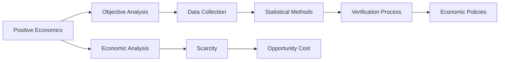

---

title: Positive_Economics
course: Economics
unit: '1'
semester: Winter 2026
mode: ECON-MICRO
type: atomic_note
hub: '[[1_Basics_Of_Economics_Hub]]'
source: '[[Inbox/Generated/Winter 2026/Economics/Chapter_1.pdf]]'
date: '2026-05-15'
prerequisites:
- '[[Economic_Analysis]]'
- '[[Inductive_Reasoning]]'
- '[[Decision_Making_Units]]'
source_pages:
- 18
generated: true
read: false

---


## Mental Model

Positive economics is a way of studying economics that focuses on facts and data. It's like analyzing the financial reports of a company, such

## How the Economics Actually Work

Positive economics is concerned with the analysis of facts and is verifiable. 
- WHAT: It is a branch of economics that deals with objective analysis of economic phenomena, without making value judgments. 
- WHY: This concept exists because economic decisions need to be based on factual analysis rather than opinions or biases. 
- HOW: 
  1. Economists gather data on various economic indicators such as GDP, inflation rate, and unemployment rate.
  2. They analyze these data to identify patterns and trends.
  3. They use statistical methods to verify their findings.
  4. The results are then used to inform economic policies or decisions.
  This process is connected to [[Economic_Analysis]], which involves using data and statistical methods to understand economic phenomena. 
  Positive economics also relies on [[Inductive_Reasoning]], where generalizations are made based on specific observations. 
  Furthermore, it is related to [[Decision_Making_Units]], as the analysis of economic data informs the decisions of individuals, firms, and governments.

## The Formal Math & Models

The source text states that "Positive economics is concerned with analysis of facts and is verifiable. It doesn’t have to be necessarily true." This indicates that positive economics focuses on objective analysis of economic data, and the findings can be verified through evidence.

| **Concept** | **Description** | **Verification** |
| --- | --- | --- |
| Positive Economics | Concerned with analysis of facts and is verifiable | Based on objective analysis of economic phenomena |
| Objective Analysis | Deals with facts, without making value judgments | Through data collection and statistical methods |
| Economic Phenomena | Examples include GDP, inflation rate, unemployment rate | Analyzed to identify patterns and trends |
| Data Collection | Economists gather data on various economic indicators | To inform economic policies or decisions |
| Statistical Methods | Used to verify findings | To ensure accuracy and reliability |
| Economic Policies | Based on factual analysis rather than opinions or biases | To ensure informed decision-making |
| Verification Process | Involves identifying patterns and trends, and using statistical methods | To confirm accuracy of findings |
| Economic Analysis | A broader field that encompasses positive economics | Used to understand economic phenomena |
| Scarcity | Fundamental economic problem due to limited resources and unlimited wants | Leads to need for choices and opportunity cost |
| Opportunity Cost | Results from need to make choices due to scarcity | A key concept in understanding economic decisions |




---

## The Proving Grounds

```interactive-quiz

[
  {
    "type": "mcq",
    "question": "A game theorist uses data to analyze the impact of a price increase on the sales of a product. Which of the following statements about this analysis is an example of positive economics?",
    "options": {
      "A": "The price increase will lead to a 10% reduction in sales, which is an undesirable outcome.",
      "B": "The analysis shows that a 10% price increase results in a 5% reduction in sales.",
      "C": "The company should not increase the price because it will harm consumers.",
      "D": "The price increase is justified if the company's profit increases by 15%."
    },
    "answer": "B",
    "explanation": "Positive economics involves objective analysis of economic phenomena, focusing on 'what is' rather than 'what ought to be.' It describes facts and cause-and-effect relationships without making value judgments. Therefore, stating that 'a 10% price increase results in a 5% reduction in sales' is an example of positive economics because it presents a factual, data-driven analysis without expressing a moral or ethical opinion.",
    "explanation_page": 18
  },
  {
    "type": "mcq",
    "question": "In a study on competition among firms, an economist finds that when one firm lowers its price, other firms follow suit. Which of the following statements about this scenario is an example of positive economics?",
    "options": {
      "A": "This behavior is unfair to small businesses and should be regulated.",
      "B": "The firms are engaging in a price war, which typically leads to lower profits for all.",
      "C": "The data show that a 5% price cut by one firm leads to a 3% price cut by its competitors on average.",
      "D": "Firms should avoid price wars to ensure fair competition."
    },
    "answer": "C",
    "explanation": "This question requires the application of positive economics concepts to a game theory scenario. Positive economics focuses on descriptive statements about economic phenomena, without involving value judgments. Therefore, the statement 'the data show that a 5% price cut by one firm leads to a 3% price cut by its competitors on average' is an example of positive economics because it presents an empirical observation about the relationship between price cuts and competitor responses.",
    "explanation_page": 18
  },
  {
    "type": "mcq",
    "question": "An economist observes that in a market with few suppliers, prices tend to be higher than in a market with many suppliers. Which of the following statements about this observation is an example of positive economics?",
    "options": {
      "A": "The government should intervene to reduce prices in markets with few suppliers.",
      "B": "Markets with few suppliers have higher prices because they often lead to decreased competition.",
      "C": "It is unfair for consumers to pay higher prices in markets with few suppliers.",
      "D": "The observation suggests that market structure affects pricing."
    },
    "answer": "B",
    "explanation": "This question tests the understanding of positive economics in the context of market structures and pricing. Positive economics involves factual statements about economic relationships. The statement 'markets with few suppliers have higher prices because they often lead to decreased competition' explains a cause-and-effect relationship based on observed data, making it an example of positive economics.",
    "explanation_page": 18
  }
]

```