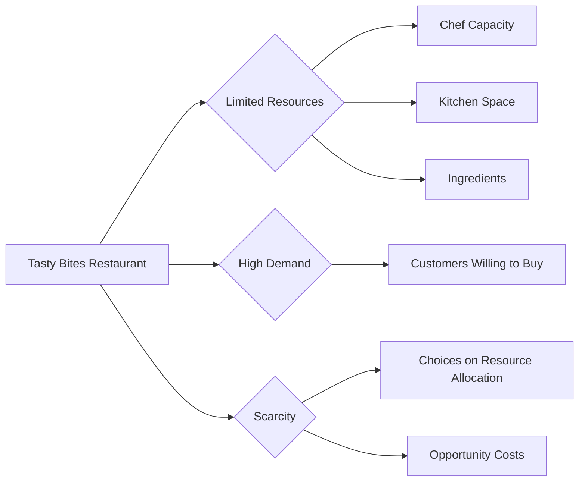

---

title: Scarcity
course: Economics
unit: '1'
semester: Winter 2026
mode: ECON-MICRO
type: atomic_note
hub: '[[1_Basics_Of_Economics_Hub]]'
source: '[[Inbox/Generated/Winter 2026/Economics/Chapter_1.pdf]]'
date: '2026-05-10'
prerequisites:
- '[[Basic_Economic_Questions]]'
- '[[Limited_Resources]]'
- '[[Economic_Systems]]'
- '[[Economic_Growth]]'
- '[[Capital_Intensive_Techniques]]'
source_pages:
- 12
generated: true

---


## 1. Mental Model

In a small town, a popular restaurant, "Tasty Bites," is known for its burgers and fries. The restaurant has only a few chefs and a limited kitchen space, which means they can only prepare a certain number of meals per day. However, the demand for their food is high, and many customers are willing to buy their meals. As a result, the restaurant has to decide how to allocate its limited resources, such as ingredients, cooking time, and staff, to meet the demands of its hungry customers. This situation illustrates the fundamental economic problem of scarcity.

## 2. Foundational Concept

The fundamental economic problem of scarcity arises because resources are scarce while people's wants are unlimited. Resources refer to the inputs used to produce goods and services, such as labor, capital, land, and raw materials. The scarcity of resources means that there are only limited amounts available to produce the unlimited amount of goods and services that people desire. As a result, individuals, firms, and governments must make choices about how to allocate their resources in the most efficient way possible. This is closely related to the [[Basic_Economic_Questions]] that every economy must answer, including what goods and services to produce, how to produce them, and for whom to produce them. The concept of scarcity is also linked to [[Limited_Resources]] and Unlimited Wants, which are the driving forces behind the need for choice. [[Economic_Systems]] are designed to address these issues.

### Key Takeaways:

- The restaurant "Tasty Bites" has to make choices about how to allocate its limited resources to meet the demands of its customers.
- The concept of scarcity implies that there are opportunity costs associated with every choice, as the resources used for one purpose cannot be used for another.
- Understanding scarcity is crucial for understanding [[Economic_Growth]], as it highlights the need for efficient resource allocation to achieve growth.

## 3. Limitations & Edge Cases

The concept of scarcity assumes that resources are limited and that people's wants are unlimited. However, in reality, some resources may be more abundant than others, and people's wants may be limited by factors such as income or cultural norms. Additionally, technological advancements can sometimes alleviate scarcity by making resources more productive or by creating new substitutes. For example, the development of [[Capital_Intensive_Techniques]] or [[Labour_Intensive_Techniques]] can increase the productivity of resources. Furthermore, [[Market_Failure]] can occur when markets do not allocate resources efficiently, leading to overconsumption or underconsumption of certain goods and services. The concept of scarcity also has [[Normative_Economics]] implications, as it raises questions about what is fair and equitable in the allocation of resources. Overall, while scarcity is a fundamental concept in economics, it is not a universal or absolute concept, and its implications can vary depending on the context.

## 4. Scarcity at Tasty Bites



## 5. Walkthrough

**Step 1:** The restaurant "Tasty Bites" faces a fundamental economic problem.

**Step 2:** It has limited resources such as chef capacity, kitchen space, and ingredients.

**Step 3:** However, the demand for its food is high, with many customers willing to buy.

**Step 4:** This situation leads to scarcity, meaning "Tasty Bites" cannot satisfy all the wants of its customers.

**Step 5:** As a result, the restaurant must make choices about how to allocate its limited resources.

**Step 6:** Every choice involves opportunity costs, as resources used for one purpose cannot be used for another.

## 6. The Proving Grounds

```interactive-quiz
[
  {
    "type": "fill_in",
    "question": "The characteristic that makes scarcity an economic problem is that resources are [[blank]] while wants are unlimited.",
    "answer": "scarce",
    "explanation": "The fundamental economic problem of scarcity arises because resources are scarce while people's wants are unlimited. This mismatch between limited resources and unlimited wants necessitates choices about resource allocation.",
    "textWithBlanks": "The characteristic that makes scarcity an economic problem is that resources are [[blank]] while wants are unlimited."
  },
  {
    "type": "mcq",
    "question": "What is a direct consequence of scarcity in an economy?",
    "options": {
      "a": "Increased economic growth",
      "b": "Decreased opportunity costs",
      "c": "The need for efficient resource allocation",
      "d": "Automatic satisfaction of all wants"
    },
    "answer": "c",
    "explanation": "Scarcity implies that resources are limited and wants are unlimited, leading to the need for efficient allocation of resources to maximize satisfaction.",
    "optionsValid": [
      "The need for efficient resource allocation",
      "Opportunity costs for choices",
      "Trade-offs in resource use",
      "Economic decision-making"
    ]
  },
  {
    "type": "trace",
    "question": "Trace the causal chain from scarcity to opportunity costs.",
    "steps": [
      "Resources are limited",
      "Wants are unlimited",
      "Scarcity arises because resources cannot satisfy all wants",
      "Choices must be made about how to allocate resources",
      "Resources used for one purpose cannot be used for another",
      "Opportunity costs arise from the choices made"
    ],
    "answer": "Opportunity costs",
    "explanation": "The causal chain leads to opportunity costs as a direct result of scarcity and the consequent need for choices about resource allocation."
  }
]
```