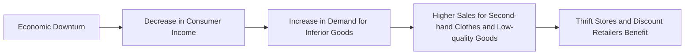

---

title: Inferior_Goods
course: Economics
unit: '2'
semester: Winter 2026
mode: ECON-MICRO
type: atomic_note
hub: '[[2_Basics_Of_Economics_Hub]]'
source: '[[Inbox/Generated/Winter 2026/Economics/Chapter_2.pdf]]'
date: '2026-05-10'
prerequisites:
- '[[Demand_Function]]'
- '[[Market_Demand]]'
- '[[Demand_Curve]]'
- '[[Normal_Goods]]'
- '[[Technological_Advancement]]'
source_pages:
- 17
generated: true

---


## 1. Mental Model

When the economy experiences a downturn, low-income households often see an increase in demand for second-hand clothes and low-quality goods. For instance, during the 2008 financial crisis, many consumers turned to thrift stores and discount retailers for their clothing needs. This shift in consumer behavior illustrates the concept of inferior goods. As incomes fall, the demand for these goods rises.

## 2. Foundational Concept

Inferior goods are a type of good for which demand increases when consumer income decreases, and decreases when consumer income increases. This concept is closely related to the [[Demand_Function]], which describes the relationship between the quantity demanded of a good and its price. Inferior goods are often associated with low-quality or second-hand products, such as second-hand clothes. The demand for inferior goods is also influenced by the [[Market_Demand]] and [[Demand_Curve]], which show how the quantity demanded of a good changes in response to changes in price. In contrast, [[Normal_Goods]] experience a decrease in demand when consumer income decreases.

### Key Takeaways:

- The demand for second-hand clothes and low-quality goods increases when consumer income decreases.
- Inferior goods are often associated with low-income households, which tend to see an increase in demand for these goods during economic downturns.
- Understanding inferior goods is important for businesses and policymakers, as it helps them anticipate changes in demand in response to changes in consumer income.

## 3. Limitations & Edge Cases

However, the concept of inferior goods has several limitations. For example, it assumes that consumers have a fixed preference for certain types of goods, which may not always be the case. Additionally, the classification of a good as inferior can vary across different income groups and cultures. Furthermore, the concept of inferior goods does not account for [[Technological_Advancement]], which can lead to changes in consumer preferences and demand patterns over time. The concept also relies on the assumption that consumers have perfect information about the quality and price of goods, which may not always be the case.

## 4. Inferior Goods Demand Shift



## 5. Walkthrough

**Step 1:** During an economic downturn, households experience a decrease in income.

**Step 2:** As a result, low-income households seek more affordable options, leading to an increase in demand for inferior goods.

**Step 3:** Inferior goods, such as second-hand clothes and low-quality products, see a surge in sales.

**Step 4:** This shift benefits thrift stores and discount retailers, which cater to these needs.

## 6. The Proving Grounds

```interactive-quiz

[
  {
    "type": "fill_in",
    "question": "Inferior goods are a type of good for which demand increases when consumer income [[blank]].",
    "answer": "decreases",
    "explanation": "Inferior goods experience an increase in demand when consumer income decreases, as households seek more affordable options.",
    "textWithBlanks": "Inferior goods are a type of good for which demand increases when consumer income [[blank]]."
  },
  {
    "type": "mcq",
    "question": "What type of goods experience a decrease in demand when consumer income decreases?",
    "options": {
      "a": "Inferior Goods",
      "b": "Normal Goods",
      "c": "Luxury Goods",
      "d": "Complementary Goods"
    },
    "answer": "b",
    "explanation": "Normal Goods are those for which demand decreases when consumer income decreases, as households can afford to buy them even when income is low."
  },
  {
    "type": "trace",
    "question": "Trace the causal chain from economic downturn to outcome for thrift stores.",
    "steps": [
      "Economic downturn occurs",
      "Households experience a decrease in income",
      "Demand for inferior goods increases",
      "Thrift stores see higher sales"
    ],
    "answer": "Thrift stores benefit from increased sales",
    "explanation": "During an economic downturn, households seek more affordable options, leading to increased demand for inferior goods, which benefits thrift stores."
  }
]

```