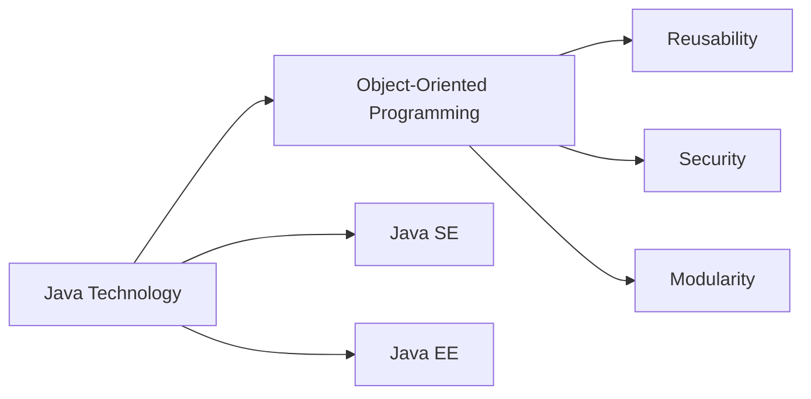

## Mental Model

In a large pharmaceutical company's research lab, different departments (like chemistry and biology) have their own specialized toolkits and methods for testing and analyzing compounds. Just as [[Java_Technology]] provides a versatile set of tools and platforms (like Java SE, Java EE, etc.) that cater to different needs and applications, enabling developers to build and run various types of programs. A master "lab manager" oversees the entire operation, ensuring that each department uses standardized procedures and compatible equipment, much like the Java Virtual Machine (JVM) ensures that Java code runs consistently across different environments.

## The Logic Behind the Code

[[Java_Technology]] is a way of creating computer programs. 
WHAT is Java Technology? 
Java Technology is a type of programming approach that allows developers to create programs using a specific set of tools and languages. 
The key characteristics that define Java are often discussed in terms of its "buzzwords," but the source text does not elaborate on these.

To understand Java Technology, we need to look at the evolution of [[Programming_Paradigms]]. 
In the early days of programming, developers used binary code and mechanical switches, which was very complicated. 
As computer capacity grew, developers began building increasingly complex applications using high-level languages with English-like instructions.

There were several programming paradigms, including [[Unstructured_Programming]] and structured programming. 
Unstructured programming used goto statements, which led to "spaghetti code" that was difficult to maintain. 
Structured programming introduced functions or procedures, which made the code more readable and manageable.

However, structured programming had limitations, such as requiring updates across all functions in an application when changing a data type. 
This led to the development of Object-Oriented Programming (OOP), which focuses on data and objects. 
In OOP, data and methods are combined into a single unit, making it easier to model real-world scenarios accurately and increase security and reuse.

Java Technology is related to OOP, and it has various types of platforms, known as [[Java_Editions]]. 
The different types of Java platforms are referred to as Java Technology & Editions. 
Java Technology allows developers to create programs using [[Oop_Principles]], which provide a way to model real-world scenarios accurately and increase security and reuse.

The mechanism of Java Technology involves using OOP principles, such as classes and objects, to create programs. 
Developers can create multiple independent objects from the same class, and these objects can interact with each other. 
The focus of Java Technology is on "what it is" (data/objects), rather than "how to do it" (functions), which leads to more robust and maintainable software systems.

Overall, Java Technology provides a set of tools and languages for creating computer programs using OOP principles. 
It allows developers to model real-world scenarios accurately, increase security and reuse, and create more robust and maintainable software systems.

## The Technical Implementation

[[Java_Technology]] is a programming paradigm that enables developers to create software applications using a set of standardized tools and languages. It is characterized by its object-oriented programming (OOP) principles, which facilitate code reusability, modularity, and maintainability. Java Technology is distinguished by its platform independence, allowing Java programs to run on various operating systems and hardware configurations.

### [[Java_Technology]] Overview

| **Characteristics** | **Description** |
| --- | --- |
| Programming Paradigm | Object-Oriented Programming |
| Focus | Data and Objects |
| Key Features | Reusability, Security, Modularity |
| Platforms | Java SE, Java EE, etc. |
| Development Approach | [[Oop_Principles]] |
| Evolution | From Procedural to Object-Oriented |
| Real-World Modeling | Accurate Representation |
| Code Management | Easier Maintenance |



### Key Takeaways

Java Technology is based on Object-Oriented Programming (OOP) principles, It allows for accurate real-world modeling, increased security, and code reusability, and Java has various platforms, including Java SE and Java EE.


---

## The Proving Grounds

```interactive-quiz
[
  {
    "type": "mcq",
    "question": "What is the primary programming paradigm used in Java Technology?",
    "options": {
      "A": "Functional Programming",
      "B": "Object-Oriented Programming",
      "C": "Imperative Programming",
      "D": "Declarative Programming"
    },
    "answer": "B",
    "explanation": "Java Technology is primarily based on Object-Oriented Programming (OOP) principles, which organize software design around objects and their interactions.",
    "explanation_page": 19
  },
  {
    "type": "true_false",
    "question": "Java Technology is a type of programming language.",
    "answer": false,
    "explanation": "Java Technology is a set of tools and languages that allow developers to create programs, but it is not a single programming language. Instead, it encompasses a platform and a set of languages, with Java being a primary language used.",
    "explanation_page": 19
  },
  {
    "type": "writing",
    "question": "Describe the key characteristics that define Java Technology, often referred to as 'Java buzzwords'.",
    "answer": "The Java Technology is characterized by its platform independence, strong security features, and object-oriented design. The buzzwords often associated with Java include 'platform independence', 'security', and 'object-oriented'.",
    "required_keywords": [
      "platform independence",
      "security",
      "object-oriented"
    ],
    "explanation": "This question requires the student to understand the core features and principles of Java Technology, which are often summarized by its 'buzzwords'. A correct answer must include these key characteristics.",
    "explanation_page": 19
  }
]
```