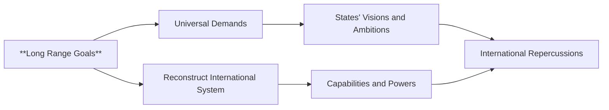

## Mental Model

Imagine a master builder designing a grand, futuristic city. The builder's long-range goals are like the blueprints for the city's overall architecture, outlining the fundamental layout, infrastructure, and rules for the entire metropolis, such as the placement of major highways, zoning laws, and public spaces. Just as the builder's vision guides the construction of the city's framework, a state's long-range goals shape its aspirations for the international system, envisioning a new world order with its own set of rules and structures.

## The Global Economic Engine

**Long range goals** refer to plans, dreams, and visions concerning the ultimate political or ideological organization of the international system, and rules governing relations in that system. This definition provides a clear understanding of what **long range goals** entail, specifically highlighting their focus on the overall structure and norms of the international system.

The underlying mechanism of long range goals involves states making universal demands to reconstruct the entire international system according to a universally applicable plan or vision. This is in contrast to middle range goals, which involve particular demands against specific interests. In pursuing long range goals, states aim to reshape the international system in a way that aligns with their own visions and ambitions. The ability of a state to project its long range visions and dreams onto the international stage depends on its capabilities and powers.

The real-world significance of long range goals lies in their potential to have far-reaching international repercussions. Every country has its own unique set of visions and ambitions, proportional to its relative strength and capabilities, which it seeks to realize in the long run. As states pursue their long range goals, they can shape the course of international relations and influence the global order. The impact of long range goals can be significant, as they have the potential to redefine the rules and norms that govern international interactions.

## The Macro Model & Jargon

Long-range goals pertain to the envisioned ultimate political or ideological configuration of the international system and the regulatory framework governing inter-state relations. These goals are distinguished by their universal applicability and the ambition to reshape the global order according to a specific plan or vision. The pursuit of long-range goals involves states making broad demands that aim to reconstruct the international system in alignment with their own visions and capabilities. This process is intrinsically linked to the capabilities and power of states, as the feasibility of realizing these goals depends on their ability to project influence on a global scale. Consequently, long-range goals have significant implications for international relations, as they can redefine the norms and structures that govern global interactions.

## Where It Breaks

> **Basic Mermaid flowchart (graph LR)**



**Infeasibility Due to Power Disparities**: The realization of long-range goals may be hindered by significant disparities in capabilities and power among states, making it challenging for some to project their visions globally.
**Lack of International Consensus**: The pursuit of long-range goals often requires international cooperation and consensus, which can be difficult to achieve due to divergent state interests and visions for the international system.
**Unintended Consequences**: The implementation of long-range goals can lead to unintended consequences, such as destabilization of the existing international order or the emergence of conflicting interests among states.


---

## The Proving Grounds

```interactive-quiz
[
  {
    "type": "true_false",
    "question": "Long range goals concern the specific economic transactions between states, such as trade agreements and tariffs.",
    "answer": false,
    "explanation": "Long range goals actually refer to plans, dreams, and visions concerning the ultimate political or ideological organization of the international system, and rules governing relations in that system. They are about the overall structure and norms of the international system, not specific economic transactions.",
    "explanation_page": 12,
    "source_pages": [
      12
    ]
  },
  {
    "type": "scenario",
    "question": "A country wants to establish a new international framework for environmental cooperation. How do long range goals apply to this situation?",
    "answer": "In this scenario, the country's long range goals would involve its vision for the international system's structure and rules regarding environmental cooperation. This would include its plans for how countries should interact and govern themselves in terms of environmental policies, laws, and regulations. The country's long range goals would likely involve creating a new international agreement or framework that outlines the principles, norms, and rules for environmental cooperation among nations.",
    "required_keywords": [
      "international system",
      "political organization",
      "ideological organization"
    ],
    "explanation": "Long range goals are about shaping the overall structure and norms of the international system, which in this case involves environmental cooperation. The country's goals would reflect its vision for how the international system should be organized to address environmental issues.",
    "explanation_page": 12,
    "source_pages": [
      12
    ]
  },
  {
    "type": "trace",
    "question": "Suppose a state has a long range goal of promoting democracy globally. What steps might it take to achieve this goal, and how might it affect the international system?",
    "answer": "To achieve its long range goal of promoting democracy globally, the state might take several steps. First, it could use its diplomatic influence to encourage other states to adopt democratic principles and practices. This might involve providing technical assistance, supporting democratic institutions, and promoting democratic norms. Second, it could use its economic leverage to incentivize other states to democratize, such as by offering economic aid or trade agreements contingent on democratic reforms. Third, it could work to strengthen international institutions that promote democracy, such as the United Nations or the European Union. \n\nThe effects of these steps on the international system could be significant. If successful, they could lead to a shift in the global balance of power, as more states adopt democratic systems. This could, in turn, lead to a more peaceful and stable international system, as democratic states are less likely to engage in conflict with one another. However, there could also be challenges and risks, such as resistance from non-democratic states or unintended consequences of external intervention.",
    "explanation": "This question requires the test-taker to think through the potential steps a state might take to achieve a long range goal, and how those steps might affect the international system. It requires an understanding of how long range goals can shape state behavior and influence the broader international system.",
    "explanation_page": 12,
    "source_pages": [
      12
    ]
  }
]
```