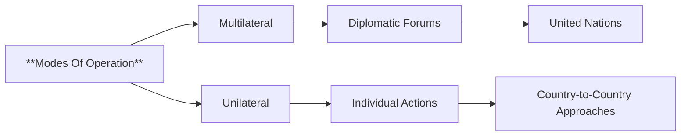

## Mental Model

A master chef can choose to prepare a dish using a collaborative kitchen, where multiple skilled cooks work together to create a harmonious culinary experience, or solo, relying on their individual expertise to craft a bold and innovative recipe. Just as the chef's approach affects the final product, a country's operational philosophy - multilateral or unilateral - shapes its policy outcomes, with the former leveraging diverse perspectives and the latter relying on decisive, singular action. The chef's tools and techniques, like the country's diplomatic forums or individual actions, are secondary to their chosen mode of operation.

## The Global Economic Engine

**Modes Of Operation** refer to the method of operation to address different issues, which can be pursued through either multilateral or unilateral means. 

The underlying mechanism for choosing a mode of operation involves considering the most effective approach to achieve desired outcomes. A multilateral approach involves seeking solutions through diplomatic forums where several states participate, such as the United Nations, rather than relying on purely bilateral country-to-country approaches. On the other hand, a unilateral approach involves using individual actions to influence outcomes. The choice between these two **modes of operation** depends on various factors, including the country's power and capability, the nature of the issue at hand, and the desired level of collective action. Countries may opt for a multilateral framework as the best strategy to address issues, regardless of their power and capability, as it can enhance their collective bargaining power.

The real-world significance of Modes Of Operation lies in their consequences for international relations and global governance. Countries that adopt a multilateral approach can pool their resources and expertise to address common challenges, while those that prefer a unilateral approach may be able to act more swiftly and decisively, but may also face greater risks and challenges. For instance, most developing countries use multilateral approaches because it enhances their collective bargaining power vis-a-vis other developed countries and is often less costly than establishing bilateral relations. In contrast, countries like Germany and Scandinavian countries may opt for multilateral frameworks as a best strategy to address issues, demonstrating that the choice of mode of operation is not necessarily determined by a country's power or capability.

## The Macro Model & Jargon

**Modes Of Operation** refer to the methodological approaches employed by countries to address various issues, which can be categorized into multilateral and unilateral means. The multilateral approach involves collaborative diplomatic efforts through forums such as the United Nations, whereas the unilateral approach entails individual actions to influence outcomes. The selection of a mode of operation is contingent upon factors including the country's capabilities, the nature of the issue, and the desired level of collective action. A country's operational philosophy, which may emphasize either bold and sweeping actions or more measured and collaborative efforts, underpins its choice of mode of operation. The implications of these choices are far-reaching, influencing international relations and global governance.

## Step Trace

> **Basic Mermaid flowchart (graph LR)**



**Inadequate Collective Bargaining Power**: A country may opt for a multilateral approach, but if it lacks sufficient collective bargaining power, its efforts may be ineffective in achieving desired outcomes. **Insufficient Unilateral Capabilities**: A country may choose a unilateral approach, but if it lacks the necessary capabilities, its individual actions may not be enough to influence outcomes. **Misalignment with National Interest**: A country's chosen mode of operation may not align with its [[National_Interest]], leading to ineffective or counterproductive policy outcomes.


---

## The Proving Grounds

```interactive-quiz
[
  {
    "type": "true_false",
    "question": "In the context of Modes Of Operation, a multilateral approach involves a single country acting alone to achieve a desired outcome.",
    "answer": false,
    "explanation": "A multilateral approach involves seeking solutions through diplomatic forums where several states participate, not a single country acting alone.",
    "explanation_page": 3,
    "source_pages": [
      3,
      17
    ]
  },
  {
    "type": "scenario",
    "question": "A country wants to address a global trade issue that affects multiple nations. It decides to collaborate with several other countries to find a solution through diplomatic talks. What mode of operation is the country using?",
    "answer": "The country is using a multilateral approach, as it seeks solutions through diplomatic forums where several states participate. This approach allows for collaborative problem-solving and can lead to more widely accepted and effective solutions.",
    "required_keywords": [
      "multilateral",
      "diplomatic forums"
    ],
    "explanation": "In this scenario, the country recognizes that the issue at hand is a global problem that requires a collective response. By engaging in diplomatic talks with multiple nations, the country is utilizing a multilateral mode of operation. This approach can foster cooperation, build consensus, and result in more sustainable solutions.",
    "explanation_page": 3,
    "source_pages": [
      3,
      17
    ]
  },
  {
    "type": "trace",
    "question": "Analyze the following situation: A country aims to influence an international trade agreement. Describe the steps it could take to operate unilaterally and multilaterally.",
    "answer": "To operate unilaterally, the country could take the following steps: (1) identify its goals and interests regarding the trade agreement, (2) assess the potential impact of individual actions on the agreement, and (3) take individual actions, such as imposing tariffs or quotas, to influence the outcome. In contrast, to operate multilaterally, the country could: (1) seek out diplomatic forums, such as international trade organizations or negotiations with other countries, (2) engage in discussions and negotiations with other countries to build a coalition or consensus, and (3) collaborate with other nations to achieve a mutually beneficial outcome.",
    "explanation": "This question requires the student to understand the core principles of Modes Of Operation and apply them to a specific scenario. The unilateral approach involves individual actions, whereas the multilateral approach involves collaborative efforts through diplomatic forums.",
    "explanation_page": 3,
    "source_pages": [
      3,
      17
    ]
  }
]
```