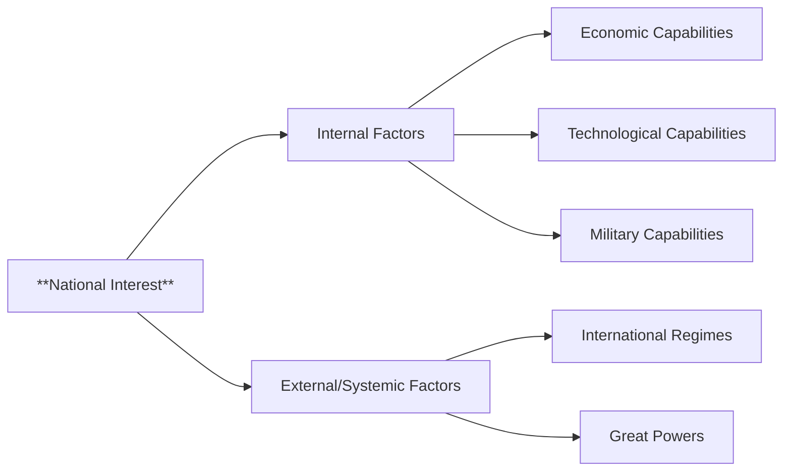

## Mental Model

A country's **national interest** is like the foundation and blueprints of a sturdy building. Just as a building's foundation and design determine its overall structure and purpose, a nation's values, goals, and objectives serve as the underlying framework that guides its international relations and [[Foreign_Policy]] decisions. The interplay of internal pillars (economic, technological, and military capabilities) and external architectural influences (international regimes and great powers) shapes the building's overall architecture, ensuring it stands strong and achieves its intended purpose.

## The Global Economic Engine

**National interest** is a set of values, orientation, goals and objectives a given country would like to achieve in its international relations. This concept serves as the raison d'etat, or the reason of state, to justify its actions and policy towards other states at the international level. In essence, **national interest** represents the priorities and objectives that a state aims to pursue in its external relations.

The underlying mechanism of national interest lies in the fact that states adopt [[Foreign_Policy]] to achieve and promote their national interests. This involves both external/systemic factors, such as international regimes and the prevalence of great powers, and internal factors, including economic, technological, and military capabilities. The pursuit of national interest is driven by the desire of states to survive and secure their position in the international system. In this context, national interest is often equated with the interest of key organizations, such as the army or foreign office, which can shape the state's **foreign policy** decisions.

The real-world significance of national interest lies in its impact on a state's [[Foreign_Policy_Behavior]] and its ability to defend and promote its objectives in the international arena. For less developing countries, foreign dependency can hinder their ability to pursue their national interest, as they may be reliant on external powers for technical aid, expertise, and security. In contrast, states that prioritize pragmatic criteria and pursue power as a key component of their national interest, as seen in the realist view, are likely to shape their [[Foreign_Policy]] decisions around the pursuit of influence and control. Ultimately, the concept of national interest remains a crucial driver of state behavior in international relations.

## The Macro Model & Jargon

**National interest** is a foundational concept in international relations, representing a nation's values, orientation, goals, and objectives in its external relations. It serves as the raison d'etat, justifying a state's actions and policies towards other nations. The pursuit of **national interest** is driven by a state's desire for survival and security within the international system. This concept is shaped by both internal factors, such as economic, technological, and military capabilities, and external/systemic factors, including international regimes and the influence of great powers. The determination of national interest is subject to various perspectives, including the realist view, which prioritizes pragmatic criteria and the pursuit of power.

## Where It Breaks

> **Basic Mermaid flowchart (graph LR)**



**Dependency on External Powers**: Less developing countries may face challenges in defending and promoting their **national interest** due to their dependency on external powers for technical aid, expertise, and security. **Equating Organizational Interest with National Interest**: The interest of key organizations, such as the army or foreign office, may be equated with the national interest, potentially leading to biased [[Foreign_Policy]] decisions. **Realist Perspective Limitations**: The realist view's prioritization of power and pragmatic criteria may overlook other essential factors in determining national interest, such as ethical considerations and long-term cooperation.


---

## The Proving Grounds

```interactive-quiz
[
  {
    "type": "true_false",
    "question": "A country's national interest is solely determined by its economic goals.",
    "answer": false,
    "explanation": "National interest encompasses a set of values, orientation, goals, and objectives a country aims to achieve in its international relations, not solely economic goals.",
    "explanation_page": 1,
    "source_pages": [
      1,
      6,
      8
    ]
  },
  {
    "type": "scenario",
    "question": "Suppose a nation prioritizes securing a stable supply of renewable energy sources. How might this goal relate to its national interest?",
    "answer": "This goal could be a key component of the nation's national interest as it represents a priority or objective the state aims to pursue in its international relations, possibly involving diplomatic efforts or policy actions to ensure access to such resources.",
    "required_keywords": [
      "orientation",
      "goals",
      "objectives"
    ],
    "explanation": "The nation's goal of securing a stable supply of renewable energy sources likely aligns with its broader national interest, reflecting its values and priorities in the international arena.",
    "explanation_page": 1,
    "source_pages": [
      1,
      6,
      8
    ]
  },
  {
    "type": "trace",
    "question": "Trace the logical connection between a country's national interest and its foreign policy decisions.",
    "answer": "Step 1: A country's national interest defines its priorities and objectives in international relations. Step 2: These priorities and objectives serve as the raison d'etat, or reason of state, guiding the country's actions and policies towards other states. Step 3: Consequently, the country's foreign policy decisions are made with the aim of achieving and promoting its national interest, influencing its actions, decisions, and goals towards the outside world.",
    "explanation": "The logical connection is that national interest serves as the foundation for a country's foreign policy, driving its international actions and decisions to achieve its goals and objectives.",
    "explanation_page": 1,
    "source_pages": [
      1,
      6,
      8
    ]
  }
]
```