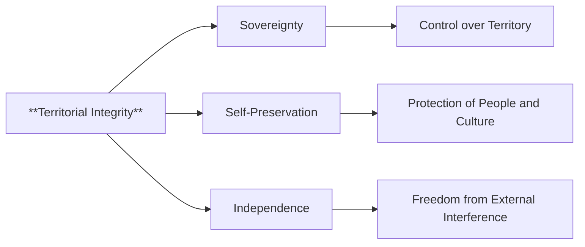

## Mental Model

Here is a vivid analogy for **Territorial Integrity**:

Imagine a majestic tree, with roots digging deep into the earth and branches stretching towards the sky. The tree's roots represent the state's foundation, nourishing its people, culture, and economy, while its trunk and branches symbolize the state's sovereignty and territorial boundaries. Just as the tree's integrity relies on the unbroken connection between its roots and branches, a state's **territorial integrity** relies on the inviolability of its borders and the unity of its land, ensuring the nation's self-preservation and prosperity.

## The Global Economic Engine

The concept of **territorial integrity** refers to the protection and preservation of a state's territorial boundaries and its right to control and govern its own territory without external interference. This concept is considered a core interest and value of a state, closely tied to its self-preservation, sovereignty, and independence. It is a fundamental principle of [[Foreign_Policy]] that is often accepted by society without question.

The underlying mechanism of **territorial integrity** is rooted in a state's need to ensure its existence and the security of its political and economic systems, people, and culture. A state's territorial integrity is essential for the realization of other goals, as it provides the foundation for the exercise of sovereignty and the ability to make decisions without external influence. The value placed on territorial integrity varies depending on the attitudes of those who make **foreign policy**, with some governments prioritizing the control and defense of neighboring territories.

The real-world significance of territorial integrity lies in its role as a catalyst for state action in the face of external threats. As seen in the example of Ethiopia during Menelik II's reign, the concept of territorial integrity can mobilize a nation to take drastic measures, such as declaring war, to defend its sovereignty and territorial boundaries. In this case, Menelik II's determination to protect Ethiopia's territorial integrity led to a nationwide war against Italy, highlighting the importance of this concept in international relations and statecraft.

## The Macro Model & Jargon

The concept of **territorial integrity** is a fundamental principle of [[Foreign_Policy]], ensuring the protection and preservation of a state's territorial boundaries and its right to control and govern its own territory without external interference. This concept is closely tied to a state's self-preservation, sovereignty, and independence. The **territorial integrity** of a state is essential for the realization of other goals, as it provides the foundation for the exercise of sovereignty and the ability to make decisions without external influence. The value placed on territorial integrity varies depending on the attitudes of those who make **foreign policy**, with some governments prioritizing the control and defense of neighboring territories. In the context of Ethiopia's [[Foreign_Policy]] during Menelik II's reign, the concept of territorial integrity played a crucial role in the country's response to Italy's expansionist threats.

## Where It Breaks

> **Basic Mermaid flowchart (graph LR)**



**Erosion of Sovereignty**: The loss of control over territory can lead to a decline in a state's sovereignty, making it vulnerable to external influence and interference.
**Territorial Fragmentation**: The division of a state's territory can result in the fragmentation of its people and culture, leading to social and economic instability.
**External Interference**: The violation of a state's **territorial integrity** can lead to external interference in its internal affairs, undermining its independence and self-preservation.


---

## The Proving Grounds

```interactive-quiz
[
  {
    "type": "true_false",
    "question": "The concept of territorial integrity refers to a state's right to control and govern its own territory without external interference.",
    "answer": true,
    "explanation": "This statement is true. Territorial integrity is a core interest and value of a state, closely tied to its self-preservation, sovereignty, and independence, and it refers to the protection and preservation of a state's territorial boundaries and its right to control and govern its own territory without external interference.",
    "explanation_page": 10,
    "source_pages": [
      10,
      27,
      29
    ]
  },
  {
    "type": "scenario",
    "question": "Ethiopia's foreign policy during Menelik II's reign was primarily driven by the need to protect its territorial integrity in response to Italy's expansion. What were the implications of this objective on Ethiopia's interactions with other states in the international system?",
    "answer": "Ethiopia's objective of protecting its territorial integrity during Menelik II's reign had significant implications on its interactions with other states. The country's focus on preserving its sovereignty and independence led to tensions with Italy, which was seeking to expand its territory. This objective imposed demands on other states in the international system, particularly Italy, as Ethiopia sought to maintain its core interests and values. The protection of territorial integrity required Ethiopia to assert its rights and boundaries, potentially leading to conflicts or diplomatic challenges with neighboring states or European powers.",
    "required_keywords": [
      "territorial integrity",
      "sovereignty",
      "international system"
    ],
    "explanation": "The scenario requires the application of the concept of territorial integrity to a historical context. The correct answer demonstrates an understanding of how Ethiopia's objective of protecting its territorial integrity influenced its foreign policy and interactions with other states.",
    "explanation_page": 10,
    "source_pages": [
      10,
      27,
      29
    ]
  },
  {
    "type": "trace",
    "question": "What are the logical steps that connect the concept of territorial integrity to a state's core interests and values?",
    "answer": "Step 1: A state's territorial integrity is closely tied to its self-preservation, as the protection of its territory ensures the state's continued existence. Step 2: The preservation of territorial boundaries allows a state to maintain control over its resources, population, and governance, which are essential to its sovereignty. Step 3: A state's ability to govern its territory without external interference is a fundamental aspect of its independence. Step 4: Therefore, the protection of territorial integrity is a core interest and value of a state, as it ensures the state's self-preservation, sovereignty, and independence.",
    "explanation": "The correct answer provides a step-by-step logical connection between the concept of territorial integrity and a state's core interests and values. The trace demonstrates an understanding of the causal relationships between territorial integrity, self-preservation, sovereignty, and independence.",
    "explanation_page": 10,
    "source_pages": [
      10,
      27,
      29
    ]
  }
]
```