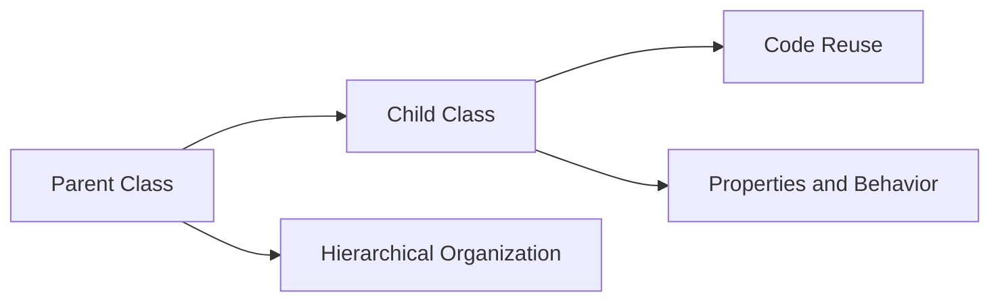

## Mental Model

In a pharmaceutical company's research and development department, a team creates a base formulation for a new medication, which includes a specific combination of active ingredients and excipients. This base formulation serves as a parent "recipe" that can be inherited and modified by various project teams, who create their own versions by adding or adjusting specific components, such as dosages or delivery mechanisms, while still leveraging the foundational composition. As new formulations are developed, they can be tracked and managed, with each variant building upon the original recipe, allowing for efficient reuse and minimizing redundant development efforts.

## The Logic Behind the Code

[[Inheritance]] is a concept in Object-Oriented Programming that allows one class to inherit the properties and behavior of another class. 

The term "Inheritance" precisely defines the idea that one class, known as the child or subclass, can inherit the characteristics of another class, known as the parent or superclass. 

The underlying reason for Inheritance is to enable code reuse and facilitate the creation of a more hierarchical organization of code. This is achieved by allowing a child class to inherit the common properties and behavior of a parent class, thereby reducing code duplication and improving modularity.

The mechanism of Inheritance works step-by-step as follows: a parent class is created with common properties and behavior, then a child class is created that inherits these properties and behavior from the parent class. The child class can also add new properties and behavior or override the ones inherited from the parent class. 

This process enables developers to model real-world scenarios more accurately and create more robust and maintainable software systems by focusing on the relationships between classes. 

By using Inheritance, developers can create a hierarchy of classes where a child class is a specialized version of the parent class, and this hierarchy can be extended to multiple levels, allowing for a high degree of code reuse and modularity.

In essence, Inheritance helps to promote code reuse and facilitates the creation of complex systems by breaking them down into smaller, more manageable parts. 

This concept is a fundamental aspect of Object-Oriented Programming and is supported by popular programming languages such as Java, Python, and C++.

## The Technical Implementation

[[Inheritance]] is a fundamental concept in Object-Oriented Programming (OOP) that enables a child class, also referred to as a subclass, to inherit the properties and behavior of a parent class, also known as a superclass. This facilitates code reuse and hierarchical code organization, wherein the child class inherits all the attributes and methods of the parent class and can also add new attributes and methods or override the ones inherited from the parent class. The primary objective of Inheritance is to promote code reusability, reduce code duplication, and establish a hierarchical relationship between classes, thereby enhancing the maintainability and scalability of software systems.

| **[[Inheritance]] Concept** | **Description** | **Example** |
| --- | --- | --- |
| Parent Class | The class being inherited from. |  |
| Child Class | The class doing the inheriting. |  |
| Code Reuse | The primary goal of inheritance. |  |
| Hierarchical Organization | The structure achieved through inheritance. |  |
| Properties and Behavior | Inherited from parent to child class. |  |
| Superclass | Another term for the parent class. |  |
| Subclass | Another term for the child class. |  |
| Inheritance Mechanism | Parent class → Child class inheritance. |  |



### Worked Example

Suppose we have a parent class `Vehicle` with properties `color` and `speed`, and a child class `Car` that inherits from `Vehicle`. 

| **Class** | **Properties** |
| --- | --- |
| Vehicle | color, speed |
| Car | (inherits from Vehicle) |

The `Car` class automatically has access to `color` and `speed` without needing to redefine them.


---

## The Proving Grounds

```interactive-quiz
[
  {
    "type": "mcq",
    "question": "In a cloud infrastructure project, a team creates a base class called 'VirtualMachine' with properties like 'cpu' and 'memory'. They then create a subclass called 'HighPerformanceVM' that inherits from 'VirtualMachine'. What is the primary benefit of using inheritance in this scenario?",
    "options": {
      "A": "To reduce code duplication by reusing the properties of the parent class",
      "B": "To increase the complexity of the codebase",
      "C": "To improve the security of the virtual machines",
      "D": "To enhance the performance of the virtual machines"
    },
    "answer": "A",
    "explanation": "Inheritance allows the 'HighPerformanceVM' class to inherit the properties of the 'VirtualMachine' class, reducing code duplication and improving code reuse.",
    "explanation_page": 14
  },
  {
    "type": "true_false",
    "question": "In object-oriented programming, a subclass can inherit properties and behavior from multiple parent classes.",
    "answer": false,
    "explanation": "In object-oriented programming, a subclass typically inherits properties and behavior from only one parent class, although some languages support multiple inheritance.",
    "explanation_page": 14
  },
  {
    "type": "writing",
    "question": "Describe how inheritance can be applied in a cloud infrastructure project to promote code reuse and modularity. Provide an example of a parent class and a child class, and explain how the child class inherits properties and behavior from the parent class.",
    "answer": "Inheritance is a fundamental concept in object-oriented programming that allows one class to inherit the properties and behavior of another class. In a cloud infrastructure project, inheritance can be used to promote code reuse and modularity. For example, a parent class called 'Resource' can have properties like 'name' and 'description', and methods like 'getDetails()'. A child class called 'VirtualMachine' can inherit from the 'Resource' class and add additional properties like 'cpu' and 'memory', and methods like 'start()' and 'stop()'. The 'VirtualMachine' class inherits the properties and behavior of the 'Resource' class, reducing code duplication and improving code reuse.",
    "required_keywords": [
      "inheritance",
      "parent class",
      "child class",
      "code reuse",
      "modularity"
    ],
    "explanation": "The answer demonstrates an understanding of inheritance and its application in a cloud infrastructure project, including the use of a parent class and a child class, and the benefits of code reuse and modularity.",
    "explanation_page": 14
  }
]
```