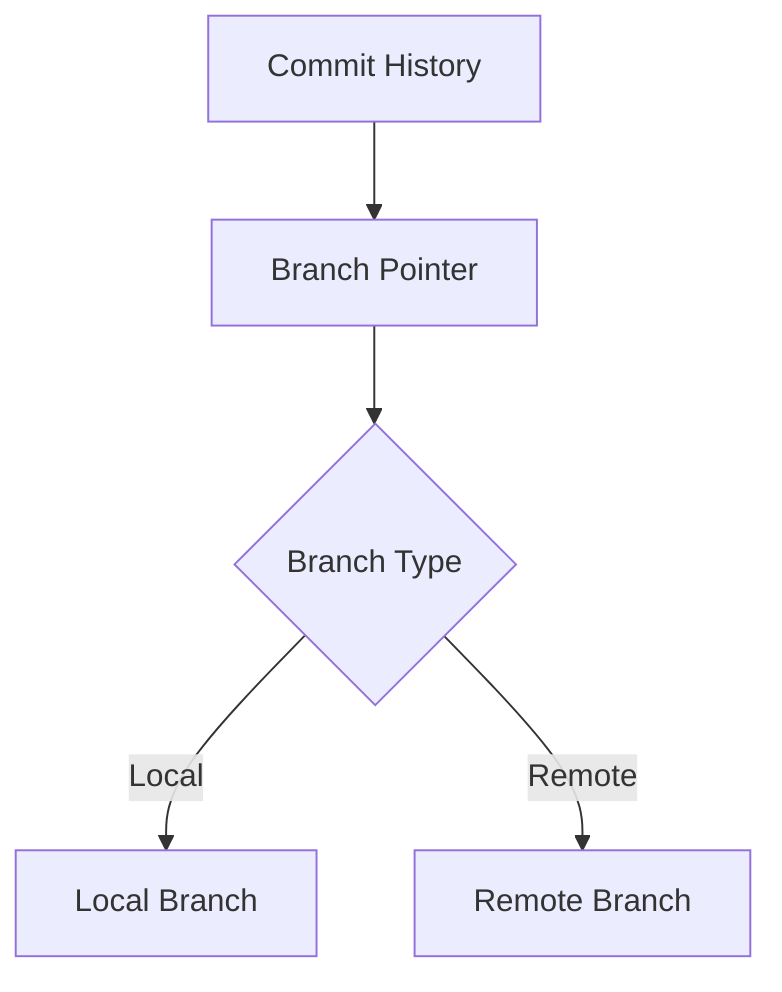

## Mental Model
Imagine a Git branching model as a flexible development workflow that allows you to create, merge, and delete branches as needed. This model helps teams work on different features or fixes simultaneously without disrupting the main codebase, much like how different teams work on various sections of a large construction project. By using branches, developers can isolate their work, test changes, and integrate them back into the main project smoothly.

## How It Works
In Git, a branch represents an independent line of development. When you create a new branch, Git creates a new reference to the current commit, and any new commits made on that branch will update the branch reference. The `main` or `master` branch typically serves as the central branch, reflecting the production-ready state of the project. Developers use commands like `git branch`, `git checkout`, and `git merge` to manage branches. Understanding how to effectively use branches is crucial for collaborative development, and concepts like [[Git Merge]] and [[Git Rebase]] are essential for integrating changes across branches.

## Formal Model
A Git branch can be formally defined as a pointer to a commit object. Each branch has a name, and it points to a specific commit in the commit history. The branch's history is defined by the commit history of its tip. Branches can be categorized into two main types: 
- **Local branches**: Exist on your local repository.
- **Remote branches**: Exist on a remote repository and are used for collaboration.



## The Proving Grounds
```interactive-quiz
[
  {
    "id": "q1",
    "type": "multiple-choice",
    "difficulty": "L1",
    "question": "What is the primary purpose of using branches in Git?",
    "options": [
      "To track changes in a single file",
      "To work on different features or fixes simultaneously",
      "To manage different versions of a project",
      "To collaborate with other developers"
    ],
    "answer": "To work on different features or fixes simultaneously",
    "explanation": "Branches allow developers to isolate their work and integrate changes back into the main project smoothly."
  },
  {
    "id": "q2",
    "type": "multiple-choice",
    "difficulty": "L2",
    "question": "Which Git command is used to create a new branch?",
    "options": [
      "git merge",
      "git branch",
      "git checkout",
      "git rebase"
    ],
    "answer": "git branch",
    "explanation": "The `git branch` command is used to create, list, or delete branches."
  }
]