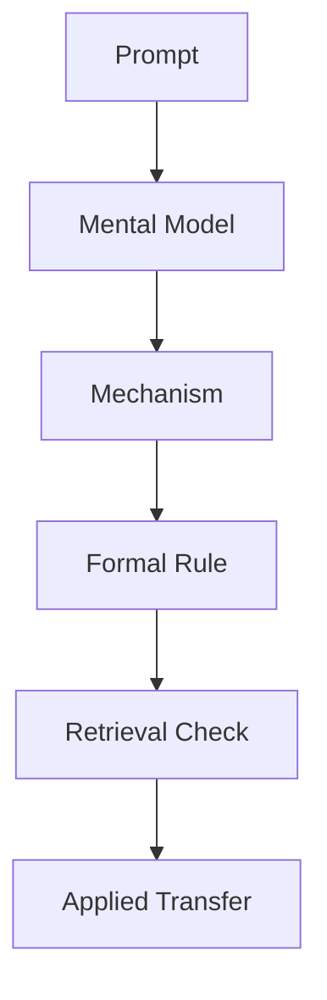

## Mental Model

Learning Working With Git Branches is like opening a precise instrument panel where every gauge represents one part of the system. The working tree is the live workspace, the index is the staging tray where intent is prepared, and the commit history is the durable record that lets a learner inspect, compare, and recover decisions instead of guessing what changed.

## How It Works

Working With Git Branches starts by isolating the smallest useful unit of understanding from the larger request: teach me about git. The concept becomes useful when the learner can explain its purpose, name the state it changes, and predict what will happen after each operation without relying on the interface. This chapter connects [[Working With Git Branches Mental Model]], [[Working With Git Branches Mechanics]], [[Working With Git Branches Practice]], and [[Working With Git Branches Failure Modes]] so the idea can move from recognition into active control. Ater treats this as one atomic note because the learner should be able to rehearse the model, the mechanism, the formal rule, and the retrieval check in one focused pass.

## Formal Model

Formally, Working With Git Branches can be modeled as a state transition over a bounded learning system. The learner begins with an input prompt, builds a mental representation, applies an operation, then checks whether the output preserves the intended invariant. The boundary condition is competence: if the learner cannot predict the next state, inspect an error, or explain the trade-off from memory, the concept is not yet stable. The model below captures the chapter loop used by Ater lessons.



## The Proving Grounds

```interactive-quiz
[
  {
    "id": "q1",
    "type": "multiple-choice",
    "difficulty": "L1",
    "question": "What makes this chapter an atomic note rather than a generic lesson page?",
    "options": ["It isolates one durable concept and includes model, mechanism, formal rule, and retrieval", "It contains a long introduction with no testable boundary", "It only stores raw HTML"],
    "answer": "It isolates one durable concept and includes model, mechanism, formal rule, and retrieval",
    "explanation": "Ater atomic notes are built for recall and transfer, so each one keeps the conceptual model, working explanation, formal structure, and quiz in the same reviewable unit."
  },
  {
    "id": "q2",
    "type": "multiple-choice",
    "difficulty": "L2",
    "question": "What should you be able to do after studying Working With Git Branches?",
    "options": ["Predict the next state and explain the trade-off from memory", "Only recognize the title when it appears", "Skip the formal model because the example felt intuitive"],
    "answer": "Predict the next state and explain the trade-off from memory",
    "explanation": "Competence means the learner can operate the concept, not just identify it. Prediction and explanation expose whether the model is usable."
  }
]
```
