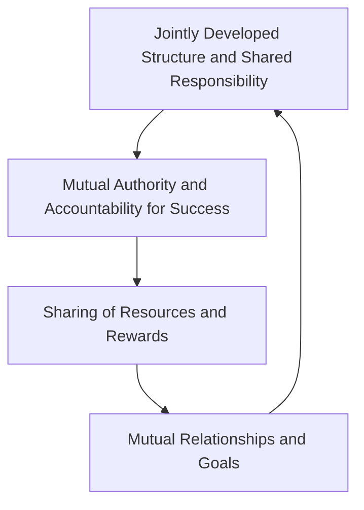

## Mental Model

Imagine a big ******Lego****** **project** where many **people** work **together** to build a huge castle. The **[[Key_Elements_Of_Collaboration]]** are like the strong connections between the Lego bricks that hold the castle together. Just as the Lego bricks need to be connected in a special way to make a sturdy structure, collaborators need to share goals, work together to create a plan, and be responsible to each other to achieve success.

## How It Works

The [[Key_Elements_Of_Collaboration]] are the essential parts that make teamwork work. They include having a shared goal and a close relationship with each other, working together to create a plan and taking shared responsibility for it, and being accountable to each other for the success of the project. This also means sharing resources and rewards with each other. When people collaborate, they make a commitment to work together in a way that helps everyone achieve their goals.

This concept is fundamentally connected to [[Collaboration_Concept]], [[Characteristics_Of_Successful_Partnerships]], and operates within the [[Collaboration_And_Partnership]] framework.

## Key Details

The [[Key_Elements_Of_Collaboration]] constitute a multifaceted framework that underpins effective teamwork and [[Stakeholder_Partnerships]] in inclusive education. This framework is characterized by a commitment to mutual relationships and goals, a jointly developed structure with shared responsibility, mutual authority and accountability for success, and the sharing of resources and rewards. These elements collectively foster a collaborative environment that is essential for achieving common objectives. The structure and responsibilities within this framework are designed to promote equity and inclusivity among all stakeholders involved.



- **Indecisive Decision-Makers**: The presence of indecisive decision-makers can hinder the collaborative process by delaying progress and creating uncertainty among stakeholders, **Miscommunication**: Miscommunication can lead to misinterpretation and confusion, undermining the effectiveness of collaboration and potentially creating conflict among team members, and **Process Sinking vs. Process Syncing**: The challenge of process sinking versus process syncing can impede collaboration, as team members may struggle to align their working methods and schedules, leading to inefficiencies and reduced productivity.

## The Proving Grounds

```interactive-quiz

[
  {
    "type": "matching",
    "question": "Match the key elements of collaboration with their definitions",
    "pairs": [
      {
        "left": "Mutual relationships and goals",
        "right": "A shared purpose and close relationship among team members"
      },
      {
        "left": "A jointly developed structure and shared responsibility",
        "right": "Collaborative planning and joint ownership of outcomes"
      },
      {
        "left": "Mutual authority and accountability for success",
        "right": "Joint decision-making and shared accountability for results"
      },
      {
        "left": "Sharing of resources and rewards",
        "right": "Equitable distribution of resources and benefits"
      }
    ],
    "explanation": "This question tests the student's understanding of the key elements of collaboration and their definitions.",
    "answer": "Correct explanation.",
    "explanation_page": 5,
    "source_pages": [
      5,
      11
    ],
    "id": "q1",
    "difficulty": "L1"
  },
  {
    "type": "scenario",
    "question": "A teacher and a community partner are working together to develop an inclusive education program. They need to ensure that their collaboration is successful. What key elements of collaboration should they prioritize to achieve their goal?",
    "answer": "The teacher and community partner should prioritize mutual relationships and goals, a jointly developed structure and shared responsibility, mutual authority and accountability for success, and sharing of resources and rewards. By doing so, they can establish a strong foundation for collaboration, ensure a shared purpose and close relationship, and work together effectively to achieve their goal.",
    "required_keywords": [
      "mutual relationships and goals",
      "jointly developed structure and shared responsibility",
      "mutual authority and accountability for success",
      "sharing of resources and rewards"
    ],
    "explanation": "This question tests the student's ability to apply the key elements of collaboration to a real-world scenario.",
    "explanation_page": 5,
    "source_pages": [
      5,
      11
    ],
    "id": "q2",
    "difficulty": "L2"
  },
  {
    "type": "writing",
    "question": "Explain how the key elements of collaboration contribute to effective teamwork and stakeholder partnerships in inclusive education. Provide specific examples to support your answer.",
    "answer": "The key elements of collaboration, including mutual relationships and goals, a jointly developed structure and shared responsibility, mutual authority and accountability for success, and sharing of resources and rewards, are essential for effective teamwork and stakeholder partnerships in inclusive education. For example, when team members have a shared goal and a close relationship, they can work together more effectively to achieve their objectives. Similarly, when stakeholders share resources and rewards, they are more likely to be invested in the success of the project. By prioritizing these key elements, educators and stakeholders can build strong partnerships and work together to create inclusive and supportive learning environments.",
    "required_keywords": [
      "mutual relationships and goals",
      "jointly developed structure and shared responsibility",
      "mutual authority and accountability for success",
      "sharing of resources and rewards"
    ],
    "explanation": "This question tests the student's ability to explain the key elements of collaboration and their contribution to effective teamwork and stakeholder partnerships in inclusive education.",
    "explanation_page": 5,
    "source_pages": [
      5,
      11
    ],
    "id": "q3",
    "difficulty": "L3"
  }
]

```