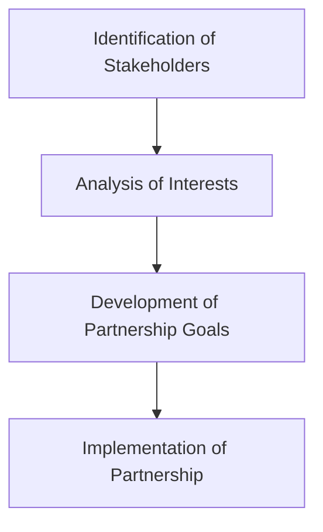

---

title: Stakeholder_Partnerships
tags: [atomic-note, education, global_trends]
course: Global_Trends
unit: "8"
semester: Winter2026
mode: EDUCATION
type: Atomic Note
hub: "[[8_Inclusive_Education_Hub]]"
source: "[[Inbox/Generated/Winter2026/Global_Trends/8.pdf]]"
date: '2026-05-29'
prerequisites:
- "[[Collaboration_Concept]]"
source_pages: [12]
generated: true
read: false

---

## Mental Model

Imagine a big ******Lego****** **castle** where **different** **people** and groups are connected to make it strong and work properly. The Lego bricks represent different stakeholders, like parents, teachers, and students, who all have a special interest in the castle's success. Just like how Lego bricks fit together to build something strong, **[[Stakeholder_Partnerships]]** connect these different groups to work together for a common goal.

## How It Works

[[Stakeholder_Partnerships]] are when different people or groups with a vested interest in something, like a school or a community program, work together to achieve a common goal. These stakeholders can be inside or outside the organization, and they all have something to gain or lose from the outcome. For example, in a special needs education program, stakeholders might include students, parents, teachers, and government agencies, all of whom have a stake in making sure the program is successful. By working together, these stakeholders can share resources and expertise to create a better outcome for everyone involved.

This concept is fundamentally connected to [[Collaboration_Concept]], [[Characteristics_Of_Successful_Partnerships]], and operates within the [[Collaboration_And_Partnership]] framework.

## Key Details

A stakeholder partnership is a collaborative relationship between two or more entities with a vested interest in the activities and outcomes of a business or organization, in this context, special needs education. Stakeholders can be internal or external to the organization and possess a vital interest in its operations. Effective [[Stakeholder_Partnerships]] are characterized by active engagement, mutual respect, and a shared commitment to achieving common goals. The success of these partnerships hinges on recognizing and understanding the diverse interests and needs of all stakeholders involved.



- **Lack of Clear Goals**: Failure to establish clear, shared goals among stakeholders can lead to misunderstandings and ineffective partnerships.
- **Insufficient Communication**: Inadequate communication among stakeholders can result in mistrust and hinder the success of partnerships.
- **Unbalanced Representation**: Unequal representation of stakeholder interests can create power imbalances, undermining the partnership's effectiveness.

## The Proving Grounds

```interactive-quiz

[
  {
    "type": "scenario",
    "question": "A special needs education program is facing challenges in providing adequate support to its students. The program involves students, parents, teachers, and the local community. How can these stakeholders work together to address the challenges and achieve a common goal?",
    "answer": "In this scenario, a successful stakeholder partnership would involve collaboration and communication among all stakeholders. The students can provide insights into their needs and preferences, the parents can offer support and resources, the teachers can provide expertise and guidance, and the local community can offer additional resources and services. By working together, they can identify the challenges, develop strategies to address them, and implement solutions that benefit the students. This partnership can lead to a more effective and sustainable support system for the students. The key is to recognize that each stakeholder has a vital interest in the program's success and to leverage their unique perspectives and strengths.",
    "required_keywords": [
      "stakeholder",
      "partnership",
      "collaboration"
    ],
    "explanation": "This question requires the application of the concept of stakeholder partnerships to a real-world scenario. It tests the ability to analyze the situation, identify the stakeholders, and understand how they can work together to achieve a common goal.",
    "explanation_page": 12,
    "source_pages": [
      12
    ],
    "id": "q1",
    "difficulty": "L1"
  },
  {
    "type": "writing",
    "question": "Describe the characteristics of successful stakeholder partnerships in the context of special needs education. What are the benefits of such partnerships, and how can they be fostered and maintained?",
    "answer": "Successful stakeholder partnerships in special needs education are characterized by collaboration, communication, and a shared commitment to achieving a common goal. The benefits of such partnerships include improved outcomes for students, increased parental involvement, and more effective use of resources. To foster and maintain these partnerships, it is essential to establish clear goals and expectations, provide opportunities for stakeholder engagement, and recognize the value and contributions of each stakeholder. By doing so, stakeholders can work together to create a supportive and inclusive learning environment that benefits all students. Key characteristics include a stake in the business, internal and external stakeholders, and a vital interest in the business or its activities.",
    "required_keywords": [
      "characteristics",
      "stakeholder",
      "partnerships"
    ],
    "explanation": "This question requires the student to demonstrate their understanding of the concept of stakeholder partnerships and its application in special needs education. It tests their ability to describe the characteristics of successful partnerships, identify the benefits, and explain how to foster and maintain them.",
    "explanation_page": 12,
    "source_pages": [
      12
    ],
    "id": "q2",
    "difficulty": "L2"
  },
  {
    "type": "true_false",
    "question": "Stakeholders in a special needs education program can only be internal to the organization.",
    "answer": false,
    "explanation": "This statement is false because stakeholders can be both internal and external to the organization. Internal stakeholders may include students, teachers, and staff, while external stakeholders may include parents, local community members, and organizations that provide support services. Recognizing that stakeholders can be both internal and external is essential for building effective partnerships.",
    "explanation_page": 12,
    "source_pages": [
      12
    ],
    "id": "q3",
    "difficulty": "L3"
  }
]

```
