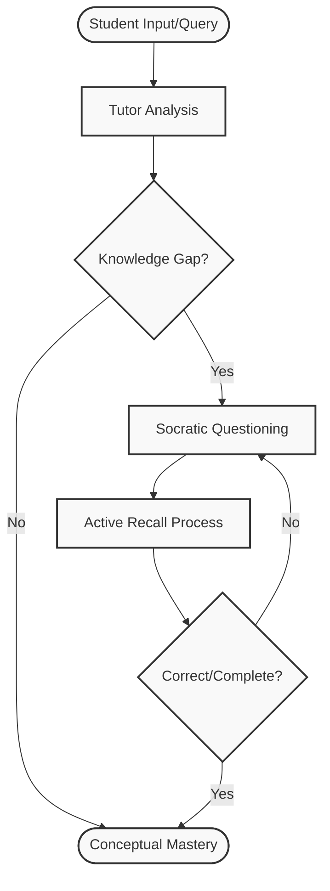

# Ultimate Learning Showcase

This note is a comprehensive visual and quantitative stress test of Ater's markdown rendering pipeline. It brings together all ten core rendering building blocks generated sequentially using the **Gemma 4 31B** model.

---

## 1. Quantitative Graphs & Plots (Monochrome Recharts)

### A. Line Chart — Supply & Demand Equilibrium
Used in microeconomics to plot supply/demand curves and identify market-clearing points.

```chart
{
  "type": "line",
  "title": "Supply and Demand Equilibrium",
  "subtitle": "Intersection of Supply and Demand curves determining equilibrium price and quantity",
  "xAxis": {
    "key": "quantity",
    "label": "Quantity"
  },
  "yAxis": {
    "key": "price",
    "label": "Price ($)"
  },
  "series": [
    {
      "key": "demand",
      "name": "Demand Curve"
    },
    {
      "key": "supply",
      "name": "Supply Curve"
    }
  ],
  "data": [
    { "quantity": 0, "demand": 10, "supply": 0 },
    { "quantity": 2, "demand": 8, "supply": 2 },
    { "quantity": 4, "demand": 6, "supply": 4 },
    { "quantity": 5, "demand": 5, "supply": 5 },
    { "quantity": 6, "demand": 4, "supply": 6 },
    { "quantity": 8, "demand": 2, "supply": 8 },
    { "quantity": 10, "demand": 0, "supply": 10 }
  ]
}
```

### B. Bar Chart — Probability PMF
Used in statistics to show probability mass distributions.

```chart
{
  "type": "bar",
  "title": "Binomial Distribution PMF",
  "subtitle": "Probability Mass Function for n=6, p=0.5",
  "xAxis": {
    "key": "k",
    "label": "Number of Successes (k)"
  },
  "yAxis": {
    "key": "probability",
    "label": "Probability P(X=k)"
  },
  "series": [
    {
      "key": "probability",
      "name": "Probability"
    }
  ],
  "data": [
    { "k": 0, "probability": 0.0156 },
    { "k": 1, "probability": 0.0938 },
    { "k": 2, "probability": 0.2344 },
    { "k": 3, "probability": 0.3125 },
    { "k": 4, "probability": 0.2344 },
    { "k": 5, "probability": 0.0938 },
    { "k": 6, "probability": 0.0156 }
  ]
}
```

### C. Area Chart — Welfare Economic Surplus
Used to visually fill and measure consumer/producer welfare surplus.

```chart
{
  "type": "area",
  "title": "Consumer and Producer Surplus",
  "subtitle": "Welfare area distribution across output ranges",
  "xAxis": {
    "key": "quantity",
    "label": "Quantity (Q)"
  },
  "yAxis": {
    "key": "price",
    "label": "Price (P)"
  },
  "series": [
    {
      "key": "cs",
      "name": "Consumer Surplus"
    },
    {
      "key": "ps",
      "name": "Producer Surplus"
    }
  ],
  "data": [
    { "quantity": 0, "cs": 100, "ps": 0 },
    { "quantity": 10, "cs": 80, "ps": 20 },
    { "quantity": 20, "cs": 60, "ps": 40 },
    { "quantity": 30, "cs": 40, "ps": 60 },
    { "quantity": 40, "cs": 20, "ps": 80 },
    { "quantity": 50, "cs": 0, "ps": 100 }
  ]
}
```

### D. Composed Chart — OLS Regression Fit
Plots raw scattered data points with a fitted regression trendline.

```chart
{
  "type": "composed",
  "title": "OLS Regression Analysis",
  "subtitle": "Scatter plot of sample points with OLS linear trendline",
  "xAxis": {
    "key": "x",
    "label": "Independent Variable (X)"
  },
  "yAxis": {
    "key": "y",
    "label": "Dependent Variable (Y)"
  },
  "series": [
    {
      "key": "points",
      "name": "Observed Data",
      "type": "scatter"
    },
    {
      "key": "line",
      "name": "Fitted OLS Line",
      "type": "line"
    }
  ],
  "data": [
    { "x": 1, "points": 1.2, "line": 1.5 },
    { "x": 2, "points": 2.8, "line": 2.5 },
    { "x": 3, "points": 3.1, "line": 3.5 },
    { "x": 4, "points": 4.9, "line": 4.5 },
    { "x": 5, "points": 5.2, "line": 5.5 }
  ]
}
```

### E. Pie Chart — Corporate Capital Allocation
Shows share percentage breakdowns of budget or capital portfolios.

```chart
{
  "type": "pie",
  "title": "Corporate Asset Allocation",
  "subtitle": "Percentage breakdown of investment portfolio",
  "xAxis": {
    "key": "x",
    "label": "Asset"
  },
  "yAxis": {
    "key": "y",
    "label": "Percentage"
  },
  "series": [
    {
      "key": "y",
      "name": "Allocation"
    }
  ],
  "data": [
    { "x": "Debt Securities", "y": 40 },
    { "x": "Equity Holdings", "y": 50 },
    { "x": "Cash Reserves", "y": 10 }
  ]
}
```

---

## 2. Structural Flowcharts (Mermaid Zoom/Pan)

This diagram maps out the socratic tutoring and active recall workflow loop. Click on the diagram to open the interactive zoom and pan modal viewer!



---

## 3. Symbolic Math & Equations (KaTeX)

Spaced repetition systems rely on FSRS (Free Spaced Repetition Scheduler) mathematical modeling. The following equations show stability and interval computations:

$$
\begin{aligned}
\text{Stability Update:} \quad S_{n} &= S_{n-1} \cdot \left(1 + \alpha \cdot \text{multiplier} \cdot e^{-\omega \cdot d}\right) \\
\text{Next Interval:} \quad I_{n} &= S_{n} \cdot \frac{\ln(R)}{\ln(0.9)}
\end{aligned}
$$

---

## 4. Code Snippets & Highlighting (Prism IDE)

```python
# Socratic Active Recall Evaluator
def calculate_next_interval(difficulty: float, stability: float, retrievability: float) -> int:
    # FSRS algorithm variables
    factor = 1.0 + (difficulty - 3.0) * 0.1
    # Check bounds
    next_stability = max(0.1, stability * factor)
    # Next interval calculation in days
    next_interval = int(next_stability * (9.0 / retrievability - 1.0))
    return max(1, next_interval)
```

---

## 5. Tabular Data (Markdown Tables)

| Variable Symbol | Description | Measurement Domain |
| :--- | :--- | :--- |
| \(Q_d\) | Quantity Demanded | Microeconomics |
| \(Q_s\) | Quantity Supplied | Microeconomics |
| \(S_t\) | Memory Stability | Spaced Repetition (SRS) |
| \(\beta_0\) | Regression Intercept | Statistics & OLS |

---

## 6. Informational Box (Callouts & Tasks)

> [!IMPORTANT]
> Quantitative analysis requires verifying both the statistical model assumptions (normality, homoscedasticity) and the economic domain boundary invariants.

- [x] Complete microeconomics supply shift review
- [ ] Practice linear regression proof steps
- [ ] Recite memory retention formula

---

## 7. Media & Note Embeddings (PDF & Note Embedding)

### Document Embed (PDF Viewer)


### Note Embed (Note Embedding)
![[Ultimate_Roadmap]]

---

## 8. Socratic Testing (Proving Grounds Quiz)

Test your understanding of the quantitative, structural, and FSRS concepts presented in this note:

```interactive-quiz
[
  {
    "id": "fsrs-stability-q",
    "type": "mcq",
    "difficulty": "L2",
    "question": "In the FSRS scheduling formula, what is the direct relationship between retrievability (R) and the next review interval (I)?",
    "options": {
      "A": "Higher retrievability results in a shorter next review interval.",
      "B": "Higher retrievability results in a longer next review interval.",
      "C": "Retrievability has no mathematical impact on the interval.",
      "D": "Interval and retrievability are completely independent of memory stability."
    },
    "answer": "B",
    "explanation": "According to the FSRS interval equation: I = S * ln(R)/ln(0.9). Since ln(R) decreases in magnitude as R approaches 1 (i.e. high recall probability), and we divide by the negative ln(0.9), a higher retrievability multiplier expands the stability interval scaling factor for reviews."
  },
  {
    "id": "ols-assumptions-tf",
    "type": "true_false",
    "difficulty": "L1",
    "question": "Ordinary Least Squares (OLS) regression requires that the relationship between the independent and dependent variables is strictly linear.",
    "options": {
      "A": "True",
      "B": "False"
    },
    "answer": "True",
    "explanation": "Linearity in parameters is a fundamental Gauss-Markov assumption required for OLS to be the Best Linear Unbiased Estimator (BLUE)."
  }
]
```
