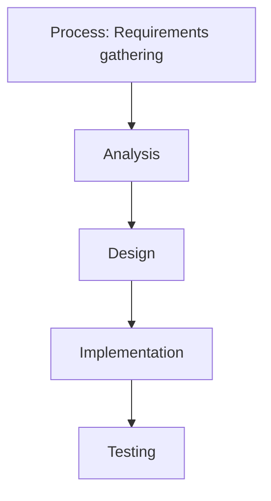

## Mental Model

Imagine a big library with millions of books, and each book represents a piece of data. System design is like planning and building the library's shelves, cataloging system, and retrieval process, so that books can be easily found, borrowed, and returned. Just as a well-designed library makes it easy for people to access the books they need, a well-designed system makes it easy for users to access the data and services they need.

## How It Works

System design is important because it helps create a plan for building a system that meets the needs of its users. A well-designed system is like a roadmap that guides the development process, ensuring that the system is efficient, reliable, and easy to use. It exists to prevent problems like data loss, slow [[Performance]], and crashes, which can happen when a system is not well thought out. By designing a system carefully, developers can ensure that it can handle a large number of users, process data quickly, and recover from failures. This makes the system more reliable, scalable, and maintainable over time.

## Key Details

System design is a crucial aspect of developing complex systems, as it enables the creation of efficient, scalable, and reliable solutions. The **importance of system design** lies in its ability to ensure that a system meets its functional and non-functional requirements, while also providing a framework for future growth and maintenance. Effective system design involves a deep understanding of the system's requirements, as well as the application of sound engineering principles and best practices. A well-designed system is essential for delivering high-quality services and products, while also minimizing the risk of errors, downtime, and security breaches.



**Inadequate Requirements Gathering**: Failure to thoroughly understand system requirements can lead to a poorly designed system that fails to meet its intended purpose, **Insufficient Scalability**: A system that is not designed to scale can become overwhelmed, leading to [[Performance]] degradation and decreased reliability, and **Inadequate Testing**: Insufficient testing can result in a system that is prone to errors and security breaches, ultimately compromising its reliability and **performance**.

---

## The Proving Grounds

```interactive-quiz
[
  {
    "type": "mcq",
    "question": "In system design, which statement best captures the role of Importance of System Design?",
    "options": {
      "A": "Importance of System Design is the focused role or mechanism being studied inside system design.",
      "B": "Importance of System Design is only a vocabulary label and has no role in examples.",
      "C": "Importance of System Design is unrelated to the surrounding process in system design.",
      "D": "Importance of System Design can be understood without identifying any input, mechanism, or result."
    },
    "answer": "A",
    "explanation": "The useful test is whether you can connect Importance of System Design to an input, mechanism, and output inside system design."
  },
  {
    "type": "true_false",
    "question": "A useful explanation of Importance of System Design should identify what starts the process, what changes, and what result follows.",
    "answer": true,
    "explanation": "Those three parts make Importance of System Design usable across examples instead of isolated as a memorized term."
  },
  {
    "type": "writing",
    "question": "Explain Importance of System Design in one concrete system design example. Include the input, mechanism, and result.",
    "answer": "A complete answer names Importance of System Design, identifies the relevant input, explains the mechanism, and states the result in the larger system design process.",
    "required_keywords": [
      "importance",
      "system",
      "design"
    ],
    "explanation": "The example checks application; the non-example checks the boundary of Importance of System Design."
  }
]
```