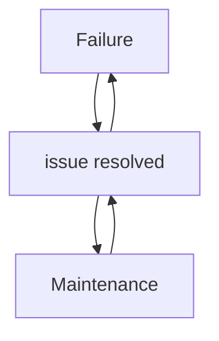

## Mental Model

Imagine a library with multiple copies of the same book. The concept of **Availability** in system design is like having many copies of a book in different libraries, so even if one library is closed or out of stock, you can still borrow the book from another library. This is similar to having multiple servers or systems in place, so if one fails, the others can take over to ensure continuous access.

## How It Works

**Availability** in system design refers to the ability of a system to remain operational and accessible to users, even in the event of hardware or software failures. It exists to ensure that users can consistently access and use the system as needed. A system achieves high **availability** by having redundant components, such as multiple servers, power supplies, or network connections, which can take over if one component fails. This way, the system can continue to function with minimal downtime, providing a better experience for users.

## Key Details

**Availability** in system design refers to the proportion of time that a system is operational and accessible to users, often measured as a percentage of uptime over a specified period. It is a critical aspect of system design as it directly impacts the user experience and the overall reliability of the system. A highly available system is one that minimizes downtime and ensures continuous access to its services. The goal of achieving high **availability** is to ensure that the system remains functional and accessible despite hardware failures, software bugs, or other disruptions. This is often achieved through [[Redundancy]], fault tolerance, and proactive maintenance.



**Single Point of Failure**: A system with a single point of failure can experience a complete outage if that component fails, impacting **availability**, **Scheduled Maintenance**: Regular maintenance can reduce availability, even if the system is designed to be highly available, as it often requires the system to be taken offline, and **Resource Constraints**: Insufficient resources (e.g., budget, personnel) can limit the implementation of high-availability features, such as [[Redundancy]] and fault tolerance.

---

## The Proving Grounds

```interactive-quiz
[
  {
    "type": "mcq",
    "question": "In system design, which statement best captures the role of Availability?",
    "options": {
      "A": "Availability is the focused role or mechanism being studied inside system design.",
      "B": "Availability is only a vocabulary label and has no role in examples.",
      "C": "Availability is unrelated to the surrounding process in system design.",
      "D": "Availability can be understood without identifying any input, mechanism, or result."
    },
    "answer": "A",
    "explanation": "The useful test is whether you can connect Availability to an input, mechanism, and output inside system design."
  },
  {
    "type": "true_false",
    "question": "A useful explanation of Availability should identify what starts the process, what changes, and what result follows.",
    "answer": true,
    "explanation": "Those three parts make Availability usable across examples instead of isolated as a memorized term."
  },
  {
    "type": "writing",
    "question": "Explain Availability in one concrete system design example. Include the input, mechanism, and result.",
    "answer": "A complete answer names Availability, identifies the relevant input, explains the mechanism, and states the result in the larger system design process.",
    "required_keywords": [
      "availability"
    ],
    "explanation": "The example checks application; the non-example checks the boundary of Availability."
  }
]
```