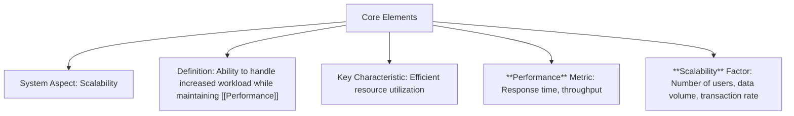

## Mental Model

Think of Scalability as a labeled part on a working machine inside system design. The label is useful only when it helps you point to the part, explain what enters it, and predict what comes out after it operates. If you cannot connect the label to a visible role in the larger system, you have memorized vocabulary but not the concept. It connects most directly to What is System Design, Key Concepts in System Design, Importance of System Design in this learning path.

## How the Process Works

**Scalability** is about how well a system can handle more work or grow without breaking or slowing down. It exists because systems need to be able to adapt to changing demands, like more users or more data. A system is scalable if it can add more resources, like computers or servers, and still work efficiently. This means that the system's components, like hardware and software, are designed to work together seamlessly, even when more are added. By doing so, the system can handle more work without getting bogged down.

## Process Details

**Scalability** refers to the ability of a system to handle increased workload or growth in usage while maintaining its [[Performance]] and efficiency. This concept is crucial in evaluating the capacity of a system to adapt to changing demands without compromising its functionality. A scalable system can efficiently manage more users, data, or transactions without experiencing significant decreases in **performance**. The **scalability** of a system is often determined by its architecture and design, which should allow for easy upgrades or additions of resources. Scalability is a key consideration in the design of systems, particularly in contexts where growth is anticipated or desired.



**Resource Bottleneck**: A system's inability to scale due to limitations in hardware resources, such as CPU, memory, or network bandwidth, **Architectural Inflexibility**: A system's design that does not allow for easy upgrades or additions of resources, hindering its ability to scale, and **Performance Degradation**: A system's decrease in [[Performance]] as it handles increased workload, indicating limitations in its **scalability**.

---

## The Proving Grounds

```interactive-quiz
[
  {
    "type": "mcq",
    "question": "In system design, which statement best captures the role of Scalability?",
    "options": {
      "A": "Scalability is the focused role or mechanism being studied inside system design.",
      "B": "Scalability is only a vocabulary label and has no role in examples.",
      "C": "Scalability is unrelated to the surrounding process in system design.",
      "D": "Scalability can be understood without identifying any input, mechanism, or result."
    },
    "answer": "A",
    "explanation": "The useful test is whether you can connect Scalability to an input, mechanism, and output inside system design."
  },
  {
    "type": "true_false",
    "question": "A useful explanation of Scalability should identify what starts the process, what changes, and what result follows.",
    "answer": true,
    "explanation": "Those three parts make Scalability usable across examples instead of isolated as a memorized term."
  },
  {
    "type": "writing",
    "question": "Explain Scalability in one concrete system design example. Include the input, mechanism, and result.",
    "answer": "A complete answer names Scalability, identifies the relevant input, explains the mechanism, and states the result in the larger system design process.",
    "required_keywords": [
      "scalability"
    ],
    "explanation": "The example checks application; the non-example checks the boundary of Scalability."
  }
]
```